# خواننده تلگرام

<!-- TOP_NAV START -->

<!-- TOP_NAV END -->

<!-- MSG START -->

---
📅 بروزرسانی: 1405/02/24 16:35
---

## iranintlTV — post 337168

  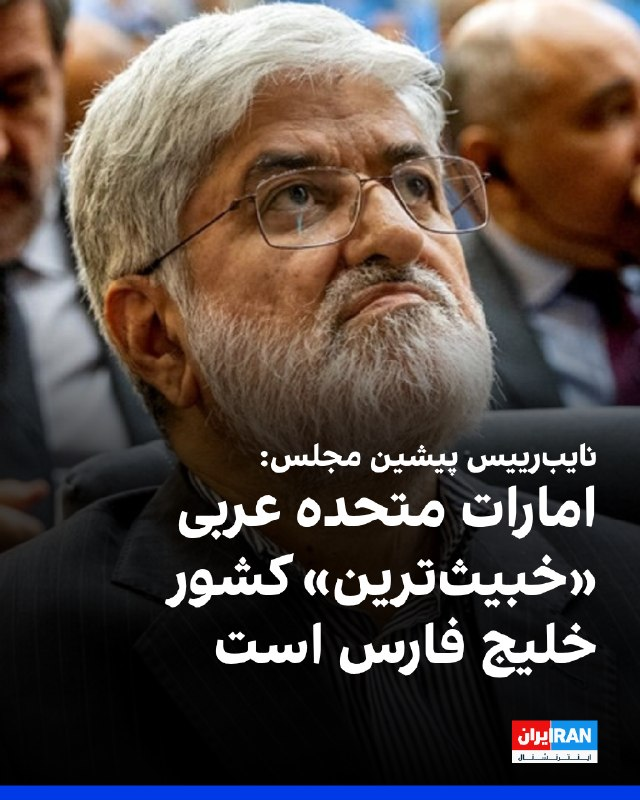

علی مطهری، نایب‌رییس پیشین مجلس، گفت: «امارات متحده عربی خبیث‌ترین کشور خلیج فارس است و به اسرائیل نزدیک شده است.»
او افزود: «اتکای امارات به حمایت آمریکا باعث شده علیه جمهوری اسلامی موضع‌گیری کند و در صورت تضعیف موقعیت آمریکا، امارات نیز سر عقل خواهد آمد.»
https://iranintl.com/202605145020

## iranintlTV — post 337167

  <a href="telegram/content/iranintlTV_337167_1778763924.mp4" target="_blank">🎬 Download video</a>

دیدار دونالد ترامپ با شی جین‌پینگ، واکنش گسترده کاربران رسانه‌های اجتماعی را به همراه داشته است. کاربران علاوه‌بر ابعاد سیاسی و اقتصادی، به حاشیه‌های این سفر از جمله زبان بدن دو رهبر، حضور مارکو روبیو در هیات آمریکایی و موضوع رقابت تکنولوژیک واکنش نشان داده‌اند.
عادله بورنگ، عضو تحریریه ایران‌اینترنشنال، از واکنش کاربران می‌گوید
@iranintltv

## iranintlTV — post 337166

🗣روایت شما از بحران اقتصادی و زندگی در آتش‌بس- پنج‌شنبه ۲۴ اردیبهشت:

🔹این چند وقت فشار روانی زیادی بر دانش‌آموزان بوده و در کمال ناباوری، آموزش و پرورش تصمیم به حضوری بودن امتحانات گرفته. از والدین محترم می‌خوام شرایط روانی فرزندان‌شون رو درک و اگر می‌تونن اعتراضی کنن.

🔹از شهسوار: زندگی برای خیلی از ما سخت شده؛ گرونی، فشارهای روزمره و نگرانی از آینده هر روز بیشتر حس می‌شه. این چیزیه که خیلی‌هامون داریم تجربه‌اش می‌کنیم و امیدوارم صدامون شنیده بشه.

🔹از شیراز: مرغ کیلویی ۵۰۰ هزار تومان، برنج کیلویی ۲۷۰ هزار تومان و تخم‌مرغ دانه‌ای ۲۲ هزار تومان. من که ۱۵ میلیون تومان حقوقمه چطوری می‌تونم زندگی کنم؟

🔹بعد از ۳۷ سال زندگی، با ۱۶ سال سابقه کار تخصصی در زمینه تحصیلاتم (کارشناسی ارشد مکانیک جامدات) و درآمدی که تازه در مقایسه با بقیه مشاغل نسبتا خوب محسوب می‌شه، هیچ امیدی به آینده ندارم. حقوقم فقط خرج روزمره زندگیم می‌شه.

🔹چهارشنبه رفتم بنزین بزنم. با کارت خودم نتونستم، چون سهمیه شخصی تموم شده بود. مسئول جایگاه هم فقط در صورتی کارت آزاد می‌داد که به خودش مستقیم پول بدیم. ۱۵ لیتر بیشتر هم نمیدن و هر لیتری به قیمت ۷ هزار تومان.

🔹قیمت یک پیتزا خانواده در تهران دست‌کم یک میلیون تومان شده؛ یعنی حدود ۵ دلار. در صورتی که درآمد خیلی از خانوارها از ۶۰ دلار در ماه شروع می‌شه. این یک مثال از قدرت خرید مردم در پایتخت بود.

🔹جمهوری اسلامی هیچ‌وقت معیشت مردم براش مهم نبود و حتی خیریه‌ها و موسسه‌های مردم‌نهاد و مستقل رو از بین برد تا همه وابسته به خودش باشن و همه‌چیز رو کنترل کنه.

🔹۲۶ سالمه و فروشگاه پوشاک داشتم. ۴ سال پیش تمام طلاهای مادرم رو فروختم برای راه‌اندازی بوتیک. امسال ورشکست شدم. غم و استرس بیکاری داره نابودم می‌کنه.

🔹 پدرم ۳۲ سال در مخابرات کار کرد و بازنشسته شده است. الان نزدیک یک سال و ۲ ماه هست که سنوات بازنشستگیش را ندادن. این وضعیت برای یک بازنشسته که کل زندگیش را برای کار گذاشته، مناسب نیست.

## iranintlTV — post 337165

  

یسرائیل کاتز، وزیر دفاع اسرائیل در یک سخنرانی گفت که ماموریت ارتش این کشور درباره ایران کامل نشده و برای این احتمال آماده است که شاید دوباره ناچار به اقدام شود.
یسرائیل کاتز تاکید کرد: «اگر اهداف‌مان تامین نشود، دوباره اقدام خواهیم کرد.»

پیش از این نیز ایال زمیر، رییس ستاد کل ارتش اسرائیل، گفته بود که «نبرد به پایان نرسیده و ارتش برای ازسرگیری جنگ در صورت نیاز آماده است.»
https://iranintl.com/202605143284

## iranintlTV — post 337164

  

مصطفی نخعی، عضو کمیسیون انرژی مجلس گفت: «ما با کسری بنزین مواجهیم و قبل از جنگ هم کمبود بنزین وجود داشت و روزانه حدود ۲۰ میلیون لیتر کسری بنزین داشتیم که باید با واردات جبران می‌کردیم.»

او ادامه داد: «سناریوهای مختلفی در خصوص بنزین در دولت در حال بررسی است اما هنوز سناریویی قطعی نشده است.»

این نماینده مجلس ادامه داد: «درحال حاضر یا سهمیه باید کاهش یابد یا از ابزار قیمتی استفاده شود که حداقل مجلس چندان موافق این موضوع نیست.»
https://iranintl.com/202605148048

## iranintlTV — post 337163

  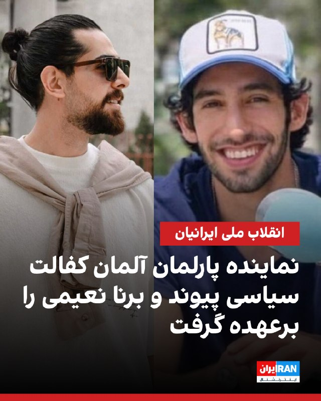

🔻توماس راشل، نماینده دولت فدرال آلمان در امور آزادی دین و عضو پارلمان این کشور، رسماً کفالت سیاسی پیوند و برنا نعیمی را بر عهده گرفت. این دو جوان ورزشکار بهایی که با اتهامات سنگین و خطر اعدام روبه‌رو هستند، به نمادی از سرکوب جامعه ورزشی و اقلیت‌های مذهبی در ایران بدل شده‌اند.

🔹به گزارش انجمن «زن، زندگی، آزادی» در آلمان، پیوند نعیمی، ورزشکار رشته شنا و واترپلو از ژانویه ۲۰۲۶ در بازداشتگاه‌های سپاه تحت شدیدترین شکنجه‌ها قرار گرفته است و اعترافات اجباری او از صداوسیما پخش شده است.

🔹به گزارش این انجمن حقوق بشری، برنا نعیمی، کاراته‌کا و پدر یک فرزند خردسال، پس از تحمل شوک الکتریکی و «اعدام‌های نمایشی»، مجبور به امضای اعترافاتی علیه خود و پسرعمویش، پیوند نعیمی شده است.

🔹پیش‌تر، جامعه جهانی بهائی در بیانیه‌ای نوشت که پیوند و برنا نعیمی در حالی به دخالت در حوادث اعتراضات دی‌ماه متهم شده‌اند که مدارک نشان می‌دهد پیوند در زمان وقوع حادثه در بازداشت بوده است. این دو ورزشکار بدون دسترسی به دادگاه عادلانه، تحت شکنجه‌های غیرانسانی برای پذیرش اتهامات ساختگی قرار دارند.

@iranintltvsport

## iranintlTV — post 337162

  

ایرنا، خبرگزاری رسمی دولت جمهوری اسلامی در گزارشی نوشت: «میزان ذخایر سدهای تهران نسبت به سال گذشته ۴۵ میلیون مترمکعب کاهش یافته و حجم آب موجود در پنج سد اصلی پایتخت افت قابل توجهی داشته است.»

معاون شرکت آب منطقه‌ای تهران نیز با اشاره به اینکه مخازن تنها حدود ۶۰ درصد ظرفیت نرمال را پر کرده‌اند، هشدار داد که پایتخت همچنان با شرایط خشکسالی مواجه است.
https://iranintl.com/202605149178

## iranintlTV — post 337161

  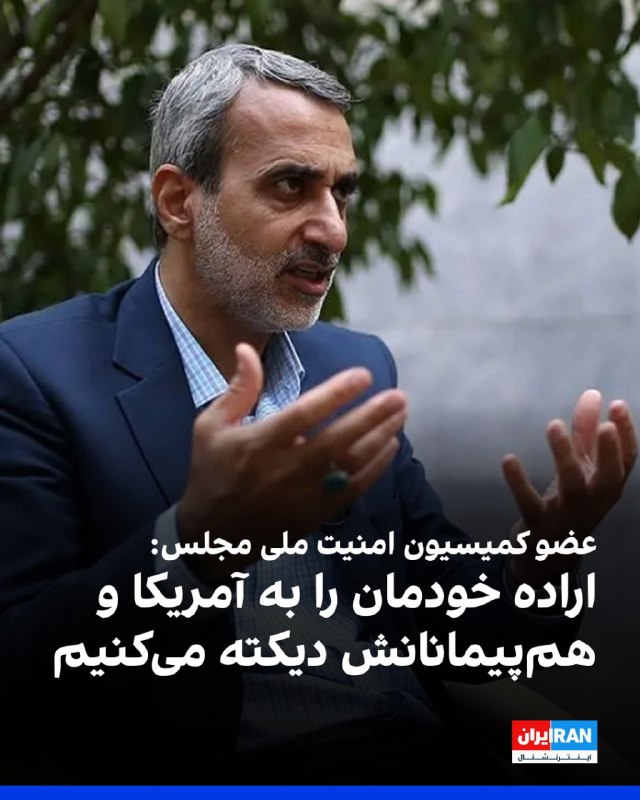

عباس مقتدایی، نایب رییس کمیسیون امنیت ملی مجلس گفت: «ما آنچه را اراده کنیم، به آمریکا و هم‌پیمانانش دیکته می‌کنیم، چرا که حاکمیت بر خلیج فارس، تنگه هرمز و دریای عمان موضوعی ذاتی و متعلق به کشور ماست.»
او افزود: «ترامپ نشان داد که باور به اینکه انسان‌ها می‌توانند از گرگ نیز بدتر و پلیدتر باشند، باوری ریشه‌دار، عمیق و واقعی است.»

او ادامه داد: «با آمادگی دفاعی می‌توانیم سایه جنگ را از سر کشور برداریم و با ایجاد انتظام در تنگه هرمز، این شاهراه حیاتی جهانی را که از نظر اقتصادی و سیاسی اهمیت بالایی دارد، به‌عنوان اهرمی برای دستیابی به حقوق ایران مورد بهره‌برداری قرار دهیم.»
iranintl.com/202605140403

## iranintlTV — post 337160

  

محمدرضا عارف، معاون اول مسعود پزشکیان، گفت که تنگه هرمز مال ماست؛ ملک ما بوده و مدتی از ملک‌مان خوب استفاده نمی‌کردیم.

او افزود: «ما به هیچ قیمتی کنترل تنگه هرمز را از دست نخواهیم داد.» عارف ادامه داد: «در جنگ هر کس روایت تولید کرد، پیروز خواهد شد.»
iranintl.com/202605143228

## iranintlTV — post 337159

  <a href="telegram/content/iranintlTV_337159_1778763929.mp4" target="_blank">🎬 Download video</a>

سرخط خبرهای پنجشنبه ۲۴ اردیبهشت
@iranintltv

## iranintlTV — post 337158

  <a href="telegram/content/iranintlTV_337158_1778763930.mp4" target="_blank">🎬 Download video</a>

ایران‌اینترنشنال از همه افرادی که درباره وقایع بیمارستان الغدیر تهران در ۱۸ و ۱۹ دی‌ماه شواهد، اسناد یا اطلاعاتی دارند خواسته است از طریق بات اینتل‌مدیا، اطلاعات خود را ارسال کنند.

جزییات بیشتر در گفت‌وگو با فرنوش فرجی، عضو تحریریه ایران‌اینترنشنال
@iranintltv

## iranintlTV — post 337157

  <a href="telegram/content/iranintlTV_337157_1778763932.mp4" target="_blank">🎬 Download video</a>

فیلم «داستان‌های موازی» ساخته اصغر فرهادی، به‌طور رسمی در بخش مسابقه اصلی جشنواره کن به نمایش درمی‌آید. سینمای مستقل، مهاجرت، تبعید و حضور فیلمسازان ایرانی در بخش‌های مختلف، از محورهای مورد توجه جشنواره امسال است.
لی‌لی نیکفر، خبرنگار ایران‌اینترنشنال، گزارش می‌دهد
@iranintltv

## iranintlTV — post 337156

  

حسینعلی حاجی‌دلیگانی، عضو هیات رییسه مجلس، گفت که ادامه مذاکره با آمریکا اشتباه است و افزود واشینگتن برای آتش‌بس اصرار داشته و به دنبال خرید زمان با اهداف داخلی و انتخاباتی بوده است.

حاجی‌دلیگانی افزود: «خطوط فیبر نوری عبوری از بستر تنگه هرمز نیز باید شامل عوارض سالانه باشند.»

او گفت: «کل تنگه هرمز در حوزه سرزمینی ایران قرار می‌گیرد و مدیریت آن باید در اختیار جمهوری اسلامی باشد.»
iranintl.com/202605145331

## iranintlTV — post 337154

🔻بازدید مسعود پزشکیان، رئیس دولت جمهوری اسلامی و احمد دنیامالی، وزیر ورزش و جوانان از مجموعه ورزشی آزادی.

🔹در هفته اول جنگ، ایران‌اینترنشنال گزارش داد که پس از آغاز حملات اسرائیل و آمریکا در نهم اسفندماه، به کارکنان و پرسنل فدراسیون‌ها و مراکز مستقر در مجموعه ورزشی آزادی در تهران دستور داده شد  ساختمان‌ها و سالن‌های ورزشی این مجموعه را تخلیه کنند.

🔹طبق این اطلاعات، پس از تخلیه کارکنان، نیروهای حکومتی از جمله یگان ویژه و بسیج در بخش‌های مختلف این مجموعه مستقر شدند.

🔹پس از این ماموران در سالن‌های مختلف از جمله ورزشگاه ۱۲ هزار نفری آزادی و همچنین سالن‌ها و ساختمان‌های متعلق به فدراسیون‌های ورزشی از جمله کشتی، والیبال، بسکتبال و وزنه‌برداری مستقر شدند.

🔹در پی این اقدامات، سالن ۱۲ هزار نفری ورزشگاه آزادی در حملات هوایی روز پنجشنبه ۱۴ اسفند ۱۴۰۴، تخریب شد.

@iranintltvsport

## iranintlTV — post 337153

  <a href="telegram/content/iranintlTV_337153_1778763934.mp4" target="_blank">🎬 Download video</a>

بیمارستان الغدیر تهران شامگاه ۱۸ و ۱۹ دی‌ماه، شاهد گوشه‌ای از جنایتی بود که جمهوری اسلامی علیه معترضان مرتکب شد. ده‌ها پیکر بی‌جان و شمار زیادی از مجروحان به این بیمارستان منتقل شدند و به دلیل کمبود فضای سردخانه، تعدادی از کشته‌شدگان، پتوپیچ در حیاط پشت بیمارستان رها شدند. ایران‌اینترنشنال با هدف روشن کردن ابعاد جنایت در بیمارستان الغدیر تهران در ۱۸ و ۱۹ دی‌ماه، کارزاری مردمی برای شناسایی جاویدنامانی که به این بیمارستان منتقل شده بودند راه‌اندازی کرده و تاکنون هویت ۹ نفر از آن‌ها را شناسایی کرده است.
از همه افرادی که درباره وقایع بیمارستان الغدیر تهران شواهد، اسناد یا اطلاعاتی دارند می‌خواهیم از طریق بات اینتل‌مدیا، اطلاعات خود را ارسال کنند و راوی حقیقت باشند.

گزارش آبتین یزدان‌پناه، خبرنگار ایران‌اینترنشنال
@iranintltv

## iranintlTV — post 337152

  

دانشجویان متحد گزارش داد متین زمانیان، دانشجوی کارشناسی علوم سیاسی دانشگاه آزاد تهران مرکز، با گذشت بیش از یک‌ماه از بازداشت، در زندان تهران بزرگ نگهداری می‌شود.

بنا بر این گزارش متین زمانیان در طول دوران بازداشت، از حق دسترسی به وکیل مستقل و دادرسی عادلانه محروم مانده است.
iranintl.com/202605143017

---
📅 بروزرسانی: 1405/02/24 14:42
---

## iranintlTV — post 337151

  

اسکات بسنت، وزیر خزانه‌داری آمریکا، گفت هم‌زمان با سفر دونالد ترامپ به پکن، انتظار می‌رود چین سفارش‌های بزرگی برای خرید هواپیما از شرکت بوئینگ ثبت و اعلام کند.

به گفته او، مذاکرات میان واشینگتن و پکن علاوه بر صنعت هوانوردی، حوزه‌هایی مانند انرژی و محصولات کشاورزی را نیز در بر خواهد گرفت.

بسنت همچین به مناقشه تایوان پرداخت و افزود: «ترامپ حساسیت‌های مربوط به این موضوع را درک می‌کند.»

به گفته وزیر خزانه‌داری آمریکا، ترامپ «در روزهای آینده» درباره این مساله صحبت خواهد کرد.
https://iranintl.com/202605141039

## iranintlTV — post 337150

«#چشم‌انداز با مهدی مهدوی‌آزاد»؛ شنبه تا چهارشنبه ساعت ۲۱:۰۰ تهران

بررسی آخرین رویدادهای سیاسی، فرهنگی و اجتماعی با حضور کارشناسان.
@iranintltv

## iranintlTV — post 337149

  

دونالد ترامپ، رییس‌جمهوری آمریکا، پس از سخنان شی جین‌پینگ در ضیافت رسمی در پکن پشت تریبون رفت و از استقبال انجام‌شده قدردانی کرد. او استقبال از خود در پکن را «افتخاری بزرگ» توصیف کرد و از شی جین‌پینگ «برای این استقبال باشکوه» تشکر کرد.

ترامپ گفت: «امروز گفت‌وگوها و دیدارهای بسیار مثبت و سازنده‌ای با هیات چینی داشتیم و این ضیافت نیز فرصتی ارزشمند است تا در جمع دوستان درباره برخی از موضوعاتی که امروز مطرح کردیم گفت‌وگو کنیم.»

رییس‌جمهوری آمریکا همچنین روابط ایالات متحده و چین را «یکی از تاثیرگذارترین روابط در تاریخ بشر» خواند.

## iranintlTV — post 337148

  

عترشی جین‌پینگ، رهبر چین، در آغاز ضیافت شام رسمی با دونالد ترامپ با بلند کردن جام خود به او و هیات آمریکایی خوشامد گفت و بر ضرورت همکاری میان دو کشور تاکید کرد. رهبر چین تاکید کرد: «دو کشور ما باید شریک باشند، نه رقیب.»

شی در سخنان خود به سال ۲۰۲۶ به عنوان دویست‌وپنجاهمین سالگرد اعلامیه استقلال آمریکا اشاره کرد و گفت: «مردم چین و ایالات متحده هر دو ملت‌های بزرگی هستند.»

او افزود: «تحقق احیای بزرگ ملت چین و عظمت دوباره آمریکا می‌تواند همزمان پیش برود. ما می‌توانیم به موفقیت یکدیگر کمک کنیم و رفاه کل جهان را ارتقا دهیم.»

## iranintlTV — post 337147

  

فاطمه وحدت، نایب‌رییس اتحادیه زنان کارگر سراسر ایران گفت: «نشانه‌های گسترش فقر در جامعه مشهود است. این روزها آدم‌ها را می‌بینیم که حتی برای خرید نان دچار مشکل هستند. این‌ها نشانه‌های کوچکی نیستند. شاید ساده به نظر برسند، اما اگر جدی گرفته نشوند، بعدها به معضل بزرگ اجتماعی تبدیل می‌شوند.»

او افزود: «در شرایط بحرانی، زنان کارگر بیش از دیگران در معرض اخراج قرار می‌گیرند؛ به‌ویژه زنانی که سرپرست خانوار هستند و مسئولیت مستقیم تامین معاش خانواده را برعهده دارند، در اثر این اخراج بیشترین آسیب را متحمل می‌شوند.»

وحدت ادامه داد: «همه از این شرایط خبر دارند، اما مسئله این است که نظارت جدی وجود ندارد.»
https://iranintl.com/202605143396

## iranintlTV — post 337146

  

اسکات بسنت، وزیر خزانه‌داری آمریکا گفت بازگشایی تنگه هرمز به نفع چین است و پکن هر کاری بتواند برای بازگشایی این آبراه انجام خواهد داد.

او در مصاحبه با سی‌ان‌بی‌سی تاکید کرد چین پشت صحنه و تا جایی که بر جمهوری اسلامی نفوذ داشته باشد، برای بازگشایی تنگه هرمز همکاری خواهد کرد.
https://iranintl.com/202605140954

## iranintlTV — post 337145

  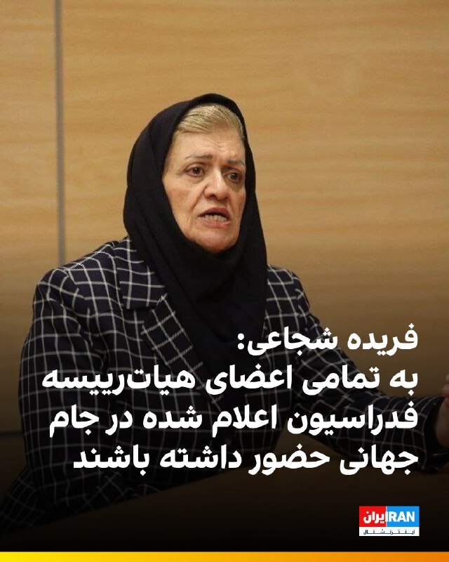

🔻فریده شجاعی، نایب‌رییس بانوان فدراسیون فوتبال، در مراسم بدرقه تیم ملی در شامگاه چهارشنبه ۲۳ اردیبهشت گفت: «به تمامی اعضای هیات‌رییسه فدراسیون فوتبال اعلام شده در جام جهانی حضور داشته باشند.»

🔹صحبت‌های شجاعی در حالی مطرح می‌شد که تیم ملی در فاصله کمتر از یک ماه تا آغاز جام‌جهانی با بحران ویزا و چالش مالی روبه‌رو است. هنوز ویزای ملی‌پوشان صادر نشده و کادر فنی نمی‌داند کدام بازیکن ویزا خواهد گرفت و به کدام بازیکن ویزا نخواهند داد.

🔹احتمال دارد برای برخی اعضای کاروان ایران به دلیل سوابق فعالیت یا ارتباط با سپاه پاسداران، ویزا صادر نشود.
@iranintltvsport

## iranintlTV — post 337143

  

خبرگزاری فارس، وابسته به سپاه پاسداران به نقل از «منبع آگاه» نوشت: «با تصمیم جمهوری اسلامی، عبور شماری از کشتی‌های چینی از تنگه هرمز، از شامگاه چهارشنبه، ۲۳ اردیبهشت و پس از توافق بر سر پروتکل‌های مدیریت جمهوری اسلامی بر این آبراه آغاز شده است.»

بر اساس این گزارش، این تصمیم پس از پیگیری‌های مقام‌های چین و در چارچوب «روابط راهبردی» تهران و پکن اتخاذ شد و کشتی‌های مورد درخواست چین اجازه عبور یافتند.
https://iranintl.com/202605149673

## iranintlTV — post 337142

  <a href="telegram/content/iranintlTV_337142_1778757163.mp4" target="_blank">🎬 Download video</a>

همزمان با موج تازه بیکاری در شرایط جنگی و بحران اقتصادی، آمارهای رسمی نشان می‌دهد حدود ۲۰۰ هزار نفر متقاضی دریافت بیمه بیکاری هستند. روزنامه شرق در گزارشی نوشت روند دریافت بیمه بیکاری از سازمان تامین اجتماعی به مسیری دشوار برای متقاضیان تبدیل شده است.
گفت‌وگو با اشکان نظام‌آبادی، روزنامه‌نگار اقتصادی
@iranintltv

## iranintlTV — post 337141

  

عباس عراقچی، وزیر خارجه جمهوری اسلامی که برای شرکت در اجلاس بریکس، به دهلی نو سفر کرده، گفت: «امارات متحده عربی مستقیما در جنگ علیه ما دخیل بود.»
او خطاب به اماراتی‌ها گفت: «ائتلاف با اسرائیل هم از شما محافظت نکرد.»

عراقچی ادامه داد: «اماراتی‌ها اجازه دادند از سرزمین‌شان برای شلیک توپخانه و تجهیزات علیه ما استفاده شود.»

وزیر خارجه جمهوری اسلامی افزود: «امارات متحده عربی شریک فعال جنگ علیه ماست و هیچ تردیدی در این باره وجود ندارد و ما شگفت‌زده شدیم که برادران ما در امارات متحده عربی تصمیم گرفتند فعالانه به جنگ علیه ما بپیوندند.»

عراقچی تاکید کرد: «همدستی امارات متحده عربی با اسرائیل غیرقابل بخشش است.»
https://iranintl.com/202605148778

## iranintlTV — post 337140

  <a href="telegram/content/iranintlTV_337140_1778757165.mp4" target="_blank">🎬 Download video</a>

اظهارات و گزارش‌های رسمی چین و آمریکا حاکی است دونالد ترامپ و شی جین‌پینگ، رهبران دو کشور، در دیدار کلیدی خود در پکن درباره ایران گفت‌وگو کرده‌اند.

توماج طاهباز، خبرنگار ایران‌اینترنشنال، گزارش می‌دهد
@iranintltv

## iranintlTV — post 337139

  <a href="telegram/content/iranintlTV_337139_1778757167.mp4" target="_blank">🎬 Download video</a>

کاخ سفید اعلام کرد در جریان سفر دونالد ترامپ و دیدار او با شی‌ جین‌پینگ در پکن، روسای جمهور آمریکا و چین بر ممنوعیت دستیابی جمهوری اسلامی به سلاح هسته‌ای توافق کردند.
گفت‌وگو با عطا محامد، کارشناس روابط بین‌الملل
@iranintltv

## iranintlTV — post 337138

در این قسمت چرتکه، محمد ماشینچیان سناریوهای مختلف قدرت خرید را تا پایان سال ۱۴۰۵ بررسی کرده و تاثیر نوسان نرخ دلار بر معیشت خانوارها را توضیح می‌دهد.
هنگام بررسی قدرت خرید حداقل دستمزد از ۱۳۹۴ تا ۱۴۰۵ در می‌یابیم که از ۹۷ به این سو، حتی وقتی قدرت خرید کارگر در ابتدای سال، حدود ۱۳۰ دلار بوده، مثل ۱۴۰۱ و ۱۴۰۴، در نتیجه تورم و بالا رفتن دلار، قدرت خرید تا پایان سال، به زیر ۱۰۰ دلار رسیده است.

تماشای نسخه کامل «چرتکه» در یوتیوب:
https://youtu.be/1W2RoMvSqPQ
@iranintltv

## iranintlTV — post 337137

  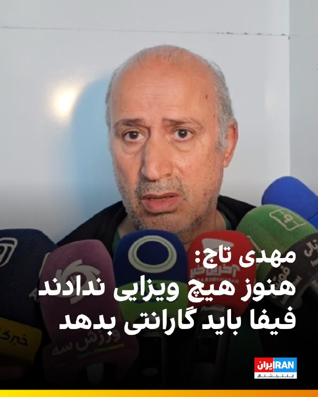

🔻مهدی تاج، رییس فدراسیون فوتبال، پنج‌شنبه ۲۴ اردیبهشت، در حاشیه اهدای جام قهرمانی فوتسال زنان به استقلال گفت: «فردا یا پس‌فردا در ترکیه جلسه سرنوشت‌سازی با فیفا داریم، چون باید به ما گارانتی بدهند. مساله ویزا حل نشده و هنوز هیچ ویزایی ندادند. منتظریم ببینیم رفتار طرف مقابل چیست.»

🔹فدراسیون فوتبال در فاصله کمتر از یک ماه تا آغاز جام‌جهانی با بحران ویزا و چالش مالی دست‌به‌گریبان است. امیر قلعه‌نویی هنوز نمی‌داند کدام بازیکن ویزا خواهد گرفت و کدام بازیکن را در آمریکا در اختیار خواهد داشت.

🔹احتمال دارد برای برخی اعضای کاروان ایران به دلیل سوابق فعالیت یا ارتباط با سپاه پاسداران، ویزا صادر نشود.
@iranintltvsport

## iranintlTV — post 337136

  <a href="telegram/content/iranintlTV_337136_1778757169.mp4" target="_blank">🎬 Download video</a>

شهروندان با ارسال پیام‌های متعدد به ایران‌اینترنشنال از افزایش بیکاری، دشواری پیدا کردن شغل در شهرهای مختلف و مشکلات معیشتی ناشی از آن در ایران خبر دادند.
@iranintltv

## iranintlTV — post 337135

  <a href="telegram/content/iranintlTV_337135_1778757170.mp4" target="_blank">🎬 Download video</a>

دفتر نخست‌وزیری اسرائیل چهارشنبه گزارش داد بنیامین نتانیاهو، نخست‌وزیر اسرائیل، در جریان عملیات «غرش شیران» به‌صورت محرمانه به امارات سفر کرده است. به گفته مقام‌های اسرائیلی، این سفر به گشایشی تاریخی در روابط دو طرف منجر شده است. وزارت خارجه امارات گزارش‌ها درباره این سفر را تکذیب کرده است.

ارزیابی محمدجواد اکبرین، عضو تحریریه ایران‌اینترنشنال
@iranintltv

## iranintlTV — post 337134

  <a href="telegram/content/iranintlTV_337134_1778757172.mp4" target="_blank">🎬 Download video</a>

سازمان عملیات تجارت دریایی بریتانیا اعلام کرد یک کشتی که در ۷۰ کیلومتری شمال شرقی بندر فجیره لنگر انداخته بود، توقیف شده و اکنون به سمت آب‌های ایران در حرکت است.
جزییات بیشتر با مرتضی کاظمیان، عضو تحریریه ایران‌اینترنشنال
@iranintltv

## iranintlTV — post 337133

  <a href="telegram/content/iranintlTV_337133_1778757173.mp4" target="_blank">🎬 Download video</a>

شی جین‌پینگ، رهبر چین، در دیدار با دونالد ترامپ، رییس‌جمهوری ایالات متحده، گفت همواره باور داشته که «چین و آمریکا منافع مشترک بیشتری نسبت به اختلافاتشان دارند». او همچنین بر اهمیت ثبات روابط پکن و واشینگتن برای دو کشور و جهان تاکید کرد.
@iranintltv

---
📅 بروزرسانی: 1405/02/24 12:20
---

## iranintlTV — post 337132

  <a href="telegram/content/iranintlTV_337132_1778748646.mp4" target="_blank">🎬 Download video</a>

مراسم بدرقه تیم فوتبال ایران برای حضور در جام جهانی ۲۰۲۶، در حضور حامیان حکومت برگزار و همزمان از پیراهن جدید این تیم رونمایی شد.
گفت‌وگو با مزدک میرزایی، عضو تحریریه ایران‌اینترنشنال
@iranintltv

## iranintlTV — post 337131

  

منوچهر متکی، نماینده مجلس و وزیر خارجه پیشین جمهوری اسلامی، گفت برخی از پهپادهایی که به ایران حمله کردند متعلق به امارات متحده عربی بوده است. او تاکید کرد که «حجت بر تمام کشورهای منطقه تمام شده است.»

متکی گفت: «برخی از پهپادهایی که به ایران زده می‌شد پهپادهای امارات متحده عربی بود و قابل کتمان نیست. این اطلاعات نزد ما است.»

متکی با اشاره به روابط جمهوری اسلامی با کشورهای منطقه گفت: «یک مسئله‌ای داریم که در ۴۷ سال گذشته تحت تاثیر دیگران، کشورهای منطقه روابط صادقانه و خوبی با ما نداشتند. اما ما حسن همسایگی را رعایت کردیم.»
https://iranintl.com/202605141340

## iranintlTV — post 337130

  

زمین‌لرزه‌ای به بزرگی ۵ منطقه بردسیر در استان کرمان را لرزاند. این زمین‌لرزه در عمق ۸ کیلومتری زمین رخ داد. جزییات بیشتری درباره خسارات احتمالی یا تلفات این زمین‌لرزه منتشر نشده است.
https://iranintl.com/202605149083

## iranintlTV — post 337129

  

🔻امیرمهدی علوی، سخنگوی فدراسیون فوتبال، درباره آخرین وضعیت صدور ویزا برای کاروان اعزامی ایران به جام‌جهانی گفت: «کارهای اداری ویزا را در امارات انجام دادیم و حالا منتظر پاسخ هستیم. با این حال، در صورت صادر نشدن ویزا برای برخی بازیکنان، اعضای کادر فنی گزینه‌های مختلفی دارند و بازیکنان جایگزین پیش‌بینی شده‌اند.»

🔹او همچنین به جلسه رییس فدراسیون فوتبال با مقامات فیفا اشاره کرد و گفت: «در ۴۸ ساعت آینده جلسه رییس فدراسیون با مقامات فیفا در ترکیه برگزار می‌شود و درباره ۱۰ مورد از خواسته‌های ما صحبت خواهیم کرد که نخستین مورد آن، بحث صدور ویزا است.»

🔹در فاصله کمتر از یک ماه تا آغاز جام‌جهانی، تیم ایران همچنان درگیر دریافت ویزای آمریکا است و این موضوع به بحرانی برای کادر فنی تبدیل شده است. احتمال دارد برای برخی اعضای کاروان ایران به دلیل سوابق فعالیت یا ارتباط با سپاه پاسداران، ویزا صادر نشود.
@iranintltvsport

## iranintlTV — post 337128

  <a href="telegram/content/iranintlTV_337128_1778748649.mp4" target="_blank">🎬 Download video</a>

وضعیت بحرانی دارو، به‌ویژه گرانی و کمبود داروهای خاص در ایران، تشدید شده است. ایلنا، خبرگزاری کار ایران، گزارش داد کمبود برخی داروهای سرطان و افزایش شدید قیمت آن‌ها، روند درمان بیماران مبتلا به سرطان را با مشکلات جدی روبه‌رو کرده است.

گفت‌وگو با بابک خطی، پزشک و متخصص کودکان
@iranintltv

## iranintlTV — post 337127

  <a href="telegram/content/iranintlTV_337127_1778748650.mp4" target="_blank">🎬 Download video</a>

شی جین‌پینگ، رهبر چین، پنج‌شنبه پس از نشست کلیدی خود با دونالد ترامپ، رییس‌جمهوری آمریکا، از «بازتعریف» روابط دوجانبه سخن گفت. او افزود دو طرف توافق کرده‌اند ایجاد یک رابطه سازنده و از نظر راهبردی باثبات، جهت‌گیری روابط دوجانبه را در سه سال آینده و فراتر از آن مشخص خواهد کرد. منابع رسمی دولت چین همچنین اعلام کردند شی و ترامپ «در مورد خا‌ورمیانه هم تبادل نظر کرده‌اند».

توماج طاهباز، خبرنگار ایران‌اینترنشنال، گزارش می‌دهد
@iranintltv

## iranintlTV — post 337126

  

عباس عراقچی، وزیر خارجه جمهوری اسلامی، گفت زمان آن رسیده است که «رفتار سلطه‌گرانه آمریکا به زباله‌دان تاریخ سپرده شود». او تاکید کرد هیچ‌گونه راه‌حل نظامی برای موضوعات مربوط به ایران وجود ندارد.

عراقچی گفت: «زمان آن رسیده که رفتار سلطه‌گرانه آمریکا را به زباله‌دان تاریخ بسپاریم.» او افزود: «هیچ‌گونه راه‌حل نظامی برای هر موضوعی که به ایران مربوط باشد، وجود ندارد. ما هرگز در برابر هیچ فشار یا تهدیدی سر خم نمی‌کنیم.»

وزیر خارجه جمهوری اسلامی همچنین اظهار داشت: «هرچند نیروهای مسلح ما آماده‌اند پاسخی کوبنده و ویرانگر به متجاوزان خارجی بدهند، اما مردم ما صلح‌طلب بوده و خواهان جنگ نیستند.»

او در ادامه از کشورهای عضو بریکس و دیگر اعضای جامعه بین‌المللی خواست آنچه را نقض حقوق بین‌الملل از سوی ایالات متحده و اسرائیل خواند، به‌صراحت محکوم کنند.
https://iranintl.com/202605149950

## iranintlTV — post 337125

  

طبق اطلاعات رسیده به ایران‌اینترنشنال، پرهام محرابی، نوجوان ۱۸ ساله اهل مشهد، شامگاه ۱۸ دی‌ماه ۱۴۰۴ در جریان اعتراضات بلوار هفت‌تیر، کنار پل هفت‌تیر ، در حالی‌که در کنار پدرش حضور داشت، با شلیک مستقیم ماموران سرکوبگر کشته شد. پدر او که لحظه اصابت گلوله را از نزدیک دیده بود، پیکر بی‌جان فرزندش را در آغوش گرفت و صدها متر حمل کرد تا به خودرویشان برسد و سپس او را به خانه منتقل کرد.

بر اساس اطلاعات رسیده به ایران‌اینترنشنال، پدر پرهام آن شب همراه فرزندش در محل اعتراضات حضور داشت و از فاصله‌ای نزدیک شاهد تیر خوردن او بود. او پس از اصابت گلوله، پیکر فرزندش را در آغوش گرفت و مسافتی طولانی حمل کرد تا به خودرو برسد و سپس مستقیما او را به خانه منتقل کرد. خانواده روز بعد برای دفن پیکر اقدام کردند اما به گفته منابع آگاه، ماموران امنیتی از پدر او تعهد کتبی گرفتند که اعلام کند فرزندش توسط «اغتشاشگران» کشته شده است و تهدید کردند در غیر این صورت اجازه دفن صادر نخواهد شد.

به گفته خانواده و اطرافیان، پرهام نوجوانی آرام، مهربان و محبوب بود و رابطه نزدیکی با پدر و مادرش داشت. خانواده‌اش می‌گویند.
https://iranintl.com/202605140

## iranintlTV — post 337124

  

عباس عراقچی گفت جمهوری اسلامی هیچ مانعی در تنگه هرمز ایجاد نکرده و این آمریکا است که محاصره ایجاد کرده است.

او گفت: «ما هیچ مانعی در تنگه هرمز ایجاد نکرده‌ایم، این آمریکاست که محاصره ایجاد کرده است.»

عراقچی همچنین تاکید کرد: «تنگه هرمز برای تمامی کشتی‌های تجاری باز است، اما آنها باید با نیروهای دریایی ما همکاری کنند.»
https://iranintl.com/202605149350

## iranintlTV — post 337123

  

مرکز عملیات تجارت دریایی بریتانیا اعلام کرد گزارشی از یک حادثه دریایی در فاصله ۳۸ مایل دریایی در شمال‌شرق فجیره، امارات متحده عربی، دریافت کرده است. این نهاد اعلام کرد این کشتی در حالی که در لنگرگاه قرار داشته، به دست افراد غیرمجاز تصرف شده و اکنون به سوی آب‌های سرزمینی ایران در حرکت است.
https://iranintl.com/202605141129

## iranintlTV — post 337122

  

وزارت دفاع اسرائیل اعلام کرد با یکی از شرکت‌های زیرمجموعه شرکت دفاعی البیت قراردادی برای توسعه «قابلیت برد افزوده» جنگنده اف-۳۵آی امضا کرده است. ارزش این قرارداد ۳۴ میلیون دلار اعلام شده است.

بر اساس اعلام این وزارتخانه، این قرارداد با شرکت سایکلون منعقد شده و شامل «توسعه و یکپارچه‌سازی مخازن سوخت خارجی» بر پایه طرحی است که پیش‌تر برای جنگنده اف-۱۶ طراحی شده بود.

وزارت دفاع اسرائیل اعلام کرد این قابلیت جدید قرار است برد عملیاتی هواپیما را افزایش دهد، وابستگی به سوخت‌گیری هوایی را کاهش دهد و انعطاف‌پذیری عملیاتی در ماموریت‌های برد بلند را تقویت کند.
https://iranintl.com/202605141756

## iranintlTV — post 337121

  

🔻معین، خواننده سرشناس موسیقی پاپ، با انتشار پستی در صفحه رسمی خود در اینستاگرام، اظهارات مهدی تاج، رییس فدراسیون فوتبال، درباره خواندن ترانه برای تیم ملی را تکذیب کرد.

🔹معین در این رابطه نوشت: «اخیرا خبرهایی درباره اجرای من برای تیم فوتبال در جام جهانی منتشر شده که صحت ندارد.»

🔹او همچنین با تاکید بر همبستگی با مردم اضافه کرد: «عشق من به مردم و سرزمینم همیشه واقعی بوده، اما صدای من زمانی معنا دارد که دل مردم آرام باشد و حال ایران خوب باشد.»

🔹این واکنش در حالی مطرح شد که در مراسم بدرقه تیم ملی در شامگاه چهارشنبه ۲۳ اردیبهشت، مهدی تاج تایید کرد که معین در حال آماده‌سازی قطعه‌ای برای تیم ملی است. او در این مراسم گفت: «ما دخالتی در ترانه معین نکرده‌ایم، اما در جریان آن هستیم.»
@iranintltvsport

## iranintlTV — post 337120

  

حسین نوری همدانی، مرجع تقلید حامی حکومت، با صدور فتوایی پرداخت وجوهات شرعی مقلدان علی خامنه‌ای به مجتبی خامنه‌ای را مجاز اعلام کرد و او را «فقیهی جامع‌الشرایط» خواند.

او در این فتوا نوشت: «با توجه به اینکه وجوهات شرعی در نهایت در مسیر اعتلای حوزه‌های علمیه و اداره امور طلاب مصرف می‌گردد، و با عنایت به شناخت موجود نسبت به او به عنوان فقیهی جامع‌الشرایط، ان‌شاء‌الله پرداخت وجوهات شرعی مقلدین رهبر شهید به معظم‌له موجب برائت ذمه خواهد بود.»
https://iranintl.com/202605149707

## iranintlTV — post 337118

  <a href="telegram/content/iranintlTV_337118_1778748655.mp4" target="_blank">🎬 Download video</a>

وزارت خارجه امارات گزارش‌ها درباره سفر بنیامین نتانیاهو به این کشور را تکذیب کرد. چهارشنبه دفتر نخست‌وزیری اسرائیل اعلام کرده بود نتانیاهو در جریان عملیات «غرش شیران» به‌صورت محرمانه به امارات سفر کرده و با محمد بن زاید آل نهیان، رییس امارات، دیدار داشته است.

گفت‌وگو با منشه امیر، کارشناس امور خاورمیانه
@iranintltv

## iranintlTV — post 337117

  <a href="telegram/content/iranintlTV_337117_1778748657.mp4" target="_blank">🎬 Download video</a>

امید معماریان، تحلیل‌گر سیاسی، درباره دیدار دونالد ترامپ و شی جین‌پینگ گفت: «ممکن است چین برای کمک به حل مساله جنگ ایران، بخواهد در حوزه‌های دیگر از آمریکا امتیاز بگیرد.»
@iranintltv

## iranintlTV — post 337116

  <a href="telegram/content/iranintlTV_337116_1778748659.mp4" target="_blank">🎬 Download video</a>

جاویدنامان انقلاب ملی ایرانیان
«سینا کاظمی» جوان ۲۲ ساله، ۱۸ دی‌ماه در منطقه تهرانپارس تهران با شلیک مستقیم نیروهای سرکوب خامنه‌ای کشته شد. نامش در حافظه‌ این سرزمین می‌ماند و یادش چراغ راه آزادی‌خواهان است.
@iranintltv

## iranintlTV — post 337115

  

رسانه‌های دولتی چین گزارش دادند دونالد ترامپ و شی جین‌پینگ در جریان گفت‌وگوهای خود در پکن درباره «وضعیت خاورمیانه» و جنگ اوکراین تبادل نظر کردند.

خبرگزاری دولتی شین‌هوا اعلام کرد دو رهبر درباره مسائل مهم بین‌المللی و منطقه‌ای، از جمله وضعیت خاورمیانه، دیدگاه‌های خود را مطرح کردند. موضوع جنگ اوکراین نیز در این گفت‌وگوها بررسی شد.

این دیدار در حالی برگزار شد که گمانه‌زنی‌هایی درباره تلاش احتمالی ترامپ برای جلب همکاری چین در موضوع جنگ آمریکا و اسرائیل علیه جمهوری اسلامی مطرح است.
https://iranintl.com/202605147700

## iranintlTV — post 337114

  <a href="telegram/content/iranintlTV_337114_1778748660.mp4" target="_blank">🎬 Download video</a>

یک شرکت بریتانیایی اعلام کرد با کمک هوش مصنوعی، برای ربات‌ها یک «مغز» طراحی کرده که به آن‌ها امکان می‌دهد مانند انسان حرکت کنند و وظایف صنعتی انجام دهند.

گزارش فرزیا ثابتی، خبرنگار ایران‌اینترنشنال
@iranintltv

## iranintlTV — post 337113

  <a href="telegram/content/iranintlTV_337113_1778748661.mp4" target="_blank">🎬 Download video</a>

وزارت ارتباطات جمهوری اسلامی اعلام کرد برنامه‌ریزی برای اجرای طرحی موسوم به «ساماندهی دستفروشان آنلاین» را آغاز کرده است. به گفته این وزارتخانه، در صورت فراهم شدن زیرساخت‌ها این طرح می‌تواند «موانع حضور کسب‌وکارهای خانگی در اقتصاد دیجیتال را کاهش دهد».

گفت‌وگو با مهدی صارمی‌فر، روزنامه‌نگار علم و تکنولوژی
@iranintltv

## iranintlTV — post 337112

  

حسین شریعتمداری، نماینده رهبر جمهوری اسلامی در روزنامه کیهان، در یادداشتی با اشاره به جدایی بحرین از ایران، خواستار اقدام جمهوری اسلامی برای بازپس‌گیری فوری این کشور شد.

او نوشت: «آیا در این واقعیت که بحرین کماکان بخشی از سرزمین ایران است، کمترین تردیدی هست؟ اگر تردیدی نیست که نیست، چرا برای بازپس‌گیری آن اقدامی نمی‌شود؟»

شریعتمداری در ادامه افزود: «انتظار آن است و انتظاری شایسته و بایسته نیز هست که جمهوری اسلامی، سازوکار قانونی بازپس‌گیری بحرین را در دستور کار فوری خود قرار دهد.»

او همچنین نوشت: «چرا باید بخشی از سرزمین ایران اسلامی نه فقط در اختیار بیگانگان باشد، بلکه به پایگاه آمریکا و اسرائیل تبدیل شود؟»
https://iranintl.com/202605149606

---
📅 بروزرسانی: 1405/02/24 09:34
---

## iranintlTV — post 337111

  <a href="telegram/content/iranintlTV_337111_1778738694.mp4" target="_blank">🎬 Download video</a>

شهرام خلدی، پژوهش‌گر تاریخ خاورمیانه و روابط بین‌الملل، گفت سفر ترامپ به پکن فرصت مناسبی است تا رییس‌جمهوری چین از بحران ایران به‌عنوان یک کارت برنده برای دستیابی به اهداف اقتصادی بزرگ‌تر و اعمال فشار بر ایالات متحده استفاده کند.
@iranintltv

## iranintlTV — post 337110

  <a href="telegram/content/iranintlTV_337110_1778738696.mp4" target="_blank">🎬 Download video</a>

میزان، رسانه قوه قضاییه جمهوری اسلامی، گزارش داد حکم اعدام محمد عباسی، شهروند ۵۵ ساله و از بازداشت‌شدگان اعتراضات دی‌ماه ۱۴۰۴، چهارشنبه به اتهام «محاربه» اجرا شد. بر اساس گزارش نهادهای حقوق بشری، اعترافات مربوط به اتهام «قتل یکی از سرهنگ‌های نیروی انتظامی» در اعتراضات ملارد، تحت شکنجه و با تهدید به تعرض به دختر او گرفته شده بود.

گفت‌وگو با پگاه بنی‌هاشمی، پژوهش‌گر ارشد حقوق
@iranintltv

## iranintlTV — post 337109

  <a href="telegram/content/iranintlTV_337109_1778738698.mp4" target="_blank">🎬 Download video</a>

دونالد ترامپ، رییس‌جمهوری ایالات متحده، با ابراز خرسندی از سفر به چین و ادای احترام به اقدامات شی جین‌پینگ گفت واشینگتن و پکن همواره چالش‌ها و اختلافات خود را در سریع‌ترین زمان و با حسن نیت حل کرده‌اند.
@iranintltv

## iranintlTV — post 337108

  

دونالد ترامپ، رییس‌جمهوری آمریکا، و شی جین‌پینگ، رهبر چین، برای انجام یک بازدید فرهنگی وارد معبد بهشت شدند؛ مجموعه‌ای تاریخی که از شناخته‌شده‌ترین نمادهای فرهنگی چین به شمار می‌رود.

معبد بهشت در فهرست میراث جهانی یونسکو ثبت شده و عبادتگاهی باستانی است که امپراتوران چین در آن برای برداشت مطلوب محصولات کشاورزی دعا می‌کردند.

بر اساس توضیحات یونسکو، این مجموعه تاریخی به اوایل قرن پانزدهم میلادی بازمی‌گردد و در میان باغ‌ها و جنگل‌های کاج قرار دارد. یونسکو این مجموعه را نمادی از رابطه میان زمین و آسمان توصیف کرده است.
https://iranintl.com/202605148251

## iranintlTV — post 337107

  <a href="telegram/content/iranintlTV_337107_1778738700.mp4" target="_blank">🎬 Download video</a>

روزنامه استرالین با شماری از شهروندان داخل ایران درباره تشدید بحران اقتصادی، کمبود دارو، تبعیض دیجیتال، گسترش بیکاری و افزایش فشارهای امنیتی در شهرهای مختلف گفت‌وگو کرده است.
علیرضا محبی، خبرنگار ایران‌اینترنشنال،‌ از جزییات این گزارش می‌گوید
@iranintltv

## iranintlTV — post 337106

  <a href="https://t.me/IranintlTV/337106" target="_blank">📎 Download file</a>

🎧نسخه صوتی اخبار بامدادی | پنجشنبه ۲۴ اردیبهشت
@iranintlTV

## iranintlTV — post 337105

  <a href="telegram/content/iranintlTV_337105_1778738702.mp4" target="_blank">🎬 Download video</a>

مسعود پزشکیان، رییس دولت جمهوری اسلامی، در واکنش به تورم و گرانی بی‌سابقه، از وزارت جهاد کشاورزی خواست همه توان خود را برای کنترل قیمت‌ها به‌کار بگیرد. پزشکیان پیش‌تر گفته بود کشور به‌شدت به «صرفه‌جویی» نیاز دارد.

فرهاد ثابتان، استاد اقتصاد در دانشگاه کالیفرنیا، گفت نه قیمت‌گذاری دستوری و نه دعوت مردم به صرفه‌جویی، هیچ‌کدام قادر به حل مشکلات چندلایه اقتصاد ایران نیستند.
@iranintltv

## iranintlTV — post 337104

  

نتایج یک نظرسنجی ملی نشان می‌دهد مارکو روبیو، وزیر خارجه آمریکا، در رقابت برای نامزدی حزب جمهوری‌خواه در انتخابات ریاست‌جمهوری ۲۰۲۸ از جی‌دی ونس پیشی گرفته است. این نظرسنجی را موسسه اطلس‌اینتل در فاصله ۱۳ تا ۱۷ اردیبهشت انجام داده است.

بر اساس این نظرسنجی، روبیو با ۴۵.۴ درصد حمایت در صدر قرار دارد، در حالی که جی‌دی ونس ۲۹.۶ درصد آرا را به دست آورده است. ران دی‌سانتیس نیز با ۱۱.۲ درصد در جایگاه سوم قرار دارد.

این نتایج در مقایسه با پنج ماه پیش تغییر چشمگیری نشان می‌دهد. در آن زمان، ونس با ۴۶.۷ درصد پیشتاز بود و روبیو ۲۲.۶ درصد حمایت داشت. گزارش شده است که افزایش حمایت از روبیو پس از دوره‌ای از فعالیت‌های دیپلماتیک فشرده او، از اوکراین تا کوبا و ایران، رخ داده است.
https://iranintl.com/202605148918

## iranintlTV — post 337103

  

کریس رایت، وزیر انرژی آمریکا، هشدار داد جمهوری اسلامی «در حدی ترسناک» به ساخت سلاح هسته‌ای نزدیک شده است و تنها چند هفته با غنی‌سازی یک تُن اورانیوم تا سطح تسلیحاتی فاصله دارد.
رایت چهارشنبه شب در نشست کمیته نیروهای مسلح سنا گفت بخشی از ذخایر اورانیوم ایران تا ۶۰ درصد و مقدار زیادی نیز تا ۲۰ درصد غنی‌سازی شده است؛ در حالی که سطح حدود ۹۰ درصد برای سلاح هسته‌ای مناسب است. او تأکید کرد حتی پس از غنی‌سازی، مرحله «تسلیحاتی‌سازی» باقی می‌ماند اما ایران به این مرحله «بسیار نزدیک» شده است.
وزیر انرژی آمریکا راهبرد «عاقلانه» را توقف کامل برنامه هسته‌ای ایران و جلوگیری از هرگونه غنی‌سازی در آینده دانست. دولت ترامپ بارها ذخایر اورانیوم غنی‌شده تهران را از دلایل اصلی اقدام نظامی اعلام کرده است.

https://iranintl.com/202605144976

## iranintlTV — post 337102

  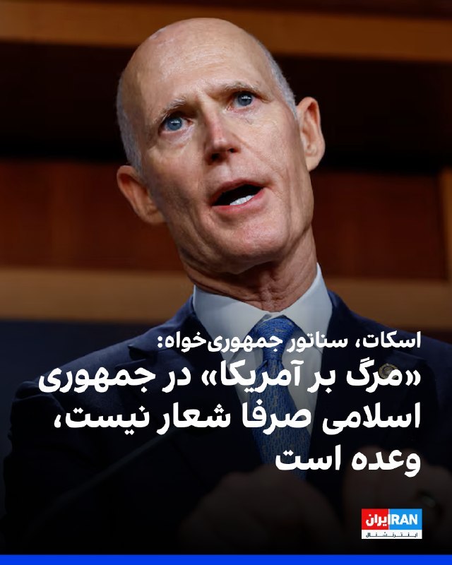

ریک اسکات، سناتور جمهوری‌خواه آمریکا، گفت شعار «مرگ بر آمریکا» از سوی جمهوری اسلامی باید جدی گرفته شود و آن را نه یک شعار سیاسی، بلکه «یک وعده» توصیف کرد.
او در شبکه ایکس نوشت تهران نزدیک به نیم قرن این شعار را تکرار کرده و افزود: «وقتی دشمن به شما می‌گوید چه کسی است، باورش کنید. پیروزی برای آمریکا یک گزینه نیست، تنها گزینه است.»

https://iranintl.com/202605145770

## iranintlTV — post 337101

  

شی جین‌پینگ در دیدار با ترامپ در پکن هشدار داد اگر مسئله تایوان به‌درستی مدیریت نشود، چین و آمریکا ممکن است وارد برخورد یا حتی درگیری شوند و روابط دو کشور به «وضعیتی بسیار خطرناک» کشیده شود.
رییس‌جمهوری چین تایوان را مهم‌ترین موضوع در روابط پکن–واشینگتن خواند. چین این جزیره دموکراتیک را بخشی از قلمرو خود می‌داند، اما تایپه این ادعا را رد می‌کند. پکن همچنین با فروش سلاح آمریکا به تایوان مخالف است.

https://iranintl.com/202605147049

## iranintlTV — post 337100

  <a href="telegram/content/iranintlTV_337100_1778738707.mp4" target="_blank">🎬 Download video</a>

سرخط خبرهای پنجشنبه ۲۴ اردیبهشت
@iranintltv

## iranintlTV — post 337099

  

ترامپ در دیدار با شی‌جین پینگ در پکن این رویداد را «یکی بزرگ‌ترین نشست‌های تاریخ» خواند و گفت در این سفر هیئتی ۳۰ نفره از بزرگ‌ترین و بهترین بازرگانان جهان را به همراه خود آورده است.
او گفت: «ما از ۳۰ نفر برتر جهان دعوت کردیم. تک‌تک آنها پاسخ مثبت دادند. من نفر دوم یا سوم هیچ شرکتی را نمی‌خواستم؛ فقط برترین‌ها را می‌خواستم. آنها امروز اینجا هستند تا به شما و به چین ادای احترام کنند و مشتاق تجارت و انجام کسب‌وکار هستند و این روند از طرف ما کاملا متقابل خواهد بود.»
ترامپ گفت: «بسیار مشتاق گفت‌وگوی خود هستم. این گفت‌وگویی بزرگ است. برخی می‌گویند شاید این بزرگ‌ترین نشست تاریخ باشد. آنها هرگز چیزی شبیه به آن را به یاد نمی‌آورند.»

https://iranintl.com/202605149590

## iranintlTV — post 337098

  

شی جین‌پینگ در دیدار با ترامپ در پکن ابراز امیدواری کرد سال ۲۰۲۶ سالی تاریخی و نقطه‌عطفی برای روابط چین و آمریکا باشد «تا گذشته را ادامه دهد و درها را به روی آینده بگشاید.»
شی گفت همواره معتقد بوده است منافع مشترک میان چین و آمریکا بر اختلافات دو کشور ارجحیت دارد و موفقیت پکن و واشینگتن فرصتی برای یکدیگر است.
شی ثبات روابط چین و آمریکا را برای جهان امر مثبتی دانست و گفت مشتاق است درباره مسائل مهم با ترامپ تبادل نظر کند.

https://iranintl.com/202605141916

## iranintlTV — post 337097

  

دونالد ترامپ در دیدار با رییس‌جمهوری چین گفت روابط او و شی جین‌پینگ طولانی‌ترین رابطه میان روسای جمهور دو کشور بوده است و این موضوع را «مایه افتخار» دانست. او تاکید کرد روابط دو کشور «بهتر از هر زمان دیگری خواهد شد.»
ترامپ گفت هر زمان مشکلی پیش آمده، دو طرف مستقیما آن را حل کرده‌اند و آینده روابط واشینگتن و پکن «فوق‌العاده» خواهد بود.
ترامپ با تمجید از شی جین‌پینگ او را «رهبر بزرگی» خواند و گفت برای چین و دستاوردهایش احترام زیادی قائل است.
ترامپ این دیدار را «نشستی بزرگ» توصیف کرد و گفت در آمریکا همه درباره آن صحبت می‌کنند.

https://iranintl.com/202605147699

---
📅 بروزرسانی: 1405/02/24 06:13
---

## iranintlTV — post 337096

  

ترامپ و شی‌جین‌ پینگ صبح پنج‌شنبه به وقت محلی در مراسم استقبال و رژه نظامیان چین در مقابل «تالار بزرگ خلق» در پکن حضور یافتند. در این مراسم روسای جمهوری آمریکا و چین از نیروهای نظامی سان دیدند.
https://iranintl.com/202605146912

## iranintlTV — post 337095

  

مارکو روبیو، وزیر خارجه آمریکا، به فاکس‌نیوز گفت تهدید جمهوری اسلامی قابل مصالحه نیست، زیرا حکومت روحانیون در پی دستیابی به سلاح هسته‌ای است. روبیو تاکید کرد جهان به رهبری ترامپ اجازه نخواهد داد جمهوری اسلامی به چنین سلاحی دست پیدا کند.
او افزود تهران قصد داشت با انباشت گسترده پهپاد و موشک، نوعی «مصونیت» برای خود ایجاد کند تا هیچ کشوری نتواند به آن حمله کند و سپس به سمت ساخت سلاح هسته‌ای حرکت کند.
روبیو تاکید کرد رئیس‌جمهور ترامپ اجازه نخواهد داد چنین سناریویی محقق شود.

https://iranintl.com/202605146709

## iranintlTV — post 337094

  

مایک والتز، سفیر آمریکا در سازمان ملل، با اشاره به حمایت ۱۱۳ کشور از پیش‌نویس قطعنامه شورای امنیت در محکومیت اقدامات جمهوری اسلامی، گفت تهران به دلیل اقدامات غیرقانونی خود، از جمله مین‌گذاری و اعمال عوارض بر کشتیرانی در تنگه هرمز، «منزوی» شده است.
والتز در ایکس نوشت کشورهایی از جمله هند، ژاپن و کره جنوبی از این ابتکار حمایت کرده‌اند.

https://iranintl.com/202605145787

## iranintlTV — post 337093

  

مایک والتز، سفیر آمریکا در سازمان ملل، با اشاره به حمایت ۱۱۳ کشور از پیش‌نویس قطعنامه شورای امنیت در محکومیت اقدامات جمهوری اسلامی، گفت تهران به دلیل اقدامات غیرقانونی خود، از جمله مین‌گذاری و اعمال عوارض بر کشتیرانی در تنگه هرمز، «منزوی» شده است.
والتز در ایکس نوشت کشورهایی از جمله هند، ژاپن و کره جنوبی از این ابتکار حمایت کرده‌اند.

https://iranintl.com/202605145787

## iranintlTV — post 337092

  

نمایندگی جمهوری اسلامی در سازمان ملل در بیانیه‌ای گفت حمایت بسیاری از کشورها از پیش‌نویس قطعنامه مورد حمایت واشینگتن علیه جمهوری اسلامی تحت «فشار سیاسی، اجبار و حتی تهدید» بوده است و این قطعنامه را «پوشش سیاسی برای اقدامات غیرقانونی» دانست.
این بیانیه افزود: «هیچ میزان از همراهی‌های مشترک تحمیلی، از جمله محاصره دریایی، حمله به کشتی‌های تجاری ایران و توقیف غیرقانونی آنها، و گروگان‌گیری خدمه این کشتی‌ها به شیوه‌ای شبیه به دزدی دریایی، نمی‌تواند اقدامات مداوم و ناقض حقوق بین‌الملل واشینگتن علیه جمهوری اسلامی را مشروعیت ببخشد.»

https://iranintl.com/202605145471

## iranintlTV — post 337091

  <a href="telegram/content/iranintlTV_337091_1778726584.mp4" target="_blank">🎬 Download video</a>

ویدیوهای منتشرشده در رسانه‌های حکومتی نشان می‌دهد ماموران جمهوری اسلامی، شامگاه چهارشنبه ۲۳ اردیبهشت، پهپاد شاهد ۱۳۶ را در دو مدل رنگی صورتی و آبی به شهر پیشوا برده‌اند تا مردم برای دیدن پهپادهای رنگی جمع شوند.

## iranintlTV — post 337082

این‌ها فقط چند روایت کوتاه از دی‌ماه‌اند؛
از روزهایی که خیابان‌های ایران، شاهد خاموش شدن زندگی جوان‌هایی شد که هر کدام در حال ساختن آینده خود بودند.
یکی ورزشکار بود،
یکی تازه زندگی مشترکش را شروع کرده بود،
یکی کار می‌کرد تا روی پای خودش بایستد،
و یکی پدر کودکی بود که حالا باید بدون او بزرگ شود.
مهدی جعفری، سروش (حسین) دانشمندی، جواد زارعی، حامد بیابانی، حسین رضایی، امیرحسین میرزایی، محمدمهدی سیف‌الله‌پور و فاطمه اعزازی کله‌سر
جاویدنامان انقلاب ملی ایرانیان؛
نام‌هایی که در حافظه این سرزمین مانده‌اند، چون زندگی‌شان پیش از آن‌که فرصت کامل شدن پیدا کند، با گلوله متوقف شد.
#جاویدنامان_انقلاب_ملی_ایرانیان

---
📅 بروزرسانی: 1405/02/24 03:23
---

## iranintlTV — post 337081

  <a href="telegram/content/iranintlTV_337081_1778716420.mp4" target="_blank">🎬 Download video</a>

رسانه‌های جمهوری اسلامی از برگزاری رزمایش پنج‌روزه سپاه تهران بزرگ با محوریت مقابله با عملیات «هلی‌برن» نیروهای متخاصم خبر دادند.
در تصاویر منتشرشده، نیروهای پیاده با سلاح‌های سبک، نیمه‌سنگین و پهپاد به اهداف فرضی، همچون تصویر پارچه‌ای یک بالگرد، شلیک می‌کنند.
این رزمایش پس از ورود بالگردهای بلک‌هاوک و هواپیمای سوخت‌رسان آمریکا به خاک ایران، در جریان عملیات جست‌وجوی خلبان اف-۱۵، برگزار شده است.
@iranintltv

## iranintlTV — post 337080

  <a href="telegram/content/iranintlTV_337080_1778716421.mp4" target="_blank">🎬 Download video</a>

موج تازهٔ اعدام جوانان نخبه؛
احسان افرشته با اتهام «جاسوسی» اعدام شد

جمهوری اسلامی بامداد چهارشنبه حکم اعدام احسان افرشته، زندانی سیاسی متهم به «جاسوسی برای اسرائیل»، را اجرا کرد؛ پرونده‌ای که مانند بسیاری از پرونده‌های امنیتی مشابه، بدون انتشار سند و مدرک مستقل به پایان رسید.

نهادهای حقوق بشری پیش‌تر هشدار داده بودند که اتهامات مطرح‌شده علیه او بر پایهٔ اعترافات اجباری و تحت فشار مطرح شده است.

کامبیز حسینی در «برنامه» به این موضوع می‌پردازد.

«یک ایران صدای شما را می‌شنود»
دوشنبه تا پنجشنبه ۱۱ شب تهران
از تلویزیون ایران اینترنشنال

تماشای نسخه کامل این قسمت از «برنامه» در یوتیوب:
https://youtu.be/HsShW7razys
@iranintltv

## iranintlTV — post 337079

  <a href="telegram/content/iranintlTV_337079_1778716423.mp4" target="_blank">🎬 Download video</a>

محمد از آلمان: کسی که پول دارو ندارد، آب ندارد، برق ندارد، او هم اعدامی جمهوری اسلامی است

«یک ایران صدای شما را می‌شنود»
دوشنبه تا پنجشنبه ۱۱ شب تهران
از تلویزیون ایران اینترنشنال

تماشای نسخه کامل این قسمت از «برنامه» در یوتیوب:
https://youtu.be/HsShW7razys
@iranintltv

## iranintlTV — post 337078

  <a href="telegram/content/iranintlTV_337078_1778716425.mp4" target="_blank">🎬 Download video</a>

حمید از بندرعباس: می‌روم خرید، ولی فقط می‌توانم به اندازهٔ جیبم خرید کنم، نه نیازم

«یک ایران صدای شما را می‌شنود»
دوشنبه تا پنجشنبه ۱۱ شب تهران
از تلویزیون ایران اینترنشنال

تماشای نسخه کامل این قسمت از «برنامه» در یوتیوب:
https://youtu.be/HsShW7razys
@iranintltv

## iranintlTV — post 337077

  <a href="telegram/content/iranintlTV_337077_1778716427.mp4" target="_blank">🎬 Download video</a>

فریبرز از خوزستان: مردمی که اینترنت ندارند، چه کار کنند؟ ایرانی‌های خارج از کشور کمک کنند

«یک ایران صدای شما را می‌شنود»
دوشنبه تا پنجشنبه ۱۱ شب تهران
از تلویزیون ایران اینترنشنال

تماشای نسخه کامل این قسمت از «برنامه» در یوتیوب:
https://youtu.be/HsShW7razys
@iranintltv

## iranintlTV — post 337076

  <a href="https://t.me/IranintlTV/337076" target="_blank">📎 Download file</a>

🎧نسخه صوتی سیاست با مراد ویسی: ایران کارت بازی دیگران
@iranintlTV

## iranintlTV — post 337075

  <a href="telegram/content/iranintlTV_337075_1778716429.mp4" target="_blank">🎬 Download video</a>

فرامرز از استکهلم: به ترامپ توجه نکنید؛ او در حال جنگ سرد است؛ما باید مسیر خودمان را برویم

«یک ایران صدای شما را می‌شنود»
دوشنبه تا پنجشنبه ۱۱ شب تهران
از تلویزیون ایران اینترنشنال

تماشای نسخه کامل این قسمت از «برنامه» در یوتیوب:
https://youtu.be/HsShW7razys
@iranintltv

## iranintlTV — post 337074

  <a href="telegram/content/iranintlTV_337074_1778716431.mp4" target="_blank">🎬 Download video</a>

احمد از انگلستان: مردم ایران صبرشان استراتژیک و تاریخی است و می‌دانند کی باید به آب بزنند

«یک ایران صدای شما را می‌شنود»
دوشنبه تا پنجشنبه ۱۱ شب تهران
از تلویزیون ایران اینترنشنال

تماشای نسخه کامل این قسمت از «برنامه» در یوتیوب:
https://youtu.be/HsShW7razys
@iranintltv

## iranintlTV — post 337073

  

نیویورک‌تایمز به نقل از مقام‌های آمریکایی گزارش داد شرکت‌های چینی با جمهوری اسلامی درباره فروش سلاح در حال گفت‌وگو بوده‌اند و قصد داشته‌اند این تسلیحات را از طریق کشورهای دیگر ارسال کنند تا منشا کمک نظامی پنهان بماند.
مقام‌های آمریکایی گفتند دست‌کم یکی از کشورهای ثالث در آفریقا قرار دارد، اما مشخص نیست آیا محموله‌ای به آن کشور رسیده است یا نه.
مقام‌هایی که در جریان این اطلاعات قرار گرفته‌اند، درباره اینکه آیا سلاح‌ها پیش‌تر به کشورهای ثالث ارسال شده‌اند یا نه، به جمع‌بندی‌های متفاوتی رسیده‌اند. با این حال، از زمان آغاز جنگ کنونی علیه جمهوری اسلامی، به نظر نمی‌رسد هیچ سلاح چینی در میدان نبرد علیه نیروهای آمریکایی یا اسرائیلی استفاده شده باشد.
هنوز مشخص نیست چه تعداد سلاح منتقل شده یا مقام‌های چینی تا چه اندازه این فروش‌ها را تایید کرده‌اند.

https://iranintl.com/202605134264

## iranintlTV — post 337072

  <a href="telegram/content/iranintlTV_337072_1778716433.mp4" target="_blank">🎬 Download video</a>

دفتر نخست‌وزیری اسرائیل اعلام کرد بنیامین نتانیاهو در جریان جنگ علیه جمهوری اسلامی به‌صورت محرمانه به امارات سفر و با محمد بن زاید دیدار کرده است. رادیو ملی اسرائیل نیز گزارش داد این نخستین بار نیست که نتانیاهو به امارات رفته، اما برای نخستین‌بار است که این موضوع به‌صورت رسمی تایید می‌شود.

گفت‌وگو با بن سبطی، پژوهشگر ایران و اسرائیل
@iranintltv

## iranintlTV — post 337071

  <a href="telegram/content/iranintlTV_337071_1778716435.mp4" target="_blank">🎬 Download video</a>

در پی موج جدید بیکاری در ایران در سایه جنگ، سرکوب و قطعی اینترنت، آمار رسمی از بیش از ۲۰۰ هزار متقاضی دریافت بیمه بیکاری خبر می‌دهد. مسعود پزشکیان پیش‌تر در واکنش به تورم و گرانی گفته بود کشور به‌شدت به صرفه‌جویی نیاز دارد.

گفت‌وگو با جمشید اسدی، اقتصاددان
@iranintltv

---
📅 بروزرسانی: 1405/02/24 02:20
---

## iranintlTV — post 337070

  <a href="telegram/content/iranintlTV_337070_1778712644.mp4" target="_blank">🎬 Download video</a>

گزارش‌ها حاکی است در کمتر از یک ماه، دست‌کم ۱۲ هسته مرتبط با تهران در کویت، بحرین، امارات و قطر شناسایی و متلاشی شده‌اند.
مقام‌های امنیتی این کشورها می‌گویند ده‌ها نفر به اتهام جاسوسی، پول‌شویی، طراحی ترور و همکاری با سپاه و حزب‌الله بازداشت شده‌اند.

گزارش نیلوفر منصوری، خبرنگار ایران‌اینترنشنال
@iranintltv

## iranintlTV — post 337069

  

مارکو روبیو، وزیر خارجه آمریکا، در گفت‌وگو با فاکس‌نیوز با تاکید بر اینکه حل بحران خاورمیانه به نفع چین است، ابراز امیدواری کرد واشینگتن بتواند پکن را متقاعد کند نقش فعال‌تری در ترغیب جمهوری اسلامی برای کنار گذاشتن اقداماتش در خلیج فارس ایفا کند.
او گفت: «چینی‌ها کشتی‌هایی دارند که در خلیج فارس گیر افتاده‌اند. یک محموله باری چینی آخر هفته هدف قرار گرفت. مطمئنم جمهوری اسلامی عمدا این کار را نکرد، اما این اتفاق افتاد. به همین دلیل این کشتی‌های چینی آنجا گیر افتاده‌اند.»
روبیو افزود: «این وضعیت منبع بزرگی از بی‌ثباتی است. بیش از هر نقطه دیگر جهان، آسیا را تهدید به بی‌ثباتی می‌کند، زیرا به شدت به این تنگه‌ها برای انرژی وابسته است.»

https://iranintl.com/202605139871

## iranintlTV — post 337068

  <a href="telegram/content/iranintlTV_337068_1778712648.mp4" target="_blank">🎬 Download video</a>

مراد ویسی، تحلیل‌گر ارشد ایران‌اینترنشنال، گفت: «تشکیل ستاد ساماندهی فضای مجازی در عمل یعنی برنامه‌ریزی برای قطع سازمان یافته اینترنت و محدود کردن دسترسی ۹۰ میلیون ایرانی، در حالی که اینترنت ویژه فقط در اختیار حامیان حکومت قرار می‌گیرد. اصطلاحاتی مثل اینترنت پرو، اینترنت طبقاتی، سیم‌کارت سفید یا ناپایداری ارتباط، همگی نام‌های متفاوتی برای همان قطع و کنترل اینترنت هستند.»
@iranintltv

---
📅 بروزرسانی: 1405/02/24 01:16
---

## iranintlTV — post 337067

  <a href="telegram/content/iranintlTV_337067_1778708762.mp4" target="_blank">🎬 Download video</a>

مراد ویسی، تحلیل‌گر ارشد ایران‌اینترنشنال، گفت: «مجموع تحولات اخیر نشان می‌دهد جمهوری اسلامی به رغم برخی تحرکات تاکتیکی در خلیج فارس با یک شکست راهبردی و امنیتی روبه‌رو شده؛ چون حملاتش باعث شده بسیاری از همسایگان جنوبی به دشمنان فعالش تبدیل شوند. نتیجه این سیاست‌ها، نزدیک‌تر شدن کشورهایی مثل امارات به اسرائیل و باز شدن پای اسرائیل و ناتو به معادلات امنیتی منطقه بوده است.»
@iranintltv

## iranintlTV — post 337066

  <a href="https://t.me/IranintlTV/337066" target="_blank">📎 Download file</a>

🎧نسخه صوتی برنامه با کامبیز حسینی؛ خشم انباشتهٔ مردم کی فوران خواهد کرد؟
@iranintlTV

## iranintlTV — post 337065

  <a href="telegram/content/iranintlTV_337065_1778708765.mp4" target="_blank">🎬 Download video</a>

گمان می‌رود پرونده جنگ با ایران، یکی از محوری‌ترین موضوعات گفتگو میان دونالد ترامپ و شی جین‌پینگ باشد. بنا بر بعضی گزارش‌ها، احتمال می‌رود واشینگتن و پکن، تلاش تازه و مشترکی برای وادار کردن تهران به عقب‌نشینی و پذیرش شروط جدید کنند.
@iranintltv

## iranintlTV — post 337064

  <a href="telegram/content/iranintlTV_337064_1778708767.mp4" target="_blank">🎬 Download video</a>

مراد ویسی، تحلیل‌گر ارشد ایران‌اینترنشنال، گفت: « جمهوری اسلامی، ایران را به کارت بازی دیگران تبدیل کرده است. خیلی از تحلیل‌گران در انتظار تعیین سرنوشت ایران در دیدار ترامپ و رهبر چین هستند. سرنوشت ایران به غزه و لبنان و به جنگ اوکراین و به روابط روسیه و آمریکا و حالا روابط آمریکا و چین گره خورده است. این بلایی است که جمهوری اسلامی بر سر ایران آورده است.»
@iranintltv

## iranintlTV — post 337063

  <a href="telegram/content/iranintlTV_337063_1778708769.mp4" target="_blank">🎬 Download video</a>

کی‌یر استارمر، نخست‌وزیر بریتانیا، در مراسم بازگشایی رسمی پارلمان گفت سخنرانی پادشاه رویکردی امیدوارکننده‌تر به تحولات ایران و جنگ در دو جبهه ارائه می‌دهد و آن را فرصتی برای تغییر وضع موجود و ساختن بریتانیایی قوی‌تر و عادلانه‌تر دانست؛ مسیری که به گفته او باید مبنای آینده کشور قرار گیرد.

چارلز سوم، پادشاه بریتانیا، روز چهارشنبه ۲۳ اردیبهشت در این مراسم سخنرانی کرد. این مراسم به‌منزله آغاز رسمی فعالیت‌های دوره جدید پارلمان بریتانیا است.
@iranintltv

## iranintlTV — post 337062

  <a href="telegram/content/iranintlTV_337062_1778708770.mp4" target="_blank">🎬 Download video</a>

بلومبرگ گزارش داد بارگیری نفت از پایانه اصلی صادرات نفت ایران در جزیره خارک متوقف شده است.

بر اساس این گزارش، ظرفیت مخازن ذخیره نفت نیز در حال پر شدن است و در صورت تکمیل ظرفیت، ایران ممکن است ناچار به کاهش تولید نفت شود.

گفت‌وگو با ایمان ناصری، مشاور بازار نفت
@iranintltv

## iranintlTV — post 337061

  <a href="telegram/content/iranintlTV_337061_1778708772.mp4" target="_blank">🎬 Download video</a>

تجمعات حکومتی شبانه، بلای جان نظام و مجتبی

چشم‌انداز با مهدی مهدوی‌آزاد

نسخه کامل این برنامه در یوتیوب:
https://youtu.be/SepDBES4ITI
@iranintltv

## iranintlTV — post 337060

  <a href="telegram/content/iranintlTV_337060_1778708775.mp4" target="_blank">🎬 Download video</a>

تجمعات حکومتی شبانه، بلای جان نظام و مجتبی

چشم‌انداز با مهدی مهدوی‌آزاد

نسخه کامل این برنامه در یوتیوب:
https://youtu.be/SepDBES4ITI
@iranintltv

## iranintlTV — post 337059

  <a href="https://t.me/IranintlTV/337059" target="_blank">📎 Download file</a>

🎧نسخه صوتی چشم‌انداز: تجمعات حکومتی شبانه، بلای جان نظام و مجتبی
@iranintlTV

## iranintlTV — post 337058

  

وزارت خارجه امارات متحده عربی اعلام کرد گزارش‌های منتشرشده درباره سفر بنیامین نتانیاهو، نخست‌وزیر اسرائیل، به این کشور صحت ندارد.
پیش‌تر دفتر نخست‌وزیری اسرائیل اعلام کرد بنیامین نتانیاهو در جریان جنگ آمریکا و اسرائیل با جمهوری اسلامی، به‌طور مخفیانه به امارات متحده عربی سفر کرده و در این سفر با محمد بن زاید آل نهیان، رییس امارات متحده عربی، دیدار کرد.
وزارت خارجه امارات متحده عربی اعلام کرد روابط این کشور با اسرائیل علنی است و در چارچوب توافق‌نامه‌های ابراهیم که به‌طور عمومی اعلام شده‌اند، برقرار شده است.
وزارت خارجه امارات متحده عربی افزود این روابط مبتنی بر محرمانگی نیست و هرگونه ادعا درباره سفرها یا ترتیبات اعلام‌نشده «بی‌اساس» است، مگر آن‌که به‌صورت رسمی از سوی امارات متحده عربی اعلام شود.
عباس عراقچی در واکنش به سفر نتانیاهو به امارات متحده عربی در زمان جنگ، نوشت: همکاری با اسرائیل در این مسیر غیرقابل بخشش است. افرادی که برای ایجاد اختلاف با اسرائیل همکاری می‌کنند، پاسخگو خواهند شد.
https://iranintl.com/202605138383

## iranintlTV — post 337057

🔻فدراسیون فوتبال ایران در بحران مالی؛ گوگل جمینای حامی تیم‌های ملی فوتبال عراق و مراکش شد

همزمان با تحریم‌های بانکی و مشکلات مالی فدراسیون فوتبال ایران، جمینای (هوش مصنوعی شرکت گوگل) اعلام کرد حامی مالی و فناوری تیم‌های ملی عراق و مراکش در جام جهانی ٢٠٢۶ شده است. گوگل گفته قصد دارد با این قرارداد اسپانسری، «فاصله میان تیم‌ها و هواداران جهانی آنها را کاهش دهد.»

در این بیانیه آمده است: «ما با هیجان اعلام می‌کنیم که گوگل جمینای به عنوان حامی رسمی فناوری تیم‌های ملی فوتبال عراق و مراکش انتخاب شده است. این حمایت با بهره‌گیری از فناوری پیشرفته هوش مصنوعی ما، فرهنگ غنی ورزشی منطقه را گرامی می‌دارد و تجربه هواداران را متحول خواهد کرد.»
این همکاری بر استفاده از هوش مصنوعی برای تولید محتوای فراگیر و فراهم کردن شیوه‌های نوآورانه تعامل هواداران با بازیکنان و تیم‌های محبوبشان متمرکز است.

گوگل جمینای گفته در همکاری با فدراسیون‌های فوتبال، طی سه ماه آینده مجموعه‌ای از برنامه‌های هوادارمحور اجرا خواهد شد: «هواداران می‌توانند با استفاده از مدل تبدیل متن به تصویر جمینی موسوم به «نانو بنانا» تصاویر تشویقی اختصاصی خلق کنند یا با مدل تبدیل متن به موسیقی «لایریا» سرودهای تیمی بسازند و حمایت خود را به شکلی زنده تجربه کنند؛ گویی در زمین حضور دارند.»

همچنین هواداران می‌توانند از گوگل جمینی برای توضیح قوانین پیچیده فوتبال، تحلیل عملکرد مسابقات و پیش‌بینی تیم‌های پیروز استفاده کنند.
همکاری مالی و فناوری جمینای با فدراسیون‌های فوتبال عراق و مراکش درحالی است که روز گذشته فارس، رسانه وابسته به سپاه پاسداران، گزارش داد تیم ملی فوتبال برای اجرای برنامه آماده‌سازی خود در ترکیه، به تزریق فوری منابع مالی نیاز دارد؛ منابعی که پیش‌تر وعده پرداخت آن داده شده بود.
🔗وب‌سایت ایران‌اینترنشنال
@iranintltv

---
📅 بروزرسانی: 1405/02/23 23:45
---

## iranintlTV — post 337056

  

به گزارش الحدث، دو پهپاد انتحاری مقر حزب دموکرات کردستان ایران در شمال اربیل عراق را هدف قرار دادند.

همزمان رویترز به نقل از منابع امنیتی گزارش داد در این حمله پهپادی یک انبار سلاح و مهمات در داخل این اردوگاه هدف قرار گرفته است.
https://iranintl.com/202605131072

## iranintlTV — post 337055

  <a href="https://t.me/IranintlTV/337055" target="_blank">📎 Download file</a>

🎧نسخه صوتی ۲۴ با فرداد فرحزاد: سرنوشت جمهوری‌اسلامی، موضوع گفتگوهای ترامپ در چین
@iranintlTV

## iranintlTV — post 337054

  <a href="telegram/content/iranintlTV_337054_1778703339.mp4" target="_blank">🎬 Download video</a>

مسعود پزشکیان در واکنش به تورم و گرانی‌های بی‌سابقه، از وزارت جهاد کشاورزی خواست برای کنترل قیمت‌ها همه توانش را به کار گیرد. او پیشتر گفته بود، کشور به شدت به صرفه‌جویی نیاز دارد.

گفت‌وگو با سیامک جوادی ، مدرس و پژوهشگر اقتصاد مالی در دانشگاه تگزاس

@iranintltv

## iranintlTV — post 337053

  

جی‌دی ونس، معاون رییس‌جمهور آمریکا، در کاخ سفید درباره مذاکرات واشینگتن و تهران گفت این گفت‌وگوها بسیار حساس است. او افزود صبح چهارشنبه مدت قابل‌توجهی با جرد کوشنر و استیو ویتکاف و همچنین با شماری از متحدان آمریکا در جهان عرب صحبت کرده و «فکر می‌کنم روند مذاکرات در حال پیشرفت است.»
ونس تاکید کرد پرسش اصلی این است که آیا این پیشرفت خط قرمز رییس‌جمهور را تامین می‌کند یا نه، این خط قرمز بسیار ساده است؛ ایجاد تضمین‌ها و سازوکارهایی که مانع دستیابی تهران به سلاح هسته‌ای شود.
او افزود از زمان ترک پاکستان پیشرفت قابل‌توجهی حاصل شده و هدف نهایی این است که دولت بتواند با اطمینان به مردم آمریکا بگوید دیگر نیازی نیست نگران دسترسی این رژیم بسیار خطرناک به خطرناک‌ترین سلاح‌های جهان باشند.
ونس اضافه کرد: رییس‌جمهور فعلا ما را در مسیر دیپلماسی قرار داده و تمرکز من نیز بر همین مسیر است.
https://iranintl.com/202605130999

## iranintlTV — post 337052

  <a href="telegram/content/iranintlTV_337052_1778703341.mp4" target="_blank">🎬 Download video</a>

بلومبرگ گزارش داد بحرین، کویت، قطر و امارات متحده عربی برای حضور در جلسه بعدی ناتو در ترکیه دعوت شده‌اند. بلومبرگ نوشته دعوت‌ها در ادامه تلاش‌های ناتو برای مقابله با تهدیدهای جمهوری اسلامی انجام شده است.

گفت‌وگو با فرزین ندیمی، پژوهشگر ارشد امور دفاعی و امنیتی در موسسه واشینگتن
@iranintltv

## iranintlTV — post 337051

  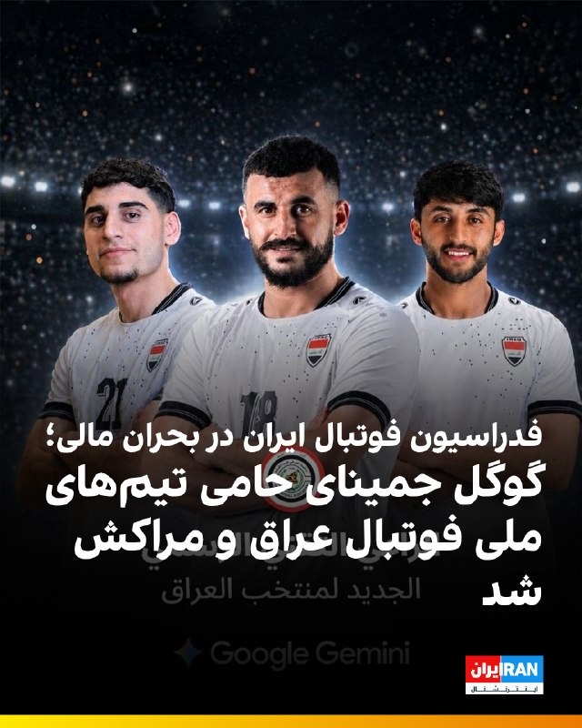

🔻همزمان با تحریم‌های بانکی و مشکلات مالی فدراسیون فوتبال ایران، جمینای (هوش مصنوعی شرکت گوگل) اعلام کرد حامی مالی و فناوری تیم‌های ملی عراق و مراکش در جام جهانی ٢٠٢۶ شده است. گوگل گفته قصد دارد با این قرارداد اسپانسری، «فاصله میان تیم‌ها و هواداران جهانی آنها را کاهش دهد.»

🔹در این بیانیه آمده است: «ما با هیجان اعلام می‌کنیم که گوگل جمینای به عنوان حامی رسمی فناوری تیم‌های ملی فوتبال عراق و مراکش انتخاب شده است. این حمایت با بهره‌گیری از فناوری پیشرفته هوش مصنوعی ما، فرهنگ غنی ورزشی منطقه را گرامی می‌دارد و تجربه هواداران را متحول خواهد کرد.»

🔹گوگل جمینای گفته در همکاری با فدراسیون‌های فوتبال، طی سه ماه آینده مجموعه‌ای از برنامه‌های هوادارمحور اجرا خواهد شد: «هواداران می‌توانند با استفاده از مدل تبدیل متن به تصویر جمینی موسوم به «نانو بنانا» تصاویر تشویقی اختصاصی خلق کنند یا با مدل تبدیل متن به موسیقی «لایریا» سرودهای تیمی بسازند و حمایت خود را به شکلی زنده تجربه کنند؛ گویی در زمین حضور دارند.»

جزییات بیشتر را اینجا بخوانید.

@iranintltvsport

## iranintlTV — post 337050

  

انور قرقاش، مشاور رییس امارات متحده عربی، در شبکه ایکس نوشت جهان با دقت سفر مهم رییس‌جمهور ایالات متحده به چین و پیامدهای احتمالی آن بر تحولات منطقه را دنبال می‌کند. او تأکید کرد امارات متحده عربی بار دیگر بر اهمیت راه‌حل سیاسی و مسیر مذاکره پافشاری می‌کند؛ مسیری که همواره در مواضع و ارتباطات خود به آن پایبند بوده است.

قرقاش افزود امارات متحده عربی خواهان این جنگ نبوده و صادقانه برای جلوگیری از وقوع آن تلاش کرده است. او گفت روابط عربی ـ ایرانی در خلیج فارس نمی‌تواند بر پایه رویارویی و درگیری بنا شود.

مشاور رییس امارات متحده عربی همچنین تأکید کرد این کشور از حاکمیت خود دفاع خواهد کرد، اما همچنان اولویت و باور راسخ آن ترجیح راه‌حل‌های سیاسی است؛ زیرا این مسیر را راه دستیابی به صلح، ثبات و شکوفایی می‌داند.
https://iranintl.com/202605131401

## iranintlTV — post 337049

🔻بحران رهبری استارمر بر سخنرانی سالانه پادشاه بریتانیا سایه انداخت

هم‌زمان با ارائه برنامه دولت بریتانیا از سوی پادشاه بریتانیا در مجلس اعیان این کشور، کی‌یر استارمر با جدی‌ترین تهدید علیه رهبری خود روبه‌روست. رسانه‌ها گزارش دادند وزیر بهداشت او آماده استعفاست تا وارد رقابت حزبی برای جایگزینی نخست‌وزیر شود.

روزنامه تایمز چهارشنبه ۲۳ اردیبهشت گزارش داد که احتمال‌ استعفای وِسلی اِستریتینگ، وزیر بهداشت کابینه استارمر، قوت گرفته است. دور از انتظار نیست که او پنج‌شنبه کنار برود و با ورود به رقابت‌های حزب کارگر برای تغییر رهبر حزب، رویدادها به سمتی برود که برنامه دولت استارمر که چارلز آن را با شکوه و تشریفات فراوان تشریح کرد، هرگز به مرحله اجرا نرسد.

تایمز نوشت که دفتر استریتینگ به درخواست برای اظهارنظر درباره این گزارش پاسخ نداد. سخنگوی استارمر هم گفت نخست‌وزیر به وزیر بهداشت خود اعتماد کامل دارد، اما از اظهارنظر درباره دیدار پیشین میان این دو نفر خودداری کرد.

تیم وزیر بهداشت گفت او نیز درباره آن دیدار، که در دفتر استارمر در داونینگ‌استریت برگزار شد، اظهارنظر نخواهد کرد تا توجه‌ها را از سخنرانی پادشاه منحرف نکند.

استریتینگ بعدتر در شبکه ایکس به تمجید از دستاوردهای خود در کاهش زمان انتظار در نظام درمانی دولتی بریتانیا پرداخت. او نوشت: «کارهای زیادی انجام شده، کارهای زیادی هم مانده است»؛ اما به این گزارش اشاره‌ای نکرد.
چالش در دولت بر سر چیست؟

مساله با شکست سنگین حزب کارگر در انتخابات شوراهای محلی انگلستان شروع شد. این حزب در انتخابات ۱۸ اردیبهشت بخش قابل توجهی از رای‌ها را به‌ویژه در مناطقی از مرکز و شمال انگلستان و همچنین در بخش‌هایی از لندن که پایگاه سنتی این حزب به شمار می‌آید، از دست داد.

در مقابل، حزب راستگرای «اصلاح بریتانیا» به رهبری نایجل فاراژ، بیش از ۳۵۰ کرسی در شوراهای محلی انگلستان به دست آورد و حالا اگر همین مسیر را در انتخابات ملی ادامه دهد، به اپوزیسیون اصلی در اسکاتلند و ولز تبدیل می‌شود.

خبرگزاری رویترز پس از اعلام رسمی این شکست حزب کارگر، نتایج انتخابات محلی را نشان‌دهنده عمق نارضایتی از نخست‌وزیر بریتانیا خواند و نوشت که تنها دو سال پس از پیروزی قاطع او در انتخابات سراسری، تردیدها را درباره آینده سیاسی‌اش افزایش داد.

برخی نمایندگان حزب کارگر پس از نتایج انتخابات هشدار دادند که اگر این حزب در اسکاتلند عملکرد ضعیفی داشته باشد، قدرت را در ولز از دست بدهد و نتواند بخش زیادی از حدود ۲۵۰۰ کرسی تحت دفاع خود در انگلستان را حفظ کند، فشارها بر استارمر برای کناره‌گیری یا دست‌کم تعیین جدول زمانی خروجش از قدرت افزایش خواهد یافت.
با این حال، هم‌زمان گزارش‌هایی از تلاش برخی از اعضای حزب برای ایجاد تغییرات بنیادین در دفتر نخست‌وزیری و جایگزینی استارمر با فردی دیگر منتشر شد.

در این میان استارمر کوشیده است چالش‌ها علیه اقتدار خود را کم‌اهمیت جلوه دهد و سخنرانی پادشاه بریتانیا که از سوی دولت نوشته و از سوی پادشاه قرائت می‌شود، برنامه‌هایی را برای تقویت رشد اقتصادی، امنیت انرژی و دفاع اعلام کرد.

سخنرانی پادشاه در بریتانیا در واقع ابزار رسمی دولت برای اعلام برنامه‌های سال آینده است، اما سخنرانی ۲۳ اردیبهشت چارلز، به جای نمایش دادنِ اقتدار و برنامه‌ریزی دولت استارمر، زیر سایه بحران رهبری او و گزارش‌ها درباره احتمال استعفای وزیر بهداشت و آغاز رقابت برای جانشینی نخست‌وزیر قرار گرفت.

این موضوع، در کنار اخبار مرتبط با تلاش‌های استریتینگ احتمال ورود رقبای دیگر به رقابت‌های درون‌حزبی علیه نخست‌وزیر کنونی را افزایش داده است. علاوه بر وزیر بهداشت، نام اندی برنهم، شهردار منچستر، و آنجلا رینر، معاون پیشین نخست‌وزیر، نیز مطرح شده است، هرچند هر دو آنها پیش از آنکه بتوانند نامزد شوند، باید موانعی را از پیش رو بردارند.
🔗وب‌سایت ایران‌اینترنشنال
@iranintltv

## iranintlTV — post 337048

  

خبرگزاری رویترز اعلام کرد که عربستان سعودی در جریان جنگ ایران، به مواضع شبه‌نظامیان مورد حمایت جمهوری اسلامی در عراق حمله کرده است.
بر اساس این گزارش، حملات عربستان سعودی توسط جنگنده‌های نیروی هوایی این کشور و علیه مواضع شبه‌نظامی وابسته به جمهوری اسلامی در نزدیکی مرز شمالی عربستان سعودی با عراق انجام شده است. بخشی از این حملات نیز هم‌زمان با آتش‌بس ۱۸ فروردین میان تهران و واشینگتن صورت گرفته است.
همچنین بر اساس ارزیابی‌های نظامی، منابع عراقی گفته‌اند در دست‌کم دو مورد، از خاک کویت حملات راکتی به عراق انجام شده است. رویترز نتوانسته مشخص کند این راکت‌ها توسط نیروهای مسلح کویت یا نیروهای آمریکایی مستقر در این کشور شلیک شده‌اند.
https://iranintl.com/202605137468

## iranintlTV — post 337047

  <a href="telegram/content/iranintlTV_337047_1778703344.mp4" target="_blank">🎬 Download video</a>

۲۴ با فرداد فرحزاد

@iranintltv

## iranintlTV — post 337046

  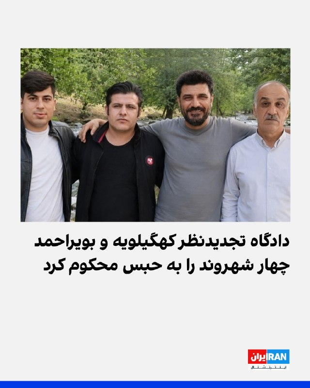

بر اساس گزارش منابع حقوق‌بشری، دادگاه تجدیدنظر استان کهگیلویه و بویراحمد، فیض‌الله آذرنوش، پدر دادخواه پدارم آذرنوش را به ۱۵ سال حبس، میلاد کریمی‌نسب را به شش سال حبس، امیرحسین محسنی‌پور را به شش سال حبس و مهدی کرمی را به سه سال حبس محکوم کرد.
سایت حقوق‌بشری هرانا چهارشنبه ۲۳ اردیبهشت گزارش داد این شهروندان در یک پرونده مشترک، از سوی ابوالحسن دادگر و سعید جریده‌اصل، مستشاران شعبه اول دادگاه تجدیدنظر استان کهگیلویه و بویراحمد، به احکام حبس محکوم شده‌اند.
بر اساس احکام صادرشده، پنج سال حبس برای آذرنوش، پنج سال حبس برای کریمی‌نسب، سه سال حبس برای محسنی‌پور و سه سال حبس برای کرمی قابل اجرا است.
https://iranintl.com/202605138248

---
📅 بروزرسانی: 1405/02/23 21:47
---

## iranintlTV — post 337045

  <a href="telegram/content/iranintlTV_337045_1778696221.mp4" target="_blank">🎬 Download video</a>

مهدی مهدوی‌آزاد در برنامه «چشم‌انداز» گفت: «تجمعات حکومتی در حال تبدیل شدن به یکی از مشکلات اصلی حاکمیت است. همان نیروهای حامی حکومت که امروز به خیابان‌ها می‌آیند، مسیر هرگونه سازش را بسته‌اند. کشوری که هم‌اکنون با بحران انرژی و مشکلات عمیق اقتصادی دست‌وپنجه نرم می‌کند، به‌زودی ممکن است حتی در مدیریت همین حامیان خود در خیابان نیز دچار چالش شود؛ چه‌بسا کار به جایی برسد که ناچار به سرکوب تجمعات حامیان شود.»
@iranintltv

## iranintlTV — post 337044

  

سایت حقوق‌بشری هرانا گزارش داد حکم اعدام محمد عباسی، از بازداشت‌شدگان اعتراضات سراسری دی‌ماه ۱۴۰۴، سحرگاه چهارشنبه در زندان قزلحصار کرج اجرا شد.
هرانا چهارشنبه ۲۳ اردیبهشت به نقل از منبعی مطلع و نزدیک به خانواده این زندانی سیاسی نوشت مسئولان زندان از خانواده عباسی خواسته بودند برای ملاقات با او به زندان مراجعه کنند، اما پس از حضور خانواده، اجازه ملاقات به آنان داده نشد.
به گفته این منبع، خانواده عباسی پس از خروج از زندان، در تماسی تلفنی از اجرای حکم اعدام او مطلع شدند.
ایران‌اینترنشنال هفتم اردیبهشت خبر داده بود حکم اعدام محمد عباسی و حکم ۲۵ سال حبس دخترش، فاطمه عباسی که در بند زنان زندان اوین محبوس است، در دیوان عالی کشور تایید شده است.
اطلاعات رسیده به ایران‌اینترنشنال حاکی است عباسی و دخترش فاطمه در دوران بازجویی تحت فشار و شکنجه‌های شدید قرار گرفته بودند و از زمان بازداشت، در تمامی مراحل دادرسی، از جمله بازجویی، بازپرسی، دادگاه و رسیدگی در دیوان عالی کشور، از حق دسترسی به وکیل محروم بوده‌اند.
https://iranintl.com/202605134938

## iranintlTV — post 337043

🔻تشدید کارزار امنیتی کشورهای خلیج فارس علیه شبکه‌های وابسته به جمهوری اسلامی

کشورهای حوزه خلیج فارس هم‌زمان با ادامه تنش‌ها در خاورمیانه، کارزار امنیتی گسترده‌ای را علیه شبکه‌های وابسته به جمهوری اسلامی و حزب‌الله لبنان آغاز کرده‌اند. مقام‌های امنیتی در کویت، بحرین، امارات و قطر از کشف و متلاشی شدن ده‌ها هسته مرتبط با تهران خبر داده‌اند.

شبکه آی۲۴ چهارشنبه ۲۳ اردیبهشت گزارش داد کشورهای حاشیه خلیج فارس طی ۲۷ روز گذشته بیش از ۱۲ هسته وابسته به جمهوری اسلامی را شناسایی و متلاشی کرده‌اند.

آریل اوسران، خبرنگار آی۲۴، نیز در شبکه اجتماعی ایکس نوشت کشف این هسته‌ها «نشان‌دهنده تشدید اقدامات جمهوری اسلامی علیه همسایگان عرب خود» است؛ تحولاتی که به گفته او «چشم‌انداز امنیتی خلیج فارس را دگرگون می‌کند.»

بر اساس داده‌های رسمی، حدود ۷۴ نفر با تابعیت‌های کویت، بحرینی، لبنانی و ایرانی در ارتباط با این هسته‌ها بازداشت یا شناسایی شده‌اند.

مقام‌های امنیتی این کشورها می‌گویند بازداشت‌شدگان به جاسوسی، پول‌شویی، طراحی ترور، جمع‌آوری اطلاعات از مراکز حساس و تلاش برای ضربه زدن به امنیت و ثبات اقتصادی کشورهای منطقه متهم هستند.

روزنامه الشرق الاوسط ۱۳ فروردین، گزارش داد نیروهای امنیتی کشورهای خلیج فارس طی ۳۰ روز، ۹ هسته مرتبط با جمهوری اسلامی یا متحدانش، به‌ویژه حزب‌الله لبنان، را در چهار کشور قطر، بحرین، کویت و اماراتمه کشف کرده‌اند.

بر اساس بررسی‌های الشرق الاوسط، خبر کشف و انهدام نخستین هسته ۱۳ اسفند ۱۴۰۴ در قطر اعلام شد و آخرین مورد در ۱۰ فروردین ۱۴۰۵؛ به این معنا که هر ۹ هسته طی ۲۷ روز متلاشی شده‌اند، یعنی تقریبا هر سه روز یک هسته مرتبط با تهران کشف شده است.

طبق گزارش الشرق الاوسط، کشورهای عضو شورای همکاری خلیج فارس هم‌زمان با مقابله با حملات جمهوری اسلامی، عملیات علیه شبکه‌های وابسته به تهران و حزب‌الله را تشدید کرده‌اند.

ظافر العجمی، کارشناس امنیتی خلیج فارس، گفت جمهوری اسلامی از «راهبردی سه‌بعدی» شامل هسته‌های محلی، جذب نیرو در کشورهای خلیج فارس و استفاده از گروه‌های نیابتی مانند حزب‌الله و حوثی‌ها برای اعمال فشار امنیتی استفاده می‌کند.

پیش از آن نیز، رویترز ۳۰ اسفند ۱۴۰۴ گزارش داده بود مقام‌های امنیتی امارات شبکه‌ای دیگر را که به گفته آنها با حمایت مالی و هدایت حزب‌الله لبنان و جمهوری اسلامی فعالیت می‌کرد، متلاشی کرده‌اند.

بر اساس گزارش خبرگزاری رسمی امارات، این شبکه تحت پوشش فعالیت‌های تجاری صوری در پول‌شویی، تامین مالی تروریسم و تلاش برای ضربه زدن به ثبات مالی کشور نقش داشته است. حزب‌الله این اتهام‌ها را رد کرده و آنها را «ساختگی» خوانده است.

وزارت کشور کویت چهارشنبه ۵ فروردین ۱۴۰۵ اعلام کرد نیروهای امنیتی این کشور یک «طرح تروریستی» مرتبط با حزب‌الله لبنان را خنثی کرده‌اند. مقام‌های کویتی گفتند شش نفر، شامل پنج شهروند کویتی و یک فرد بدون تابعیت، بازداشت و ۱۴ مظنون دیگر، از جمله دو ایرانی و دو لبنانی، تحت تعقیب قرار دارند.

به گفته مقام‌ها، اعضای این شبکه به جاسوسی و برنامه‌ریزی برای ترور رهبران کشور اعتراف کرده‌اند و آموزش‌های نظامی و کار با مواد منفجره را خارج از کویت دیده بودند. کویت همچنین از بازداشت چهار ایرانی مرتبط با سپاه پاسداران خبر داد که قصد ورود دریایی به جزیره بوبیان را داشتند.

در امارات متحده عربی نیز اداره امنیت دولت این کشور ۳۱ فروردین ۱۴۰۵ اعلام کرد یک «سازمان تروریستی مخفی شیعه» وابسته به جمهوری اسلامی را متلاشی و ۲۷ نفر را بازداشت کرده است.

در بیانیه رسمی اداره امنیت امارات متحده عربی آمده بود این گروه قصد داشت با «فعالیت‌های خرابکارانه» وحدت ملی و ثبات کشور را تضعیف کند.

مقام‌های اماراتی همچنین گفتند اعضای این شبکه با برگزاری نشست‌های مخفیانه و هماهنگی با طرف‌های خارجی، جوانان اماراتی را جذب و علیه سیاست خارجی این کشور تحریک می‌کردند.

در بحرین نیز دولت ۷ اردیبهشت ۱۴۰۵ اعلام کرد تابعیت ۶۹ نفر، از جمله اعضای خانواده آنها، را به اتهام «همدردی با اقدامات خصمانه ایران» یا «ارتباط با طرف‌های خارجی» لغو کرده است.

وزارت کشور بحرین همچنین از بازداشت ۴۱ نفر خبر داد و اعلام کرد آنها عضو سازمانی مرتبط با سپاه پاسداران بوده‌اند. مقام‌های بحرینی گفتند این اقدامات در چارچوب حفظ امنیت ملی و بر اساس قانون تابعیت این کشور انجام شده است.

تحلیلگران می‌گویند ادامه تنش‌ها و درگیری‌های منطقه‌ای باعث شده کشورهای خلیج فارس همکاری‌های اطلاعاتی، نظارت امنیتی و عملیات پیشگیرانه علیه شبکه‌های وابسته به ایران و حزب‌الله را به‌طور چشمگیری افزایش دهند؛ روندی که به گفته ناظران، می‌تواند شکاف امنیتی و سیاسی میان جمهوری اسلامی و کشورهای عرب منطقه را عمیق‌تر کند.
🔗وب‌سایت ایران‌اینترنشنال
@iranintltv

## iranintlTV — post 337042

🔻دادگاه تجدیدنظر استان کهگیلویه و بویراحمد چهار شهروند را به حبس محکوم کرد

بر اساس گزارش منابع حقوق‌بشری، دادگاه تجدیدنظر استان کهگیلویه و بویراحمد، فیض‌الله آذرنوش، پدر دادخواه پدارم آذرنوش را به ۱۵ سال حبس، میلاد کریمی‌نسب را به شش سال حبس، امیرحسین محسنی‌پور را به شش سال حبس و مهدی کرمی را به سه سال حبس محکوم کرد.

سایت حقوق‌بشری هرانا چهارشنبه ۲۳ اردیبهشت گزارش داد این شهروندان در یک پرونده مشترک، از سوی ابوالحسن دادگر و سعید جریده‌اصل، مستشاران شعبه اول دادگاه تجدیدنظر استان کهگیلویه و بویراحمد، به احکام حبس محکوم شده‌اند.

از میان این شهروندان، آذرنوش بابت اتهام‌های «مشارکت در تشکیل گروه با هدف برهم زدن امنیت کشور»، «فعالیت تبلیغی علیه نظام»، «فعالیت تبلیغی در جهت تایید و تقویت اسرائیل»، «توهین به رهبری»، «اجتماع و تبانی علیه امنیت داخلی کشور» و «توهین به مقدسات اسلام» در مجموع به ۱۵ سال حبس محکوم شده که با اعمال ماده ۱۳۴، پنج سال آن قابل اجراست.

همچنین کریمی‌نسب به اتهام‌های «مشارکت در تشکیل گروه با هدف برهم زدن امنیت کشور» و «فعالیت تبلیغی علیه نظام» در مجموع به شش سال حبس محکوم شده که با اعمال ماده ۱۳۴، پنج سال آن قابل اجراست.

محسنی‌پور نیز با اتهام‌های «عضویت در دسته یا جمعیت با هدف برهم زدن امنیت کشور»، «فعالیت تبلیغی علیه نظام» و «توهین به رهبری» در مجموع به شش سال حبس محکوم شده که با اعمال ماده ۱۳۴، سه سال آن قابل اجراست.

کرمی هم به اتهام «عضویت در دسته یا جمعیت با هدف برهم زدن امنیت کشور» به سه سال حبس محکوم شده و تمام این حکم قابل اجراست.
حمید دستوانه، متهم ردیف پنجم این پرونده، که پیش‌تر در مرحله بدوی به یک سال حبس محکوم شده بود، در مرحله تجدیدنظر از اتهامات انتسابی تبرئه شد.

شعبه ۱۰۲ دادگاه کیفری دو شهرستان کهگیلویه پیش‌تر در آذر ۱۴۰۴، آذرنوش را به ۲۳ سال حبس، کریمی‌نسب را به ۱۱ سال زندان، محسنی‌پور را به هشت سال زندان، کرمی را به پنج سال حبس و دستوانه را به یک سال حبس محکوم کرده بود.

آذرنوش ۲۸ خرداد ۱۴۰۴ در یاسوج بازداشت و پس از مدتی از زندان این شهر آزاد شد. او ۱۸ آبان ۱۴۰۴ به دست ماموران اطلاعات سپاه یاسوج احضار شد و پس از حضور در این نهاد امنیتی، چند ساعت مورد بازجویی قرار گرفت.

پسر او، پدرام آذرنوش، جوان ۱۸ ساله‌ای بود که ۳۱ شهریور ۱۴۰۱ در جریان جنبش «زن، زندگی، آزادی» در دهدشت با شلیک مستقیم ماموران امنیتی جمهوری اسلامی کشته شد.
کریمی‌نسب ۲۱ خرداد ۱۴۰۴، کرمی ۲۸ خرداد ۱۴۰۴ و محسنی‌پور دوم تیر ۱۴۰۴ از سوی نیروهای امنیتی در استان کهگیلویه و بویراحمد بازداشت شده بودند.

جمهوری اسلامی از نخستین سال‌های استقرار خود، بازداشت و زندانی کردن منتقدان، فعالان مدنی و کنشگران سیاسی را به یکی از ابزارهای اصلی سرکوب تبدیل کرده است.

از آغاز جنبش «زن، زندگی، آزادی» در شهریور ۱۴۰۱، برخورد امنیتی با معترضان و فعالان مدنی و سیاسی شدت بیشتری گرفت؛ روندی که پس از جنگ‌های ۱۲ روزه و ۴۰ روزه و اعتراضات دی‌ماه ۱۴۰۴ نیز با دامنه‌ای گسترده‌تر ادامه یافته است.
🔗وب‌سایت ایران‌اینترنشنال
@iranintltv

## iranintlTV — post 337041

  <a href="telegram/content/iranintlTV_337041_1778696223.mp4" target="_blank">🎬 Download video</a>

وال‌استریت ژورنال گزارش داد رییس موساد در دوران جنگ دست‌کم دو بار به‌صورت محرمانه به امارات سفر کرده است. پیش‌تر نیز خبر حملات امارات به اهدافی در ایران در طول جنگ منتشر شده بود.
همزمان رویترز گزارش داد عربستان سعودی نیز در طول جنگ حمله‌هایی به ایران انجام داده است.

گفت‌وگو با فرزین ندیمی، پژوهشگر امور دفاعی و امنیتی و علی صدرزاده، تحلیل‌گر مسائل خاورمیانه
@iranintltv

## iranintlTV — post 337040

  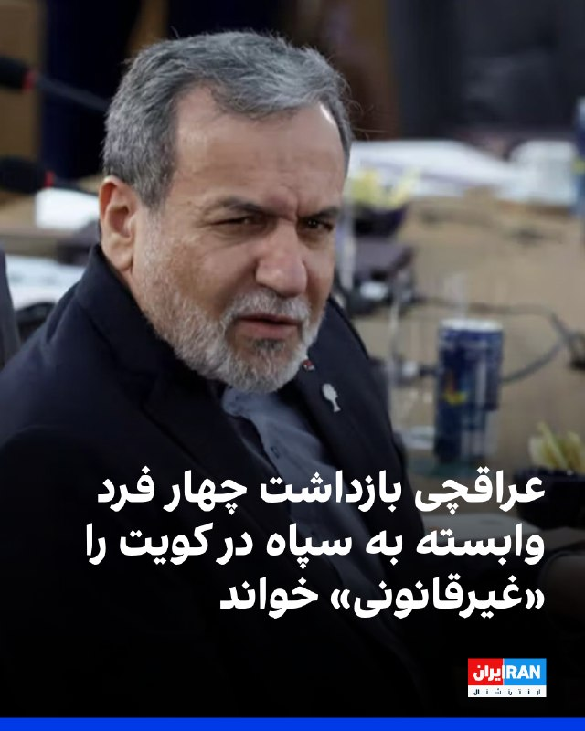

عباس عراقچی، وزیر خارجه جمهوری اسلامی، در واکنش به بازداشت چهار فرد «وابسته به سپاه پاسداران» در کویت، در شبکه اجتماعی ایکس نوشت کویت «در تلاشی آشکار برای ایجاد تفرقه»، به یک قایق ایرانی در خلیج فارس حمله کرده و چهار شهروند ایرانی را بازداشت کرده است.

او افزود این اقدام «در نزدیکی جزیره‌ای رخ داده که آمریکا از آن برای حمله به ایران استفاده کرده است» و تاکید کرد جمهوری اسلامی خواستار آزادی فوری این افراد است و «حق پاسخ‌گویی را برای خود محفوظ می‌داند.»
https://iranintl.com/202605132548

## iranintlTV — post 337039

  <a href="https://t.me/IranintlTV/337039" target="_blank">📎 Download file</a>

🎧نسخه صوتی تیتراول با نیوشا صارمی: سفر بی‌سابقه نتانیاهو به امارات در میانه جنگ ایران؛ افشای ابعاد تازه درگیری
@iranintlTV

## iranintlTV — post 337038

  <a href="telegram/content/iranintlTV_337038_1778696226.mp4" target="_blank">🎬 Download video</a>

روزهای گذشته تصاویر ماهواره‌ای از شکل‌گیری یک لکه نفتی در نزدیکی خارک خبر دادند. لکه‌ای به وسعت حدود ۷۰ کیلومتر مربع که در بخش غربی خارک نشت کرده و نگرانی‌ها درباره امنیت انرژی، آسیب زیست‌محیطی و امکان پاکسازی در شرایط جنگی را تشدید کرده است. منشا دقیق این آلودگی مشخص نیست، اما مواردی از نشت نفت تا تخلیه پسماند نفتکش‌ها مطرح شده است.

کاوه مدنی، کارشناس آب و محیط زیست و تیمش به بررسی منشا این آلودگی پرداختند.

@iranintltv

---
📅 بروزرسانی: 1405/02/23 21:22
---

## iranintlTV — post 337037

  

سی‌ان‌ان گزارش داد سنای آمریکا برای هفتمین بار در سال جاری، طرحی را که با هدف محدود کردن اختیارات جنگی دونالد ترامپ و الزام او به دریافت مجوز کنگره برای هرگونه اقدام نظامی آینده در ایران ارائه شده بود، رد کرد.

این طرح با ۵۰ رای مخالف در برابر ۴۹ رای موافق از پیشبرد بازماند. بر اساس این گزارش، جان فترمن، سناتور دموکرات، در کنار جمهوری‌خواهان به رد طرح رای داد و رند پال، سوزان کالینز و لیزا مورکوفسکی، سناتورهای جمهوری‌خواه، همراه دموکرات‌ها از آن حمایت کردند.

سی‌ان‌ان نوشت برخی جمهوری‌خواهان، از جمله مورکوفسکی که امروز برای نخستین بار از این تلاش برای محدود کردن اختیارات جنگی حمایت کرد و تام تیلیس، استدلال کرده‌اند که با ادامه یافتن درگیری‌ها به بیش از ۶۰ روز، کنگره باید در مجوز دادن به جنگ نقش داشته باشد یا دست‌کم نظارت بیشتری اعمال کند.
https://iranintl.com/202605133904

## iranintlTV — post 337036

  

دفتر نخست‌وزیری اسرائیل اعلام کرد بنیامین نتانیاهو، نخست‌وزیر این کشور، در جریان جنگ آمریکا و اسرائیل با جمهوری اسلامی، به‌طور مخفیانه به امارات متحده عربی سفر کرده است.

بر اساس این گزارش، نتانیاهو در این سفر با محمد بن زاید آل نهیان، رییس امارات متحده عربی، دیدار کرد.

دفتر نخست‌وزیری اسرائیل گفت این سفر به یک «پیشرفت تاریخی» در روابط اسرائیل و امارات متحده عربی منجر شده است.

پیش‌تر مقام‌های ارشد آمریکایی تایید کرده بودند اسرائیل در جریان جنگ با جمهوری اسلامی، یک سامانه گنبد آهنین و نیروهایی را برای راه‌اندازی آن به امارات فرستاده بود.
https://iranintl.com/202605131963

## iranintlTV — post 337035

  <a href="telegram/content/iranintlTV_337035_1778694740.mp4" target="_blank">🎬 Download video</a>

دفتر نخست‌وزیر اسرائیل اعلام کرد بنیامین نتانیاهو در دوران جنگ به امارات متحده عربی سفر کرده است.

اردوان روزبه، خبرنگار ایران‌اینترنشنال، گزارش می‌دهد

@iranintltv

## iranintlTV — post 337034

  <a href="telegram/content/iranintlTV_337034_1778694742.mp4" target="_blank">🎬 Download video</a>

گزارش‌های تازه ابعاد جدیدی از نقش و تحرکات ریاض و ابوظبی در جنگ ایران رو فاش می‌کنند. وال استریت ژورنال می‌گوید دیوید بارنیا، رییس موساد، در دوران جنگ دست‌کم دو بار، به صورت محرمانه به امارات سفر کرده است.

سمیرا قرایی و بابک اسحاقی، خبرنگاران ایران‌اینترنشنال، گزارش می‌دهند
@iranintltv

## iranintlTV — post 337033

  

🔻خبرگزاری تسنیم، وابسته به سپاه پاسداران نوشت که مجید موسوی، فرمانده نیروی هوافضا سپاه در پیامی خطاب به بازیکنان تیم ملی پیش از حضور در جام جهانی نوشته است: «سلامی (فرمانده پیشین سپاه پاسداران) توصیه کرد: اگر می‌خواهید جام را ببرید تیمی بازی کنید.»

@iranintltvsport

## iranintlTV — post 337032

  <a href="telegram/content/iranintlTV_337032_1778694746.mp4" target="_blank">🎬 Download video</a>

تیتر اول با نیوشا صارمی، چهارشنبه ۲۳ اردیبهشت
@iranintltv

## iranintlTV — post 337031

  

یک استاد ایرانی-آمریکایی دانشگاه آرکانزاس که اواخر ماه مارس به‌دلیل «فعالیت‌هایی در طرفداری از علی خامنه‌ای رهبر کشته‌شده جمهور اسلامی» از موقعیت رسمی خود برکنار شد، اکنون با تحقیقاتی درباره احتمال تخلفات علمی مواجه است.

انتشارات دانشگاه کمبریج که کتاب شیرین سعیدی، استاد ایرانی-آمریکایی دانشگاه آرکانزاس را منتشر کرده، در حال بررسی اتهاماتی است مبنی بر اینکه این اثر شامل مصاحبه‌های جعلی یا بدون مجوز با زنان قربانی حکومت ایران است. این کتاب بر پایه رساله دکترای شیرین سعیدی نوشته شده است.

ایران‌اینترنشنال دریافته است که دانشگاه کمبریج نیز در حال بررسی رساله دکترای سعیدی به‌دلیل احتمال تقلب است.

دکتر جی سیلوریا، رییس دانشگاه آرکانزاس، سعیدی را به دلایلی غیرمرتبط با تحقیقات کمبریج اخراج کرده است. او این تصمیم را به هیات امنای دانشگاه ابلاغ کرده و قرار است این هیات در ۲۱ مه پرونده اخراج او را بررسی کند.

کتاب سعیدی با عنوان «زنان و جمهوری اسلامی: چگونه شهروندی جنسیتی دولت ایران را شکل می‌دهد» اکنون در بریتانیا زیر ذره‌بین قرار دارد.

ادامه این گزارش را در وبسایت ایران‌اینترنشنال بخوانید
https://iranintl.com/202

## iranintlTV — post 337030

  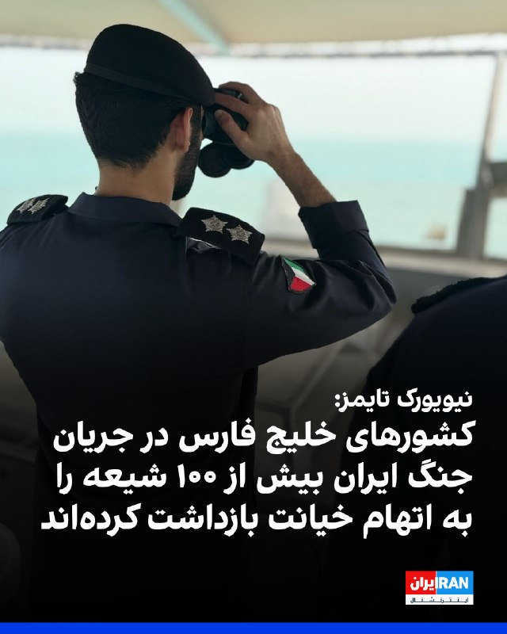

نیویورک تایمز در گزارشی اعلام کرد که کشورهای حاشیه خلیج فارس در جریان جنگ ایران، بیش از ۱۰۰ شیعه را به اتهام خیانت بازداشت کرده‌اند.
کویت، امارات متحده عربی و بحرین از جمله کشورهایی هستند که موج بازداشت‌ها در آن‌ها گزارش شده است.
در بحرین ۶۹ نفر از تابعیت محروم شده‌اند و ۴۱ نفر دیگر به اتهام ارتباط با سپاه پاسداران بازداشت شده‌اند. یک گروه حقوق بشری می‌گوید ۳۷ نفر از بازداشت‌شدگان روحانی شیعه بوده‌اند.
در امارات متحده عربی ۲۷ نفر به عضویت در «سازمان تروریستی شیعه» متهم شده‌اند. دولت تصاویر آن‌ها را منتشر کرده و برخی چهره‌های نزدیک به حکومت خواستار مجازات شدید شده‌اند.

https://iranintl.com/202605137296

## iranintlTV — post 337029

  

ایران، قربانی جنگ، فساد و ریاکاری جمهوری اسلامی است و میان مردم و حاکمیت، دریایی از خون قرار گرفته است. جمهوری اسلامی و مردم در نقطه‌ای تاریخی و بی‌بازگشت ایستاده‌اند. هزینه‌ای که به مردم ایران تحمیل شده، جامعه را خشمگین کرده است؛ خشمی که هر روز بیشتر می‌شود.

این خشم انباشتهٔ مردم چه زمانی فوران خواهد کرد؟

«برنامه» صدای شماست. ما شما را مستقیم از ایران روی خط می‌آوریم.

برای شرکت در برنامه، همین حالا در واتس‌اپ پیام بدهید:
۰۰۴۴۷۵۲۲۱۱۰۱۱۰
۰۰۴۴۷۵۴۴۱۱۰۱۱۰
۰۰۴۴۷۵۱۱۱۰۲۵۵۳

«برنامه با کامبیز حسینی»
«یک ایران صدای شما را می‌شنود»

@iranintltv

## iranintlTV — post 337028

یک شهروند در پیامی به ایران اینترنشنال درباره سرکوب و بحران‌های اقتصادی و معیشتی می‌گوید مردم در ایران گروگان حکومت هستند. او از رهبران آمریکا و اسرائیل می‌خواهد با جمهوری اسلامی مذاکره و آتش‌بس نکنند. صدای این مخاطب با هوش مصنوعی بازخوانی شده است.

## iranintlTV — post 337027

  <a href="telegram/content/iranintlTV_337027_1778694751.mp4" target="_blank">🎬 Download video</a>

سازمان حقوق بشر برای ورزش نسبت به اجرای حکم اعدام احسان حسینی‌پور، فوتبالیست ۱۹ ساله، هشدار داد.

براساس این گزارش، حکم اعدام او در دیوان عالی تایید شده است. حسینی‌پور در اعتراضات ۱۸ دی‌ماه بازداشت شد.

گفت‌وگو با مهدی رستم‌پور، خبرنگار ورزشی
@iranintltv

## iranintlTV — post 337026

یک شهروند در پیامی به ایران اینترنشنال درباره سرکوب و بحران‌های اقتصادی و معیشتی می‌گوید مردم در ایران گروگان حکومت هستند. او از رهبران آمریکا و اسرائیل می‌خواهد با جمهوری اسلامی مذاکره و آتش‌بس نکنند. صدای این مخاطب با هوش مصنوعی بازخوانی شده است.

## iranintlTV — post 337025

  <a href="https://t.me/IranintlTV/337025" target="_blank">📎 Download file</a>

🎧نسخه صوتی اخبار شبانگاهی | چهارشنبه ۲۳ اردیبهشت
@iranintlTV

## iranintlTV — post 337024

  <a href="telegram/content/iranintlTV_337024_1778694754.mp4" target="_blank">🎬 Download video</a>

قوه قضاییه جمهوری اسلامی خبر داد احسان افرشته، جوان ۳۳ ساله‌، را به اتهام همکاری با اسرائیل، اعدام کرده اما دو منبع گفتند او، پیش از بازگشت به ایران از ترکیه، به‌طور داوطلبانه خود را به وزارت اطلاعات معرفی کرده بود اما بلافاصله در فرودگاه بازداشت شد.

گزارشی از مجتبا پورمحسن
@iranintltv

## iranintlTV — post 337023

  <a href="telegram/content/iranintlTV_337023_1778694756.mp4" target="_blank">🎬 Download video</a>

در پی موج جدید بیکاری در ایران در سایه جنگ و سرکوب، آمار رسمی از بیش از ۲۰۰هزار نفر متقاضی دریافت بیمه بیکاری خبر می‌دهد.

گفت‌وگو با نیکی محجوب، روزنامه‌نگار
@iranintltv

## iranintlTV — post 337022

  

فیصل بن فرحان، وزیر خارجه عربستان سعودی در نشست خبری مشترک با وزیر خارجه اسپانیا در مادرید اعلام کرد که بازگشت کشتیرانی در تنگه هرمز به وضعیت پیش از ۹ اسفند ضروری است.

او اضافه کرد: «امنیت تنگه هرمز و آزادی کشتیرانی، پایه ثبات اقتصاد جهانی به شمار می‌رود. به حمایت از کاهش تنش‌ها و جلوگیری از تشدید بحران ادامه می‌دهیم.»
https://iranintl.com/202605135219

---
📅 بروزرسانی: 1405/02/23 19:34
---

## iranintlTV — post 337021

  <a href="telegram/content/iranintlTV_337021_1778688246.mp4" target="_blank">🎬 Download video</a>

در حالی که مجریان صداوسیما در پاسخ به اعتراض شهروندان به شرایط کشور از جمله سرکوب، وضع معیشتی و قطع اینترنت، خواستار ترک کشور از سوی منتقدان و معترضان می‌شوند، مردم و مخاطبان ایران اینترنشنال در شعار انقلاب دی و همچنین پیام‌های ارسالی خود می‌گویند می‌جنگند و کشور را از حکومت پس می‌گیرند.

## iranintlTV — post 337020

  

🔻احمد دنیامالی، وزیر ورزش جمهوری اسلامی در حاشیه حضور مسعود پزشکیان در اردوی تیم ملی، ضمن اعلام حضور تیم ملی در جام جهانی گفت: «بازیکنان تیم ملی تصمیم گرفته‌اند سرود جمهوری اسلامی را نخوانند، بلکه آن را فریاد بزنند.»

🔹او پیش‌تر حامیان حضور در جام جهانی را «بی‌غیرت» خوانده بود.

🔹دنیامالی در این دیدار مدعی شد: «بازیکنان و اعضای کادر تیم ملی برای دفاع از ایران هم‌قسم شده‌اند و خوش‌بین هستیم که با برنامه‌ریزی انجام گرفته و تلاش‌ کادر فنی، تیم ملی برای کشور افتخارآفرینی کند.»

@iranintltvsport

## iranintlTV — post 337019

  

سنتکام اعلام کرد از زمان آغاز محاصره دریایی بنادر و سواحل جنوب ایران، ۶۷ کشتی تجاری مجبور به تغییر مسیر شده‌اند. به گفته این نهاد، نیروهای آمریکایی اجازه عبور ۱۵ کشتی حامل کمک‌های بشردوستانه را داده‌اند و چهار کشتی نیز در پی اقدامات این نیروها از کار افتاده‌اند.
https://iranintl.com/202605135107

## iranintlTV — post 337018

🔻انتشارات دانشگاه کمبریج اتهامات جعل علمی یک استاد طرفدار خامنه‌ای را بررسی می‌کند

🖋بنجامین واینتال

یک استاد ایرانی-آمریکایی دانشگاه آرکانزاس که اواخر ماه مارس به‌دلیل «فعالیت‌هایی در طرفداری از علی خامنه‌ای رهبر کشته‌شده جمهور اسلامی» از موقعیت رسمی خود برکنار شد، اکنون با تحقیقاتی درباره احتمال تخلفات علمی مواجه است.

انتشارات دانشگاه کمبریج که کتاب شیرین سعیدی، استاد ایرانی-آمریکایی دانشگاه آرکانزاس را منتشر کرده، در حال بررسی اتهاماتی است مبنی بر اینکه این اثر شامل مصاحبه‌های جعلی یا بدون مجوز با زنان قربانی حکومت ایران است. این کتاب بر پایه رساله دکترای شیرین سعیدی نوشته شده است.

ایران‌اینترنشنال دریافته است که دانشگاه کمبریج نیز در حال بررسی رساله دکترای سعیدی به‌دلیل احتمال تقلب است.

دکتر جی سیلوریا، رییس دانشگاه آرکانزاس، سعیدی را به دلایلی غیرمرتبط با تحقیقات کمبریج اخراج کرده است. او این تصمیم را به هیات امنای دانشگاه ابلاغ کرده و قرار است این هیات در ۲۱ مه پرونده اخراج او را بررسی کند.

کتاب سعیدی با عنوان «زنان و جمهوری اسلامی: چگونه شهروندی جنسیتی دولت ایران را شکل می‌دهد» اکنون در بریتانیا زیر ذره‌بین قرار دارد.
سخنگوی انتشارات دانشگاه کمبریج به ایران‌اینترنشنال گفت: «انتشارات دانشگاه کمبریج تمام شکایات مربوط به آثار منتشرشده را جدی می‌گیرد و بررسی مسائل مطرح‌شده را مطابق با دستورالعمل‌های استاندارد COPE ادامه می‌دهد.»

COPE مخفف کمیته اخلاق در انتشار است که به مسائل اخلاقی در آثار علمی می‌پردازد.

ایران‌اینترنشنال نسخه‌ای از نامه‌ای را به دست آورده که مریم نوری، نویسنده خاطرات «در جست‌وجوی رهایی»، به انتشارات دانشگاه کمبریج ارسال کرده و در آن سعیدی را به ساختگی بودن روایت‌هایش متهم کرده است.

نوری، که در سال ۱۹۸۵ در حالی که باردار بود به‌دست جمهوری اسلامی زندانی شد و به‌گفته خودش مجبور شد فرزندش را در زندان به دنیا بیاورد، در نامه‌اش نوشته است: «این نامه را برای ثبت شکایت رسمی درباره استفاده غیراخلاقی و بدون مجوز از خاطرات شخصی‌ام و جعل محتوای مصاحبه از سوی دکتر شیرین سعیدی می‌نویسم.»

او تاکید کرد: «من هرگز با خانم سعیدی ملاقات نکرده‌ام و هیچ‌گونه مصاحبه‌ای با او در شهر کلن یا هیچ شهر دیگری در آلمان نداشته‌ام. او از محتوای کتاب من در رساله دکتری و کتاب منتشرشده خود بدون اجازه کتبی یا شفاهی من استفاده کرده و از آن برای منافع شخصی، از جمله ارتقای جایگاه دانشگاهی و حرفه‌ای خود بهره برده است.»

نوری افزود: «این اقدام را نقض آشکار حقوق و کرامت شخصی خود می‌دانم و آن را به‌شدت محکوم می‌کنم.»
سخنگوی دانشگاه کمبریج نیز اعلام کرد: «دانشگاه اتهامات مربوط به تخلفات علمی را جدی می‌گیرد و هرگونه نگرانی مطرح‌شده را مطابق با سیاست‌ها و رویه‌های مربوطه بررسی می‌کند. این فرایندها ذاتا محرمانه هستند.»

نسرین پروَز، که هشت سال در ایران زندانی و شکنجه شده بود، نیز در مجموعه‌ای از هفت پست در شبکه ایکس در ماه دسامبر، ادعای مصاحبه سعیدی با خود را رد کرد.

او نوشت: «من هرگز سعیدی را نمی‌شناختم و هیچ مصاحبه‌ای با او نداشته‌ام. او فقط از نسخه فارسی کتاب من که بیش از ۲۰ سال پیش منتشر شده استفاده کرده است.»

سعیدی و وکیلش، جی‌جی تامپسون، به پرسش‌های رسانه‌ای ایران‌اینترنشنال پاسخی نداده‌اند.

دانشگاه آرکانزاس پیش از اخراج سعیدی نیز او را به‌دلیل استفاده ادعایی نادرست از سربرگ دانشگاه برای درخواست آزادی حمید نوری مورد تنبیه قرار داده بود. حمید نوری در سال ۲۰۲۲ در دادگاهی در سوئد به‌دلیل مشارکت در اعدام هزاران زندانی سیاسی در زندان گوهردشت در سال ۱۹۸۸ محکوم شد.

سعیدی مدعی است برای استفاده از سربرگ دانشگاه مجوز داشته است.

پروَز در شبکه ایکس نوشت: «دفاع او از حمید نوری، یکی از عاملان اعدام‌های سال ۱۹۸۸، نشان می‌دهد او در کدام سوی تاریخ ایستاده است.»
لادن بازرگان، مدیر سازمان «ائتلاف علیه حامیان رژیم جمهوری اسلامی ایران»، نخستین کسی بود که نقش سعیدی در کمک به حمید نوری در سوئد را افشا کرد.

او که در دادگاه نوری حضور داشت، گفت مترجم دادگاه تایید کرده که سعیدی به نفع نوری مداخله کرده است.

بیژن بازرگان، برادر لادن بازرگان، از زندانیان سیاسی چپ‌گرا بود که در کشتار سال ۱۹۸۸ به‌دست حکومت ایران کشته شد.

بازرگان همچنین موارد ادعایی جعل در آثار علمی سعیدی را شناسایی کرده است.

او به ایران‌اینترنشنال گفت: «زندانیان سیاسی سابقی که نامشان در رساله و کتاب سعیدی آمده، به‌طور علنی انجام مصاحبه با او را رد کرده‌اند و اکنون پرسش‌هایی جدی درباره اسناد، ضبط‌ها، فرم‌های رضایت، دقت استنادها و حتی وجود برخی افراد ذکرشده در این آثار مطرح است.»

🔗ادامه این گزارش را اینجا بخوانید
@iranintltv

## iranintlTV — post 337017

🔻مدیران انویدیا، تسلا، اپل و بوئینگ، ترامپ را در سفر به چین همراهی می‌کنند

دونالد ترامپ، رییس‌جمهوری آمریکا، در سفر به چین برای دیدار با شی جین‌پینگ، رییس‌جمهوری این کشور، گروهی از مدیران بزرگ‌ترین شرکت‌های آمریکایی از جمله انویدیا، تسلا، اپل، بوئینگ و گلدمن ساکس را با خود همراه کرده است.

ترامپ چهارشنبه ۲۳ اردیبهشت پیش از ورود به پکن، در شبکه اجتماعی تروث‌سوشال نوشت جنسن هوانگ، مدیرعامل انویدیا، همراه او در هواپیمای ریاست‌جمهوری آمریکا حضور دارد و گزارش شبکه سی‌ان‌بی‌سی درباره دعوت نشدن او به این سفر «خبر جعلی» است.

بر اساس آنچه ترامپ نوشت «جنسن، ایلان، تیم اپل، لری فینک، استیون شوارتزمن، کلی اورتبرگ از بوئینگ، برایان سایکس از کارگیل، جین فریزر از سیتی، لری کالپ از جی‌ای ایرواسپیس، دیوید سولومون از گلدمن ساکس، سانجی مهروترا از مایکرون، کریستیانو آمون از کوالکام و بسیاری دیگر» در این سفر حضور دارند.

رییس‌جمهوری آمریکا اعلام کرد قصد دارد در دیدار با شی جین‌پینگ از او بخواهد اقتصاد چین را بیش از پیش به روی شرکت‌ها و سرمایه‌گذاری آمریکایی باز کند.
او نوشت: «از رییس‌جمهوری شی خواهم خواست چین را باز کند تا این افراد بتوانند توانایی‌های خود را به کار بگیرند و به ارتقای جمهوری خلق چین کمک کنند.»

حل مسائل تجاری

رویترز نوشت بیشتر شرکت‌های حاضر در این سفر به دنبال حل مسائل تجاری و محدودیت‌های موجود در بازار چین هستند.

انویدیا از جمله شرکت‌هایی است که برای فروش تراشه‌های پیشرفته هوش مصنوعی خود در چین با محدودیت‌های نظارتی روبه‌رو شده است.

به گزارش رویترز، مذاکرات دو طرف علاوه بر تجارت، موضوعاتی چون جنگ ایران، فروش تسلیحات آمریکا به تایوان، صادرات فناوری‌های پیشرفته، هوش مصنوعی و کاهش تنش‌های تجاری میان واشینگتن و پکن را در بر می‌گیرد.
همزمان اسکات بسنت، وزیر خزانه‌داری آمریکا مذاکره‌کننده تجاری آمریکا، در کره جنوبی با مقام‌های چینی دیدار کرد. خبرگزاری دولتی شین‌هوا این گفت‌وگوها را «صریح، عمیق و سازنده» توصیف کرد.

رویترز نوشت ترامپ در حالی وارد مذاکرات با چین شده که ادامه جنگ ایران و افزایش تورم در آمریکا، فشار سیاسی بر او را افزایش داده است. در مقابل، شی جین‌پینگ با فشار داخلی کمتری روبه‌رو است.

انتظار می‌رود ترامپ در دیدار با شی، از چین بخواهد تهران را برای رسیدن به توافق با واشینگتن و پایان دادن به جنگ ایران ترغیب کند؛ هرچند ترامپ گفته تصور نمی‌کند به کمک پکن نیاز داشته باشد.

چین چهارشنبه بار دیگر مخالفت شدید خود را با فروش تسلیحات آمریکا به تایوان اعلام کرد. هنوز مشخص نیست آیا ترامپ بسته تسلیحاتی ۱۴ میلیارد دلاری برای تایوان را تایید خواهد کرد یا نه.

آمریکا با وجود نداشتن روابط دیپلماتیک رسمی با تایوان، بر اساس قانون موظف است ابزارهای دفاعی لازم را در اختیار این جزیره قرار دهد.
🔗وب‌سایت ایران‌اینترنشنال
@iranintltv

## iranintlTV — post 337016

  

ارتش اسرائیل و شاباک اعلام کردند حمزه شرباصی، از فرماندهان گردان «شجاعیه» حماس، هفته گذشته در حمله‌ای هوایی در شمال نوار غزه کشته شد؛ فردی که به گفته آن‌ها در حمله هفت اکتبر ۲۰۲۳ به پایگاه «نحل عوز» مشارکت داشت.

بر اساس این بیانیه، شرباصی در جریان حمله هفت اکتبر ۲۰۲۳ وارد خاک اسرائیل شد و در حمله به پایگاه نحل عوز که در آن شماری از سربازان اسرائیلی کشته و ربوده شدند، نقش داشت.

ارتش اسرائیل و شاباک اعلام کردند شرباصی اخیرا در نزدیکی «خط زرد» فعالیت می‌کرد و در چارچوب مسئولیت خود، در پیشبرد طرح‌هایی علیه نیروهای اسرائیلی در منطقه نقش داشت.

در همین حمله، عزام الحیه، پسر ۲۳ ساله خلیل الحیه، مذاکره‌کننده ارشد حماس نیز کشته شد.

به گفته ارتش اسرائیل، الحیه عضو یگان نخبه حماس بود و اخیرا «نقشی مرکزی» در این گروه داشت.

ارتش اسرائیل اعلام کرد نیروهایش در فرماندهی جنوب، مطابق توافق آتش‌بس، همچنان در منطقه مستقر هستند و برای رفع هرگونه تهدید فوری به فعالیت خود ادامه خواهند داد.
https://iranintl.com/202605136406

## iranintlTV — post 337015

  

خبرگزاری تسنیم، وابسته به سپاه پاسداران، گزارش داد نعیم قاسم، دبیرکل حزب‌الله لبنان، در پیامی به علیرضا اعرافی، مدیر حوزه‌های علمیه جمهوری اسلامی، اعلام کرد که «مقاومت هرگز تسلیم نخواهد شد.»

نعیم قاسم در پیام خود نوشت: «ما قدردان حمایت خالصانه و مستمر جمهوری اسلامی از ابتدا تا امروز هستیم. حمایتی که با دستور روح‌الله خمینی آغاز شد و تحت هدایت علی خامنه‌ای و از طریق سپاه پاسداران و خصوصا نیروی قدس ادامه یافت.»

دبیرکل حزب‌الله حملات اخیر آمریکا و اسرائیل به جمهوری اسلامی را «حمله به پرچم مقاومت، استقلال و حمایت از فلسطین و قدس» دانست و نوشت با این حال مجتبی خامنه‌ای، این مرحله را نیز با پیروزی پشت سر خواهد گذاشت.
https://iranintl.com/202605137004

## iranintlTV — post 337014

🔻از مکزیکوسیتی تا نیویورک؛ کالاهای جام جهانی با برچسب «ساخت چین»

کمتر از یک ماه مانده به آغاز جام جهانی فوتبال ۲۰۲۶ در مکزیکوسیتی، موج صادرات کالاهای ساخت چین به کشورهای میزبان این مسابقات آغاز شده است؛ از توپ فوتبال و پرچم گرفته تا لباس هواداری و ماگ‌های ورزشی.

جام جهانی ۲۰۲۶ از ۲۱ خرداد تا ۲۸ تیر ۱۴۰۵ در آمریکا، کانادا و مکزیک برگزار می‌شود و برای نخستین‌بار با حضور ۴۸ تیم در ۱۶ شهر برگزار خواهد شد.

شرکت «کینگدائو واندرفول فلگ» در استان شاندونگ چین اعلام کرد بلافاصله پس از مشخص شدن فهرست تیم‌های حاضر در جام جهانی، سفارش تولید پرچم کشورهای شرکت‌کننده به‌سرعت افزایش یافت. شیائو چانگ‌آی، رییس این شرکت، گفت تولید پرچم تیم‌هایی مانند برزیل، آرژانتین و آلمان از ماه مارس آغاز شده بود، اما با شروع مسابقات، سفارش‌ها به‌صورت لحظه‌ای و با تحویل فوری ثبت خواهند شد.

بر اساس اعلام گمرک چین، این شرکت اکنون به‌صورت شبانه‌روزی فعالیت می‌کند و تولید روزانه آن به بیش از ۱۰۰ هزار پرچم رسیده است.

همزمان شرکت «نینگبو اکو-ویل تکنولوژی» که تولیدکننده ماگ، لیوان و لوازم هواداری است، اعلام کرد صادراتش به آمریکا، کانادا و مکزیک در چهار ماه نخست سال ۲۰۲۶ نسبت به مدت مشابه سال قبل ۴۷ درصد افزایش یافته و به ۴۰ میلیون یوان رسیده است. این شرکت افزایش تقاضا برای کالاهای دارای لوگوی رسمی تیم‌های فوتبال را عامل اصلی رشد صادرات دانست.

داده‌های گمرک نینگبو نشان می‌دهد صادرات تجهیزات و کالاهای ورزشی از این بندر بین ژانویه تا آوریل به ۵.۷۴ میلیارد یوان رسیده که نسبت به سال گذشته بیش از ۱۱ درصد رشد داشته است.
🔗وب‌سایت ایران‌اینترنشنال
@iranintltv

## iranintlTV — post 337013

  <a href="telegram/content/iranintlTV_337013_1778688250.mp4" target="_blank">🎬 Download video</a>

وزارت خارجه لبنان با ارسال نامه‌ای رسمی به دبیرکل و رییس شورای امنیت سازمان ملل، از جمهوری اسلامی شکایت کرد. لبنان در این نامه نهادهای جمهوری اسلامی، از جمله سپاه پاسداران را مسئول درگیر شدن این کشور در جنگ، برخلاف خواست دولت معرفی کرد.

گزارش می فرحات، خبرنگار ایران‌اینترنشنال
@iranintltv

## iranintlTV — post 337012

  <a href="telegram/content/iranintlTV_337012_1778688251.mp4" target="_blank">🎬 Download video</a>

محسن کدیور، مدرس مطالعات اسلامی در دانشگاه دوک آمریکا، در گفت‌وگو با خبرگزاری جمهوری اسلامی، از تجمعات شبانه حمایت کرد. او که اولین بار پس از ۱۷ سال، حرفهایش اجازه انتشار می‌گیرد، حضور هواداران حکومت در خیابان‌ها را دفاع مردم ایران از میهن توصیف کرد.

گفت‌وگو با محدجواد اکبرین، عضو تحریریه ایران‌اینترنشنال
@iranintltv

## iranintlTV — post 337011

🔻وال‌استریت ژورنال: رییس موساد در جریان «جنگ ایران» به امارات متحده عربی سفر کرد

دیوید بارنئا، رییس سازمان اطلاعات و وظایف ویژه اسرائیل (موساد)، در جریان جنگ اخیر آمریکا و اسرائیل با جمهوری اسلامی، دست‌کم دو بار به‌صورت محرمانه به امارات متحده عربی سفر کرده تا درباره هماهنگی‌های مرتبط با جنگ گفت‌وگو کند.

روزنامه وال‌استریت ژورنال چهارشنبه ۲۳ اردیبهشت به نقل از مقام‌های عرب و یک منبع آگاه گزارش داد بارنئا در دو ماه‌ گذشته، دست‌کم دو بار با هدف هماهنگی درباره جنگ با جمهوری اسلامی به امارات متحده عربی سفر کرده است.

آنچه در این گزارش آمده است، نشانه‌ای از گسترش همکاری‌های امنیتی میان اسرائیل و امارات متحده عربی است.

وال‌استریت ژورنال نوشت دو کشور در طول جنگ، هماهنگی امنیتی نزدیکی داشته‌اند.
این روزنامه پیش‌تر گزارش داده بود اسرائیل سامانه‌های پدافندی گنبد آهنین و ده‌ها نیروی نظامی را برای مقابله با حملات موشکی و پهپادی جمهوری اسلامی به امارات متحده عربی فرستاده است.

وال‌استریت ژورنال ۲۱ اردیبهشت نیز به نقل از منابع آگاه خبر داد که امارات متحده عربی به‌طور مخفیانه حملاتی به جمهوری اسلامی کرده و در یکی از این حملات در ماه آوریل، پالایشگاه نفتی جزیره لاوان در ایران را هدف قرار داده است.

به‌نوشته وال‌استریت ژورنال، این اقدام می‌تواند امارات را به یکی از طرف‌های فعال جنگی تبدیل کند که در آن، خود بیش از هر کشور دیگری هدف حملات حکومت ایران بوده است.

برخی مقامات جمهوری اسلامی پیش از این از دست داشتن امارات در بعضی حملات به جنوب ایران سخن گفته بودند.

رهبران جمهوری اسلامی در جریان آتش‌بس نیز به تندی به این کشور هشدار داده‌اند.

امارات متحده عربی حتی در جریان آتش‌بس چند بار هدف حملات موشکی و پهپادی قرار گرفته است.

وزارت خارجه امارات متحده عربی و دفتر بنیامین نتانیاهو، نخست‌وزیر اسرائیل، تاکنون به درخواست وال‌استریت ژورنال برای اظهار نظر پاسخ نداده‌اند.
موساد: همین حالا وقت عمل است

کانال ۱۳ اسرائیل ۱۹ اردیبهشت به نقل از یک مقام اسرائیلی که نامش فاش نشده گزارش داد دولت این کشور همچنان در وضعیت «انتظار دائمی» درباره تصمیم مورد انتظار دونالد ترامپ، رییس‌جمهوری آمریکا، در قبال ایران قرار دارد.

بر اساس این گزارش، مقام‌های نظامی و اطلاعاتی اسرائیل در جریان نشست‌های اخیر، مواضعی تهاجمی‌تر علیه تهران را به نتانیاهو ارائه کرده‌اند.

این گزارش افزود ارتش اسرائیل وضعیت کنونی توان نظامی [حکومت] ایران را یک «فرصت عملیاتی» برای از سرگیری حملات و «تکمیل ماموریت» می‌داند.

کانال ۱۳ تلویزیون اسرائیل گزارش داد موساد به نتانیاهو گفته است: «باید همین حالا به ایران حمله کرد.»

بنا بر این گزارش، موساد معتقد است از سرگیری جنگ می‌تواند روند فروپاشی حکومت ایران را تسریع کند.
🔗وب‌سایت ایران‌اینترنشنال
@iranintltv

## iranintlTV — post 337010

  <a href="https://t.me/IranintlTV/337010" target="_blank">📎 Download file</a>

🎧نسخه صوتی اخبار نیم‌روزی | چهارشنبه ۲۳ اردیبهشت
@iranintlTV

## iranintlTV — post 337009

  

شاخوان عبدالله، رییس فراکسیون حزب دموکرات کردستان عراق، در گفت‌وگویی اختصاصی با ایران‌اینترنشنال تایید کرد که الزیدی توصیه‌های واشنگتن درباره دور نگه داشتن گروه‌های مسلح از وزارتخانه‌ها را جدی گرفته است.

به گفته عبدالله، تفاوت زیادی میان کابینه السودانی و کابینه الزیدی در زمینه حضور گروه‌های مسلح وجود دارد؛ چرا که در دولت السودانی شمار زیادی از افراد وابسته به گروه‌های مسلح در دولت حضور داشتند، اما تا این لحظه روند در دولت الزیدی به این شکل نیست، مگر این‌که در لحظات آخر تغییراتی ایجاد شود.

فادی الشمری، مشاور نخست‌وزیر، سه‌شنبه در گفت‌وگویی خبری تایید کرده بود آمریکایی‌ها اطلاع داده‌اند که اگر حتی یک وزیر وابسته به گروه‌های مسلح در دولت حضور داشته باشد، به‌طور کامل با دولت همکاری نخواهند کرد.

بر اساس برخی گزارش‌ها، قرار است پنج‌شنبه پارلمان عراق بخشی از کابینه دولت الزیدی را به رای بگذارد.

در عراق، «نخست‌وزیر مکلف» به فردی گفته می‌شود که مامور تشکیل کابینه شده اما هنوز از پارلمان رای اعتماد نگرفته، قدرت اجرایی ندارد و رسما در سمت نخست‌وزیر فعالیت نمی‌کند.
https://iranintl.com/202605138519

## iranintlTV — post 337008

🔻اینترنت، نابرابری و کنترل روانی در وضعیت بحران

🖋تحلیل - صبا آلاله

اوایل ورود اینترنت، بسیاری آن را فقط یک فناوری تازه یا ابزار سرگرمی می‌دانستند؛ اما به‌تدریج اینترنت از یک امکان جانبی خارج شد و به بخشی از جریان اصلی زندگی تبدیل شد؛ تا جایی که امروز بخش بزرگی از کار، ارتباطات، آموزش و حتی تجربه ما از جهان بدون آن قابل تصور نیست.

امروزه برای میلیون‌ها نفر، اینترنت بخشی از زیرساخت زندگی روزمره و شرط حضور در جهان اجتماعی است. معیشت بخش بزرگی از جامعه نیز به اینترنت وابسته شده است؛ از فروشگاه‌های آنلاین و کسب‌وکارهای کوچک گرفته تا رانندگان تاکسی‌های اینترنتی، افراد شاغل به‌صورت دورکاری و پروژه‌ای، تولیدکنندگان محتوا و مشاغلی که شبکه‌های اجتماعی بستر اصلی فعالیت آن‌هاست.

به همین دلیل، قطع یا محدودسازی اینترنت فقط به معنای کند شدن ارتباطات نیست، بلکه می‌تواند مستقیما جریان زندگی، درآمد و احساس امنیت افراد را مختل کند.

شبکه‌های اجتماعی و پیام‌رسان‌ها در سال‌های اخیر به بخشی از تجربه جمعی جامعه تبدیل شده‌اند؛ فضایی برای حرف زدن، دیده شدن، روایت کردن و شریک شدن در تجربه‌های مشترک. افراد بخش مهمی از احساس باهم‌بودن را در فضای دیجیتال تجربه می‌کنند.

در بحران‌ها، همین فضا می‌تواند به بستری برای همدلی، انتقال تجربه، شکل‌گیری حافظه جمعی و حتی سازماندهی اجتماعی تبدیل شود.

این فضا بخشی از تجربه روانی و اجتماعی انسان امروز شده است؛ جایی که افراد در آن خود را بیان می‌کنند، دیده می‌شوند و احساس می‌کنند به جهان پیرامون متصل‌اند. در چنین شرایطی، محرومیت از اینترنت فقط محرومیت از یک ابزار نیست، بلکه می‌تواند تجربه‌ای از حذف شدن، نادیده گرفته شدن و قطع ارتباط با جهان بیرون باشد؛ وضعیتی که افراد در آن نوعی محرومیت روانی و اجتماعی را تجربه می‌کنند.
اینترنت و کنترل ادارک

با توجه به اینکه اینترنت در جامعه ما همواره با نوسان، کندی و قطعی‌های دوره‌ای همراه بوده، در زمان‌های بحران این اختلال‌ها شدت بیشتری پیدا می‌کند.

این وضعیت نشان می‌دهد که دسترسی به اطلاعات و امکان اشتراک‌گذاری روایت‌ها در شرایط بحرانی به مسئله‌ای حساس تبدیل می‌شود؛ جایی که کنترل یا محدودسازی اینترنت می‌تواند بر آگاهی جمعی و شکل‌گیری روایت‌های عمومی اثر بگذارد. هرچه اینترنت بیشتر در زندگی روزمره ریشه دوانده، حساسیت نسبت به کنترل آن نیز بیشتر شده است.

در لحظه‌های بحران، قطع یا محدودسازی اینترنت فقط به کمبود اطلاعات منجر نمی‌شود، بلکه پیوستگی تجربه مشترک از واقعیت را دچار اختلال می‌کند. افراد به تصویر هم‌زمان و مشترکی از آنچه در حال رخ دادن است دسترسی ندارند؛ خبرها با تاخیر می‌رسند، روایت‌ها ناقص‌اند و منابع مختلف اطلاعاتی هم‌پوشانی ندارند. نتیجه این وضعیت، شکل‌گیری نوعی تعلیق ذهنی و ناامنی جمعی است؛ وضعیتی که در آن تشخیص واقعیت دشوارتر شده و احساس اطمینان نسبت به جهان پیرامون کاهش می‌یابد.

در چنین شرایطی، اختلال در اینترنت می‌تواند درک مشترک جامعه از واقعیت را دچار گسست و آشفتگی کند.
🔗ادامه این مطلب را اینجا بخوانید
@iranintltv

## iranintlTV — post 337007

  

مهدی طباطبایی، معاون ارتباطات و اطلاع‌رسانی دفتر مسعود پزشکیان، گفت اگر همه‌پرسی برگزار شود، مردم در شرایط جنگی، امنیت را به سهولت دسترسی به اینترنت ترجیح خواهند داد.

طباطبایی در واکنش به انتقادها درباره محدودیت‌های اینترنتی و «اینترنت پرو» گفت تصمیم‌های مربوط به اینترنت با اجماع نهادهای تخصصی و امنیتی و در شورای عالی امنیت ملی، بر اساس ملاحظات امنیتی و شرایط جنگی اتخاذ شده است.

او افزود «در وضعیت جنگی، باز بودن کامل اینترنت بین‌الملل اساسا قابل تصور نیست.»

طباطبایی گفت در شورای عالی امنیت ملی، کمیته‌ای مسئول بررسی وضعیت ارتباطات و فضای مجازی در شرایط ویژه جنگی بوده و جمع‌بندی کارشناسی این کمیته این بوده که اینترنت در چنین شرایطی می‌تواند «مخاطرات امنیتی جدی برای کشور» به همراه داشته باشد.

او همچنین درباره طرح «اینترنت پرو» گفت این طرح برای پاسخ به نیاز برخی کسب‌وکارها و فعالان اقتصادی وابسته به اینترنت بین‌الملل طراحی شده تا در دوره محدودیت‌ها، فعالیت‌های ضروری آن‌ها مختل نشود.
https://iranintl.com/202605137018

## iranintlTV — post 337006

همزمان با ادامه رقابت تجاری و فناوری میان آمریکا و چین، سفر دونالد ترامپ، رییس‌جمهوری آمریکا به پکن دوباره بحث درباره آینده روابط اقتصادی دو قدرت بزرگ جهان را مطرح کرده است. با وجود تعرفه‌ها، تحریم‌ها و رقابت سیاسی، شرکت‌های بزرگ آمریکایی و چینی همچنان به بازارهای یکدیگر وابسته‌اند.
مهدی بیگی، عضو تحریریه ایران‌اینترنشنال، در «پیوست» به این موضوع می‌پردازد
@iranintltv

## iranintlTV — post 337005

  <a href="telegram/content/iranintlTV_337005_1778688254.mp4" target="_blank">🎬 Download video</a>

رییس‌جمهور آمریکا پس از ۹ سال وارد پکن شد تا با رهبر جمهوری خلق چین، دیدار و گفت‌وگو کند. دونالد ترامپ می‌گوید در مورد ایران به کمک شی جین‌پینگ نیاز ندارد.

سمیرا قرایی، خبرنگار ایران‌اینترنشنال، گزارش می‌دهد
@iranintltv

## iranintlTV — post 337004

  <a href="telegram/content/iranintlTV_337004_1778688256.mp4" target="_blank">🎬 Download video</a>

انتشار کتاب «زوجی تقریبا کامل»، درباره ارتباط رییس‌جمهور فرانسه و همسرش مورد توجه رسانه‌ها قرار گرفت. فلوریان تاردیف، روزنامه‌نگار فرانسوی دراین کتاب از ارتباط امانوئل مکرون و گلشیفته فراهانی و رد و بدل شدن پیام‌های خصوصی میان آنها خبر داد.

گفت‌وگو با محمدرضا شاهید، روزنامه‌نگار
@iranintltv

## iranintlTV — post 337003

سرخط خبرهای چهارشنبه ۲۳ اردیبهشت
@iranintltv

## iranintlTV — post 337002

  <a href="telegram/content/iranintlTV_337002_1778688257.mp4" target="_blank">🎬 Download video</a>

وب‌سایت اقتصادنیوز گزارش داد با وجود تثبیت نمایشی نرخ دلار از سوی بانک مرکزی در محدوده ۱۸۰ هزار تومان، قیمت کالاها بر اساس دلار ۵۰۰ هزار تومانی محاسبه می‌شود.
گفت‌وگو با آرش آزرمی، دبیر بخش اقتصادی ایران‌اینترنشنال
@iranintltv

---
📅 بروزرسانی: 1405/02/23 17:47
---

## iranintlTV — post 336997

  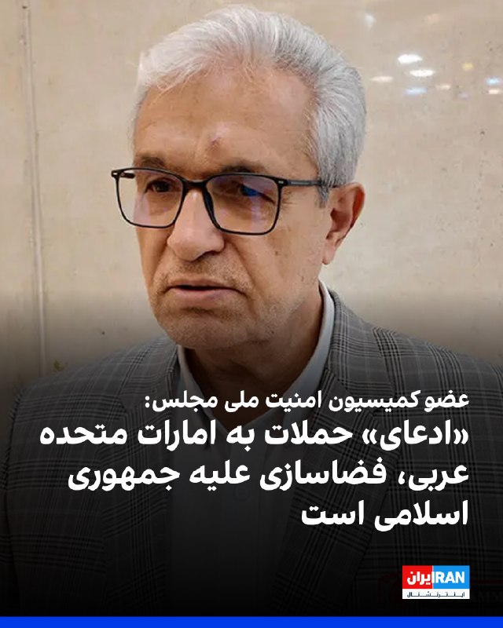

محمدرضا محسنی ثانی، عضو کمیسیون امنیت ملی مجلس، گفت مواضع و اقدامات امارات متحده عربی نشان می‌دهد اسرائیل و آمریکا از این کشور حمایت می‌کنند و این رویکرد بیانگر فاصله گرفتن امارات از کشورهای مسلمان عربی منطقه و طلب کمک از دشمنان دنیای اسلام است.

او افزود: «ادعای ابوظبی درباره حملات موشکی و پهپادی جمهوری اسلامی به امارات متحده عربی صرفا در راستای فضاسازی علیه ما مطرح شده است.»
https://iranintl.com/202605139778

## iranintlTV — post 336996

در این قسمت چرتکه، محمد ماشینچیان سناریوهای مختلف قدرت خرید را تا پایان سال ۱۴۰۵ بررسی کرده و تاثیر نوسان نرخ دلار بر معیشت خانوارها را توضیح می‌دهد.
تماشای نسخه کامل «چرتکه» در یوتیوب:
https://youtu.be/1W2RoMvSqPQ

## iranintlTV — post 336995

  <a href="https://t.me/IranintlTV/336995" target="_blank">📎 Download file</a>

🎧نسخه صوتی دومینو: بازگشت آمریکا با «پتک سنگین»
@iranintlTV

## iranintlTV — post 336994

  

ستاد فرماندهی مرکزی آمریکا، سنتکام، با انتشار تصویری از گشت‌زنی یک جنگنده پنهان‌کار اف-۳۵-ای نیروی هوایی ایالات متحده بر فراز آب‌های منطقه‌ای نزدیک تنگه هرمز خبر داد.
سنتکام افزود این جنگنده می‌تواند تا ۱۸ هزار پوند مهمات را در حالی که با سرعت مافوق صوت پرواز می‌کند، حمل کند.
https://iranintl.com/202605130260

## iranintlTV — post 336993

  

ایال زمیر، رییس ستاد کل ارتش اسرائیل، گفت: «ما در همه جبهه‌ها واقعیت امنیتی جدیدی ایجاد کرده‌ایم، با این حال نبرد به پایان نرسیده است. ارتش اسرائیل برای ازسرگیری جنگ در صورت نیاز آماده است و در دفاع و حمله، از یهودا و سامره تا تهران، در آمادگی و هوشیاری دائم قرار دارد.»
https://iranintl.com/202605139649

## iranintlTV — post 336992

  <a href="telegram/content/iranintlTV_336992_1778681841.mp4" target="_blank">🎬 Download video</a>

مسعود پزشکیان، رییس دولت جمهوری اسلامی، در واکنش به افزایش تورم، از مقام‌های دولتی خواست تمام توان خود را برای کنترل قیمت‌ها به‌کار بگیرند. او همچنین بر ضرورت مداخله نهادهایی مانند بسیج و مساجد در مدیریت شرایط تاکید کرد.
گفت‌وگو با مرتضی کاظمیان، عضو تحریریه ایران‌اینترنشنال
@iranintltv

## iranintlTV — post 336991

  <a href="telegram/content/iranintlTV_336991_1778681842.mp4" target="_blank">🎬 Download video</a>

همزمان با سفر ترامپ به چین، کاربران رسانه‌های اجتماعی درباره نقش ایران در مناسبات آمریکا و چین گمانه‌زنی کرده‌اند. برخی معتقدند تهران به بخشی از معامله قدرت‌های جهانی تبدیل شده و عده‌ای نیز جمهوری اسلامی را نیروی نیابتی پکن در منطقه توصیف می‌کنند.
عادله بورنگ، عضو تحریریه ایران‌اینترنشنال، از واکنش کاربران می‌گوید
@iranintltv

## iranintlTV — post 336988

  

بلومبرگ گزارش داد ناتو در حال برنامه‌ریزی برای دعوت از نمایندگان چهار کشور حوزه خلیج فارس به نشست خود در آنکارا است؛ نشستی که انتظار می‌رود جنگ علیه جمهوری اسلامی و شکاف فزاینده در روابط فراآتلانتیک بر آن سایه بیفکند.

به گفته افرادی آگاه از روند برنامه‌ریزی، این کشورها شامل بحرین، کویت، قطر و امارات متحده عربی هستند که همگی عضو «ابتکار همکاری استانبول»، چارچوب همکاری میان ناتو و کشورهای غیرعضو در خاورمیانه، به‌شمار می‌روند.

این منابع که به دلیل محرمانه بودن گفت‌وگوها نخواستند نامشان فاش شود، گفتند قرار است وزیران خارجه این کشورها برای نشست ۱۷ و ۱۸ تیرماه در آنکارا دعوت شوند.
https://iranintl.com/202605131055

## iranintlTV — post 336987

🗣روایت شما از بحران اقتصادی و زندگی در آتش‌بس- چهارشنبه ۲۳ اردیبهشت:

🔹ما در سیستان و بلوچستان محروم و گرسنه بودیم، این روزها محروم‌تر و گرسنه‌تر هم شدیم. گالن ۷۰ لیتری بنزین شده ۵ میلیون. برای رسیدن به بیمارستان باید ۴۰ تا ۶۰ لیتر بنزین مصرف کنیم، چون اکثر مردم اینجا روستانشین هستن و فاصله تا مرکز استان ۶۰۰ تا ۷۰۰ کیلومتره!

🔹هر هفته محصولات مورد نیاز و خوراکی بالای ۲ برابر می‌شه و تو این دو ماه گذشته ۳ تا ۵ برابر شده، چه‌جوری تورم رو ۶۰ یا ۱۰۰ درصد اعلام می‌کنند؟

🔹گرانی داره بیداد می‌کنه. من یه جوون ۲۴ ساله‌م اما هر شب از شدت غم فکر می‌کنم الانه که سکته کنم. هیچ کس به داد ما نمی‌رسه. پدرم بازنشسته است و همه ما بیکار شدیم. دو ماه دیگه باید خونه رو تمدید کنیم ولی هیچ وامی بهمون نمی‌دن. داریم نابود می‌شیم.

🔹دو روز پیش از موتور ماشینم تو جاده روغن زد بالا. تو جاده زاهدان بودم، زنگ زدم کفی خودروبر، گفت تا شیراز ۱۰۰ میلیون می‌گیرم. بردم نمایندگی زاهدان، گفتن اول باید ۱۵۰ میلیون واریز کنی تا بعد رسیدگی کنم.

🔹از تهران پیام می‌دم. گرانی بیداد می‌کنه، کاسبی مشاغل آزاد از بین رفته، پولی درنمیاد، داریم تمام پس‌اندازمون رو خرج خورد و خوراک می‌کنیم با مراعات بسیار. طلبکارها فشار میارن، بدهکارها ندارن بدهی‌شون رو بدن.

🔹ما دانش‌آموزها، مخصوصا پایه نهم و دوازدهم، در این شرایط اینترنتی و مشکلات کشور واقعا از نظر روحی خسته شدیم. وقتی می‌بینیم خانواده‌هامون برای بقا دست‌وپا می‌زنن، کلاس‌ها هم مدام قطع می‌شن، تمرکز و آمادگی برای امتحان واقعا سخت می‌شه.

🔹اکثر مردم دچار بی انگیزگی شدن، از جمله خود من. از بس امیدمون ناامید شده، از بس می‌دویم و نمی‌رسیم. هیچ وقت فکر نمی‌کردم تبدیل به کره شمالی بشیم و هیچ کشور دیگه‌ای براش مهم نباشه که چه بلایی داره سر مردم ایران میاد.

## iranintlTV — post 336986

  

علاءالدین بروجردی، عضو کمیسیون امنیت ملی و سیاست خارجی مجلس، گفت: «تنها سناریو پیش‌رو این است که آمریکا واقعیت‌ها را بپذیرد و با پذیرش این واقعیات، با ایران وارد مذاکره شود تا از شرایط جنگی خارج شود.»

او اضافه کرد: «به هیچ‌ وجه دستاورد تنگه هرمز را از دست نخواهیم داد و به هیچ‌ وجه وارد بحث مذاکره درباره غنی‌سازی هسته‌ای نخواهیم شد.»
https://iranintl.com/202605133735

## iranintlTV — post 336985

یک شهروند با ارسال پیامی به ایران اینترنشنال از وضعیت معیشتی بد خود و عدم توان پرداخت پول برای داروی مادر بیمارش می‌گوید.

## iranintlTV — post 336984

  

دونالد ترامپ، رییس‌جمهوری آمریکا، چهارشنبه در مراسم استقبال رسمی با تشریفات گسترده وارد پکن شد. بر اساس اعلام کاخ سفید، هان ژنگ، معاون رییس‌جمهوری چین، به همراه شماری از مقام‌ها از جمله دیوید پردیو، سفیر آمریکا در چین، شی فنگ، سفیر چین در آمریکا، و ما ژائوشو، معاون اجرایی وزیر خارجه چین، در فرودگاه از ترامپ استقبال کردند.

همچنین ۳۰۰ نوجوان چینی با لباس‌های هماهنگ آبی و سفید در باند فرودگاه و با در دست داشتن پرچم‌های چین و آمریکا رژه رفتند. یگان تشریفات نظامی و یک گروه موسیقی نظامی نیز در این مراسم حضور داشتند.

قرار است شی جین‌پینگ صبح پنجشنبه به وقت محلی به‌طور رسمی از دونالد ترامپ استقبال کند.
https://iranintl.com/202605139112

## iranintlTV — post 336983

  

مهراوه خندان، فرزند نسرین ستوده، خبر داد که این وکیل دادگستری و فعال حقوق بشر، با قرار وثیقه به‌طور موقت آزاد شده است.

نسرین ستوده ۱۲ اردیبهشت در منزل خود بازداشت شده بود. در جریان این بازداشت، لوازم الکترونیکی از جمله لپ‌تاپ و تلفن‌های همراه او و همسرش رضا خندان ضبط شد.
https://iranintl.com/202605130712

## iranintlTV — post 336982

یک شهروند در سیستان و بلوچستان با ارسال پیامی به ایران اینترنشنال از بدتر شدن وضعیت اقتصادی مردم منطقه می‌گوید. پیام مخاطب با هوش مصنوعی خوانده شده است.

## iranintlTV — post 336981

  

پایگاه خبری وای‌نت گزارش داد دیوید زینی، رییس سازمان اطلاعات و امنیت داخلی اسرائیل (شین‌بت)، اخیرا به امارات متحده عربی سفر کرده است.

ساعاتی پیش، روزنامه وال‌استریت ژورنال از دو سفر محرمانه دیوید بارنئا، رییس موساد، به امارات در جریان جنگ ایران خبر داده بود.
https://iranintl.com/202605137286

## iranintlTV — post 336980

شهروندان پس از زلزله تهران: فکر کردیم آمریکا و اسرائیل حمله کردند

🖋سبا حیدرخانی

شماری از شهروندان در پیام‌هایی به ایران‌اینترنشنال گفتند در نخستین لحظات پس از زلزله نسبتا شدیدی که شامگاه سه‌شنبه ۲۲ اردیبهشت تهران و مناطق اطراف آن را لرزاند، تصور کردند حملات آمریکا و اسرائیل دوباره آغاز شده است. احساسی که با پایان احساس تعلیق اما همراه ترس و اضطراب بوده است.

این زمین‌لرزه‌ها ابتدا با زلزله‌ای به بزرگی ۳.۴ در ساعت ۲۰:۴۱ آغاز شد اما اوج آن در ساعت ۲۳:۴۶ با لرزه‌ای به بزرگی ۴.۶ در عمق ۱۰ کیلومتری رخ داد.
تا ساعت ۳:۳۰ بامداد چهارشنبه ۲۳ اردیبهشت، چندین پس‌لرزه دیگر هم اتفاق افتاد.

کانون اصلی زلزله پردیس بود اما در مناطق مختلف شهر و استان تهران، استان البرز و حتی بخش‌هایی از استان مازندران احساس شد.

برخی مخاطبان در واکنش به این زلزله و پس‌لرزه‌هایش گفتند تجربه هفته‌های جنگ، صدای انفجارها، پدافند و پهپادها، نوعی حساسیت دائمی ایجاد کرده است؛ به‌طوری که حتی تشخیص زلزله از حمله نظامی هم برای چند ثانیه دشوار بوده است.

یکی از ساکنان شرق تهران و تهرانپارس در پیامی نوشت: «زلزله سه‌شنبه شب جوری بود که خانه‌مان به شدت لرزید و تکان خورد؛ طوری که فکر کردیم کنار خانه‌مان موشک خورده است.»

مخاطب دیگری زلزله را «ترسناک» توصیف کرد و گفت او و خانواده‌اش برای چند ثانیه فکر کردند دوباره حملات شروع شده است.

برخی شهروندان همچنین به شباهت تجربه زلزله با روزهای جنگ اشاره کردند.

یک شهروند نوشت: «حدود ساعت ۹ شب سه‌شنبه زلزله در تهران حس شد، اما زلزله‌ای که ساعت ۱۱:۴۵ شب آمد بسیار شدید حس شد. خانه کاملا لرزید و لوسترها صدا دادند. شبیه تجربه‌ای بود که در آن ۴۰ روز جنگ داشتیم.»

شماری از مخاطبان تاکید کردند احساس آن‌ها صرفا «ترس» نبوده، بلکه ترکیبی از اضطراب، انتظار و بی‌ثباتی روانی بوده است؛ به‌ویژه در شرایطی که بخشی از جامعه همچنان در انتظار ازسرگیری حملات نظامی علیه جمهوری اسلامی است.

شهروندی نوشت: «وقتی زلزله و بعد از آن صدای طوفان آمد، فکر کردیم دوباره حمله شده است. حس هم‌زمان ترس و خوشحالی داشتیم.»

مخاطبی دیگر با اشاره به احساس ناامیدی و تعلیق گسترده‌ای که در آتش‌بس شکل گرفته، گفت: «وضعیت ما داخل ایران این‌گونه است که زلزله می‌آید و مادرم می‌گوید: کاش بمباران باشد؛ ثمره ۴۷ سال حکومت اسلامی.»

قطع اینترنت و از دست رفتن دسترسی سریع به منابع خبری
قطع طولانی‌مدت و اختلال گسترده اینترنت در ایران، دسترسی بسیاری از کاربران به پیام‌رسان‌ها، شبکه‌های اجتماعی و حتی منابع اطلاع‌رسانی فوری را مختل کرده است.

برخی مخاطبان گفتند در گذشته در چنین شرایطی مستقیما به سایت‌های لرزه‌نگاری مراجعه یا اخبار را از طریق تلگرام و شبکه‌های اجتماعی دنبال می‌کردند، اما اکنون این امکان را از دست داده‌اند و همین موضوع بر اضطراب عمومی افزوده است.

چند کاربر، رسانه‌های حکومتی را به پنهان‌کاری و تاخیر در اطلاع‌رسانی متهم کردند.

شهروندی در همین زمینه نوشت: «صداوسیما از ترس این‌که مردم به خیابان‌ها بریزند و اعتراض دیگری شکل بگیرد، خبر زلزله را تا دقایقی طولانی پوشش نداد. جان آدم‌ها آن‌قدر برایشان بی‌ارزش است که تلاش می‌کنند از هر راهی که شده، اندکی بیشتر در قدرت بمانند.»

بی‌اعتمادی به نهادهای اطلاع‌رسانی حکومتی و فقدان دسترسی به کانال‌های خبری امن و شناخته شده، باعث شد در ساعات پس از زلزله، شایعات و گمانه‌زنی‌هایی نیز شکل بگیرد.

در همین زمینه، یک مخاطب با اشاره به موقعیت کانون زلزله نوشت: «کانون زلزله تهران، نزدیک پارچین و نیروگاه اتمی بود؛ یعنی اصلا امکانش نیست که زلزله‌ای در کار نبوده و جمهوری اسلامی داشته آزمایش اتمی یا نظامی انجام می‌داده است؟»

شهروند دیگری نیز این پرسش را مطرح کرد که: «آیا زلزله نمی‌تواند ناشی از فعالیت‌های زیرزمینی موشکی باشد؟»

او به قرارگیری تهران روی گسل و همچنین فعالیت‌های زیرزمینی جمهوری اسلامی اشاره کرد.

نهادهای حکومتی به این گمانه‌زنی‌ها واکنشی نشان ندادند اما برخی متخصصان درباره این ترس و نگرانی عمومی اظهار نظر کردند.

فریبرز ناطقی‌‌الهی، عضو هیات علمی پژوهشگاه زلزله‌شناسی ایران، صبح چهارشنبه ۲۳ اردیبهشت در سخنانی گفت زلزله تهران «در اثر انفجار مواد تسلیحاتی و نظامی نبوده» است.

تهران تا ساعت‌ها پس از زلزله و پس‌لرزه‌هایش فضایی ملتهب را تجربه کرد.

یکی از ساکنان پردیس گفت از حدود ساعت هشت‌ونیم شب تا یک بامداد، مردم از ترس در خیابان‌ها بودند، داخل خانه نرفتند و پمپ‌بنزین‌ها هم شلوغ بود.
 
🔗متن کامل گزارش را اینجا بخوانید
@iranintltv

## iranintlTV — post 336979

  <a href="telegram/content/iranintlTV_336979_1778681846.mp4" target="_blank">🎬 Download video</a>

یک شهروند با ارسال پیامی به ایران اینترنشنال می‌گوید با وضعیت بد اینترنت و شبکه ملی داخلی انگیزه‌ها برای درس خواندن از بین رفته است. پیام این مخاطب با هوش مصنوعی خوانده شده است.

## iranintlTV — post 336977

  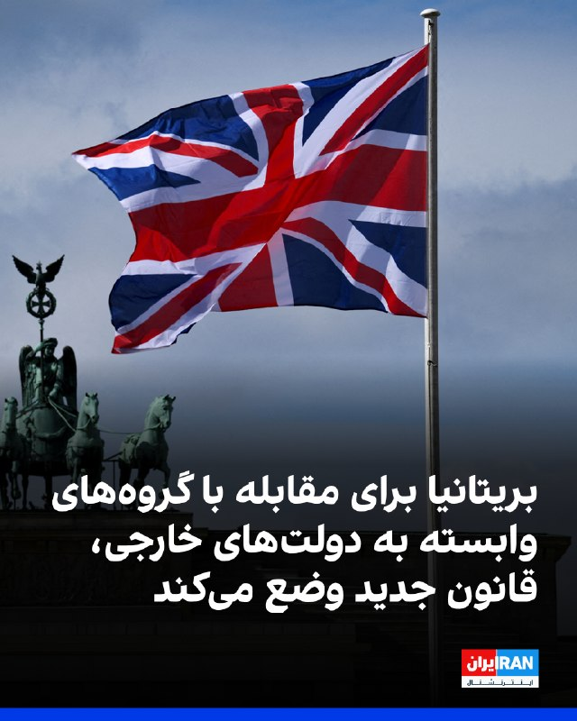

بریتانیا اعلام کرد برای مقابله با فعالیت عوامل نیابتی وابسته به دولت‌های متخاصم، قوانین جدیدی تصویب خواهد کرد.

به گزارش خبرگزاری رویترز، این تصمیم در پی افزایش تهدیدهای امنیتی و رشد حملات یهودستیزانه در این کشور مطرح شده است.

به گفته دولت بریتانیا، این قوانین اختیارات لازم را برای ممنوع‌ کردن فعالیت گروه‌های وابسته به دولت‌های خارجی فراهم می‌کند.

کی‌یر استارمر، نخست‌وزیر بریتانیا، در واکنش به حملات اخیر به جامعه یهودیان این کشور تاکید کرده دولت باید با «بازیگران مخرب» وابسته به دولت‌های خارجی برخورد کند.
https://iranintl.com/202605139938

## iranintlTV — post 336976

  <a href="telegram/content/iranintlTV_336976_1778681849.mp4" target="_blank">🎬 Download video</a>

تجمعات حکومتی شبانه در شهرهای مختلف ایران ادامه دارد. شهروندان نیز مشاهدات خود از حضور نیروهای نیابتی در این تجمعات و تجربه‌هایشان از آزار و اذیت‌ آن‌ها را برای ایران‌اینترنشنال ارسال کردند.

محسن مهیمنی، عضو تحریریه ایران‌اینترنشنال، گزارش می‌دهد
@iranintltv

## iranintlTV — post 336975

  <a href="telegram/content/iranintlTV_336975_1778681850.mp4" target="_blank">🎬 Download video</a>

شهروندان با ارسال پیام‌هایی به ایران‌اینترنشنال از تورم اقلام خوراکی و کسادی بازار زیر سایه آتش‌بس روایت می‌کنند. سبا حیدرخانی، عضو تحریریه ایران‌اینترنشنال، با بررسی این پیام‌ها می‌گوید بسیاری از کسب‌وکارها به علت کوچک شدن سبد خرید مردم، در آستانه ورشکستگی قرار گرفته‌اند.
@iranintltv

---
📅 بروزرسانی: 1405/02/23 16:58
---

هیچ پیام جدیدی در این بروزرسانی ارسال نشد.

---
📅 بروزرسانی: 1405/02/23 14:35
---

## iaghapour — post 2605

  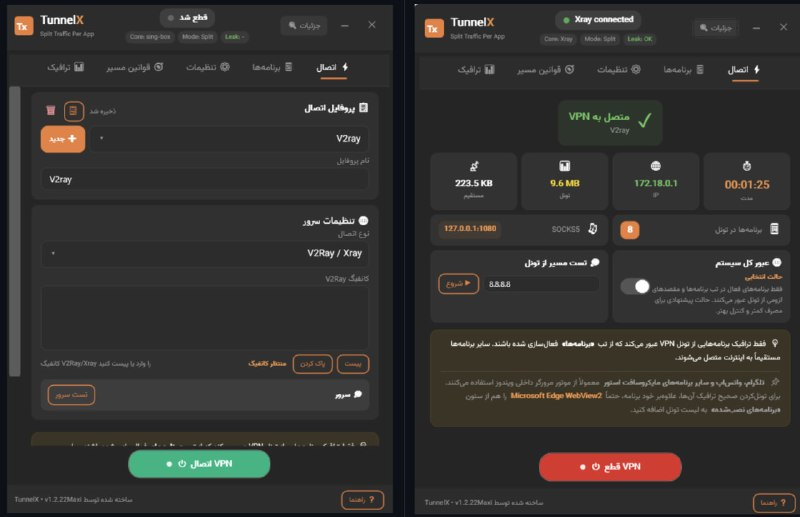

⭕️ با اپ TunnelX در ویندوز از قابلیت Split Tunneling استفاده کنید.

🔹اپ TunnelX برای زمانی ساخته شده که کاربر نمی‌خواهد تمام ترافیک سیستم از وی‌پی‌ان عبور کند. با این برنامه می‌توان فقط برنامه‌هایی مثل مرورگر، تلگرام، ابزارهای توسعه یا برنامه‌های مشخص دیگر را وارد تونل کرد و بقیه ترافیک سیستم را روی اینترنت عادی نگه داشت. همچنین در صورت نیاز، حالت Full-route برای عبور کل سیستم از تونل در دسترس است.

🔗 دانلود اپ از گیت‌هاب پروژه

🆔 @iaghapour

---
📅 بروزرسانی: 1405/02/23 11:46
---

هیچ پیام جدیدی در این بروزرسانی ارسال نشد.

---
📅 بروزرسانی: 1405/02/23 09:00
---

هیچ پیام جدیدی در این بروزرسانی ارسال نشد.

---
📅 بروزرسانی: 1405/02/23 05:00
---

هیچ پیام جدیدی در این بروزرسانی ارسال نشد.

---
📅 بروزرسانی: 1405/02/23 03:14
---

هیچ پیام جدیدی در این بروزرسانی ارسال نشد.

---
📅 بروزرسانی: 1405/02/23 02:15
---

هیچ پیام جدیدی در این بروزرسانی ارسال نشد.

---
📅 بروزرسانی: 1405/02/23 01:09
---

هیچ پیام جدیدی در این بروزرسانی ارسال نشد.

---
📅 بروزرسانی: 1405/02/22 23:37
---

## iaghapour — post 2604

اکانت های هوش مصنوعی رو با یک دهم قیمت بخر 
🛍

🔆 ChatGPT Plus :
- اکانت از پیش ساخته شده ی Plus
- پلاس شخصی ( نسخه 20$ )
- مناسب برنامه نویسی
- ساخت عکس فارسی و تجزیه تحلیل
- مناسب تحقیق عمیق
- جامع ترین هوش مصنوعی در حال حاضر

🏳️‍🌈 Gemini Pro :
( گزینه ی اقتصادی )
- پلن مشابه GPT Plus از شرکت گوگل
- پشتیبانی از Antigravity
- ساخت عکس و ویدیو فارسی
- تجزیه و تحلیل و تحقیق عمیق
- فعال سازی روی ایمیل شما
- قیمت :
یک ماهه : 275 هزار تومان
یک ساله : 1200 هزار تومان

🌐 Kiro.dev Pro
( جایگزین اقتصادی Claude )
- ایجنت برنامه نویسی شرکت آمازون
- پشتیبانی از تمامی مدل های Claude
- ارزان و اقتصادی و با کیفیت
- مناسب فقط برنامه نویسان

خرید و توضیحات بیشتر از ربات :

🤖 @ChatGPT_StoreBOT

---
📅 بروزرسانی: 1405/02/22 21:36
---

## iaghapour — post 2603

✍ آدم راننده شوتی باشه به مراتب اضطرابش كمتر از کسیه كه شغلش تو ايران به اينترنت وابسته هستش...

🆔 @iaghapour

---
📅 بروزرسانی: 1405/02/22 19:30
---

## iaghapour — post 2602

🚀 آپدیت بزرگ و انقلابی پنل 3x-ui (نسخه‌های 3.0.0 و 3.0.1)

بالاخره یکی از مهم‌ترین آپدیت‌های پنل محبوب 3x-ui منتشر شد! در این نسخه‌ها شاهد بازنویسی کامل رابط کاربری، اضافه شدن قابلیت‌های مدیریتی کلان و بهبودهای چشمگیر امنیتی هستیم.

🌐 ۱. بازنویسی کامل و سریع‌تر شدن پنل (مهاجرت به Vue 3) رابط کاربری از پایه بازنویسی شده است! این یعنی سرعت لود بسیار بالاتر، طراحی مدرن‌تر، صفحه لاگین جدید و بهبود چشمگیر تم دارک.

⚡️ ۲. آمار زنده و در لحظه: با جایگزینی سیستم قدیمی با WebSocket، از این پس تمام آمارهای داشبورد، مصرف حجم کلاینت‌ها و وضعیت سرور به صورت «زنده» آپدیت می‌شوند و دیگر نیازی به رفرش کردن صفحه نیست!

🌍 ۳. مدیریت چند سروره (Multi-Node Deployment) - 🌟 ویژگی طلایی یکی از مورد انتظارترین قابلیت‌ها اضافه شد! حالا می‌توانید از طریق یک پنل مرکزی (Manager)، کانفیگ‌ها و اینباندها را روی چندین سرور دیگر (Remote Nodes) مستقر و مدیریت کنید.

📱 ۴. رابط کاربری کاملاً سازگار با موبایل: داشبورد، لیست کلاینت‌ها و بخش لاگ‌ها حالا به صورت "کارتی" و کاملاً بهینه برای نمایشگرهای موبایل طراحی شده‌اند تا مدیریت پنل با گوشی بسیار راحت‌تر شود.

⚙️ ۵. خداحافظی با کدهای JSON و تنظیمات آسان‌تر فرم‌های ساخت کانفیگ (Inbounds) کاملاً ساختاریافته و گرافیکی شده‌اند. دیگر برای تنظیمات پایه نیازی به دستکاری JSON خام نیست (البته تب Advanced برای حرفه‌ای‌ها همچنان وجود دارد). همچنین مدیریت DNSها بسیار پیشرفته‌تر شده است.

👥 ۶. مدیریت گروهی کلاینت‌ها (Bulk Actions) امکان انتخاب گروهی کلاینت‌ها برای حذف یا اعمال تغییرات اضافه شده که کار ادمین‌ها را بسیار راحت می‌کند.

🛠 ۷. امکانات جدید Xray و Outboundها اضافه شدن پروتکل Loopback، دکمه Test All برای تست همزمان همه Outboundها و ارائه گزارش دقیق از تایم‌اوت‌ها، و همچنین خاموش شدن امن هسته Xray.

🔒 ۸. ارتقاء امنیت و نصب راحت‌تر ➖ اضافه شدن سیستم امنیتی CSRF Protection برای جلوگیری از حملات. ➖ اضافه شدن گزینه skip-SSL در اسکریپت نصب (بسیار کاربردی برای کسانی که از ریورس‌پروکسی یا تانل استفاده می‌کنند و نیازی به سرتیفیکیت روی خود سرور ندارند). ➖ اضافه شدن صفحه مستندات API (API Docs) در داخل خود پنل برای برنامه‌نویسان.

و بسیاری از تغییرات دیگه که میتونید در این لینک مطالعه کنید.

💡 نکته: برای تجربه این تغییرات فوق‌العاده، پیشنهاد می‌شود هرچه سریع‌تر پنل خود را آپدیت کنید. (توصیه همیشگی: قبل از آپدیت بکاپ فراموش نشود!)

✍🏻 با تشکر از ثنایی عزیز.

🆔 @iaghapour

---
📅 بروزرسانی: 1405/02/22 16:56
---

هیچ پیام جدیدی در این بروزرسانی ارسال نشد.

---
📅 بروزرسانی: 1405/02/22 15:06
---

## iaghapour — post 2601

⭕️ عصبانیت سخنگوی دولت از انتقاد خبرنگاران از قطع اینترنت

فاطمه مهاجرانی در نشست خبری امروز خود به اعتراض خبرنگاران بابت ادامه قطعی اینترنت واکنش نشان داد.
سخنگوی دولت گفت: «در شرایطی که رئیس جمهور آمریکا اعلام می‌کند آتش بس به دستگاه تنفس مصنوعی وصل است، پاسخ شما چیست؟ کشور در جنگ است. بپذیریم که ویژگی جنگ، امنیت مردم است.»

✍🏻 پ.ن: خانم مهاجرانی اگه دوباره عصبی نمیشید خواستم بگم کاش به فکر امنیت اقتصادی مردم هم بودید! کاش به فکر امنیت ذهنی و روانی مردم هم بودید! کاش یه فکری برای چند میلیون آدمی که با قطعی اینترنت بیکار و ناامید کردین هم بودید!

🆔 @iaghapour

---
📅 بروزرسانی: 1405/02/22 13:04
---

هیچ پیام جدیدی در این بروزرسانی ارسال نشد.

---
📅 بروزرسانی: 1405/02/22 10:18
---

## iaghapour — post 2600

🔻نمیتونم خبر رو تایید کنم ولی میگن:
— افغانستان اینترنت 5G آورده.
— عراق تلگرام رو رفع فیلتر کرده.
— سوریه هم که ویزا و مستر کارت و...

این که ما درگیر فیلترینگ مسخره هستیم واقعا گریه داره...

---
📅 بروزرسانی: 1405/02/22 07:34
---

هیچ پیام جدیدی در این بروزرسانی ارسال نشد.

---
📅 بروزرسانی: 1405/02/22 03:41
---

هیچ پیام جدیدی در این بروزرسانی ارسال نشد.

---
📅 بروزرسانی: 1405/02/22 02:41
---

هیچ پیام جدیدی در این بروزرسانی ارسال نشد.

---
📅 بروزرسانی: 1405/02/22 01:33
---

## iaghapour — post 2599

سلام خواستم یه نکته کوچولو بگم
فقط بحث کسب و کارهای کوچیک نبود
فقط بحث آنلاین شاپ ها نبود
ماهایی که ۴ سال تو دیجیتال مارکتینگ بودیم توی طراحی سایت و سئو و اتوماسیون کار میکردیم هم کاملا ورشکست شدیم
نه از ۹ اسفند
ما یه بار جنگ خرداد زمین خوردیم تا اومدیم بلند شیم از جامون و داشتیم اوکی میشدیم دلار دی ماه سر به فلک کشید و بعد یه قطعی دیگه داشتیم که خیلی ها بهانه کردن و پول ندادن آخر دی ما هیچی پروژه نداشتیم حتی بهترین کارفرماها اومدن گفتن کار شما خیلی خوبه ولی ما واقعا پول پرسنل رو هم به زور میدیم نمیرسه به سئو
بهمن اومدیم خودمون رو جمع کنیم تیر آخر رو اول اسفند بهمون زدن
دفترمون رو تحویل دادیم
نیروهامونو از بهمن تعدیل کرده بودیم
و الان چه جوون ها و چه پدرانی که بیکار شدن
منی که تمام تخصصم همیناست
یک متخصص بیکار محسوب میشم.

©️ پیام ارسالی از کاربر shafikhany

---
📅 بروزرسانی: 1405/02/22 00:24
---

هیچ پیام جدیدی در این بروزرسانی ارسال نشد.

---
📅 بروزرسانی: 1405/02/21 22:40
---

هیچ پیام جدیدی در این بروزرسانی ارسال نشد.

---
📅 بروزرسانی: 1405/02/21 22:19
---

## iaghapour — post 2598

✍ حدودا 500 پیام بررسی نشده از 2 روز پیش داریم که پشتیبانی تا فردا همه رو بررسی میکنه.

جدا از بحث بالا، از ته دل آرزو میکنم تو این روزهای عجیب و غریبی که داریم می‌گذرونیم، حال دلتون خوب باشه. می‌بینیم و حس میکنم که زندگی چقدر برای خیلی‌ها سخت شده و دغدغه‌ها چقدر زیادن.

امیدواریم هرچه زودتر این روزهای سخت جاشون رو به روزهای روشن‌تری بدن. هوای خودتون و دلتون رو داشته باشید.

## iaghapour — post 2597

  

⭕️ آپدیت ورژن 0.10.0 سانگبرد منتشر شد

🔹با این اسکریپت میتونید در سرور ایران خودتون یک مسنجر شخصی بالا بیارید و با دوستان خودتون چت کنید.

- 📡 قابلیت Remote channel
- 🔗 ساده سازی سیستم Invite link
- 🎨 بازطراحی بخش ساخت/تغییر کانال و گروه در UI
- ✨انیمیشن build-up پیام ها در چت ها
- 🔔 بهبود عملکرد push notifications
- تغییرات گرافیکی اسکریپت نصب آسان
- 🐳 پشتیانی از TLS با سرتیفیکیت self-signed در Docker
- 🔧 رفع باگ های گزارش شده
- 📄 اضافه شدن نسخه فارسی فایل readme

🔘اگه به هر مشکلی خوردین، حتما تو گیت هاب یک issue باز کنید و گزارش بدید.
⭐️ اگه از پروژه راضی بودین، با ستاره دادن تو گیت هاب از پروژه حمایت کنید.
🔹چنل پروژه

🔗 لینک گیت‌هاب پروژه

🆔 @iaghapour

## iaghapour — post 2596

⭕️ ساده‌ترین راه برای دور زدن فیلترینگ با تانل DNS

اگه خانواده‌ شما هم داخل ایران برای اتصال به اینترنت مشکل دارند، این پیام ممکن است به شما کمک کند.

این برنامه یک برنامه‌ی گرافیکیست که کار با آن بسیار ساده است و برای اتصال به اینترنت هر دو روش MasterDNS و VayDNS را پشتیبانی می‌کند.

👈 لینک گیت‌هاب
👈 دانلود اپ

📖 آموزش کامل MasterDNS و VayDNS

▶️ آموزش روی یوتیوب

📱 آموزش KevinNet DNS

▶️ آموزش روی یوتیوب

🔄 آپدیت‌های جدید برنامه

در صورت وجود هرگونه مشکل یا سوالات مرتبط با KevinNetDNS میتوانید با آدرس ایمیل زیر در تماس باشید:

©️ متن تهیه شده توسط نویسنده اسکریپت KevinDNS

🆔 @iaghapour

## iaghapour — post 2595

⭕️ ادعای عجیب نماینده مجلس: با ۴ هزار میلیارد تومان ایتا را به سطح واتس‌اپ می‌رسانیم!

رئیس کمیته ICT مجلس در اظهارنظری جنجالی مدعی شده است که فاصله میان پیام‌رسان‌های داخلی مثل ایتا با نمونه‌های جهانی مانند واتس‌اپ، تنها در کمبود بودجه برای خرید سرور خلاصه می‌شود. به گفته او، ارتقای این پلتفرم‌ها هزینه چندانی برای کشور ندارد.

این نماینده مجلس معتقد است که پلتفرم‌های داخلی از نظر فنی کمبودی ندارند و تنها زیرساخت‌های سخت‌افزاری آن‌ها باید تقویت شود:

🔹 بودجه برای رقابت: مصطفی طاهری مدعی است با صرف ۳ تا ۴ هزار میلیارد تومان برای خرید سرور، می‌توان کیفیت ایتا را به سطح واتس‌اپ رساند تا توانایی پذیرش بدون مشکل بیش از ۲۰ میلیون کاربر را داشته باشد.

🔸 هشدار درباره جاسوسی سخت‌افزاری: این مقام مسئول همچنین به موضوع استفاده از بیگ‌دیتا (داده‌های بزرگ) اشاره کرده و مدعی شده که آمریکا قوانینی برای جاسوسی در لایه‌های سخت‌افزاری و تراشه‌ها (حتی پایین‌تر از سطح سیستم‌عامل) دارد.

این اظهارات در حالی مطرح می‌شود که کارشناسان حوزه تکنولوژی، موفقیت پلتفرم‌های جهانی را فراتر از صرفا تعداد سرور می‌دانند و مواردی چون امنیت، پروتکل‌های رمزنگاری، حریم خصوصی و نوآوری‌های مداوم نرم‌افزاری را از عوامل اصلی برتری آن‌ها به حساب می‌آورند.

یکی از کاربرا زیر همین پست در دیجیاتو کامنت جالبی گذاشته بود:
مامان‌بزرگ منم با چند میلیارد نیکی میناژ میشه!

پ.ن: حالا فارق از این حرفا داره میگه اینا دارن از کاربراشون جاسوسی میکنن برای همین ما باید اپ های خودمون رو داشته باشیم... من حرفی ندارم.

🆔 @iaghapour

---
📅 بروزرسانی: 1405/02/21 20:43
---

## iranintltv — post 336681

  

دارو در ایران دیگر فقط گران نشده؛ دارد ناپدید می‌شود.
قیمت بعضی داروها تا ۴۰۰ درصد افزایش یافته، حدود ۲۰۰ قلم داروی حیاتی کمیاب شده و بسیاری از بیماران، میان غذا و درمان، مجبور به انتخاب شده‌اند.

بیماران سرطان، ام‌اس، دیالیز، هموفیلی و حتی بیماران اعصاب و روان، زیر فشار کمبود و گرانی دارو مانده‌اند.

آیا شما یا اطرافیانتان با بحران دارو روبه‌رو شده‌اید؟
آیا شده نسخه دست‌تان باشد، اما توان خرید دارو را نداشته باشید؟
آیا دارویی که مصرف می‌کنید، کمیاب یا سهمیه‌ای شده است؟

از تجربه و واقعیت زندگی‌تان برای ما بگویید.

«برنامه» صدای شماست.
اگر در ایران به اینترنت دسترسی دارید، بیایید روی خط و روایت خودتان را ثبت کنید.
ما شما را، بدون نوبت، مستقیم از ایران روی آنتن می‌آوریم.
تاریخ با صدای شما نوشته می‌شود.

برای شرکت در «برنامه با کامبیز حسینی» همین حالا در واتس‌اپ پیام بدهید:

۰۰۴۴۷۵۲۲۱۱۰۱۱۰
۰۰۴۴۷۵۴۴۱۱۰۱۱۰
۰۰۴۴۷۵۱۱۱۰۲۵۵۳

«یک ایران صدای شما را می‌شنود»
@iranintltv

## iranintltv — post 336679

  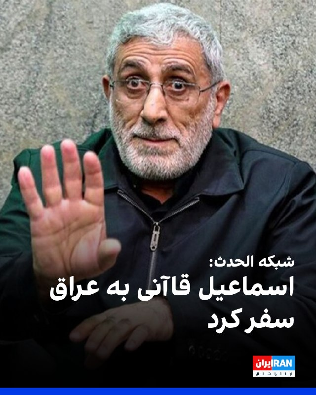

الحدث به نقل از منابع عراقی گزارش داد که اسماعیل قاآنی، فرمانده نیروی قدس سپاه، به عراق سفر کرده و از برخی گروه‌های مسلح خواسته از برقراری روابط با آمریکا خودداری کنند.

بر اساس این گزارش، او همچنین خط قرمزی را برای دولت عراق در مورد تحویل سلاح گروه‌های مسلح تعیین کرده است.
https://iranintl.com/202605118884

## iranintltv — post 336678

  <a href="telegram/content/iranintltv_336678_1778519621.mp4" target="_blank">🎬 Download video</a>

تیتر اول با نیوشا صارمی، دوشنبه ۲۱ اردیبهشت
@iranintltv

## iranintltv — post 336677

  

دونالد ترامپ از وجود اختلاف در داخل جمهوری اسلامی بر سر توافق با آمریکا سخن گفت و افزود گروهی از مقام‌های «میانه‌رو» خواهان توافق هستند اما «دیوانه‌ها» می‌خواهند جنگ ادامه پیدا کند.
او هشدار داد در صورت وقوع درگیری، «این یک جنگ خیلی سریع خواهد بود».

ترامپ گفت جمهوری اسلامی ابتدا با انتقال اورانیوم غنی‌شده از ایران موافقت کرده بود اما بعدا موضع خود را تغییر داد و این موضوع در سند ارسالی تهران به واشینگتن گنجانده نشد.

او افزود مقام‌های جمهوری اسلامی به آمریکا گفته بودند: «شما مجبورید آن را تحویل بگیرید.»

او در بخشی از صحبت‌های خود اضافه کرد واشینگتن قرار بود همراه با طرف ایرانی در روند انتقال مشارکت کند اما تهران بعدا نظرش را عوض کرد.

رییس‌جمهوری آمریکا گفت سند پیشنهادی جمهوری اسلامی پس از چهار روز تاخیر به واشینگتن ارسال شد؛ در حالی که به گفته او تهیه آن «فقط ۱۰ دقیقه» زمان نیاز داشت.

ترامپ افزود: «آنها تضمین دادند که برای مدت بسیار طولانی سلاح هسته‌ای نخواهند داشت، اما نمی‌توانند به نتیجه برسند.»
https://iranintl.com/202605119981

## iranintltv — post 336676

  <a href="telegram/content/iranintltv_336676_1778519623.mp4" target="_blank">🎬 Download video</a>

ساعاتی پس از نارضایتی کامل رییس‌جمهور آمریکا از پاسخ تهران به پیشنهاد واشینگتن برای توافق، سخنگوی وزارت خارجه گفت جمهوری اسلامی فعلا درباره برنامه هسته‌ای‌اش مذاکره نمی‌کند. همزمان نخست‌وزیر اسرائیل تدارک برگزاری یک نشست امنیتی را دیده است.

گزارشی از مجتبا پورمحسن
@iranintltv

## iranintltv — post 336674

  <a href="telegram/content/iranintltv_336674_1778519625.mp4" target="_blank">🎬 Download video</a>

دونالد ترامپ با «آشغال» خواندن پیشنهاد توافق تهران گفت آتش‌بس به‌شدت شکننده است. او در ادامه گفت: «آتش‌بس در اغما قرار دارد، به آن اکسیژن وصل کرده‌اند و تنها یک درصد شانس بقا دارد.»
@iranintltv

## iranintltv — post 336673

  <a href="telegram/content/iranintltv_336673_1778519626.mp4" target="_blank">🎬 Download video</a>

دونالد ترامپ، رییس‌جمهوری آمریکا، درباره مقامات جمهوری اسلامی گفت: «آن‌ها فکر می‌کنند من خسته خواهم شد، اما هیچ فشاری روی من نیست.» او همچنین پیشنهاد توافق جمهوری اسلامی را «احمقانه» توصیف کرد.
@iranintltv

## iranintltv — post 336672

  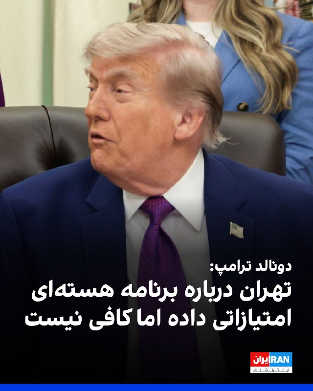

دونالد ترامپ در گفت‌وگو با سی‌بی‌اس نیوز درباره پاسخ اخیر تهران به پیشنهاد صلح آمریکا گفت که جمهوری اسلامی در برنامه هسته‌ای خود امتیازاتی داده اما «کافی نبوده» و هنوز «پیشنهاد آن‌ها بسیار ضعیف و غیرقابل قبول» است.
https://iranintl.com/202605110573

## iranintltv — post 336671

  <a href="https://t.me/IranintlTV/336671" target="_blank">📎 Download file</a>

🎧نسخه صوتی اخبار نیمروزی | دوشنبه ۲۱ اردیبهشت
@iranintlTV

## iranintltv — post 336670

  

دونالد ترامپ در واکنش به اظهارات بنیامین نتانیاهو که گفته بود «هیچ‌کس پیش‌بینی کامل و دقیقی» درباره تنگه هرمز نداشت، گفت: «من داشتم. من می‌دانستم آن‌ها تنگه هرمز را بسته‌اند. این تنها سلاحی است که دارند.»
ترامپ افزود آمریکا می‌توانست در چارچوب «پروژه آزادی» این گذرگاه را باز کند و گفت این عملیات می‌تواند از سر گرفته شود و در آن صورت «بسیار شدیدتر» خواهد بود.
https://iranintl.com/202605119757

## iranintltv — post 336669

🔻کسب‌وکارها یکی پس از دیگری سقوط می‌کنند

همزمان با تداوم قطعی اینترنت، فشارهای اقتصادی و پیامدهای جنگ، بسیاری از کسب‌وکارها در شهرهای مختلف با کاهش فروش، تعدیل نیرو و حتی خطر تعطیلی مواجه شده‌اند. صاحبان کسب‌وکارها در پیام‌هایی به ایران‌اینترنشنال، وضعیت کنونی را یکی از دشوارترین دوره‌های سال‌های اخیر توصیف کردند.

یک مدرس کاشت ناخن و مانیکور از توقف کسب‌وکار خود از اسفندماه سال گذشته تاکنون خبر داد.

به گفته این شهروند، گرچه مردمی که از تامین نیازهای اولیه خود درمانده شده‌اند، کمتر به خدمات زیبایی می‌پردازند، اما عوامل دیگری نیز در این رکود موثر است؛ از جمله قطعی اینترنت که موجب شده تا او کسب درآمد از طریق فروش پکیج‌های آموزشی را از دست بدهد.

او همچنین توضیح داد از همان زمان تاکنون آنتن دستگاه کارتخوانش قطع شده است و در پاسخ به پیگیری‌هایش گفته‌اند سیگنال دستگاه کارتخوان «مشاغل غیرضروری» به دلایل «امنیتی» تا اطلاع ثانوی قطع خواهد بود.

بحران در صنایع پتروشیمی و بنادر

افزون بر این، پیام‌های رسیده به ایران‌اینترنشنال حاکی از موج گسترده بیکاری و ورشکستگی در کسب‌وکارهای صنعتی و خدماتی وابسته به صنایع سنگین است.

بسیاری از فعالان این حوزه‌ها که تعدیل، اخراج یا بیکار شده‌اند، گفتند همچون دیگر صنف‌هایی که با مشکل اقتصادی مواجه شده‌اند، به مشاغلی نظیر رانندگی در اسنپ یا کارهایی روی آورده‌اند که امنیت شغلی پایین‌تری دارند.

یک شهروند شاغل در حوزه صنعت گفت: «هر کیلو پروفیل پیش از جنگ تا حدود قیمت ۷۰ هزارتومان خریدوفروش می‌شد، اما اکنون قیمت آن به ۱۵۵ هزار تومان رسیده است. به دلیل همین افزایش قیمت مدت سه‌ ماه است که بیکاریم و توان پرداخت هزینه مواد اولیه را نداریم.»

قیمت پروفیل، به‌عنوان ماده اولیه ساخت‌وساز در صنایع طی یک‌سال گذشته افزایش قیمتی ۱۲۰ تا ۱۶۰ درصدی را تجربه کرده است.

مخاطب دیگری که فعال در صنف کابینت‌سازی است، نیز گفت قیمت هر ورق ام‌دی‎‌اف از ۳ میلیون تومان در سال ۱۴۰۴ به ۱۵ تا ۱۷ میلیون تومان در سال جدید رسیده است.

این شهروند با اشاره به رشد ۴۰۰ تا ۴۷۰ درصدی قیمت مواد اولیه، گفت در چنین شرایطی دیگر امکان ادامه کار و پرداخت اجاره محل کسب وجود ندارد.

پیش از این نیز شهروندان از بحران بیکاری در مشاغل مرتبط با پتروشیمی و نبود ورق آهن و مواد پتروشیمی در شهرهایی از جمله اصفهان خبر داده بودند که باعث تعطیلی بسیاری از کارگاه‌های صنعتی شده است.

علاوه بر صنایع، گزارش‌هایی نیز از موج توقف کسب و کارها و تعدیل نیرو در بنادر به دست ایران‌اینترنشنال رسیده است.

یکی از کارکنان بندر رجایی گفت بسیاری از کارگران این منطقه اقتصادی تعدیل شده‌اند و آنها که همچنان سر کار مانده‌اند، حقوق‌هایشان به‌صورت مرتب پرداخت نمی‌شود و بندر بسیار خلوت شده است.

بندر رجایی یکی از مهم‌ترین بنادر تجاری ایران است که اردیبهشت سال ۱۴۰۴ با آنچه انفجار یکی از کانتینرهای حامل مواد شیمیایی خطرناک، از جمله سدیم پرکلرات اعلام شد، دچار آتش‌سوزی شد و به مرگ ده‌ها نفر انجامید.

بسیاری از شرکت‌های پیمانکاری وابسته به این بندر پس از انفجار و تا پیش از جنگ نیز با مشکلات اقتصادی بسیاری دست به گریبان بوده‌اند.

شهروند دیگری از سربندر در پیامی مشابه نوشت تمامی شرکت‌های بندر نیروهای خود را تعدیل کرده‌اند و حقوق افرادی که کماکان بر سر کار مانده‌اند هم به درستی پرداخت نمی‌شود.

پایگاه خبری رویداد ۲۴ نیز ۱۷ اردیبهشت در گزارشی درباره وضعیت مجموعه فولاد مبارکه پس از حملات آمریکا و اسرائیل نوشت که با وجود اطمینان‌دهی اولیه به کارکنان مبنی بر پرداخت بدون مشکل حقوق،دستمزد نیروها به حداقل دستمزد مصوب اداره کار تقلیل یافته است و بسیاری از نیروهای متخصص به رانندگی در تاکسی‌های اینترنتی روی آورده‌اند.

رستوران‌ها تحت تاثیر گرانی

صنف رستوران و غذاخوری‌ها نیز از جمله کسب و کارهایی هستند که با افزایش قیمت مواد اولیه و فشارهای اقتصادی آسیب زیادی دیده‌اند.

یکی از مخاطبان ایران‌اینترنشنال که صاحب یک رستوران فست‌فود در لاهیجان است، نوشت: «مواد اولیه ساندویچی که اکنون به مبلغ ۱۰۰ هزارتومان فروخته می‌شود، چند روز بعد ۱۱۰ هزار تومان خریداری می‌شود. پس ناچار به افزایش قیمت روزانه هستیم که هم موجب نارضایتی مشتری است و هم خود از این مساله آسیب دیده‌ایم.»

رستوران‌دار دیگری از کیش نیز گفت اول ناچار شد بیش از ۱۰ نفر از نیروهایش را تعدیل کند و حالا چاره‌ای جز تعطیلی برایش نمانده است.
هم‌زمان، برخی مخاطبان از افزایش قیمت فست‌فود خبر دادند.

بر اساس این گزارش‌ها، قیمت یک ساندویچ به‌طور متوسط به ۵۰۰ هزار تومان و یک پیتزا به یک میلیون و ۲۰۰ هزار تومان رسیده است.

🔗 وب‌سایت ایران اینترنشنال

@iranintltv

## iranintltv — post 336668

  <a href="telegram/content/iranintltv_336668_1778519629.mp4" target="_blank">🎬 Download video</a>

سرخط خبرهای دوشنبه ۲۱ اردیبهشت
@iranintltv

## iranintltv — post 336667

  <a href="telegram/content/iranintltv_336667_1778519630.mp4" target="_blank">🎬 Download video</a>

پس از رد پیشنهاد دیپلماتیک جدید جمهوری اسلامی از سوی دونالد ترامپ، سناتورها در کنگره آمریکا به ابراز نظر و واکنش پرداختند. سناتور لیندسی گراهام از احیای پروژه آزادی پلاس حمایت کرد.

مرضیه حسینی، خبرنگار ایران‌اینترنشنال، گزارش می‌دهد
@iranintltv

---
📅 بروزرسانی: 1405/02/21 18:09
---

## iranintltv — post 336666

  <a href="telegram/content/iranintltv_336666_1778510399.mp4" target="_blank">🎬 Download video</a>

تحولات تازه در سوریه دوباره توجه کاربران شبکه‌های اجتماعی را جلب کرده است. بازگشت سوئیفت و شبکه‌های مالی بین‌المللی و همچنین افزایش بازگشت مهاجران سوری به کشورشان، از جمله موضوعاتی است که در رسانه‌های اجتماعی مورد توجه قرار گرفته است.

عادله بورنگ، عضو تحریریه ایران‌اینترنشنال، گزارش می‌دهد
@iranintltv

## iranintltv — post 336665

  <a href="telegram/content/iranintltv_336665_1778510401.mp4" target="_blank">🎬 Download video</a>

روزنامه گاردین در گزارشی از احتمال افزایش تهدیدهای امنیتی مرتبط با جمهوری اسلامی همزمان با جام جهانی ۲۰۲۶ در آمریکا خبر داد.

گفت‌وگو با محمد تقوی، ایران‌اینترنشنال
@iranintltv

## iranintltv — post 336664

  

ابراهیم رضایی، سخنگوی کمیسیون امنیت ملی و سیاست خارجی مجلس، به نقل از محمد اسلامی، رییس سازمان انرژی اتمی، در جلسه کمیسیون امنیت ملی مجلس، گفت: موضوع «فناوری» هسته‌ای در دستور کار مذاکرات قرار ندارد و غنی‌سازی قابل مذاکره نیست.

رضایی افزود اعضای کمیسیون بر ضرورت حفاظت از مراکز هسته‌ای، برخورد با «دشمن» و بی‌فایده بودن عضویت در ان‌پی‌تی‌ «پیمان منع گسترش سلاح‌های هسته‌ای»‌ تاکید کردند و خواستار حفظ «دستاوردهای» هسته‌ای شدند.
https://iranintl.com/202605113202

## iranintltv — post 336663

  <a href="telegram/content/iranintltv_336663_1778510403.mp4" target="_blank">🎬 Download video</a>

تداوم انسداد تنگه هرمز و کاهش ذخایر انرژی، بازارهای جهانی را با خطر رکود و اختلال در فعالیت پالایشگاه‌ها روبه‌رو کرده است.
@iranintltv

## iranintltv — post 336662

  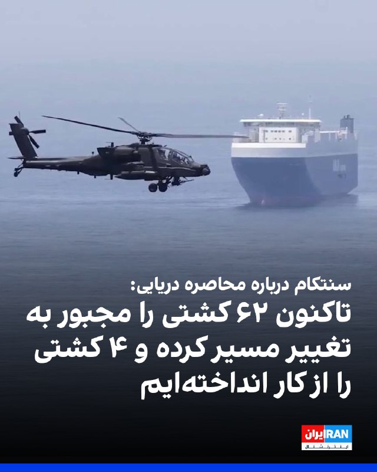

ستاد فرماندهی مرکزی آمریکا، سنتکام، اعلام کرد نیروهای آمریکایی تاکنون ۶۲ کشتی تجاری را مجبور به تغییر مسیر کرده و چهار کشتی را برای اجرای محاصره از کار انداخته‌اند.

سنتکام با انتشار تصویری از یکی از ناوشکن‌های آمریکا در ایکس نوشت: ناو «دیلبرت دی‌بلک» در حال نظارت بر آب‌های منطقه‌ای در دریای عرب است و در اجرای محاصره دریایی آمریکا علیه جمهوری اسلامی مشارکت دارد.
https://iranintl.com/202605110754

## iranintltv — post 336661

  <a href="telegram/content/iranintltv_336661_1778510404.mp4" target="_blank">🎬 Download video</a>

محمدعلی عزیز جعفری که از سال ۱۳۸۶ تا ۱۳۹۸ فرمانده کل سپاه پاسداران بود، بر پنج شرط جمهوری اسلامی برای مذاکره با آمریکا تاکید کرد.

مرتضی کاظمیان، عضو تحریریه ایران‌اینترنشنال، درباره پیشینه و جایگاه عزیز جعفری، اهمیت اظهارنظر او و نیز شرط‌های تهران برای مذاکره با واشینگتن توضیح می‌دهد.

@iranintltv

## iranintltv — post 336660

  <a href="telegram/content/iranintltv_336660_1778510406.mp4" target="_blank">🎬 Download video</a>

رسانه‌های اسرائیلی خبر دادند، بنیامین نتانیاهو، نخست‌وزیر این کشور، دوشنبه ۲۱ اردیبهشت نشست امنیتی برگزار می‌کند. همزمان دونالد ترامپ از گفت‌وگوی تلفنی با بنیامین نتایاهو خبر داد.

گفت‌وگو با سمیرا قرایی، خبرنگار ایران‌اینترنشنال
@iranintltv

## iranintltv — post 336659

  <a href="telegram/content/iranintltv_336659_1778510407.mp4" target="_blank">🎬 Download video</a>

بیش از ۷۳ روز است که میلیون‌ها نفر در ایران با قطع اینترنت مواجه هستند. به گفته بسیاری از شهروندان، این وضعیت زندگی، کار، درمان و آرامش روانی آن‌ها را مختل کرده است.

گفت‌وگو با سحر تحویلی، کارشناس ارشد هوش مصنوعی و فناوری
@iranintltv

## iranintltv — post 336658

  

بریتانیا روز دوشنبه ۱۲ فرد و نهاد مرتبط با جمهوری اسلامی را تحریم کرد و آن‌ها را به مشارکت در «فعالیت خصمانه» از جمله طرح‌ریزی حملات و ارائه خدمات مالی به گروه‌هایی که به دنبال بی‌ثبات‌سازی بریتانیا و سایر کشورها هستند متهم کرد.
این اقدام شامل مسدود کردن دارایی‌ها، ممنوعیت سفر و دستورهای لغو صلاحیت مدیریت است.
https://iranintl.com/202605116825

## iranintltv — post 336657

  <a href="telegram/content/iranintltv_336657_1778510409.mp4" target="_blank">🎬 Download video</a>

یک شهروند با ارسال پیامی به ایران‌اینترنشنال می‌گوید: «شرایط در ایران حقیقتا دشوارتر شده است. مواد خوراکی، بی‌کیفیت و گران‌ شده‌اند و همان‌ها هم در حال ناموجود شدن هستند.»

## iranintltv — post 336656

  

🔻تیم ملی فوتبال سومین بازی با خودش را سه‌شنبه ۲۲ اردیبهشت برگزار می‌کند. شاگردان امیر قلعه نویی به دلیل انزوای جمهوری اسلامی، از انجام بازی‌های تدارکاتی با تیم‌های درجه اول و دوم دنیا محروم شدند. حتی تیم‌های ملی مقدونیه و آنگولا هم از بازی با تیم ملی انصراف دادند.

🔹در حالی که تیم ملی فوتبال در آستانه جام جهانی نتوانسته حریفی پیدا کند و با خودش بازی می‌کند، فدراسیون فوتبال ازبکستان اعلام کرد که تیم ملی فوتبال این کشور پیش از جام جهانی ۲۰۲۶ دو بازی تدارکاتی با تیم‌های ملی هلند و کانادا برگزار خواهد کرد.

🔹امیر قلعه‌نویی، سرمربی تیم ملی، پیش‌تردرباره لغو بازی‌های تدارکاتی گفت: «بازی‌های تدارکاتی هماهنگ شده بود و قرارداد بستند؛ ولی در دقیقه ۹۰ کنسل شد.»

@iranintltvsport

## iranintltv — post 336655

پوریا میربهروزیان، جوان ۲۴ ساله، شامگاه ۱۸ دی‌ماه در حالی هدف گلوله ماموران در بلوار وکیل‌آباد مشهد قرار گرفت که در حال کمک به دوستان مجروحش بود. او روز ۲۴ اردیبهشت در بیمارستان فارابی جان باخت.

## iranintltv — post 336654

  <a href="telegram/content/iranintltv_336654_1778510411.mp4" target="_blank">🎬 Download video</a>

یک شهروند با ارسال پیامی به ایران‌اینترنشنال از اصفهان می‌گوید که با هزار زحمت کاسبی خود را انداخته ولی حالا سه ماه است که بیکار شده؛ «همه‌چیز گران شده و کسی پول ندارد.»

## iranintltv — post 336653

  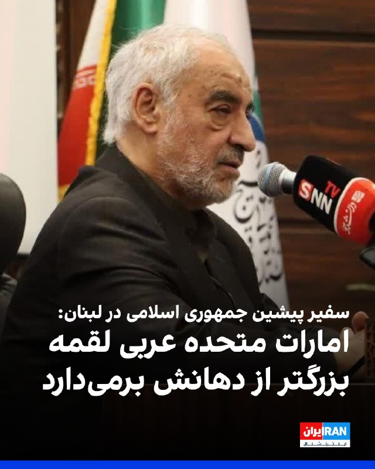

احمد دستمالچیان، سفیر سابق جمهوری اسلامی در اردن و لبنان، گفت: «اسرائیل زمام کنترل سیاست در امارات متحده عربی را در دست دارد و بازگشت آنها بسیار سخت است، ولی به نفع‌شان است که از سیاست دشمنی با مردم و ملت‌های منطقه برگردند. امارات می‌خواهد لقمه‌هایی بزرگتر از دهانش بردارد.»

او ادامه داد: «در غیر این صورت می‌تواند برای امارات متحده عربی شرایط نامناسبی ایجاد کند.»
https://iranintl.com/202605117725

## iranintltv — post 336652

  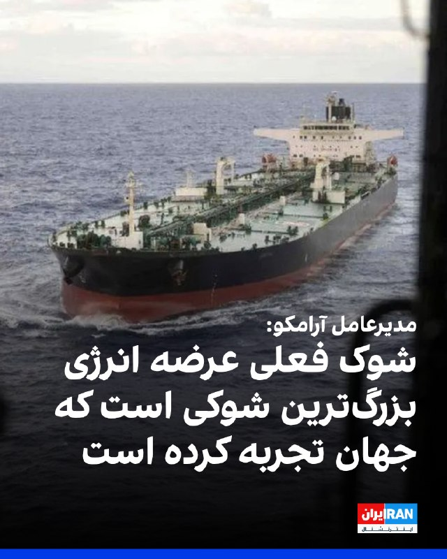

مدیرعامل آرامکو گفت که شوک فعلی عرضه انرژی بزرگ‌ترین شوکی است که جهان تاکنون تجربه کرده است.

او افزود که اگر اختلال در تنگه هرمز چند هفته دیگر ادامه یابد، عادی‌سازی بازار تا سال ۲۰۲۷ رخ نخواهد داد.

مدیرعامل آرامکو ادامه داد: «حتی اگر تنگه هرمز امروز باز شود، بازتعادل بازار ماه‌ها زمان خواهد برد.»
https://iranintl.com/202605113980

## iranintltv — post 336651

🔻در آستانه سفر ترامپ به چین، پکن تحریم‌ها علیه شرکت‌های مرتبط با تهران را رد کرد

دولت چین در آستانه سفر رییس‌جمهوری آمریکا به این کشور، مخالفت شدید خود را با تحریم‌های واشینگتن علیه سه شرکت مستقر در چین که ایالات متحده آن‌ها را متهم به کمک به عملیات نظامی حکومت ایران کرده، اعلام کرد و این تحریم‌ها را «غیرقانونی» و «یک‌جانبه» خواند.

گوئو جیاکون، سخنگوی وزارت خارجه چین، دوشنبه ۲۱ اردیبهشت در نشست خبری روزانه خود گفت: «ما همواره از شرکت‌های چینی خواسته‌ایم فعالیت‌های تجاری خود را مطابق قوانین و مقررات انجام دهند و قاطعانه از حقوق و منافع مشروع شرکت‌های چینی دفاع خواهیم کرد.»

او افزود: «اولویت فوری این است که به هر شکل ممکن از بازگشت درگیری‌ها جلوگیری شود، نه اینکه از جنگ برای مرتبط کردن و تخریب دیگر کشورها به‌صورت مغرضانه استفاده شود.»

دونالد ترامپ، رییس‌جمهوری آمریکا، در حالی چهارشنبه ۲۳ اردیبهشت وارد پکن خواهد شد که موضوع ایران یکی از محورهای گفت‌وگوی او با شی جین‌پینگ، رییس‌جمهوری چین، خواهد بود.

او در هفته‌های اخیر تلاش کرده است پکن را برای اعمال فشار بر تهران به‌منظور توافق با واشینگتن به کار بگیرد.
از سوی دیگر، آمریکا ۱۸ اردیبهشت اعلام کرد مجموعه‌ای از افراد و شرکت‌ها در چین، هنگ‌کنگ، بلاروس و امارات متحده عربی را به‌دلیل ارتباط با برنامه‌های تسلیحاتی و شبکه‌های تامین جمهوری اسلامی تحریم کرده است.
بر این اساس، شرکت چینی فناوری ماهواره‌ای چانگ گوانگ، علاوه بر تحریم‌های پیشین مرتبط با روسیه، تحت فرمان اجرایی مرتبط با تسلیحات ایران نیز قرار گرفت.
وزارت خزانه‌داری آمریکا اعلام کرد آمادگی دارد تا علیه هر شرکت خارجی درگیر در تجارت غیرقانونی با تهران، از جمله خطوط هوایی، اقدام کند.
این وزارت‌خانه همچنین گفت ممکن است تحریم‌های ثانویه‌ای را علیه موسسات مالی خارجی که به فعالیت‌های جمهوری اسلامی یاری می‌رسانند، اعمال کند؛ از جمله شرکت‌هایی که «با پالایشگاه‌های نفت مستقل چین مرتبط هستند».
در بیانیه این وزارت‌خانه به نقل از اسکات بسنت، وزیر خزانه‌داری آمریکا، آمده است: «تحت رهبری دونالد ترامپ، به اقدام برای حفظ امنیت آمریکا ادامه می‌دهیم.»
او گفت افراد و شرکت‌های خارجی تامین‌کننده سلاح برای نیروهای نظامی جمهوری اسلامی را هدف تحریم قرار می‌دهیم.
وزارت خارجه آمریکا نیز اعلام کرد چندین شرکت مستقر در چین به‌دلیل ارائه تصاویر ماهواره‌ای به تهران برای کمک به حملات نظامی علیه نیروهای آمریکایی در خاورمیانه، هدف تحریم قرار گرفتند.
مارکو روبیو، وزیر خارجه آمریکا، تاکید کرد: «اقدام امروز، نهادهای مستقر در چین را به‌دلیل حمایتشان از ایران پاسخگو می‌کند.»
او افزود آمریکا از «همه ابزارهای لازم» برای هدف قرار دادن نهادها و افرادی در کشورهای ثالث که به نیروهای نظامی و صنایع دفاعی جمهوری اسلامی کمک می‌کنند، استفاده خواهد کرد.
هم‌زمان وب‌سایت نشنال‌نیوز گزارش داد جمهوری اسلامی در پاسخ به مذاکرات جاری با آمریکا، فهرستی گسترده از مطالبات را مطرح کرده که به گفته منابع رسانه‌ای، با واکنش تند ترامپ روبه‌رو شده است.

بر اساس این گزارش که به نقل از شبکه لبنانی المیادین منتشر شد، [حکومت] ایران خواستار پایان فوری جنگ، تضمین آتش‌بس در لبنان، لغو کامل تحریم‌های ایالات متحده، آزادسازی دارایی‌های بلوکه‌شده و ازسرگیری بدون محدودیت صادرات نفت ایران شده است.

🔗وب‌سایت ایران‌اینترنشنال

@iranintltv

## iranintltv — post 336650

  

رضا دادویی، سخنگوی خانه تئاتر گفت که تئاتر امروز در یک چرخه‌ مرگبار گرفتار شده‌ و افزود وقتی درآمد هنرمند از زیر خط فقر هم پایین‌تر است، مطالبه پرداخت حق بیمه، نوعی فشار اقتصادی ایجاد می‌شود.»

او افزود: «هنرمندی که درآمدی نداشته و بیمه بیکاری دریافت نمی‌کند و با پرداخت نکردن حق بیمه از خدمات اجتماعی و درمانی محروم می‌شود.»

او ادامه داد: «هنرمند در این شرایط ناچار است بین بقا و معیشت و خلق اثر هنری یکی را انتخاب کند.»
https://iranintl.com/202605113803

## iranintltv — post 336649

  <a href="telegram/content/iranintltv_336649_1778510414.mp4" target="_blank">🎬 Download video</a>

عبدالناصر همتی، رییس بانک مرکزی ایران، در واکنش به بحران ارزی گفت افزایش نرخ ارز در شرایط تورمی و جنگی، طبیعی است.

ارزیابی آرش آزرمی، دبیر بخش اقتصادی ایران‌اینترنشنال

@iranintltv

## iranintltv — post 336648

  <a href="telegram/content/iranintltv_336648_1778510416.mp4" target="_blank">🎬 Download video</a>

کی‌یر استارمر، نخست‌وزیر بریتانیا، پس از شکست سنگین حزب کارگر در انتخابات شوراهای محلی، اعلام کرد قصد کناره‌گیری ندارد و با هرگونه تلاش برای برکناری‌اش مبارزه می‌کند.
گفت‌وگو با تاج‌الدین سروش، عضو تحریریه ایران‌اینترنشنال

@iranintltv

## iranintltv — post 336647

  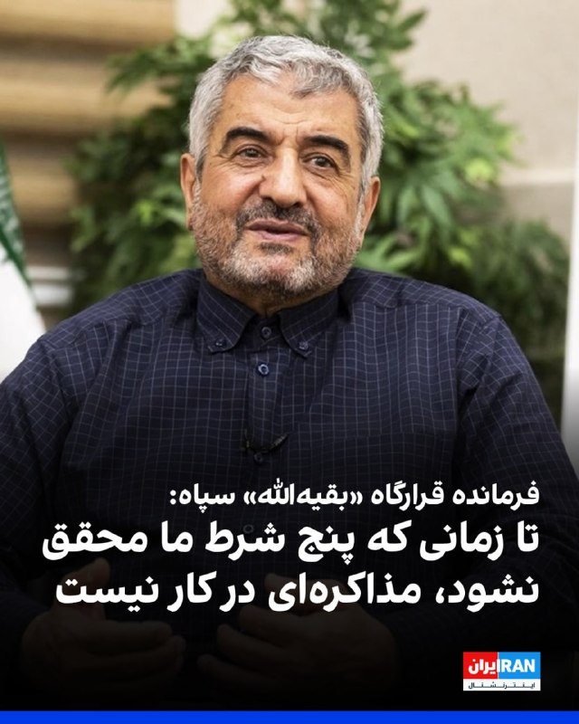

محمدعلی جعفری، فرمانده قرارگاه «بقیه‌الله» سپاه پاسداران، گفت: «تا زمانی که جنگ در همه جبهه‌ها پایان نیابد، تحریم‌ها برداشته نشود، پول‌های بلوکه‌شده آزاد نشود، خسارت‌های ناشی از جنگ جبران نشود و حق حاکمیت جمهوری اسلامی بر تنگه هرمز به رسمیت شناخته نشود، هیچ مذاکره دیگری در کار نیست.»

او افزود که با این سطح از بی‌اعتمادی به آمریکا، طبیعی است تیم مذاکره‌کننده با هدایت کلیت نظام، شروطی را مشخص کند که همه حقوق مسلم جمهوری اسلامی را تامین کند و این شروط «حداقل انتظارات» ما است.
iranintl.com/202605118530

---
📅 بروزرسانی: 1405/02/21 15:17
---

## iranintltv — post 336641

  <a href="telegram/content/iranintltv_336641_1778500064.mp4" target="_blank">🎬 Download video</a>

گروهی از ایرانیان مقیم ایتالیا، یکشنبه ۲۰ اردیبهشت، در اعتراض به اعدام‌های جمهوری اسلامی در شهر بولونیا تجمع کردند.

گزارش صدف باغبان، خبرنگار

@iranintltv

## iranintltv — post 336640

🔻ترامپ پاسخ تهران به طرح صلح را رد کرد؛ ادامه بحران تنگه هرمز قیمت نفت را بالا برد

دونالد ترامپ، رییس‌جمهوری آمریکا، به‌سرعت پاسخ جمهوری اسلامی به پیشنهاد صلح واشینگتن را رد کرد. اقدامی که روز دوشنبه باعث جهش قیمت نفت شد و نگرانی‌ها را درباره ادامه جنگ و فلج ماندن کشتیرانی در تنگه هرمز افزایش داد.

خبرگزاری رویترز دوشنبه ۲۱ اردیبهشت گزارش داد چند روز پس از آن‌که آمریکا پیشنهادی را برای ازسرگیری مذاکرات ارائه کرد، تهران ۲۰ اردیبهشت پاسخ خود را ارائه داد. پاسخی که بر پایان جنگ «در همه جبهه‌ها»، به‌ویژه لبنان - جایی که اسرائیل، متحد آمریکا، با نیروهای حزب‌الله مورد حمایت جمهوری اسلامی درگیر است - تمرکز داشت.

صداوسیمای جمهوری اسلامی گزارش داد تهران همچنین خواستار دریافت غرامت خسارات جنگ و تاکید بر حاکمیت ایران بر تنگه هرمز شده است.

خبرگزاری تسنیم، وابسته به سپاه پاسداران، نیز گزارش داد جمهوری اسلامی در این پاسخ خواستار پایان محاصره دریایی آمریکا، تضمین عدم حمله مجدد، لغو تحریم‌ها و پایان ممنوعیت فروش نفت ایران از سوی آمریکا شده است.

ترامپ تنها چند ساعت بعد، در شبکه اجتماعی تروث سوشال، این پیشنهاد را رد کرد.

او نوشت: «دوستش ندارم - کاملا غیرقابل قبول است ....»

رییس‌جمهوری آمریکا توضیح بیشتری ارائه نکرد.

اختلاف بر سر مسیر پایان جنگ
رویترز نوشت که آمریکا پیشنهاد کرده بود ابتدا درگیری‌ها متوقف شود و سپس مذاکرات درباره مسائل اختلاف‌برانگیزتر، از جمله برنامه هسته‌ای جمهوری اسلامی، آغاز شود.
پس از رد خواسته‌های تهران از سوی ترامپ، حکومت ایران ۲۱ اردیبهشت اعلام کرد پیشنهادش برای پایان جنگ «سخاوتمندانه و مسئولانه» بوده است.
اسماعیل بقایی، سخنگوی وزارت امور خارجه جمهوری اسلامی، گفت: «خواسته ما مشروع است؛ پایان جنگ، لغو محاصره و دزدی دریایی آمریکا و آزادسازی دارایی‌های ایران که تحت فشار آمریکا به‌طور ناعادلانه در بانک‌ها مسدود شده‌اند.»
او افزود: «عبور امن از تنگه هرمز و برقراری امنیت در منطقه و لبنان نیز از دیگر خواسته‌های ایران بود که پیشنهادی سخاوتمندانه و مسئولانه برای امنیت منطقه محسوب می‌شود.»
بقایی همچنین گفت جمهوری اسلامی هنوز با کسانی که «علیه ما چنین جنایتی مرتکب شدند»، تسویه‌حساب نکرده و اگر فرصتی در اختیار نیروهای مسلح قرار گیرد، «به بهترین وجه» از آن استفاده خواهد شد.

جهش قیمت نفت و ادامه بحران تنگه هرمز
در پی تداوم بن‌بست میان تهران و واشینگتن، قیمت نفت ۲۱ اردیبهشت بیش از ۳.۵ درصد افزایش یافت.
پیش از آغاز جنگ میان آمریکا و اسرائیل با جمهوری اسلامی در ۹ اسفند ۱۴۰۴، حدود یک‌پنجم نفت و گاز طبیعی مایع جهان از تنگه هرمز عبور می‌کرد. این آبراه اکنون به یکی از مهم‌ترین نقاط فشار در جنگ تبدیل شده است.
اگرچه تردد کشتی‌ها در تنگه هرمز در مقایسه با پیش از جنگ بسیار کاهش یافته، داده‌های شرکت‌های کپلر و ال‌اس‌یی‌جی نشان می‌دهد هفته گذشته سه نفتکش حامل نفت خام از این مسیر عبور کردند.
بر اساس این داده‌ها، این کشتی‌ها برای جلوگیری از حمله احتمالی جمهوری اسلامی، سامانه‌های ردیابی خود را خاموش کرده بودند.
درگیری‌های پراکنده در اطراف تنگه هرمز طی روزهای اخیر، آتش‌بسی را که از اواسط فروردین ۱۴۰۵ جنگ گسترده را متوقف کرده بود، بار دیگر تحت فشار قرار داده است.

🔗متن کامل گزارش را اینجا بخوانید

@iranintltv

## iranintltv — post 336639

  

رویترز بر اساس داده‌های کشتیرانی خبر داد که یک نفتکش دیگر از قطر به سمت پاکستان در حال حرکت است.
این دومین عبور یک نفتکش گاز طبیعی مایع قطر از تنگه هرمز به سمت پاکستان از زمان جنگ ایران است.

رویترز نوشت که کشتی میهزم بندر راس لفان قطر را ترک کرده و قرار است سه‌شنبه به بندر قاسم پاکستان برسد.

بر اساس این گزارش، انتظار می‌رود در روزهای آینده دو نفتکش دیگر حامل گاز طبیعی مایع قطر نیز راهی پاکستان شوند.
https://iranintl.com/202605117638

## iranintltv — post 336638

🗣روایت شما از اقتصاد بحرانی زیر سایه آتش‌بس- دوشنبه ۲۱ اردیبهشت:

🔹مدرس کاشت ناخن و مانیکور هستم اما از اسفندماه اوضاع کاری به‌شدت به‌هم ریخته. آنتن دستگاه کارتخوان‌مون از همون موقع قطع شده و بعد از اینکه تماس گرفتیم، گفتن بنا به دلایل امنیتی آنتن دستگاه‌های پوز مشاغل غیرضروری رو قطع کردیم. همچنین فروش پکیج آموزش مجازی در اینستاگرام و تلگرام رو هم با قطع دسترسی به اینترنت عملاً از دست دادم.

🔹نمی‌تونیم مدام از جیب بخوریم چون دیگه جیب‌ها هم خالی شده. مردم دارن وسایل خونه‌شون رو می‌فروشن که خرج مواد خوراکی کنن.

🔹شرایط در ایران حقیقتاً دشوارتر شده. مواد خوراکی، بی‌کیفیت اما گرون‌قیمت شدن و حتی همون هم اگه توان خریدش رو داشته باشیم، داره ناموجود می‌شه.

🔹خسته شدیم. گرونی بیداد می‌کنه. سه قلم جنس بی‌ارزش مثل چیپس، بیسکویت و بستنی درمجموع می‌شه ۳۰۰ هزار تومان، دیگه گوشت و مرغ و برنج بماند.

🔹اجاره مسکن در تهران به‌قدری بالا رفته که الگوی سکونت داره تغییر می‌کنه. اوضاع به ‌شکلی شده که در اکثر آگهی‌های اجاره، مستأجرها به دنبال هم‌خونه می‌گردن.

🔹من کابینت‌ساز هستم. سال ۱۴۰۴ هر ورق ام‌دی‌اف رو به قیمت ۳ میلیون تومان می‌خریدم اما امسال بین ۱۵ میلیون تا ۱۷ میلیون تومان قیمت هر ورق شده.

🔹 کفش اسکیتی که می‌خواستم بخرم از ۷ میلیون تومان شده ۱۱ میلیون تومان. تا کی حسرت بخوریم؟

🔹بعد از ۷۰ روز با یک گیگ اینترنت وصل شدم. زندگی واقعاً سخت شده، همه‌چیز به‌شدت گران شده و واقعاً هیچ‌چیزی نمی‌شود خرید، حتی قیمت یک نوشابه بالای ۱۰۰ هزار تومان است.

## iranintltv — post 336637

  

روزنامه اطلاعات در یادداشتی به «ادامه جنگ، تحریم‌ها و محدودیت توان دولت» اشاره کرد و خواستار صرفه‌جویی مردم در مصرف آب، برق، سوخت، غذا، نان، برنج و گندم شد.

این روزنامه در ادامه نوشت مصرف سوخت نیز وضعیت مشابهی دارد و پرسید چه اصراری وجود دارد افراد در مسیرهایی که خودروهای عمومی وجود دارد، با خودروهای تک‌سرنشین تردد کنند یا برای تفریح فقط «دور دور» کنند.

روزنامه اطلاعات همچنین نوشت مصرف بیش از اندازه مواد غذایی از جمله برنج و گندم، همراه با شیوه‌های ناسالم تغذیه، به بروز مشکلاتی مانند بیماری، کاهش عمر و افزایش هزینه‌های بیمارستانی منجر می‌شود.
iranintl.com/202605111279

## iranintltv — post 336635

🔻گزارش گاردین از سایه‌ سنگین تنش با جمهوری اسلامی بر امنیت جام‌جهانی ۲۰۲۶

روزنامه گاردین در گزارشی نوشت هم‌زمانی مسابقات جام جهانی فوتبال ۲۰۲۶ با افزایش تنش‌ها با جمهوری اسلامی، خطر انجام حملات «تروریستی» در خاک آمریکا را افزایش داده است.

براساس این گزارش، کارشناسان امنیتی هشدار داده‌اند که مهم‌ترین تهدیدها می‌تواند از سوی مهاجمان تک‌نفره یا گروه‌های افراطی الهام‌گرفته از ایدئولوژی‌های جهادی یا جریان‌های تندرو داخل آمریکا باشد.

قرار است جام جهانی ۲۰۲۶ با ۱۰۴ مسابقه برگزار شود که ۷۸ بازی آن در آمریکا خواهد بود. مسابقات در شهرهایی مانند لس‌آنجلس، میامی و نیویورک برگزار می‌شود و به نوشته‌ی گاردین، گستردگی جغرافیایی این رویداد، چالش بزرگی برای نیروهای امنیتی ایجاد کرده است.

تنها مسابقه فینال در ایست رادرفورد نیوجرسی در سطح «رویداد ویژه امنیت ملی» قرار گرفته و بسیاری از مسابقات دیگر نیز در رده پرخطر ارزیابی شده‌اند و نیازمند حضور گسترده‌ی نهادهای فدرال امنیتی هستند.

کارشناسان به «اهداف نرم» مانند هتل‌ها، مراکز حمل‌ونقل و محل تجمع هواداران به‌عنوان نقاط آسیب‌پذیر اشاره کرده‌اند. همچنین احتمال حملات سایبری و استفاده از پهپادها از دیگر نگرانی‌های مطرح‌شده در این گزارش است.

این گزارش در شرایطی منتشر شده که تنش‌ها میان آمریکا، اسرائیل و جمهوری اسلامی در ماه‌های اخیر افزایش یافته و موضوع حضور تیم ملی فوتبال ایران در جام جهانی ۲۰۲۶ نیز با بحث‌های سیاسی و امنیتی همراه شده است.

🔗وب‌سایت ایران‌اینترنشنال
@iranintltv

## iranintltv — post 336634

روزنامه اعتماد در گزارشی از ناراحتی مقامات ورزشی و برخی نهادهای جمهوری اسلامی از سفر مهدی تاج به کانادا برای شرکت در کنگره فیفا خبر داد.

گفت‌وگو با آیدین مقیمی، عضو تحریریه ایران‌اینترنشنال

@iranintltv

## iranintltv — post 336633

سرخط خبرهای دوشنبه ۲۱ اردیبهشت

@iranintltv

## iranintltv — post 336632

  <a href="telegram/content/iranintltv_336632_1778500066.mp4" target="_blank">🎬 Download video</a>

پیام‌های رسیده به ایران‌اینترنشنال نشان می‌دهد گرانی قهوه در کافه‌ها و کاهش مشتریان، باعث تعدیل و اخراج پرسنل و همچنین تعطیلی برخی از کافه‌ها شده‌ است.

لیلا سعادتی، عضو تحریریه ایران‌اینترنشنال، گزارش می‌دهد

@iranintltv

## iranintltv — post 336631

  

علیرضا سلیمی، عضو هیات رییسه مجلس، درباره محاصره دریایی بنادر و سواحل جنوب ایران از سوی آمریکا گفت جمهوری اسلامی «حتما در جهت شکستن حصر دریایی» اقدام خواهد کرد و «سیلی محکمی» به دشمنان خواهد زد.

او گفت که آتش‌بس «نباید یک‌طرفه باشد» و افزود: «حتما باید در این بخش نیز سیلی جانانه‌ای به دشمنان بزنیم. دشمنان نشان دادند که زبانی غیر از زور نمی‌فهمند و باید با سیلی آنها را بیدار کرد چراکه با دیپلماسی و گفت‌وگو از خواب غفلت بیدار نمی‌شوند.»

سلیمی ادامه داد: «تنها چیزی که دشمنان را بیدار می‌کند غرش توپ و غریو موشک است و اگر بخواهیم با لبخند با دشمنان برخورد کنیم جری‌تر و جسورتر خواهند شد.»
iranintl.com/202605115658

## iranintltv — post 336630

  <a href="telegram/content/iranintltv_336630_1778500068.mp4" target="_blank">🎬 Download video</a>

یک شهروند با ارسال پیام صوتی از قزوین به ایران‌اینترنشنال می گوید: «باید از هموطنان خارج از کشور تشکر کنم که دغدغه‌شان ایرانیان داخل از کشور است؛ کسانی که به اسارت گرفته شده‌اند. ما دیگر صدایی نداریم و نمی‌توانیم ابراز وجود کنیم. همه امیدمان به شماست.»

## iranintltv — post 336629

  

ولودیمیر زلنسکی گفت که حدود ۲۰ کشور به توافق‌های خرید پهپاد با اوکراین علاقه‌مند هستند و تاکنون چهار توافق امضا شده است.

اوکراین توافق‌های دفاعی و پهپادی با آلمان، نروژ و هلند امضا کرده و در اواخر مارس توافق‌های امنیتی بلندمدت با عربستان سعودی، قطر و امارات متحده عربی امضا کرد.
iranintl.com/202605114647

## iranintltv — post 336628

  <a href="telegram/content/iranintltv_336628_1778500070.mp4" target="_blank">🎬 Download video</a>

بریتانیا و فرانسه قرار است سه‌شنبه میزبان نشستی آنلاین با حضور وزیران دفاع بیش از ۴۰ کشور جهان باشند. محور این نشست، بررسی برنامه‌های نظامی برای بازگرداندن جریان تجارت در تنگه هرمز عنوان شده است.

گفت‌وگو با مهدی بیگی، خبرنگار ایران‌اینترنشنال

@iranintltv

## iranintltv — post 336627

  <a href="telegram/content/iranintltv_336627_1778500072.mp4" target="_blank">🎬 Download video</a>

هاکان فیدان، وزیر خارجه ترکیه، با عباس عراقچی و بدر عبدالعاطی، وزیران خارجه جمهوری اسلامی و مصر، درباره تحولات مربوط به مذاکرات صلح میان تهران و واشینگتن تلفنی گفت‌وگو کرد.

گفت‌وگو با نرگس هورخش، خبرنگار ایران‌اینترنشنال

@iranintltv

## iranintltv — post 336626

  <a href="telegram/content/iranintltv_336626_1778500074.mp4" target="_blank">🎬 Download video</a>

ویدیوی رسیده به ایران‌اینترنشنال نشان می‌دهد نفتکش متعلق به جمهوری اسلامی، روز دوشنبه ۲۱ اردیبهشت‌ماه همچنان در حال سوختن است.
فرماندهی مرکزی آمریکا (سنتکام) روز شنبه ۱۹ اردیبهشت اعلام کرد نیروهای این کشور دو نفتکش با پرچم جمهوری اسلامی را در دریای عمان، پیش از رسیدن به بنادر ایران، متوقف کردند.

## iranintltv — post 336625

  

حبیب جهان‌ساز، رییس سازمان چای، گفت که بر اساس مصوبه شورای قیمت‌گذاری، قیمت خرید تضمینی برگ سبز چای در سال جاری برای درجه یک، ۴۲ هزار تومان و برای درجه دو، ۲۳ هزار تومان تعیین شده که نسبت به سال گذشته به ترتیب ۷۲ درصد و ۶۷ درصد افزایش یافته است.

او افزود: «اولویت اصلی ما در این شرایط، تأمین بازار داخلی است هرچند بخشی از چای کشور نیز جنبه صادراتی دارد و تلاش می‌کنیم با حفظ تعادل هم بازار داخل را تأمین کنیم و هم مشتریان خارجی خود را حفظ کنیم.»
iranintl.com/202605110813

## iranintltv — post 336624

  

ابوالفضل ظهره‌وند، عضو کمیسیون امنیت ملی مجلس، گفت: «اینجا دو ثانیه دیگر تهران است، سه ثانیه دیگر مثلا واشینگتن است. بعضی‌ها دیدند چه ظرفیت‌هایی وجود دارد. می‌شود کارهایی کرد که اصلا بمب اتمی یعنی چه؟ این‌ها دیگر بچه‌بازی و برای گذشته است.»

او افزود: «من جاهایی را که دیدم، ظرفیت‌هایی را که دیدم، اتفاقاتی می‌آید که بمب اتم واقعا ترقه است. می‌شود کارهای عجیبی کرد. می‌شود زمان را پشت سر گذاشت. یعنی چه؟ هیچ‌کس نمی‌داند.»

ظهره‌وند گفت تاثیر تنگه هرمز، باب‌المندب و «حوزه مقاومت»، بیشتر از صد بمب است و افزود: «وقتی اراده‌ات بالا بیاید تولید یک بمب کاری ندارد. شاید اتفاقاتی را شکل بدهی که بمب اتم پیش آن ترقه باشد.»
iranintl.com/202605114129

## iranintltv — post 336623

  <a href="telegram/content/iranintltv_336623_1778500076.mp4" target="_blank">🎬 Download video</a>

ویدیوهای ارسال‌شده به ایران‌اینترنشنال در دوشنبه ۲۱ اردیبهشت، ستون دود ناشی از انفجار را در شیراز نشان می‌دهد.
طبق اعلام ارتش، مهمات عمل‌نکرده به‌صورت کنترل‌شده منفجر شده است.

## iranintltv — post 336622

  <a href="telegram/content/iranintltv_336622_1778500077.mp4" target="_blank">🎬 Download video</a>

یک شهروند با ارسال ویدیویی به ایران‌اینترنشنال از گرانی چندین برابری روغن خوراکی خبر می‌دهد و می‌گوید: «سپاه ما را به خواری و ذلت انداخته است.»

## iranintltv — post 336621

  <a href="telegram/content/iranintltv_336621_1778500079.mp4" target="_blank">🎬 Download video</a>

ویدیوهای ارسال‌شده به ایران‌اینترنشنال در دوشنبه ۲۱ اردیبهشت، برخاستن دود ناشی از انفجار را در شیراز نشان می‌دهد.
طبق اعلام ارتش، مهمات عمل‌نکرده به‌صورت کنترل‌شده منفجر شده است.

---
📅 بروزرسانی: 1405/02/21 12:08
---

## iranintltv — post 336611

یک شهروند با ارسال پیام صوتی به ایران‌اینترنشنال می‌گوید مدرس کاشت ناخن است و کسب‌وکار او به مشکل خورده: «شغل ما را غیرضروری دانسته‌اند و دستگاه کارتخوان‌مان را قطع کردند.»

## iranintltv — post 336610

  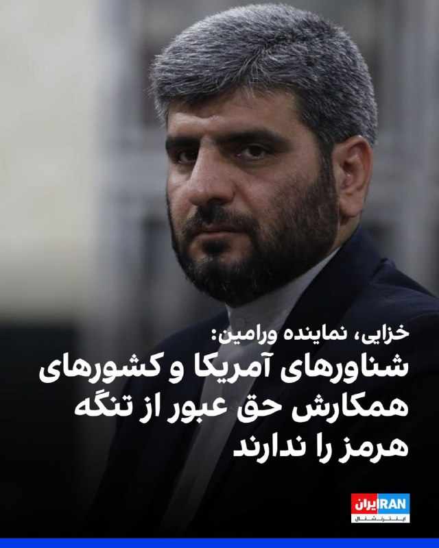

علی خزایی، نماینده ورامین در مجلس گفت: «شرایط مدیریت تنگه هرمز هیچ‌گاه مانند گذشته نخواهد شد و این تنگه به وضع سابق بازنمی‌گردد و هیچ شناوری بدون اجازه جمهوری اسلامی حق عبور ندارد.»

او افزود: «شناورهای آمریکا و کشورهای همکار با این کشور، اجازه عبور از تنگه هرمز را نخواهند داشت.»
iranintl.com/202605117967

## iranintltv — post 336609

  <a href="telegram/content/iranintltv_336609_1778488706.mp4" target="_blank">🎬 Download video</a>

دونالد ترامپ پاسخ جمهوری اسلامی به آمریکا را «کاملا غیر قابل قبول» ارزیابی کرد. همزمان تسنیم، خبرگزاری وابسته به سپاه به نقل از یک منبع مطلع نوشت تهران برای خوشایند ترامپ، طرح نمی‌نویسد.

مرتضی کاظمیان، عضو تحریریه ایران‌اینترنشنال، از دو راهی تسلیم یا تغییر رژیم برای جمهوری اسلامی می‌گوید

@iranintltv

## iranintltv — post 336608

  <a href="telegram/content/iranintltv_336608_1778488707.mp4" target="_blank">🎬 Download video</a>

بنیامین نتانیاهو، نخست‌وزیر اسرائیل، تغییر حکومت در ایران را ممکن دانست ولی گفت این موضوع تضمین‌ شده‌ نیست. او به ضرورت مهار برنامه هسته‌ای، نیروهای نیابتی و برنامه موشکی جمهوری اسلامی اشاره کرد و گفت این جنگ هنوز تمام نشده‌ است.

گفت‌وگو با مئیر جاودانفر، تحلیل‌گر مسائل اسرائیل

@iranintltv

## iranintltv — post 336607

  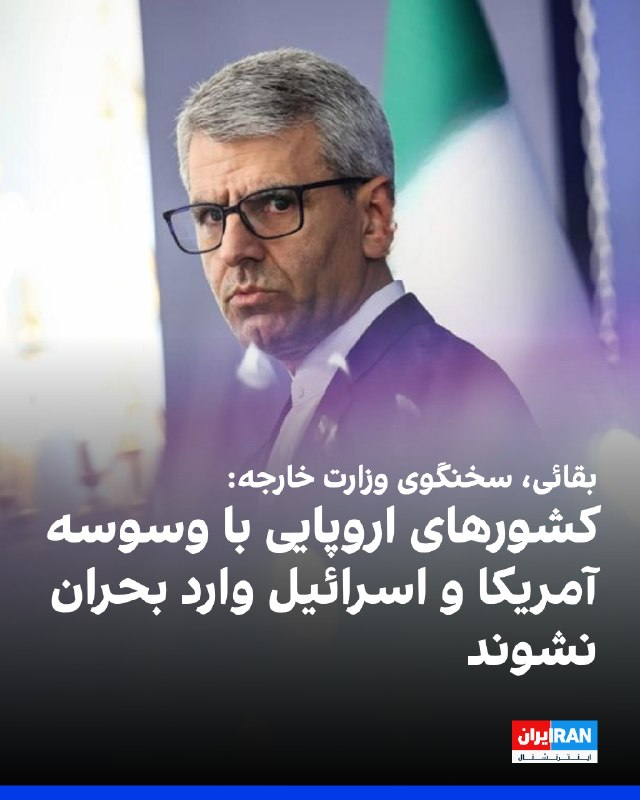

اسماعیل بقائی، سخنگوی وزارت خارجه جمهوری اسلامی گفت: «ما به کشورهای اروپایی صریحا اعلام کردیم که اجازه ندهند وسوسه‌های آمریکا یا اسرائیل در موضوعات منطقه‌ای، آن‌ها را ناخواسته به بحرانی بکشاند که سودی برایشان نخواهد داشت.»

او اضافه کرد: «این آگاهی نسبی در بسیاری از کشورهای اروپایی وجود دارد. آنها مطمئن هستند که این جنگ، جنگی غیرقانونی، غیراخلاقی و تجاوزکارانه بوده است. به همین دلیل، اجازه ندادند فشارهای آمریکا آنان را به‌طور علنی بخشی از این اقدام غیرقانونی و مخرب صلح و امنیت بین‌المللی کند.»
https://iranintl.com/202605110407

## iranintltv — post 336606

  

عباس مقتدایی، نایب‌رییس کمیسیون امنیت ملی مجلس، گفت که اگر آمریکا بخواهد بر «تخیلات» خود علیه منافع جمهوری اسلامی اصرار بورزد، «تاوان سختی» برای این لجاجت در شهرهای آمریکا خواهد پرداخت.

او افزود نیروهای مسلح جمهوری اسلامی «مدیریت هوشمند» تنگه هرمز را برای مقابله با «زیاده‌خواهی دشمنان» در دست گرفتند و اگر لازم باشد، برای عبور و مرور کشتی‌ها عوارض دریافت خواهند کرد.

نایب‌رییس کمیسیون امنیت ملی مجلس گفت برخی کشورهای منطقه با در اختیار قرار دادن خاک خود، با آمریکا و اسرائیل در حمله به ما همکاری کردند و جمهوری اسلامی در دفاع از خود «هر اقدامی» در برابر دشمنی آنها انجام می‌دهد.
iranintl.com/202605116225

## iranintltv — post 336605

  

اسماعیل بقائی، سخنگوی وزارت خارجه جمهوری اسلامی، در خصوص پاسخ تهران به پیشنهاد واشینگتن برای خاتمه جنگ گفت: «هرچه در متن پیشنهاد کردیم معقول و سخاوتمندانه بود. نه‌تنها برای منافع ملی ایران بلکه برای خیر و صلاح منطقه و جهان اما طرف‌های آمریکایی همچنان بر خواسته‌های نامعقول خود پافشاری می‌کنند.»

او افزود: «جمهوری اسلامی ثابت کرده قدرت مسئولیت‌پذیر در منطقه است. ما قلدر نیستیم؛ قلدرستیز هستیم.» او ادامه داد: «پیشنهاد ما برای تردد ایمن در تنگه هرمز آیا زیاده خواهانه است؟ موضوع مهمی همچون برقراری صلح و امنیت در تمام منطقه غیرمسئولانه است؟»

پیش‌تر دونالد ترامپ پیشنهاد جمهوری اسلامی را «غیرقابل قبول» خوانده بود.
iranintl.com/202605116908

## iranintltv — post 336604

  

🔻خبرگزاری میزان، رسانه قوه قضاییه جمهوری اسلامی، از توقیف بخشی از املاک منتسب به علی کریمی، بازیکن پیشین تیم ملی فوتبال و از چهره‌های مخالف جمهوری اسلامی خبر داد و نوشت یکی از املاک شناسایی‌شده، یک پلاک ثبتی به نام هاوش، فرزند او، شامل دو واحد تجاری و چهار واحد مسکونی، است.

🔹براساس اطلاعیه منتشرشده از سوی قوه قضاییه جمهوری اسلامی، با استعلام از سازمان ثبت اسناد و املاک کشور، برخی املاک علی کریمی که به گفته قوه قضاییه جمهوری اسلامی «سعی در اختفای آن‌ها شده بود» شناسایی و توقیف شد.

🔹پیش‌تر نیز قوه قضاییه جمهوری اسلامی از توقیف اموال علی دایی، علی کریمی، مسعود شجاعی، زهرا قنبری و علیرضا فغانی به‌دلیل مخالفت با جمهوری اسلامی خبر داده بود.

@iranintltvsport

## iranintltv — post 336603

  

🔻اتحادیه جهانی کشتی اعلام کرد که مسابقات قهرمانی بزرگسالان جهان از ۱۱ تا ۱۹ سپتامبر ۲۰۲۷ در لاس‌وگاس برگزار خواهد شد. این رقابت‌ها نخستین مرحله انتخابی بازی‌های المپیک ۲۰۲۸ لس‌آنجلس نیز خواهد بود.

🔹اعطای میزبانی مهم‌ترین رویداد کشتی سال ۲۰۲۷ به آمریکا در حالی انجام شد که علیرضا دبیر، رییس فدراسیون کشتی، تهدید کرده بود اگر آمریکا با تیم ملی کشتی زیر ۲۳ سال ایران رفتاری مشابه تیم ملی فوتبال داشته باشد، تلاش می‌کند با همکاری «کشورهای صاحب کشتی» میزبانی مسابقات جهانی ۲۰۲۷ را از آمریکا بگیرد.

🔹آمریکا در سال‌های اخیر برای برخی ورزشکاران، اعضا و همراهان تیم‌های ملی کشتی ایران، از جمله علیرضا دبیر، ویزا صادر نکرده است. از سوی دیگر، ابهام‌هایی درباره صدور ویزا برای اعضای تیم ملی فوتبال ایران مطرح شده است.

🔹مارکو روبیو، وزیر خارجه آمریکا، گفته است ایالات متحده با حضور تیم ملی فوتبال ایران در مسابقات جام جهانی در این کشور مخالفتی ندارد، اما درباره همراهان تیم گفته است: «آن‌ها نمی‌توانند یک مشت «تروریست» عضو سپاه را به‌عنوان روزنامه‌نگار یا مربی ورزشی وارد کشور ما کنند.»

@iranintltvsport

## iranintltv — post 336602

  <a href="telegram/content/iranintltv_336602_1778488711.mp4" target="_blank">🎬 Download video</a>

ویدیوهای رسیده به ایران‌اینترنشنال نشان می‌دهند ایرانیان مقیم اسپانیا و یونان، یکشنبه ۲۰ اردیبهشت در تجمع‌های اعتراضی برگزارشده در شهرهای مادرید و آتن، علیه جمهوری اسلامی پرفورمنس اعتراضی برگزار کردند.

## iranintltv — post 336601

  <a href="telegram/content/iranintltv_336601_1778488713.mp4" target="_blank">🎬 Download video</a>

بر اساس ویدیوهای رسیده به ایران‌اینترنشنال، ایرانیان مقیم کانادا روز یکشنبه در پی فراخوان شاهزاده رضا پهلوی و علیه اعدام‌های جمهوری اسلامی، در اتاوا و ونکوور تجمع کردند.

## iranintltv — post 336600

  <a href="telegram/content/iranintltv_336600_1778488715.mp4" target="_blank">🎬 Download video</a>

روزنامه گاردین در گزارشی از ارتباط اسحاق قالیباف، پسر رییس مجلس جمهوری اسلامی، با یک مرکز پژوهشی در دانشگاه ملبورن و سرمایه‌گذاری او در حوزه املاک در استرالیا خبر داد.

علیرضا محبی، خبرنگار ایران‌اینترنشنال،‌ گزارش می‌دهد
@iranintltv

## iranintltv — post 336599

  <a href="telegram/content/iranintltv_336599_1778488717.mp4" target="_blank">🎬 Download video</a>

خبرگزاری میزان، وابسته به قوه قضاییه جمهوری اسلامی، از اعدام عرفان شکورزاده، زندانی سیاسی، به اتهام «همکاری با سرویس اطلاعاتی آمریکا و سرویس جاسوسی موساد» خبر داد.

گفت‌وگو با رضا حاجی‌حسینی، روزنامه‌نگار

@iranintltv

## iranintltv — post 336598

  <a href="telegram/content/iranintltv_336598_1778488718.mp4" target="_blank">🎬 Download video</a>

ایرانیان مقیم تورنتو کانادا در پاسخ به فراخوان شاهزاده رضا پهلوی برای اعتراض به خاموشی سراسری اینترنت در ایران، بازداشت‌های گسترده و اعدام بی‌وقفه معترضان تجمع کردند.

مهسا مرتضوی، خبرنگار ایران‌اینترنشنال، گزارش می‌دهد

@iranintltv

## iranintltv — post 336597

  <a href="telegram/content/iranintltv_336597_1778488720.mp4" target="_blank">🎬 Download video</a>

ایرانیان ساکن ونکوور کانادا در اعتراض به خاموشی سراسری اینترنت در ایران، بازداشت‌های گسترده و اعدام بی‌وقفه معترضان بار دیگر گرد هم آمدند.

@iranintltv

## iranintltv — post 336596

  <a href="telegram/content/iranintltv_336596_1778488721.mp4" target="_blank">🎬 Download video</a>

ایرانیان مقیم فرانکفورت آلمان هم‌زمان با معترضان در ده‌ها شهر جهان، در حمایت از فراخوان شاهزاده رضا پهلوی و انقلاب ملی تجمع اعتراضی برگزار کردند.

مهدی تهرانی، خبرنگار ایران‌اینترنشنال، گزارش می‌دهد
@iranintltv

## iranintltv — post 336595

  <a href="telegram/content/iranintltv_336595_1778488722.mp4" target="_blank">🎬 Download video</a>

نرگس محمدی، برنده جایزه نوبل صلح، پس از صدور دستور توقف اجرای حکم برای انجام روند درمان، در بیمارستان پارس تهران بستری شد. بنیاد نرگس اعلام کرد این انتقال با «تودیع وثیقه سنگین» انجام شده است.

گفت‌وگو با ایمان آقایاری، فعال سیاسی
@iranintltv

## iranintltv — post 336594

  <a href="telegram/content/iranintltv_336594_1778488724.mp4" target="_blank">🎬 Download video</a>

بنیامین نتانیاهو، نخست‌وزیر اسرائیل، در مصاحبه با شبکه سی‌بی‌اس با اشاره به توانمندی‌های هسته‌ای تهران گفت اسرائیل بخش زیادی از آن‌ها را تضعیف کرده، اما همچنان بخشی از این تهدیدها باقی مانده و باید اقدامات بیشتری انجام شود.

گفت‌وگو با کامیار بهرنگ، عضو تحریریه ایران‌اینترنشنال
@iranintltv

## iranintltv — post 336593

  

خبرگزاری تسنیم، وابسته به سپاه پاسداران، گزارش داد یک نفتکش وی‌ال‌سی‌سی به نام «آگویس فانوریوس ۱» که حامل نفت خام عراق است، یکشنبه با هماهنگی تهران و از مسیر تعیین‌شده از سوی جمهوری اسلامی در تنگه هرمز عبور کرد.
https://iranintl.com/202605119586

## iranintltv — post 336592

  <a href="telegram/content/iranintltv_336592_1778488726.mp4" target="_blank">🎬 Download video</a>

ایرانیان مخالف جمهوری اسلامی در واشینگتن دی‌سی، در اعتراض به اعدام، سرکوب معترضان و قطع اینترنت در ایران تظاهرات کردند.

اردوان روزبه، خبرنگار ایران‌اینترنشنال، گزارش می‌دهد

@iranintltv

---
📅 بروزرسانی: 1405/02/21 08:44
---

## iranintltv — post 336583

  

حسین شریعتمداری، نماینده رهبر کشته‌شده جمهوری اسلامی در روزنامه کیهان نوشت: «حضور ناوهای فرانسه و بریتانیا یا هر کشور دیگری برای همراهی با آمریکا در مقابله با حق قانونی ما در حاکمیت بر تنگه هرمز دخالت آشکار در امور حاکمیتی ماست... و مقابله پیشدستانه با این ناو‌های جنگی حق طبیعی و شناخته‌شده ماست.»

او ادامه داد: «حضور ناوهای فرانسه و بریتانیا در تنگه هرمز، اعلام جنگ با جمهوری اسلامی خواهد بود.»

او افزود: «این ناوها در تیررس موشک‌های دوربرد ما قرار دارند و علاوه‌ برآن، دریای سرخ و باب‌المندب نیز در سلطه موشکی انصارالله یمن است.»
https://iranintl.com/202605111247

## iranintltv — post 336582

  <a href="telegram/content/iranintltv_336582_1778476443.mp4" target="_blank">🎬 Download video</a>

🔻محمد تقوی، ایران اینترنشنال در برنامه هت‌تریک درباره تهدیدهای مهدی تاج علیه فیفا و آمریکا گفت: «مهدی تاج و مسئولان جمهوری اسلامی دچار خودشاخ‌پنداری شده‌اند. حرف‌هایی که رییس فدراسیون فوتبال می‌زند، از همان نوع حرف‌هایی است که مسئولان سیاسی جمهوری اسلامی می‌زنند. تیم ملی به جام جهانی نرود، تیم‌های دیگر آماده‌ای هستند که جایگزین شوند.»

🔹تماشای نسخه کامل هت‌تریک؛👇
https://youtu.be/lCFOAQeAUng

@iranintltvsport

## iranintltv — post 336581

  <a href="telegram/content/iranintltv_336581_1778476444.mp4" target="_blank">🎬 Download video</a>

🔻در حالی که مقام‌های آمریکایی اعلام کردند عناصر وابسته به سپاه پاسداران به‌عنوان هیات همراه تیم ملی فوتبال حق حضور در آمریکا را ندارند، مهدی تاج، رییس فدراسیون فوتبال، در گفت‌وگو با صداوسیمای جمهوری اسلامی از شروط خود برای فیفا پیش از اعزام به جام جهانی گفت.

🔹توضیحات مزدک میرزایی، ایران اینترنشنال در برنامه هت‌تریک

🔹تماشای نسخه کامل هت‌تریک؛👇
https://youtu.be/lCFOAQeAUng

@iranintltvsport

## iranintltv — post 336580

  <a href="telegram/content/iranintltv_336580_1778476446.mp4" target="_blank">🎬 Download video</a>

سرخط خبرهای دوشنبه ۲۱ اردیبهشت
@iranintltv

## iranintltv — post 336579

  

برایان مست، رییس کمیته امور خارجی مجلس نمایندگان آمریکا، گفت: «هرگز نمی‌توان به رژیم ایران اعتماد کرد.»

این نماینده جمهوریخواه همچنین گفت حکومت ایران چاره‌ای جز بازگشت به میز مذاکره ندارد و دونالد ترامپ، رییس‌جمهوری آمریکا، فشار بر تهران را ادامه خواهد داد تا زمانی که جمهوری اسلامی ناچار به توافقی جدی شود.
https://iranintl.com/202605117347

## iranintltv — post 336578

  

آژانس خبری کردپا بر اساس «گزارش‌ها و شواهد از شهر سقز در استان کردستان» از افزایش فزاینده قیمت کالاهای اساسی، کمبود شدید نقدینگی و اختلال در خدمات بانکی خبر داد.

کردپا نوشت: «روایت‌های مردمی نشان می‌دهد که تنها طی دو هفته، قیمت بسیاری از کالاهای مصرفی و مواد اولیه چند برابر شده و همزمان توان خرید و معیشت بخش بزرگی از جامعه به‌شدت کاهش یافته است.»

این گزارش حاکی است در شهر سقز، خانه‌ای برای اجاره با کمتر از ۵۰۰ میلیون تومان رهن و ۱۵ میلیون تومان اجاره ماهانه یافت نمی‌شود؛ آن هم برای واحدی کوچک با یک اتاق و آشپزخانه.

در این میان، بسیاری از مراکز تولیدی به دلایلی مانند نبود مواد اولیه، هزینه بالای تولید، افزایش نرخ انرژی و کرایه‌ها تعطیل شده‌اند.

در شهرک صنعتی سقز نیز تا ابتدای اردیبهشت‌ماه بیش از ۳۰۰ کارگر، یعنی حدود نیمی از نیروی کار، اخراج شده‌اند و حدود ۱۵۰ کارگر دیگر با نصف حقوق مشغول به کار هستند.

بر اساس این گزارش، هم‌زمان با بحران اقتصادی، آسیب‌های اجتماعی از جمله «سرقت، راه‌زنی و کسب درآمد از راه‌های نابه‌هنجار» افزایش یافته است.
https://iranintl.com/202605118671

## iranintltv — post 336577

  <a href="telegram/content/iranintltv_336577_1778476448.mp4" target="_blank">🎬 Download video</a>

ویدیوهای دریافت‌شده نشان می‌دهد ایرانیان مقیم شهرهای والنسیا در اسپانیا و مونیخ آلمان، روز یک‌شنبه ۲۰ اردیبهشت، هم‌صدا با کارزار جهانی «یک ملت در گروگان»، علیه اعدام‌های جمهوری اسلامی و قطع اینترنت تجمع کردند و حمایت خود را از مردم ایران نشان دادند.
@iranintltv

## iranintltv — post 336574

  

بر اساس داده‌های شرکت کپلر، دو نفتکش پس از خاموش کردن سیستم‌های ردیابی خود با عبور از تنگه هرمز، این منطقه را ترک کردند.

بر اساس این گزارش، خاموش شدن دستگاه‌های موقعیت‌یاب باعث شد مسیر حرکت این نفتکش‌ها به طور دقیق قابل رصد نباشد.
https://iranintl.com/202605116330

## iranintltv — post 336573

  <a href="telegram/content/iranintltv_336573_1778476449.mp4" target="_blank">🎬 Download video</a>

جمعی از ایرانیان مقیم آمریکا، روز یک‌شنبه ۲۰ اردیبهشت، در حمایت از مردم ایران و شاهزاده رضا پهلوی و نیز در اعتراض به اعدام‌های جمهوری اسلامی و قطع اینترنت، در لس‌آنجلس تجمع کردند. آن‌ها هم‌صدا با کارزار جهانی «یک ملت در گروگان»، خواستار توجه جامعه بین‌المللی به وضعیت بحرانی داخل ایران شدند.
@iranintltv

## iranintltv — post 336571

  

یک مقام ارشد امنیتی عراق گزارش‌های منتشرشده درباره ایجاد پایگاه نظامی مخفی اسرائیل در صحرای غربی این کشور برای پشتیبانی از حملات علیه ایران را رد کرد و آن‌ها را «نادرست» خواند.

به گزارش آناتولی، این مقام که نامش فاش نشده، گفت ادعاها درباره فعالیت کنونی یک سایت نظامی اسرائیل در خاک عراق صحت ندارد.

این واکنش پس از گزارش وال‌استریت ژورنال مطرح شد که مدعی بود اسرائیل پیش از حملات ۹ اسفند، با اطلاع آمریکا پایگاهی مخفی در صحرای عراق ایجاد کرده است.

بر اساس آن گزارش، این پایگاه محل استقرار نیروهای ویژه و مرکز پشتیبانی لجستیکی بوده و نزدیک بود در ماه مارس پس از گزارش یک چوپان درباره فعالیت‌های مشکوک فاش شود.

مقام‌های عراقی پیش‌تر از درگیری با یک «عملیات هوایی مرموز» در منطقه النخیب خبر داده بودند که به کشته و زخمی شدن چند نظامی انجامید.

ارتش اسرائیل درباره این ادعاها اظهار نظر نکرده و تنش‌های منطقه‌ای همچنان ادامه دارد.
بیشتر بخوانید

https://iranintl.com/202605114193

## iranintltv — post 336570

  

نیویورک‌تایمز در گزارشی از موج اخراج‌ها پس از جنگ نهم اسفند خبر داد و نوشت حملات آمریکا و اسرائیل به صنایع فولاد و پتروشیمی، اختلال در واردات به‌دلیل محاصره بنادر و نیز سیاست‌هایی مانند قطع اینترنت، فشار سنگینی بر اقتصاد ایران وارد کرده است.

به نوشته این روزنامه، برخی آمارهای داخلی از بیکاری مستقیم و غیرمستقیم تا دو میلیون نفر و ثبت رکورد ۳۱۸ هزار رزومه در یک روز حکایت دارد؛ موضوعی که می‌تواند به کاهش قابل توجه درآمدهای مالیاتی دولت منجر شود.

در بخش صنعت، کمبود مواد اولیه و آسیب به کارخانه‌های بزرگ باعث کاهش تولید و اخراج‌های گسترده شده است.

مهدی بستانچی، رییس شورای هماهنگی شهرک‌های صنعتی سراسر کشور، به نیویورک تایمز گفت تا ۳.۵ میلیون کارگر ممکن است تحت تاثیر این روند انقباضی قرار گیرند.

همچنین قطعی اینترنت، صنعت فناوری را دچار بحران کرده و روزانه ده‌ها میلیون دلار خسارت به اقتصاد دیجیتال وارد می‌کند. این گزارش می‌افزاید نارضایتی اقتصادی که در سال‌های اخیر به اعتراضات انجامیده، همچنان برطرف نشده است.
https://iranintl.com/202605111091

## iranintltv — post 336569

  

روزنامه گاردین استرالیا گزارش داد اسحاق قالیباف، فرزند محمدباقر قالیباف، در دوران اقامت خود در استرالیا با یک مرکز پژوهشی در دانشگاه ملبورن همکاری داشته و همزمان از محل اجاره حداقل یک ملک در این کشور درآمد کسب می‌کرده است.

بر اساس اسناد ارائه‌شده در پرونده حقوقی او برای دریافت اقامت دائم کانادا، قالیباف بین سال‌های ۲۰۱۵ تا ۲۰۱۸ در ملبورن زندگی و در مقطع کارشناسی ارشد مهندسی تحصیل کرده و به‌عنوان دستیار پژوهشی در یک مرکز دانشگاهی مشغول به کار بوده است.

اسناد بانکی نشان می‌دهد او در سال ۲۰۱۸ مبالغی به‌عنوان «اجاره دریافتی» از یک آژانس املاک در ملبورن دریافت کرده، هرچند مالکیت دقیق املاک مشخص نیست. این گزارش همچنین به ارتباط نام کارفرمای او در ایران با چهره‌های نزدیک به سپاه اشاره کرده است. درخواست اقامت دائم قالیباف در کانادا در بهمن ۱۴۰۴ رد شد.

گاردین در ادامه به نگرانی بخشی از جامعه ایرانیان استرالیا درباره حضور بستگان مقام‌های جمهوری اسلامی در این کشور پرداخته است. برخی سیاستمداران استرالیایی نیز این موضوع را نشانه ضعف در چارچوب تحریم‌های این کشور دانسته‌اند.
بیشتر بخوانید

https://iranintl.com/20260510

## iranintltv — post 336568

  

وب‌سایت «اسرائیل نشنال‌نیوز» به نقل از المیادین گزارش داد جمهوری اسلامی در مذاکرات با آمریکا فهرستی از مطالبات گسترده مطرح کرده که با واکنش تند دونالد ترامپ روبه‌رو شده است.

تهران خواستار پایان فوری جنگ، تضمین آتش‌بس در لبنان، لغو کامل تحریم‌ها، آزادسازی دارایی‌های بلوکه‌شده و ازسرگیری بدون محدودیت صادرات نفت شده و کنترل تنگه هرمز را «خط قرمز» خود دانسته است. همچنین ترامپ هشدار داده «ایران دیگر نخواهد خندید.»

در عین حال، منابعی به نیویورک‌تایمز گفته‌اند دو طرف در حال بررسی توافقی موقت برای تمدید ۳۰ روزه آتش‌بس و توقف محاصره هرمز هستند تا مذاکرات ادامه یابد.

به نوشته وال‌استریت ژورنال، اختلاف اصلی بر سر ذخایر اورانیوم غنی‌شده پابرجاست؛ تهران کاهش شدید ذخایر را نپذیرفته و تنها درباره افزایش نظارت آژانس بین‌المللی انرژی اتمی اعلام آمادگی کرده است.

مذاکرات با میانجی‌گری پاکستان همچنان ادامه دارد و ارزیابی‌ها از وجود فرصت برای دستیابی به تفاهم حکایت دارد.
بیشتر بخوانید

https://iranintl.com/202605107880

---
📅 بروزرسانی: 1405/02/21 04:55
---

## iranintltv — post 336567

  

دولت بریتانیا اعلام کرد همراه با فرانسه روز سه‌شنبه میزبان نشستی چندملیتی درباره برنامه‌های نظامی برای بازگرداندن جریان تجارت در تنگه هرمز خواهد بود.

به گزارش خبرگزاری فرانسه، این خبر ساعاتی پس از آن اعلام شد که جمهوری اسلامی به لندن و پاریس درباره اعزام کشتی‌های جنگی به منطقه هشدار داد.

در بیانیه وزارت دفاع بریتانیا آمده است: «جان هیلی، وزیر دفاع، همراه با همتای فرانسوی خود، کاترین ووترین، ریاست مشترک نشستی با حضور وزیران دفاع بیش از ۴۰ کشور را برای آغاز مأموریت چندملیتی بر عهده خواهد داشت.»

این نشست مجازی پس از گردهمایی دو روزه کارشناسان نظامی در لندن در ماه گذشته برگزار می‌شود. در آن نشست، جنبه‌های عملی یک مأموریت چندملیتی به رهبری بریتانیا و فرانسه برای حفاظت از ناوبری در این آبراه کلیدی پس از برقراری آتش‌بس پایدار بررسی شد.

هیلی گفت: «ما در حال تبدیل توافق دیپلماتیک به برنامه‌های نظامی عملی برای بازگرداندن اعتماد به کشتیرانی از طریق تنگه هرمز هستیم.»
https://iranintl.com/202605114087

## iranintltv — post 336566

  <a href="telegram/content/iranintltv_336566_1778462742.mp4" target="_blank">🎬 Download video</a>

ویدیوهای دریافتی نشان می‌دهد جمعی از ایرانیان ساکن اسپانیا، روز یک‌شنبه ۲۰ اردیبهشت، در حمایت از فراخوان شاهزاده رضا پهلوی در مادرید تجمع کردند و ضمن برگزاری پرفورمنسی علیه اجرای احکام اعدام از سوی حکومت، اعلام کردند که در ۴۷ سال گذشته هیچ آتش‌بسی در جنگ جمهوری اسلامی علیه مردم ایران وجود نداشته است.

## iranintltv — post 336565

  

بنیامین نتانیاهو در گفت‌وگو با برنامه «۶۰ دقیقه» شبکه سی‌بی‌اس گفت جنگ اخیر با ایران «دستاوردهای بزرگی» داشته اما هنوز پایان نیافته است، زیرا به گفته او همچنان اورانیوم غنی‌شده، تأسیسات هسته‌ای، برنامه موشک‌های بالستیک و شبکه نیروهای نیابتی ایران باید مهار شوند.

او تأکید کرد اگر حکومت ایران تضعیف یا سرنگون شود، شبکه نیروهای نیابتی از جمله حزب‌الله، حماس و حوثی‌ها نیز فرو خواهد پاشید، هرچند تغییر حکومت «تضمین‌شده نیست.»

نتانیاهو درباره خارج کردن اورانیوم با غنای بالا گفت در صورت وجود توافق می‌توان «وارد شد و آن را خارج کرد»، اما درباره گزینه‌های نظامی توضیحی نداد.

او همچنین طرح ایران برای پیوند زدن آتش‌بس در همه جبهه‌ها را رد کرد و گفت برخی کشورهای عربی خواهان تقویت همکاری با اسرائیل برای مهار تهران هستند.

نتانیاهو حمله ۷ اکتبر را بخشی از «محور ایران» برای نابودی اسرائیل توصیف کرد.
بیشتر بخوانید
https://iranintl.com/202605112648

## iranintltv — post 336564

  

پیت هگست، وزیر جنگ آمریکا، سخنان سناتور مارک کلی،‌ عضو سنای ایالات متحده، مبنی بر اینکه وضعیت ذخایر موشک‌های این کشور در میانه جنگ با ایران «تکان‌دهنده»

او در شبکه اجتماعی ایکس نوشت که کلی «در تلویزیون (به دروغ و احمقانه) در مورد یک گزارش طبقه‌بندی‌شده پنتاگون که دریافت کرده است، یاوه‌گویی می‌کند.»

هگست اضافه کرد که مشاور حقوقی وزارت جنگ بررسی خواهد کرد که آیا این سناتور «سوگند خود را نقض کرده است یا خیر.»

پیش از این، کلی در پی دریافت گزارش محرمانه پنتاگون درباره تأثیر جنگ ایران بر ذخایر تسلیحاتی آمریکا گفته بود: «واقعاً شوکه‌کننده است که تا چه اندازه از این ذخایر مصرف کرده‌ایم.»

او اشاره کرد که ذخایر موشک‌های تاماهاوک، اتکمز، اس‌ام-۳، سامانه تاد و موشک‌های پاتریوت به شدت کاهش یافته‌اند؛ به‌ویژه موشک‌های رهگیر دفاعی که برای حفاظت از نیروها و پایگاه‌های آمریکا استفاده می‌شوند.

به گفته او، بازسازی این ذخایر ممکن است سال‌ها زمان ببرد و این مسئله می‌تواند توانایی آمریکا را در صورت وقوع یک درگیری احتمالی با چین تحت تأثیر قرار دهد.
https://iranintl.com/202605118760

## iranintltv — post 336563

  

سناتور راجر ویکر، نماینده جمهوری‌خواه مجلس سنای آمریکا، در پیامی خطاب به دونالد ترامپ در شبکه اجتماعی ایکس نوشت: «آقای رییس‌جمهور، شما با رژیم اسلام‌گرای ایران بسیار صبور بوده‌اید. حالا وقت بازگشت به عمل است.»

او از رییس‌جمهوری ایالات متحده خواست تا عملیات «پروژه آزادی» تنگه هرمز را از سر بگیرد.
https://iranintl.com/202605112515

## iranintltv — post 336562

  <a href="telegram/content/iranintltv_336562_1778462746.mp4" target="_blank">🎬 Download video</a>

ویدیوهای دریافت‌شده نشان می‌دهد ایرانیان مقیم آمریکا، در شهرهای دالاس و سان‌فرانسیسکو، روز یک‌شنبه ۲۰ اردیبهشت، در پی فراخوان شاهزاده رضا پهلوی علیه جمهوری اسلامی تجمع کردند.

## iranintltv — post 336561

  

درور بالازاده، تحلیلگر ایران در کانال ۱۴ اسرائیل، گزارش داد که جمهوری اسلامی به‌رغم اطلاع از این موضوع که مقداری از نفت استخراجی به دریا نشت می‌کند، از نفتکش‌های قدیمی استفاده می‌کند.

او با استناد به «اطلاعات به‌دست‌آمده»، گفت رژیم ایران همچنان به پمپاژ نفت به نفتکش‌هایی که دهه‌ها مورد استفاده قرار نگرفته‌اند، به‌رغم مشکلات شدید نشت نفت، ادامه می‌دهد، زیرا از اینکه توقف تولید به چاه‌های نفت آسیب برساند، نگران است.

بالازاده همچنین به نقل از «منابع خود» گفت: «چهره‌های داخل صنعت نفت ایران پس از درک شدت بحران ایجاد شده توسط محاصره دریایی، در حال بررسی راه‌هایی برای خروج از کشور هستند.»
https://iranintl.com/202605104249

## iranintltv — post 336552

بیش از ۳۶ هزار نام در این فهرست ثبت شده؛
اما هیچ کلامی نمی‌تواند توضیح بدهد که هر کدام از این جوانان چه کسی بودند و نبودنشان چه چیزی را از این سرزمین کم کرد.
یکی سرطان را شکست داده بود،
یکی دانشجوی مکانیک بود،
یکی مربی ورزش،
یکی کارگر انبار،
و یکی هنوز با رویای آینده درس می‌خواند.
عسل شاکری، محمدرضا سیفی، عرشیا رضایی، محمدحسین پایدار حسینی، سیدامیر رستمیان، علیرضا قسیمی، کامران (مهدی) احمدی و فاطمه (لونا) کرمانی‌نژاد
جاویدنامان انقلاب ملی ایرانیان؛
نام‌هایی که هر کدام، یک زندگی و یک رویای ناتمام بودند.
#جاویدنامان_انقلاب_ملی_ایرانیان

---
📅 بروزرسانی: 1405/02/21 03:01
---

## iranintltv — post 336550

  <a href="telegram/content/iranintltv_336550_1778455860.mp4" target="_blank">🎬 Download video</a>

ویدیوهای منتشرشده در شبکه‌های اجتماعی، به همراه تصاویر دریافتی، نشان می‌دهد یکی از حامیان جمهوری اسلامی روز یک‌شنبه ۲۰ اردیبهشت وارد تجمع ضدحکومتی ایرانیان در تورنتو شده و سپس پرچم جمهوری اسلامی را برافراشته و تکان می‌دهد.
بر اساس گزارش‌های منتشرشده، در پی این حمله، دست‌کم یک نفر زخمی شده و به چندین خودرو آسیب وارد شده است.

عکس از پیمان خواجه‌حسنی، خبرنگار

## iranintltv — post 336549

  

فرماندهی مرکزی ایالات متحده، ‌سنتکام، نوشت که تمرین‌‌های تفنگداران دریایی آمریکا تضمین می‌کند که آن‌ها در صورت فرا خوانده شدن برای پیاده شدن بر عرشه کشتی‌‌های متخلف در طول محاصره ایران توسط ایالات متحده آماده باشند.

سنتکام در این ارتباط، تصاویری از تمرین‌های تفنگداران دریایی بر روی عرشه ناو تریپولی را در شبکه اجتماعی ایکس منتشر کرد.
https://iranintl.com/202605106827

## iranintltv — post 336548

  <a href="telegram/content/iranintltv_336548_1778455863.mp4" target="_blank">🎬 Download video</a>

یکی از شرکت‌کنندگان در تجمع «یک ملت گروگان» در واشینگتن به اردوان روزبه، خبرنگار ایران‌اینترنشنال، گفت: «افتخار می‌کنیم که در حمایت از مردم ایران و به نمایندگی از آن‌ها در این مراسم شرکت کنیم.»

او افزود: «امروز همچنین روز مادر در آمریکاست و می‌خواهیم به مادران ایران، به‌ویژه مادرانی که فرزندانشان را از دست داده‌اند، ادای احترام کنیم. حداقل کاری که می‌توانستیم انجام دهیم، حضور در این مراسم بود.»
@iranintltv

## iranintltv — post 336547

  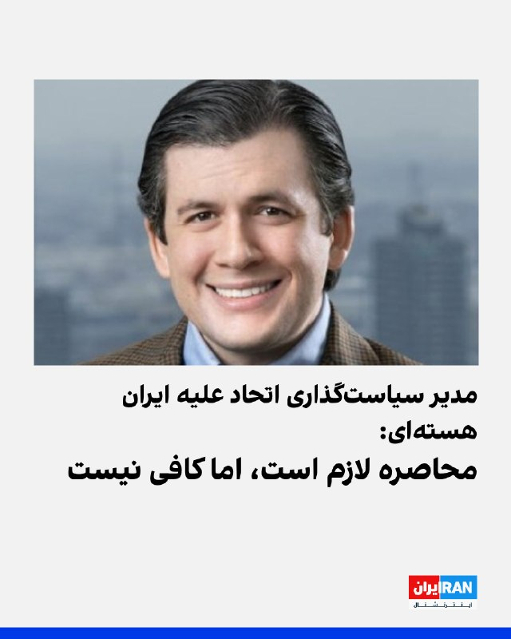

جیسون برادسکی، مدیر سیاست‌گذاری اتحاد علیه ایران هسته‌ای، در مورد تماس تلفنی دونالد ترامپ و بنیامین نتانیاهو در مورد پاسخ جمهوری اسلامی نوشت: «تغییر وضع موجود ضروری است. محاصره لازم است، اما کافی نیست.»

او در شبکه اجتماعی ایکس تاکید کرد ترکیب محاصره با اقدام نظامی مهم خواهد بود.

برادسکی همچنین اشاره کرد: «برخلاف تصوری که رسانه‌ها و برخی مفسران ایجاد کرده‌اند، رییس‌جمهور همچنان نشان می‌دهد که به هیچ توافقی با رژیم ایران، صرف نظر از شرایط، مشتاق نیست. اگر او واقعا برای هر توافقی مشتاق بود، مدت‌ها پیش توافقی حاصل شده بود.»
https://iranintl.com/202605105974

## iranintltv — post 336546

  <a href="telegram/content/iranintltv_336546_1778455867.mp4" target="_blank">🎬 Download video</a>

مراد ویسی، تحلیل‌گر ارشد ایران‌اینترنشنال، گفت: «سفر ترامپ به پکن می‌تواند پیام هشدار جدی‌تری برای تهران داشته باشد. به‌ویژه با توجه به تهدید دوباره ترامپ به بمباران شدیدتر در صورت عدم توافق. اعلام مذاکره ترامپ و شی جین‌ پینگ درباره جمهوری اسلامی، احتمال شکل‌گیری معامله و بده‌بستان میان واشینگتن و پکن بر سر پرونده ایران را پررنگ‌تر کرده است.»
@iranintltv

## iranintltv — post 336545

  <a href="telegram/content/iranintltv_336545_1778455869.mp4" target="_blank">🎬 Download video</a>

دونالد ترامپ پاسخ جمهوری اسلامی به پیشنهاد آمریکا را غیرقابل قبول دانست.

او پیش‌تر گفته بود جمهوری اسلامی ۴۷ سال با آمریکا و جهان بازی کرده و با تاخیر، زمان خریده است، اما این اتفاق دیگر نخواهد افتاد.

گفت‌وگو با شایان سمیعی، کارشناس امنیت ملی
@iranintltv

---
📅 بروزرسانی: 1405/02/21 02:00
---

## iranintltv — post 336544

  <a href="https://t.me/IranintlTV/336544" target="_blank">📎 Download file</a>

🎧نسخه صوتی سیاست با مراد ویسی: دست رد ترامپ بر پیشنهاد جمهوری‌اسلامی
@iranintlTV

## iranintltv — post 336543

  <a href="telegram/content/iranintltv_336543_1778452235.mp4" target="_blank">🎬 Download video</a>

دونالد ترامپ از دریافت پاسخ تهران به طرح پیشنهادی ایالات متحده خبر داد و آن را غیرقابل قبول خواند.

این اظهارات ترامپ با واکنش‌های گسترده‌ای در شبکه‌های اجتماعی و رسانه‌ها همراه شده است.

جزییات بیشتر در گزارش امیر گیتی، عضو تحریریه ایران‌اینترنشنال
@iranintltv

## iranintltv — post 336542

  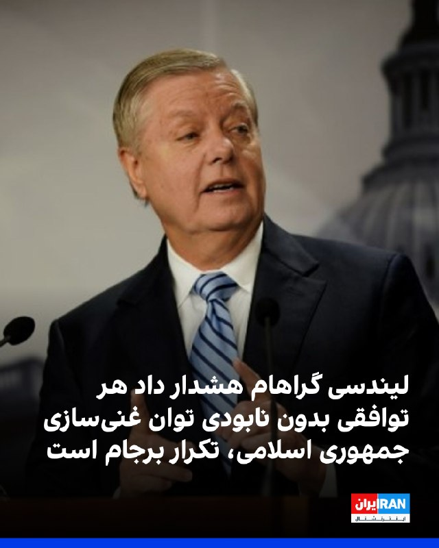

سناتور لیندزی گراهام در واکنش به گمانه‌زنی‌ها درباره توافق احتمالی با ایران، در حساب کاربری خود در شبکه ایکس نوشت این ایده که جمهوری اسلامی در چارچوب یک توافق مذاکره‌شده، تأسیسات غنی‌سازی خود را به‌طور کامل برچیند، منطقی نیست.

او تأکید کرد تعلیق موقت غنی‌سازی بدون نابودی کامل زیرساخت‌ها و توانمندی‌ها، عملاً بازگشت به توافق برجام خواهد بود.

گراهام افزود هرگونه مخالفت تهران با برچیدن کامل ظرفیت غنی‌سازی از سوی آمریکا «قاطعانه رد خواهد شد». او در بخش دیگری از پیام خود از حمایت دونالد ترامپ قدردانی کرد و آن را برای خود «بسیار ارزشمند» خواند.

گراهام گفت به اعتماد ترامپ، چه به‌عنوان سناتور و چه به‌عنوان دوست، افتخار می‌کند و از همراهی با او در آنچه «بزرگ‌ترین بازگشت سیاسی در تاریخ آمریکا» توصیف کرد، ابراز خرسندی کرد.

وی همچنین تأکید کرد در سنای آمریکا برای پیشبرد دستورکار ترامپ جهت «امن‌تر و ثروتمندتر کردن آمریکا» تلاش خواهد کرد.
https://iranintl.com/202605106523

## iranintltv — post 336541

  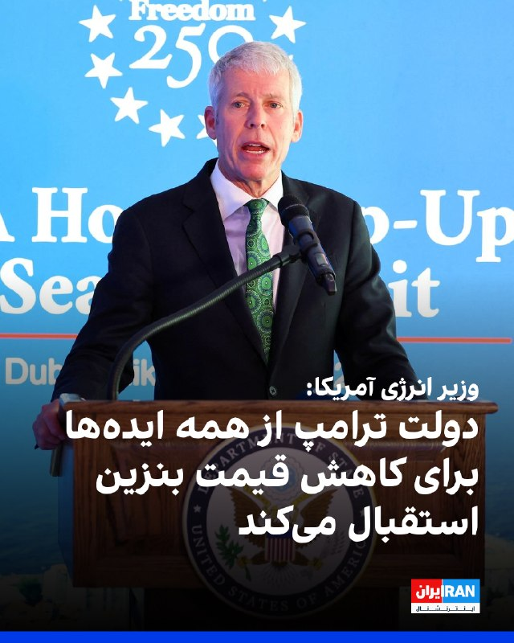

کریس رایت، وزیر انرژی آمریکا، در گفت‌وگو با شبکه ان‌بی‌سی اعلام کرد دولت دونالد ترامپ از «همه ایده‌ها» برای کاهش قیمت بنزین استقبال می‌کند؛ از جمله تعلیق مالیات فدرال بر سوخت.

این اظهارات در شرایطی مطرح شده که قیمت بنزین در آمریکا افزایش یافته و میانگین ملی آن روز یکشنبه به ۴.۵۲ دلار در هر گالن رسیده است.

به گزارش ان‌بی‌سی، این رقم نشان می‌دهد بهای بنزین از زمان آغاز جنگ ایران در نهم اسفند بیش از ۵۰ درصد رشد کرده است.

رایت در پاسخ به پرسشی درباره تعلیق مالیات فدرال بنزین، که حدود ۱۸ سنت در هر گالن است، گفت دولت از هر اقدامی که بتواند قیمت‌ها را در جایگاه‌های سوخت کاهش دهد و فشار بر مصرف‌کنندگان را کم کند، حمایت می‌کند.

او همچنین درباره احتمال رسیدن قیمت‌ها به ۵ دلار در هر گالن از پیش‌بینی خودداری کرد و گفت تعیین قیمت انرژی در کوتاه‌مدت یا میان‌مدت دشوار است.

رایت افزود تمرکز دولت بر پایان دادن به درگیری چند دهه‌ای با جمهوری اسلامی است.
https://iranintl.com/202605106125

## iranintltv — post 336540

  <a href="telegram/content/iranintltv_336540_1778452240.mp4" target="_blank">🎬 Download video</a>

مراد ویسی، تحلیل‌گر ارشد ایران‌اینترنشنال، گفت: «سخنان تند ترامپ، درست در روزی که جمهوری اسلامی پاسخ خود را به پیشنهاد آمریکا تحویل داده، می‌تواند نشانه نارضایتی واشینگتن از محتوای این پاسخ باشد. استفاده ترامپ از عباراتی مثل سال‌ها ما را بازی دادند و دیگر اجازه نمی‌دهیم به ما بخندند نشان می‌دهد صبر آمریکا نسبت به روند فعلی به شدت کاهش پیدا کرده است.»
@iranintltv

---
📅 بروزرسانی: 1405/02/21 01:13
---

## iranintltv — post 336539

  

فاطمه سپهری، زندانی سیاسی محبوس در زندان وکیل‌آباد مشهد، در حالی دوران حبس خود را سپری می‌کند که به گفته فعالان حقوق بشر با مشکلات جدی جسمی روبه‌رو است.
این فعال سیاسی ۶۱ ساله که سابقه جراحی قلب باز دارد، بیش از هزار روز است در زندان به‌سر می‌برد و گزارش‌ها حاکی از آن است که در این مدت دسترسی کافی و مستمر به خدمات درمانی تخصصی نداشته است.
منابع حقوق بشری از افت شدید فشار خون، تپش‌های نامنظم قلب و دردهای مزمن در ناحیه قفسه سینه و دست‌های او خبر داده‌اند.
گفته می‌شود خانم سپهری پس از چند مورد بستری کوتاه‌مدت، پیش از تکمیل روند درمان به بند بازگردانده شده است.
فاطمه سپهری نخستین‌بار در سال ۱۳۹۸ پس از امضای بیانیه‌ای موسوم به «بیانیه ۱۴ نفر» بازداشت شد. او در جریان اعتراضات سراسری سال ۱۴۰۱ دوباره بازداشت و از سوی دادگاه انقلاب مشهد به ۱۸ سال حبس محکوم شد.
در روزهای اخیر کاربران شبکه‌های اجتماعی با یک طرح گرافیکی «صدای فاطمه سپهری باش» خواستار رسیدگی فوری پزشکی و آزادی او شده‌اند.
https://iranintl.com/202605103770

## iranintltv — post 336538

  <a href="telegram/content/iranintltv_336538_1778449413.mp4" target="_blank">🎬 Download video</a>

دونالد ترامپ در تروث سوشال نوشت پاسخ نمایندگان جمهوری اسلامی را خوانده و آن را «کاملا غیرقابل قبول» می‌داند.

ترامپ پیش‌تر تاکید کرده بود واشینگتن نباید اجازه دهد ایران به سلاح هسته‌ای دست پیدا کند و آمریکا در صورت نیاز، به اهداف دیگری در ایران حمله خواهد کرد.

گفت‌وگو با کامیار بهرنگ، عضو تحریریه ایران‌اینترنشنال
@iranintltv

## iranintltv — post 336537

  <a href="telegram/content/iranintltv_336537_1778449415.mp4" target="_blank">🎬 Download video</a>

مراد ویسی، تحلیل‌گر ارشد ایران‌اینترنشنال، گفت: «خشم ترامپ از طولانی شدن مذاکرات با جمهوری اسلامی در سخنان یکشنبه‌اش آشکار بود؛ او گفت جمهوری اسلامی ۴۷ سال آمریکا و جهان را بازی داده است. حالا که ترامپ پاسخ جمهوری اسلامی را غیرقابل قبول خوانده، همه منتظرند ببینند مسیر بعدی واشینگتن تلاش دوباره برای توافق است یا آغاز حملات نظامی.»
@iranintltv

## iranintltv — post 336536

  <a href="telegram/content/iranintltv_336536_1778449416.mp4" target="_blank">🎬 Download video</a>

ویدیوهای دریافت‌شده نشان می‌دهد جمعی از ایرانیان مقیم اورلاندو در ایالت فلوریدا، روز یک‌شنبه ۲۰ اردیبهشت‌ماه، در پی فراخوان شاهزاده رضا پهلوی، در اعتراض به اعدام‌های جمهوری اسلامی و قطع اینترنت در ایران تجمع کردند و خطاب به دونالد ترامپ شعار «اعتماد نکنید، معامله نکنید» سر دادند.

## iranintltv — post 336535

  <a href="telegram/content/iranintltv_336535_1778449418.mp4" target="_blank">🎬 Download video</a>

همزمان با تشدید فضای امنیتی در ایران، مقام‌های حکومتی بار دیگر بر برخورد با پوشش اختیاری زنان تاکید کرده‌اند.
یکی از طراحان قانون عفاف و حجاب مدعی شد موساد ساعتی سه دلار به زنان ایران می‌دهد تا با «تاپ و شلوار» در میدان ولیعصر قدم بزنند.

گفت‌وگو با پگاه بنی‌هاشمی، پژوهشگر حقوق
@iranintltv

## iranintltv — post 336534

  <a href="telegram/content/iranintltv_336534_1778449419.mp4" target="_blank">🎬 Download video</a>

دونالد ترامپ پاسخ جمهوری اسلامی به پیشنهاد آمریکا را رد و آن را غیرقابل قبول توصیف کرد.

او ساعاتی پیش نیز گفته بود اورانیوم غنی‌شده و برنامه هسته‌ای جمهوری اسلامی تحت نظر است و ایالات متحده در نهایت به آن دست پیدا خواهد کرد.

گزارش مرضیه حسینی، خبرنگار ایران‌اینترنشنال
@iranintltv

## iranintltv — post 336533

  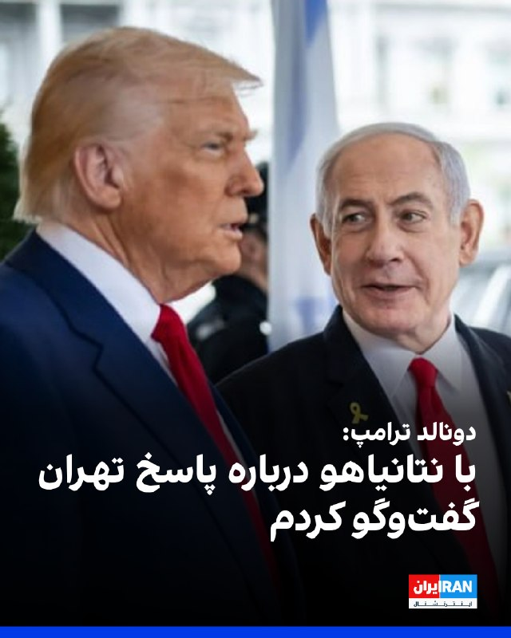

دونالد ترامپ روز یک‌شنبه به اکسیوس گفت پاسخ تهران به آخرین پیش‌نویس توافق برای پایان دادن به جنگ را رد خواهد کرد.

او افزود با بنیامین نتانیاهو درباره پاسخ جمهوری اسلامی و موضوعات دیگر گفت‌وگو کرده است.ترامپ گفت: «تماس بسیار خوبی بود. ما رابطه خوبی داریم، اما این وضعیت من است، نه دیگران.» 

رییس‌جمهور آمریکا همچنین در شبکه تروث سوشال نوشت: پاسخ نمایندگان جمهوری اسلامی را خواندم. از آن خوشم نیامد و کاملا غیرقابل قبول است.
https://iranintl.com/202605101324

---
📅 بروزرسانی: 1405/02/21 00:21
---

## iranintltv — post 336532

  

دونالد ترامپ شامگاه یک‌شنبه در شبکه اجتماعی تروث سوشال در واکنش به پاسخ تهران نوشت: همین حالا پاسخ نمایندگان جمهوری اسلامی را خواندم. از آن خوشم نیامد و کاملا غیرقابل قبول است.
https://iranintl.com/202605103941

## iranintltv — post 336531

  

العربیه به نقل از منابع آگاه گزارش داد که پاسخ جمهوری اسلامی به آمریکا، سرنوشت اورانیوم غنی‌شده در ایران را به موفقیت مذاکرات گره زده و در صورت موفقیت مذاکرات میان تهران و واشینگتن، اورانیوم غنی‌شده از ایران منتقل خواهد شد.

بر اساس این گزارش، «معضل اورانیوم غنی‌شده ایران شاهد گام‌هایی برای حل‌وفصل آن بوده است.»

منابع آگاه العربیه گفتند که «هیچ صحبتی درباره برچیدن تاسیسات هسته‌ای در ایران مطرح نیست، اما این تاسیسات تحت نظارت آژانس بین‌المللی انرژی اتمی قرار خواهند گرفت.»

منابع العربیه ادامه دادند که احتمال انتقال اورانیوم ایران به کشوری غیر از آمریکا با درصد بالایی مطرح است اما انتقال اورانیوم غنی‌شده ایران به خارج از کشور، به زمان و اقدامات لازم برای اعتمادسازی نیاز دارد.

منابع العربیه افزودند که هنوز هیچ پاسخی از سوی آمریکا به میانجی پاکستانی تحویل داده نشده است.

پس از انتشار گزارش العربیه، تسنیم خبرگزاری وابسته به سپاه به نقل از یک منبع مطلع نوشت: «گزارش‌ها درباره متن پیشنهادی جمهوری اسلامی در مذاکرات با آمریکا در بخش‌های مهمی با واقعیت منطبق نیست و ادعاهای مطرح‌شده درباره مواد هسته‌ای واقعیت ندارد.»

## iranintltv — post 336530

  <a href="https://t.me/IranintlTV/336530" target="_blank">📎 Download file</a>

🎧نسخه صوتی چشم‌انداز: جنون نظامی تازه سپاه و مجتبی در خلیج فارس
@iranintlTV

## iranintltv — post 336529

  

رسانه‌های ایران شامگاه یک‌شنبه با اشاره به شنیده شدن فعالیت پدافند هوایی در اندیمشک و شمال دزفول از سرنگونی «پرنده متخاصم دشمن» در اندیمشک خبر دادند.

شهروندان نیز یک‌شنبه ساعت حدود ۱۰ شب از شنیده‌شدن صدای پدافند در این شهر خبر دادند.
https://iranintl.com/202605100082

## iranintltv — post 336528

  <a href="telegram/content/iranintltv_336528_1778446316.mp4" target="_blank">🎬 Download video</a>

در پاسخ به فراخوان شاهزاده رضا پهلوی برای پیوستن به کارزار «یک ملت در گروگان»، گروهی از ایرانیان مقیم کانادا در تورنتو تجمع کردند.

گزارش مهسا مرتضوی، خبرنگار ایران‌اینترنشنال
@iranintltv

---
📅 بروزرسانی: 1405/02/20 23:28
---

## iranintltv — post 336527

  <a href="telegram/content/iranintltv_336527_1778443090.mp4" target="_blank">🎬 Download video</a>

در پی فراخوان شاهزاده رضا پهلوی برای اعتراض به خاموشی سراسری اینترنت در ایران، بازداشت‌های گسترده و اعدام بی‌وقفه، گروهی از ایرانیان در برابر کاخ سفید در واشینگتن تجمع کردند.

گزارش اردوان روزبه، خبرنگار ایران‌اینترنشنال
@iranintltv

## iranintltv — post 336526

  <a href="telegram/content/iranintltv_336526_1778443091.mp4" target="_blank">🎬 Download video</a>

ایرنا گزارش داد پاسخ جمهوری اسلامی به آخرین متن پیشنهادی آمریکا برای پایان جنگ به میانجی پاکستانی تحویل داده شده است.

همزمان دونالد ترامپ گفت اهداف دیگری نیز در ایران وجود دارد که ممکن است مورد حمله قرار بگیرند.

گفت‌وگو با شایان سمیعی، کارشناس امنیت ملی
@iranintltv

## iranintltv — post 336525

  

نارندرا مودی، نخست‌وزیر هند، یکشنبه از شهروندان این کشور خواست مجموعه‌ای از اقدامات از جمله صرفه‌جویی در مصرف سوخت، دورکاری و محدودیت در سفر و واردات را رعایت کنند، زیرا افزایش شدید قیمت جهانی انرژی فشار زیادی بر ذخایر ارزی این کشور وارد کرده است.

مودی گفت مردم باید اولویت را به بازگشت به دورکاری و جلسات آنلاین بدهند؛ رویکردی که در دوران همه‌گیری کووید-۱۹ به‌طور گسترده اتخاذ شده بود، و افزود این کار به هند کمک می‌کند سوخت کمتری مصرف کند.

او گفت: «در وضعیت کنونی، ما باید تاکید زیادی بر صرفه‌جویی در ارز خارجی داشته باشیم.»

مودی همچنین از مردم خواست از وسایل حمل‌ونقل عمومی مانند مترو استفاده کنند و در صورت امکان برای صرفه‌جویی در سوخت، به طور مشترک از خودروها استفاده کنند.

هند، سومین واردکننده و مصرف‌کننده بزرگ نفت در جهان، اواخر ماه گذشته اعلام کرد که هیچ برنامه‌ای برای افزایش قیمت گازوئیل و بنزین در جایگاه‌ها ندارد و با وجود افزایش جهانی قیمت‌ها، در میان کشورهایی باقی مانده که هنوز قیمت‌ها را افزایش نداده‌اند.

https://iranintl.com/202605107871

## iranintltv — post 336524

  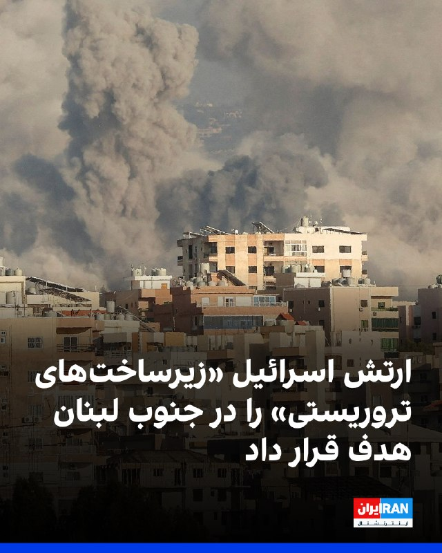

به گزارش جروزالم پست، ارتش اسرائیل یکشنبه بیش از ۲۰ هدف زیرساختی «مرتبط با تروریسم» را در سراسر جنوب لبنان هدف قرار داد.

بر اساس اعلام ارتش اسرائیل، این اهداف شامل انبارهای تسلیحات، مقرها و سازه‌های نظامی‌ای بود که «تروریست‌های حزب‌الله از آنها عملیات انجام می‌دادند».
https://iranintl.com/202605105180

## iranintltv — post 336523

  <a href="telegram/content/iranintltv_336523_1778443094.mp4" target="_blank">🎬 Download video</a>

چشم‌انداز با مهدی مهدوی‌آزاد: جنون نظامی تازه سپاه و مجتبی در خلیج فارس

نسخه کامل این قسمت را در یوتیوب ایران‌اینترنشنال تماشا کنید:

https://youtu.be/kYSw-f3E0vk
@iranintltv

## iranintltv — post 336522

  <a href="https://t.me/IranintlTV/336522" target="_blank">📎 Download file</a>

🎧نسخه صوتی تیتراول با نیوشا صارمی: تاکید همزمان نتانیاهو و ترامپ به تمام نشدن جنگ ایران و احتمال ادامه حملات
@iranintlTV

---
📅 بروزرسانی: 1405/02/20 22:25
---

## iranintltv — post 336521

  

سخنگوی کاخ سفید اعلام کرد که دونالد ترامپ شامگاه چهارشنبه وارد پکن می‌شود.

همزمان رویترز به نقل از یک مقام ارشد آمریکایی نوشت دونالد ترامپ و شی جین‌پینگ رهبران آمریکا و چین، در دیدار پیش‌روی خود، احتمالا درباره «حمایت چین از ایران و روسیه» گفت‌وگو خواهند کرد.
https://iranintl.com/202605100945

## iranintltv — post 336520

  <a href="telegram/content/iranintltv_336520_1778439358.mp4" target="_blank">🎬 Download video</a>

مهدی مهدوی‌آزاد در برنامه «چشم‌انداز» گفت: «یک جریان جنگ‌طلب دیوانه در حال پیش بردن مسیری است که هیچ نسبتی با واقعیت ندارد. در عمل، بخش بزرگی از توان و ساختارشان نابود شده، اما همچنان ادعای پیروزی و قدرت می‌کنند.»

او افزود: «به نظر می‌رسد در دل همان جریانی که پس از جنگ، مجتبی خامنه‌ای را در موقعیت قدرت قرار داد، گروهی تندروتر در حال قدرت گرفتن است؛ جریانی که جنگ را می‌خواهد طولانی‌تر کند و به‌دنبال نوعی "کودتا در کودتا" است.»
@iranintltv

## iranintltv — post 336519

  

مصطفی نیلی، وکیل نرگس محمدی، برنده جایزه صلح نوبل و زندانی سیاسی، در ایکس نوشت: «امروز خانم نرگس محمدی با صدور دستور توقف حکم برای انجام درمان از بیمارستان زنجان خارج و با آمبولانس به بیمارستان پارس تهران منتقل و بستری شدند.»

او افزود: «صدور این دستور در پی نظر پزشکی قانونی مبنی بر لزوم پیگیری درمان خارج از زندان و زیر نظر تیم پزشکان ایشان به دلیل بیماری‌های متعدد است.»

پیشتر بنیاد نرگس محمدی اعلام کرد با وجود اعلام پزشکی قانونی استان زنجان درباره ضرورت تعلیق یک‌ماهه اجرای حکم محمدی برای درمان، مقام‌های قضایی از انتقال این فعال حقوق بشر و برنده جایزه صلح نوبل به بیمارستان جلوگیری می‌کنند و خانواده او وضعیتش را مرگ و زندگی توصیف کردند.
https://iranintl.com/202605100410

## iranintltv — post 336518

  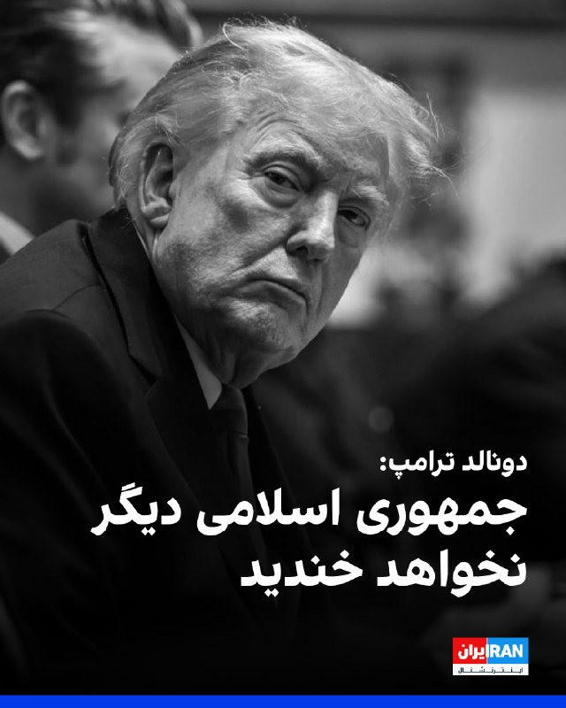

دونالد ترامپ در شبکه تروث سوشال نوشت جمهوری اسلامی ۴۷ سال با آمریکا و جهان بازی کرده و با تاخیر زمان خریده است و این روند با ریاست‌جمهوری باراک حسین اوباما به نتیجه رسید. او نوشت اوباما عملا در کنار جمهوری اسلامی ایستاد، اسرائیل و دیگر متحدان را کنار گذاشت و جان تازه‌ای به تهران داد.
ترامپ نوشت صدها میلیارد دلار و ۱.۷ میلیارد دلار پول نقد با هواپیما به تهران منتقل شد و بانک‌های واشینگتن دی سی، ویرجینیا و مریلند خالی شد. پول‌ها در چمدان‌ها منتقل شد و مقام‌های جمهوری اسلامی از حجم آن شگفت‌زده شدند.
او اوباما را رییس‌جمهوری ضعیف خواند و افزود جمهوری اسلامی طی ۴۷ سال با بمب‌های کنار جاده‌ای آمریکایی‌ها را کشته، اعتراضات را سرکوب کرده و اخیرا ۴۲ هزار معترض بی‌سلاح را از بین برده است. او نوشت جمهوری اسلامی به کشور ما که حالا دوباره عظمت یافته می‌خندد اما آن‌ها دیگر نخواهند خندید.
https://iranintl.com/202605105882

## iranintltv — post 336517

  <a href="telegram/content/iranintltv_336517_1778439362.mp4" target="_blank">🎬 Download video</a>

رسانه‌های ایران خبر دادند پس از مسعود پزشکیان، فرمانده قرارگاه مرکزی خاتم‌الانبیا نیز با مجتبی خامنه‌ای دیدار کرده است.

همزمان وال‌استریت ژورنال گزارش داد جناح‌های تندرو که از روند مذاکرات با آمریکا ناراضی‌اند، خواستار اعلام موضع مستقیم رهبر جمهوری اسلامی هستند.

گفت‌وگو با جابر رجبی، تحلیل‌گر سیاسی
@iranintltv

## iranintltv — post 336516

  

دونالد ترامپ در شبکه تروث سوشال نوشت جمهوری اسلامی ۴۷ سال است با آمریکا و جهان بازی می‌کند. برای ۴۷ سال آن‌ها ما را معطل نگه داشته‌اند و مردم ما را با بمب‌های کنار جاده‌ای کشته‌اند.
او افزود: در اعتراضات اخیر ایران ۴۲ هزار معترض بی‌گناه و غیرمسلح کشته شده‌اند و جمهوری اسلامی به آمریکا که دوباره قدرتمند شده می‌خندد، اما دیگر نخواهند خندید.
https://iranintl.com/202605100236

## iranintltv — post 336515

  <a href="telegram/content/iranintltv_336515_1778439366.mp4" target="_blank">🎬 Download video</a>

بنیامین نتانیاهو گفت جنگ با ایران تا زمان خارج شدن اورانیوم با غنای بالا و برچیده شدن تاسیسات غنی‌سازی پایان نخواهد یافت.

همزمان جمهوری اسلامی اعلام کرد پاسخ آخرین طرح پیشنهادی آمریکا برای پایان جنگ را به میانجی پاکستانی تحویل داده است.

گفت‌وگو با مسعود کاظمی، روزنامه‌نگار و مرضیه حسینی و اشکان صفایی، خبرنگاران ایران‌اینترنشنال
@iranintltv

## iranintltv — post 336514

  

امانوئل مکرون، رییس‌جمهوری فرانسه، در واکنش به هشدار تهران علیه ناوهای جنگی فرانسه و بریتانیا گفت: «هیچ مساله‌ای درباره استقرار [این ناوها] مطرح نیست.»

او درباره تنگه هرمز افزود: «آماده‌ایم به ماموریت بین‌المللی کمک کنیم.»

پیش‌تر کاظم غریب‌آبادی، معاون وزیر امور خارجه جمهوری اسلامی، در پیامی در شبکه اجتماعی ایکس با انتقاد از اعزام ناوهای نظامی فرانسه و بریتانیا به منطقه گفت تامین امنیت تنگه هرمز صرفا در اختیار جمهوری اسلامی است.

او افزود که تنگه هرمز «ملک مشاع قدرت‌های فرامنطقه‌ای» نیست و هرگونه حضور نظامی برای همراهی با «اقدامات آمریکا» در این آبراه با «پاسخ قاطع و فوری» روبه‌رو خواهد شد.
https://iranintl.com/202605105633

---
📅 بروزرسانی: 1405/02/20 21:23
---

هیچ پیام جدیدی در این بروزرسانی ارسال نشد.

---
📅 بروزرسانی: 1405/02/20 21:16
---

## iranintltv — post 336513

  

پادشاهی بحرین اعلام کرد که ادامه حملات «آشکار و گستاخانه» جمهوری اسلامی علیه امارات متحده عربی را به‌شدت محکوم می‌کند.

پیش‌تر نیز دبیرکل شورای همکاری خلیج‌فارس حملات جمهوری اسلامی به امارات متحده عربی و کویت را محکوم کرد و گفت که این اقدامات را «تجاوزکارانه و غیرقابل قبول» می‌داند.
https://iranintl.com/202605102416

## iranintltv — post 336512

  

عبدالرضا رحمانی فضلی، سفیر جمهوری اسلامی در چین، گفت: هر توافق احتمالی باید با ضمانت قدرت‌های بزرگ همراه باشد و افزود پکن می‌تواند نقش ضامن هرگونه توافق را بر عهده گیرد.

او افزود: این توافق باید در شورای امنیت سازمان ملل نیز مطرح و تثبیت شود.
https://iranintl.com/202605104885

## iranintltv — post 336511

  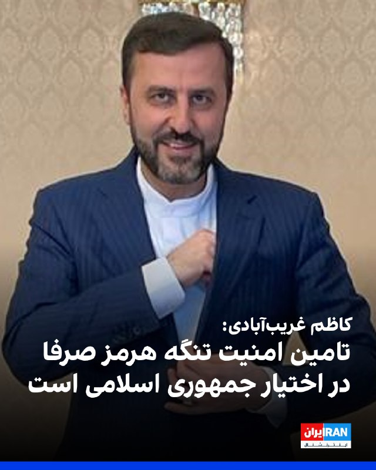

کاظم غریب‌آبادی، معاون وزیر خارجه جمهوری اسلامی، در پیامی در شبکه اجتماعی ایکس با انتقاد از اعزام ناوهای نظامی فرانسه و بریتانیا به منطقه گفت تامین امنیت تنگه هرمز صرفا در اختیار جمهوری اسلامی است.

او افزود که تنگه هرمز «ملک مشاع قدرت‌های فرامنطقه‌ای» نیست و هرگونه حضور نظامی برای همراهی با «اقدامات آمریکا» در این آبراه با «پاسخ قاطع و فوری» روبه‌رو خواهد شد.
https://iranintl.com/202605108605

## iranintltv — post 336510

  <a href="telegram/content/iranintltv_336510_1778435211.mp4" target="_blank">🎬 Download video</a>

ویدیوهای رسیده نشان می‌دهند یکشنبه ۲۰ اردیبهشت ایرانیان مقیم شهرهای بارسلون در اسپانیا، کپنهاگ دانمارک و لاهه در هلند علیه جمهوری اسلامی تجمع کردند.

## iranintltv — post 336509

  

احمد مرادی، عضو کمیسیون انرژی مجلس گفت: کشورهای منطقه نباید «فریب» دونالد ترامپ و بنیامین نتانیاهو را بخورند و برای دستیابی به آرامش باید با تهران هماهنگ باشند و قدرت جمهوری اسلامی را درک کنند.

او افزود: تنگه هرمز دیگر به وضعیت گذشته بازنخواهد گشت و جمهوری اسلامی بر حفظ این موقعیت راهبردی تاکید دارد.
https://iranintl.com/202605101132

---
📅 بروزرسانی: 1405/02/20 20:20
---

## iranintltv — post 336508

🔻«از هستی ساقط شده‌ایم»؛ شهروندان از پیامدهای بیش از ۷۰ روز خاموشی اینترنت می‌گویند

بیش از ۷۰ روز است که میلیون‌ها نفر در ایران با محدودیت و قطعی گسترده اینترنت دست‌وپنجه نرم می‌کنند؛ شرایطی که به گفته بسیاری از شهروندان، زندگی، کار، درمان و آرامش روانی آنها را مختل کرده است.
با این حال آنچه در بسیاری از رسانه‌های بین‌المللی درباره ایران بازتاب پیدا می‌کند، عمدتا اظهارات مقام‌های جمهوری اسلامی است و نه روایت مردمی که در این روزها زیر فشار بی‌سابقه محدودیت‌های اینترنتی زندگی می‌کنند.

«از جنگ ۱۲ روزه تا امروز، کسب‌وکارم عملا نابود شده»

حسین، ۳۳ ساله و مدرس موسیقی که پیش از این بخش مهمی از کلاس‌هایش را آنلاین برگزار می‌کرد، می‌گوید از زمان آغاز جنگ ۱۲ روزه تا امروز، شغلش در عمل متوقف و درآمدش قطع شده است.
او توضیح می‌دهد: «شاگردهای من داخل و خارج ایران هستند اما به خاطر قطعی و اختلال اینترنت، دیگر نمی‌توانند در کلاس‌ها شرکت کنند. درآمدم تقریبا صفر شده.»
حسین با اشاره به فشار اقتصادی ناشی از این وضعیت می‌گوید: «جمهوری اسلامی که دلش برای ما نسوخته، دنیا هم انگار اصلا اهمیتی نمی‌دهد ما در چه باتلاقی دست‌وپا می‌زنیم.»
همسر او، محدثه، از طریق اینستاگرام شیرینی و رب خانگی می‌فروخته و حالا کسب‌وکارش به‌کل متوقف شده است.
او می‌گوید: «چهار سال تلاش کردیم با همه سختی‌ها زندگی‌مان را جلو ببریم اما این ۷۰ روز ما را از هستی ساقط کرد. پس‌اندازی را که برای خرید خانه کنار گذاشته بودیم، خرج کردیم و حالا مانده‌ایم اجاره و هزینه‌های زندگی را چطور پرداخت کنیم.»

اینترنت؛ کالایی طبقاتی

شهلا، ۵۶ ساله، مادر پسری دارای اوتیسم است. او می‌گوید بازی آنلاین، تنها فضای امن و آرامش‌بخش برای فرزندش بود، اما در این هفته‌ها، نبود اینترنت شرایط خانه را بحرانی کرده است: «پسرم دیگر امکان بازی ندارد، پر از استرس و خشونت شده و مدام با ما درگیر می‌شود.»
او با انتقاد از محدود شدن اینترنت می‌گوید: «واقعا کسانی که اینترنت را طبقاتی کرده‌اند، می‌فهمند خانواده‌ها چه فشاری را تحمل می‌کنند؟ اینترنت گیگی ۵۰۰ تا ۶۰۰ هزار تومان است؛ از کجا باید بیاورم؟»
شهلا می‌گوید سال‌ها تلاش کرده با کمک مشاوران و برنامه‌های درمانی، زندگی آرام‌تری برای فرزندش فراهم کند؛ اما این ۷۰ روز را «جهنم واقعی» توصیف می‌کند.

«۷۰ روز است نوه‌هایم را ندیده‌ام»

مژده، ۷۰ ساله، می‌گوید برای گرفتن وقت پزشک و دریافت نتایج آزمایش به او گفته‌اند اپلیکیشن «بله» را نصب کند؛ موضوعی که باعث نگرانی او شده است: «برای ثبت یک وقت دکتر باید اپلیکیشنی نصب کنم که بارها درباره امنیتش هشدار داده شده.»
فرزندان و نوه‌های مژده خارج از ایران زندگی می‌کنند. او می‌گوید پیش از این هر روز از طریق تماس تصویری نوه‌هایش را می‌دیده اما حالا بیش از ۷۰ روز است که تنها تماس‌های کوتاه تلفنی برایش باقی مانده است.
«من بازنشسته‌ام و توان خرید اینترنت طبقاتی را ندارم. اصلا چرا باید چنین شرایطی به مردم تحمیل شود و هیچ واکنش جدی‌ای هم وجود نداشته باشد؟»
او در ادامه می‌گوید: «همه‌چیز خلاصه شده در انرژی هسته‌ای، در حالی‌ که ادامه این وضعیت برای مردم فقط ضرر است. اگر کشور دیگری ۷۰ روز اینترنت را قطع می‌کرد، هر روز بازداشت و اعدام می‌کرد، حتما واکنش جهانی متفاوتی می‌دید.»

🔗جزئیات بیشتر را اینجا بخوانید.

@iranintltv

## iranintltv — post 336507

  

ابوالفضل اقبالی، از طراحان «قانون عفاف و حجاب»، در تلویزیون جمهوری اسلامی گفت: «اتاق فرمان دشمن، موساد است. همان‌جایی حمله نظامی را تصویب می‌کند، تحریم اقتصادی را سازمان می‌دهد و زیرساخت را می‌زند. همان‌جا هم ساعتی ۳ دلار پول می‌دهد می‌گوید برو میدان ولیعصر با تاپ و شلوار قدم بزن.»

او گفت: «جنگ با جمهوری اسلامی ابعاد مختلف دارد. همان کس که حلقه‌های آشوب سازماندهی کرده، ارز دیجیتال توزیع می‌کند تا یک عده بیایند وضعیت اباحه‌گری را سامان بدهند.»
https://iranintl.com/202605104362

## iranintltv — post 336506

  <a href="telegram/content/iranintltv_336506_1778431809.mp4" target="_blank">🎬 Download video</a>

بر اساس ویدیوهای رسیده به ایران‌اینترنشنال، گروهی از ایرانیان مقیم بریتانیا، یکشنبه ۲۰ اردیبهشت در اعتراض به اعدام‌های جمهوری اسلامی، در بیرمنگام تجمع کردند.

## iranintltv — post 336505

  <a href="https://t.me/IranintlTV/336505" target="_blank">📎 Download file</a>

🎧نسخه صوتی اخبار شبانگاهی | یکشنبه ۲۰ اردیبهشت
@iranintlTV

## iranintltv — post 336504

  <a href="telegram/content/iranintltv_336504_1778431812.mp4" target="_blank">🎬 Download video</a>

تیتر اول با نیوشا صارمی، یکشنبه ۲۰ اردیبهشت
@iranintltv

---
📅 بروزرسانی: 1405/02/20 20:00
---

## iranintltv — post 336503

  <a href="telegram/content/iranintltv_336503_1778430627.mp4" target="_blank">🎬 Download video</a>

ویدیوهای رسیده نشان می‌دهند یکشنبه ۲۰ اردیبهشت ایرانیان مقیم شهرهای مونیخ در آلمان، وین اتریش و آرهوس دانمارک علیه جمهوری اسلامی تجمع کردند.

## iranintltv — post 336502

  <a href="telegram/content/iranintltv_336502_1778430630.mp4" target="_blank">🎬 Download video</a>

کی‌یر استارمر، نخست‌وزیر بریتانیا، پس از نتایج ضعیف حزب کارگر در انتخابات گفت پیام رای‌دهندگان را شنیده، اما تاکید کرد کنار نخواهد رفت. با این حال، فشارها در درون حزب افزایش یافته است و دست‌کم ۲۱ نماینده حزب کارگر خواستار کناره‌گیری او شده‌اند.

گفت‌وگو با تاج‌الدین سروش، خبرنگار ایران‌اینترنشنال
@iranintltv

## iranintltv — post 336501

  <a href="telegram/content/iranintltv_336501_1778430631.mp4" target="_blank">🎬 Download video</a>

ویدیوهای رسیده به ایران اینترنشنال نشان می‌دهد ایرانیان مقیم پاریس روز ۲۰ اردیبهشت‌ماه در پاسخ به فراخوان شاهزاده رضا پهلوی، با برگزاری راهپیمایی و تجمع در این شهر حضور یافتند.
@iranintltv

## iranintltv — post 336500

  <a href="telegram/content/iranintltv_336500_1778430633.mp4" target="_blank">🎬 Download video</a>

بر اساس ویدیوهای رسیده به ایران‌اینترنشنال، ایرانیان ساکن هلند و جمهوری چک، یکشنبه ۲۰ اردیبهشت با فراخوان شاهزاده رضا پهلوی و در اعتراض به اعدام‌های جمهوری اسلامی، در شهرهای آمستردام و پراگ تجمع کردند.

## iranintltv — post 336499

  <a href="https://t.me/IranintlTV/336499" target="_blank">📎 Download file</a>

🎧نسخه صوتی اخبار نیم‌روزی | یکشنبه ۲۰ اردیبهشت
@iranintlTV

## iranintltv — post 336498

  

وزارت خارجه اردن حمله با پهپاد به کویت را محکوم کرد و آن را نقض آشکار قوانین بین‌المللی و منشور سازمان ملل و تجاوز به حاکمیت کویت دانست.
اردن تاکید کرد در کنار کویت ایستاده و از هر اقدامی که این کشور برای حفظ حاکمیت، امنیت و سلامت شهروندان و ساکنانش انجام دهد، حمایت می‌کند.
https://iranintl.com/202605108954

## iranintltv — post 336497

  <a href="telegram/content/iranintltv_336497_1778430636.mp4" target="_blank">🎬 Download video</a>

با گذشت دو ماه از انتخاب مجتبی خامنه‌ای به عنوان سومین رهبر نظام، غیبت ادامه‌دار او بر روند دیپلماسی تاثیر گذاشته است. وال‌استریت ژورنال نوشت در حالی که مذاکره‌کنندگان به تصمیم مجتبی خامنه‌ای نیاز دارند او در بستر مرگ است. مجتبی کجاست و چه می‌کند؟

گزارشی از مجتبا پورمحسن
@iranintltv

## iranintltv — post 336496

  

دونالد ترامپ، رییس‌جمهور آمریکا، در بخش دیگری از مصاحبه با شریل اتکیسون، خبرنگار آمریکایی، در پاسخ به این که آیا جنگ علیه جمهوری اسلامی تمام شده، گفت: «نه، من این را نگفتم. من گفتم آن‌ها شکست خورده‌اند، اما این به معنای پایان کارشان نیست.»

ترامپ افزود: «ما می‌توانیم دو هفته دیگر هم وارد عمل شویم و هر هدفی را بزنیم. اهداف مشخصی داشتیم و احتمالا ۷۰ درصد آن‌ها را زده‌ایم، اما اهداف دیگری هم داریم که ممکن است به آن‌ها حمله کنیم.»

رییس‌جمهور آمریکا تاکید کرد: «اما حتی اگر این کار را هم نکنیم، سال‌های زیادی طول می‌کشد تا آن‌ها دوباره بازسازی کنند.»
https://iranintl.com/202605102371

## iranintltv — post 336495

  <a href="telegram/content/iranintltv_336495_1778430639.mp4" target="_blank">🎬 Download video</a>

خبرگزاری ایرنا گزارش داد پاسخ جمهوری اسلامی به آخرین متن پیشنهادی آمریکا برای پایان دادن به جنگ، یکشنبه از طریق میانجی پاکستانی ارسال شده است.

جزییات بیشتر با مرضیه حسینی، خبرنگار ایران‌اینترنشنال
@iranintltv

## iranintltv — post 336494

  <a href="telegram/content/iranintltv_336494_1778430641.mp4" target="_blank">🎬 Download video</a>

بر اساس ویدیوی رسیده به ایران‌اینترنشنال، گروهی از ایرانیان مقیم فرانسه یکشنبه ۲۰ اردیبهشت در تجمع اعتراضی پاریس پرفورمنسی با موضوع انقلاب ملی اجرا کردند.

## iranintltv — post 336493

  

فرماندهی مرکزی ایالات متحده، سنتکام، اعلام کرد از زمان آغاز محاصره دریایی جنوب ایران ۶۱ کشتی تجاری مجبور به تغییر مسیر شده‌اند. چهار کشتی نیز در پی حملات نیروهای آمریکایی از کار افتاده و متوقف شده‌اند.
سنتکام افزود بیش از ۲۰ کشتی جنگی متعلق به ایالات متحده در حال اجرای عملیات در این منطقه هستند.
https://iranintl.com/202605105959

## iranintltv — post 336492

  <a href="telegram/content/iranintltv_336492_1778430644.mp4" target="_blank">🎬 Download video</a>

ویدیوی رسیده به ایران‌اینترنشنال حاکی است گروهی از ایرانیان ساکن بریتانیا یکشنبه ۲۰ اردیبهشت در پی فراخوان شاهزاده رضا پهلوی در لندن تجمع کردند.

## iranintltv — post 336491

  <a href="telegram/content/iranintltv_336491_1778430647.mp4" target="_blank">🎬 Download video</a>

معترضان ایرانی در بانکوک، پایتخت تایلند، هم‌صدا با کارزار جهانی «یک ملت در گروگان»، خواستار توجه جامعه بین‌المللی به وضعیت بحرانی داخل ایران شدند.
@iranintltv

## iranintltv — post 336490

  <a href="telegram/content/iranintltv_336490_1778430649.mp4" target="_blank">🎬 Download video</a>

بیل راثبورن، مقام پیشین امنیت المپیک، درباره احتمال برنامه‌ریزی شبکه‌های مخفی جمهوری اسلامی و گروه‌های نیابتی برای انجام اقدامات تروریستی در جریان جام جهانی فوتبال در آمریکا هشدار داد.

گفت‌وگو با رها پوربخش، عضو تحریریه ایران‌اینترنشنال
@iranintltv

## iranintltv — post 336489

  <a href="telegram/content/iranintltv_336489_1778430651.mp4" target="_blank">🎬 Download video</a>

ویدیوهای رسیده به ایران‌اینترنشنال نشان می‌دهند گروهی از ایرانیان ساکن جمهوری ایرلند، یکشنبه ۲۰ اردیبهشت در اعتراض به اعدام‌های جمهوری اسلامی، در شهر دوبلین تجمع کردند.

## iranintltv — post 336488

  <a href="telegram/content/iranintltv_336488_1778430653.mp4" target="_blank">🎬 Download video</a>

ویدیوهای رسیده به ایران اینترنشنال نشان می‌دهد شمار زیادی از ایرانیان مقیم هامبورگ روز یکشنبه ۲۰ اردیبهشت‌ماه در پی فراخوان شاهزاده رضا پهلوی، در اعتراض به اعدام‌های جمهوری اسلامی و قطع اینترنت در ایران راهپیمایی کردند.

## iranintltv — post 336487

  <a href="telegram/content/iranintltv_336487_1778430654.mp4" target="_blank">🎬 Download video</a>

بر اساس ویدیوهای رسیده به ایران‌اینترنشنال، ایرانیان مقیم سوئیس یکشنبه ۲۰ اردیبهشت در پی فراخوان شاهزاده رضا پهلوی، علیه اعدام‌های جمهوری اسلامی و قطع اینترنت در ایران، در شهر ژنو تجمع کردند.

## iranintltv — post 336486

  <a href="telegram/content/iranintltv_336486_1778430657.mp4" target="_blank">🎬 Download video</a>

ویدیوهای رسیده به ایران‌اینترنشنال نشان می‌دهند گروهی از ایرانیان مقیم ایتالیا، یکشنبه ۲۰ اردیبهشت در اعتراض به اعدام‌های جمهوری اسلامی، در شهر بولونیا تجمع کردند و شعار «تا آخوند کفن نشود، این وطن وطن نشود» سردادند.

## iranintltv — post 336485

  <a href="telegram/content/iranintltv_336485_1778430659.mp4" target="_blank">🎬 Download video</a>

خبرگزاری دولتی ایرنا گزارش داد پاسخ جمهوری اسلامی به آخرین متن پیشنهادی آمریکا برای خاتمه جنگ، به میانجی پاکستانی تحویل داده شده است.

گفت‌وگو با علی شیرازی، عضو تحریریه ایران‌اینترنشنال
@iranintltv

## iranintltv — post 336484

  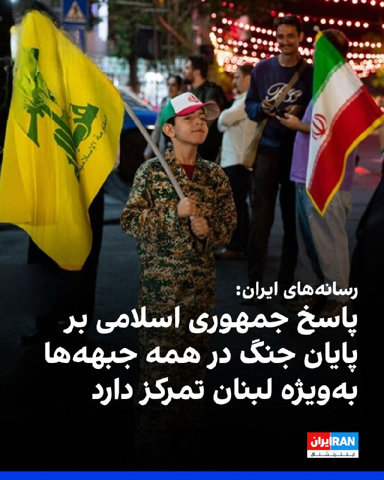

رسانه‌های ایران گزارش دادند در پاسخ جمهوری اسلامی درباره توافق خاتمه جنگ به میانجی پاکستانی، بر پایان جنگ در همه جبهه‌ها، به‌ویژه لبنان، و تامین امنیت کشتیرانی تاکید شده است.

پیش‌تر دونالد ترامپ گفته بود انتظار دارد هر چه سریع‌تر پاسخ جمهوری اسلامی را دریافت کند.
https://iranintl.com/202605106999

---
📅 بروزرسانی: 1405/02/20 19:19
---

## Configir98 — post 8539

🔐 𝗩𝟮𝗿𝗮𝘆𝗡𝗚 
➕ 𝗣𝘀𝗶𝗽𝗵𝗼𝗻 
📱

vless://d11402f2-af49-484e-9f60-6acaa7e67ace@iman.neticoapp.ir:80?path=%2F&security=none&encryption=none&type=ws#https://t.me/Configir98

✅ @Configir98

## Configir98 — post 8538

🖤 فروش کانفینگ مخصوص شرایط 
🇮🇷

1 GB  درصد تخفیف ۱۰
➡️toman  300

⚡️قیمت همکاری برای همکاران محترم داخل ربات شارژ شد 

⚡️تست بخاطر شرایط موجود نمی‌باشد درخواست نکنین 
🙏

خرید فقط از طریق محصولات دیگر داخل بات
❤️

➡️ https://t.me/Admin starling

## Configir98 — post 8537

🔐 𝗩𝟮𝗿𝗮𝘆𝗡𝗚 
➕ 𝗣𝘀𝗶𝗽𝗵𝗼𝗻 
📱

{"remarks":"https://t.me/Configir98","log":{"loglevel":"warning"},"inbounds":[{"tag":"socks","port":10808,"protocol":"socks","settings":{"auth":"noauth","udp":true,"userLevel":8},"sniffing":{"enabled":true,"destOverride":["http","tls"],"routeOnly":false}}],"outbounds":[{"tag":"proxy","protocol":"vless","settings":{"vnext":[{"address":"snapp.ir","port":80,"users":[{"id":"00669e97-27fb-4273-878b-d514f7f4fd4b","level":8,"encryption":"none"}]}]},"streamSettings":{"network":"ws","wsSettings":{"path":"/","headers":{"Host":"striker.starferi.ir"}}},"mux":{"enabled":false,"concurrency":-1,"xudpConcurrency":8,"xudpProxyUDP443":""}},{"tag":"direct","protocol":"freedom","settings":{"domainStrategy":"UseIP"},"mux":{"enabled":false,"concurrency":8,"xudpConcurrency":8,"xudpProxyUDP443":""}},{"tag":"block","protocol":"blackhole","settings":{"response":{"type":"http"}},"mux":{"enabled":false,"concurrency":8,"xudpConcurrency":8,"xudpProxyUDP443":""}}],"dns":{"servers":["1.1.1.1"],"hosts":{"domain:googleapis.cn":"googleapis.com","dns.alidns.com":["223.5.5.5","223.6.6.6","2400:3200::1","2400:3200:baba::1"],"one.one.one.one":["1.1.1.1","1.0.0.1","2606:4700:4700::1111","2606:4700:4700::1001"],"dot.pub":["1.12.12.12","120.53.53.53"],"dns.google":["8.8.8.8","8.8.4.4","2001:4860:4860::8888","2001:4860:4860::8844"],"dns.quad9.net":["9.9.9.9","149.112.112.112","2620:fe::fe","2620:fe::9"],"common.dot.dns.yandex.net":["77.88.8.8","77.88.8.1","2a02:6b8::feed:0ff","2a02:6b8:0:1::feed:0ff"]}},"routing":{"domainStrategy":"IPIfNonMatch","rules":[{"type":"field","ip":["1.1.1.1"],"outboundTag":"proxy","port":"53"},{"type":"field","ip":["223.5.5.5"],"outboundTag":"direct","port":"53"}]}}

✅ @Configir98

## Persian_Trend_Official — post 13834

مستند رضاشاه، پدر ایران نوین 🔥

## Persian_Trend_Official — post 13833

مستند رضاشاه، پدر ایران نوین 🔥

## Persian_Trend_Official — post 13832

مستند رضاشاه، پدر ایران نوین 🔥

## Persian_Trend_Official — post 13831

⭕️ رئیس انرژی: پارسال 9 هزار مگاوات کمبود برق داشتیم و امسال 24 هزارمگاوات؛ مردم برای قطعی های برق در هر 7 روز هفته خودشونو آماده کنن. 📝 Nick 📌 @persian_trend_official پرشین ترند | متفاوت‌ترین کانال نظامی

## Persian_Trend_Official — post 13830

  

پست ترامپ در تروث سوشال لحظاتی قبل منتشر کرد.

## IranianMinds — post 19904

  

🔴 پست جدید ترامپ.

@IranianMinds

## IranianMinds — post 19903

🔴 ارتش اسرائیل :

از ساکنان روستاهای دیرالزهرانی، جرجو و سجاد در جنوب لبنان می‌خواهیم تخلیه شده و یک کیلومتر از این مناطق فاصله بگیرن چون داریم میایم بالا سر حزب الله.

@IranianMinds

## IranianMinds — post 19902

  <a href="telegram/content/IranianMinds_19902_1778428165.mp4" target="_blank">🎬 Download video</a>

🔴 ترامپ:

ونزوئلا در حال حاضر کشوری بسیار شاد است. اونا خیلی بدبخت بودند و حالا خوشحال هستند.

نفتی که از اونجا بیرون میاد بسیار زیاد است.

@IranianMinds

## IranianMinds — post 19901

🔴 معاون وزیر امور خارجه جمهوری اسلامی:

حضور ناوهای جنگی فرانسه و انگلیس در تنگه هرمز با واکنش فوری و قاطع مواجه خواهد شد.

@IranianMinds

## IranianMinds — post 19900

  

نه داداش تو نمیدونی جمهوری اسلامی خیلی خوب داره دووم میاره جلو آمریکا و اسرائیل :

@IranianMinds

## IranianMinds — post 19899

  <a href="telegram/content/IranianMinds_19899_1778428169.mp4" target="_blank">🎬 Download video</a>

🔴 نتانیاهو:

جنگ با ایران تمام نشده است زیرا هنوز اورانیوم غنی شده وجود دارد که باید از ایران خارج شود.

هنوز سایت های غنی سازی وجود دارد که باید برچیده شوند. هنوز هم پروکسی هایی وجود دارند که ایران از آنها پشتیبانی می کند و موشک های بالستیکی که آنها می خواهند تولید کنند.

ما خیلی اونارو تحقیر کردیم، اما جای کار وجود دارد.

@IranianMinds

## IranianMinds — post 19897

  <a href="https://t.me/IranianMinds/19897" target="_blank">📎 Download file</a>

📲#اپلیکیشن اندروید سایت جهانی دربی بت

👍اسپانسر لیگ انگلیس
👍
🔥امکان شارژ امن از طریق کارت بانکی
➖➖➖➖➖➖➖➖➖

🪙همین حالا عضو شوید 👇
https://t.me/+aCbq7yy8QY80NzQ0

## IranianMinds — post 19896

  

😤دنبال یه سایت شرط بندی بین المللی بودی که به ایرانیا خدمات بده؟!
⛔

👍دربی بت همون انتخاب  100%

💎ویژگی های سایت جهانی Derby Bet:

⬅️امکان شارژ امن با کارت بانکی

⬅️واریز اول دوبل شارژ می شوید(بونوس۱۰۰٪)

⬅️پر اپشن ترین سایت فعال در ایران

⬅️تسویه حساب کمتر از 5 دقیقه

⬅️برگشت بخشی از باخت به صورت هفتگی

🚨کد هدیه ثبت نام:GG007

⚠️برای دانلود اپلکیشن کلیک کنید
👉
ge20

🔔کانال دربی بت :

🪙https://t.me/+aCbq7yy8QY80NzQ0

## Configir98 — post 8539

🔐 𝗩𝟮𝗿𝗮𝘆𝗡𝗚 
➕ 𝗣𝘀𝗶𝗽𝗵𝗼𝗻 
📱

vless://d11402f2-af49-484e-9f60-6acaa7e67ace@iman.neticoapp.ir:80?path=%2F&security=none&encryption=none&type=ws#https://t.me/Configir98

✅ @Configir98

## Configir98 — post 8538

🖤 فروش کانفینگ مخصوص شرایط 
🇮🇷

1 GB  درصد تخفیف ۱۰
➡️toman  300

⚡️قیمت همکاری برای همکاران محترم داخل ربات شارژ شد 

⚡️تست بخاطر شرایط موجود نمی‌باشد درخواست نکنین 
🙏

خرید فقط از طریق محصولات دیگر داخل بات
❤️

➡️ https://t.me/Admin starling

## Configir98 — post 8537

🔐 𝗩𝟮𝗿𝗮𝘆𝗡𝗚 
➕ 𝗣𝘀𝗶𝗽𝗵𝗼𝗻 
📱

{"remarks":"https://t.me/Configir98","log":{"loglevel":"warning"},"inbounds":[{"tag":"socks","port":10808,"protocol":"socks","settings":{"auth":"noauth","udp":true,"userLevel":8},"sniffing":{"enabled":true,"destOverride":["http","tls"],"routeOnly":false}}],"outbounds":[{"tag":"proxy","protocol":"vless","settings":{"vnext":[{"address":"snapp.ir","port":80,"users":[{"id":"00669e97-27fb-4273-878b-d514f7f4fd4b","level":8,"encryption":"none"}]}]},"streamSettings":{"network":"ws","wsSettings":{"path":"/","headers":{"Host":"striker.starferi.ir"}}},"mux":{"enabled":false,"concurrency":-1,"xudpConcurrency":8,"xudpProxyUDP443":""}},{"tag":"direct","protocol":"freedom","settings":{"domainStrategy":"UseIP"},"mux":{"enabled":false,"concurrency":8,"xudpConcurrency":8,"xudpProxyUDP443":""}},{"tag":"block","protocol":"blackhole","settings":{"response":{"type":"http"}},"mux":{"enabled":false,"concurrency":8,"xudpConcurrency":8,"xudpProxyUDP443":""}}],"dns":{"servers":["1.1.1.1"],"hosts":{"domain:googleapis.cn":"googleapis.com","dns.alidns.com":["223.5.5.5","223.6.6.6","2400:3200::1","2400:3200:baba::1"],"one.one.one.one":["1.1.1.1","1.0.0.1","2606:4700:4700::1111","2606:4700:4700::1001"],"dot.pub":["1.12.12.12","120.53.53.53"],"dns.google":["8.8.8.8","8.8.4.4","2001:4860:4860::8888","2001:4860:4860::8844"],"dns.quad9.net":["9.9.9.9","149.112.112.112","2620:fe::fe","2620:fe::9"],"common.dot.dns.yandex.net":["77.88.8.8","77.88.8.1","2a02:6b8::feed:0ff","2a02:6b8:0:1::feed:0ff"]}},"routing":{"domainStrategy":"IPIfNonMatch","rules":[{"type":"field","ip":["1.1.1.1"],"outboundTag":"proxy","port":"53"},{"type":"field","ip":["223.5.5.5"],"outboundTag":"direct","port":"53"}]}}

✅ @Configir98

---
📅 بروزرسانی: 1405/02/20 18:19
---

## Configir98 — post 8536

  <a href="https://t.me/Configir98/8536" target="_blank">📎 Download file</a>

🛜 𝗡𝗽𝘃 𝗧𝘂𝗻𝗻𝗲𝗹 𝗡𝗮𝗽𝘀𝘁𝗲𝗿𝗻𝗲𝘁𝗩

🛡️ Password: @Configir98

✅ @Configir98

## IranianMinds — post 19895

  <a href="telegram/content/IranianMinds_19895_1778424551.mp4" target="_blank">🎬 Download video</a>

🔴 ترامپ:

دو گروه از رهبرانشان از بین رفته‌اند، گروه A رفته، گروه B هم رفته، و احتمالاً گروه C هم از بین رفته است.

ما با افرادی طرف هستیم که نوعی قدرت دارند. خیلی جالب است آن‌ها یک توافق می‌کنند و بعد آن را می‌شکنند.

@IranianMinds

## Configir98 — post 8536

  <a href="https://t.me/Configir98/8536" target="_blank">📎 Download file</a>

🛜 𝗡𝗽𝘃 𝗧𝘂𝗻𝗻𝗲𝗹 𝗡𝗮𝗽𝘀𝘁𝗲𝗿𝗻𝗲𝘁𝗩

🛡️ Password: @Configir98

✅ @Configir98

---
📅 بروزرسانی: 1405/02/20 18:02
---

## Configir98 — post 8535

  <a href="https://t.me/Configir98/8535" target="_blank">📎 Download file</a>

🛜 𝗡𝗽𝘃 𝗧𝘂𝗻𝗻𝗲𝗹 𝗡𝗮𝗽𝘀𝘁𝗲𝗿𝗻𝗲𝘁𝗩

🛡️ Password: @Configir98

اگه وصل نشدی با پروکسی پایین ترکیب کن

tg://proxy?server=178.104.81.34&port=4455&secret=dd104462821249bd7ac519130220c25d09

✅ @Configir98

## Configir98 — post 8534

🔐 𝗩𝟮𝗿𝗮𝘆𝗡𝗚 
➕ 𝗣𝘀𝗶𝗽𝗵𝗼𝗻 
📱

vless://58715b6d-83c2-4695-b536-e5de12913eb6@t1.arshiaspeed.shop:2086?path=%2F&security=none&encryption=none&type=ws#https://t.me/Configir98

✅ @Configir98

## Persian_Trend_Official — post 13829

⭕️ رئیس انرژی: پارسال 9 هزار مگاوات کمبود برق داشتیم و امسال 24 هزارمگاوات؛ مردم برای قطعی های برق در هر 7 روز هفته خودشونو آماده کنن.

📝 Nick

📌 @persian_trend_official
پرشین ترند | متفاوت‌ترین کانال نظامی

## Persian_Trend_Official — post 13828

  <a href="telegram/content/Persian_Trend_Official_13828_1778423571.webm" target="_blank">🎬 Download video</a>

دونالد ترامپ : نگفتم عملیات نظامی علیه ایران پایان یافته، بلکه گفتم آن‌ها شکست خورده‌اند !!!

📌 @persian_trend_official
پرشین ترند | متفاوت‌ترین کانال نظامی

## IranianMinds — post 19894

  <a href="telegram/content/IranianMinds_19894_1778423572.mp4" target="_blank">🎬 Download video</a>

🔴 ترامپ:

ایران از نظر نظامی شکست خورده است. شاید در ذهن خودشان هنوز این را ندانند، اما من فکر می‌کنم می‌دانند، چون من مستقیما با آن‌ها در ارتباط هستم

@IranianMinds

## IranianMinds — post 19893

🔴 ترامپ:

من مجبور بودم از نظر نظامی وارد عمل شوم، چون با اطمینان می‌دانستم ایران در مسیر دست‌یابی به سلاح هسته‌ای قرار دارد

@IranianMinds

## IranianMinds — post 19892

🔴 ترامپ :

تحت هیچ شرایطی ما نباید اجازه بدیم اونا سلاح هسته ای داشته باشن ، چون اونا دیوانه اند!

@IranianMinds

## IranianMinds — post 19891

🔴 ترامپ:

اگر ایران به سلاح هسته‌ای دست پیدا کند، آن را علیه اسرائیل و خاورمیانه به کار می‌برد!

@IranianMinds

## IranianMinds — post 19890

🔴 ترامپ : ما در ایران اهداف مشخصی داشتیم که دنبال می‌کردیم و احتمالا حدود ۷۰ درصدشون رو محقق کردیم @IranianMinds

## IranianMinds — post 19889

🔴 ترامپ:

هنوز اهداف دیگری در ایران داریم که همچنان احتمال هدف قرار دادنشان بسیار بالاست!

@IranianMinds

## IranianMinds — post 19888

🔴 ترامپ :

ما در ایران اهداف مشخصی داشتیم که دنبال می‌کردیم و احتمالا حدود ۷۰ درصدشون رو محقق کردیم

@IranianMinds

## IranianMinds — post 19887

🔴 ترامپ:

می‌توانیم تا دو هفته دیگر علیه ایران حرکت کنیم و به هر یک از اهداف مشخص‌شده ضربه بزنیم.

@IranianMinds

## IranianMinds — post 19886

🔴 ترامپ:

اگه امروز جنگ رو ترک کنیم، 20 سال طول می‌کشد تا ایران توانایی‌هایش را بازسازی کند

@IranianMinds

## IranianMinds — post 19885

  

🔴 ترامپ داره ویدیوهایی از مارک لوین منتشر می‌کنه که توش میگه فشار روی ایران باید ادامه پیدا کنه و حتی احتمال داره برای قوی‌تر کردن موضع آمریکا قبل از مذاکرات، یه دور دیگه درگیری و جنگ هم اجتناب‌ناپذیر باشه!

@IranianMinds

## IranianMinds — post 19884

🔴 ترامپ:

من هیچوقت نگفتم که عملیات نظامی علیه ایران تمام شده است، اما گفتم که آنها شکست خوردند

@IranianMinds

## IranianMinds — post 19883

🔴 ترامپ:

نیروی فضایی ما تمام منطقه رو زیر نظر داره اگه کسی به اورانیوم غنی شده ایران که زیر آوار مدفون شده نزدیک شود، از آن مطلع خواهیم شد و آن را بمباران و نابود خواهیم کرد.

@IranianMinds

## IranianMinds — post 19882

🔴 ترامپ :

در مقطعی به اورانیوم غنی شده ایران که در اعماق زمین و آوار مدفون شده است خواهیم رسید

@IranianMinds

## IranianMinds — post 19881

  

🔴 پست جدید ترامپ :

وزیر خارجه اسرائیل ازم‌ تمجید کرد.

@IranianMinds

## IranianMinds — post 19880

🔴 الجزیره به نقل از یک مقام پاکستانی:

پیام ایران‌ رو منتقل کردیم به آمریکاییا و‌ دارن بررسیش میکنن

@IranianMinds

## Dirty_Kids — post 389224

  

‌‎
نه بابا خب بچه خودش رفته پانزده خرداد خرید کرده اومده جلو آیینه استایلشو زده
(عرزشی همینقدر خر) 🤣

@Dirty_Kids 👻

## Dirty_Kids — post 389223

  

کره شمالی توی قانون اساسیش داره قانونی رو اضافه میکنه که درصورتی که رهبر این کشور "کیم جونگ اون" توسط کشوری ترور و کشته بشه، کره شمالی با بمب اتم از اون کشور انتقام بگیره.

@Dirty_Kids 👻

## Configir98 — post 8535

  <a href="https://t.me/Configir98/8535" target="_blank">📎 Download file</a>

🛜 𝗡𝗽𝘃 𝗧𝘂𝗻𝗻𝗲𝗹 𝗡𝗮𝗽𝘀𝘁𝗲𝗿𝗻𝗲𝘁𝗩

🛡️ Password: @Configir98

اگه وصل نشدی با پروکسی پایین ترکیب کن

tg://proxy?server=178.104.81.34&port=4455&secret=dd104462821249bd7ac519130220c25d09

✅ @Configir98

## Configir98 — post 8534

🔐 𝗩𝟮𝗿𝗮𝘆𝗡𝗚 
➕ 𝗣𝘀𝗶𝗽𝗵𝗼𝗻 
📱

vless://58715b6d-83c2-4695-b536-e5de12913eb6@t1.arshiaspeed.shop:2086?path=%2F&security=none&encryption=none&type=ws#https://t.me/Configir98

✅ @Configir98

---
📅 بروزرسانی: 1405/02/20 17:25
---

## Configir98 — post 8533

  <a href="https://t.me/Configir98/8533" target="_blank">📎 Download file</a>

🛜 𝗡𝗽𝘃 𝗧𝘂𝗻𝗻𝗲𝗹 𝗡𝗮𝗽𝘀𝘁𝗲𝗿𝗻𝗲𝘁𝗩

🛡️ Password: @Configir98

✅ @Configir98

## Configir98 — post 8532

👩 به مناسبت روز مادر ، تعداد 200 کانفیگ « 
⭐️ 2 گیگی یک ماهه 
👑 » بصورت کاملا رایگان داخل رباتمون شارژ شد ، برای دریافت 
⬇️

🤖 @ConfigFreeiR_Bot

## Configir98 — post 8531

  <a href="https://t.me/Configir98/8531" target="_blank">📎 Download file</a>

🛜 𝗡𝗽𝘃 𝗧𝘂𝗻𝗻𝗲𝗹 𝗡𝗮𝗽𝘀𝘁𝗲𝗿𝗻𝗲𝘁𝗩

🛡️ Password: @Configir98

✅ @Configir98

## Persian_Trend_Official — post 13827

  <a href="telegram/content/Persian_Trend_Official_13827_1778421342.mp4" target="_blank">🎬 Download video</a>

🔴ویدیویی از آماده سازی پهپاد های فیبر نوری 💢در چند وقت اخیر FPV های فیبر نوری حزب الله سر صدا زیادی به راه انداخته لذا این ویدیو جهت افزایش اطلاعات علاقه مندان بارگذاری میشود ▪️پهپاد انتحاری از نوع fpv فیبر نوری، با هدف مقابله با جنگ الکترونیک و اخلال‌گرها…

## Persian_Trend_Official — post 13826

تصمیم گرفتم لایو های شبانه رو از این به بعد، حدود ساعت 20 به وقت ایران اجرا کنم .

## Persian_Trend_Official — post 13825

  

در ساعات گذشته چندین پهپاد انتحاری به سوی کشور امارات کویت قطر پهپاد شلیک شد .
همچنین یککشتی باربریِ متعلق به کره‌جنوبیخ تو تنگه هرمز با دو تا پهپادِ ناشناس هدف گرفته شده است.

☆Phantom☆

📌 @persian_trend_official
پرشین ترند | متفاوت‌ترین کانال نظامی

## Persian_Trend_Official — post 13824

  

⭕️ ایرنا؛
🔸پاسخ ایران به متن پیشنهادی آمریکا ارسال شد

🔹پاسخ جمهوری اسلامی ایران به آخرین متن پیشنهادی آمریکا برای خاتمه جنگ، امروز به میانجی پاکستانی ارسال شد.

🔹سخنگوی وزارت خارجه قبلا چند بار اعلام کرده بود دیدگاه‌ها و ملاحظات ایران راجع به پیشنهادهای آمریکا، بعد از تکمیل بررسی‌ها و جمع‌بندی نهایی، ارسال خواهد شد.

🔹بر اساس طرح پیشنهادی، در این مرحله مذاکرات متمرکز بر موضوع خاتمه جنگ در منطقه خواهد بود.

🫆:Tony

📌 @persian_trend_official
پرشین ترند | متفاوت‌ترین کانال نظامی

## Persian_Trend_Official — post 13823

  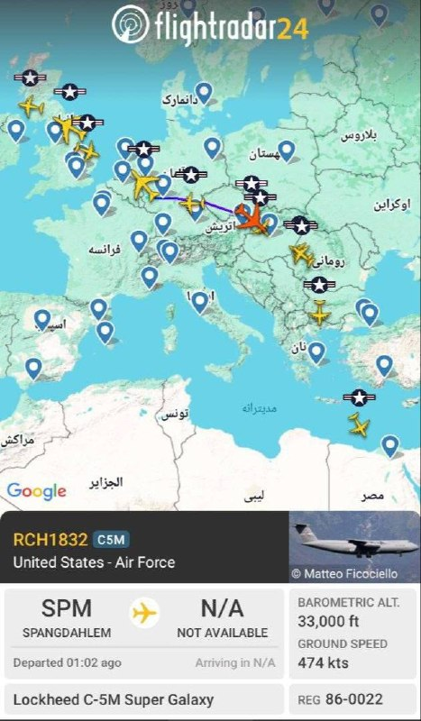

🔴 گزارش‌ها از اعزام گسترده هواپیماهای ترابری سنگین آمریکا به خاورمیانه

💢برخی منابع از پرواز و اعزام ۱۳ فروند هواپیمای ترابری نظامی سنگین ارتش آمریکا از پایگاه‌های اروپایی به سمت خاورمیانه طی ساعات اخیر خبر می‌دهند.

🫆:Tony

📌 @persian_trend_official
پرشین ترند | متفاوت‌ترین کانال نظامی

## IranianMinds — post 19879

  <a href="telegram/content/IranianMinds_19879_1778421346.mp4" target="_blank">🎬 Download video</a>

🔴یک فروند KC-135 امریکا در حال پرواز در آسمان خاورمیانه و درحال سوخت‌رسانی به یک F/A-18 سوپر‌هورنت.

@IranianMinds

## IranianMinds — post 19878

🔴 جمهوری اسلامی : پاسخ خودمون به آمریکا برای پایان دادن به جنگ رو دادیم. @IranianMinds

## IranianMinds — post 19877

🔴 جمهوری اسلامی :

پاسخ خودمون به آمریکا برای پایان دادن به جنگ رو دادیم.

@IranianMinds

## IranianMinds — post 19876

۱۰ می روز جهانی مادر است، اما در سرزمین ما، بعضی مادرها فقط مادر نماندند، به درد یک ملت تبدیل شدند.
مادرانی که فرزندانشان را در راه آزادی از دست دادند و مادرانی که خود، جاویدنام راه ایران شدند.
نامتان در حافظهٔ این خاک خواهد ماند، مثل نوری خاموش‌نشدنی.
روز مادر بر تمام مادران غیور و سربلند ایران‌زمین خجسته باد.
بر آنان که ایستادند، سوختند ، اما نشکستند.

@IranianMinds

## configx2ray — post 38713

  <a href="https://t.me/ConfigX2ray/38713" target="_blank">📎 Download file</a>

کانفیگ برای Npv tunnel ⭕️

به هیچ وج دانلود نزنید باهاش
❤️

رمز فایل : @ConfigX2ray

Channel : https://t.me/ConfigX2ray

## configx2ray — post 38712

😋

## Configir98 — post 8533

  <a href="https://t.me/Configir98/8533" target="_blank">📎 Download file</a>

🛜 𝗡𝗽𝘃 𝗧𝘂𝗻𝗻𝗲𝗹 𝗡𝗮𝗽𝘀𝘁𝗲𝗿𝗻𝗲𝘁𝗩

🛡️ Password: @Configir98

✅ @Configir98

## Configir98 — post 8532

👩 به مناسبت روز مادر ، تعداد 200 کانفیگ « 
⭐️ 2 گیگی یک ماهه 
👑 » بصورت کاملا رایگان داخل رباتمون شارژ شد ، برای دریافت 
⬇️

🤖 @ConfigFreeiR_Bot

## Configir98 — post 8531

  <a href="https://t.me/Configir98/8531" target="_blank">📎 Download file</a>

🛜 𝗡𝗽𝘃 𝗧𝘂𝗻𝗻𝗲𝗹 𝗡𝗮𝗽𝘀𝘁𝗲𝗿𝗻𝗲𝘁𝗩

🛡️ Password: @Configir98

✅ @Configir98

---
📅 بروزرسانی: 1405/02/20 15:35
---

## Configir98 — post 8529

  <a href="https://t.me/Configir98/8529" target="_blank">📎 Download file</a>

❤️ آپدیت جدید V2rayNG 
🔤

🐱 نسخه 2.1.7 universal گیت هاب

✅ @Configir98

## Configir98 — post 8526

🔐 𝗩𝟮𝗿𝗮𝘆𝗡𝗚 
➕ 𝗣𝘀𝗶𝗽𝗵𝗼𝗻 
📱

vless://f3ef1255-1807-45d5-8872-324c6943175b@iman.neticoapp.ir:80/?type=ws&encryption=none&flow=&host=srv3.diamond-tech.online&path=%2F#https://t.me/Configir98

✅ @Configir98

## Configir98 — post 8525

⚡️ 𝗣𝘀𝗶𝗽𝗵𝗼𝗻 𝗣𝗿𝗼𝘅𝘆

Host :  37.32.20.64
Port : 2080

Host : 93.126.6.70
Port : 3128

Host: 2.185.144.66
Port: 8080

✅ @Configir98

## Persian_Trend_Official — post 13822

  <a href="telegram/content/Persian_Trend_Official_13822_1778414716.mp4" target="_blank">🎬 Download video</a>

🔴ویدیویی از آماده سازی پهپاد های فیبر نوری

💢در چند وقت اخیر FPV های فیبر نوری حزب الله سر صدا زیادی به راه انداخته لذا این ویدیو جهت افزایش اطلاعات علاقه مندان بارگذاری میشود

▪️پهپاد انتحاری از نوع fpv فیبر نوری، با هدف مقابله با جنگ الکترونیک و اخلال‌گرها طراحی شده؛ جایی که پهپادهای عادی معمولاً کور و قطع می‌شوند.

▪️این پهپاد به‌جای ارتباط رادیویی، از کابل فیبر نوری استفاده می‌کند و همین موضوع باعث می‌شود عملاً در برابر جمینگ و اختلال الکترونیکی مقاوم باشد.

▪️این پهپاد هاتوان نفوذ دقیق به مواضع، سنگرها و خودروهای زرهی را دارد و به دلیل تأخیر بسیار کم در انتقال تصویر، کنترل‌پذیری بالایی در لحظات آخر حمله فراهم می‌کند.

💢استفاده گسترده از پهپادهای فیبر نوری در جنگ اوکراین، توجه بسیاری از ارتش‌ها و گروه‌های نظامی از جمله حزب الله را به این فناوری جلب کرده است.

🫆:Tony

📌 @persian_trend_official
پرشین ترند | متفاوت‌ترین کانال نظامی

## Persian_Trend_Official — post 13821

  <a href="telegram/content/Persian_Trend_Official_13821_1778414717.webm" target="_blank">🎬 Download video</a>

منابع عراقی به روزنامه العربی الجدید گفتند که اسماعیل قاآنی فرمانده نیروی قدس سپاه ایران طی سفری رسمی وارد بغداد شد. این دومین سفر او به بغداد در کمتر از یک ماه است.
🇮🇷🇮🇶
☆Phantom☆

📌 @persian_trend_official
پرشین ترند | متفاوت‌ترین کانال نظامی

## Persian_Trend_Official — post 13820

🔴ادعای دفاع هوایی امارات در مقابل دو پهپاد

💢دفاع هوایی امارات متحده عربی اعلام کرد دو موشک ورودی که گفته می‌شود از سمت ایران شلیک شده بودند را رهگیری و منهدم کرده است.

🫆:Tony

📌 @persian_trend_official
پرشین ترند | متفاوت‌ترین کانال نظامی

## Persian_Trend_Official — post 13819

  <a href="telegram/content/Persian_Trend_Official_13819_1778414718.webm" target="_blank">🎬 Download video</a>

🔴 ترامپ و شکاف در روابط آمریکا با متحدان؛ پیامدهای جنگ ایران

💢یک گزارش تازه رویترز نشان می‌دهد تنش‌های دونالد ترامپ با متحدان سنتی آمریکا، حالا فراتر از یک اختلاف سیاسی معمول رفته و در حال تبدیل شدن به یک تغییر ساختاری در روابط بین‌الملل است.

💢براساس این گزارش، تصمیم‌هایی مثل کاهش بخشی از نیروهای آمریکا در آلمان، احتمال کاهش حضور نظامی در دیگر کشورهای اروپایی و همچنین مواضع مبهم در قبال حملات منطقه‌ای، باعث شده اعتماد متحدان واشنگتن به شدت آسیب ببیند.

▪️اروپا، خاورمیانه و شرق آسیا حالا با یک نگرانی مشترک روبه‌رو هستند:
آیا آمریکا در یک بحران واقعی همچنان قابل اتکا خواهد بود؟

💢در اروپا، برخی کشورها به سمت افزایش همکاری‌های نظامی مستقل و کاهش وابستگی به آمریکا حرکت کرده‌اند. در آسیا هم کشورهایی مثل ژاپن و کره جنوبی نسبت به میزان تعهد واشنگتن در صورت درگیری احتمالی با چین، دچار تردید شده‌اند.

💢در مقابل، چین و روسیه این وضعیت را یک فرصت می‌بینند تا نفوذ خود را در مناطق مختلف افزایش دهند.

🫆:Tony
📌 @persian_trend_official
پرشین ترند | متفاوت‌ترین کانال نظامی

## IranianMinds — post 19875

  <a href="telegram/content/IranianMinds_19875_1778414718.mp4" target="_blank">🎬 Download video</a>

🔴نمونه‌ای از کلاهبرداری‌ها و دزدی‌های آخوندهای کثیف.
اگر می‌خواهید در بهشت جواب بگیرید، در این دنیا باید به ازای هر متر زمین ۱۷۰۰ دلار بهمون پول بدید، سند هم به اسم خودتون زده میشه.

@IranianMinds

## Dirty_Kids — post 389222

  

فرق بین تمدن و توحش

@Dirty_Kids 👻

## Dirty_Kids — post 389221

وضعیت تکنولوژی در منطقه:

‏- افغانستان و ترکیه : اینترنت 5G تست و راه‌اندازی شد.
‏- عراق: تلگرام رفع فیلتر شد.
‏- سوریه: سوییفت، ویزا و مستر به سوریه آمدند.
‏- ایران: رکورد شکنی جدید، قطعی اینترنت به یازدهمین هفته رسید.

@Dirty_Kids 👻

## Dirty_Kids — post 389220

  <a href="telegram/content/Dirty_Kids_389220_1778414720.mp4" target="_blank">🎬 Download video</a>

متین ستوده:
همه دنیا می‌داند ترامپ دیوانه است.

حالا ببین شما کی هستید که دنیا دست به دامن اون دیوونه شده که شما رو نابود کنه!

اینها واقعا مارو کسخل فرض کردن؟ خب کسکش خونشور کیان پیرفلک و ۴۰هزار جوون ۱۸ و ۱۹دی رو جمهوری اسلامی کشت. برای کی گریه کردی پلشت؟

از قاتل حمایت میکنن، بعد برای قربانی گریه میکنن

@Dirty_Kids 👻

## Dirty_Kids — post 389219

  

شاید این وسط براتون سوال باشه نظر مراجع در مورد خوردن شیر همسر چیه؟

خامنه ای، مکارم، وحید خراسانی، نوری همدانی: جایز است و مشکل نداره✅
سیستانی: خورده نشه بهتره❌

+ یکی از علما هم گفته من خوردم خوشمزه نبوده، نخورین بهتره :))

@Dirty_Kids 👻

## Dirty_Kids — post 389214

عکسای جدید بانو بیلی آیلیش که خیلی تو ایکس وایرال شده

@Dirty_Kids 👻

## Dirty_Kids — post 389213

‏فکر کن یه عالمه درس بخونی که بری خارج یه عالمه درس بخونی.

@Dirty_Kids 👻

## Configir98 — post 8529

  <a href="https://t.me/Configir98/8529" target="_blank">📎 Download file</a>

❤️ آپدیت جدید V2rayNG 
🔤

🐱 نسخه 2.1.7 universal گیت هاب

✅ @Configir98

## Configir98 — post 8526

🔐 𝗩𝟮𝗿𝗮𝘆𝗡𝗚 
➕ 𝗣𝘀𝗶𝗽𝗵𝗼𝗻 
📱

vless://f3ef1255-1807-45d5-8872-324c6943175b@iman.neticoapp.ir:80/?type=ws&encryption=none&flow=&host=srv3.diamond-tech.online&path=%2F#https://t.me/Configir98

✅ @Configir98

## Configir98 — post 8525

⚡️ 𝗣𝘀𝗶𝗽𝗵𝗼𝗻 𝗣𝗿𝗼𝘅𝘆

Host :  37.32.20.64
Port : 2080

Host : 93.126.6.70
Port : 3128

Host: 2.185.144.66
Port: 8080

✅ @Configir98

---
📅 بروزرسانی: 1405/02/20 14:44
---

## Persian_Trend_Official — post 13818

  <a href="telegram/content/Persian_Trend_Official_13818_1778411677.webm" target="_blank">🎬 Download video</a>

💢 سخنگوی کمیسیون امنیت ملی: از امروز خویشتن‌داری ما تمام شد

▪️هرتعرضی به شناورهای ما،با پاسخ سنگین و قاطع به شناور ها و پایگاه های آمریکایی مواجه خواهد شد

🫆:Tony

📌 @persian_trend_official
پرشین ترند | متفاوت‌ترین کانال نظامی

## Persian_Trend_Official — post 13817

  <a href="telegram/content/Persian_Trend_Official_13817_1778411677.mp4" target="_blank">🎬 Download video</a>

🔴 دود غلیظ بر فراز اربیل پس از حمله پهپادی به مقر گروه‌های مخالف جمهوری اسلامی

💢منابع محلی از برخاستن ستون‌های دود از اطراف شهر اربیل در شمال عراق خبر می‌دهند؛ پس از آنکه یک پهپاد مواضع گروه‌های کرد مخالف جمهوری اسلامی را هدف قرار داد/نایا

▪️تاکنون جزئیاتی درباره تلفات یا خسارات احتمالی منتشر نشده است.

🫆:Tony

📌 @persian_trend_official
پرشین ترند | متفاوت‌ترین کانال نظامی

## Persian_Trend_Official — post 13816

💢خبرگزاری صداوسیمای جمهوری اسلامی گزارش داد «علی عبداللهی» از فرماندهان ارشد نظامی ایران با «مجتبی خامنه‌ای» دیدار کرده است.

▪️بر اساس این گزارش:

💢 مجتبی خامنه‌ای در این دیدار از نیروهای مسلح تقدیر کرده

💢 او همچنین از «اقدامات جدید و مسیر ادامه اقدامات برای مقابله قدرتمندانه با دشمنان» سخن گفته است

💢 جزئیات بیشتری درباره ماهیت این اقدامات منتشر نشده است

از زمان انتصاب مجتبی خامنه‌ای در ماه مارس، تاکنون هیچ حضور عمومی یا تصویر رسمی جدیدی از او منتشر نشده و پیام‌هایش معمولاً از طریق رسانه‌های حکومتی قرائت می‌شود

🫆:Tony

📌 @persian_trend_official
پرشین ترند | متفاوت‌ترین کانال نظامی

## IranianMinds — post 19874

  

🔴در این عکس چه می‌بینید؟

آفتابه، یخچال، مقوا.

@IranianMinds

## IranianMinds — post 19873

  <a href="telegram/content/IranianMinds_19873_1778411680.mp4" target="_blank">🎬 Download video</a>

🔴این پرستوی حکومتی نمی‌دونه پرستوی نظام یعنی چی.

@IranianMinds

## IranianMinds — post 19872

🔴غیر رسمی:

گویا در قشم و شیراز هم انفجارهایی رخ داده.

@IranianMinds

## Dirty_Kids — post 389212

  <a href="telegram/content/Dirty_Kids_389212_1778411682.mp4" target="_blank">🎬 Download video</a>

Mother's Day 2026

روزت مبارک مامان ♥️
#محمدرضاقربانی

@Dirty_Kids 👻

## Dirty_Kids — post 389211

  <a href="telegram/content/Dirty_Kids_389211_1778411685.mp4" target="_blank">🎬 Download video</a>

«بچه شیعه باخت نمیده»
چون نزدیک جام‌جهانی هستیم این مدلیشم ببینید

@Dirty_Kids 👻

## Dirty_Kids — post 389210

  <a href="https://t.me/Dirty_Kids/389210" target="_blank">📎 Download file</a>

✅ اپلیکیشن اندروید سایت جهانی دربی بت

💰اولین سایت جهانی با امکان شارژ و برداشت ریالی(کارت به کارت)

🔗 برای ورود فیلترشکن روی کشور مناسب قرار دهید مانند فنلاند و المان و....

😀Telegram Channel
👇
https://t.me/+bcynkEgSW2dlYTc0

## Dirty_Kids — post 389209

  

😤دنبال یه سایت شرط بندی بین المللی بودی که به ایرانیا خدمات بده؟!
⛔

👍دربی بت همون انتخاب  100%

💎ویژگی های سایت جهانی Derby Bet:

⬅️امکان شارژ امن با کارت بانکی

⬅️واریز اول دوبل شارژ می شوید(بونوس۱۰۰٪)

⬅️پر اپشن ترین سایت فعال در ایران

⬅️تسویه حساب کمتر از 5 دقیقه

⬅️برگشت بخشی از باخت به صورت هفتگی

🚨کد هدیه ثبت نام:GG007

⚠️برای دانلود اپلکیشن کلیک کنید
👉

🔔کانال دربی بت :

🪙https://t.me/+bcynkEgSW2dlYTc0

---
📅 بروزرسانی: 1405/02/20 13:40
---

## Configir98 — post 8524

🔐 𝗩𝟮𝗿𝗮𝘆𝗡𝗚 
➕ 𝗣𝘀𝗶𝗽𝗵𝗼𝗻 
📱

vmess://eyJhZGQiOiJ3d3cuYXJ2YW5jbG91ZC5pciIsImFpZCI6IjAiLCJhbHBuIjoiIiwiZnAiOiIiLCJob3N0IjoidmlwNi5hcmlhdGFrcG95YW4uaXIiLCJpZCI6Ijc2NmQ0YWIyLWMwOTItNDUxZi1iNWY0LWYzM2M4NDk3ODA2NSIsIm5ldCI6IndzIiwicGF0aCI6Ii9hcmlhIiwicG9ydCI6IjgwODAiLCJwcyI6Imh0dHBzOi8vdC5tZS9Db25maWdpcjk4Iiwic2N5IjoiYXV0byIsInNuaSI6IiIsInRscyI6IiIsInR5cGUiOiIiLCJ2IjoiMiJ9

socks://Og@62.220.126.92:30871#https://t.me/Configir98

socks://Og@62.220.126.56:30170#https://t.me/Configir98

✅ @Configir98

## Configir98 — post 8523

  <a href="https://t.me/Configir98/8523" target="_blank">📎 Download file</a>

🛜 𝗡𝗽𝘃 𝗧𝘂𝗻𝗻𝗲𝗹 𝗡𝗮𝗽𝘀𝘁𝗲𝗿𝗻𝗲𝘁𝗩

🛡️ Password: @Configir98

با این پروکسی ترکیب کنید :

tg://proxy?server=62.238.0.202&port=4455&secret=dd104462821249bd7ac519130220c25d09

✅ @Configir98

## Persian_Trend_Official — post 13815

🔴 کویت: چند پهپاد «متخاصم» در حریم هوایی کشور شناسایی شدند

💢وزارت دفاع کویت اعلام کرد بامداد امروز چند پهپاد «متخاصم» در حریم هوایی این کشور شناسایی شده‌اند.

💢سخنگوی وزارت دفاع در بیانیه‌ای اعلام کرد این پهپادها «طبق رویه‌های تعیین‌شده» رهگیری و با آن‌ها مقابله شده است.

تا این لحظه جزئیاتی درباره منشأ پهپادها، تعداد دقیق آن‌ها یا خسارات احتمالی منتشر نشده است.

🫆:Tony

📌 @persian_trend_official
پرشین ترند | متفاوت‌ترین کانال نظامی

## Persian_Trend_Official — post 13814

  <a href="telegram/content/Persian_Trend_Official_13814_1778407827.mp4" target="_blank">🎬 Download video</a>

🇸🇾 اتفاقی تاریخی برای سوریه؛
پس از بیش از ۱۵ سال، اولین تراکنش با کارت‌های ویزا و مسترکارت در این کشور انجام شد.

این رویداد می‌تواند نشانه‌ای از بازگشت تدریجی سوریه به شبکه مالی جهانی پس از سال‌ها انزوای ناشی از تحریم‌ها باشد.

☆Phantom☆

📌 @persian_trend_official
پرشین ترند | متفاوت‌ترین کانال نظامی

## IranianMinds — post 19871

🔴خبرگزاری مهر:

دقایقی پیش صدای یک انفجار شدید در شهر چابهار شنیده شده است.
هنوز جزئیات بیشتری از علت یا محل دقیق انفجار منتشر نشده است.

@IranianMinds

## Dirty_Kids — post 389208

رفتم شیرینی فروشی، پرسیدم ببخشید این ظرف گِرده که روش پسته داره چیه؟
یکطوری نگاهم کرد گفت این دسرمون خیلی لایت و کریمیه با تاپینگِ سالتِد کارامل سیروپ، با پودرِ پستاچیو.
گفتم نخرم زشته؛ خریدم رفتم حساب کردم، توی فاکتور نوشته بود شیر برنج. :)))))))))

@Dirty_Kids 👻

## Dirty_Kids — post 389207

  <a href="telegram/content/Dirty_Kids_389207_1778407828.mp4" target="_blank">🎬 Download video</a>

داره میگه جنده‌ای، کصکش ادا تنگا رو درنیار دیگه 🤭🤭🤭

@Dirty_Kids 👻

## configx2ray — post 38711

دوستان چند عدد سرور اختصاصی 3 گیگ هم موجوده قیمت با بیشترین تخفیف تقدیم میشه 490 هزار تومان
❤️

سرور کاملا تضمینی میباشد بدونه ضریب همراه با ساب جهت استعلام حجم مصرفیتون
🌟

نیاز داشتید میتونید به ایدی زیر پیام بدید
⭐️ :

ID : https://t.me/serverfast2 
💠

## Configir98 — post 8524

🔐 𝗩𝟮𝗿𝗮𝘆𝗡𝗚 
➕ 𝗣𝘀𝗶𝗽𝗵𝗼𝗻 
📱

vmess://eyJhZGQiOiJ3d3cuYXJ2YW5jbG91ZC5pciIsImFpZCI6IjAiLCJhbHBuIjoiIiwiZnAiOiIiLCJob3N0IjoidmlwNi5hcmlhdGFrcG95YW4uaXIiLCJpZCI6Ijc2NmQ0YWIyLWMwOTItNDUxZi1iNWY0LWYzM2M4NDk3ODA2NSIsIm5ldCI6IndzIiwicGF0aCI6Ii9hcmlhIiwicG9ydCI6IjgwODAiLCJwcyI6Imh0dHBzOi8vdC5tZS9Db25maWdpcjk4Iiwic2N5IjoiYXV0byIsInNuaSI6IiIsInRscyI6IiIsInR5cGUiOiIiLCJ2IjoiMiJ9

socks://Og@62.220.126.92:30871#https://t.me/Configir98

socks://Og@62.220.126.56:30170#https://t.me/Configir98

✅ @Configir98

## Configir98 — post 8523

  <a href="https://t.me/Configir98/8523" target="_blank">📎 Download file</a>

🛜 𝗡𝗽𝘃 𝗧𝘂𝗻𝗻𝗲𝗹 𝗡𝗮𝗽𝘀𝘁𝗲𝗿𝗻𝗲𝘁𝗩

🛡️ Password: @Configir98

با این پروکسی ترکیب کنید :

tg://proxy?server=62.238.0.202&port=4455&secret=dd104462821249bd7ac519130220c25d09

✅ @Configir98

---
📅 بروزرسانی: 1405/02/20 12:30
---

## Persian_Trend_Official — post 13813

کانال رسمی پرشین ترند pinned «https://youtube.com/shorts/3Y-nec_YFoI?si=BzoGOXd-FGHyJLOw»

## Persian_Trend_Official — post 13812

https://youtube.com/shorts/3Y-nec_YFoI?si=BzoGOXd-FGHyJLOw

---
📅 بروزرسانی: 1405/02/20 12:21
---

## Configir98 — post 8520

  <a href="https://t.me/Configir98/8520" target="_blank">📎 Download file</a>

🛜 𝗡𝗽𝘃 𝗧𝘂𝗻𝗻𝗲𝗹 𝗡𝗮𝗽𝘀𝘁𝗲𝗿𝗻𝗲𝘁𝗩

🛡️ Password: @Configir98

✅ @Configir98

## Configir98 — post 8519

🔥 همین الان 
0️⃣
0️⃣
1️⃣ تا کانفیگ اختصاصی داخل ربات شارج شد

میتونین با دعوت دوستاتون یک سرور اختصاصی به حجم 
🚀 
0️⃣
0️⃣
8️⃣ مگابایت
🚀 دریافت کنین 
💎

🤖 @ConfigFreeiR_Bot

## Configir98 — post 8518

  <a href="telegram/content/Configir98_8518_1778403063.mp4" target="_blank">🎬 Download video</a>

🔴رئیس اتحادیه کسب‌وکارهای اینترنتی: درآمد برخی فعالان شبکه‌های اجتماعی به نزدیک صفر رسیده است.

## Configir98 — post 8517

🔴رئیس اتحادیه کسب‌وکارهای اینترنتی:

درآمد برخی فعالان شبکه‌های اجتماعی به نزدیک صفر رسیده است.

## Configir98 — post 8516

خودم طرفدار تیم فنر باغچه ی لیسبونگ سوئیسم 
😒

## Configir98 — post 8515

  <a href="telegram/content/Configir98_8515_1778403064.webm" target="_blank">🎬 Download video</a>

🚨امروز الکلاسیکو داریم

رئالیا ❤️ بزارن

بارساییا 🔥 بزار

## Configir98 — post 8514

  <a href="https://t.me/Configir98/8514" target="_blank">📎 Download file</a>

🛜 𝗡𝗽𝘃 𝗧𝘂𝗻𝗻𝗲𝗹 𝗡𝗮𝗽𝘀𝘁𝗲𝗿𝗻𝗲𝘁𝗩

🛡️ Password: @Configir98

✅ @Configir98

## Configir98 — post 8513

اسم این زندگــــــی نبود
یک مبارزه تمام عیار بود...

## Configir98 — post 8512

🔐 𝗩𝟮𝗿𝗮𝘆𝗡𝗚 
➕ 𝗣𝘀𝗶𝗽𝗵𝗼𝗻 
📱

vless://f3ef1255-1807-45d5-8872-324c6943175b@iman.neticoapp.ir:80/?type=ws&encryption=none&flow=&host=srv3.diamond-tech.online&path=%2F#https://t.me/Configir98

✅ @Configir98

## Persian_Trend_Official — post 13811

  

🔴 کره شمالی «حمله هسته‌ای خودکار» را وارد قانون اساسی کرد

بر اساس گزارش روزنامه «تلگراف»، کره شمالی قانون اساسی خود را به‌گونه‌ای اصلاح کرده که در صورت کشته شدن یا ناتوان شدن «کیم جونگ اون» بر اثر حمله خارجی، پاسخ هسته‌ای به‌صورت خودکار الزامی شود.

طبق این گزارش:

▪️ اگر ساختار فرماندهی نیروهای هسته‌ای کره شمالی در معرض تهدید قرار گیرد
▪️ ارتش موظف است فوراً حمله هسته‌ای تلافی‌جویانه را آغاز کند

🫆:Tony

📌 @persian_trend_official
پرشین ترند | متفاوت‌ترین کانال نظامی

## Persian_Trend_Official — post 13810

  

🔴 دقایقی پیش یک فروند جنگنده F-35 Lightning II متعلق به نیروی هوایی ایالات متحده، هنگام پرواز بر فراز دریای عمان، کد اضطراری ۷۷۰۰ را ارسال کرد.

🔹این کد نشان‌دهنده بروز وضعیت اضطراری جدی و نیاز فوری هواپیما به فرود است.

☆Phantom☆
📌 @persian_trend_official
پرشین ترند | متفاوت‌ترین کانال نظامی

## configx2ray — post 38710

  <a href="https://t.me/ConfigX2ray/38710" target="_blank">📎 Download file</a>

کانفیگ برای Npv tunnel ⭕️

به هیچ وج دانلود نزنید باهاش
❤️

رمز فایل : @ConfigX2ray

Channel : https://t.me/ConfigX2ray

## Configir98 — post 8520

  <a href="https://t.me/Configir98/8520" target="_blank">📎 Download file</a>

🛜 𝗡𝗽𝘃 𝗧𝘂𝗻𝗻𝗲𝗹 𝗡𝗮𝗽𝘀𝘁𝗲𝗿𝗻𝗲𝘁𝗩

🛡️ Password: @Configir98

✅ @Configir98

## Configir98 — post 8519

🔥 همین الان 
0️⃣
0️⃣
1️⃣ تا کانفیگ اختصاصی داخل ربات شارج شد

میتونین با دعوت دوستاتون یک سرور اختصاصی به حجم 
🚀 
0️⃣
0️⃣
8️⃣ مگابایت
🚀 دریافت کنین 
💎

🤖 @ConfigFreeiR_Bot

## Configir98 — post 8518

  <a href="telegram/content/Configir98_8518_1778403068.mp4" target="_blank">🎬 Download video</a>

🔴رئیس اتحادیه کسب‌وکارهای اینترنتی: درآمد برخی فعالان شبکه‌های اجتماعی به نزدیک صفر رسیده است.

## Configir98 — post 8517

🔴رئیس اتحادیه کسب‌وکارهای اینترنتی:

درآمد برخی فعالان شبکه‌های اجتماعی به نزدیک صفر رسیده است.

## Configir98 — post 8516

خودم طرفدار تیم فنر باغچه ی لیسبونگ سوئیسم 
😒

## Configir98 — post 8515

  <a href="telegram/content/Configir98_8515_1778403069.webm" target="_blank">🎬 Download video</a>

🚨امروز الکلاسیکو داریم

رئالیا ❤️ بزارن

بارساییا 🔥 بزار

## Configir98 — post 8514

  <a href="https://t.me/Configir98/8514" target="_blank">📎 Download file</a>

🛜 𝗡𝗽𝘃 𝗧𝘂𝗻𝗻𝗲𝗹 𝗡𝗮𝗽𝘀𝘁𝗲𝗿𝗻𝗲𝘁𝗩

🛡️ Password: @Configir98

✅ @Configir98

## Configir98 — post 8513

اسم این زندگــــــی نبود
یک مبارزه تمام عیار بود...

## Configir98 — post 8512

🔐 𝗩𝟮𝗿𝗮𝘆𝗡𝗚 
➕ 𝗣𝘀𝗶𝗽𝗵𝗼𝗻 
📱

vless://f3ef1255-1807-45d5-8872-324c6943175b@iman.neticoapp.ir:80/?type=ws&encryption=none&flow=&host=srv3.diamond-tech.online&path=%2F#https://t.me/Configir98

✅ @Configir98

---
📅 بروزرسانی: 1405/02/20 11:14
---

## Dirty_Kids — post 389205

تتوی جدید ریحانا از نقاشی بچش
داداش خب یه شیش ماه صبر میکردی شاید تو نقاشی پیشرفت میکرد

@Dirty_Kids 👻

## Dirty_Kids — post 389204

  <a href="telegram/content/Dirty_Kids_389204_1778399058.mp4" target="_blank">🎬 Download video</a>

شکار سربازان و تجهیزات ارتش روسیه با کمک #پهپاد_انتحاری
🇺🇦🇷🇺

@Dirty_Kids 👻

## configx2ray — post 38709

  <a href="telegram/content/configx2ray_38709_1778399059.webm" target="_blank">🎬 Download video</a>

vless://f3ef1255-1807-45d5-8872-324c6943175b@iman.neticoapp.ir:80/?type=ws&encryption=none&flow=&host=srv3.diamond-tech.online&path=%2F#https://t.me/ConfigX2ray

ترکیبی با سایفون وصله 
✅

آموزش استفادع : 
👇
https://t.me/ConfigX2ray0/1665

Channel : https://t.me/ConfigX2ray

---
📅 بروزرسانی: 1405/02/20 11:07
---

## VahidOOnLine — post 239230

  

حمیدرضا حاجی‌بابایی، نایب‌رییس مجلس گفت: «پس از ناامیدی از اغتشاشات داخلی، آمریکا با همراهی ۵۴ کشور یک جنگ تمام‌عیار نظامی علیه ما آغاز کرد اما سیاست ما نه سازش و نه تسلیم؛ نبرد با آمریکاست.»

او ادامه داد: «آمریکا قصد داشت با جلوگیری از جابه‌جایی نفت، ما را تحت فشار قرار دهد، اما ما با باز کردن مرز‌های ۱۶ استان کشور این توطئه را خنثی کردیم.»

او افزود: «دنیا می‌داند اگر تنگه هرمز بسته بماند، در کمتر از یک ماه بحران عظیم نفتی و افزایش شدید قیمت‌ها گریبان اروپا و آمریکا را خواهد گرفت.»
‌🏁 🇬🇧 IranintlTV

🤖 @VahidOOnLine

## VahidOOnLine — post 239229

  <a href="telegram/content/VahidOOnLine_239229_1778398674.mp4" target="_blank">🎬 Download video</a>

ویدیوهای ارسال‌شده به ایران‌اینترنشنال نشان می‌دهند ایرانیان مقیم نیوزیلند یکشنبه ۲۰ اردیبهشت در پاسخ به فراخوان شاهزاده رضا پهلوی و علیه اعدام‌های جمهوری اسلامی، در شهر اوکلند تجمع کردند.
‌🏁 🇬🇧 IranintlTV

🤖 @VahidOOnLine

## VahidOOnLine — post 239228

  

وال‌استریت ژورنال به نقل از مقام‌های آمریکایی و ایرانی گزارش داد مجتبی خامنه‌ای پس از جراحت شدید در حمله‌ای هوایی که به کشته شدن همسرش و علی خامنه‌ای انجامید، بیش از دو ماه است در انظار عمومی ظاهر نشده و غیبت او به اختلاف میان حامیان حکومت بر سر مذاکره با آمریکا دامن زده است.

بر اساس این گزارش مقام‌های جمهوری اسلامی در حالی برای پایان دادن به جنگ به دنبال توافق‌اند که رهبر جدیدشان از انظار عمومی غایب است و درباره مذاکرات سکوت کرده است.

به نوشته این روزنامه، از زمان حمله هوایی ۹ اسفند، تنها پیام‌هایی منتسب به خامنه‌ای و تصاویری از او منتشر شده که به نظر می‌رسد با هوش مصنوعی تولید یا دستکاری شده‌اند؛ از جمله تصویر حساب او در ایکس و بیلبوردهای تبلیغاتی.

مقام‌های جمهوری اسلامی نیز هیچ تصویر تازه یا فایل صوتی از او منتشر نکرده‌اند و همین باعث شده برخی شهروندان درباره زنده بودن او پرسش‌هایی مطرح کنند.

در ادامه این گزارش آمده است غیبت طولانی رهبر جدید جمهوری اسلامی اکنون به مشکلی جدی برای تهران تبدیل شده، زیرا مقام‌های حکومت بر سر میزان امتیازدهی به آمریکا برای رسیدن به توافق دچار اختلاف شده‌اند.
https://iranin
‌🏁 🇬🇧 IranintlTV

🤖 @VahidOOnLine

## VahidOOnLine — post 239227

  

♦️مسعود پزشکیان، رئیس جمهوری اسلامی روز یکشنبه ۱۹ اردیبهشت در نشستی تاکید کرد که مردم باید با «صرفه‌جویی» در مصرف انرژی، سهم خود را در میدان ایفا کنند.
پزشکیان گفت: «دشمن پس از ناکامی در جنگ نظامی، تلاش دارد جنگ را به عرصه اقتصاد منتقل کند و مردم باید با نقش‌آفرینی و همراهی خود، این توطئه را نیز ناکام بگذارند.»
او تاکید کرد که کشور نیازمند یک حرکت فراگیر مردمی در «راستای اصلاح الگوی مصرف» و «تقویت مشارکت اجتماعی» است.
مسعود پزشکیان اضافه کرد: «نیرو‌های مسلح وظایف خود را در مقابله با دشمن به‌خوبی انجام می‌دهند و مردم نیز باید با صرفه‌جویی در مصرف انرژی، سهم خود را در این میدان ایفا کنند.»
پیشتر اسماعیل سقاب اصفهانی، معاون پزشکیان و رییس سازمان بهینه‌سازی انرژی از آسیب‌دیدگی بخشی از شبکه گاز و سوخت کشور خبر داده و گفته بود «حتی اگر همه منابع مالی و دسترسی‌ها فراهم باشد، تابستان امسال دوره‌ای سخت در حوزه انرژی خواهد بود و همراهی مردم در صرفه‌جویی، نقشی تعیین‌کننده دارد.»
‌🇸🇦 Indypersian

🤖 @VahidOOnLine

## VahidOOnLine — post 239226

  <a href="telegram/content/VahidOOnLine_239226_1778398677.mp4" target="_blank">🎬 Download video</a>

ویدیوی ارسال شده به ایران‌اینترنشنال نشان می‌دهد ایرانیان ۱۹ اردیبهشت در سن‌خوزه کالیفرنیا در آمریکا، علیه جمهوری اسلامی در خیابان‌های شهر کاروان خودرویی به راه انداختند و پرچم‌های شیروخورشید به دست گرفتند.
‌🏁 🇬🇧 IranintlTV

🤖 @VahidOOnLine

## VahidOOnLine — post 239225

  

مسعود پزشکیان در جلسه طرح «محله‌محوری و مسجدمحوری» گفت: «مردم باید بدانند خاموش کردن یک چراغ، به‌مثابه شلیک یک تیر به سمت دشمن در جنگ فعلی است و اگر جامعه به این وظیفه عمل کند، بسیاری از مشکلات کشور قابل مدیریت خواهد بود.»

پزشکیان اضافه کرد: «نیرو‌های مسلح وظایف خود را در مقابله با دشمن به‌خوبی انجام می‌دهند و مردم نیز باید با صرفه‌جویی در مصرف انرژی، سهم خود را در این میدان ایفا کنند.»

او افزود: «دشمن پس از ناکامی در جنگ نظامی، تلاش دارد جنگ را به عرصه اقتصاد منتقل کند و مردم باید با نقش‌آفرینی و همراهی خود، این توطئه را نیز ناکام بگذارند.»

او ادامه داد: «اگر هر یک از مردم تنها یک چراغ اضافه را خاموش کنند، قطعا کشور با مشکل برق مواجه نخواهد شد.»
‌🏁 🇬🇧 IranintlTV

🤖 @VahidOOnLine

## VahidOOnLine — post 239224

⭕️ سخنگوی ارتش جمهوری اسلامی:
هیچ‌کدام از اهداف دشمن محقق نشد

♦️سخنگوی ارتش جمهوری اسلامی ایران در گفتگو با ایرنا گفت: «اگر دشمن بار دیگر دچار خطای محاسباتی شود، این‌بار با گزینه‌های غافلگیرکننده‌تری روبه‌رو خواهد شد، از تجهیزات پیشرفته و شیوه‌های نوین جنگ گرفته تا عرصه‌های جدید نبرد.»
محمد اکرمی‌نیا هدف اصلی «دشمن» را نه فقط ضربه نظامی، بلکه ایجاد آشوب داخلی و حتی تجزیه ایران عنوان کرد، هدفی که به گفته او «به‌طور کامل شکست خورد».
او مدعی شد برخلاف تصور آمریکا و اسرائیل، مردم ایران نه‌تنها از نظام فاصله نگرفتند، بلکه با حضور گسترده و حمایت از نیروهای مسلح، بزرگ‌ترین غافلگیری دشمن را رقم زدند. سخنگوی ارتش همچنین از مدیریت «فعال و تهاجمی» نیروهای مسلح در طول ۴۰ روز نبرد سخن گفت و افزود «دشمن» پس از ناتوانی در شکستن مقاومت ایران، ناچار به پذیرش آتش‌بس شد.
اکرمی‌نیا گفت: «دشمن تصور می‌کرد ظرف چند روز می‌تواند ایران را دچار فروپاشی کند، اما امروز نه‌تنها به اهدافش نرسیده بلکه با یک ایران منسجم‌تر و مقتدرتر مواجه شده است.»
‌🇸🇦 Indypersian

🤖 @VahidOOnLine

## VahidOOnLine — post 239223

  

وزارت خارجه آمریکا اعلام کرد در راستای فشار بر جمهوری اسلامی، اقداماتی برای «مختل کردن شبکه‌های تأمین نظامی برون‌مرزی ایران» انجام داده است.

دفتر امور خاور نزدیک وزارت خارجه آمریکا با انتشار بیانیه‌ای اعلام کرد این اقدامات با هدف محدود کردن دسترسی جمهوری اسلامی به تجهیزات، فناوری و شبکه‌های خرید خارجی مرتبط با فعالیت‌های نظامی صورت گرفته است.

در این بیانیه جزئیات بیشتری درباره افراد یا نهادهای هدف قرار گرفته منتشر نشده.
‌🏁 🇬🇧 ManotoTV

🤖 @VahidOOnLine

## VahidOOnLine — post 239222

  

خبرگزاری رویترز گزارش داد روز شنبه ۹ مه، پس از چند روز تنش پراکنده، آرامش نسبی در اطراف تنگه هرمز برقرار بود.

همزمان، آمریکا در انتظار پاسخ جمهوری اسلامی به تازه‌ترین پیشنهاد واشینگتن برای پایان دادن به بیش از دو ماه درگیری و آغاز مذاکرات صلح است.

مارکو روبیو، وزیر خارجه آمریکا، روز جمعه گفته بود واشینگتن انتظار دارد تهران «ظرف چند ساعت» پاسخ دهد؛ اما با گذشت یک روز، هنوز نشانه‌ای از واکنش رسمی جمهوری اسلامی دیده نشده است.
‌🏁 🇬🇧 ManotoTV

🤖 @VahidOOnLine

## VahidOOnLine — post 239221

  <a href="telegram/content/VahidOOnLine_239221_1778398681.mp4" target="_blank">🎬 Download video</a>

گردهمایی ایرانیان نیوزیلند
‌🏁 🇬🇧 ManotoTV

🤖 @VahidOOnLine

## VahidOOnLine — post 239220

  

آمریکا سه شرکت ماهواره‌ای چینی و یک نهاد وابسته به وزارت دفاع جمهوری اسلامی را به اتهام کمک اطلاعاتی به تهران تحریم کرد.

وزارت خارجه آمریکا مدعی است این شرکت‌ها با ارائه تصاویر و داده‌های ماهواره‌ای، به جمهوری اسلامی برای حمله به نیروهای آمریکایی در خاورمیانه کمک کرده‌اند.

مارکو روبیو گفته واشینگتن علیه نهادها و افرادی که به برنامه‌های نظامی جمهوری اسلامی کمک کنند، اقدام خواهد کرد. چین نیز این تحریم‌ها را «یک‌جانبه و فاقد مبنای حقوقی» توصیف کرده است.

این اقدام چند روز پیش از سفر دونالد ترامپ به پکن انجام شده است.
‌🏁 🇬🇧 ManotoTV

🤖 @VahidOOnLine

## VahidOOnLine — post 239219

  

♦️خبرگزاری فرانسه به نقل از سازمان «عملیات تجارت دریایی بریتانیا» (UKMTO) گزارش داد که یک موشک ناشناس صبح یکشنبه ۱۹ اردیبهشت پس از تهدید سپاه پاسداران انقلاب اسلامی ایران به هدف قرار دادن کشتی‌های آمریکایی در منطقه، به یک کشتی در سواحل قطر برخورد کرد.

مرکز عملیات تجارت دریایی بریتانیا اعلام کرد که یک کشتی باری در ۲۳ مایل دریایی (۳۷ کیلومتری) شمال شرقی دوحه مورد اصابت یک «موشک ناشناس» قرار گرفته است.

بنا بر این گزارش یک آتش‌سوزی کوچک در این کشتی رخ داده که خاموش شده است و تلفات جانی نیز نداشته است.

این خبر در حالی اعلام شده است که مارکو روبیو، وزیر امور خارجه آمریکا روز شنبه با محمد بن عبدالرحمن آل ثانی، نخست‌وزیر و وزیر امور خارجه قطر، در میامی دیدار و گفتگو کرد.

روبیو پس از این نشست در اکس نوشت: «برای گفتگو درباره حمایت ایالات متحده از توان دفاعی قطر با نخست‌وزیر و وزیر امور خارجه این کشور دیدار کردم. شراکت ما برای بازدارندگی در برابر تهدیدات و تقویت ثبات در خاورمیانه حائز اهمیت است.»
‌🇸🇦 Indypersian

🤖 @VahidOOnLine

## VahidOOnLine — post 239218

  

ارتش اسرائیل خبر داد که نیروهای تیپ ۹۱، حدود ۴۰ زیرساخت حزب‌الله در جنوب لبنان را هدف قرار داده و بیش از ۱۰ نفر از اعضای این گروه را کشتند.

پیش‌تر کان‌نیوز به نقل از یک مقام ارشد ارتش اسرائیل گزارش داده بود حزب‌الله نگران است پشتیبانی جمهوری اسلامی را از دست بدهد و به همین دلیل از کنار گذاشتن سلاح خودداری می‌کند.
‌🏁 🇬🇧 IranintlTV

🤖 @VahidOOnLine

## VahidOOnLine — post 239217

  

♦️مهدی زحمتکش، رییس انجمن داروسازان خراسان رضوی روز یکشنبه ۱۹ اردیبهشت با اشاره به افزایش قیمت برخی داروها بین ۲۰ تا ۴۰۰ درصد گفت: «با کمبود داروی بیماران خاص و صعب العلاج، اعصاب، قلبی و تنفسی مواجه هستیم.»

زحمتکش به ایرنا گفت‌: «در حال حاضر مشکل عمده ما در کمبود دارو، مربوط به داروخانه‌های خاص است که در کار تامین داروهای حیاتی و خاص بیماران سخت درمان (صعب العلاج) هستند.»

او تاکید کرد که راهکار برون رفت از این چالش عمل کردن بیمه‌ها به تعهداتشان براساس قانون است.
رییس انجمن داروسازان خراسان رضوی افزود: در صورتی که بیمه ها به تعهدات‌شان عمل کنند و مطالبات داروخانه‌ها را تا ۴۵ روز تسویه کنند تا این گردش مالی به داروخانه‌ها برگردد، آنها می‌توانند نقدینگی مورد نیاز برای خرید داروی بیماران را تامین کنند.
‌🇸🇦 Indypersian

🤖 @VahidOOnLine

## VahidOOnLine — post 239216

  

♦️ابوالفضل شکارچی، سخنگوی ارشد نیرو‌های مسلح روز یکشنبه با هشدار به برخی کشور‌های منطقه در خصوص تبعات همراهی با آمریکا گفت: «هر کشوری که علیه ایران اقدام کند با واکنش قاطع نیرو‌های مسلح کشورمان مواجه خواهد شد.»
شکارچی ضمن متهم کردن کشورهای منطقه به همکاری با ایالات متحده در حملات اخیر به برخی بنادر و نفتکش‌های ایرانی بر آمادگی نظامی نیرو‌های مسلح ایران تاکید کرد و افزود: «با وجود شیطنت‌های آمریکا، الحمدلله ابتکار عمل در دست نیرو‌های مسلح ماست و توانمندی رزمندگان در سطح بسیار خوبی قرار دارد.»

این اظهارات در حالی مطرح شده است که دونالد ترامپ، رئیس‌جمهوری ایالات متحده، روز شنبه در گفتگو با خبرنگاران هشدار داد که اگر تمامی مفاد توافق‌نامه صلح با تهران به طور کامل امضا و نهایی نشود، واشنگتن مسیر متفاوتی را در پیش خواهد گرفت. ترامپ با اشاره به احتمال ازسرگیری عملیات‌های نظامی تحت عنوان «پروژه آزادی» تاکید کرد که در صورت شکست مذاکرات، ایالات متحده با رویکردی تهاجمی‌تر به میدان بازمی‌گردد.
‌🇸🇦 Indypersian

🤖 @VahidOOnLine

## VahidOOnLine — post 239215

  

روزنامه کیهان که زیر نظر حسین شریعتمداری، نماینده رهبر کشته شده جمهوری اسلامی منتشر می‌شود، با انتقاد از نیروی دریایی سپاه، اجازه عبور کشتی‌ها از تنگه هرمز، در شرایطی که «هنوز محاصره دریایی جمهوری اسلامی از سوی آمریکا» برقرار است را «امتیاز یک‌طرفه» توصیف کرد.

این روزنامه نوشت: «چرا بعد از شکست اقدامات روز دوشنبه ارتش آمریکا، نیروی دریایی سپاه بیانیه داد که کشتی‌ها می‌توانند بیایند عبور کنند. ما حتی نیازهای آنان به سوخت و... را تامین می‌کنیم.»

کیهان ادامه داد: «چرا وقتی هنوز خط محاصره تجارت دریایی ایران شکسته نشده و ترامپ در روز چهارشنبه بر تداوم جدی آن تاکید هم کرده است ما باید موضعی می‌گرفتیم که از سوی دشمن‌، درست یا غلط نشانه دادن یکطرفه امتیاز تلقی شود؟»
‌🏁 🇬🇧 IranintlTV

🤖 @VahidOOnLine

## VahidOOnLine — post 239214

  <a href="telegram/content/VahidOOnLine_239214_1778398686.mp4" target="_blank">🎬 Download video</a>

⭕️ ۱۵ اردیبهشت روز شیراز است

♦️شیراز شهر همیشه اردیبهشت است. چه آن زمان که از کوچه‌های عفیف آباد می‌گذری و چه وقتی که در باغهای ارم، دلگشا، جهان نما، و باغهای همیشه سبز نارنجش به گشت و گذار می‌پردازی و می‌گذاری که احساست هوایی بخورد. گویی پیشینیان فرزانه ما خوب می‌دانستند که دقیقا درختهای نارنج را باید در شیراز کاشت. درستترین نقطه اقلیمی که طول سال سرسبزی به دنیای اطرافشان هدیه دهند و چشم‌ها را سرشوق بیاورند.

ماه اردیبهشت شیراز که جای خود دارد. ماه‌تر از هر ماهی. آنجا که دیگر شکوفه‌های سفید بهار نارنج باز شده‌اند و جوی‌های آب پر شده‌اند از گلبرگهای سفید ریز و درشت که چشم هر بیننده‌ای را جلا می‌دهد. بماند که دیگر عطر بهار نارنج در کوچه پس کوچه‌هایش چه حس شاعرانگی در وجودت به رقص می‌آورد و آواز پرندگان سرخوش میان درخت‌ها غزل زندگی را در وجود می‌سراید.

📌لینک پخش پادکست
‌🇸🇦 Indypersian

🤖 @VahidOOnLine

## VahidOOnLine — post 239213

  

سازمان دریانوردی تجاری بریتانیا خبر داد که یک پرتابه به سمت یک کشتی باری در ۲۳ مایلی سواحل قطر شلیک شده است.
بر اساس این گزارش، آتش‌سوزی در این کشتی مهار شده و هیچ مصدومی گزارش نشده است.
‌🏁 🇬🇧 IranintlTV

🤖 @VahidOOnLine

## VahidOOnLine — post 239212

  

محمد اکرمی‌نیا، سخنگوی ارتش جمهوری اسلامی گفت: «از این پس کشورهایی که از آمریکا در اعمال تحریم علیه جمهوری اسلامی تبعیت کنند، حتما در عبور از تنگه هرمز با مشکل مواجه می‌شوند.»

او افزود: «ما وضعیت آتش‌بس را همچنان وضعیت جنگی تلقی می‌کنیم.»

او ادامه داد: «رصد تحولات نظامی و تغییر و تحولات منطقه نشان می‌دهد که دشمن همچنان در حال جابجایی تجهیزات و امکانات نظامی است. اما اینکه مدعی هستند ما خواهان صلح و مذاکره هستند، این یک بعد اعلامی است؛ در سیاست‌های کلان خود، آنها به تقویت نظامی‌شان در منطقه می‌پردازند.»
‌🏁 🇬🇧 IranintlTV

🤖 @VahidOOnLine

## VahidOOnLine — post 239211

  

مهدی زحمتکش، رییس انجمن داروسازان خراسان رضوی گفت: «با کمبود داروی بیماران خاص و صعب العلاج، اعصاب، قلبی و تنفسی مواجهیم و قیمت برخی داروها بین ۲۰ تا ۴۰۰ درصد افزایش یافته است.»

او ادامه داد: «در حال حاضر مشکل عمده ما در کمبود دارو، مربوط به داروخانه‌های خاص است که در کار تامین داروهای حیاتی و خاص بیماران سخت درمان (صعب العلاج) هستند.»
‌🏁 🇬🇧 IranintlTV

🤖 @VahidOOnLine

## Configir98 — post 8511

🔐 𝗩𝟮𝗿𝗮𝘆𝗡𝗚 
➕ 𝗣𝘀𝗶𝗽𝗵𝗼𝗻 
📱

vless://a34bbc37-566c-4d31-8401-26fe0f9d6f7d@out2.tehranionliine.ir:80?path=%2F&security=none&encryption=none&type=ws#https://t.me/Configir98

✅ @Configir98

## Configir98 — post 8509

پرنده پر نمیزنه خیلی عجیبه

قهر کردین؟ 
🙂

## Configir98 — post 8508

  <a href="https://t.me/Configir98/8508" target="_blank">📎 Download file</a>

🛜 𝗡𝗽𝘃 𝗧𝘂𝗻𝗻𝗲𝗹 𝗡𝗮𝗽𝘀𝘁𝗲𝗿𝗻𝗲𝘁𝗩

🛡️ Password: @Configir98

✅ @Configir98

## Configir98 — post 8507

🔐 𝗩𝟮𝗿𝗮𝘆𝗡𝗚 
➕ 𝗣𝘀𝗶𝗽𝗵𝗼𝗻 
📱

vless://a34bbc37-566c-4d31-8401-26fe0f9d6f7d@out2.tehranionliine.ir:80?path=%2F&security=none&encryption=none&type=ws#https://t.me/Configir98

✅ @Configir98

## Configir98 — post 8505

⚡️ 𝗣𝗿𝗼𝘅𝘆

https://t.me/proxy?server=178.104.81.34&port=4455&secret=dd104462821249bd7ac519130220c25d09

✅ @Configir98

## Configir98 — post 8503

  <a href="https://t.me/Configir98/8503" target="_blank">📎 Download file</a>

🛜 𝗡𝗽𝘃 𝗧𝘂𝗻𝗻𝗲𝗹 𝗡𝗮𝗽𝘀𝘁𝗲𝗿𝗻𝗲𝘁𝗩

🛡️ Password: @Configir98

✅ @Configir98

## Configir98 — post 8502

🔐 𝗩𝟮𝗿𝗮𝘆𝗡𝗚 
➕ 𝗣𝘀𝗶𝗽𝗵𝗼𝗻 
📱

vless://afa40aec-0c64-43be-9dfb-05efad107874@5.56.132.22:8086?security=none&encryption=none&headerType=none&type=tcp#https://t.me/Configir98

socks://Og@62.220.126.56:30170#https://t.me/Configir98

✅ @Configir98

## Configir98 — post 8501

⚡️ 𝗣𝘀𝗶𝗽𝗵𝗼𝗻 𝗣𝗿𝗼𝘅𝘆

Host: 2.185.144.66
Port: 8080

✅ @Configir98

## Configir98 — post 8500

  <a href="https://t.me/Configir98/8500" target="_blank">📎 Download file</a>

🛜 𝗡𝗽𝘃 𝗧𝘂𝗻𝗻𝗲𝗹 𝗡𝗮𝗽𝘀𝘁𝗲𝗿𝗻𝗲𝘁𝗩

🛡️ Password: @Configir98

✅ @Configir98

## Configir98 — post 8499

⚡️ 𝗣𝘀𝗶𝗽𝗵𝗼𝗻 𝗣𝗿𝗼𝘅𝘆

Host: 194.225.131.88
Port: 9090

✅ @Configir98

## Configir98 — post 8498

🔐 𝗩𝟮𝗿𝗮𝘆𝗡𝗚 
➕ 𝗣𝘀𝗶𝗽𝗵𝗼𝗻 
📱

vmess://eyJhZGQiOiIxODUuMjM2LjM4LjQ0IiwiYWlkIjoiMCIsImFscG4iOiIiLCJmcCI6IiIsImhvc3QiOiIiLCJpZCI6ImM5ZTQyNTM3LTg2NTItNGE0Yy04NWQzLTBkMzZhYmYzOGY4OCIsIm5ldCI6InRjcCIsInBhdGgiOiIiLCJwb3J0IjoiMTk5NDYiLCJwcyI6Imh0dHBzOi8vdC5tZS9Db25maWdpcjk4Iiwic2N5IjoiYXV0byIsInNuaSI6IiIsInRscyI6IiIsInR5cGUiOiJub25lIiwidiI6IjIifQ==

socks://Og@62.220.126.56:30170#https://t.me/Configir98

✅ @Configir98

## Configir98 — post 8497

🔐 𝗩𝟮𝗿𝗮𝘆𝗡𝗚 
➕ 𝗣𝘀𝗶𝗽𝗵𝗼𝗻 
📱

{"remarks":"https://t.me/Configir98","log":{"loglevel":"warning"},"inbounds":[{"tag":"socks","port":10808,"protocol":"socks","settings":{"auth":"noauth","udp":true,"userLevel":8},"sniffing":{"enabled":true,"destOverride":["http","tls"],"routeOnly":false}}],"outbounds":[{"tag":"proxy","protocol":"vless","settings":{"vnext":[{"address":"62.220.126.92","port":31873,"users":[{"id":"b6c22d58-3455-44d7-b1a1-e6b9967f449b","level":8,"encryption":"none"}]}]},"streamSettings":{"network":"tcp","tcpSettings":{"header":{"type":"none"}}},"mux":{"enabled":false,"concurrency":-1,"xudpConcurrency":8,"xudpProxyUDP443":""}},{"tag":"direct","protocol":"freedom","settings":{"domainStrategy":"UseIP"},"mux":{"enabled":false,"concurrency":8,"xudpConcurrency":8,"xudpProxyUDP443":""}},{"tag":"block","protocol":"blackhole","settings":{"response":{"type":"http"}},"mux":{"enabled":false,"concurrency":8,"xudpConcurrency":8,"xudpProxyUDP443":""}}],"dns":{"servers":["1.1.1.1"],"hosts":{"domain:googleapis.cn":"googleapis.com","dns.alidns.com":["223.5.5.5","223.6.6.6","2400:3200::1","2400:3200:baba::1"],"one.one.one.one":["1.1.1.1","1.0.0.1","2606:4700:4700::1111","2606:4700:4700::1001"],"dot.pub":["1.12.12.12","120.53.53.53"],"dns.google":["8.8.8.8","8.8.4.4","2001:4860:4860::8888","2001:4860:4860::8844"],"dns.quad9.net":["9.9.9.9","149.112.112.112","2620:fe::fe","2620:fe::9"],"common.dot.dns.yandex.net":["77.88.8.8","77.88.8.1","2a02:6b8::feed:0ff","2a02:6b8:0:1::feed:0ff"]}},"routing":{"domainStrategy":"IPIfNonMatch","rules":[{"type":"field","ip":["1.1.1.1"],"outboundTag":"proxy","port":"53"},{"type":"field","ip":["223.5.5.5"],"outboundTag":"direct","port":"53"}]}}

✅ @Configir98

## Configir98 — post 8492

چجوری آمار روبیکا 110 میلیون رو رد کرده 
🫤
زاد و ولد زیاد شده ؟؟

## Configir98 — post 8491

⚡️ 𝗣𝗿𝗼𝘅𝘆

https://t.me/proxy?server=46.225.29.180&port=443&secret=ee636c6f7564666c6172652e636f6db6

https://t.me/proxy?server=94.101.191.94&port=4570&secret=6d087d0e01b54d2a50a78047a4a21d80

بدون VPN تست کنید

✅ @Configir98

## Configir98 — post 8490

  <a href="https://t.me/Configir98/8490" target="_blank">📎 Download file</a>

🛜 𝗡𝗽𝘃 𝗧𝘂𝗻𝗻𝗲𝗹 𝗡𝗮𝗽𝘀𝘁𝗲𝗿𝗻𝗲𝘁𝗩

🛡️ Password: @Configir98

✅ @Configir98

## Configir98 — post 8489

  <a href="https://t.me/Configir98/8489" target="_blank">📎 Download file</a>

🛜 𝗡𝗽𝘃 𝗧𝘂𝗻𝗻𝗲𝗹 𝗡𝗮𝗽𝘀𝘁𝗲𝗿𝗻𝗲𝘁𝗩

🛡️ Password: @Configir98

✅ @Configir98

## Configir98 — post 8488

🔐 𝗩𝟮𝗿𝗮𝘆𝗡𝗚 
➕ 𝗣𝘀𝗶𝗽𝗵𝗼𝗻 
📱

socks://Og@62.220.126.92:30376#https://t.me/Configir98

socks://Og@62.220.126.56:30170#https://t.me/Configir98

ss://Y2hhY2hhMjAtaWV0Zi1wb2x5MTMwNTp2eE53NWRpWllOM3NycTh1Q2ZtUVI5OHZZYzM5ZWN0NA%3D%3D@xiaomandapple4certificate.ikco.ir.soserverbot.shop:15152#https://t.me/Configir98

✅ @Configir98

## Configir98 — post 8487

🔐 𝗩𝟮𝗿𝗮𝘆𝗡𝗚 
➕ 𝗣𝘀𝗶𝗽𝗵𝗼𝗻 
📱

vless://ccd55491-6b15-4e13-8a9a-d5e87fd9be36@snapp.ir:80?path=%2F%3Fed%3D2080&security=&encryption=none&host=1.jojo.avenflow.ir&type=ws#https://t.me/Configir98

socks://Og%3D%3D@62.220.126.56:30170#https://t.me/Configir98

socks://Og@130.185.75.82:9595#https://t.me/Configir98

✅ @Configir98

## Configir98 — post 8485

⚡️ 𝗣𝘀𝗶𝗽𝗵𝗼𝗻 𝗣𝗿𝗼𝘅𝘆

Host: 5.10.249.19
Port:  1010

Host: 185.231.181.225
Port: 8585

Host: 62.60.207.133
Port: 2020

✅ @Configir98

## Configir98 — post 8484

ولی نتا از بعد از ظهر خیلی داغون شده
😐

## pm_afshaa — post 90451

🔴گاردین: ترامپ به دنبال بستن پرونده جنگ با ایران قبل از سفر به چین است

💧 Rainbet.com the #1 Non-KYC Crypto Casino & Sportsbook @rainbetcom

😁 @Pm_Afshaa

## pm_afshaa — post 90450

🔴وزیر دفاع لهستان :ما آمادگی داریم سربازای آمریکایی بیشتری رو تو کشورمون مستقر کنیم

💧 Rainbet.com the #1 Non-KYC Crypto Casino & Sportsbook @rainbetcom

😁 @Pm_Afshaa

## pm_afshaa — post 90449

علی صبوری بعد این که ویدیویی داد و فحش خار مادر به نظامو طرفداراش کشید الان این استوری رو گذاشته و گفته بیاید منو بگیرید ببرید 
💧 Rainbet.com the #1 Non-KYC Crypto Casino & Sportsbook @rainbetcom 
😁 @Pm_Afshaa

## pm_afshaa — post 90448

  

علی صبوری بعد این که ویدیویی داد و فحش خار مادر به نظامو طرفداراش کشید

الان این استوری رو گذاشته و گفته بیاید منو بگیرید ببرید

💧 Rainbet.com the #1 Non-KYC Crypto Casino & Sportsbook @rainbetcom

😁 @Pm_Afshaa

## pm_afshaa — post 90447

خامنه ای کشته شد

## pm_afshaa — post 90446

🔴دولت ترامپ مبلغ حمایت نظامی از پیشمرگه‌های اقلیم کردستان عراق در بودجه دفاعی سال آینده آمریکا را به صفر کاهش داد

+اسلحه مردم ایرانو میدزدین حرومزاده ها!؟

💧 Rainbet.com the #1 Non-KYC Crypto Casino & Sportsbook @rainbetcom

😁 @Pm_Afshaa

## pm_afshaa — post 90445

سپاه:از این به بعد اگه به نفتکش‌ها یا کشتی‌های تجاری ایران حمله بشه جوابش رو به پایگاه‌ ها یا نیروهای آمریکا تو منطقه و حتی کشتی‌هاشون می‌دیم

💧 Rainbet.com the #1 Non-KYC Crypto Casino & Sportsbook @rainbetcom

😁 @Pm_Afshaa

## pm_afshaa — post 90444

  

پست جدید ترامپ تو تروث سوشال :

💧 Rainbet.com the #1 Non-KYC Crypto Casino & Sportsbook @rainbetcom

😁 @Pm_Afshaa

## pm_afshaa — post 90443

  <a href="telegram/content/pm_afshaa_90443_1778398690.webm" target="_blank">🎬 Download video</a>

🔴شبکه 15 اسرائیل: تو واشنگتن هنوز منتظر جواب ایران هستن.

💧 Rainbet.com the #1 Non-KYC Crypto Casino & Sportsbook @rainbetcom

😁 @Pm_Afshaa

## pm_afshaa — post 90442

خبری که از قول مارکو روبیو پخش شده که گفته "ایران پیشنهاد رو رد کرد" فیکه و اصلا همچین چیزی نگفته.

## pm_afshaa — post 90441

  <a href="telegram/content/pm_afshaa_90441_1778398691.webm" target="_blank">🎬 Download video</a>

🔴آکسیوس: آمریکا هنوز در انتظار پاسخ ایران تا اوایل بعدازظهر یک‌شنبه است.

💧 Rainbet.com the #1 Non-KYC Crypto Casino & Sportsbook @rainbetcom

😁 @Pm_Afshaa

## pm_afshaa — post 90440

  <a href="telegram/content/pm_afshaa_90440_1778398691.webm" target="_blank">🎬 Download video</a>

🔴باراک راوید خبرنگار ارشد آکسیوس:
مارکو روبیو و استیو ویتکاف امروز در میامی با نخست وزیر قطر دیدار کردن؛ نخست وزیر قطر ممکنه در مذاکرات بین آمریکا و ایران میانجی‌گری کنه

💧 Rainbet.com the #1 Non-KYC Crypto Casino & Sportsbook @rainbetcom

😁 @Pm_Afshaa

## pm_afshaa — post 90437

پست‌های جدید ترامپ و دیس به بایدن و اوباما و جمهوری اسلامی

💧 Rainbet.com the #1 Non-KYC Crypto Casino & Sportsbook @rainbetcom

😁 @Pm_Afshaa

## pm_afshaa — post 90436

  <a href="telegram/content/pm_afshaa_90436_1778398692.webm" target="_blank">🎬 Download video</a>

🔴اسماعیل سقاب اصفهانی، معاون پزشکیان:
بخشی از صنایع آسیب دیده و چاره‌ای جز صرفه‌جویی تا 2 سال آینده نداریم.

💧 Rainbet.com the #1 Non-KYC Crypto Casino & Sportsbook @rainbetcom

😁 @Pm_Afshaa

## pm_afshaa — post 90435

  <a href="telegram/content/pm_afshaa_90435_1778398692.webm" target="_blank">🎬 Download video</a>

🔴وال‌استریت ژورنال به نقل از مقام‌های آمریکایی:

اسرائیل یک پایگاه نظامی مخفی در صحرای عراق ایجاد کرده تا از حملات هوایی به ایران پشتیبانی کنه؛ در اوایل جنگ ایران، نیروهای عراقی نزدیک بود کشفش کنن که اسرائیل حملات هوایی علیه اونا انجام داد.

💧 Rainbet.com the #1 Non-KYC Crypto Casino & Sportsbook @rainbetcom

😁 @Pm_Afshaa

## pm_afshaa — post 90434

  <a href="telegram/content/pm_afshaa_90434_1778398693.webm" target="_blank">🎬 Download video</a>

🔴پوتین: ایران به روسیه در زمینه هسته‌ای اعتماد داره و برای این اعتماد دلایل موجهی داره؛ روسیه همچنان مایل است تا اورانیوم غنی‌شده ایران رو در اختیار بگیره و تهران میتونه به انتقال آن به یک کشور دوست اعتماد کنه.

💧 Rainbet.com the #1 Non-KYC Crypto Casino & Sportsbook @rainbetcom

😁 @Pm_Afshaa

## pm_afshaa — post 90433

  <a href="telegram/content/pm_afshaa_90433_1778398693.webm" target="_blank">🎬 Download video</a>

🔴پوتین: ادامه درگیری بین ایران و آمریکا به نفع کسی نیست و این وضعیت روسیه رو با توجه به روابط خوبش با ایران و کشورهای خلیج فارس در موقعیت دشواری قرار میده.

💧 Rainbet.com the #1 Non-KYC Crypto Casino & Sportsbook @rainbetcom

😁 @Pm_Afshaa

## pm_afshaa — post 90432

  <a href="telegram/content/pm_afshaa_90432_1778398694.webm" target="_blank">🎬 Download video</a>

🔴کانال 13 اسرائیل:
موساد معتقده که برگشتن به جنگ، روند فروپاشی رژیم ایران رو سرعت میبخشه و در نهایت منجر به سقوطش میشه.
ارتش معتقده که وضعیت فعلی قدرت ایران، یه فرصت عملیاتی فراهم کرده؛ پس باید به جنگ برگشت و ماموریت رو تموم کرد.

💧Rainbet.com the #1 Non-KYC Crypto Casino & Sportsbook @rainbetcom

😁 @Pm_Afshaa

## iaghapour — post 2594

  

⚠️ ایران 11 هفته در خاموشی دیجیتال!

هیچ‌وقت تو زندگیم فکر نمی‌کردم یه روزی برسه که این‌جوری تلخ، شاهد از بین رفتن زحمت‌ آدما باشم. ۱۱ هفته قطعی اینترنت واسه خیلی‌ها فقط یه اختلال ساده نبود؛ قصه پدر مادرا و جووناییه که با هزار امید یه کسب‌وکار کوچیک راه انداخته بودن تا خرج زندگیشونو دربیارن و الان دستشون به هیچ‌جا بند نیست.

تا همین چند وقت پیش با کلی استرس می‌گفتیم کسب‌وکارهای نوپا و خونگی تو «مرز نابودی» هستن و همه‌مون چشم‌انتظار بودیم زودتر اینترنت وصل بشه؛ ولی الان دیگه حرف از مرز نیست. خیلی‌ها کل سرمایه، جوونی و حاصل سال‌ها تلاششون جلوی چشماشون دود شد و رفت رو هوا. کاش دردی که افتاده رو دوش این مردم، میافتاد رو دوش مسئولین...

🆔 @NetProPlus

## DEJradio — post 4538

  <a href="telegram/content/DEJradio_4538_1778398695.mp4" target="_blank">🎬 Download video</a>

🚨
🔸 حسن حسن‌زاده؛ سرکوبگری با ایده‌‌هایی برای حجاب اجباری

#شناسایی_سرکوبگران #حجاب_اجباری
@DEJradio

## DEJradio — post 4537

  <a href="telegram/content/DEJradio_4537_1778398697.webm" target="_blank">🎬 Download video</a>

🔺🎥 پشتیبانی از شاهزاده رضا پهلوی و اعتراض به قطعی اینترنت در ایران

#قطعی_اینترنت #شاهزاده_رضا_پهلوی
@DEJradio

## DEJradio — post 4536

  <a href="telegram/content/DEJradio_4536_1778398697.mp4" target="_blank">🎬 Download video</a>

🚨🎥 حال‌‌وش گزارش داد شامگاه جمعه ۱۸ اردیبهشت‌ماه ۱۴۰۵، چندین فروند پهپاد در آسمان و خیابان‌های خیام و خرمشهر در نزدیکی مسجد مکی زاهدان مشاهده شده که باعث نگرانی شماری از شهروندان ساکن این مناطق شده است.

بر اساس ویدئوی ارسالی به حال‌‌وش، چراغ و پرواز یکی از این پهپادها در آسمان منطقه به‌وضوح قابل مشاهده بوده و از آن فیلم‌برداری شده است.
به گفته منابع محلی، علاوه بر این پهپاد، چراغ چند پهپاد دیگر نیز در فاصله‌ای دورتر دیده شده و صدای پرواز آن‌ها در آسمان منطقه شنیده می‌شده است.

به گفته منابع حال‌‌وش: «پهپادها برای مدتی بر فراز مناطق مسکونی اطراف مسجد مکی و خیابان‌های مجاور در حال پرواز و گشت‌زنی بودند و صدای ممتد آن‌ها در سطح منطقه شنیده می‌شد.»

#پهباد #زاهدان
@DEJradio

## DEJradio — post 4535

  <a href="telegram/content/DEJradio_4535_1778398699.webm" target="_blank">🎬 Download video</a>

🔺🎤 عذاب وجدان و ترومای اجتماعی پس از دی‌ماه

گفت‌وگو با دکتر مصطفی میررمضانی، روان‌پزشک و روان‌درمانگر

#عذاب_وجدان #تروما
@DEJradio

## DEJradio — post 4534

  <a href="telegram/content/DEJradio_4534_1778398699.mp4" target="_blank">🎬 Download video</a>

🔺🎥 خیابان‌ها شده پادگان؛ انگار حکومت نظامیست...

#حکومت_نظامی
@DEJradio

## DEJradio — post 4533

  <a href="telegram/content/DEJradio_4533_1778398700.webm" target="_blank">🎬 Download video</a>

🚨📢 شناسایی تشکیلات مرتبط با سـپاه پاسداران در بحرین؛ ۴۱ نفر بازداشت شدند

وزارت کشور بحرین اعلام کرد دستگاه‌های امنیتی این کشور یک تشکیلات مرتبط با سپاه پاسداران انقلاب اسلامی و اندیشه «ولایت فقیه» را شناسایی و ۴۱ نفر از اعضای آن را بازداشت کرده‌اند.
بر پایه اعلام وزارت کشور بحرین در روز شنبه ۱۹ اردیبهشت، این اقدام بر اساس نتایج گزارش‌‌های امنیتی در پرونده‌های «جاسوسی برای نهادهای خارجی» و «همدلی با حملات جمهوری اسلامی» انجام شده است.
عملیات جستجو و تحقیق به منظور «شناسایی و برخورد قانونی» با دیگر افراد مرتبط با این تشکیلات ادامه دارد.
پیش از این، دادستانی بحرین نیز اعلام کرده بود در دو پرونده جداگانه مربوط به جاسوسی، برای دو تبعه افغانستانی و سه شهروند بحرینی حکم حبس ابد صادر شده است.

#بحرین #IRGCterrorists
@DEJradio

## DEJradio — post 4532

  <a href="telegram/content/DEJradio_4532_1778398701.mp4" target="_blank">🎬 Download video</a>

🤡
🔺 فقط کشکک مجتبی مجروح شده است!

در حالی که بیش از دو ماه از حذف هدفمند خامنه‌ای و خانواده او می‌گذرد و پسرش، مجتبی خامنه‌ای با وجود منسوب شدن به رهبری، هنوز تصویر یا صدایی از او منتشر نشده، مظاهر حسینی، مسئول دیدارهای دفتر خامنه‌ای، در تجمع شبانه حکومتیريال مدعی شده که مجتبی در جریان بمباران کاخ مرمر، تنها از ناحیه کشکک زانو، کمر و کمی پشت گوش آسیب دیده است.

#موشتبا #حذف_هدفمند
@DEJradio

## DEJradio — post 4531

  <a href="telegram/content/DEJradio_4531_1778398703.webm" target="_blank">🎬 Download video</a>

🚨
🔸 خبر ۲۱
آدینه ۱۸ اردیبهشت ۱۴۰۵

#خبر۲۱
@DEJradio

## DEJradio — post 4530

  <a href="telegram/content/DEJradio_4530_1778398703.webm" target="_blank">🎬 Download video</a>

🚨
⭕️ هشدار ترامپ به جمهوری اسلامی:
اگر توافق نکنید، با پروژه «آزادی پلاس» برمی‌گردیم

دونالد ترامپ رئیس‌جمهوری آمریکا، درباره چشم‌انداز توافق با جمهوری اسلامی به خبرنگاران گفت: «اگر همه چیز امضا و نهایی نشود، مسیر متفاوتی را در پیش خواهیم گرفت. اگر اتفاقی نیافتد، ممکن است به پروژه آزادی تنگه هرمز بازگردیم، اما آن پروژه آزادی پلاس خواهد بود؛ یعنی پروژه آزادی به اضافه موارد دیگر.»

او در پاسخ به پرسش یک خبرنگار مبنی بر اینکه آیا جمهوری اسلامی عمدا روند مذاکرات را به کندی پیش می‌برد نیز گفت: «به‌زودی خواهیم فهمید.»
برخی منابع گزارش دادند مهلت ترامپ برای جمهوری اسلامی تا روز یکشنبه ۲۰ اردیبهشت خواهد بود.
ترامپ پیش‌تر اعلام کرد با توجه به درخواست پاکستان و برخی کشورهای دیگر، و همچنین «پیشرفت بزرگ» در مسیر دستیابی به توافقی کامل و نهایی با نمایندگان تهران، موافقت کرده است «پروژه آزادی» برای مدت کوتاهی متوقف شود.

#ترامپ #مذاکرات
@DEJradio

## DEJradio — post 4529

  <a href="telegram/content/DEJradio_4529_1778398704.mp4" target="_blank">🎬 Download video</a>

🚨
🔸 تحویل اورانیوم؛ آغاز توافق یا بن‌بست مذاکرات؟

*شهرام خلدی، پژوهشگر تاریخ خاورمیانه و روابط بین‌الملل

#توافق #مذاکرات
@DEJradio

## DEJradio — post 4528

  <a href="telegram/content/DEJradio_4528_1778398706.webm" target="_blank">🎬 Download video</a>

🤡
🔺 دوسلدورف؛ توهین‌ یکی از هواداران نظام‌‌ به مردم

#آلمان #مزدوران_حکومتی
@DEJradio

## DEJradio — post 4527

  <a href="telegram/content/DEJradio_4527_1778398706.mp4" target="_blank">🎬 Download video</a>

🛩️🎥 منابع محلی گزارش دادند روز جمعه ۱۸ اردیبهشت‌ماه ۱۴۰۵، حوالی ساعت ۱۲ ظهر، تیپ و اسلحه‌خانه نیروهای دریایی در شهرستان کنارک هدف حمله قرار گرفت.
به گفته منابع حال‌‌وش: «این محل پیش‌تر نیز در جریان تنش‌ها و درگیری‌های میان جمهوری اسلامی ایران و ایالات متحده آمریکا هدف حمله قرار گرفته بود و مجدداً صدای انفجار و برخاستن دود از محدوده این مرکز نظامی مشاهده شده است.»

#کنارک #حملات_هدفمند
@DEJradio

## DEJradio — post 4526

  <a href="telegram/content/DEJradio_4526_1778398707.webm" target="_blank">🎬 Download video</a>

🎥
🔺 در یکی از تجمعات شبانه هواداران حکومت، سرباز ارتش جشن تولد گرفت و با آهنگ "تولد" به پای سردار سـ.ـپاه افتاد مقداری پول هدیه گرفت.

#ارتش #سرباز
@DEJradio

## DEJradio — post 4525

  <a href="telegram/content/DEJradio_4525_1778398708.mp4" target="_blank">🎬 Download video</a>

🎥
🔺 پیرانشهر؛ "فقر و بیکاری روز به روز بیشتر میشه"

براساس گزارش‌های مردمی بعد از جنگ ۴۰ روزه بیکاری و فقر تشدید شده است و بسیاری از مردم مشاغل خود را از دست دادند و درآمد ندارند.

#فقر #بیکاری #پیرانشهر
@DEJradio

## DEJradio — post 4524

  <a href="telegram/content/DEJradio_4524_1778398709.webm" target="_blank">🎬 Download video</a>

🔸
🔺 یک منبع نظامی به خبرگزاری تسنیم وابسته به سـ.ـپاه جمعه شب ۱۸ اردیبهشت گفت: «درگیری‌ها در خلیج فارس فعلاً متوقف شده اما احتمال آغاز مجدد آن وجود دارد.»
او افزود: «پس از مدتی تبادل آتش، هم اینک درگیری‌ها متوقف شده و فضا آرام است.»
این منبع نظامی تهدید کرد: «اگر مجدداً آمریکایی‌ها قصد ورود به خلیج فارس را داشته باشند و یا برای شناورهای ایرانی مزاحمتی ایجاد کنند، مجدداً پاسخ قاطع دریافت خواهند کرد. بنابراین احتمال ورود مجدد به درگیری‌هایی از این قبیل در این منطقه همچنان وجود دارد.»

#جنگ #تنگه_هرمز
@DEJradio

## DEJradio — post 4523

  <a href="telegram/content/DEJradio_4523_1778398710.mp4" target="_blank">🎬 Download video</a>

📢
🔺 شکایت از سفره‌های خالی؛ "بچه‌های ما گرسنه‌اند".

#بحران #اقتصاد #فروپاشی
@DEJradio

## VahidOnline — post 75371

  

به گزارش «وال‌استریت ژورنال»، اسرائیل در اقدامی بی‌سابقه یک پایگاه نظامی مخفی در بیابان‌های عراق ایجاد کرده است تا از این طریق عملیات هوایی گسترده خود علیه ایران را پشتیبانی کند.

این پایگاه که پیش از آغاز درگیری‌ها و با آگاهی ایالات متحده احداث شده، میزبان نیروهای ویژه اسرائیل و یگان‌های امداد و نجات برای خلبانانی بود که ممکن بود در جریان حملات سرنگون شوند.
طبق گفته مقام‌های آگاه، استقرار این مرکز لجستیک در فاصله ۱۶۰۰ کیلومتری از اسرائیل، نقش کلیدی در مدیریت هزاران حمله هوایی تل‌آویو علیه اهداف نظامی رژیم جمهوری اسلامی در خاک ایران طی هفته‌های اخیر ایفا کرده است.

این گزارش فاش می‌کند که مخفیگاه مذکور در اوایل ماه مارس و پس از گزارش یک چوپان محلی درباره تحرکات مشکوک هلیکوپترها، تا آستانه لو رفتن پیش رفت. در پی این گزارش، ارتش عراق نیروهایی را برای بازرسی به منطقه اعزام کرد، اما نیروهای اسرائیلی با اجرای حملات هوایی سنگین علیه سربازان عراقی، مانع از دسترسی آن‌ها به این سایت سری شدند که در نتیجه آن یک سرباز عراقی کشته و دو نفر مجروح شدند.
@VahidOOnLine

📡 @VahidOnline

## VahidOnline — post 75369

تصاویر ساختگی دیگری که ترامپ در صفحه‌اش منتشر کرده: realDonaldTrump

📡 @VahidOnline

## VahidOnline — post 75368

  

پست ترامپ: realDonaldTrump

📡 @VahidOnline

## VahidOnline — post 75367

  

خبرگزاری تسنیم، وابسته به سپاه پاسداران، با اشاره به کابل‌های فیبر نوری عبوری از تنگه هرمز و تهدید به اختلال در اقتصاد دیجیتال جهان در صورت آسیب به این کابل‌ها، خواهان اخذ هزینه از شرکت‌های خارجی و الزام غول‌های فناوری نظیر متا، آمازون و مایکروسافت به فعالیت تحت قوانین جمهوری اسلامی شد.

تسنیم نوشت: «کابل‌های تار نوری زیردریایی عبوری از تنگه هرمز روزانه حامل بیش از ۱۰ تریلیون دلار آمریکا تراکنش مالی (شامل پیام‌های سوئیفت، معاملات بورس و تبادلات ارزی) هستند.»

رسانه وابسته به سپاه در ادامه خواستار «اخذ هزینه مجوز اولیه و تمدید سالانه از شرکت‌های خارجی، الزام غول‌های فناوری (متا، آمازون، مایکروسافت) به فعالیت تحت قوانین جمهوری اسلامی و انحصار تعمیر و نگهداری کابل‌ها از سوی شرکت‌های ایرانی شد.»

فارس، دیگر وابسته به سپاه، نیز در گزارشی نوشت که ده‌ها کابل فیبر نوری زیردریایی که آسیا، اروپا و خاورمیانه را به هم متصل می‌کنند، از گذرگاه تنگه هرمز عبور می‌کنند و تهدید کرد که «هرگونه آسیب به این کابل‌ها می‌تواند اختلالات گسترده‌ای در اینترنت و اقتصاد دیجیتال کشورهای مختلف ایجاد کند.»
@VahidOOnLine

📡 @VahidOnline

## VahidOnline — post 75366

  

ولادیمیر پوتین، رئیس‌جمهور روسیه، روز شنبه ۱۹ اردیبهشت، ساعتی بعد از برپایی رژهٔ «روز پیروزی» در مسکو، گفت که معتقد است جنگ اوکراین در حال اتمام است.

او بدون اشاره به جزئیات بیشتر دربارهٔ این جنگ به خبرنگاران گفت: «فکر می‌کنم این موضوع در حال پایان یافتن است.»

روزنامه فایننشال تایمز روز پنجشنبه گزارش داده بود که رهبران اتحادیه اروپا در حال آماده‌سازی برای مذاکرات احتمالی هستند. وقتی از پوتین پرسیده شد آیا حاضر است با اروپایی‌ها وارد گفت‌وگو شود، او گفت که گزینه ترجیحی‌اش گرهارد شرودر، صدراعظم پیشین آلمان، است.
@VahidHeadline

📡 @VahidOnline

## VahidOnline — post 75365

  <a href="telegram/content/VahidOnline_75365_1778398713.mp4" target="_blank">🎬 Download video</a>

ویدیویی از تجمعات شبانه طرفداران جمهوری اسلامی منتشر شده که در آن فرد خواننده می‌گوید زنان «کم حجابی» که در تجمع طرفداری از حکومت شرکت می‌کنند «نور چشم» آن‌ها هستند و ظاهر افراد ملاک نیست.
نظام جمهوری اسلامی پیش از این زنان بدون حجاب اجباری را بازداشت کرده و طی لایحه‌ای به نام «حجاب و عفاف» قصد ابلاغ جریمه‌های و محرومیت‌های سنگین علیه آنان را داشت.
با این حال، در هفته‌های گذشته حکومت سعی کرده با انتشار ویدیوها و مصاحبه‌هایی از تعدادی زن بی‌حجاب در تجمعات حکومتی، پایگاه اجتماعی خود را گسترده نشان دهد.
@VahidHeadline

📡 @VahidOnline

## VahidOnline — post 75364

  

مقام‌های لبنانی روز شنبه اعلام کردند که در حملات هوایی اسرائیل به جنوب لبنان، هشت نفر کشته شده‌اند. همچنین بزرگراهی در جنوب بیروت هدف حمله هوایی قرار گرفت.

این حملات تازه با وجود آتش‌بس سه‌هفته‌ای میان اسرائیل و حزب‌الله، گروه مورد حمایت [جمهوری اسلامی در] ایران، انجام شد؛ آتش‌بسی که تأثیر چندانی در توقف تبادل روزانه آتش، عمدتاً در جنوب لبنان، نداشته است.

حزب‌الله روز شنبه اعلام کرد که در واکنش به ادامه حملات، نیروهای اسرائیلی در شمال این کشور را با پهپاد هدف قرار داده است.
@VahidHeadline

📡 @VahidOnline

## VahidOnline — post 75363

  

فرماندهی مرکزی آمریکا، سنتکام، روز ۱۹ اردیبهشت ۱۴۰۵ اعلام کرد محاصره دریایی آمریکا علیه جمهوری اسلامی همچنان به‌طور کامل اجرا می‌شود و نیروهای این فرماندهی تاکنون ۵۸ کشتی تجاری را تغییر مسیر داده و چهار شناور را از کار انداخته‌اند تا از ورود یا خروج آن‌ها به بنادر ایران جلوگیری شود.
@VahidHeadline

📡 @VahidOnline

## VahidOnline — post 75358

گذشت

‌ عبدالله امیدوار، یکی از دو برادر امیدوار که اولین نزدیک به ۷۰ سال پیش با موتورسیکلت دور جهان را گشتند، در سانتياگو، پايتخت شيلی درگذشت.

عبدالله، برادر کوچکتر پس از پایان سفرشان به شيلی رفت و در آنجا ازدواج کرد و شرکت فیلم‌سازی در شيلی تاسيس کرد.

عبدالله۲۱ ساله و عیسی ۲۳ ساله، در سال ۱۹۵۴

## VahidOnline — post 75357

  

وزارت دفاع بریتانیا روز شنبه اعلام کرد که پیش از هرگونه مأموریت بین‌المللی برای کمک به حفاظت از کشتیرانی در تنگه هرمز، یک ناوشکن به خاورمیانه اعزام خواهد کرد.

سخنگوی این وزارتخانه به خبرگزاری فرانسه گفت: «استقرار پیشاپیش ناوشکن «اچ‌ام‌اس دراگون» بخشی از برنامه‌ریزی محتاطانه‌ای است که تضمین می‌کند بریتانیا به‌عنوان بخشی از یک ائتلاف چندملیتی به رهبری مشترک بریتانیا و فرانسه، در زمان مناسب آماده تأمین امنیت تنگه باشد.»
لندن و پاریس چند هفته پیش اعلام کردند که طرح‌های نظامی برای تأمین امنیت تنگه هرمز در حال شکل‌گیری است و در بازگرداندن جریان تجارت از طریق این گذرگاه حیاتی موفق خواهد بود.
@VahidHeadline

📡 @VahidOnline

## VahidOnline — post 75354

وزارت کشور بحرین روز شنبه ۱۹ اردیبهشت اعلام کرد که ۴۱ نفر را که به گفته این وزارتخانه با سپاه پاسداران ایران مرتبط بوده‌اند، دستگیر کرده است.
خبرگزاری دولتی بحرین به نقل از این وزارتخانه گزارش داد که مقامات امنیتی گروهی مرتبط با سپاه پاسداران ایران را شناسایی کرده است و افزود که تحقیقات برای شناسایی و برخورد با هر فردی که در این تشکیلات فعالیت داشته ادامه دارد.
@VahidHeadline
ابراهیم عزیزی، رئیس کمیسیون امنیت ملی مجلس شورای اسلامی، روز شنبه ۱۹ اردیبهشت، با انتشار پیامی در شبکه اجتماعی ایکس کشورهای منطقه از جمله بحرین را تهدید کرد که در صورت همراهی با قطعنامه پیشنهادی آمریکا در شورای امنیت سازمان ملل، با «پیامدهای جدی» مواجه خواهد شد.
عزیزی بحرین را «کشور ذره‌بینی» خواند و نوشت: «به دولت‌هایی همچون کشور ذره‌بینی بحرین که در حال همراهی با قطعنامه آمریکایی هستند، درباره پیامدهای جدی این اقدام هشدار می‌دهیم. درهای تنگه هرمز را برای همیشه به روی خود نبندید!»
قطعنامه مذکور که با حمایت آمریکا و کشورهای حوزه خلیج فارس به شورای امنیت سازمان ملل ارائه شده، از ایران می‌خواهد که ضمن توقف حملات علیه شناورهایی که قصد عبور از تنگه هرمز را دارند، محل دقیق مین‌های کارگذاری شده را اعلام کند و از دریافت هرگونه عوارض عبور از شناورهای عبوری خودداری کند.
@VahidOOnLine
وزارت خارجه عربستان سعودی در بیانیه‌ای حمایت کامل ریاض را از اقداماتی اعلام کرد که پادشاهی بحرین برای مقابله با آنچه «اقدام‌های صادرشده از سوی ایران» خوانده، اتخاذ کرده است.
در این بیانیه آمده است این اقدام‌ها به گفته مقام‌های سعودی، امنیت ملی بحرین را تحت تاثیر قرار می‌دهد و با هدف بی‌ثبات کردن امنیت و ثبات این کشور انجام می‌شود.
@VahidOOnLine

📡 @VahidOnline

## VahidOnline — post 75353

  

همزمان با شرایط پرتنش منطقه، رویداد «در امارات بسازید» در ابوظبی برگزار شد و شرکت‌های تجاری نزدیک به ۴۶ میلیارد دلار در امارات سرمایه‌گذاری کردند.

بر اساس اعلام اوپک، این رقم بیش از مجموع درآمد نفتی جمهوری اسلامی، ۴۵.۳ میلیارد دلار، در سال ۲۰۲۵ میلادی است.

النهار گزارش کرد این سرمایه‌گذاری شامل صنایع دفاعی و تکنولوژیک، دارویی، شیمیایی و انرژی است. این رویداد چهارروزه حتی در شرایط جنگی تعطیل نشد و توانست جایگاه امارات را به عنوان یک قطب صنعتی در منطقه تقویت کند.
@VahidOOnLine

📡 @VahidOnline

## VahidOnline — post 75348

در آغاز یازدهمین هفته از قطعی سراسری اینترنت بین‌المللی در ایران، یک مقام دولتی هشدار داد که این اقدام حکومت در درازمدت خود به «تهدید امنیتی» برای جمهوری اسلامی بدل خواهد شد.
احسان چیت‌ساز، معاون وزیر ارتباطات در دولت مسعود پزشکیان، گفت: «قطع اینترنت فقط در بازه‌های زمانی کوتاه می‌تواند کمک کند و در بلندمدت تهدید امنیتی است.»
قطعی اینترنت در ایران روز شنبه، ۱۹ اردیبهشت، یازدهمین هفته خود را آغاز کرد، در حالی که مردم عادی در کشور تنها با صرف هزینه‌های گزاف می‌توانند به اینترنت بین‌المللی دسترسی داشته باشند و مقام‌های حکومتی و عده‌ای از حامیان جمهوری اسلامی با مانعی در دسترسی مواجه نیستند.
@VahidHeadline
معاون وزیر ارتباطات ایران خسارت‌های ناشی از قطع اینترنت برای اقتصاد دیجیتال ایران، در پلتفرم‌های بزرگ را ۵۵ هزار میلیارد تومان اعلام کرد.
او گفته است: «مجموع عدم‌النفع (کاهش درآمد) این حوزه نزدیک به ۱۶/۳۲ هزار میلیارد تومان برآورد می‌شود.»
معاون وزیر ارتباطات ایران همچنین گفته است قطعی اینترنت در حوزه مخابرات و ارتباطات حدود ۶/۴ هزار میلیارد تومان کاهش درآمد مستقیم کسب‌وکارها را در بر داشته است.
آقای چیت‌ساز گفته است: «قطع اینترنت برای کسب‌وکار اقتصاد دیجیتال ممکن است برای چند ساعت قابل تحمل باشد، اما قطع گسترده و سراسری آن عملا یک شوک اقتصادی ایجاد می‌کند.»
یازده هفته از قطع سراسری اینترنت در ایران می‌گذرد.
افشین کلاهی، ازاعضای اتاق بازرگانی ایران، پیش از این گفته بود که خسارت مستقیم قطع اینترنت در ایران ۳۰ تا ۴۰ میلیون دلار در روز است و خسارت مستقیم و غیرمستقیم این محدودیت تا۸۰ میلیون دلار در روز می‌رسد.
@VahidHeadline
خبرگزاری دولتی ایرنا در گزارشی میدانی از تهران، عملاً تأیید کرده است که قطع اینترنت بخشی از فروشگاه‌های مجازی را از فضای آنلاین بیرون رانده و به خیابان و پیاده‌رو کشانده است.
ایرنا نوشته پررنگ شدن دستفروشی فقط محدود به نقاط مرکزی تهران نیست و از بازار امامزاده حسن در جنوب غرب تهران تا شهرک اندیشه شهریار نیز دیده می‌شود.
به گزارش این خبرگزاری، مدارای شهرداری و «دستور آگاهانه» برای برخورد نکردن با دستفروشان، این روند را آشکارتر کرده و بخش‌هایی از شهر را به ویترین بساط‌گرانی تبدیل کرده است که به‌اجبار از اینستاگرام به خیابان کوچ کرده‌اند.
ایرنا نوشته فروشندگانی که تا چند ماه پیش با صفحه اینستاگرامی، پرداخت آنلاین و ارسال سفارش فعالیت می‌کردند، حالا در نبود اینترنت آزاد و پایدار، ناچار شده‌اند در خیابان بساط کنند.
@VahidHeadline

📡 @VahidOnline

## Shin_Persian — post 5915

  

↩️ Quoted tweet: Ali Vaez ✓ @AliVaez Sat, 09 May 2026 18:15:52 UTC Israel Built and Defended a Secret Iran War Base in Iraq https://www.wsj.com/world/middle-east/israel-built-and-defended-a-secret-iran-war-base-in-iraq-3590851a ↩️ توییت نقل‌قول شده — برای…

## Shin_Persian — post 5914

↩️ Quoted tweet:
Ali Vaez ✓ @AliVaez
Sat, 09 May 2026 18:15:52 UTC

Israel Built and Defended a Secret Iran War Base in Iraq https://www.wsj.com/world/middle-east/israel-built-and-defended-a-secret-iran-war-base-in-iraq-3590851a

↩️ توییت نقل‌قول شده — برای پاسخ، پست زیر را ببینید.

فارسی

اسرائیل یک پایگاه جنگی مخفی علیه ایران در عراق ساخته و از آن دفاع کرده است https://www.wsj.com/world/middle-east/israel-built-and-defended-a-secret-iran-war-base-in-iraq-3590851a

𝕏 · @shin_persian

## Shin_Persian — post 5913

Shin ✓ @hey_itsmyturn
Sat, 09 May 2026 21:17:43 UTC

Jet activity over Baghdad
#Iraq 🇮🇶

فارسی

فعالیت جت‌ها بر فراز بغداد
#Iraq 🇮🇶

𝕏 · @shin_persian

## Shin_Persian — post 5909

↩️ Quoted tweet: U.S. Central Command ✓ @CENTCOM Sat, 09 May 2026 00:14:23 UTC A U.S. Air Force F-16 fighter jet flies in airspace over the Middle East. U.S. forces across the region remain mission ready. ↩️ توییت نقل‌قول شده — برای پاسخ، پست زیر را ببینید.…

## Shin_Persian — post 5908

  

↩️ Quoted tweet:
U.S. Central Command ✓ @CENTCOM
Sat, 09 May 2026 00:14:23 UTC

A U.S. Air Force F-16 fighter jet flies in airspace over the Middle East. U.S. forces across the region remain mission ready.

↩️ توییت نقل‌قول شده — برای پاسخ، پست زیر را ببینید.

فارسی

یک جنگنده اف-۱۶ نیروی هوایی ایالات متحده (USAF) در حریم هوایی خاورمیانه پرواز می‌کند. نیروهای ایالات متحده در سراسر منطقه در حالت آماده‌باش عملیاتی باقی می‌مانند.

𝕏 · @shin_persian

## Shin_Persian — post 5907

  

Shin ✓ @hey_itsmyturn
Sat, 09 May 2026 17:14:56 UTC

Today -
TEL movement,
Shokuhiyeh Town,
Qom Province, #Iran .

(Do not watermark)

فارسی

امروز -
تحرک پرتابگرهای موشک (TEL)،
شهرک شکوهیه،
استان قم، #Iran .

(واترنمارک نکنید)

𝕏 · @shin_persian

## Shin_Persian — post 5906

Shin ✓ @hey_itsmyturn
Sat, 09 May 2026 11:42:21 UTC

NOW @ 1142Z -
Jet activity over Baghdad, #Iraq 🇮🇶

فارسی

هم‌اکنون در ۱۱۴۲Z (۱۵:۱۲ به وقت تهران) -
فعالیت جنگنده‌ها برفراز بغداد، #Iraq 🇮🇶

𝕏 · @shin_persian

## Shin_Persian — post 5905

  

OSINTtechnical ✓ @Osinttechnical
Sat, 09 May 2026 04:41:22 UTC

USAF F-16C from the 79th Fighter Squadron “Tigers” over the Middle East, sporting at least one mark for an AGM-88 HARM kill on an Iranian radar system.

فارسی

یک فروند اف-۱۶سی نیروی هوایی ایالات متحده (USAF) متعلق به اسکادران ۷۹ شکاری «ببرها» بر فراز خاورمیانه، که حداقل یک علامت پیروزی برای انهدام یک سامانه راداری ایرانی توسط موشک ای‌جی‌ام-۸۸ هارم (AGM-88 HARM) بر روی بدنه خود دارد.

𝕏 · @shin_persian

## Shin_Persian — post 5904

  

Shin ✓ @hey_itsmyturn
Fri, 08 May 2026 23:37:02 UTC

#USAF 🇺🇸 BACN bird over southwestern #Iraq 🇮🇶
(AF83F0 | 24-9049)

(+ Fighter jet activity over Baghdad)

فارسی

#USAF (نیروی هوایی ایالات متحده) 🇺🇸 پرنده BACN برفراز جنوب غربی #Iraq (عراق) 🇮🇶
(AF83F0 | 24-9049)

(+ فعالیت جنگنده‌ها برفراز بغداد)

𝕏 · @shin_persian

## Shin_Persian — post 5903

  

Shin ✓ @hey_itsmyturn
Fri, 08 May 2026 23:32:59 UTC

#USAF 🇺🇸 tanker (AE5F9B | 18-46048) on AAR mission over the Gulf of Oman.

فارسی

#USAF (نیروی هوایی ایالات متحده) 🇺🇸 تانکر (AE5F9B | 18-46048) در مأموریت AAR (سوخت‌گیری هوایی) بر فراز دریای عمان.

𝕏 · @shin_persian

## Shin_Persian — post 5902

  <a href="telegram/content/Shin_Persian_5902_1778398719.mp4" target="_blank">🎬 Download video</a>

Shin ✓ @hey_itsmyturn
Fri, 08 May 2026 23:30:02 UTC

Sums the situation up pretty well

فارسی

وضعیت را به خوبی خلاصه می‌کند

𝕏 · @shin_persian

## Shin_Persian — post 5901

Shin ✓ @hey_itsmyturn
Fri, 08 May 2026 23:11:59 UTC

Continuous Jet activity over Baghdad since 2 hours ago.
#Iraq 🇮🇶

فارسی

فعالیت مداوم جت‌ها بر فراز بغداد از ۲ ساعت پیش تاکنون.
#Iraq 🇮🇶

𝕏 · @shin_persian

## Shin_Persian — post 5900

Shin ✓ @hey_itsmyturn
Fri, 08 May 2026 23:01:17 UTC

NOW @ 2300Z -
Jet activity over Amman, Amman Governorate, #Jordan

فارسی

هم‌اکنون در ساعت ۲۳۰۰ زولو (۰۲:۳۰ بامداد به وقت تهران) -
فعالیت جت‌ها بر فراز امان، استان امان، #اردن

𝕏 · @shin_persian

## Shin_Persian — post 5899

Shin ✓ @hey_itsmyturn
Fri, 08 May 2026 22:58:20 UTC

Economic Fury, #Iran

As part of the Economic Fury campaign, the U.S. Treasury @USTreasury (OFAC) has sanctioned a network of 10 individuals and entities across China, the UAE, Belarus, and Hong Kong for procuring weapons and UAV components for the Iranian regime.
Weapons & MANPADS Procurement
This network facilitated technology and weapons acquisitions (including man-portable air-defense systems) for the Center for Innovation and Technology Cooperation (CITC):
• Yushita Shanghai International Trade Co Ltd (China): Facilitator for CITC.
• AE International Trade Co Limited (Hong Kong): Received millions in funding for procurement efforts.
• Elite Energy FZCO (UAE): Transferred funds to AE International for CITC.
• HK Hesin Industry Co Limited (Hong Kong): Intermediary used to obfuscate the Iranian end-user.
• Armory Alliance LLC (Belarus): Intermediary for Iranian procurement.
• Mohammadmahdi Maleki: Belarus-based Iranian employee of Armory Alliance.
• Mohammed Ali Tolibov: CEO of Armory Alliance and arms facilitator.
IRGC Weapons Procurement
• Mustad Limited (Hong Kong): Facilitated millions of dollars in weapons procurement transactions for the IRGC.
UAV & Missile Components
Targeting the supply of aerospace-grade raw materials (carbon fiber and honeycomb fabric) for the Shahed-series UAVs:
• Hitex Insulation Ningbo Company Limited (China): Supplied materials to Pishgam Electronic Safeh Company (PESC).
• Li Genping (China): Legal representative and manager of Hitex Insulation.
Campaign Context
Secretary Scott Bessent stated the "Economic Fury" campaign remains unrelenting in targeting Iran's defense industrial base. Concurrently, the State Department designated four additional entities for conventional arms activities.

ترجمه فارسی در بخش نظرات

𝕏 · @shin_persian

## FarsiVOA — post 217320

  

وزارت کشور سوریه می‌گوید طی یک عملیات «امنیتی سریع» با مشارکت اداره مبارزه با تروریسم، وجیه علی عبدالله دستیار نظامی بشار اسد، دیکتاتور سابق سوریه را بازداشت کرده است.

حساب وزارت کشور سوریه در شبکه ایکس با اعلام این خبر گفته است سرلشکر وجیه علی عبدالله به مدت ۱۳ سال سمت مدیر دفتر امور نظامی «بشار اسدِ جنایتکار فراری» را بر عهده داشت.

این دستگیری بخشی از یک کارزار علیه مقامات نظامی و امنیتی سابق سوریه است که متهم به دست داشتن در نقض حقوق بشر، بازداشت‌های غیرقانونی، شکنجه و کشتار شهروندان در دوران بشار اسد هستند.
@FarsiVOA

## FarsiVOA — post 217319

  

سخنگوی ارتش جمهوری اسلامی، گفت کشورهایی که از آمریکا در اعمال تحریم علیه ایران تبعیت کنند، «حتماً» در عبور از تنگه هرمز با مشکل روبه‌رو خواهند شد.

محمد اکرمی‌نیا همچنین اعلام کرد جمهوری اسلامی «نظام جدید حقوقی و امنیتی» در تنگه هرمز اعمال کرده و از این پس هر شناوری برای عبور از این گذرگاه باید با ایران هماهنگ کند.

این اظهارات در حالی بیان می‌شود که تنگه هرمز از آغاز جنگ آمریکا و اسرائیل با جمهوری اسلامی به یکی از محورهای اصلی بحران تبدیل شده و تردد کشتی‌ها در این مسیر راهبردی به‌شدت کاهش یافته است.

در پیش‌نویس ادعایی توافق میان واشنگتن و تهران نیز که اکسیوس و سپس رویترز گزارش کردند، کاهش تدریجی محدودیت‌ها در تنگه هرمز و کم شدن محاصره دریایی آمریکا طی یک دوره ۳۰ روزه از محورهای اصلی تفاهم احتمالی عنوان شده بود.
@FarsiVOA

## FarsiVOA — post 217318

  

سازمان عملیات تجارت دریایی بریتانیا از هدف قرار گرفتن یک کشتی فله‌بر قطر خبر داد.

این نهاد اطلاعات دریایی می‌گوید حادثه در ۲۳ مایل دریایی شمال‌شرق دوحه، قطر اتفاق افتاده است. ناخدای یک کشتی فله‌بر اعلام کرده که کشتی با یک پرتابه ناشناس هدف قرار گرفته است.

آتش‌سوزی در کشتی مهار شده و هیچ تلفات یا آلودگی زیست‌محیطی گزارش نشده است.

این اولین حادثه برای کشتی‌ها بعد از چهار روز سکوت نسبی در خلیج فارس و دریای عمان است.
@FarsiVOA

## FarsiVOA — post 217317

  

رویترز به نقل از فایننشال‌تایمز گزارش داد آلمان تلاش خود برای خرید موشک‌های کروز تاماهاوک از آمریکا را دوباره فعال کرده است.

بر اساس این گزارش، برلین می‌خواهد دولت دونالد ترامپ را برای موافقت با فروش موشک‌های تاماهاوک و پرتابگرهای زمینی تایفون قانع کند. وزارت دفاع آلمان پیش‌تر در ژوئیه سال گذشته درخواست خرید سامانه‌های دوربرد را به واشنگتن ارائه کرده بود، اما آمریکا هنوز به این درخواست پاسخ نداده است.

فایننشال‌تایمز نوشته بوریس پیستوریوس، وزیر دفاع آلمان، قصد دارد برای احیای این پیشنهاد به واشنگتن سفر کند؛ هرچند انجام این سفر به این بستگی دارد که او بتواند با پیت هگست، همتای آمریکایی خود، دیدار کند.

تاماهاوک یک موشک کروز دوربرد است که معمولاً از دریا برای حمله به اهداف عمقی شلیک می‌شود. پنتاگون در ماه فوریه اعلام کرده بود قراردادی هفت‌ساله با شرکت ریتیان برای افزایش تولید تاماهاوک امضا کرده است؛ زیرا ذخایر آمریکا در جریان جنگ با جمهوری اسلامی کاهش یافته است.
@FarsiVOA

## FarsiVOA — post 217316

  

⚡️وزارت خارجه آمریکا گفت چندین نهاد مستقر در چین را به دلیل ارائه تصاویر ماهواره‌ای به جمهوری اسلامی تحریم کرده است. وزارت خارجه آمریکا گفت این تصاویر برای قادر ساختن جمهوری اسلامی در حمله به نیروهای آمریکایی در خاورمیانه بود. وزارت خزانه‌داری آمریکا نیز روز جمعه نهادها و افراد بیشتری را که به برنامه تسلیحاتی جمهوری اسلامی کمک می‌کنند، تحریم کرد.
@FarsiVOA

## FarsiVOA — post 217315

  

⚡️مایک والتز، سفیر آمریکا در سازمان ملل، با بازنشر پستی در شبکه اجتماعی ایکس درباره اهمیت هشت تنگه اصلی برای تجارت جهانی، گفت: «دقیقاً به همین دلیل» ده‌ها کشور از قطعنامه شورای همکاری خلیج فارس و بحرین در سازمان ملل حمایت کرده‌اند؛ قطعنامه‌ای که جمهوری اسلامی ایران را به خاطر مین‌گذاری در آب‌های بین‌المللی و تلاش برای گرفتن عوارض از کشتی‌های تجاری با تهدید نظامی، محکوم می‌کند. والتز افزود این کشورها معتقدند مسیری که جمهوری اسلامی در پیش گرفته، می‌تواند در آینده پیامدهای خطرناکی داشته باشد.
@FarsiVOA

## FarsiVOA — post 217314

  

⚡️سی‌بی‌اس نیوز اعلام کرد که روز یکشنبه، در برنامه «۶۰ دقیقه» مصاحبه بنیامین نتانیاهو نخست‌وزیر اسرائیل پخش می‌شود. به گفته این شبکه،‌ او در این گفت‌وگو درباره درگیری‌های جاری در خاورمیانه، چشم‌انداز توافق صلح و همچنین بحث‌هایی که پیش از تصمیم رئیس‌جمهوری آمریکا برای حمله به جمهوری اسلامی در اتاق وضعیت مطرح کرد، صحبت می‌کند.
@FarsiVOA

## FarsiVOA — post 217313

  

⚡️دونالد ترامپ، رئیس جمهوری آمریکا، عصر شنبه گرافیکی را در تروت‌سوشال منتشر کرد که او را ایستاده روی یک کشتی جنگی نشان می‌دهد و نظاره‌گر قایق‌های تندروی آتش‌گرفته مهاجم است.
او همچنین گرافیک دیگری را از کشتی‌های غرق‌شده با پرچم‌های جمهوری اسلامی منتشر کرد.
@FarsiVOA

## FarsiVOA — post 217312

  

⚡️مارکو روبیو، وزیر امورخارجه آمریکا، دقایقی قبل گفت با نخست‌وزیر و وزیر امور خارجه قطر، محمد بن عبدالرحمن بن جاسم آل ثانی دیدار کرد تا با او درباره حمایت آمریکا از دفاع قطر از خود گفت‌وگو کند. آقای روبیو گفت مشارکت ما در بازدارندگی تهدیدها و تقویت ثبات در خاورمیانه اهمیت دارد.
@FarsiVOA

## FarsiVOA — post 217311

  

⚡️سپاه پاسداران جمهوری اسلامی تهدید کرد که هر گونه حمله به نفتکش‌ها و کشتی‌های تجاری جمهوری اسلامی را با «تهاجم سنگین» به «یکی» از «مراکز آمریکایی» در منطقه و یا «کشتی‌های دشمن» پاسخ خواهد داد. این تهدیدات در حالی است که آمریکا یک محاصره دریایی را علیه جمهوری اسلامی اجرا می‌کند و این دو همچنان در یک آتش‌بس به‌سر می‌برند. بسیاری از فرماندهان سپاه، از جمله فرمانده نیروی دریایی آن، در جریان عملیات نظامی مشترک آمریکا و اسرائيل کشته شده‌اند. دونالد ترامپ، رئیس جمهوری آمریکا گفته است که اگر جمهوری اسلامی با آمریکا به توافق نرسد، ضربات شدیدتری به نسبت گذشته دریافت خواهد کرد.
@FarsiVOA

## FarsiVOA — post 217310

  <a href="telegram/content/FarsiVOA_217310_1778398723.mp4" target="_blank">🎬 Download video</a>

⚡️شلیک به قصد «نیت خصمانه»؛ دستور جدید آمریکا در خلیج فارس
@FarsiVOA

## FarsiVOA — post 217309

🔺ناوشکن بریتانیایی برای شرکت در ماموریت احتمالی تامین امنیت تنگه هرمز در خاورمیانه مستقر می‌شود

▪️شبکه اسکای نیوز گزارش داد که ناوشکن بریتانیایی اچ‌ام‌اس دراگون از شرق دریای مدیترانه به سمت خاورمیانه اعزام می‌شود.

⬇️ بیشتر بخوانید:
https://ir.voanews.com/a/8148328.html
@FarsiVOA

## FarsiVOA — post 217308

  

⚡️آکسیوس می‌گوید مارکو روبیو، وزیر امورخارجه آمریکا و استیو ویتکاف روز شنبه با نخست وزیر و وزیر خارجه قطر، محمد بن عبدالرحمن بن جاسم آل ثانی در فلوریدا دیدار و گفت‌وگو کردند. این مقام قطری روز جمعه با جی‌دی ونس، معاون رئیس جمهوری آمریکا درباره ایران دیدار و گفت‌وگو کرده بود.

@FarsiVOA

## FarsiVOA — post 217306

⚡️سنتکام تصاویری از ملوانان آمریکایی مستقر در ناو هواپیمابر آبراهام لینکلن را که منتشر کرد که کار تعمیر و نگهداری هواگردهای مستقر در دریا را «به‌صورت شبانه‌روزی» انجام می‌دهند و آن‌ها را «در آمادگی کامل عملیاتی» نگه می‌دارند. این ناو در خاورمیانه فعالیت می‌کند.
@FarsiVOA

## FarsiVOA — post 217305

  

⚡️ناامن کردن تنگه هرمز و حمله به کشتی‌های تجاری از سوی جمهوری اسلامی، هزاران ملوان را هفته‌ها است که در آب‌های اطراف آن سرگردان کرده و مواد خوراکی آن‌ها نیز رو به اتمام است. وال‌استریت ژورنال در گزارشی تعداد ملوانان سرگردان را حدود ۲۰هزار نفر گزارش کرد.
@FarsiVOA

## FarsiVOA — post 217304

🔺جنگ خاورمیانه و محدودیت‌های صادراتی چین باعث نگرانی در مورد کمبود عرضه اسید سولفوریک در جهان شد

▪️به گزارش وال‌استریت ژورنال، جنگ در خلیج فارس و محدودیت‌های جدید صادراتی چین، باعث جهش قیمت اسید سولفوریک شده و نگرانی‌هایی را درباره دسترسی به این ماده شیمیایی ایجاد کرده است.

⬇️ بیشتر بخوانید:
https://ir.voanews.com/a/8148325.html
@FarsiVOA

## FarsiVOA — post 217303

🔺وال‌استریت ژورنال: اسرائیل برای مقابله با جمهوری اسلامی در غرب عراق یک پایگاه نظامی مخفیانه ساخت

▪️روزنامه وال‌استریت ژورنال به نقل از مقامات آمریکایی گزارش داد که اسرائیل برای پشتیبانی از حملات هوایی خود علیه رژیم ایران، یک پایگاه نظامی مخفی در صحرای غربی عراق ایجاد کرد.

⬇️ بیشتر بخوانید:
https://ir.voanews.com/a/8148324.html
@FarsiVOA

## FarsiVOA — post 217302

  

⚡️دونالد ترامپ، رئیس جمهوری آمریکا، عصر شنبه ۱۹ شهریور چندین پست طعنه‌آمیز در مورد جمهوری اسلامی در شبکه تروت‌سوشال منتشر کرد.

یکی از این پست‌ها گرافیکی است با عنوان «خداحافظ پهپادها» که منهدم شدن پهپادها توسط یک کشتی آمریکایی را به تصویر کشیده است.

پست دیگری یکی از جملات آقای ترامپ در توصیف دفع حمله پهپادی جمهوری اسلامی را نشان می‌دهد که گفته بود پهپادها پس از حمله به سه‌کشتی آمریکایی در تنگه هرمز «مثل پروانه» افتادند.

و پست دیگری چندین کشتی با پرچم جمهوری اسلامی را نشان می‌دهد که بالای آن نوشته شده‌است مربوط به دوران «اوباما/بایدن» و در کنار آن همان کشتی‌ها را در کف دریا نشان می‌دهد و بالای آن نوشته شده است که مربوط به دوران ترامپ است. آقای ترامپ گفته است آمریکا ۱۵۹ کشتی جمهوری اسلامی را منهدم کرده است.
@FarsiVOA

## FarsiVOA — post 217301

  <a href="telegram/content/FarsiVOA_217301_1778398724.mp4" target="_blank">🎬 Download video</a>

⚡️مارک لوین، چهره رسانه‌ای نزدیک به پرزیدنت ترامپ، می‌گوید که مردم ایران آماده مبارزه با رژیم جمهوری اسلامی هستند و باید آنها را مسلح کرد.
@FarsiVOA

## DW_Farsi — post 124496

🔸چه کسانی از جنگ در ایران سود می‌برند؟

🔻گزارشی از آتفه چهارمحالیان

با ادامه درگیری‌های نظامی میان ایران، آمریکا و اسرائیل و هم‌زمان با تشدید بحران‌های اقتصادی و سیاسی در ایران پرسش درباره این‌که هزینه‌های جنگ بر دوش چه کسانی قرار می‌گیرد و چه بخش‌هایی از ساختار قدرت از این وضعیت سود می‌برند، به یکی از موضوعات بحث‌برانگیز اقتصاد سیاسی کشور تبدیل شده است.

مهرداد وهابی، پژوهشگر ، نویسنده و استاد اقتصاد دانشگاه سوربن شمالی فرانسه در گفت‌وگو با دویچه وله به تعدادی از پرسش‌های جاری در فضای عمومی درباره پیامدهای اقتصادی جنگ پاسخ داده است. به باور او، اقتصاد ایران پیش از جنگ نیز با تورم مزمن، شوک‌های ارزی، کاهش ارزش ریال و کسری بودجه روبه‌رو بوده، اما شرایط جنگی این بحران‌ها را تشدید کرده است.

از منظر این اقتصاددان، در حالی که بخش بزرگی از جامعه، نیروی کار و دولت رسمی ایران از پیامدهای جنگ آسیب دیده‌اند، نهادهای وابسته به بخش ولایی و سپاه پاسداران انقلاب اسلامی از افزایش قیمت نفت، تجارت موازی و تمرکز بیشتر منابع اقتصادی سود برده‌اند.

@dw_farsi

## DW_Farsi — post 124495

  

🔸هدف قرار گرفتن یک کشتی فله‌بر در سواحل قطر با "پرتابه ناشناس"

مرکز عملیات تجارت دریایی بریتانیا (UKMTO) روز یکشنبه دهم مه (۲۰ اردیبهشت) اعلام کرد که یک کشتی فله‌بر در حالی که در فاصله ۲۳ مایل دریایی (۴۳ کیلومتری) شمال‌شرقی دوحه، پایتخت قطر، در حال حرکت بود، هدف اصابت یک پرتابه ناشناس قرار گرفت.

طبق این گزارش، این حادثه باعث بروز یک آتش‌سوزی کوچک شد که بعدا مهار و خاموش شد و هیچ تلفات جانی یا خسارت زیست‌محیطی در پی وقوع این حادثه رخ نداده است.

این مرکز اعلام کرده است که مقام‌ها در حال بررسی منشأ این پرتابه هستند و به کشتی‌های حاضر در منطقه توصیه شده است تا با احتیاط تردد کنند.

@dw_farsi

## DW_Farsi — post 124494

  

🔸پوتین: روسیه آماده خارج کردن اورانیوم غنی‌شده از ایران است

ولادیمیر پوتین، رئیس جمهور روسیه، اعلام کرد، این کشور آماده است در صورت نیاز به عنوان بخشی از توافق برای پایان دادن به جنگ ایران، اورانیوم غنی‌شده ایران را به روسیه منتقل و از آن نگهداری کند.

پوتین روز شنبه ۱۹ اردیبهشت در یک کنفرانس خبری عنوان کرد روسیه پیش‌تر در سال ۲۰۱۵ نیز اورانیوم غنی‌شده ایران را منتقل کرده بود و مسکو آماده "تکرار این تجربه" است.

به گفته پوتین، ایران، آمریکا و اسرائیل پیش‌تر با انتقال اورانیوم به خارج موافقت کرده بودند اما "سپس ایالات متحده موضع خود را سخت‌تر کرد و خواستار آن شد که اورانیوم فقط به خاک آمریکا منتقل شود و در پی این امر، ایران هم موضع خود را سخت‌تر کرد".

رئیس جمهور روسیه درگیری میان آمریکا و ایران را "بسیار دشوار و پیچیده" توصیف کرد و گفت، مسکو در موقعیت دشواری قرار دارد زیرا هم با ایران و هم با کشورهای عربی حاشیه خلیج فارس روابط دوستانه دارد. او افزود، روسیه همچنان با ایران و آمریکا در تماس خواهد بود و امیدوار است این درگیری "هر چه سریعتر حل و فصل شود".

@dw_farsi

## DW_Farsi — post 124493

  

🔸دیدار روبیو با نخست‌وزیر قطر در مورد "دستیابی به توافق برای پایان دادن به جنگ ایران"

مارکو روبیو، وزیر خارجه آمریکا، روز شنبه ۱۹ اردیبهشت با شیخ محمد بن عبدالرحمن بن جاسم آل ثانی، نخست‌وزیر و وزیر خارجه قطر، دیدار کرد.

به گفته وزارت خارجه آمریکا، روبیو در گفت‌وگو با همتای قطری خود بر نقش این کشور به عنوان یک میانجی کلیدی برای واشنگتن تأکید کرده است.

تامی پیگوت، سخنگوی وزارت خارجه آمریکا، در بیانیه‌ای اظهار داشت، وزیر خارجه ایالات متحده "از همکاری و شراکت قطر در طیفی از مسائل قدردانی کرد".

به گفته او، روبیو و آل ثانی همچنین درباره "حمایت آمریکا از توان دفاعی قطر و اهمیت ادامه هماهنگی نزدیک برای بازدارندگی در برابر تهدیدات و تقویت ثبات و امنیت در سراسر خاورمیانه گفت‌وگو کردند".

در همین حال سایت خبری "اکسیوس" در گزارشی به نقل از دو منبع آگاه نوشت، در دیدار روبیو با نخست‌وزیر قطر که در میامی برگزار شد، استیو ویتکاف، فرستاده ویژه دونالد ترامپ، حضور داشت. به نوشته اکسیوس و به نقل از دو منبع مطلع، این دیدار بخشی از تلاش‌ها برای دستیابی به توافقی به منظور پایان دادن به جنگ با ایران بوده.

@dw_farsi

## DW_Farsi — post 124492

  

🔸سنتکام: از آغاز محاصره دریایی علیه ایران ۵۸ کشتی را وادار به تغییر مسیر کرده‌ایم

ستاد فرماندهی مرکزی ایالات متحده، سنتکام، با انتشار پیامی در ایکس اعلام کرد که نیروهای دریایی آمریکا از ابتدای محاصره دریایی علیه بنادر ایران، ۵۸ کشتی تجاری را وادار به "تغییر مسیر" کرده‌اند.

در این پیام که روز شنبه نهم مه (۱۹ اردیبهشت) منتشر شد، آمده است که نیروهای سنتکام همچنین "چهار شناور را از کار انداخته‌اند تا از ورود یا خروج کشتی‌ها به بنادر ایران جلوگیری کنند".

سنتکام همچنین در پست دیگری در ایکس با انتشار تصاویری از ملوانان ناو هواپیمابر آبراهام لینکلن نوشت که آنها "شبانه‌روز در حال انجام عملیات تعمیر و نگهداری هستند تا هواپیماهای مستقر در دریا را برای اجرای مأموریت‌ها آماده نگه دارند".

ارتش آمریکا روز جمعه با انتشار بیانیه‌ای اعلام کرده بود که دو کشتی "ام‌ تی سی استار" و "ام تی سودا" را پیش از ورود به یکی از بنادر ایران در خلیج عمان متوقف کرده و از کار انداخته است.

@dw_farsi

## DW_Farsi — post 124491

  

🔶 سخنگوی قوه قضائیه: املاک ۲۶۲ نفر "وطن‌فروش" مصادره شد

بنا بر اعلام سخنگوی قوه قضائیه ایران، املاک ۲۶۲ نفر که "وطن‌فروش" خوانده شده‌اند از سوی دستگاه قضایی جمهوری اسلامی توقیف شده است.

اصغر جهانگیر روز شنبه ۱۹ اردیبهشت در سخنانی درباره "عملکرد دستگاه قضایی در دوران جنگ" گفت: «این املاک علاوه بر حساب‌ها و سایر اموالی است که از مزدوران و متهمان شناسایی و توقیف شده و پس از طی مراحل قانونی در صورت تایید نهایی حکم مصادره در دادگاه، به نفع ملت ایران مصادره خواهد شد.»

جهانگیر با اشاره به اینکه تصویب "قانون تشدید مجازات همکاری با اسرائیل" از سوی مجلس شورای اسلامی در سال گذشته، بسترهای قانونی لازم را برای این اقدام فراهم کرد، افزود: «بر اساس این قانون، امکان پیگیری و مجازات این افراد چه از منظر کیفری و چه از لحاظ مالی در داخل و خارج از مرزها فراهم شده و اقدامات لازم نیز در این زمینه صورت گرفته است.»

سازمان‌های حقوق بشری نسبت به استفاده از مجازات‌هایی چون مصادره اموال به عنوان ابزار سرکوب هشدار داده‌اند.
@dw_farsi

## DW_Farsi — post 124490

  

🔶 اسرائیل و حزب‌الله یکدیگر را به نقض آتش‌بس متهم کردند

اسرائیل و حزب‌الله لبنان یکدیگر را به نقض توافقات آتش‌بس متهم کرده‌اند. اسرائیل، شبه‌نظامیان حزب‌الله را به حملات راکتی جدید متهم کرده و در پی آن از حملات گسترده در لبنان خبر داده است.

ارتش اسرائیل اعلام کرد، در ۲۴ ساعت گذشته ۸۵ هدف متعلق به حزب‌الله در لبنان را مورد حمله قرار داده است. این اهداف شامل انبارهای سلاح، سکوهای پرتاب و دیگر زیرساخت‌های نظامی بوده است.

به گزارش وزارت بهداشت لبنان بر اثر حملات ارتش اسرائیل در روز شنبه ۹ مه (۱۹ اردیبهشت) حداقل ۸ نفر کشته و پانزده نفر دیگر نیز زخمی شده‌اند. ارتش اسرائیل نیز از زخمی شدن سه سرباز خبر داده است.

ارتش اسرائیل اعلام کرد، این عملیات به خاطر ضرورت مقابله با تهدیدات علیه غیرنظامیان اسرائیلی و سربازان این کشور در جنوب لبنان صورت گرفته است.

همچنین گفته شده است، یک تاسیسات زیرزمینی در دره بقاع که گفته می‌شود حزب‌الله از آن برای تولید سلاح استفاده می‌کرد، منهدم شده است.

ارتش اسرائیل حزب‌الله را متهم کرد، در روزهای گذشته چندین راکت به سمت سربازان این کشور در جنوب لبنان شلیک کرده است.
@dw_farsi

## DW_Farsi — post 124489

  <a href="telegram/content/DW_Farsi_124489_1778398728.mp4" target="_blank">🎬 Download video</a>

🎥 جنگ در ایران؛ بحران پلاستیک در جنوب شرق آسیا

بحران کمبود پلاستیک در جنوب ‌شرق آسیا، زنجیره تأمین را به‌شدت تحت تأثیر قرار داده است.

افزایش قیمت نفت خام و وابستگی تولید پلی‌اتیلن به آن، بازار را با نوسان جدی روبه‌رو کرده و برخی کارخانه‌ها را مجبور به کاهش تولید یا توقف بخشی از خطوط کرده است.
@dw_farsi

## DW_Farsi — post 124488

  

🔶 فدراسیون فوتبال ایران برای حضور در جام جهانی ۱۰ شرط گذاشت

ایران با وجود وضعیت متشنج سیاسی و ادامه جنگ در خاورمیانه در جام جهانی فوتبال ۲۰۲۶ شرکت خواهد کرد.

فدراسیون فوتبال ایران روز شنبه ۱۹ اردیبهشت (۹ مه) در حالی این خبر را به صورت رسمی اعلام کرد که حضور تیم ملی را به شروطی در قبال سه کشور میزبان یعنی آمریکا، مکزیک و کانادا گره زد.

این فدراسیون در وب‌سایت رسمی خود اعلام کرد: «ما قطعا در جام جهانی ۲۰۲۶ شرکت خواهیم کرد اما میزبانان باید نگرانی‌های ما را در نظر بگیرند.»

فدراسیون فوتبال ایران همچنین تاکید کرد: «ما در جام جهانی شرکت خواهیم کرد اما بدون هیچ عقب‌نشینی از باورها، فرهنگ و اصول خود.»

کانادا پیش از برگزاری کنگره فیفا از ورود مهدی تاج، رئیس فدراسیون فوتبال ایران به این کشور جلوگیری کرده بود.

این تصمیم به خاطر ارتباطات مهدی تاج با سپاه پاسداران انقلاب اسلامی بود که کانادا در سال ۲۰۲۴ آن را سازمانی تروریستی اعلام کرد.
@dw_farsi

## DW_Farsi — post 124487

  

🔶 مجلس شورای اسلامی پس از حدود سه ماه به‌صورت آنلاین تشکیل جلسه می‌دهد

مجلس شورای اسلامی ایران در حالی که نزدیک به سه ماه تعطیلی جلسات را در پیش گرفت، حالا با وجود آتش‌بس قرار است نخستین جلسه علنی خود را به‌صورت آنلاین برگزار کند.

این خبر را سخنگوی هیات رئیسه مجلس شورای اسلامی اعلام کرد و گفت، نخستین جلسه مجلس پس از جنگ ۴۰ روزه برای بررسی گرانی‌ها و به صورت آنلاین برگزار خواهد شد.

عباس گودرزی، سخنگوی هیات رئیسه مجلس به خبرگزاری ایرنا گفت: «جلسه صحن مجلس در روز یکشنبه ۲۰ اردیبهشت به دلیل تدابیر اعلامی و مبتنی بر شرایط موجود به صورت ویدئوکنفرانس برگزار خواهد شد و نمایندگان به بررسی ابعاد مختلف التهابات اخیر بازار، نگرانی‌های معیشتی مردم و گرانی‌های اخیر خواهند پرداخت.»

آخرین جلسه علنی مجلس پیش از آغاز جنگ ۴۰ روزه در ۲۸ بهمن ماه ۱۴۰۴ برگزار شده بود.
@dw_farsi

## DW_Farsi — post 124486

  

🔶 اعزام ناوشکن بریتانیایی به منطقه خلیج فارس

ارتش بریتانیا ناوشکن "اچ‌ام‌اس دراگون" (HMS Dragon) را از دریای مدیترانه به منطقه خلیج فارس اعزام خواهد کرد.
وزارت دفاع بریتانیا روز شنبه ۹ مه (۱۹ اردیبهشت) اعلام کرد، "این ناو می‌تواند در یک ماموریت بین‌المللی احتمالی برای تامین امنیت تردد کشتی‌ها در تنگه هرمز مشارکت کند."

سخنگوی وزارت دفاع بریتانیا به خبرگزاری فرانسه گفت، "استقرار این ناوشکن بخشی از برنامه‌ریزی محتاطانه‌ای است که تضمین می‌کند، این کشور به‌عنوان بخشی از یک ائتلاف چندملیتی تحت رهبری مشترک بریتانیا و فرانسه آماده است، در صورت فراهم بودن شرایط، این تنگه را ایمن‌سازی کند."

به گفته این مقام مسئول، پس از پایان درگیری‌ها در منطقه، این کشتی می‌تواند از جمله در عملیات مین‌روبی نیز کمک کند.

بریتانیا و فرانسه در نشستی در ماه آوریل سال جاری در لندن با تامین امنیت نظامی تردد کشتی‌ها در تنگه هرمز موافقت کرده بودند.

آلمان نیز از دیگر کشورهایی است که از این اقدام حمایت کرده و در حال حاضر نیز یک کشتی مین‌روب نیروی دریایی این کشور به سمت منطقه در حال حرکت است.
@dw_farsi

## DW_Farsi — post 124485

  

🔶 قطع سراسری اینترنت در ایران وارد یازدهمین هفته شد

نت بلاکس، نهاد ناظر بر وضعیت دسترسی به اینترنت در جهان اعلام کرد، قطع سراسری اینترنت در ایران وارد یازدهمین هفته شده است.

این نهاد با اعلام اینکه ۱۶۸۰ ساعت از قطع ارتباط کامل اینترنت ایران با جهان گذشته است، در پیامی در شبکه ایکس نوشت: «این اقدام سدی فوق‌العاده بزرگ در برابر دانش، اطلاعات و ارتباطات برای ایرانیانی است که در تلاش‌اند به امورات زندگی روزمره خود بپردازند.»

این نهاد پیش‌تر اعلام کرده بود، "این شدیدترین و طولانی‌ترین قطع دسترسی کاربران به اینترنت بین‌المللی از سوی یک حکومت محسوب می‌شود که تاکنون صورت گرفته است".

مسدودسازی اینترنت اواخر فوریه و با آغاز جنگ آمریکا و اسرائیل علیه جمهوری اسلامی ایران آغاز شد. پیش‌تر نیز در جریان اعتراضات دی‌ماه ۱۴۰۴ اینترنت برای مدتی قطع شده بود.
@dw_farsi

## DW_Farsi — post 124484

  

🔶وزیر خارجه روسیه بر "حمایت از مذاکرات آمریکا و ایران" تاکید کرد

سرگئی لاوروف، وزیر امور خارجه روسیه در گفت‌وگوی تلفنی با عبدالله بن زاید آل نهیان، همتای خود در امارات متحده عربی گفت، "گفت‌وگوهای میان ایالات متحده آمریکا و ایران باید مورد حمایت قرار گیرد تا از سرگیری درگیری‌های خصمانه در خاورمیانه جلوگیری شود".

در بیانیه وزارت امور خارجه روسیه درباره این گفت‌و‌گو آمده است: «طرف روسی بر ضرورت تمرکز بر حمایت از مذاکرات جاری میان ایران و ایالات متحده تاکید کرد.»

روسیه همچنین تاکید کرده است، "نمی‌خواهد با از سرگیری درگیری‌ها، چشم‌اندازهای ثبات را به خطر بیندازد".

در هفته های اخیر ولادیمیر پوتین، رئیس‌جمهور روسیه در دیدار با عباس عراقچی، وزیر امور خارجه ایران در سن‌پترزبورگ، جمهوری اسلامی را مطمئن کرد، "حمایت مسکو از ایران ادامه خواهد یافت".

پوتین در این دیدار گفته بود: «ما می‌بینیم که مردم ایران چگونه شجاعانه و قهرمانانه برای استقلال و حاکمیت خود مبارزه می‌کنند. ما هر کاری که در راستای منافع آنها و همه مردم منطقه باشد انجام خواهیم داد تا صلح هرچه سریع‌تر برقرار شود.»
@dw_farsi

## DW_Farsi — post 124483

🔶 جنگ ایران و درس‌های پکن از ضعف آمریکا، به روایت پولیتیکو

در حالی که دونالد ترامپ، رئیس جمهور آمریکا و همتای چینی‌اش، شی جین‌پینگ، خود را برای دیداری حساس در هفته آینده آماده می‌کنند، مجله آمریکایی "پولیتیکو" در گزارشی که روز جمعه ۸ مه (۱۸ اردیبهشت) منتشر کرد، نوشت که جنگ فرسایشی و پیچیده میان آمریکا و ایران، همزمان با آشکار کردن محدودیت‌های قدرت واشنگتن، به منبعی ارزشمند برای دستگاه نظامی و اطلاعاتی چین تبدیل شده است.

به نوشته پولیتیکو، پکن اکنون با دقت می‌بیند که آمریکا نتوانسته محاصره ایران در تنگه هرمز را بشکند، برای مهار حملات تهران مجبور به استفاده گسترده از آتش سنگین شده، و همزمان دولت ترامپ برای خروج از جنگی که در داخل آمریکا محبوبیت اندکی دارد، با دشواری روبه‌روست. افزون بر این، افزایش شدید قیمت جهانی نفت و گاز و تغییر اولویت‌های راهبردی پنتاگون نیز از نگاه چین دور نمانده است.

پولیتیکو می‌نویسد اسناد راهبردی جدید وزارت دفاع آمریکا نشان می‌دهند که مهار چین دیگر اولویت نخست واشنگتن نیست؛ موضوعی که به گفته مقام‌های کنونی و پیشین دفاعی آمریکا، می‌تواند به پکن این تصور را بدهد که آمریکا تمرکز و منابع لازم برای رقابت بلندمدت در منطقه هند-اقیانوس آرام را از دست می‌دهد.

مجله آمریکایی در این گزارش به نقل از یکی از مقام‌های پیشین دفاعی آمریکا می‌نویسد: «چینی‌ها کاملاً حق دارند بپرسند: "دیگر با چه چیزی می‌خواهید بازدارندگی ایجاد کنید؟"» این مقام افزوده است: «برای اینکه یک معامله بزرگ جواب بدهد، باید پشت آن قدرت واقعی وجود داشته باشد. در این مسئله نمی‌شود بلوف زد.»

پولیتیکو یادآوری می‌کند که دیدار پیش روی ترامپ و شی، دو ماه پس از آن برگزار می‌شود که رئیس جمهور آمریکا نشست اولیه در پکن را به دلیل تمرکز بر جنگ ایران به تعویق انداخت. اما به نوشته این رسانه، آنچه قرار بود کارزاری سریع برای نابودی برنامه هسته‌ای ایران باشد، اکنون به جنگی طولانی‌تر و پیچیده‌تر بر سر کنترل تنگه هرمز تبدیل شده است؛ گذرگاهی که حدود ۲۰ درصد نفت جهان از آن عبور می‌کند.

به نوشته پولیتیکو، مقام‌های دفاعی آمریکا معتقدند ارتش چین با دقتی بسیار بالا، جزئیات عملیات نظامی واشنگتن علیه ایران را مطالعه می‌کند. یکی از مقام‌های دفاعی آمریکا به این رسانه گفته است: «ارتش چین بدون تردید عملیات ما علیه ایران را با دقت زیر نظر دارد تا آسیب‌پذیری‌هایی را که در صورت درگیری با آمریکا می‌تواند از آنها بهره ببرد، شناسایی کند.»

او افزوده است که پکن نه فقط نتایج عملیات، بلکه شیوه طراحی و اجرای آنها را نیز، از سرعت حملات موشکی گرفته تا فرآیند جمع‌آوری اطلاعات، بررسی می‌کند. پولیتیکو می‌نویسد سفارت چین، پنتاگون و کاخ سفید به درخواست این رسانه برای اظهار نظر پاسخی نداده‌اند.

به باور نویسندگان گزارش، چین که در سال‌های اخیر سرمایه‌گذاری عظیمی روی موشک‌های دوربرد و پهپادها انجام داده، اکنون می‌بیند که آمریکا برای بازگشایی تنگه هرمز و جلوگیری از حملات ایران به کشتی‌های جنگی و متحدانش در منطقه، با مشکلات جدی روبه‌روست. همچنین انتقال کشتی‌ها، سامانه‌های دفاع هوایی و نیروها از اقیانوس آرام به خاورمیانه، به نوشته پولیتیکو، نشانه‌ای است از اینکه ذخایر تسلیحاتی آمریکا نامحدود نیست.

یکی دیگر از مقام‌های دفاعی آمریکا به پولیتیکو گفته است: «پنتاگون هنوز در سطح تاکتیکی عملکرد قدرتمندی از خود نشان می‌دهد. اما بدون سیاست و استراتژی روشن، ما در سطح عملیاتی جنگ دچار مشکل هستیم.» او افزوده است: «پرسشی که باید پاسخ داده شود این است که آیا این مسئله منحصر به دولت کنونی است، یا مشکلی گسترده‌تر در شیوه جنگ‌آوری آمریکا است.»

در مقابل، مقام‌های رسمی پنتاگون تأکید کرده‌اند که انتقال تجهیزات به خاورمیانه، آمادگی آمریکا در منطقه اقیانوس آرام را تضعیف نکرده است. پولیتیکو به نقل از ساموئل پاپارو، فرمانده نیروهای آمریکایی در منطقه هند-اقیانوس آرام، می‌نویسد او ماه گذشته به قانون‌گذاران آمریکایی گفته بود: «من هیچ هزینه واقعی‌ای برای توانایی ما در بازدارندگی در برابر چین نمی‌بینم.»

آدمیرال پاپارو همچنین استدلال کرده که تجربه عملیاتی به‌دست‌آمده از جنگ ایران، برای نیروهای آمریکایی، به‌ویژه در مقایسه با ارتش چین که تجربه عملیاتی محدودی دارد، از ارزش بالایی برخوردار است.
@dw_farsi

## DW_Farsi — post 124482

🔶 "ویروس هانتا تهدید جدی برای اروپا محسوب نمی‌شود"

روبرت کراوزه (Robert Krause) متخصص برجسته اهل اتریش در زمینه بیماری‌های عفونی به سوالات سرویس خبری آنلاین شبکه دوم تلویزیون آلمان، ZDFheute پاسخ داده و آنچه تاکنون درباره ویروس هانتا باید دانست را شرح داده است.

این متخصص بیماری‌های عفونی با بیان اینکه ویروس هانتای آند (Andes-Hantavirus) یک نوع خاص از ویروس هانتا است که در آمریکای جنوبی، به‌ویژه در آرژانتین و شیلی وجود دارد، تاکید کرد، " این ویروس در اروپا وجود ندارد".

سازمان بهداشت جهانی نیز پیش‌تر اعلام کرد، "منشا اولیه آلودگی احتمالا از سفرهای قبلی مسافران به آرژانتین و شیلی بوده و سپس در داخل کشتی تقریحی گسترش یافته است".

کراوزه می‌گوید: «در اینجا با یک ویروس هانتا از نوع موسوم به "دنیای جدید" سروکار داریم. برای مثال در آمریکای شمالی نیز چنین ویروس‌های هانتای متعلق به دنیای جدید وجود دارند که به آنها ویروس‌های "سین نومبره" (Sin-Nombre) گفته می‌شود.»

ویژگی این ویروس‌های هانتا این است که در مقایسه با ویروس‌های هانتایی که در اروپا وجود دارد، دوره‌های بیماری شدیدتری ایجاد می‌کند و خطرناکتر است.

سازمان جهانی بهداشت از احتمال انتقال انسان به انسان این ویروس خبر داده که نگرانی‌ها درباره شیوع این ویروس در فضاهای بسته را بیشتر کرده است.

روبرت کراوزه در این باره می‌گوید: «در صورت ابتلا به این ویروس‌، بیماری‌ای ایجاد می‌شود که "سندرم قلبی-ریوی ویروس هانتا" نام دارد. این یک اصطلاح پزشکی و توصیف‌گر این است که اختلالی در عملکرد ریه ایجاد می‌شود. این وضعیت منجر به نارسایی ریوی و همچنین نارسایی قلبی می‌شود؛ یعنی از کار افتادن دو ارگان حیاتی بدن.»

به گفته کراوزه "اگر چنین بیماری‌ای رخ دهد، باید نارسایی ریوی به‌صورت مکانیکی درمان یا با دستگاه تنفس مصنوعی پشتیبانی شود تا این مرحله دشوار بیماری عفونی حاد پشت سر گذاشته و امکان زنده ماندن فراهم شود".

به گزارش رویترز، تاکنون در پی شیوع ویروس هانتا در کشتی تقریحی کروز، ابتلای شش نفر به طور قطعی تایید شده و دو مورد مشکوک دیگر نیز تحت نظر هستند؛ این در حالی است که تاکنون سه نفر از مبتلایان جان خود را از دست داده‌اند.

ابتلای این افراد به ویروس هانتا در حالی است که برای این عفونت ویروسی هیچ داروی مستقیمی که علیه خود ویروس‌ها موثر باشد، وجود ندارد.
بنا به گفته روبرت کراوزه، متخصص برجسته اهل اتریش، آزمایش‌هایی تاکنون با چندین دارو انجام شده که می‌توانند بیماری را مهار کنند اما اینها، داروهایی هستند که تنها می‌توانند مانع از خروج مایعات به درون ریه شده یا بر آن تاثیر بگذارند.

کراوزه توضیح می‌دهد: «با این داروها می‌توان روند بیماری را تا حدی تضعیف کرد؛ ما نیز گاهی اوقات در موارد شدید عفونت‌های ویروس هانتا که در اروپا یافت می‌شود و در مقایسه با عفونت‌های ویروس هانتا در آمریکا نادر است، این کار را انجام می‌دهیم اما متاسفانه در حال حاضر هیچ درمانی که مستقیما علیه این ویروس‌ موثر باشد وجود ندارد و تنها تسکین علائم امکان‌پذیر است.»

این متخصص بیماری‌های عفونی همچنین درباره احتمال گسترش این گونه از ویروس هانتا در اروپا گفت: «این ویروس در اروپا اصلا گسترش نخواهد یافت زیرا در مورد افرادی که از قبل مشخص شده به آن مبتلا هستند، می‌توان اقدامات احتیاطی انجام داد. برای این منظور، در بیمارستان‌ها پروتکل‌های مشخصی وجود دارد تا از انتقال چنین عفونت‌هایی به کارکنان یا افرادی که از این بیماران مراقبت می‌کنند، جلوگیری شود.»

با وجود اینکه این ویروس همراه با این کشتی تفریحی به اروپا وارد شده است اما بنا به گفته کراوزه "ناقل این نوع از ویروس‌ هانتا در اروپا وجود ندارد، چرا که این ناقل، گونه خاصی از جوندگان یعنی موش برنج (Reisratte) است که در اروپا یافت نمی‌شود و به همین دلیل، ویروس نمی‌تواند در اروپا بیشتر گسترش یابد".
@dw_farsi

## DW_Farsi — post 124481

🔶 پارادوکس هرمز؛اهرم صعود به قدرت جهانی یا قمار بر کارت سوخته؟

🔻 گزارشی از الینا فرهادی

در فضای غبارآلود پساجنگ ۳۸ روزه ایالات متحده و اسرائیل علیه ایران، تنگه هرمز بار دیگر از یک گذرگاه تجاری صرف به "مرکز ثقل" رقابت‌های ژئوپولیتیک قرن بیست‌ و یکم بدل شده است.

این شریان حیاتی که نبض یک‌پنجم تجارت نفت جهان در آن می‌تپد، اکنون فراتر از یک مسیر ترانزیتی، به مثابه ابزاری برای جراحی موازنه قدرت در خاورمیانه و بازتعریف قواعد بازی در سطحی جهانی نگریسته می‌شود.

علیرغم استقرار یک آتش‌بس لرزان میان تهران و واشنگتن، تداوم فرسایشی درگیری‌های دریایی، حملات جراحی‌شده به زیرساخت‌های کلان انرژی و دیپلماسی سایه، نشان از آن دارد که بحران تنها از فاز "تخریب سخت" به فاز "فشار ساختاری" منتقل شده و جمهوری اسلامی ایران با وقوف بر وزن استراتژیک خود، در پی آن است تا اقتدار بر هرمز را از یک "سپر بازدارنده" به یک "اهرم تثبیت‌کننده" در معماری نظم نوین جهانی ارتقا دهد.

با این حال، یک پرسش بنیادین سایه خود را بر این راهبرد افکنده است: آیا تسلط بر این گلوگاه استراتژیک می‌تواند کاتالیزور تبدیل ایران به یک قدرت بزرگ جهانی باشد، یا این اهرم نیز به سرنوشت "دکترین هسته‌ای" دچار شده و با استفاده نامتقارن، به ابزاری فرسایشی و تهدیدی وجودی علیه منافع ملی ایران بدل خواهد شد؟

دویچه‌ وله فارسی در گفت‌وگو با دو صاحب‌نظر، به کالبدشکافی دو سناریوی متضاد پرداخته است؛ علی واعظ، مدیر پروژه ایران در گروه بین‌المللی بحران، با نگاهی واقع‌گرایانه بر محدودیت‌های ساختاری قدرت ملی و ضرورت گذار به امنیت دسته‌جمعی منطقه‌ای تأکید دارد.

در مقابل، دامون گلریز، تحلیلگر امور بین‌الملل و پژوهشگر انستیتوی ژئوپولیتیک لاهه، بر ظهور پارادایم "قدرت ساختاری دریایی" تمرکز می‌کند؛ پدیده‌ای که به زعم او، قادر است هژمونی سنتی ایالات متحده را در آب‌های آزاد به چالش بکشد.

گزارش تازه شبکه آمریکایی سی‌ان‌ان درباره ایجاد مرجع تنگه خلیج فارس (PGSA) و اعمال مقررات جدید بر کشتی‌های عبوری از هرمز، نشانه‌ای از تلاش ایران برای نهادینه‌سازی اقتدار خود بر این آبراه تلقی می‌شود.

بر اساس سندی که سی‌ان‌ان منتشر کرده، تمام کشتی‌های عبوری از هرمز اکنون موظف شده‌اند فرمی بیش از ۴۰ پرسشی را تکمیل کنند؛ فرمی که جزئیات گسترده‌ای از جمله مالکیت کشتی، ملیت خدمه، مسیر حرکت و سوابق شناور را طلب می‌کند. ریچارد مید، سردبیر "لویدز لیست"، به سی‌ان‌ان گفته است که این اقدام "حرکتی از سوی ایران برای عادی‌سازی اقتدار خود بر رفت‌وآمدهای دریایی" به شمار می‌رود.

این نخستین‌بار است که تهران تلاش می‌کند نوعی چارچوب اداری و شبه‌حقوقی رسمی برای مدیریت تردد در هرمز ایجاد کند؛ اقدامی که پس از دور دوم حملات اسرائیل و آمریکا به ایران و محدود شدن عبور کشتی‌های مرتبط با این دو کشور انجام شده است.
این تحول در حالی رخ می‌دهد که همزمان، آمریکا و متحدان اروپایی‌اش در تلاش‌اند مفهوم "آزادی کشتیرانی" را به محور اصلی راهبرد پساجنگ تبدیل کنند.
مارکو روبیو، وزیر خارجه آمریکا، اخیرا اعلام کرد: «ما نمی‌توانیم در جهانی زندگی کنیم که در آن یک کشور تصمیم بگیرد بگوید اکنون این مسیر بین‌المللی کشتیرانی متعلق به ماست.»

برخلاف موضع تهاجمی واشنگتن، اروپا در قبال گزینه نظامی محتاط‌تر ظاهر شده است. امانوئل مکرون، رئیس‌جمهور فرانسه، بازگشایی اجباری تنگه هرمز را "غیرواقع‌بینانه" خوانده و تاکید کرده که چنین اقدامی "تنها با همکاری ایران" ممکن است.

علی واعظ، مدیر پروژه ایران در گروه بین‌المللی بحران در این زمینه معتقد است: «جنگ باعث شد که ایران توانایی جدیدی به دست بیاورد: ایجاد اخلال در اقتصاد جهانی از طریق اعمال کنترل بر تنگه هرمز. این، به‌عنوان یک ابزار بازدارندگی برای ایران موثر است، اما نه به این معنا که بتواند ایران را به یک قدرت جهانی تبدیل کند؛ زیرا قدرت، مؤلفه‌های مختلفی دارد: قدرت اقتصادی، قدرت نظامی، قدرت نرم و قدرت فرهنگی، و کنترل بر تنگه هرمز هیچ‌یک از این مؤلفه‌ها را برای ایران فراهم نخواهد کرد.»

در مقابل این نگاه، دامون گلریز، تحلیلگر مسائل ژئوپولیتیک، تحولات اخیر را خروج از "لاک دفاعی" و ورود به عصر "قدرت ساختاری" می‌بیند.

او با اشاره به بن‌بست راهبردی واشنگتن معتقد است: «واشنگتن سرانجام بر سر یک راهبرد جنگی در چارچوب محاصره نظامی و محاصره دریایی ایران به جمع‌بندی رسیده است: بازگرداندن آزادی عبور و مرور بین‌المللی از تنگه هرمز و در نتیجه حفظ نظم جهانی پیش از جنگ. تهران نیز، از سوی خود اراده سیاسی لازم را برای پاسخ نظامی به ایالات متحده و متحدان منطقه‌ای آن، به‌ویژه امارات متحده عربی، نشان داده است.»

متن کامل گزارش را در وب سایت دویچه وله فارسی بخوانید.
@dw_farsi

## Persian_Trend_Official — post 13808

این بنده خدا نمیدونست من با ایدیش میتونم کامنتهای قبلیش رو ببینم ! 😄

حداقل برای کسی این کامنت رو بزار که ۵ ماه هرشب اتاق جنگ نداشته باشه 🤦🏻

## Persian_Trend_Official — post 13807

  

کسی میدونه این زبون بسته چی میخواد بگه ؟ 😄

## Persian_Trend_Official — post 13806

کانال رسمی پرشین ترند pinned «کسایی که متوجه نشدن این یعنی چی این ویدیو رو ببینن https://youtube.com/shorts/3pyfO0CR6W0?si=5WqyK09H2oGXp5Rr»

## Persian_Trend_Official — post 13804

اعزام ناوشکن بریتانیایی به خاورمیانه برای مأموریت احتمالی در تنگه هرمز

بریتانیا اعلام کرد ناوشکن پدافند هوایی «HMS Dragon» را در چارچوب آماده‌سازی برای یک ائتلاف چندملیتی به رهبری مشترک لندن و پاریس به خاورمیانه اعزام کرده است.

این ناوشکن که پیش‌تر برای دفاع از قبرس در شرق مدیترانه مستقر بود، اکنون در صورت فراهم شدن شرایط، می‌تواند در عملیات حفاظت از خطوط کشتیرانی در تنگه هرمز مشارکت کند.

همزمان فرانسه نیز ناوگروه هواپیمابر خود را به جنوب دریای سرخ اعزام کرده و دو کشور در حال تدوین طرحی برای بازگرداندن امنیت و اعتماد به مسیر حیاتی تجارت دریایی منطقه هستند.

طبق گزارش رویترز، حدود ۱۲ کشور آمادگی اولیه خود را برای مشارکت در این ائتلاف اعلام کرده‌اند و اجرای طرح نیازمند هماهنگی با ایران خواهد بود.

☆Phantom☆

📌 @persian_trend_official
پرشین ترند | متفاوت‌ترین کانال نظامی

## Persian_Trend_Official — post 13803

  

⚡️🇮🇷🇶🇦 UKMTO :
گزارشی از یک حادثه در ۲۳ مایل دریایی شمال‌شرق دوحه، قطر دریافت کرده است.
ناخدای یک کشتی فله‌بر گزارش داده که کشتی با یک پرتابه ناشناس مورد اصابت قرار گرفته است. یک آتش‌سوزی کوچک رخ داده که خاموش شده و هیچ تلفات جانی وجود ندارد. همچنین هیچ‌گونه اثر زیست‌محیطی گزارش نشده است.

☆Phantom☆

📌 @persian_trend_official
پرشین ترند | متفاوت‌ترین کانال نظامی

## Persian_Trend_Official — post 13802

  <a href="telegram/content/Persian_Trend_Official_13802_1778398733.mp4" target="_blank">🎬 Download video</a>

عملیات چک و خنثی موشک های عمل نکرده

📌 @persian_trend_official
پرشین ترند | متفاوت‌ترین کانال نظامی

## Persian_Trend_Official — post 13801

  <a href="telegram/content/Persian_Trend_Official_13801_1778398734.webm" target="_blank">🎬 Download video</a>

⭕️ استوری علی صبوری

📝 Nick

📌 @persian_trend_official
پرشین ترند | متفاوت‌ترین کانال نظامی

## Persian_Trend_Official — post 13800

  

کیر استارمر در آستانه بحران .‼️

⭕️ بیش از ۱۰۰ عضو سابق شورا و کاندیدای حزب کارگر به کیر استارمر (نخست وزیر بریتانیا) نامه نوشته و خواستار استعفای او شده‌اند.

📝 Nick

📌 @persian_trend_official
پرشین ترند | متفاوت‌ترین کانال نظامی

## Persian_Trend_Official — post 13799

✅ تلگرام هم هوش مصنوعی خودشو به اسم «میرا» راه انداخت. امکانات رایگانش شامل چت متنی نامحدود، تبدیل ویس به متن، تبدیل متن به صدا، جستجو داخل اینترنت، تحلیل تصاویر، ساخت ریمایندر، لینک سوال ناشناس و حتی مدیریت والت شبکه TON روی تست‌نته. بخش پولی هم قابلیت‌هایی…

## Persian_Trend_Official — post 13797

  

✅ تلگرام هم هوش مصنوعی خودشو به اسم «میرا» راه انداخت.

امکانات رایگانش شامل چت متنی نامحدود، تبدیل ویس به متن، تبدیل متن به صدا، جستجو داخل اینترنت، تحلیل تصاویر، ساخت ریمایندر، لینک سوال ناشناس و حتی مدیریت والت شبکه TON روی تست‌نته.

بخش پولی هم قابلیت‌هایی مثل ساخت عکس (تا ۳۰ بار)، ادیت تصویر (۳۰ بار)، تولید موزیک (۶۰ بار) و ساخت ویدیو (تا ۱۰۰ بار) داره.

از اون طرف میرا میتونه به ابزارهایی مثل جیمیل، گوگل شیت، گیت‌هاب و اسلک وصل بشه، اسکیل اختصاصی بسازه و حتی داخل گروه‌ها هم اضافه بشه.
آیدی ربات میرا: @Mira

📝 Nick

📌 @persian_trend_official
پرشین ترند | متفاوت‌ترین کانال نظامی

## Persian_Trend_Official — post 13796

https://youtube.com/live/qprUFpWNj80?feature=share

## Persian_Trend_Official — post 13795

  

⭕️ یکی هوش مصنوعی رو از ترامپ بگیره 🤦🏻‍♂️

📝 Nick

📌 @persian_trend_official
پرشین ترند | متفاوت‌ترین کانال نظامی

## Persian_Trend_Official — post 13794

  <a href="telegram/content/Persian_Trend_Official_13794_1778398736.webm" target="_blank">🎬 Download video</a>

⭕️ جمهوری اسلامی گفته در صورت اقدام آمریکا برای اذیت یا حمله، کابل‌های اینترنت جهانی در خلیج فارس و تنگه هرمز قطع و اینترنت جهان مختل می‌شود.

پ.ن: خوبه دنیا بفهمه اینا چه حرو***یی هستن.

📝 Nick

📌 @persian_trend_official
پرشین ترند | متفاوت‌ترین کانال نظامی

## Persian_Trend_Official — post 13793

  <a href="telegram/content/Persian_Trend_Official_13793_1778398736.webm" target="_blank">🎬 Download video</a>

فایل صوتی لایو اول
نسخه کم حجم - 8.24 مگابایت

اتاق جنگ شنبه 19 اردیبهشت | ترامپ: اگر توافق نشود پروژه آزادی پلاس اجرا می شود.

📝 Nick

📌 @persian_trend_official
پرشین ترند | متفاوت‌ترین کانال نظامی

## Persian_Trend_Official — post 13792

  

🔴 فرمانده نیروی هوافضای سپاه: اهداف آمریکایی و کشتی‌های دشمن در منطقه هدف‌گیری شده اند

▪️سردار «مجید موسوی»، فرمانده نیروی هوافضای سپاه پاسداران، اعلام کرد موشک‌ها و پهپادهای ایران «اهداف آمریکایی در منطقه و کشتی‌های دشمن» را در وضعیت هدف‌گیری قرار داده‌اند.

▪️او افزود نیروها در حالت آماده‌باش کامل هستند و در انتظار صدور فرمان برای اقدام می‌باشند.

🫆:Tony

📌 @persian_trend_official
پرشین ترند | متفاوت‌ترین کانال نظامی

## Persian_Trend_Official — post 13789

💢تصاویر منتشر شده توسط دونالد ترامپ جهت تمسخر نیروی نظامی جمهوری اسلامی ...

🫆:Tony

📌 @persian_trend_official
پرشین ترند | متفاوت‌ترین کانال نظامی

## IranianMinds — post 19870

  

🔴 پست ترامپ: @IranianMinds

## IranianMinds — post 19869

  

🔴 گاردین:

ترامپ برای پایان دادن به جنگ ایران خیلی عجله داره

و اون تصمیم گرفته تا قبل از سفرش به چین به یه نتیجه ای با ایران برسه.

@IranianMinds

## IranianMinds — post 19868

  <a href="https://t.me/IranianMinds/19868" target="_blank">📎 Download file</a>

📲#اپلیکیشن اندروید سایت جهانی دربی بت

👍اسپانسر لیگ انگلیس
👍
🔥امکان شارژ امن از طریق کارت بانکی
➖➖➖➖➖➖➖➖➖

🪙همین حالا عضو شوید 👇
https://t.me/+aCbq7yy8QY80NzQ0

## IranianMinds — post 19867

  

😤دنبال یه سایت شرط بندی بین المللی بودی که به ایرانیا خدمات بده؟!
⛔

👍دربی بت همون انتخاب  100%

💎ویژگی های سایت جهانی Derby Bet:

⬅️امکان شارژ امن با کارت بانکی

⬅️واریز اول دوبل شارژ می شوید(بونوس۱۰۰٪)

⬅️پر اپشن ترین سایت فعال در ایران

⬅️تسویه حساب کمتر از 5 دقیقه

⬅️برگشت بخشی از باخت به صورت هفتگی

🚨کد هدیه ثبت نام:GG007

⚠️برای دانلود اپلکیشن کلیک کنید
👉
re20

🔔کانال دربی بت :

🪙https://t.me/+aCbq7yy8QY80NzQ0

## IranianMinds — post 19866

  <a href="telegram/content/IranianMinds_19866_1778398739.mp4" target="_blank">🎬 Download video</a>

‏🔴 علی مطهری:

علی لاریجانی در یک خانه امن در پردیس کشته شد و هنوز نمی‌دانیم این خانه چه جوری لو رفت.

@IranianMinds

## IranianMinds — post 19865

🔴 فرمانده ارتش پاکستان:

اسلام آباد تمام تلاش خود را برای موفقیت در میانجیگری انجام می دهد و به این کار ادامه می دهد.

@IranianMinds

## IranianMinds — post 19864

  

🔴 علی صبوری :

من دیگه تحمل و توان زندگی کردن رو ندارم ، به جرم فعالیت علیه نظام ، فحاشی تبلیغ وی پی ان بیاید منو بگیرید هیچیم ازم قبول نکنید و آزادم نکنید هرچه سریعتر بیاید بگیرید منو

@IranianMinds

## IranianMinds — post 19862

  

🔴 کیم‌ جونگ اون هم وقتی دید خامنه ای و کشتن و مادورو رو دزدیدن احساس خطر کرد و سیاست های هسته ای خودشو تغییر داد

از این پس اگه رهبر کره شمالی هدف عوامل یکی از کشور های دیگر قرار بگیره و اثبات بشه , کره شمالی استفاده از سلاح هسته ای علیه اون کشور خارجی رو مجاز میکنه.

@IranianMinds

## IranianMinds — post 19861

فقط کافیه مرغ از خیابون رد کنی و‌پولت چند برابر کنی
💵👌

## IranianMinds — post 19860

  <a href="telegram/content/IranianMinds_19860_1778398744.mp4" target="_blank">🎬 Download video</a>

بچه ها اسم این بازی عبور مرغ از خیابون  هست ویدئو نگاه کنید خیلی راحت 8 میلیون ازش سود گرفتیم😍

😤اگ توم دوس داری خیلی راحت از بازی های انلاین پول در بیاری حتما عضو کازینو شبانه شو
✅

توی کازینو شبانه بهت اموزش میدیم از بازی های انلاین پول دربیاری👌

کازینو شبانه راهی برای چند برابر کردن سرمایت 🤷‍♂

کسب درامد انلاین با یه ادم حرفه ای یاد بگیر و‌ پول دربیار 
💵
ae19
🎯همین حالا عضو شو و شروع کن👇
https://t.me/+OS-QBvyDO4M2ZGY0
https://t.me/+OS-QBvyDO4M2ZGY0

## IranianMinds — post 19859

  

🔴 پست ترامپ:

@IranianMinds

## IranianMinds — post 19858

  

شما فک‌ کنید یه بچه ۱۶ ساله که الان تنها دغدغش باید درس و مشقش باشه، تو‌ این کشور جونش در خطره و ممکنه توسط حکومت اعدام شه :)

@IranianMinds

## IranianMinds — post 19857

🔴شبکه ۱۵ اسرائیل:

تو واشنگتن هنوز منتظر جواب ایران هستن.

@IranianMinds

## IranianMinds — post 19856

🔴 جمهوری اسلامی : آمریکا بخواد بیشتر اذیتمون بکنه یا کاری بکنه میزنیم کل کابل های اینترنت جهانی در خلیح فارس و زیر تنگه هرمز رو قطع میکنیم و اینترنت کل دنیارو مختل میکنیم @IranianMinds

## IranianMinds — post 19854

🔴 فرمانده هوا فضای سپاه :

بمولا موشکا و پهپادامونو قفل کردیم رو مختصات دژمن بخوان دست از پا خطا کنن نابودشون میکنیم

@IranianMinds

## IranianMinds — post 19853

🔴 یک‌‌ ماه پیش در‌ چنین روزی آتش بس دو هفته ای برقرار شد

@IranianMinds

## IranianMinds — post 19850

پست های ترامپ:

@IranianMinds

## IranianMinds — post 19849

  

🔴 جمهوری اسلامی :

آمریکا بخواد بیشتر اذیتمون بکنه یا کاری بکنه میزنیم کل کابل های اینترنت جهانی در خلیح فارس و زیر تنگه هرمز رو قطع میکنیم و اینترنت کل دنیارو مختل میکنیم

@IranianMinds

## Dirty_Kids — post 389203

ندیدم حتی یکی از آخوندا بیاد بگه گرفتن پول اضافه برای دسترسی به اینترنت، مصداق حق‌الناسه و پولش حرومه.

همین جاکشا قبل شورش ۵۷ چون پول مفت نمیگیرفتن تا همش رو مود کصونه‌واویلا بودن، رابه‌را فتوا میدادن تحصن میکردن تنباکو و قند و کیرخر حرام اعلام میکردن

@Dirty_Kids 👻

## Dirty_Kids — post 389202

  

محصول مشترک الجزایر، فرانسه، ادیداس کرج و کردستان:

## Dirty_Kids — post 389195

  <a href="https://t.me/Dirty_Kids/389195" target="_blank">📎 Download file</a>

✅ اپلیکیشن اندروید سایت جهانی دربی بت

💰اولین سایت جهانی با امکان شارژ و برداشت ریالی(کارت به کارت)

🔗 برای ورود فیلترشکن روی کشور مناسب قرار دهید مانند فنلاند و المان و....

😀Telegram Channel
👇
https://t.me/+bcynkEgSW2dlYTc0

## Dirty_Kids — post 389194

  

😤دنبال یه سایت شرط بندی بین المللی بودی که به ایرانیا خدمات بده؟!
⛔

👍دربی بت همون انتخاب  100%

💎ویژگی های سایت جهانی Derby Bet:

⬅️امکان شارژ امن با کارت بانکی

⬅️واریز اول دوبل شارژ می شوید(بونوس۱۰۰٪)

⬅️پر اپشن ترین سایت فعال در ایران

⬅️تسویه حساب کمتر از 5 دقیقه

⬅️برگشت بخشی از باخت به صورت هفتگی

🚨کد هدیه ثبت نام:GG007

⚠️برای دانلود اپلکیشن کلیک کنید
👉

🔔کانال دربی بت :

🪙https://t.me/+bcynkEgSW2dlYTc0

## Dirty_Kids — post 389193

  

#بخوابیم

@Dirty_Kids 👻

## Dirty_Kids — post 389192

  <a href="telegram/content/Dirty_Kids_389192_1778398749.mp4" target="_blank">🎬 Download video</a>

مردم نگرانن ترکیب زیبایی مُشتبا بهم بخوره ❌
مردم میخوان سر به تن مُشتبا نباشه ✅

عاشقتم عمو ویسی 😂😂

@Dirty_Kids 👻

## Dirty_Kids — post 389190

  <a href="telegram/content/Dirty_Kids_389190_1778398750.mp4" target="_blank">🎬 Download video</a>

آخوند ماندگاری:

هیچ امام و پیغمبری تو تاریخ به اندازه "علی خامنه‌ای" و پسرش "مجتبی خامنه‌ای* لبیک‌گو نداشته.
مجتبی خامنه‌ای نایب‌ امام زمانه.

+ یکم دیگه غیبت کنخ ادای خدایی هم میکنن، موشلندر

@Dirty_Kids 👻

## Dirty_Kids — post 389187

ترامپ شیر خدا بیکار میشه میاد توان پهپادب سپاه مسخره میکنه :)))))

@Dirty_Kids 👻

## Dirty_Kids — post 389186

  

مزد خر چروندن، گوز خره.
اینم تقدیم به دنیا برای مماشات با دیوانگان جمهوری اسلامی.

@Dirty_Kids 👻

## Dirty_Kids — post 389185

آخرین‌بار قبل ج.ا، صدام حسین شیر نفتو تو دریا باز کرد!

@Dirty_Kids 👻

## Dirty_Kids — post 389184

‏عصری رفتم لبنیاتی پرسیدم این ماسته شیرینه؟ گفت نه ترشه تقریبا. همه باورهام فرو ریخت، هرچی از بچگی شنیده بودم دود شد رفت هوا.
اولین ماست‌بند تاریخ بود که گفت ماست من ترشه.

@Dirty_Kids 👻

## Dirty_Kids — post 389183

آقا کسی شماره میرحسین موسوی رو نداره ببینیم از سال ۸۸ تو خونه چیکار میکنه ؟
حوصلمون سر رفت.

@Dirty_Kids 👻

## Dirty_Kids — post 389182

  

"دکتر الهام شمس" (پژوهشگر شاهنامه و تاریخ هنر) درخواست علی ضیا مجری حکومتی برای شرکت در برنامه‌اش را رد کرده و اسکرین‌شات درخواست را در اینستاگرام خود پخش کرده است

پ‌ن: شرف داشتن رو به موازات میهن پرستی ایشان معنا کرد

@Dirty_Kids 👻

## Dirty_Kids — post 389181

  

گرتا کونگِرد در مورد نفتی که ج.ا میریزه تو دریا نظری نداره؟ محیط زیست در خطر نیست؟

@Dirty_Kids 👻

## Dirty_Kids — post 389180

  

با سرعت 5G تو گونی‌مون میکنی یا 4G ؟

+ ترامپ: استارلینک و اسلحه فرستادم ولی یه گروهی از کردها پیچوندن

@Dirty_Kids 👻

## Dirty_Kids — post 389179

  <a href="telegram/content/Dirty_Kids_389179_1778398753.mp4" target="_blank">🎬 Download video</a>

املاکی شیر بلبل‌زاده‌ی خدا در طبیعت

@Dirty_Kids 👻

## Dirty_Kids — post 389177

گزارشگر صداسیما میپرسه «به نظرت کی از سگ‌های هلال احمر پست‌تره؟». ینی سگی که بدون هیچ منتی داره کمکشون میکنه و زنده یابی میکنه رو هم موجود "پست" میبینن و دنبال پست‌تر از اون میگردن.

@Dirty_Kids 👻

## Dirty_Kids — post 389176

رسما دارن نفتی رو که نمی‌توانند بفروشند با شعار «دیگی که برای من نجوشد» تو خلیج فارس رها میکنند تا منجر به مرگ میلیون‌ها انسان و جاندار دیگه بشود. دیگه الان فقط مردم ایران گروگان این جانی ها نیستند همه جانداران رو گروگان گرفتند.

@Dirty_Kids 👻

## Hranews — post 112854

دادستان تهران علیه عباس عبدی، صادق زیباکلام و دو رسانه اعلام جرم کرد

❗️
❗️
❗️
❗️
❗️ – مرکز رسانه قوه قضاییه از #اعلام_جرم دادستان تهران علیه عباس عبدی و صادق زیباکلام خبر داد. همچنین دو رسانه منتشرکننده اظهارات این افراد نیز با گشایش پرونده قضایی مواجه شده‌اند.

ادامه مطلب

#عباس_عبدی
#صادق_زیباکلام

↘️
@hranews_bot تماس ✉️ -  @Hranews  کانال هرانا 🆑

## Hranews — post 112853

  

💥 دعوت به همکاری با خبرگزاری هرانا

خبرگزاری هرانا، با بیش از دو دهه سابقه در حوزه گزارشگری و مستندسازی حقوق بشر، در راستای توسعه فعالیت‌های خود از علاقه‌مندان واجد شرایط برای همکاری دعوت می‌کند.

هرانا در این مرحله بیش از آن‌که به دنبال افراد با سابقه حرفه‌ای باشد، به دنبال افرادی متعهد، دقیق و آموزش‌پذیر است؛ کسانی که دغدغه واقعی حقوق بشر دارند و مایل‌اند در یک چارچوب حرفه‌ای، مهارت‌های خود را توسعه دهند.

زمینه‌های همکاری شامل:
گزارشگری، ویراستاری، ترجمه، مدیریت شبکه‌های اجتماعی و سایر حوزه‌های مرتبط

ویژگی‌های مورد انتظار:

* تسلط کافی به زبان فارسی (خواندن و نوشتن)
* دقت، مسئولیت‌پذیری و توانایی یادگیری مستمر
* علاقه و حساسیت نسبت به موضوعات حقوق بشر
* آمادگی برای فعالیت در چارچوب‌های سازمان‌یافته و حرفه‌ای

❗️ توجه: درخواست‌ها صرفاً در صورتی بررسی خواهند شد که اطلاعات ثبت‌شده در فرم (از جمله کشور محل سکونت و سایر شرایط اعلام‌شده) با الزامات همکاری همخوانی داشته باشد.

همکاری با هرانا فرصتی است برای کسب تجربه عملی در حوزه مستندسازی و فعالیت‌های حقوق بشری در یک نهاد با سابقه و ساختار حرفه‌ای.

📎 برای ثبت درخواست همکاری، لطفا فرم زیر را تکمیل کنید:
https://hra.news/4cBjHqs

📩 در صورت بروز مشکل در تکمیل فرم، می‌توانید رزومه و اطلاعات تماس خود را به آدرس زیر ارسال نمایید:
info@hra-news.org

↘️
@hranews_bot تماس ✉️ -  @Hranews  کانال هرانا 🆑

## Hranews — post 112852

گزارشی از بیکاری و معوقات مزدی کارگران در شهرهای مختلف کشور

❗️
❗️
❗️
❗️
❗️– نایب رئیس کانون عالی #کارگران بازنشسته و مستمری بگیران تامین اجتماعی کشور از بیکاری حدود ۳۰۰ تن از کارگران شرکت «بشل موتور» سوادکوه پس از پایان قرارداد موقت آنها خبر داد. از سوی دیگر، شماری از کارکنان پتروشیمی چابهار نسبت به معوقات مزدی و تعدیل نیرو در این پتروشیمی گلایه‌مند هستند. همچنین جمعی از صیادان و ملوانان اعلام کردند که در پی شرایط مرتبط به جنگ اخیر، با بیکاری مواجه شده‌اند.

ادامه مطلب

↘️
@hranews_bot تماس ✉️ - @Hranews کانال هرانا 🆑

## Hranews — post 112851

  

مریم دریسی به حبس و شلاق محکوم شد

❗️
❗️
❗️
❗️
❗️– مریم دریسی، شهروند ساکن کازرون که در اسفند ماه با تودیع وثیقه آزاد شده بود، توسط دادگاه‌های کیفری کازرون و انقلاب شیراز مجموعا به دو سال و سه ماه حبس و تحمل ۷۴ ضربه #شلاق محکوم شد.

به گزارش خبرگزاری هرانا، ارگان خبری مجموعه فعالان حقوق بشر در ایران، مریم دریسی، به حبس و شلاق محکوم شد.

براساس حکم صادره توسط شعبه ۱۰۱ دادگاه کیفری دو کازرون، خانم دریسی از بابت اتهام «اخلال در نظم و آسایش عمومی» (ماده ۶۱۸ قانون مجازات اسلامى) به یک سال حبس و ۷۴ ضربه شلاق محکوم شده است. این حکم در تاریخ ۲۴ فروردین ۱۴۰۵ و به صورت غیابی صادر شده است. همچنین خانم دریسی در بخش دیگری از پرونده خود، توسط شعبه یک دادگاه انقلاب شیراز از بابت اتهام «تبلیغ علیه نظام» به یک سال و سه ماه حبس محکوم شده است. این حکم امروز به وکیل او در حالی ابلاغ شده که حداکثر مجازات قانونی این اتهام یک سال حبس است و دادگاه با استناد به مقررات تکرار جرم، مجازات وی را تشدید کرده است.

#مریم_دریسی

ادامه مطلب

↘️
@hranews_bot تماس ✉️ - @Hranews کانال هرانا 🆑

## Hranews — post 112850

مصدومیت ۴ کارگر از جمله یک آتش‌نشان در سایه فقدان ایمنی کار

❗️
❗️
❗️
❗️
❗️– در سایه فقدان ایمنی محیط و شرایط نامناسب کار، چهار #کارگر از جمله یک آتش‌نشان در شهرهای مشهد، خرم‌آباد، مارگون و پاکدشت، طی حوادثی حین انجام کار مصدوم شدند.

ادامه مطلب

↘️
@hranews_bot تماس ✉️ - @Hranews کانال هرانا 🆑

## Hranews — post 112849

به دلیل فروش فیلترشکن؛ ۲ شهروند در اسلامشهر بازداشت شدند
 

❗️
❗️
❗️
❗️
❗️ – بنا بر اعلام فرمانده انتظامی اسلامشهر، دو شهروند در این شهرستان به دلیل فروش فیلترشکن توسط ماموران پلیس امنیت و فتا #بازداشت شدند.
 
ادامه مطلب

↘️
@hranews_bot تماس ✉️ -  @Hranews  کانال هرانا 🆑

## Hranews — post 112848

  

داروهای کمیاب، قیمت‌های نجومی؛ روایت بیماران از بازار غیررسمی دارو پس از جنگ
 

❗️
❗️
❗️
❗️
❗️ – گزارش میدانی پیش‌رو به بحران #کمبود_دارو در ایران پس از جنگ و گسترش بازار غیررسمی فروش دارو می‌پردازد؛ بحرانی که بیماران را از صف داروخانه‌ها به کانال‌ها و گروه‌های تلگرامی کشانده است.
 
گزارش حاضر بر پایه روایت بیماران، خانواده‌ها و کارکنان داروخانه‌ها، تصویری از دشواری روزانه تهیه دارو، افزایش قیمت‌ها، نگرانی درباره اصالت داروهای بازار آزاد و شکل‌گیری شبکه‌های غیررسمی تأمین دارو ارائه می‌کند:
 
بعد از ساعت ۹ شب است اما صف مقابل داروخانه شبانه‌روزی خیابان طالقانی هنوز تمام نشده. بعضی بیماران نسخه‌های کاغذی را در دست دارند و بعضی دیگر عکس جعبه دارو را روی تلفن همراهشان نشان می‌دهند. زن میانسالی هر چند دقیقه یک بار نام داروی همسرش را زیر لب تکرار می‌کند؛ مرد جوانی کنار در ورودی مدام با چند داروخانه دیگر تماس می‌گیرد و پاسخ همه تقریباً یکسان است: «نداریم.»
 
ادامه مطلب

↘️
@hranews_bot تماس ✉️ -  @Hranews  کانال هرانا 🆑

## Hranews — post 112847

  

در یازدهمین هفته از قطع اینترنت در ایران، رئیس دانشگاه صنعتی امیرکبیر از «آغاز دسترسی دانشجویان تحصیلات تکمیلی به اینترنت همراه در ساعات مشخص از روز» خبر داده است. عباس سروش همچنین ادعا کرد که در حال حاضر ۹۵٪ اساتید این دانشگاه به اینترنت دسترسی دارند.

↘️
@hranews_bot تماس ✉️ -  @Hranews  کانال هرانا 🆑

## Hranews — post 112846

  

پس از گذشت ۱۶ سال انتظار؛ کماکان مدفن اعدام شدگان ۱۹ اردیبهشت مشخص نیست
 

❗️
❗️
❗️
❗️
❗️ – در تاریخ نوزدهم اردیبهشت ۱۳۸۹، فرزاد کمانگر، معلم و فعال حقوق بشر به همراه چهار زندانی سیاسی دیگر به نام‌های علی حیدریان، شیرین علم هولی، فرهاد وکیلی و مهدی اسلامیان، اعدام شدند. اعدام این شهروندان پس از طی روند پر نقص قضایی، مخفیانه و بدون اطلاع وکیل و خانواده‌ در محوطه‌ی پارکینگ زندان اوین صورت گرفت. پس از گذشت شانزده سال از #اعدام این زندانیان، همچنان از محل دفن آنان اطلاعی به دست نیامده است.
 
به گزارش خبرگزاری هرانا، ارگان خبری مجموعه فعالان حقوق بشر در ایران، شانزده سال پیش در چنین روزی فرزاد کمانگر، علی حیدریان، شیرین علم هولی، فرهاد وکیلی و مهدی اسلامیان، اعدام شدند.
 
صدور و اجرای حکم اعدام فرزاد کمانگر و چهار زندانی دیگر در میان موج بی سابقه اعتراضات داخلی و بین المللی در حالی صورت گرفت که به گواه اسناد موجود، روند حقوقی آنان مملو از موارد مشخص نقض حقوق بود از جمله بازداشت مغایر قانون، نگهداری بلند مدت در سلولهای انفرادی، عدم اجازه دسترسی به وکیل در ایام بازداشت، اعمال شکنجه های جسمی و روحی بر آنان به خصوص در مورد سه تن از آنها در بازداشتگاه های اطلاعات سنندج و کرمانشاه و همینطور موارد متعدد نقض آیین دادرسی، به طوری که حداقل سه متهم (فرزاد کمانگر، فرهاد وکیلی و علی حیدریان) بدون امکان دفاع در یک دادگاه هفت دقیقه‌ای “محارب” شناخته شدند و حکم مرگ برای آنان صادر شد.
 
ادامه مطلب
 
#فرزاد_کمانگر #علی_حیدریان #شیرین_علم_هویی #فرهاد_وکیلی #مهدی_اسلامیان

↘️
@hranews_bot تماس ✉️ -  @Hranews  کانال هرانا 🆑

## Hranews — post 112845

  

اعتماد آنلاین با انتشار گزارشی اعلام کرد، #بحران_دارو در پی #جنگ و تشدید تحریم‌ها ابعاد گسترده‌تری یافته و بازار دارویی کشور با کمبود و افزایش شدید قیمت‌ها روبه‌رو شده است. گزارش‌ها از رشد ۳۰ تا ۳۰۰ درصدی بهای برخی اقلام حکایت دارد؛ در حالی‌که حداقل دستمزد همچنان کمتر از ۱۰۰ دلار برآورد می‌شود و توان خرید شهروندان به‌شدت کاهش یافته است.

در هفته‌های اخیر، کمبود شیرخشک، به‌ویژه انواع تخصصی برای نوزادان دارای شرایط پزشکی خاص، گزارش شده است. همچنین قیمت برخی داروهای حیاتی جهش کم‌سابقه‌ای داشته؛ از جمله دارویی که پیش‌تر با حمایت بیمه کمتر از یک میلیون تومان عرضه می‌شد و اکنون تا ۳۰ میلیون تومان قیمت‌گذاری شده است. داروهای بیماران مبتلا به سرطان، اختلالات تیروئید، بیماری‌های روانی و روماتیسم نیز با افزایش چندبرابری قیمت یا محدودیت عرضه مواجه‌اند. در چنین شرایطی، بیماران و خانواده‌های آنان با فشار فزاینده اقتصادی و دشواری در تامین نیازهای درمانی خود روبه‌رو هستند.

↘️
@hranews_bot تماس ✉️ -  @Hranews  کانال هرانا 🆑

## Hranews — post 112844

  

معاون وزیر ارتباطات از خسارت گسترده ناشی از قطع #اینترنت بر اقتصاد دیجیتال ایران خبر داد. احسان چیت‌ساز اعلام کرد که تنها در پلتفرم‌های بزرگ، زیان ناشی از اختلال و قطع اینترنت به حدود ۵۵ هزار میلیارد تومان رسیده است. به گفته وی، این محدودیت‌ها علاوه بر کاهش درآمد کسب‌وکارهای آنلاین، موجب ایجاد «شوک اقتصادی» در حوزه اقتصاد دیجیتال شده است.

صبح امروز، نت‌بلاکس که محدودیت دسترسی به اینترنت در جهان را رصد می‌کند، اعلام کرد که قطعی و اختلال گسترده اینترنت در ایران وارد یازدهمین هفته خود شده است.

↘️
@hranews_bot تماس ✉️ -  @Hranews  کانال هرانا 🆑

## Hranews — post 112843

گزارشی از بازداشت ۷ شهروند در ساوه
 

❗️
❗️
❗️
❗️
❗️ – فرمانده انتظامی ساوه از بازداشت هفت شهروند در این شهرستان به دلایل آنچه “ارسال اطلاعات و همکاری با رسانه‌های خارج از کشور” عنوان کرده، خبر داد.
 
ادامه مطلب
 
#حمله_نظامی
 
↘️
@hranews_bot تماس ✉️ -  @Hranews  کانال هرانا 🆑

## Hranews — post 112842

  

اعتراضات دی‌‌ماه ۱۴۰۴؛ گزارشی از آخرین وضعیت آبان و حسن موسوی در زندان وکیل آباد
 

❗️
❗️
❗️
❗️
❗️ – آبان (زینب) موسوی و حسن موسوی که در اسفند سال گذشته در رابطه با اعتراضات دی‌‌ماه ۱۴۰۴ بازداشت شدند، اکنون در زندان وکیل آباد مشهد به سر می‌برند. چندی پیش جلسه دادگاه رسیدگی به پرونده این خواهر و برادر، از بابت اتهاماتی از جمله “محاربه”، در دادگاه انقلاب مشهد برگزار شده است.
 
به گزارش خبرگزاری هرانا، ارگان خبری مجموعه فعالان حقوق بشر در ایران، سیده زینب موسوی و برادرش سید حسن موسوی در زندان وکیل آباد مشهد هستند.
 
براساس اطلاعات دریافتی هرانا، جلسه دادگاه رسیدگی به پرونده این شهروندان در تاریخ ۶ اردیبهشت‌ماه امسال برگزار شده است. این خواهر و برادر با اتهاماتی از جمله محاربه مواجه هستند؛ موضوعی که نگرانی خانواده و نزدیکان آنها را نسبت به احتمال صدور احکام سنگین افزایش داده است.
 
ادامه مطلب
 
#آبان_موسوی #زینب_موسوی #حسن_موسوی
 
↘️
@hranews_bot تماس ✉️ -  @Hranews  کانال هرانا 🆑

## Hranews — post 112841

قوه قضاییه از توقیف ۲۶۲ ملک در پرونده‌های امنیتی خبر داد
 

❗️
❗️
❗️
❗️
❗️ – سخنگوی قوه قضاییه از توقیف ۲۶۲ ملک در نقاط مختلف ایران خبر داد و اعلام کرد این املاک متعلق به افرادی است که نهادهای قضایی و امنیتی آنها را تحت عنوان «وطن‌فروش» و «همکار دشمن» معرفی کرده‌اند.
 
ادامه مطلب
 
#توقیف_اموال

↘️
@hranews_bot تماس ✉️ -  @Hranews  کانال هرانا 🆑

## Hranews — post 112840

  

شیراز؛ منزل افسانه جذابی، شهروند بهائی تفتیش شد
 

❗️
❗️
❗️
❗️
❗️ – صبح روز سه‌شنبه ۱۵ اردیبهشت‌ماه، منزل افسانه جذابی (راسخی)، شهروند ۶۶ ساله #بهائی ساکن شیراز، توسط نیروهای امنیتی تفتیش شد. در جریان این بازرسی، ماموران شماری از لوازم شخصی و کتب دینی این شهروند را ضبط کردند.
 
به گزارش خبرگزاری هرانا، ارگان خبری مجموعه فعالان حقوق بشر در ایران، منزل افسانه جذابی، شهروند بهائی در شیراز مورد تفتیش قرار گرفت.
 
بر اساس اطلاعات دریافتی هرانا، صبح روز سه‌شنبه ۱۵ اردیبهشت ۱۴۰۵، مأموران امنیتی با ارائه حکم قضایی وارد منزل خانم جذابی شده و اقدام به تفتیش محل سکونت وی کردند. در جریان این بازرسی، وسایل متعددی از جمله کتاب‌ها، قاب‌ها، گوشی موبایل و یک پلاک و زنجیر طلا توسط مأموران ضبط شده است.
 
ادامه مطلب
 
#افسانه_جذابی #افسانه_راسخی #تفتیش_منزل

↘️
@hranews_bot تماس ✉️ -  @Hranews  کانال هرانا 🆑

## Hranews — post 112839

  

آخرین داده‌های نت‌بلاکس نشان می‌دهد که قطع #اینترنت در ایران پس از ۱۶۸۰ ساعت اختلال و محدودیت گسترده، وارد یازدهمین هفته شده است. این نهاد ناظر بر وضعیت اینترنت در جهان اعلام کرد که ادامه این محدودیت‌ها، دسترسی شهروندان به اطلاعات، ارتباطات و خدمات روزمره را با موانع جدی مواجه کرده است.

↘️
@hranews_bot تماس ✉️ -  @Hranews  کانال هرانا 🆑

## Hranews — post 112838

  

رئیس قوه قضاییه، بار دیگر با تهدید منتقدان و کاربران فضای مجازی، از برخورد قضایی با افرادی خبر داد که به گفته او در راستای اهداف «دشمن» فعالیت یا اقدام به بازنشر مطالب و اخبار می‌کنند.

غلامحسین محسنی اژه‌ای، با اشاره به تنش‌های نظامی اخیر، مدعی شد بازنشر مطالب و اخبار منتسب به «دشمن» اقدامی علیه انسجام عمومی است. وی همچنین افرادی که به گفته او «با دشمن هم‌صدایی می‌کنند» را فراتر از مخالفان سیاسی توصیف کرد و از رسیدگی «فوق‌العاده» به پرونده این افراد خبر داد. رئیس قوه قضاییه همچنین تاکید کرد که فعالیت‌ها و مواضع منتقدان و افرادی که از نگاه نهادهای امنیتی با رسانه‌ها یا دولت‌های متخاصم همکاری دارند، تحت رصد قرار دارد.

↘️
@hranews_bot تماس ✉️ -  @Hranews  کانال هرانا 🆑

## Hranews — post 112837

  

بازداشت امیرحسین رضایی، دانشجوی دانشگاه تهران در اراک
 

❗️
❗️
❗️
❗️
❗️ – امیرحسین رضایی، دانشجوی علوم سیاسی دانشگاه تهران و روزنامه‌نگار، روز چهارشنبه ۱۶ اردیبهشت توسط نیروهای امنیتی در اراک بازداشت و به مکان نامعلومی منتقل شد. در زمان بازداشت، منزل پدری وی مورد تفتیش قرار گرفت و ماموران برخی از لوازم شخصی این دانشجو را ضبط کردند.
 
به گزارش خبرگزاری هرانا، ارگان خبری مجموعه فعالان حقوق بشر در ایران، امیرحسین رضایی، کماکان در بازداشت و بلاتکلیفی به‌سر می‌برد.
 
صبح روز چهارشنبه ۱۶ اردیبهشت‌ماه، ماموران امنیتی با ورود به منزل پدری آقای رضایی در اراک، وی را بازداشت و مبادرت به تفتیش محل سکونت این دانشجو کردند. ماموران شماری از وسایل شخصی از جمله تجهیزات الکترونیکی و کتاب‌های او را نیز ضبط کردند.
 
ادامه مطلب
 
#امیرحسین_رضایی

↘️
@hranews_bot تماس ✉️ -  @Hranews  کانال هرانا 🆑

## Hranews — post 112836

یک زندانی در زندان اردبیل اعدام شد

❗️
❗️
❗️
❗️
❗️ – سحرگاه روز چهارشنبه ۱۶ اردیبهشت ماه، حکم یک زندانی که پیشتر از بابت اتهام قتل به #اعدام محکوم شده بود، در زندان اردبیل اجرا شد.

ادامه مطلب

#شهاب_عظیمی

↘️
@hranews_bot تماس ✉️ -  @Hranews  کانال هرانا 🆑

## configx2ray — post 38708

  <a href="telegram/content/configx2ray_38708_1778398760.webm" target="_blank">🎬 Download video</a>

vless://afa40aec-0c64-43be-9dfb-05efad107874@5.56.132.22:8086?security=none&encryption=none&headerType=none&type=tcp#https://t.me/ConfigX2ray

socks://Og@62.220.126.56:30170#https://t.me/ConfigX2ray

ترکیبی با سایفون وصله 
✅

آموزش استفادع : 
👇
https://t.me/ConfigX2ray0/1665

Channel : https://t.me/ConfigX2ray

## configx2ray — post 38707

🔴طبق گزارشات؛
امروز وضعیت همین اینترنت ضعیف، ضعیف تر شده و خیلی از کاربرها قطع شدن..

## configx2ray — post 38706

  <a href="https://t.me/ConfigX2ray/38706" target="_blank">📎 Download file</a>

کانفیگ برای Npv tunnel ⭕️

به هیچ وج دانلود نزنید باهاش
❤️

رمز فایل : @ConfigX2ray

Channel : https://t.me/ConfigX2ray

## configx2ray — post 38705

  <a href="https://t.me/ConfigX2ray/38705" target="_blank">📎 Download file</a>

کانفیگ برای Npv tunnel ⭕️

به هیچ وج دانلود نزنید باهاش
❤️

رمز فایل : @ConfigX2ray

Channel : https://t.me/ConfigX2ray

## configx2ray — post 38704

  <a href="https://t.me/ConfigX2ray/38704" target="_blank">📎 Download file</a>

کانفیگ برای Npv tunnel ⭕️

به هیچ وج دانلود نزنید باهاش
❤️

رمز فایل : @ConfigX2ray

Channel : https://t.me/ConfigX2ray

## configx2ray — post 38703

  <a href="https://t.me/ConfigX2ray/38703" target="_blank">📎 Download file</a>

کانفیگ برای Npv tunnel ⭕️

به هیچ وج دانلود نزنید باهاش
❤️

رمز فایل : @ConfigX2ray

Channel : https://t.me/ConfigX2ray

## configx2ray — post 38699

⚡️Psiphon proxy

Host : 87.247.171.14
Port : 8080

Channel : https://t.me/ConfigX2ray

## configx2ray — post 38698

  <a href="https://t.me/ConfigX2ray/38698" target="_blank">📎 Download file</a>

کانفیگ برای Npv tunnel ⭕️

به هیچ وج دانلود نزنید باهاش
❤️

رمز فایل : @ConfigX2ray

Channel : https://t.me/ConfigX2ray

## configx2ray — post 38697

  <a href="https://t.me/ConfigX2ray/38697" target="_blank">📎 Download file</a>

کانفیگ برای Npv tunnel ⭕️

به هیچ وج دانلود نزنید باهاش
❤️

رمز فایل : @ConfigX2ray

Channel : https://t.me/ConfigX2ray

## configx2ray — post 38696

  <a href="telegram/content/configx2ray_38696_1778398762.webm" target="_blank">🎬 Download video</a>

socks://Og@130.185.75.82:9595#https://t.me/ConfigX2ray

ترکیبی با سایفون وصله 
✅

آموزش استفادع : 
👇
https://t.me/ConfigX2ray0/1665

Channel : https://t.me/ConfigX2ray

## configx2ray — post 38695

از سین چنل میشه فهمید که خیلیا تو این دو سه روز گذشته افلاین شدن و دیگه نتونستن انلاین بشن 
🐙

## configx2ray — post 38694

  <a href="https://t.me/ConfigX2ray/38694" target="_blank">📎 Download file</a>

کانفیگ برای Npv tunnel ⭕️

به هیچ وج دانلود نزنید باهاش
❤️

رمز فایل : @ConfigX2ray

Channel : https://t.me/ConfigX2ray

## configx2ray — post 38691

  <a href="https://t.me/ConfigX2ray/38691" target="_blank">📎 Download file</a>

کانفیگ برای Npv tunnel ⭕️

به هیچ وج دانلود نزنید باهاش
❤️

رمز فایل : @ConfigX2ray

Channel : https://t.me/ConfigX2ray

## configx2ray — post 38690

VIP @ConfigX2ray 🔥🇩🇪.npvt

## configx2ray — post 38689

  <a href="https://t.me/ConfigX2ray/38689" target="_blank">📎 Download file</a>

کانفیگ برای Npv tunnel ⭕️

به هیچ وج دانلود نزنید باهاش
❤️

رمز فایل : @ConfigX2ray

Channel : https://t.me/ConfigX2ray

## configx2ray — post 38688

  <a href="telegram/content/configx2ray_38688_1778398763.webm" target="_blank">🎬 Download video</a>

socks://Og@62.220.126.56:30170#https://t.me/ConfigX2ray

socks://Og@62.220.126.92:30376#https://t.me/ConfigX2ray

ترکیبی با سایفون وصله 
✅

آموزش استفادع : 
👇
https://t.me/ConfigX2ray0/1665

Channel : https://t.me/ConfigX2ray

## configx2ray — post 38685

  <a href="https://t.me/ConfigX2ray/38685" target="_blank">📎 Download file</a>

کانفیگ برای Npv tunnel ⭕️

به هیچ وج دانلود نزنید باهاش
❤️

رمز فایل : @ConfigX2ray

Channel : https://t.me/ConfigX2ray

## configx2ray — post 38683

  <a href="https://t.me/ConfigX2ray/38683" target="_blank">📎 Download file</a>

کانفیگ برای Npv tunnel ⭕️

به هیچ وج دانلود نزنید باهاش
❤️

رمز فایل : @ConfigX2ray

Channel : https://t.me/ConfigX2ray

## configx2ray — post 38680

  <a href="telegram/content/configx2ray_38680_1778398764.webm" target="_blank">🎬 Download video</a>

vless://afa40aec-0c64-43be-9dfb-05efad107874@5.56.132.22:8086?security=none&encryption=none&headerType=none&type=tcp#https://t.me/ConfigX2ray

ترکیبی با سایفون وصله 
✅

آموزش استفادع : 
👇
https://t.me/ConfigX2ray0/1665

Channel : https://t.me/ConfigX2ray

## configx2ray — post 38679

https://t.me/proxy?server=94.101.191.94&port=4580&secret=6d087d0e01b54d2a50a78047a4a21d80

https://t.me/proxy?server=213.233.184.133&port=6777&secret=dd3b54584a0135f19594825070bb1450d0

https://t.me/proxy?server=213.233.184.133&port=6777&secret=dd3b54584a0135f19594825070bb1450d0

یک دقیقه زمان بدید وصل میشه❤️

بدونه vpn باید وصل بشید 
⚡️
Channel : https://t.me/ConfigX2ray

## alonews — post 118999

  <a href="telegram/content/alonews_118999_1778398765.webm" target="_blank">🎬 Download video</a>

👈احتمال شنیده شدن صدای انفجار کنترل شده از ساعت ۹ تا ۱۵ امروز در شهر اصفهان وجود دارد.

✅ @AloNews خبر جنگ

## alonews — post 118998

  <a href="telegram/content/alonews_118998_1778398765.mp4" target="_blank">🎬 Download video</a>

🎬 Video

## alonews — post 118997

  <a href="telegram/content/alonews_118997_1778398766.webm" target="_blank">🎬 Download video</a>

👈پزشکیان: دشمن پس از ناکامی در جنگ نظامی، تلاش دارد جنگ را به عرصه اقتصاد منتقل کند و مردم باید با نقش‌آفرینی و همراهی خود، این توطئه را نیز ناکام بگذارند

✅ @AloNews خبر جنگ

## alonews — post 118996

  <a href="telegram/content/alonews_118996_1778398766.webm" target="_blank">🎬 Download video</a>

👈جمهوری اسلامی افغانستان(طالبان) اعلام کرد از ۲۰روز دیگر اینترنت نسل پنجم در کابل و هرات راه اندازی خواهد شد

✅ @AloNews خبر جنگ

## alonews — post 118995

👈جهت رزرو تبلیغات برای VPN در کانال #الونیوز به کانال زیر مراجعه کنید👇

📃https://t.me/ads_alonews

📃https://t.me/ads_alonews

## alonews — post 118994

  <a href="telegram/content/alonews_118994_1778398766.webm" target="_blank">🎬 Download video</a>

👈نخست‌وزیر پیشین اسرائیل، ایهود باراک، می‌گوید باقی ماندن حزب‌الله در عملیات پس از دو سال و نیم از آغاز جنگ، نمایانگر یک شکست استراتژیک برای دولت است و اضافه می‌کند که نتانیاهو به ترامپ و اسرائیلی‌ها توهم می‌فروشد — و خودش نیز شروع به باور کردن آن‌ها کرده است، طبق گزارش رسانه‌های اسرائیلی

✅ @AloNews خبر جنگ

## alonews — post 118993

  <a href="telegram/content/alonews_118993_1778398766.webm" target="_blank">🎬 Download video</a>

👈مدیرکل محیط زیست شهرداری تهران:
طی جنگ ۱۲ روزه و جنگ رمضان بیش از ۱۰۰ کیلووات از پنل‌های خورشیدی پایتخت آسیب دید اما در حال اجرای مجدد این‌ پنل‌ها هستیم.

🔴پنل‌های آسیب‌دیده تا پایان سال با پنل‌های نو جایگزین می‌شود.

✅ @AloNews خبر جنگ

## alonews — post 118992

  <a href="telegram/content/alonews_118992_1778398767.webm" target="_blank">🎬 Download video</a>

👈رسایی: الان اینترنت داریم و مردم تو کارای روزمره مشکلی ندارن، پس توجیحی نداره اینترنت بین الملل که کاملا ضرر هست رو وصل کنیم

🔴ما صلاح مردمو میخواهیم

✅ @AloNews خبر جنگ

## alonews — post 118991

  <a href="telegram/content/alonews_118991_1778398767.webm" target="_blank">🎬 Download video</a>

👈خسارت قطع اینترنت تاکنون 511,200,000,000,000تومان 
🔴اما این حجم خسارت برای مسئولان جزو بیت المال نیست ولی شکستن شیشه خودرو بیت المال است 
✅ @AloNews خبر جنگ

## alonews — post 118990

  <a href="telegram/content/alonews_118990_1778398767.webm" target="_blank">🎬 Download video</a>

👈گاردین: ترامپ به دنبال بستن پرونده جنگ با ایران قبل از سفر به چین است

✅ @AloNews خبر جنگ

## alonews — post 118988

  <a href="telegram/content/alonews_118988_1778398767.webm" target="_blank">🎬 Download video</a>

👈علی صبوری بلاگر معروف بعد اینکه فحش به نظام کشید، گفت بیایید منو به جرم فعالیت علیه نظام بگیرید

✅ @AloNews خبر جنگ

## alonews — post 118987

  <a href="telegram/content/alonews_118987_1778398767.webm" target="_blank">🎬 Download video</a>

👈ترامپ در پیشنهاد جدیدش، بودجه حمایت نظامی آمریکا از کردهای پیشمرگه‌ عراق در سال آینده را به صفر دلار کاهش داد

✅ @AloNews خبر جنگ

## alonews — post 118986

  <a href="telegram/content/alonews_118986_1778398767.webm" target="_blank">🎬 Download video</a>

👈شهردار کیریات شمونا می‌گوید در شمال آتش‌بس جعلی وجود دارد و طبق گزارش رادیو ارتش، حفظ زندگی عادی غیرممکن است

✅ @AloNews خبر جنگ

## alonews — post 118985

  <a href="telegram/content/alonews_118985_1778398767.webm" target="_blank">🎬 Download video</a>

👈دادستانی تهران هفتهٔ گذشته علیه عباس عبدی، صادق زیباکلام و دو رسانه‌ای که اظهارات آن‌ها را منتشر کردند، اعلام جرم کرده و در همین رابطه این افراد و رسانه‌ها به دادسرا احضار شده‌اند.

✅ @AloNews خبر جنگ

## alonews — post 118984

  <a href="telegram/content/alonews_118984_1778398768.webm" target="_blank">🎬 Download video</a>

👈نیروی هوایی اسرائیل یک هدف هوایی مشکوک را در منطقه‌ای که سربازان ارتش اسرائیل در جنوب لبنان فعالیت می‌کنند، رهگیری کرد، طبق بیانیه رسمی ارتش اسرائیل

✅ @AloNews خبر جنگ

## alonews — post 118983

  <a href="telegram/content/alonews_118983_1778398768.webm" target="_blank">🎬 Download video</a>

👈فایننشال تایمز: ایران بیش از ۱۰۰۰ قایق بدون سرنشین که قادر به پرتاب موشک یا اژدر هستند و بین ۵۰۰ تا ۱۰۰۰ قایق تهاجمی تندرو در اختیار دارد.

🔴این قایق‌ها وقتی با موشک‌ها و پهپادها ترکیب می‌شوند، خطرناک‌تر می‌شوند، زیرا ایجاد حالت ترس و عدم اطمینان کافی است تا شرکت‌های کشتیرانی از عبور از تنگه هرمز خودداری کنند یا هزینه‌های بیمه را به شدت افزایش دهند

✅ @AloNews خبر جنگ

## alonews — post 118982

  <a href="telegram/content/alonews_118982_1778398768.webm" target="_blank">🎬 Download video</a>

👈تاجگردون، رئیس کمیسیون تلفیق بودجه سال ۱۴۰۵ کل کشور مجلس: بحث اصلاح بودجه ۱۴۰۵ مطرح نیست

🔴قانون کار باید افزایش حقوق کارکنان دستگاه‌های غیردولتی را مشخص کند

✅ @AloNews خبر جنگ

## alonews — post 118981

  <a href="telegram/content/alonews_118981_1778398768.webm" target="_blank">🎬 Download video</a>

👈سخنگوی ارتش: از این پس کشورهایی که از آمریکا در اعمال تحریم علیه جمهوری اسلامی ایران تبعیت کنند، حتماً در عبور از تنگه هرمز با مشکل مواجه می‌شوند

✅ @AloNews خبر جنگ

## alonews — post 118980

  <a href="telegram/content/alonews_118980_1778398768.webm" target="_blank">🎬 Download video</a>

👈مرکز عملیات دریایی انگلیس گزارش کرد که «یک کشتی فله‌بر در نزدیکی قطر مورد اصابت یک پرتابه ناشناس قرار گرفته است»

✅ @AloNews خبر جنگ

## Configir98 — post 8511

🔐 𝗩𝟮𝗿𝗮𝘆𝗡𝗚 
➕ 𝗣𝘀𝗶𝗽𝗵𝗼𝗻 
📱

vless://a34bbc37-566c-4d31-8401-26fe0f9d6f7d@out2.tehranionliine.ir:80?path=%2F&security=none&encryption=none&type=ws#https://t.me/Configir98

✅ @Configir98

## Configir98 — post 8509

پرنده پر نمیزنه خیلی عجیبه

قهر کردین؟ 
🙂

## Configir98 — post 8508

  <a href="https://t.me/Configir98/8508" target="_blank">📎 Download file</a>

🛜 𝗡𝗽𝘃 𝗧𝘂𝗻𝗻𝗲𝗹 𝗡𝗮𝗽𝘀𝘁𝗲𝗿𝗻𝗲𝘁𝗩

🛡️ Password: @Configir98

✅ @Configir98

## Configir98 — post 8507

🔐 𝗩𝟮𝗿𝗮𝘆𝗡𝗚 
➕ 𝗣𝘀𝗶𝗽𝗵𝗼𝗻 
📱

vless://a34bbc37-566c-4d31-8401-26fe0f9d6f7d@out2.tehranionliine.ir:80?path=%2F&security=none&encryption=none&type=ws#https://t.me/Configir98

✅ @Configir98

## Configir98 — post 8505

⚡️ 𝗣𝗿𝗼𝘅𝘆

https://t.me/proxy?server=178.104.81.34&port=4455&secret=dd104462821249bd7ac519130220c25d09

✅ @Configir98

## Configir98 — post 8503

  <a href="https://t.me/Configir98/8503" target="_blank">📎 Download file</a>

🛜 𝗡𝗽𝘃 𝗧𝘂𝗻𝗻𝗲𝗹 𝗡𝗮𝗽𝘀𝘁𝗲𝗿𝗻𝗲𝘁𝗩

🛡️ Password: @Configir98

✅ @Configir98

## Configir98 — post 8502

🔐 𝗩𝟮𝗿𝗮𝘆𝗡𝗚 
➕ 𝗣𝘀𝗶𝗽𝗵𝗼𝗻 
📱

vless://afa40aec-0c64-43be-9dfb-05efad107874@5.56.132.22:8086?security=none&encryption=none&headerType=none&type=tcp#https://t.me/Configir98

socks://Og@62.220.126.56:30170#https://t.me/Configir98

✅ @Configir98

## Configir98 — post 8501

⚡️ 𝗣𝘀𝗶𝗽𝗵𝗼𝗻 𝗣𝗿𝗼𝘅𝘆

Host: 2.185.144.66
Port: 8080

✅ @Configir98

## Configir98 — post 8500

  <a href="https://t.me/Configir98/8500" target="_blank">📎 Download file</a>

🛜 𝗡𝗽𝘃 𝗧𝘂𝗻𝗻𝗲𝗹 𝗡𝗮𝗽𝘀𝘁𝗲𝗿𝗻𝗲𝘁𝗩

🛡️ Password: @Configir98

✅ @Configir98

## Configir98 — post 8499

⚡️ 𝗣𝘀𝗶𝗽𝗵𝗼𝗻 𝗣𝗿𝗼𝘅𝘆

Host: 194.225.131.88
Port: 9090

✅ @Configir98

## Configir98 — post 8498

🔐 𝗩𝟮𝗿𝗮𝘆𝗡𝗚 
➕ 𝗣𝘀𝗶𝗽𝗵𝗼𝗻 
📱

vmess://eyJhZGQiOiIxODUuMjM2LjM4LjQ0IiwiYWlkIjoiMCIsImFscG4iOiIiLCJmcCI6IiIsImhvc3QiOiIiLCJpZCI6ImM5ZTQyNTM3LTg2NTItNGE0Yy04NWQzLTBkMzZhYmYzOGY4OCIsIm5ldCI6InRjcCIsInBhdGgiOiIiLCJwb3J0IjoiMTk5NDYiLCJwcyI6Imh0dHBzOi8vdC5tZS9Db25maWdpcjk4Iiwic2N5IjoiYXV0byIsInNuaSI6IiIsInRscyI6IiIsInR5cGUiOiJub25lIiwidiI6IjIifQ==

socks://Og@62.220.126.56:30170#https://t.me/Configir98

✅ @Configir98

## Configir98 — post 8497

🔐 𝗩𝟮𝗿𝗮𝘆𝗡𝗚 
➕ 𝗣𝘀𝗶𝗽𝗵𝗼𝗻 
📱

{"remarks":"https://t.me/Configir98","log":{"loglevel":"warning"},"inbounds":[{"tag":"socks","port":10808,"protocol":"socks","settings":{"auth":"noauth","udp":true,"userLevel":8},"sniffing":{"enabled":true,"destOverride":["http","tls"],"routeOnly":false}}],"outbounds":[{"tag":"proxy","protocol":"vless","settings":{"vnext":[{"address":"62.220.126.92","port":31873,"users":[{"id":"b6c22d58-3455-44d7-b1a1-e6b9967f449b","level":8,"encryption":"none"}]}]},"streamSettings":{"network":"tcp","tcpSettings":{"header":{"type":"none"}}},"mux":{"enabled":false,"concurrency":-1,"xudpConcurrency":8,"xudpProxyUDP443":""}},{"tag":"direct","protocol":"freedom","settings":{"domainStrategy":"UseIP"},"mux":{"enabled":false,"concurrency":8,"xudpConcurrency":8,"xudpProxyUDP443":""}},{"tag":"block","protocol":"blackhole","settings":{"response":{"type":"http"}},"mux":{"enabled":false,"concurrency":8,"xudpConcurrency":8,"xudpProxyUDP443":""}}],"dns":{"servers":["1.1.1.1"],"hosts":{"domain:googleapis.cn":"googleapis.com","dns.alidns.com":["223.5.5.5","223.6.6.6","2400:3200::1","2400:3200:baba::1"],"one.one.one.one":["1.1.1.1","1.0.0.1","2606:4700:4700::1111","2606:4700:4700::1001"],"dot.pub":["1.12.12.12","120.53.53.53"],"dns.google":["8.8.8.8","8.8.4.4","2001:4860:4860::8888","2001:4860:4860::8844"],"dns.quad9.net":["9.9.9.9","149.112.112.112","2620:fe::fe","2620:fe::9"],"common.dot.dns.yandex.net":["77.88.8.8","77.88.8.1","2a02:6b8::feed:0ff","2a02:6b8:0:1::feed:0ff"]}},"routing":{"domainStrategy":"IPIfNonMatch","rules":[{"type":"field","ip":["1.1.1.1"],"outboundTag":"proxy","port":"53"},{"type":"field","ip":["223.5.5.5"],"outboundTag":"direct","port":"53"}]}}

✅ @Configir98

## Configir98 — post 8492

چجوری آمار روبیکا 110 میلیون رو رد کرده 
🫤
زاد و ولد زیاد شده ؟؟

## Configir98 — post 8491

⚡️ 𝗣𝗿𝗼𝘅𝘆

https://t.me/proxy?server=46.225.29.180&port=443&secret=ee636c6f7564666c6172652e636f6db6

https://t.me/proxy?server=94.101.191.94&port=4570&secret=6d087d0e01b54d2a50a78047a4a21d80

بدون VPN تست کنید

✅ @Configir98

## Configir98 — post 8490

  <a href="https://t.me/Configir98/8490" target="_blank">📎 Download file</a>

🛜 𝗡𝗽𝘃 𝗧𝘂𝗻𝗻𝗲𝗹 𝗡𝗮𝗽𝘀𝘁𝗲𝗿𝗻𝗲𝘁𝗩

🛡️ Password: @Configir98

✅ @Configir98

## Configir98 — post 8489

  <a href="https://t.me/Configir98/8489" target="_blank">📎 Download file</a>

🛜 𝗡𝗽𝘃 𝗧𝘂𝗻𝗻𝗲𝗹 𝗡𝗮𝗽𝘀𝘁𝗲𝗿𝗻𝗲𝘁𝗩

🛡️ Password: @Configir98

✅ @Configir98

## Configir98 — post 8488

🔐 𝗩𝟮𝗿𝗮𝘆𝗡𝗚 
➕ 𝗣𝘀𝗶𝗽𝗵𝗼𝗻 
📱

socks://Og@62.220.126.92:30376#https://t.me/Configir98

socks://Og@62.220.126.56:30170#https://t.me/Configir98

ss://Y2hhY2hhMjAtaWV0Zi1wb2x5MTMwNTp2eE53NWRpWllOM3NycTh1Q2ZtUVI5OHZZYzM5ZWN0NA%3D%3D@xiaomandapple4certificate.ikco.ir.soserverbot.shop:15152#https://t.me/Configir98

✅ @Configir98

## Configir98 — post 8487

🔐 𝗩𝟮𝗿𝗮𝘆𝗡𝗚 
➕ 𝗣𝘀𝗶𝗽𝗵𝗼𝗻 
📱

vless://ccd55491-6b15-4e13-8a9a-d5e87fd9be36@snapp.ir:80?path=%2F%3Fed%3D2080&security=&encryption=none&host=1.jojo.avenflow.ir&type=ws#https://t.me/Configir98

socks://Og%3D%3D@62.220.126.56:30170#https://t.me/Configir98

socks://Og@130.185.75.82:9595#https://t.me/Configir98

✅ @Configir98

## Configir98 — post 8485

⚡️ 𝗣𝘀𝗶𝗽𝗵𝗼𝗻 𝗣𝗿𝗼𝘅𝘆

Host: 5.10.249.19
Port:  1010

Host: 185.231.181.225
Port: 8585

Host: 62.60.207.133
Port: 2020

✅ @Configir98

## Configir98 — post 8484

ولی نتا از بعد از ظهر خیلی داغون شده
😐

---
📅 بروزرسانی: 1405/02/20 10:57
---

## iranintltv — post 336413

  

حمیدرضا حاجی‌بابایی، نایب‌رییس مجلس گفت: «پس از ناامیدی از اغتشاشات داخلی، آمریکا با همراهی ۵۴ کشور یک جنگ تمام‌عیار نظامی علیه ما آغاز کرد اما سیاست ما نه سازش و نه تسلیم؛ نبرد با آمریکاست.»

او ادامه داد: «آمریکا قصد داشت با جلوگیری از جابه‌جایی نفت، ما را تحت فشار قرار دهد، اما ما با باز کردن مرز‌های ۱۶ استان کشور این توطئه را خنثی کردیم.»

او افزود: «دنیا می‌داند اگر تنگه هرمز بسته بماند، در کمتر از یک ماه بحران عظیم نفتی و افزایش شدید قیمت‌ها گریبان اروپا و آمریکا را خواهد گرفت.»
https://iranintl.com/202605100111

## iranintltv — post 336412

  <a href="telegram/content/iranintltv_336412_1778398025.mp4" target="_blank">🎬 Download video</a>

ویدیوهای ارسال‌شده به ایران‌اینترنشنال نشان می‌دهند ایرانیان مقیم نیوزیلند یکشنبه ۲۰ اردیبهشت در پاسخ به فراخوان شاهزاده رضا پهلوی و علیه اعدام‌های جمهوری اسلامی، در شهر اوکلند تجمع کردند.

## iranintltv — post 336411

  

وال‌استریت ژورنال به نقل از مقام‌های آمریکایی و ایرانی گزارش داد مجتبی خامنه‌ای پس از جراحت شدید در حمله‌ای هوایی که به کشته شدن همسرش و علی خامنه‌ای انجامید، بیش از دو ماه است در انظار عمومی ظاهر نشده و غیبت او به اختلاف میان حامیان حکومت بر سر مذاکره با آمریکا دامن زده است.

بر اساس این گزارش مقام‌های جمهوری اسلامی در حالی برای پایان دادن به جنگ به دنبال توافق‌اند که رهبر جدیدشان از انظار عمومی غایب است و درباره مذاکرات سکوت کرده است.

به نوشته این روزنامه، از زمان حمله هوایی ۹ اسفند، تنها پیام‌هایی منتسب به خامنه‌ای و تصاویری از او منتشر شده که به نظر می‌رسد با هوش مصنوعی تولید یا دستکاری شده‌اند؛ از جمله تصویر حساب او در ایکس و بیلبوردهای تبلیغاتی.

مقام‌های جمهوری اسلامی نیز هیچ تصویر تازه یا فایل صوتی از او منتشر نکرده‌اند و همین باعث شده برخی شهروندان درباره زنده بودن او پرسش‌هایی مطرح کنند.

در ادامه این گزارش آمده است غیبت طولانی رهبر جدید جمهوری اسلامی اکنون به مشکلی جدی برای تهران تبدیل شده، زیرا مقام‌های حکومت بر سر میزان امتیازدهی به آمریکا برای رسیدن به توافق دچار اختلاف شده‌اند.

## iranintltv — post 336410

  <a href="telegram/content/iranintltv_336410_1778398029.mp4" target="_blank">🎬 Download video</a>

ویدیوی ارسال شده به ایران‌اینترنشنال نشان می‌دهد ایرانیان ۱۹ اردیبهشت در سن‌خوزه کالیفرنیا در آمریکا، علیه جمهوری اسلامی در خیابان‌های شهر کاروان خودرویی به راه انداختند و پرچم‌های شیروخورشید به دست گرفتند.

## iranintltv — post 336409

  <a href="telegram/content/iranintltv_336409_1778398032.mp4" target="_blank">🎬 Download video</a>

نیروی دریایی سپاه پاسداران آمریکا را به اقدام نظامی تهدید کرد. سپاه اعلام کرد در صورت «تعرض» به شناورهای جمهوری اسلامی، مراکز آمریکا در منطقه و کشتی‌ها را هدف قرار خواهد داد.
گفت‌وگو با حسین علیزاده، تحلیل‌گر مسایل بین‌الملل
@iranintltv

## iranintltv — post 336408

  

مسعود پزشکیان در جلسه طرح «محله‌محوری و مسجدمحوری» گفت: «مردم باید بدانند خاموش کردن یک چراغ، به‌مثابه شلیک یک تیر به سمت دشمن در جنگ فعلی است و اگر جامعه به این وظیفه عمل کند، بسیاری از مشکلات کشور قابل مدیریت خواهد بود.»

پزشکیان اضافه کرد: «نیرو‌های مسلح وظایف خود را در مقابله با دشمن به‌خوبی انجام می‌دهند و مردم نیز باید با صرفه‌جویی در مصرف انرژی، سهم خود را در این میدان ایفا کنند.»

او افزود: «دشمن پس از ناکامی در جنگ نظامی، تلاش دارد جنگ را به عرصه اقتصاد منتقل کند و مردم باید با نقش‌آفرینی و همراهی خود، این توطئه را نیز ناکام بگذارند.»

او ادامه داد: «اگر هر یک از مردم تنها یک چراغ اضافه را خاموش کنند، قطعا کشور با مشکل برق مواجه نخواهد شد.»
https://iranintl.com/202605107443

## iranintltv — post 336407

  <a href="telegram/content/iranintltv_336407_1778398035.mp4" target="_blank">🎬 Download video</a>

نیروی دریایی سپاه پاسداران آمریکا را به اقدام نظامی تهدید کرد. سپاه اعلام کرد در صورت «تعرض» به شناورهای جمهوری اسلامی، مراکز آمریکا در منطقه و کشتی‌ها را هدف قرار خواهد داد.
گفت‌وگو با حسین علیزاده، تحلیل‌گر مسایل بین‌الملل
@iranintltv

---
📅 بروزرسانی: 1405/02/20 10:16
---

## iranintltv — post 336406

  <a href="telegram/content/iranintltv_336406_1778395579.mp4" target="_blank">🎬 Download video</a>

یکی از اعضای خانواده جاویدنام مسعود دشت‌بزرگی در تجمع ایرانیان مقیم سیدنی به علیرضا محبی، خبرنگار ایران‌اینترنشنال، گفت: «عزیزان ما جان خود را فدا کردند، ما نیز عمر خود را می‌گذاریم تا ایران آزاد شود.»
@iranintltv

## iranintltv — post 336405

یکی از برگزارکنندگان تجمع سیدنی به علیرضا محبی، خبرنگار ایران‌اینترنشنال، گفت هدف از برگزاری این تجمعات رساندن صدای مردم داخل ایران به گوش جهانیان است. او با اشاره به رفتار حاکمیت ایران در قبال شهروندان، گفت کدام کشور در دنیا ۷۲ روز اینترنت را بر روی مردم خود قطع می‌کند؟
@iranintltv

## iranintltv — post 336404

🔻اسرائیل در صحرای عراق پایگاه مخفی برای جنگ با جمهوری اسلامی ایجاد کرده بود

روزنامه وال‌استریت ژورنال به نقل از منابع آگاه، از جمله مقام‌های آمریکایی، گزارش داد اسرائیل پیش از آغاز جنگ با حکومت ایران یک پایگاه نظامی مخفی در صحرای عراق ایجاد کرده بود.

پایگاهی که به گفته این منابع برای پشتیبانی از عملیات هوایی علیه جمهوری اسلامی ایران، استقرار نیروهای ویژه و تیم‌های جست‌وجو و نجات مورد استفاده قرار می‌گرفت.

بر اساس این گزارش، این پایگاه با اطلاع آمریکا و اندکی پیش از آغاز جنگ ساخته شد و به‌عنوان مرکز لجستیکی نیروی هوایی اسرائیل عمل می‌کرد.

وال‌استریت ژورنال نوشت تیم‌های جست‌وجو و نجات اسرائیلی در این پایگاه مستقر بودند تا در صورت سقوط خلبانان اسرائیلی در خاک ایران وارد عمل شوند، هرچند به گفته منابع، تاکنون هیچ خلبان اسرائیلی سرنگون نشده است.

این گزارش همچنین می‌گوید زمانی که یک جنگنده اف-۱۵ آمریکایی در نزدیکی اصفهان سقوط کرد، اسرائیل پیشنهاد کمک در عملیات نجات را مطرح کرد، اما نیروهای آمریکایی خود دو خلبان را نجات دادند. با این حال، اسرائیل برای حفاظت از عملیات، حملات هوایی انجام داد.

به نوشته وال‌استریت ژورنال، این پایگاه مخفی در اوایل ماه مارس نزدیک بود فاش شود. رسانه‌های دولتی عراق گزارش داده بودند یک چوپان محلی فعالیت‌های مشکوک نظامی، از جمله پرواز بالگردها، را مشاهده و گزارش کرده و نیروهای عراقی برای بررسی به منطقه اعزام شده بودند.

منابع آگاه به این روزنامه گفتند اسرائیل برای جلوگیری از نزدیک شدن نیروهای عراقی، حملات هوایی انجام داد. در نتیجه این درگیری، یک سرباز عراقی کشته و دو نفر دیگر زخمی شدند.

قیس المحمداوی، معاون فرمانده ستاد عملیات مشترک عراق، در آن زمان گفته بود: «این عملیات بی‌پروا بدون هماهنگی یا مجوز انجام شد.»

عراق بعدتر در شکایتی به سازمان ملل، آمریکا را مسئول حمله معرفی کرد، اما یکی از منابع آگاه به وال‌استریت ژورنال گفت واشینگتن در این حمله دخالتی نداشته است.

این روزنامه نوشت جزئیات این پایگاه نشان می‌دهد اسرائیل برای اجرای عملیات هوایی علیه اهدافی در فاصله حدود هزار مایلی [حدود هزار و ۶۰۰ کیلومتر]، تا چه اندازه ریسک و برنامه‌ریزی عملیاتی انجام داده است.
بر اساس این گزارش، حضور این پایگاه در عراق به اسرائیل اجازه می‌داد به میدان نبرد نزدیک‌تر شود و در صورت نیاز، عملیات نجات اضطراری را سریع‌تر اجرا کند. همچنین نیروهای ویژه نیروی هوایی اسرائیل که برای عملیات کماندویی در خاک دشمن آموزش دیده‌اند، در این پایگاه حضور داشتند.

وال‌استریت ژورنال یادآوری کرد نیروی هوایی اسرائیل در طول کارزار پنج‌هفته‌ای خود هزاران حمله علیه اهدافی در ایران انجام داده است.

این گزارش همچنین به سابقه استفاده نیروهای آمریکایی از صحرای غرب عراق برای عملیات نظامی اشاره می‌کند. به گفته مایکل نایتس، کارشناس امنیتی و رییس بخش تحقیقات شرکت «هورایزن اینگیج»، این منطقه به دلیل وسعت زیاد و جمعیت اندک، محل مناسبی برای ایجاد پایگاه‌های موقت و مخفی است.

او گفت ساکنان محلی طی سال‌ها به مشاهده فعالیت‌های غیرعادی، از گروه‌های مسلح تا نیروهای ویژه، عادت کرده‌اند و در جریان جنگ اخیر نیز برخی از آن‌ها از فعالیت غیرمعمول بالگردها در منطقه خبر داده بودند.

وال‌استریت ژورنال در پایان نوشت مقام‌های اسرائیلی طی جنگ بارها به عملیات‌های مخفی اشاره کرده‌اند. از جمله «بار تومر»، فرمانده وقت نیروی هوایی اسرائیل، اوایل مارس در پیامی به نیروهایش گفته بود: «نیروهای واحدهای ویژه نیروی هوایی در حال انجام ماموریت‌هایی هستند که می‌تواند تخیل را شعله‌ور کند.»

🔗وب‌سایت ایران‌اینترنشنال
@iranintltv

## iranintltv — post 336403

  

ارتش اسرائیل خبر داد که نیروهای تیپ ۹۱، حدود ۴۰ زیرساخت حزب‌الله در جنوب لبنان را هدف قرار داده و بیش از ۱۰ نفر از اعضای این گروه را کشتند.

پیش‌تر کان‌نیوز به نقل از یک مقام ارشد ارتش اسرائیل گزارش داده بود حزب‌الله نگران است پشتیبانی جمهوری اسلامی را از دست بدهد و به همین دلیل از کنار گذاشتن سلاح خودداری می‌کند.
https://iranintl.com/202605108598

## iranintltv — post 336402

  <a href="telegram/content/iranintltv_336402_1778395581.mp4" target="_blank">🎬 Download video</a>

ایرانیان مقیم سیدنی استرالیا همزمان با معترضان در ده‌ها شهر جهان، در حمایت از انقلاب ملی ایرانیان تجمع کردند. این تجمع که در پی فراخوان شاهزاده رضا پهلوی برگزار شد، سه خواسته اصلی داشت: «توقف فوری اعدام‌ها، آزادی زندانیان سیاسی و اتصال دوباره اینترنت جهانی در ایران.»
علیرضا محبی، خبرنگار ایران‌اینترنشنال، گزارش می‌دهد
@iranintltv

## iranintltv — post 336401

  

روزنامه کیهان که زیر نظر حسین شریعتمداری، نماینده رهبر کشته شده جمهوری اسلامی منتشر می‌شود، با انتقاد از نیروی دریایی سپاه، اجازه عبور کشتی‌ها از تنگه هرمز، در شرایطی که «هنوز محاصره دریایی جمهوری اسلامی از سوی آمریکا» برقرار است را «امتیاز یک‌طرفه» توصیف کرد.

این روزنامه نوشت: «چرا بعد از شکست اقدامات روز دوشنبه ارتش آمریکا، نیروی دریایی سپاه بیانیه داد که کشتی‌ها می‌توانند بیایند عبور کنند. ما حتی نیازهای آنان به سوخت و... را تامین می‌کنیم.»

کیهان ادامه داد: «چرا وقتی هنوز خط محاصره تجارت دریایی ایران شکسته نشده و ترامپ در روز چهارشنبه بر تداوم جدی آن تاکید هم کرده است ما باید موضعی می‌گرفتیم که از سوی دشمن‌، درست یا غلط نشانه دادن یکطرفه امتیاز تلقی شود؟»
https://iranintl.com/202605105957

## iranintltv — post 336400

  <a href="telegram/content/iranintltv_336400_1778395583.mp4" target="_blank">🎬 Download video</a>

سرخط خبرهای یکشنبه ۲۰ اردیبهشت
@iranintltv

## iranintltv — post 336399

  

سازمان دریانوردی تجاری بریتانیا خبر داد که یک پرتابه به سمت یک کشتی باری در ۲۳ مایلی سواحل قطر شلیک شده است.
بر اساس این گزارش، آتش‌سوزی در این کشتی مهار شده و هیچ مصدومی گزارش نشده است.
https://iranintl.com/202605106386

## iranintltv — post 336398

  

محمد اکرمی‌نیا، سخنگوی ارتش جمهوری اسلامی گفت: «از این پس کشورهایی که از آمریکا در اعمال تحریم علیه جمهوری اسلامی تبعیت کنند، حتما در عبور از تنگه هرمز با مشکل مواجه می‌شوند.»

او افزود: «ما وضعیت آتش‌بس را همچنان وضعیت جنگی تلقی می‌کنیم.»

او ادامه داد: «رصد تحولات نظامی و تغییر و تحولات منطقه نشان می‌دهد که دشمن همچنان در حال جابجایی تجهیزات و امکانات نظامی است. اما اینکه مدعی هستند ما خواهان صلح و مذاکره هستند، این یک بعد اعلامی است؛ در سیاست‌های کلان خود، آنها به تقویت نظامی‌شان در منطقه می‌پردازند.»
https://iranintl.com/202605101463

## iranintltv — post 336397

  <a href="telegram/content/iranintltv_336397_1778395585.mp4" target="_blank">🎬 Download video</a>

همزمان با موج گسترده اخراج و تعدیل نیرو در ایران، احمد میدری، وزیر تعاون، کار و رفاه اجتماعی، از پیام اخیر منسوب به مجتبی خامنه‌ای قدردانی کرد و آن را «مرهمی» بر دغدغه‌ها و چالش‌های جامعه کارگری دانست. در این پیام بر اولویت مصرف کالاهای ساخت داخل و پرهیز صاحبان کسب‌وکار از تعدیل و جداسازی نیروی کار تا حد امکان تاکید شده است.
جزییات بیشتر با روزبه بوالهری، خبرنگار ایران‌اینترنشنال
@iranintltv

## iranintltv — post 336396

  <a href="telegram/content/iranintltv_336396_1778395587.mp4" target="_blank">🎬 Download video</a>

روزنامه اعتماد گزارش داد قیمت برخی اقلام دارویی در ایران طی هفته‌های اخیر بین ۳۰ تا ۳۰۰ درصد افزایش یافته و بیماران، به‌ویژه مبتلایان به سرطان و بیماری‌های خاص، با بحران تامین دارو روبه‌رو هستند.
گفت‌وگو با کیارش آرامش، پزشک و متخصص پزشکی اجتماعی و اخلاق زیستی
@iranintltv

## iranintltv — post 336395

  <a href="telegram/content/iranintltv_336395_1778395588.mp4" target="_blank">🎬 Download video</a>

فیلم «سرحد» ساخته پرویز صیاد، سینماگر و هنرمند پیشکسوت ایرانی، همزمان با تاسیس بنیاد میراث هنری پرویز صیاد در لس‌آنجلس به نمایش درآمده است. این فیلم که سال ۱۳۶۶ ساخته شد، امروز با نگاهی پیش‌گویانه، روایت‌هایی آشنا از زندگی و دغدغه‌های جامعه مهاجران ایرانی را بازتاب می‌دهد.
نیلوفر منصوری، خبرنگار ایران‌اینترنشنال، گزارش می‌دهد
@iranintltv

## iranintltv — post 336394

  <a href="telegram/content/iranintltv_336394_1778395590.mp4" target="_blank">🎬 Download video</a>

ایرانیان با برگزاری تجمعی مقابل ساختمان شهرداری کلگری کانادا، به قطع اینترنت و تشدید روند اعدام‌ها در ایران اعتراض کردند. حمایت از شاهزاده رضا پهلوی و شعار «یک ملت در گروگان» از محورهای اصلی این تجمع اعتراضی بود.
سپیدار ولیان، خبرنگار ایران‌اینترنشنال، گزارش می‌دهد
@iranintltv

## iranintltv — post 336393

  

مهدی زحمتکش، رییس انجمن داروسازان خراسان رضوی گفت: «با کمبود داروی بیماران خاص و صعب العلاج، اعصاب، قلبی و تنفسی مواجهیم و قیمت برخی داروها بین ۲۰ تا ۴۰۰ درصد افزایش یافته است.»

او ادامه داد: «در حال حاضر مشکل عمده ما در کمبود دارو، مربوط به داروخانه‌های خاص است که در کار تامین داروهای حیاتی و خاص بیماران سخت درمان (صعب العلاج) هستند.»
https://iranintl.com/202605100169

## iranintltv — post 336390

  

ابوالفضل شکارچی، سخنگوی ارشد نیرو‌های مسلح جمهوری اسلامی گفت: «هر کشوری که علیه ما اقدام کند با واکنش قاطع نیروهای مسلح مواجه خواهد شد.»

او افزود: «با وجود شیطنت‌های آمریکا، الحمدلله ابتکار عمل در دست نیرو‌های مسلح ماست و توانمندی رزمندگان در سطح بسیار خوبی قرار دارد.»
https://iranintl.com/202605102953

## iranintltv — post 336389

  

کان‌نیوز به نقل از یک مقام ارشد ارتش اسرائیل گزارش داد در پی تحولات منطقه‌ای و ادامه تماس‌ها میان اسرائیل و لبنان، حزب‌الله تحت فشار فزاینده‌ای قرار دارد، اما این گروه نگران است پشتیبانی جمهوری اسلامی را از دست بدهد و به همین دلیل از کنار گذاشتن سلاح خودداری می‌کند.
طبق این گزارش، برآورد نهادهای امنیتی اسرائیل این است که حزب‌الله با نگرانی تحولات سیاسی و فشارهای بین‌المللی را دنبال می‌کند و بیم دارد توافق احتمالی آینده میان اسرائیل و لبنان به اقدام دولت لبنان علیه این گروه و تلاش برای کاهش قدرت و نفوذ آن در کشور منجر شود.

https://iranintl.com/202605101546

## iranintltv — post 336388

  

پریتی پتل، نماینده پارلمان بریتانیا و وزیر خارجه در سایه، با انتقاد شدید از «سکوت شرم‌آور» دولت این کشور در برابر «جنایات» جمهوری اسلامی،‌ گفت لندن باید سپاه پاسداران را به دلیل «جنایاتش و تهدید تروریستی دولتی علیه بریتانیا» در فهرست سازمان‌های تروریستی قرار می‌داد.
پتل افزود با اشاره به ادامه «جنایات وحشیانه رژیم جمهوری اسلامی»، تاکید کرد که نباید کسانی را که در برابر سرکوب، شکنجه، خشونت و قتل برای آزادی‌های خود مبارزه می‌کنند، فراموش کرد و خواستار موضع‌گیری قاطع‌تر دولت بریتانیا شد.

https://iranintl.com/202605106342

---
📅 بروزرسانی: 1405/02/20 07:44
---

## iranintltv — post 336386

  <a href="telegram/content/iranintltv_336386_1778386479.mp4" target="_blank">🎬 Download video</a>

ویدیوهای دریافتی نشان می‌دهد جمعی از ایرانیان آلمان در حمایت از مردم ایران و در اعتراض به قطعی اینترنت در ایران، روز شنبه ۱۹ اردیبهشت تجمعی در هامبورگ برگزار کردند. آن‌ها با سر دادن شعار «این همه سال جنایت، مرگ بر این ولایت» علیه اقدامات سرکوبگرانه جمهوری اسلامی واکنش نشان دادند.
@iranintltv

## iranintltv — post 336385

  

وای نت در تحلیلی به نوشته سور پلاکر، سردبیر ارشد اقتصادی این روزنامه، با مقایسه وضعیت کنونی جمهوری اسلامی با روزهای آخر آلمان نازی، هشدار داد ترامپ برای رفع تهدید جمهوری اسلامی نباید منتظر تغییر منطقی رویکرد تهران و یا خیزش مردم علیه حکومت بماند.
این مطلب نوشت: «در هفته‌های اخیر، ترامپ توافق‌هایی معقول به حکومت ایران پیشنهاد کرده است تا به جنگ پایان دهد. تندروها در میان رهبران حکومت، با وجود ضربه‌هایی که ایرانیان متحمل شده‌اند و در جنگ با ایالات متحده و اسرائیل همچنان متحمل خواهند شد، این پیشنهادها را با تمسخر رد کرده‌اند.»
وای‌نت هشدار داد: «اگر ترامپ تصمیم بگیرد با شکیبایی منتظر بماند تا آنان از تعصب و افراط‌گرایی خود دست بکشند، ممکن است دریابد که صبرش بی‌نتیجه بوده است. این همان درس سختی است که تاریخ اروپا ۸۱ سال پیش لازم داشت.»
این تحلیل با اشاره به اینکه آلمانی‌ها با وجودی که ایمانشان را به هیتلر و حکومت نازی‌ها از دست داده بودند، شورش نکردند و خودشان نازیسم را سرنگون نکردند، گفت حکومت نازی تا زمانی که سربازان متفقین با زور بر درهای مقرهایشان کوبیدند، به سیاست‌های تهدیدآمیز و سرکوب‌گرانه خود ادامه داد.

## iranintltv — post 336384

  <a href="telegram/content/iranintltv_336384_1778386481.mp4" target="_blank">🎬 Download video</a>

مصطفی پوردهقان، نماینده مجلس، در گفت‌وگویی با «اقتصاد۱۲۰» درباره وضعیت اقتصادی ایران، ضمن اشاره به مشاهده آثار رهاسازی نرخ ارز از سال گذشته در فروردین و اردیبهشت ۱۴۰۵، افزود: «اگر کسی امروز بگوید شرایط معیشتی، شرایط نرخ تورم و شرایط ارز به‌خاطر جنگ است، یک دروغگوی محض است.»

## iranintltv — post 336383

  

رندی فاین، عضو جمهوری‌خواه مجلس نمایندگان آمریکا، در پستی در ایکس با تاکید بر حمایت خود از سیاست‌های ترامپ علیه جمهوری اسلامی، گفت: «ما راهبرد صلح از طریق قدرت را برای درهم شکستن حکومت ایران انتخاب کرده‌ایم.»
او گفت: «۴۷ سال تلاش کردیم از راه به اصطلاح مودبانه، یعنی دیپلماسی بی‌پایان، پیش برویم؛ در حالی که ایران شعار مرگ بر آمریکا سر می‌داد و جان شمار زیادی از آمریکایی‌ها را گرفت. همکاران دموکرات من از تک‌تک لحظات آن لذت برده‌اند. دیگر بس است.»

https://iranintl.com/202605101678

## iranintltv — post 336382

  <a href="telegram/content/iranintltv_336382_1778386485.mp4" target="_blank">🎬 Download video</a>

ویدیوهای دریافت‌شده نشان می‌دهد ایرانیان مقیم آلمان، روز شنبه ۱۹ اردیبهشت، در حمایت از انقلاب ملی و در اعتراض به اجرای احکام اعدام، سرکوب و قطع اینترنت از سوی جمهوری اسلامی، در اشتوتگارت علیه حکومت تجمع کردند و حمایت خود را از مردم ایران اعلام کردند.

## iranintltv — post 336381

  <a href="telegram/content/iranintltv_336381_1778386487.mp4" target="_blank">🎬 Download video</a>

ویدیوی دریافت‌شده، پرفورمنس اعتراضی جمعی از ایرانیان را در روز شنبه ۱۹ اردیبهشت در بوردوی فرانسه نشان می‌دهد که در آن تلاش شده است سرکوب و کشتار معترضان از سوی جمهوری اسلامی در ۱۸ و ۱۹ دی‌ماه ۱۴۰۴، به تصویر کشیده شود.

## iranintltv — post 336380

  

مارکو روبیو، وزیر خارجه آمریکا، در پستی در ایکس با اشاره به دیدارش با نخست‌وزیر و وزیر خارجه قطر گفت در این دیدار درباره حمایت آمریکا از توان دفاعی قطر گفت‌وگو کرده است. او افزود: «شراکت ما برای بازدارندگی در برابر تهدیدها و تقویت ثبات در خاورمیانه اهمیت دارد.»
https://iranintl.com/202605108121

## iranintltv — post 336379

  <a href="telegram/content/iranintltv_336379_1778386491.mp4" target="_blank">🎬 Download video</a>

در پی شیوع هانتاویروس در یک کشتی تفریحی، تاکنون سه نفر جان باخته‌اند. سازمان بهداشت جهانی اعلام کرد تا ۱۸ اردیبهشت، شش مورد قطعی و دو مورد محتمل ابتلا شناسایی شده و کشورهای مختلف در حال ردیابی مسافران و تماس‌های نزدیک آن‌ها هستند.
تدروس ادهانوم، دبیرکل سازمان بهداشت جهانی، در این‌باره گفت: «این ویروس، ویروس کووید نیست.»

---
📅 بروزرسانی: 1405/02/20 03:33
---

## iranintltv — post 336370

در میان هزاران نام، هر کدامشان یک زندگی کامل بودند؛ نه تیتر، نه عدد، نه آمار.
یکی سوت مسابقه در دست داشت،
یکی دانشجوی مکانیک بود،
یکی خرج خانه را می‌داد،
یکی از شیفت پتروشیمی آمده بود،
و یکی هنوز سربازی‌اش تمام نشده بود.

صهبا رشتیان، عرفان عبدی‌پور، مهدی دلخوش، میکائیل دادرس صابری، مجتبی گرمابی، آرمین جشنی‌نژاد، رضا رحمتی و یاسین ضربی‌پور گلستانی

جاویدنامان انقلاب ملی ایرانیان؛
نسلی که حتی با گلوله هم متوقف نشد و از حافظه این سرزمین پاک نمی‌شود.
#جاویدنامان_انقلاب_ملی_ایرانیان

## iranintltv — post 336369

  

کانال ۱۴ اسرائیل گزارش داد عربستان سعودی هشدار داده بود در صورت ادامه «پروژه آزادی» تنگه هرمز از سوی ترامپ، ریاض اجازه استفاده از حریم هوایی و پایگاه‌های خود را به آمریکا نخواهد داد، زیرا نگران تشدید تنش‌های منطقه‌ای بود. ترامپ، ۳۶ ساعت پس از آغاز این ماموریت، آن را متوقف کرد.
https://iranintl.com/202605096407

## iranintltv — post 336368

  <a href="telegram/content/iranintltv_336368_1778371408.mp4" target="_blank">🎬 Download video</a>

مراد ویسی، تحلیل‌گر ارشد ایران‌اینترنشنال، گفت: «نیویورک‌پست درباره حمله احتمالی هسته‌های خفته جمهوری اسلامی به جام جهانی فوتبال هشدار داد. جام جهانی قرار است به طور مشترک در امریکا ؛ مکزیک و کانادا برگزار شود.»
@iranintltv

## iranintltv — post 336367

  <a href="telegram/content/iranintltv_336367_1778371411.mp4" target="_blank">🎬 Download video</a>

مراد ویسی، تحلیل‌گر ارشد ایران‌اینترنشنال، گفت: «با فراخوان شاهزاده رضا پهلوی، قرار است روز یکشنبه تجمع «یک ملت در گروگان» در شهرهای مختلف جهان برگزار شود. تجمعی در اعتراض به قطع ۱۱ هفته ای اینترنت در ایران، ادامه بازداشت‌های گسترده و افزاش اعدام ها در ایران.»
@iranintltv

---
📅 بروزرسانی: 1405/02/20 02:34
---

## iranintltv — post 336366

  <a href="telegram/content/iranintltv_336366_1778367876.mp4" target="_blank">🎬 Download video</a>

نیویورک تایمز گزارش داد روسیه برای تقویت توان جمهوری اسلامی در برابر حملات آمریکا، کالاهای نظامی و تجاری از طریق دریای خزر به ایران ارسال می‌کند.

بر اساس این گزارش، محصور بودن دریای خزر رصد تبادلات دریایی میان دو کشور را دشوار کرده است.

گفت‌وگو با عطا حسینیان، روزنامه‌نگار
@iranintltv

## iranintltv — post 336365

  <a href="telegram/content/iranintltv_336365_1778367877.mp4" target="_blank">🎬 Download video</a>

با گذشت بیش از دو ماه از قطع اینترنت، جمهوری اسلامی از تاریکی دیجیتال برای کاهش هزینه سرکوب و افزایش میزان خشونت استفاده می‌کند.

همزمان در دانشگاه‌ها نیز معترضان علاوه بر بازداشت، با محرومیت از تحصیل، اخراج و امنیتی شدن فضا روبه‌رو هستند.

گفت‌وگو با رقیه رضایی، روزنامه‌نگار
@iranintltv

## iranintltv — post 336364

  <a href="telegram/content/iranintltv_336364_1778367879.mp4" target="_blank">🎬 Download video</a>

این روزها یک سوال مهم در میان ایرانیان مطرح است: اگر دوباره قیام کردیم و جمهوری اسلامی بار دیگر به کشتار دست زد، چه باید کرد؟ این سوال بسیار تکان‌دهنده است، اما در عین حال دغدغه‌ی بسیاری از ایرانی‌هاست. به نظر می‌رسد با توجه به نشانه‌های کنونی انباشت خشم در جامعه و حرکت به سوی شرایط پیش از قیام، پیدا کردن پاسخ درست برای این سوال یکی از مهم‌ترین دغدغه‌های امروز مردم ایران است.
@iranintltv

## iranintltv — post 336363

  <a href="https://t.me/IranintlTV/336363" target="_blank">📎 Download file</a>

🎧نسخه صوتی سیاست با مراد ویسی: سوال مهم درباره سرنگونی
@iranintlTV

## iranintltv — post 336362

  

دونالد ترامپ، رییس جمهوری ایالات متحده دو طرح گرافیکی را در تروث سوشال منتشر کرد که در آن ۱۵۹ کشتی جنگی جمهوری اسلامی در زمان بایدن و اوباما بر روی آب و در دوره او غرق شده و در زیر آب به تصویر کشیده شده‌اند.

او در پست دیگری پهپادهای جمهوری اسلامی را در حال سوختن نشان داده است.
https://iranintl.com/202605096279

---
📅 بروزرسانی: 1405/02/20 01:30
---

## iranintltv — post 336361

هم‌زمان با فراخوان شاهزاده رضا پهلوی برای حمایت از مردم ایران در پی خاموشی سراسری اینترنت، بازداشت‌های گسترده و اعدام‌های مداوم، گروهی از ایرانیان روز شنبه مقابل کاخ سفید، دفتر اتحادیه اروپا و دفتر حافظ منافع جمهوری اسلامی تجمع اعتراضی برگزار کردند.

در این تجمع با برزو ارجمند، هنرمند ایرانی، گفت‌وگو شد؛ او از جمله افرادی است که پیش‌تر دستور توقیف اموالش در ایران صادر شده بود.
@iranintltv

## iranintltv — post 336360

  <a href="https://t.me/IranintlTV/336360" target="_blank">📎 Download file</a>

🎧نسخه صوتی چشم‌انداز: ترس مجتبی خامنه‌ای از شناسایی توسط اجنه موساد!
@iranintlTV

## iranintltv — post 336359

  <a href="telegram/content/iranintltv_336359_1778364056.mp4" target="_blank">🎬 Download video</a>

وزارت تجارت ترکیه اعلام کرد صادرات این کشور در ماه گذشته میلادی با بیش از ۲۲ درصد رشد به ۲۵ میلیارد و ۵۰۰ میلیون دلار رسیده است.

بریتانیا بزرگ‌ترین مقصد صادرات ترکیه اعلام شده و پس از آن آمریکا، اسلواکی، چین و آلمان قرار دارند.

گزارش نرگس هورخش، خبرنگار ایران‌اینترنشنال
@iranintltv

---
📅 بروزرسانی: 1405/02/20 00:39
---

## iranintltv — post 336358

  

اکسیوس خبر داد که مارکو روبیو، وزیر خارجه آمریکا و استیو ویتکوف، فرستاده ویژه ترامپ، شنبه در میامی با محمد بن عبدالرحمن آل ثانی، نخست‌وزیر و وزیر خارجه قطر درباره مذاکرات با جمهوری اسلامی گفت‌وگو کردند.

پیش‌تر اکسیوس گزارش داده بود که قطر در هفته‌های اخیر تلاش‌های میانجی‌گری پشت‌پرده میان آمریکا و جمهوری اسلامی را از سر گرفته و به یکی از دست‌کم سه کانال غیررسمی ارتباطی میان دو کشور تبدیل شده است.
https://iranintl.com/202605099539

## iranintltv — post 336357

  

مهدی طائب، فرمانده قرارگاه عمار گفت: «من دیپلمات نیستم و وارد مباحث دیپلماتیک هم نمی‌شوم، اما یک معیار روشن برای تشخیص وجود دارد و تا زمانی که تنگه هرمز در کنترل ما باشد و اجازه عبور آزادانه به دشمن داده نشود، نشانه‌ای از سازش وجود ندارد.»

او ادامه داد: «در گذشته برخی تصور می‌کردند اگر دشمن حمله‌ای انجام دهد همه چیز از بین خواهد رفت، اما امروز نگاه جامعه تغییر کرده و مردم با اعتماد به نفس بیشتری در برابر تهدیدها ایستاده‌اند.»

او افزود: «دشمنان به این نتیجه رسیدند که برای مقابله با این جریان باید مرکز اسلام انقلابی را از بین ببرند و به همین دلیل در دوره‌های مختلف روسای جمهور آمریکا هر کدام بخشی از این برنامه را پیش بردند.»
https://iranintl.com/202605093915

## iranintltv — post 336356

  <a href="https://t.me/IranintlTV/336356" target="_blank">📎 Download file</a>

🎧نسخه صوتی تیتراول با نیوشا صارمی: هشدار نتانیاهو به ترامپ درباره طولانی شدن مذاکرات با تهران
@iranintlTV

## iranintltv — post 336353

دونالد ترامپ، رییس جمهوری ایالات متحده دو طرح گرافیکی را در تروث سوشال منتشر کرد که در آن ۱۵۹ کشتی جنگی جمهوری اسلامی در زمان بایدن و اوباما بر روی آب و در دوره او غرق شده و در زیر آب به تصویر کشیده شده‌اند.

او در پست دیگری پهپادهای جمهوری اسلامی را در حال سوختن نشان داده است.

---
📅 بروزرسانی: 1405/02/19 23:56
---

## iranintltv — post 336352

  <a href="telegram/content/iranintltv_336352_1778358379.mp4" target="_blank">🎬 Download video</a>

ایرانیان ساکن واشینگتن در حمایت از مردم ایران و در اعتراض به موج اعدام‌ها، سرکوب و قطع اینترنت، مقابل کاخ سفید تجمع اعتراضی برگزار کردند و سپس به سمت ساختمان نمایندگی اتحادیه اروپا و دفتر حافظ منافع جمهوری اسلامی در پایتخت ایالات متحده راهپیمایی کردند.

گزارش اردوان روزبه، خبرنگار ایران‌اینترنشنال و گفت‌وگو با برزو ارجمند، بازیگر و احمد باطبی، فعال سیاسی
@iranintltv

## iranintltv — post 336351

  <a href="telegram/content/iranintltv_336351_1778358380.mp4" target="_blank">🎬 Download video</a>

پنج ماه پس از کشتار دی‌ماه، همچنان اطلاعات دقیقی از وضعیت بازداشت‌شدگان انقلاب ملی ایرانیان در دست نیست.
نهادهای حقوق بشری گزارش‌های متعددی درباره صدور احکام ناعادلانه، بازداشت‌های خودسرانه و بی‌خبری از وضعیت بازداشت‌شدگان منتشر کرده‌اند.

گفت‌وگو با پگاه بنی‌هاشمی، پژوهشگر حقوق
@iranintltv

---
📅 بروزرسانی: 1405/02/19 23:42
---

## iranintltv — post 336350

  

خبرگزاری تسنیم، وابسته به سپاه پاسداران، با اشاره به کابل‌های فیبر نوری عبوری از تنگه هرمز و تهدید به اختلال در اقتصاد دیجیتال جهان در صورت آسیب به این کابل‌ها، خواهان اخذ هزینه از شرکت‌های خارجی و الزام غول‌های فناوری نظیر متا، آمازون و مایکروسافت به فعالیت تحت قوانین جمهوری اسلامی شد.

تسنیم نوشت: «کابل‌های تار نوری زیردریایی عبوری از تنگه هرمز روزانه حامل بیش از ۱۰ تریلیون دلار آمریکا تراکنش مالی (شامل پیام‌های سوئیفت، معاملات بورس و تبادلات ارزی) هستند.»

رسانه وابسته به سپاه در ادامه خواستار «اخذ هزینه مجوز اولیه و تمدید سالانه از شرکت‌های خارجی، الزام غول‌های فناوری (متا، آمازون، مایکروسافت) به فعالیت تحت قوانین جمهوری اسلامی و انحصار تعمیر و نگهداری کابل‌ها از سوی شرکت‌های ایرانی شد.»

فارس، دیگر وابسته به سپاه، نیز در گزارشی نوشت که ده‌ها کابل فیبر نوری زیردریایی که آسیا، اروپا و خاورمیانه را به هم متصل می‌کنند، از گذرگاه تنگه هرمز عبور می‌کنند و تهدید کرد که «هرگونه آسیب به این کابل‌ها می‌تواند اختلالات گسترده‌ای در اینترنت و اقتصاد دیجیتال کشورهای مختلف ایجاد کند.»
https://iranintl.com/202605096177

## iranintltv — post 336349

  <a href="telegram/content/iranintltv_336349_1778357551.mp4" target="_blank">🎬 Download video</a>

سیامک آرام، برگزارکننده تجمع اعتراضی واشینگتن، در حاشیه این مراسم به اردوان روزبه، خبرنگار ایران‌اینترنشنال، گفت: «این یک تلاش کوتاه‌مدت نیست؛ یک ماراتن و مبارزه مستمر است و ما باید در شرایط خاموشی داخل ایران، صدای مردم را بازتاب دهیم.»

او افزود: «چهارمین هفته‌ای است که بر آزادی زندانیان سیاسی، قطع اینترنت و استفاده از اعدام به‌عنوان ابزار سرکوب و قتل حکومتی تمرکز کرده‌ایم.»
@iranintltv

## iranintltv — post 336348

  

حساب فرماندهی نیروی دریایی سپاه پاسداران در شبکه ایکس نوشت: «هرگونه تعرض به شناورهای نفتکش و تجاری جمهوری اسلامی، تهاجم سنگین علیه یکی از مراکز آمریکایی در منطقه و کشتی‌های دشمن را در پی خواهد داشت.»

سنتکام، فرماندهی مرکزی ایالات متحده، روز شنبه اعلام کرد که از زمان آغاز محاصره بنادر ایران تاکنون، ۵۸ کشتی تجاری تغییر مسیر داده‌اند و نیروهای آمریکایی چهار کشتی را از کار انداخته‌اند تا از ورود یا خروج آنها از این بنادر جلوگیری کنند.
https://iranintl.com/202605097644

## iranintltv — post 336347

  <a href="telegram/content/iranintltv_336347_1778357555.mp4" target="_blank">🎬 Download video</a>

دونالد ترامپ گفت امیدوار است جمهوری اسلامی پاسخ خود به پیشنهاد آمریکا را تا پایان روز شنبه ارائه دهد.

او همچنین هشدار داد در صورت نهایی نشدن توافق، ممکن است ایالات متحده رویکرد متفاوتی در پیش بگیرد.

گفت‌وگو با میثم مهرانی، تحلیل‌گر سیاسی
@iranintltv

## iranintltv — post 336346

  <a href="telegram/content/iranintltv_336346_1778357557.mp4" target="_blank">🎬 Download video</a>

ایرانیان ساکن واشینگتن در حمایت از مردم ایران و در اعتراض به موج اعدام‌ها، سرکوب و قطع اینترنت تجمع اعتراضی برگزار کردند.

گزارش اردوان روزبه، خبرنگار ایران‌اینترنشنال و گفت‌وگو با سیامک آرام، برگزارکننده
@iranintltv

## iranintltv — post 336345

  

اسماعیل سقاب اصفهانی، معاون مسعود پزشکیان و رییس سازمان بهینه‌سازی انرژی گفت: «واقع‌بینانه که نگاه کنیم آسیب‌هایی به زیرساخت‌های کشور و شبکه گاز و سوخت ما وارد شده و در کنار تلاش مسئولان چاره‌ای جز صرفه‌جویی در یک‌ونیم تا دو سال آینده نداریم.»

او افزود: «قسمتی از ظرفیت تولید بنزین ما با مشکل مواجه شده و صنایع فولادی و پتروشیمی دچار خسارت شدند.»
https://iranintl.com/202605096101

---
📅 بروزرسانی: 1405/02/19 23:02
---

## iranintltv — post 336344

  

🔻رسانه‌های ایران خبر داده‌اند که عیسی امیدوار، بازمانده تیم دونفره «برادران امیدوار» که ۷۲ سال پیش با موتور به سفر دور دنیا رفتند، در سن ۹۷ سالگی درگذشت.

🔹پیش از این خبر رسیده بود که او به علت بیماری و کهولت سن در بیمارستان بستری شده است. عیسی امیدوار متولد ۱۳۰۸ در شهر طالقان بود.

🔹عبدالله امیدوار، برادر او، در تیر ۱۴۰۱ در شیلی درگذشت. نخستین جهانگردان معاصر ایرانی در دهه ۳۰ خورشیدی به این سفر رفتند.

🔹برادران امیدوار در سال ۱۳۳۳ سفر دور دنیای خود را آغاز کردند. آنها در این سفر ۱۰ ساله که ابتدا با موتور شروع شد، از بکرترین مناطق جهان آن سال‌ها عبور کردند.

@iranintltvsport

---
📅 بروزرسانی: 1405/02/19 22:26
---

هیچ پیام جدیدی در این بروزرسانی ارسال نشد.

---
📅 بروزرسانی: 1405/02/19 22:21
---

## iranintltv — post 336343

  

وال‌استریت ژورنال به نقل از مقام‌های آمریکایی نوشت که اسرائیل یک پایگاه نظامی مخفی در صحرای عراق ایجاد کرده تا از حملات هوایی به ایران پشتیبانی کند.

بر اساس این گزارش، در اوایل جنگ ایران، نیروهای عراقی نزدیک بود آن را کشف کنند که اسرائیل حملات هوایی علیه آنان انجام داد.
https://iranintl.com/202605091678

## iranintltv — post 336342

  <a href="telegram/content/iranintltv_336342_1778352717.mp4" target="_blank">🎬 Download video</a>

مهدی مهدوی‌آزاد، در برنامه «چشم‌انداز» گفت اظهارات سالار ولایتمدار، عضو کمیسیون امنیت ملی مجلس، درباره مخفی نگه داشتن تصاویر مجتبی خامنه‌ای برای جلوگیری از آسیب «اجنه و علوم غریبه» نشان می‌دهد بخشی از ساختار حکمرانی جمهوری اسلامی همچنان بر پایه خرافه، دعا، طلسم و رمل عمل می‌کند.
@iranintltv

## iranintltv — post 336341

  

فاکس‌نیوز گزارش داد اگر مذاکرات واشینگتن با جمهوری اسلامی شکست بخورد، احتمالا ایالات متحده به‌سرعت برای تضعیف توانایی‌های نظامی تهران اقدام خواهد کرد.

این رسانه آمریکایی به نقل از سپهبد بازنشسته نیروی هوایی آمریکا، دیوید دپتولا، نوشت که اگر مذاکرات فروبپاشد، آمریکا تلاش می‌کند اهرم‌های باقی‌مانده تهران را از میان ببرد.

او گفت: «توانایی‌هایی که در مرکز توجه قرار خواهند گرفت، همان‌هایی هستند که ایران برای ایجاد اهرم فشار و اجبار از آن‌ها استفاده می‌کند: موشک‌های بالستیک، موشک‌های کروز، سامانه‌های پدافند هوایی، تجهیزات حمله دریایی، شبکه‌های فرماندهی و کنترل، زیرساخت‌های سپاه پاسداران، کانال‌های پشتیبانی نیروهای نیابتی، و تاسیسات مرتبط با هسته‌ای.»

اولیویا ولز، سخنگوی کاخ سفید، به فاکس‌نیوز دیجیتال گفت: «رئیس‌جمهور ترامپ همه کارت‌ها را در اختیار دارد و عاقلانه همه گزینه‌ها را روی میز نگه می‌دارد تا اطمینان حاصل شود ایران هرگز نتواند به سلاح هسته‌ای دست پیدا کند.»
https://iranintl.com/202605096614

---
📅 بروزرسانی: 1405/02/19 21:25
---

## iranintltv — post 336340

  <a href="telegram/content/iranintltv_336340_1778349323.mp4" target="_blank">🎬 Download video</a>

سی‌ان‌ان با اشاره به رقابت جناح‌های سیاسی در ایران گزارش داد سپاه پاسداران نفوذ بیشتری در ساختار قدرت به دست آورده و جریان‌های تندرو کارزار علیه توافق با آمریکا را تشدید کرده‌اند.
گفت‌وگو با جمشید برزگر، روزنامه‌نگار و تحلیل‌گر سیاسی
@iranintltv

## iranintltv — post 336339

  <a href="telegram/content/iranintltv_336339_1778349325.mp4" target="_blank">🎬 Download video</a>

تصاویر ماهواره‌ای از شکل‌گیری یک لکه نفتی حدود ۷۰ کیلومتر مربعی در نزدیکی جزیره خارک خبر می‌دهند. آسوشیتدپرس گزارش داده این آلودگی از بخش غربی جزیره در حال گسترش است و نگرانی‌ها درباره آسیب‌های زیست‌محیطی و امنیت انرژی در شرایط جنگی را افزایش داده است.
گفت‌وگو با احسان دانشور، کارشناس ارشد انرژی و محیط زیست
@iranintltv

## iranintltv — post 336338

  <a href="telegram/content/iranintltv_336338_1778349326.mp4" target="_blank">🎬 Download video</a>

تنش‌ها در خلیج فارس بالا گرفته و محاصره بنادر ایران از سوی آمریکا ادامه دارد. اقدامی که در پاسخ به مسدودسازی تنگه هرمز توسط سپاه پاسداران انجام شده است. سی‌ان‌ان این وضعیت را نمونه‌ای از جنگ چریکی دریایی بر پایه استراتژی جنگ نامتقارن توصیف کرد.
گفت‌وگو با فرزین ندیمی، پژوهشگر ارشد امور دفاعی و امنیتی در موسسه واشینگتن
@iranintltv

## iranintltv — post 336337

  

علی صفری، مشاور سخنگوی وزارت خارجه جمهوری اسلامی گفت که اولویت ما توقف جنگ، باز کردن تنگه هرمز و جلوگیری از «دزدی دریایی» آمریکا است.

او افزود: «به همه اقدامات تحریک‌آمیز آمریکا در تنگه هرمز پاسخ داده است.»

صفری همچنین گفت که پاسخ آمریکا به پیشنهاد جمهوری اسلامی دریافت شده و در حال بررسی است، اما نسبت به اقدامات «تحریک‌آمیز» واشینگتن در تنگه هرمز بدبینی وجود دارد.
https://iranintl.com/202605097479

## iranintltv — post 336336

  

دونالد ترامپ در مصاحبه تلفنی با شبکه ال‌سی‌آی گفت که مقام‌های ایرانی همچنان به‌شدت خواهان دستیابی به توافق هستند و او انتظار دارد خیلی زود از جمهوری اسلامی پاسخ دریافت کند.

پیش‌تر اعلام شده بود واشینگتن همچنان در انتظار پاسخ تهران به پیشنهاد آمریکا برای پایان رسمی جنگ است.
https://iranintl.com/202605090761

## iranintltv — post 336335

  

عبدالرضا محمدی طامه، رییس اتحادیه دارندگان اتوسرویس، تعمیرگاه، پارکینگ و کارواش خودرو به سایت دیده‌بان ایران گفت: «با توجه به شرایط اقتصادی و تورم، نرخ خدمات کارواش نسبت به سال گذشته حدود ۶۰ درصد افزایش داشته است.»

او از کاهش چشمگیر مشتریان خبر داد و افزود: «با این وجود مراجعه به کارواش همچنان انجام می‌شود چرا که تعداد کارواش در سطح تهران آنچنان بالا نیست.»
https://iranintl.com/202605098991

## iranintltv — post 336334

  <a href="https://t.me/IranintlTV/336334" target="_blank">📎 Download file</a>

🎧نسخه صوتی اخبار شبانگاهی | شنبه ۱۹ اردیبهشت
@iranintlTV

## iranintltv — post 336333

  <a href="telegram/content/iranintltv_336333_1778349330.mp4" target="_blank">🎬 Download video</a>

تیتر اول با نیوشا صارمی، شنبه ۱۹ اردیبهشت
@iranintltv

## iranintltv — post 336332

  

داود رنگی، نایب‌رییس کمیسیون مدیریت واردات اتاق بازرگانی گفت که ما چاره‌ای نداریم جز اینکه تنگه هرمز را به نحوی باز کرده و تجارت را روان کنیم.

او افزود: «اگر ارزش این تنگه برای ما اکنون ۱۰۰ باشد، تا دو ماه دیگر به ۸۰ و تا یک سال دیگر به ۲۰ یا ۳۰ می‌رسد.»

او ادامه داد: «کشورهای حاشیه برای تجارت و صادرات نفت خود مسیرهای دیگری را انتخاب می‌کنند.»

نایب‌رییس کمیسیون مدیریت واردات اتاق بازرگانی گفت: «تنگه هرمز فقط برای ما می‌تواند ارزش داشته باشد و بستن آن به این معنی است که با دست خودمان تجارت خود را در آن منطقه می‌بندیم و خسارت بزرگی به کشور وارد می‌کنیم.»
https://iranintl.com/202605091986

## iranintltv — post 336330

  

بر اساس داده‌های کشتیرانی LSEG، یک نفتکش گاز طبیعی مایع قطر شنبه پس از ترک راس لفانبه‌سوی تنگه هرمز در حال حرکت است و قرار است به بندر قاسم پاکستان برسد.

عبور احتمالی این کشتی از تنگه هرمز، نخستین عبور یک نفتکش گاز طبیعی مایع قطر از این تنگه از زمان آغاز جنگ علیه جمهوری اسلامی خواهد بود.

هنوز شرکت قطرانرژی اظهارنظری در این زمینه نکرده است.
https://iranintl.com/202605093990

## iranintltv — post 336329

  <a href="telegram/content/iranintltv_336329_1778349332.mp4" target="_blank">🎬 Download video</a>

العربیه گزارش داد اسرائیل به آمریکا هشدار داده زمان به نفع جمهوری اسلامی در جریان است و هرگونه وقت‌کشی در مذاکرات و طولانی شدن آن، امنیت کل منطقه را به خطر می‌اندازد.

گزارش اشکان صفایی، خبرنگار ایران‌اینترنشنال
@iranintltv

## iranintltv — post 336328

  

مسعود پزشکیان، رییس دولت جمهوری اسلامی گفت که هدف اصلی دولت اصلاح «فرهنگ عمومی» در حوزه صرفه‌جویی و مدیریت مصرف است تا این رویکرد به‌تدریج از طریق مساجد، مدارس، مراکز بهداشت، اصناف و مجموعه‌های محلی نهادینه شود و افزود نیروهای داوطلب طرح «جان‌فدا» می‌توانند در بهینه‌سازی مصرف انرژی مشارکت کنند.

او ادامه داد: «در شرایط فعلی باید با مشارکت عمومی و مدیریت مصرف، از فشار بر شبکه انرژی کشور جلوگیری شود.»
https://iranintl.com/202605092419

## iranintltv — post 336327

  <a href="telegram/content/iranintltv_336327_1778349334.mp4" target="_blank">🎬 Download video</a>

بلومبرگ گزارش داد جمهوری اسلامی هنوز به طرح پیشنهادی دونالد ترامپ برای بازگشایی تنگه هرمز و پایان محاصره بنادر ایران پاسخ نداده است.
اردوان روزبه، خبرنگار ایران‌اینترنشنال، گزارش می‌دهد
@iranintltv

## iranintltv — post 336326

  

کامران غضنفری، نماینده تهران در مجلس، در شبکه ایکس نوشت: «باید کشورهایی که در شورای امنیت به قطعنامه آمریکا و شیخ‌نشین‌های مفت‌خور خلیج‌فارس درباره تنگه هرمز رای موافق می‌دهند را به‌خاطر داشته باشیم و برای کشتی‌های متعلق به آنها، ممنوعیت تردد یا اخذ عوارض چندبرابری اعمال کنیم.»
https://iranintl.com/202605091369

## iranintltv — post 336325

  

حسنعلی اخلاقی امیری، عضو کمیسیون فرهنگی مجلس، درباره تعطیلی صحن علنی با وجود اعلام آتش‌بس، گفت: «وضعیت امنیتی کشور را شورای عالی امنیت ملی تعیین می‌کند که چه اتفاقی بیفتد یا نیفتد و تاکنون این شورا مجوزی برای برگزاری صحن مجلس با حضور همه نمایندگان صادر نکرده است.»

او ادامه داد: «شورای عالی امنیت ملی مواردی را به‌عنوان مصوبه گذرانده و یکی از این موارد نیز همین عدم برگزاری صحن علنی است.»

این نماینده مجلس ادامه داد: «طبق نظر شورای عالی امنیت ملی تهران در وضعیت قرمز قرار داشته و صلاح نبوده که جلسات مجلس برگزار شود.»
https://iranintl.com/202605094877

## iranintltv — post 336324

  <a href="telegram/content/iranintltv_336324_1778349337.mp4" target="_blank">🎬 Download video</a>

ساعاتی مانده به پایان ضرب‌الاجل ترامپ برای پاسخ جمهوری اسلامی به پیشنهاد توافق، سخنگوی وزارت خارجه گفت تهران عجله‌ای ندارد. همزمان العربیه خبر داد نتانیاهو به دولت آمریکا اعلام کرده توافقی که منجر به برچیدن کامل برنامه هسته‌ای ایران نشود قابل قبول نیست.

گزارشی از مجتبا پورمحسن
@iranintltv

## iranintltv — post 336323

  <a href="telegram/content/iranintltv_336323_1778349339.mp4" target="_blank">🎬 Download video</a>

مهدی تاج، رییس فدراسیون فوتبال ایران، اعلام کرد برای حضور در جام جهانی آمریکا ۱۰ شرط به فیفا ارائه شده است و صدور ویزا برای تمامی بازیکنان و اعضای تیم فوتبال که سابقه خدمت در سپاه پاسداران دارند، از جمله این شروط است.
گفت‌وگو با مزدک میرزایی، عضو تحریریه ایران‌اینترنشنال
@iranintltv

## iranintltv — post 336322

  <a href="telegram/content/iranintltv_336322_1778349340.mp4" target="_blank">🎬 Download video</a>

وزارت دفاع آمریکا ده‌ها تصویر، ویدیو و فایل صوتی مربوط به مشاهده اشیای ناشناس پرنده و پدیده‌های غیرعادی را از حالت محرمانه خارج کرده است. این اسناد شامل گزارش‌های عملیاتی ارتش، داده‌های راداری و پرونده‌های اف‌بی‌آی و ناساست و نشان می‌دهد ارتش آمریکا سال‌ها با پدیده‌هایی مواجه بوده که توضیح روشنی برای آن‌ها ارائه نشده است.
فرشاد متقی، عضو تحریریه ایران‌اینترنشنال، در «پیوست» به این موضوع می‌پردازد
@iranintltv

## iranintltv — post 336321

  

لیندسی گراهام، سناتور جمهوری‌خواه، در حساب ایکس خود نوشت که هرگونه توافق با جمهوری اسلامی باید پایان حمایت از تروریسم و ​​حزب‌الله را تضمین کند.

او اضافه کرد که توافق باید به‌روشنی تصریح کند که ادامه حمایت جمهوری اسلامی از نیروهای نیابتی خود با شدیدترین پیامدها روبه‌رو خواهد شد.
https://iranintl.com/202605097885

## iranintltv — post 336320

  

حساب سنتکام در ایکس اعلام کرد که از زمان آغاز محاصره بنادر ایران تاکنون، ۵۸ کشتی تجاری تغییر مسیر داده‌اند و نیروهای آمریکایی چهار کشتی را از کار انداخته‌اند تا از ورود یا خروج آنها از این بنادر جلوگیری کنند.

با وجود تعلیق موقت «پروژه آزادی» از سوی ترامپ، محاصره دریایی بنادر جنوب ایران از سوی ارتش ایالات متحده همچنان ادامه دارد.
https://iranintl.com/202605096339

---
📅 بروزرسانی: 1405/02/19 20:59
---

## Configir98 — post 8458

⭕️ مجدد
🤩

0️⃣
0️⃣
6️⃣ تا کانفیگ اختصاصی 
🎁داخل ربات شارج شده

همین الان
با دعوت دوستاتون یک سرور اختصاصی به حجم 
🚀 
0️⃣
0️⃣
8️⃣ مگابایت
🚀 دریافت کنین 
💎

😀 @ConfigFreeiR_Bot

## Configir98 — post 8457

  <a href="https://t.me/Configir98/8457" target="_blank">📎 Download file</a>

🛜 𝗡𝗽𝘃 𝗧𝘂𝗻𝗻𝗲𝗹 𝗡𝗮𝗽𝘀𝘁𝗲𝗿𝗻𝗲𝘁𝗩

🛡️ Password: @Configir98

✅ @Configir98

---
📅 بروزرسانی: 1405/02/19 20:42
---

## Configir98 — post 8456

🔐 𝗩𝟮𝗿𝗮𝘆𝗡𝗚 
➕ 𝗣𝘀𝗶𝗽𝗵𝗼𝗻 
📱

socks://Og@130.185.75.82:9595#https://t.me/Configir98

✅ @Configir98

## Configir98 — post 8455

🔐 𝗩𝟮𝗿𝗮𝘆𝗡𝗚 
➕ 𝗣𝘀𝗶𝗽𝗵𝗼𝗻 
📱

vless://4d8b0067-1d60-43de-9538-722d7476921c@snapp.ir:80?path=%2F&security=none&encryption=none&host=mypassvps-b1eed1fa2e-xprojer.apps.ir-central1.arvancaas.ir&type=ws#https://t.me/Configir98

✅ @Configir98

## Configir98 — post 8454

🖤 فروش کانفینگ مخصوص شرایط 
🇮🇷

1 GB  درصد تخفیف ۱۰
➡️toman  300

⚡️قیمت همکاری برای همکاران محترم داخل ربات شارژ شد 

⚡️تست بخاطر شرایط موجود نمی‌باشد درخواست نکنین 
🙏

خرید فقط از طریق محصولات دیگر داخل بات
❤️

➡️ https://t.me/Admin starling

## VIPV2rayNGNP — post 17249

⭕️
0️⃣
0️⃣
9️⃣ تا کانفیگ اختصاصی 
🎁داخل ربات شارج شده

همین الان
میتونین با دعوت دوستاتون یک سرور اختصاصی به حجم 
🚀 
0️⃣
0️⃣
8️⃣ مگابایت
🚀 دریافت کنین 
💎

😀 @ConfigFreeiR_Bot

## VIPV2rayNGNP — post 17248

🏳 V2rayng + Psiphon 
📱

ترکیبی متصل:

socks://Og@130.185.75.82:9595#vipV2rayNGnp

لینک آموزش کلیک کن

🦋 Channel : @vipV2rayNGnp

## VIPV2rayNGNP — post 17247

🏳 V2rayng + Psiphon 
📱

ترکیبی متصل:

socks://Og@62.220.126.92:30871#vipV2rayNGnp

لینک آموزش کلیک کن

🦋 Channel : @vipV2rayNGnp

## VIPV2rayNGNP — post 17246

🏳 V2rayng + Psiphon 
📱

vless://4d8b0067-1d60-43de-9538-722d7476921c@snapp.ir:80?path=%2F&security=none&encryption=none&host=mypassvps-b1eed1fa2e-xprojer.apps.ir-central1.arvancaas.ir&type=ws#vipV2rayNGnp

لینک آموزش کلیک کن

🦋 Channel : @vipV2rayNGnp

## VIPV2rayNGNP — post 17245

🚀
🚀فروش کانفینگ مخصوص شرایط

⚡️هر گیگ 300 ت
❤️

⚡️قیمت همکاری داخل ربات شارژ شد

⚡️تست نداریم بخاطر شرایط کانفینگ(افراد سود جو)

🔥خرید فقط از طریق محصولات دیگر داخل بات

🛫https://t.me/ Admi

## VIPV2rayNGNP — post 17244

🔐 𝗩𝟮𝗿𝗮𝘆𝗡𝗚 
➕ 𝗣𝘀𝗶𝗽𝗵𝗼𝗻 
📱

vless://4d8b0067-1d60-43de-9538-722d7476921c@snapp.ir:80?path=%2F&security=none&encryption=none&host=mypassvps-b1eed1fa2e-xprojer.apps.ir-central1.arvancaas.ir&type=ws#vipV2rayNGnp

👻@VIPV2rayNGNP

## VIPV2rayNGNP — post 17243

𝗣𝘀𝗶𝗽𝗵𝗼𝗻 𝗣𝗿𝗼𝘅𝘆

Host:  93.126.6.70
Port:  3128

⏫ @VIPV2rayNGNP

---
📅 بروزرسانی: 1405/02/19 19:39
---

## Configir98 — post 8453

⚡️ 𝗣𝘀𝗶𝗽𝗵𝗼𝗻 𝗣𝗿𝗼𝘅𝘆

Host: 93.126.6.70
Port: 3128

✅ @Configir98

## Configir98 — post 8452

🔐 𝗩𝟮𝗿𝗮𝘆𝗡𝗚 
➕ 𝗣𝘀𝗶𝗽𝗵𝗼𝗻 
📱

vless://4d8b0067-1d60-43de-9538-722d7476921c@snapp.ir:80?path=%2F&security=none&encryption=none&host=mypassvps-b1eed1fa2e-xprojer.apps.ir-central1.arvancaas.ir&type=ws#https://t.me/Configir98

✅ @Configir98

## Configir98 — post 8451

  <a href="https://t.me/Configir98/8451" target="_blank">📎 Download file</a>

🛜 𝗡𝗽𝘃 𝗧𝘂𝗻𝗻𝗲𝗹 𝗡𝗮𝗽𝘀𝘁𝗲𝗿𝗻𝗲𝘁𝗩

🛡️ Password: @Configir98

✅ @Configir98

## VIPV2rayNGNP — post 17242

  <a href="https://t.me/VIPV2rayNGNP/17242" target="_blank">📎 Download file</a>

⚡️ NapsternetV Config

🔒 Password : @VIPV2rayNGNP

👑 @VIPV2rayNGNP

---
📅 بروزرسانی: 1405/02/19 18:43
---

## VIPV2rayNGNP — post 17240

🏳 V2rayng + Psiphon 
📱

vless://4d8b0067-1d60-43de-9538-722d7476921c@snapp.ir:80?path=%2F&security=none&encryption=none&host=mypassvps-b1eed1fa2e-xprojer.apps.ir-central1.arvancaas.ir&type=ws#vipV2rayNGnp

لینک آموزش کلیک کن

🦋 Channel : @vipV2rayNGnp

## VIPV2rayNGNP — post 17239

  <a href="https://t.me/VIPV2rayNGNP/17239" target="_blank">📎 Download file</a>

⚡️ NapsternetV Config

🔒 Password : @VIPV2rayNGNP

👑 @VIPV2rayNGNP

---
📅 بروزرسانی: 1405/02/19 18:13
---

## VIPV2rayNGNP — post 17238

@VIPV2rayNGNP ⚡️.npvt

---
📅 بروزرسانی: 1405/02/19 17:36
---

## mitivpn — post 16823

  <a href="https://t.me/mitivpn/16823" target="_blank">📎 Download file</a>

📎 Document

## Configir98 — post 8450

  <a href="https://t.me/Configir98/8450" target="_blank">📎 Download file</a>

🛜 𝗡𝗽𝘃 𝗧𝘂𝗻𝗻𝗲𝗹 𝗡𝗮𝗽𝘀𝘁𝗲𝗿𝗻𝗲𝘁𝗩

🛡️ Password: @Configir98

✅ @Configir98

## Configir98 — post 8449

  <a href="https://t.me/Configir98/8449" target="_blank">📎 Download file</a>

🛜 𝗡𝗽𝘃 𝗧𝘂𝗻𝗻𝗲𝗹 𝗡𝗮𝗽𝘀𝘁𝗲𝗿𝗻𝗲𝘁𝗩

🛡️ Password: @Configir98

✅ @Configir98

## Configir98 — post 8448

  <a href="https://t.me/Configir98/8448" target="_blank">📎 Download file</a>

🛜 𝗡𝗽𝘃 𝗧𝘂𝗻𝗻𝗲𝗹 𝗡𝗮𝗽𝘀𝘁𝗲𝗿𝗻𝗲𝘁𝗩

🛡️ Password: @Configir98

✅ @Configir98

## Configir98 — post 8447

  <a href="https://t.me/Configir98/8447" target="_blank">📎 Download file</a>

🛜 𝗡𝗽𝘃 𝗧𝘂𝗻𝗻𝗲𝗹 𝗡𝗮𝗽𝘀𝘁𝗲𝗿𝗻𝗲𝘁𝗩

🛡️ Password: @Configir98

✅ @Configir98

## VIPV2rayNGNP — post 17237

  <a href="https://t.me/VIPV2rayNGNP/17237" target="_blank">📎 Download file</a>

⚡️ NapsternetV Config

🔒 Password : @VIPV2rayNGNP

👑 @VIPV2rayNGNP

## VIPV2rayNGNP — post 17236

  <a href="https://t.me/VIPV2rayNGNP/17236" target="_blank">📎 Download file</a>

⚡️ NapsternetV Config

🔒 Password : @VIPV2rayNGNP

👑 @VIPV2rayNGNP

## VIPV2rayNGNP — post 17235

  <a href="https://t.me/VIPV2rayNGNP/17235" target="_blank">📎 Download file</a>

⚡️ NapsternetV Config

🔒 Password : @VIPV2rayNGNP

👑 @VIPV2rayNGNP

## VIPV2rayNGNP — post 17234

ویتوری متصل تستی

socks://Og@62.220.126.56:30170#vipV2rayNGnp

socks://Og@62.220.126.92:30376#vipV2rayNGnp

@VIPV2rayNGNP

## VIPV2rayNGNP — post 17233

ویتوری متصل تستی vless://44e68526-3852-4495-bc4f-80e80260ed3b@snapp.ir:2086?path=%2F&security=&encryption=none&host=beraghsaontop.dracodcodya.ir&type=ws#vipV2rayNGnp @VIPV2rayNGNP

## VIPV2rayNGNP — post 17232

ویتوری متصل تستی

vless://44e68526-3852-4495-bc4f-80e80260ed3b@snapp.ir:2086?path=%2F&security=&encryption=none&host=beraghsaontop.dracodcodya.ir&type=ws#vipV2rayNGnp

@VIPV2rayNGNP

## VIPV2rayNGNP — post 17231

  <a href="https://t.me/VIPV2rayNGNP/17231" target="_blank">📎 Download file</a>

𝗣𝘀𝗶𝗽𝗵𝗼𝗻 𝗣𝗿𝗼𝘅𝘆

Host : 81.12.107.242
Port : 3030

Host :  93.118.142.196
Port : 8085

Host :  37.32.20.64
Port : 2080

Host : 93.126.6.70
Port : 31

⚡️@VIPV2rayNGNP

## VIPV2rayNGNP — post 17230

𝗣𝘀𝗶𝗽𝗵𝗼𝗻 𝗣𝗿𝗼𝘅𝘆

Host : 81.12.107.242
Port : 3030

Host :  93.118.142.196
Port : 8085

Host :  37.32.20.64
Port : 2080

Host : 93.126.6.70
Port : 31

⚡️@VIPV2rayNGNP

---
📅 بروزرسانی: 1405/02/19 16:12
---

## Configir98 — post 8446

⚡️ 𝗣𝘀𝗶𝗽𝗵𝗼𝗻 𝗣𝗿𝗼𝘅𝘆

Host : 81.12.107.242
Port : 3030

Host :  93.118.142.196
Port : 8085

Host :  37.32.20.64
Port : 2080

Host : 93.126.6.70
Port : 3128

✅ @Configir98

## Configir98 — post 8445

🔐 𝗩𝟮𝗿𝗮𝘆𝗡𝗚 
➕ 𝗣𝘀𝗶𝗽𝗵𝗼𝗻 
📱

vless://799f939b-964b-4416-84ac-18a6ace7fe70@camp.nahidapp.com:443?encryption=none&host=camp.nahidapp.com&path=%2FIF_VPN_Bot&security=tls&type=ws#https://t.me/Configir98

vless://363a6072-05d7-48d5-8f19-312b05fdd9cd@104.18.13.229:2052?security=none&encryption=none&host=chosenflyesqt-q3y28ipf-v3.chosen-fly-esqt.workers.dev&type=ws#https://t.me/Configir98

vless://0146ee19-29eb-400b-b50b-b032bddafd65@camp.nahidapp.com:443?path=%2FIF_VPN_Bot&security=tls&encryption=none&host=camp.nahidapp.com&type=ws#https://t.me/Configir98

✅ @Configir98

## Configir98 — post 8444

🔐 𝗩𝟮𝗿𝗮𝘆𝗡𝗚 
➕ 𝗣𝘀𝗶𝗽𝗵𝗼𝗻 
📱

vless://363a6072-05d7-48d5-8f19-312b05fdd9cd@104.18.13.229:2052?security=none&encryption=none&host=chosenflyesqt-q3y28ipf-v3.chosen-fly-esqt.workers.dev&type=ws#https://t.me/Configir98

✅ @Configir98

## VIPV2rayNGNP — post 17229

🏳 V2rayng + Psiphon 
📱

vless://799f939b-964b-4416-84ac-18a6ace7fe70@camp.nahidapp.com:443?encryption=none&host=camp.nahidapp.com&path=%2FIF_VPN_Bot&security=tls&type=ws#@vipV2rayNGnp

vless://363a6072-05d7-48d5-8f19-312b05fdd9cd@104.18.13.229:2052?security=none&encryption=none&host=chosenflyesqt-q3y28ipf-v3.chosen-fly-esqt.workers.dev&type=ws#@vipV2rayNGnp

vless://0146ee19-29eb-400b-b50b-b032bddafd65@camp.nahidapp.com:443?path=%2FIF_VPN_Bot&security=tls&encryption=none&host=camp.nahidapp.com&type=ws#@vipV2rayNGnp

لینک آموزش کلیک کن

🦋 Channel : @vipV2rayNGnp

## VIPV2rayNGNP — post 17228

🏳 V2rayng + Psiphon 
📱

vless://363a6072-05d7-48d5-8f19-312b05fdd9cd@104.18.13.229:2052?security=none&encryption=none&host=chosenflyesqt-q3y28ipf-v3.chosen-fly-esqt.workers.dev&type=ws#@vipV2rayNGnp

لینک آموزش کلیک کن

🦋 Channel : @vipV2rayNGnp

---
📅 بروزرسانی: 1405/02/19 15:03
---

## Configir98 — post 8443

🔐 𝗩𝟮𝗿𝗮𝘆𝗡𝗚 
➕ 𝗣𝘀𝗶𝗽𝗵𝗼𝗻 
📱

vless://0146ee19-29eb-400b-b50b-b032bddafd65@camp.nahidapp.com:443?path=%2FIF_VPN_Bot&security=tls&encryption=none&host=camp.nahidapp.com&type=ws#https://t.me/Configir98

✅ @Configir98

---
📅 بروزرسانی: 1405/02/19 14:37
---

## Configir98 — post 8442

  <a href="https://t.me/Configir98/8442" target="_blank">📎 Download file</a>

🛜 𝗡𝗽𝘃 𝗧𝘂𝗻𝗻𝗲𝗹 𝗡𝗮𝗽𝘀𝘁𝗲𝗿𝗻𝗲𝘁𝗩

🛡️ Password: @Configir98

✅ @Configir98

## Configir98 — post 8441

اینترنت نسل 5 داره توی کابل و برخی شهر های مهم افغانستان تست و راه اندازی میشه.

👳‍♂️

## VIPV2rayNGNP — post 17227

  <a href="https://t.me/VIPV2rayNGNP/17227" target="_blank">📎 Download file</a>

نسخه جدید فیلترشکن OpenVpn
(آخرین نسخه بدون محدودیت)
@VIPV2rayNGNP

## VIPV2rayNGNP — post 17226

  <a href="https://t.me/VIPV2rayNGNP/17226" target="_blank">📎 Download file</a>

نسخه جدید فیلترشکن V2rayNG
(آخرین نسخه بدون محدودیت)
دانلود با نت ملی
@VIPV2rayNGNP

---
📅 بروزرسانی: 1405/02/19 14:18
---

## VIPV2rayNGNP — post 17225

  <a href="https://t.me/VIPV2rayNGNP/17225" target="_blank">📎 Download file</a>

نسخه جدید فیلترشکن NPV Tuunel
(آخرین نسخه بدون محدودیت)
دانلود با نت ملی
@VIPV2rayNGNP

## VIPV2rayNGNP — post 17224

  <a href="https://t.me/VIPV2rayNGNP/17224" target="_blank">📎 Download file</a>

⚡️ NapsternetV Config

🔒 Password : @VIPV2rayNGNP

👑 @VIPV2rayNGNP

## VIPV2rayNGNP — post 17223

  <a href="https://t.me/VIPV2rayNGNP/17223" target="_blank">📎 Download file</a>

⚡️ NapsternetV Config

🔒 Password : @VIPV2rayNGNP

👑 @VIPV2rayNGNP

## VIPV2rayNGNP — post 17222

🏳 V2rayng + Psiphon 
📱

vless://dfdd43f0-4bcd-49ee-dbb2-99e0a9973679@185.143.235.200:80?path=%2F&security=none&encryption=none&host=auio-b1eed1fa2e-xprojer.apps.ir-central1.arvancaas.ir&type=ws#vipV2rayNGnp

لینک آموزش کلیک کن

🦋 Channel : @vipV2rayNGnp

## VIPV2rayNGNP — post 17220

🚀
🚀فروش کانفینگ مخصوص شرایط

⚡️هر گیگ 300 ت
❤️

⚡️قیمت همکاری داخل ربات شارژ شد

⚡️تست نداریم بخاطر شرایط کانفینگ(افراد سود جو)

🔥خرید فقط از طریق محصولات دیگر داخل بات

🛫https://t.me/ Admin

## VIPV2rayNGNP — post 17219

🏳 V2rayng + Psiphon 
📱

vless://799f939b-964b-4416-84ac-18a6ace7fe70@camp.nahidapp.com:443?encryption=none&host=camp.nahidapp.com&path=%2FIF_VPN_Bot&security=tls&type=ws#@vipV2rayNGnp

لینک آموزش کلیک کن

🦋 Channel : @vipV2rayNGnp

## VIPV2rayNGNP — post 17218

🏳 V2rayng + Psiphon 
📱

socks://Og@62.220.126.56:30170#vipV2rayNGnp

لینک آموزش کلیک کن

🦋 Channel : @vipV2rayNGnp

## VIPV2rayNGNP — post 17217

  <a href="https://t.me/VIPV2rayNGNP/17217" target="_blank">📎 Download file</a>

⚡️ NapsternetV Config

🔒 Password : @VIPV2rayNGNP

👑 @VIPV2rayNGNP

## VIPV2rayNGNP — post 17215

  <a href="https://t.me/VIPV2rayNGNP/17215" target="_blank">📎 Download file</a>

⚡️ NapsternetV Config

🔒 Password : @VIPV2rayNGNP

👑 @VIPV2rayNGNP

## VIPV2rayNGNP — post 17214

مجدد
0️⃣
0️⃣
9️⃣ تا کانفیگ اختصاصی 
🎁داخل ربات شارج شده

همین الان
میتونین با دعوت دوستاتون یک سرور اختصاصی به حجم 
🚀 
0️⃣
0️⃣
8️⃣ مگابایت
🚀 دریافت کنین 
💎

😀 @ConfigFreeiR_Bot

## VIPV2rayNGNP — post 17213

  <a href="https://t.me/VIPV2rayNGNP/17213" target="_blank">📎 Download file</a>

⚡️ NapsternetV Config

🔒 Password : @VIPV2rayNGNP

👑 @VIPV2rayNGNP

## VIPV2rayNGNP — post 17212

صبحتون بخیر رفقا
❤️

## VIPV2rayNGNP — post 17211

  <a href="https://t.me/VIPV2rayNGNP/17211" target="_blank">📎 Download file</a>

⚡️ NapsternetV Config

🔒 Password : @VIPV2rayNGNP

👑 @VIPV2rayNGNP

## VIPV2rayNGNP — post 17209

🏳 V2rayng + Psiphon 
📱

socks://Og@130.185.75.82:9595#@vipV2rayNGnp

socks://Og%3D%3D@130.185.75.82:9595#@vipV2rayNGnp

socks://Og%3D%3D@62.220.126.92:25874#@vipV2rayNGnp

لینک آموزش کلیک کن

🦋 Channel : @vipV2rayNGnp

## VIPV2rayNGNP — post 17208

🏳 V2rayng + Psiphon 
📱

socks://Og@130.185.75.82:9595#@vipV2rayNGnp

socks://Og@130.185.75.82:9595#@vipV2rayNGnp

socks://Og@62.220.126.56:30170#@vipV2rayNGnp

لینک آموزش کلیک کن

🦋 Channel : @vipV2rayNGnp

## VIPV2rayNGNP — post 17207

  <a href="https://t.me/VIPV2rayNGNP/17207" target="_blank">📎 Download file</a>

⚡️ NapsternetV Config

🔒 Password : @VIPV2rayNGNP

👑 @VIPV2rayNGNP

## VIPV2rayNGNP — post 17206

  <a href="https://t.me/VIPV2rayNGNP/17206" target="_blank">📎 Download file</a>

⚡️ NapsternetV Config

🔒 Password : @VIPV2rayNGNP

👑 @VIPV2rayNGNP

## VIPV2rayNGNP — post 17205

دوستاتو آنلاین کن
😍

## VIPV2rayNGNP — post 17204

tg://socks?server=STARLINK8.vayzro.ir&port=42528&user=%40Porteqal3&pass=Portiqal https://t.me/proxy?server=QHMEI.MTP.IPSENTER.NET&port=443&secret=eee28b56c84fb54c3b826db2fab1c96711676f6f676c652e636f6d https://t.me/proxy?server=QHMEI.MTP.IPSENTER.NET&por…

## VIPV2rayNGNP — post 17203

tg://socks?server=STARLINK8.vayzro.ir&port=42528&user=%40Porteqal3&pass=Portiqal

https://t.me/proxy?server=QHMEI.MTP.IPSENTER.NET&port=443&secret=eee28b56c84fb54c3b826db2fab1c96711676f6f676c652e636f6d

https://t.me/proxy?server=QHMEI.MTP.IPSENTER.NET&port=443&secret=eee28b56c84fb54c3b826db2fab1c96711676f6f676c652e636f6d

یک دقیقه زمان بدید وصل میشه❤️

⭐️ @VIPV2rayNGNP

---
📅 بروزرسانی: 1405/02/19 14:11
---

هیچ پیام جدیدی در این بروزرسانی ارسال نشد.

---
📅 بروزرسانی: 1405/02/19 14:09
---

هیچ پیام جدیدی در این بروزرسانی ارسال نشد.

---
📅 بروزرسانی: 1405/02/19 14:06
---

هیچ پیام جدیدی در این بروزرسانی ارسال نشد.

---
📅 بروزرسانی: 1405/02/19 14:03
---

## Configir98 — post 8440

🔐 𝗩𝟮𝗿𝗮𝘆𝗡𝗚 
➕ 𝗣𝘀𝗶𝗽𝗵𝗼𝗻 
📱

vless://799f939b-964b-4416-84ac-18a6ace7fe70@camp.nahidapp.com:443?encryption=none&host=camp.nahidapp.com&path=%2FIF_VPN_Bot&security=tls&type=ws#https://t.me/Configir98

✅ @Configir98

## Configir98 — post 8439

🖤 فروش کانفینگ مخصوص شرایط 
🇮🇷

1 GB  درصد تخفیف ۱۰
➡️toman  300

⚡️قیمت همکاری برای همکاران محترم داخل ربات شارژ شد 

⚡️تست بخاطر شرایط موجود نمی‌باشد درخواست نکنین 
🙏

خرید فقط از طریق محصولات دیگر داخل بات
❤️

➡️ https://t.me/Admin starling

## Configir98 — post 8438

🔐 𝗩𝟮𝗿𝗮𝘆𝗡𝗚 
➕ 𝗣𝘀𝗶𝗽𝗵𝗼𝗻 
📱

vless://799f939b-964b-4416-84ac-18a6ace7fe70@camp.nahidapp.com:443?encryption=none&host=camp.nahidapp.com&path=%2FIF_VPN_Bot&security=tls&type=ws#https://t.me/Configir98

✅ @Configir98

<!-- MSG END -->

<!-- NAV START -->

<!-- NAV END -->
