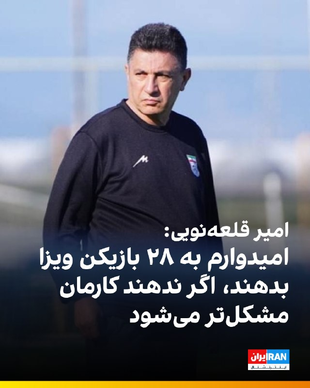
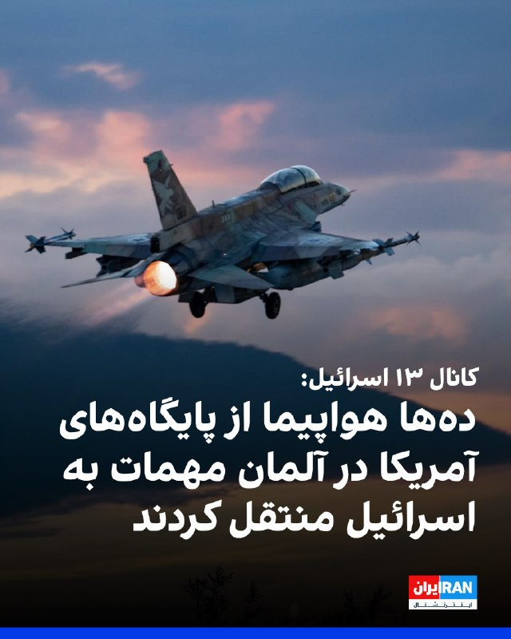

# خواننده تلگرام

<!-- TOP_NAV START -->

<a href="https://github.com/ssilentAbyss/aio-downloader/blob/main/telegram/content/archive_1.md" style="display:inline-block; padding:6px 12px; margin:0 4px; background-color:#2ea44f; color:white; text-decoration:none; border-radius:4px; font-weight:bold;">صفحه بعد</a>

<!-- TOP_NAV END -->

<!-- MSG START -->

---
📅 بروزرسانی: 1405/02/28 17:31
---

## iranintltv — post 337786

  <a href="telegram/content/iranintltv_337786_1779112896.mp4" target="_blank">🎬 Download video</a>

یک دانش‌آموز با ارسال پیامی به ایران‌اینترنشنال می‌گوید: «به ما می‌گویند از حواشی آموزشی فاصله بگیرید و تمرکزتان را روی درس بگذارید. چطور این کار را انجام دهیم وقتی کل کشور شده حاشیه.»

## iranintltv — post 337785

اتحادیه اروپا شبکه تبلیغاتی سپاه پاسداران را در یک عملیات گسترده آنلاین هدف قرار داد

یوروپل اعلام کرد در یک عملیات هماهنگ علیه «محتوای تروریستی در فضای آنلاین»، ۱۴ هزار و ۲۰۰ پست و لینک مرتبط با سپاه پاسداران انقلاب اسلامی را شناسایی کرده و هدف قرار داده است.

سپاه پاسداران در فهرست سازمان‌های تروریستی اتحادیه اروپا قرار گرفته است.

بر اساس گزارش یوروپل که دوشنبه ۲۸ اردیبهشت منتشر شد، این عملیات به رهبری «واحد ارجاع اینترنتی اتحادیه اروپا» (EU IRU) وابسته به یوروپل انجام شد و بر شناسایی و مختل کردن حضور آنلاین سپاه پاسداران تمرکز داشت. حضوری که برای انتشار تبلیغات، جذب نیرو و جمع‌آوری منابع مالی استفاده می‌شد.

یوروپل اعلام کرد ۱۹ کشور از جمله آلمان، اسپانیا، اوکراین، ایتالیا، سوئد، فرانسه، هلند و آمریکا، در این عملیات مشارکت داشتند.

مقام‌ها بین ۲۵ بهمن ۱۴۰۴ تا هشتم اردیبهشت ۱۴۰۵، در چند مرحله هماهنگ، به جمع‌آوری اطلاعات، تطبیق اهداف و ارسال درخواست‌های مشترک برای حذف محتوا از پلتفرم‌های آنلاین پرداختند.
متن کامل این گزارش را اینجا بخوانید
@iranintltv

## iranintltv — post 337784

بلومبرگ: شمار نفتکش‌ها در خارک به بالاترین سطح از زمان آغاز محاصره دریایی آمریکا رسید

پایگاه خبری بلومبرگ گزارش داد هم‌زمان با ادامه تنش‌ها در خلیج فارس، شمار نفتکش‌های حاضر در اطراف جزیره خارک، مهم‌ترین پایانه صادرات نفت ایران، به بالاترین سطح از زمان آغاز محاصره دریایی آمریکا علیه بنادر ایران رسیده است.

بر اساس این گزارش که دوشنبه ۲۸ اردیبهشت منتشر شد، تصاویر ماهواره‌ای ثبت‌شده در ۲۶ اردیبهشت، حضور ۲۳ نفتکش را در اطراف جزیره خارک نشان می‌دهد. این نفتکش‌ها یا در لنگرگاه‌های اطراف مستقر بوده‌اند یا در اسکله‌های بارگیری نفت خام و گاز مایع، پهلو گرفته‌اند.

بلومبرگ ۲۲ اردیبهشت نیز در گزارشی نوشت تصاویر ماهواره‌ای اروپایی نشان می‌دهد در روزهای ۱۸، ۱۹ و ۲۱ اردیبهشت هیچ نفتکش اقیانوس‌پیمایی در پایانه نفتی جزیره خارک دیده نشده است. موضوعی که به گفته این رسانه، نخستین توقف طولانی صادرات نفت ایران از آغاز جنگ محسوب می‌شود.
متن کامل این گزارش را اینجا بخوانید
@iranintltv

## iranintltv — post 337783

  

رویترز به نقل از یک مقام ارشد جمهوری اسلامی گزارش داد تهران از آمریکا خواسته همه دارایی‌ها و منابع مالی ایران را آزاد کند.

این مقام گفت پیشنهاد اصلاح‌شده تهران شامل پایان دائمی جنگ، لغو تحریم‌ها و بازگشایی تنگه هرمز است و موضوع هسته‌ای در مراحل بعدی مذاکرات مطرح خواهد شد.

او افزود واشینگتن تاکنون تنها با آزادسازی ۲۵ درصد از دارایی‌های مسدودشده ایران، آن هم بر اساس جدول زمانی مرحله‌ای، موافقت کرده است.
https://iranintl.com/202605183611

## iranintltv — post 337782

در پی کارزار ایران‌اینترنشنال برای پیدا کردن هویت پیکر جاویدنامان در بیمارستان الغدیر تهران، جزییات تازه‌ای از چگونگی کشته شدن امیرپارسا اشکبوس به دست ما رسیده است؛ جاویدنامی که پیکر او در حیاط پشتی این بیمارستان رها شده بود.
فرنوش فرجی، خبرنگار ایران‌اینترنشنال گزارش می‌دهد.

## iranintltv — post 337781

  

ارتش اسرائیل اعلام کرد نیروهای تیپ ۷۶۹ با پشتیبانی نیروی هوایی یک انبار سلاح ضدتانک حزب‌الله را منهدم کرده‌اند.
ارتش اسرائیل افزود در عملیاتی دیگر در منطقه خیام نیز انبارهای تسلیحات و مراکز استقرار این گروه نابود و پرتابگرهای ضدتانک، مواد منفجره و سلاح‌های سبک کشف شده است.
https://iranintl.com/202605186415

## iranintltv — post 337780

  

پایگاه خبری بلومبرگ گزارش داد هم‌زمان با ادامه تنش‌ها در خلیج فارس، شمار نفتکش‌های حاضر در اطراف جزیره خارک، مهم‌ترین پایانه صادرات نفت ایران، به بالاترین سطح از زمان آغاز محاصره دریایی آمریکا علیه بنادر ایران رسیده است.

بر اساس این گزارش که دوشنبه ۲۸ اردیبهشت منتشر شد، تصاویر ماهواره‌ای ثبت‌شده در ۲۶ اردیبهشت، حضور ۲۳ نفتکش را در اطراف جزیره خارک نشان می‌دهد.

این نفتکش‌ها یا در لنگرگاه‌های اطراف مستقر بوده‌اند یا در اسکله‌های بارگیری نفت خام و گاز مایع، پهلو گرفته‌اند.
https://iranintl.com/202605185927

## iranintltv — post 337779

  

عباس گلرو، عضو کمیسیون امنیت ملی مجلس، محتوای آخرین پیشنهاد جمهوری اسلامی به آمریکا را «خوب» ارزیابی کرد.

گلرو گفت این طرح نشان می‌دهد تهران «بر یک سری مبانی و اصول اساسی مرتبط با حقوق خود اصرار دارد و در عین حال تلاش کرده است راه‌حل‌هایی نیز برای برون‌رفت از وضعیت موجود ارائه دهد».

او افزود: «توپ در زمین آمریکایی‌هاست. باید دید آیا آنها پای میز مذاکره می‌آیند یا خیر.»

این نماینده مجلس ادامه داد: «روند مذاکرات در یک فرایند ساختارمند و با عقل جمعی و حضور مقامات اتخاذ می‌شود. لذا مورد تایید است و انشالله باید همیشه از فضای سیاسی موجود حمایت کنیم.»
https://iranintl.com/202605189531

## iranintltv — post 337778

  <a href="telegram/content/iranintltv_337778_1779112900.mp4" target="_blank">🎬 Download video</a>

روزنامه دنیای اقتصاد نوشت برای تامین حداقل کالری مورد نیاز روزانه افراد، رقم کالابرگ باید بین ۵۰ تا ۱۰۰ درصد افزایش یابد. بر اساس این گزارش، در حالی‌ که قرار بود این طرح به‌عنوان سپر تورمی از معیشت اقشار کم‌درآمد محافظت کند، وضعیت افزایش اعتبار کالابرگ به‌دلیل نبود بودجه همچنان نامشخص است.

ارزیابی اشکان نظام آبادی، روزنامه‌نگار اقتصادی
@iranintltv

## iranintltv — post 337777

  <a href="telegram/content/iranintltv_337777_1779112901.mp4" target="_blank">🎬 Download video</a>

مجری و یک کارشناس نظامی در برنامه‌ای که از صداوسیمای جمهوری اسلامی پخش شد، با اسلحه به تصاویر دونالد ترامپ و بنیامین نتانیاهو شلیک کردند و ابراز امیدواری کردند که چنین اتفاقی در واقعیت رخ دهد.
@iranintltv

## iranintltv — post 337776

  <a href="telegram/content/iranintltv_337776_1779112903.mp4" target="_blank">🎬 Download video</a>

یکی از شهروندان با ارسال ویدیویی به ایران‌اینترنشنال، فضای امنیتی شهر تهران را نشان می‌دهد. در این ویدیو تجمع حامیان حکومت و نظامیان مسلح را در میدان انقلاب تهران می‌بینیم.

## iranintltv — post 337775

  <a href="telegram/content/iranintltv_337775_1779112904.mp4" target="_blank">🎬 Download video</a>

شرکت آلکاتل اعلام کرد، تعمیر کابل‌های زیردریایی در خلیج فارس را به دلیل ناامنی و تهدیدهای سپاه پاسداران متوقف کرده است.

احمد صمدی، خبرنگار ایران‌اینترنشنال، گزارش می‌دهد
@iranintltv

## iranintltv — post 337774

  

روزنامه نیویورک تایمز به نقل از دو مقام خاورمیانه‌ای گزارش داد که ایالات متحده و اسرائیل در حال انجام آماده‌سازی‌های «گسترده» برای احتمال ازسرگیری حملات علیه جمهوری اسلامی هستند.

این مقام‌ها احتمال دادند که حملات ممکن است در هفته جاری آغاز شود.

به نوشته این روزنامه، این سطح از آمادگی نظامی از زمان اجرای آتش‌بس بی‌سابقه بوده است.
https://iranintl.com/202605180651

## iranintltv — post 337773

  <a href="https://t.me/IranintlTV/337773" target="_blank">📎 Download file</a>

🎧نسخه صوتی اخبار نیمروزی | دوشنبه ۲۸ اردیبهشت
@iranintlTV

## iranintltv — post 337772

  <a href="telegram/content/iranintltv_337772_1779112906.mp4" target="_blank">🎬 Download video</a>

مستند کوتاه «هنر مقاومت» به تهیه‌کنندگی ایران‌اینترنشنال و کارگردانی مهران عباسیان، خبرنگار این شبکه، برنده جایزه بهترین مستند کوتاه و بهترین کارگردانی فستیوال فیلم خانه سینمای سوئد شد.
گزارش مهسا مرتضوی، خبرنگار ایران‌اینترنشنال
@iranintltv

## iranintltv — post 337771

  <a href="telegram/content/iranintltv_337771_1779112907.mp4" target="_blank">🎬 Download video</a>

یک شهروند با ارسال ویدیویی به ایران‌اینترنشنال می‌گوید: «برنج آنقدر گران شده که توان خریدش را نداریم. قیمت برنج از دو میلیون تومان شروع می‌شود.»

## iranintltv — post 337770

  <a href="telegram/content/iranintltv_337770_1779112909.mp4" target="_blank">🎬 Download video</a>

اطلاعات رسیده به ایران‌اینترنشنال، جزییات تازه‌ای از چگونگی کشته شدن جاویدنام امیرپارسا اشکبوس، دانشجوی ترم آخر رشته میکروبیولوژی، در جریان انقلاب ملی ایرانیان روایت می‌کند.

گفت‌وگو با فرنوش فرجی، عضو تحریریه ایران‌اینترنشنال

@iranintltv

## iranintltv — post 337769

  

خبرگزاری رویترز به نقل از منابع آگاه گزارش داد پاکستان در چارچوب پیمان دفاعی خود با عربستان سعودی، ۸ هزار نیروی نظامی به همراه یک اسکادران جنگنده و سامانه پدافند هوایی به این کشور اعزام کرده است.

به گزارش رویترز، این نیروها از توان عملیاتی برخوردارند و با هدف حمایت از عربستان سعودی در صورت ازسرگیری حملات علیه این کشور مستقر شده‌اند.

این تحرک نظامی در حالی صورت می‌گیرد که پاکستان نقش اصلی میانجی‌گری میان تهران و واشینگتن را بر عهده دارد.
https://iranintl.com/202605187837

## iranintltv — post 337768

  <a href="telegram/content/iranintltv_337768_1779112911.mp4" target="_blank">🎬 Download video</a>

مسعود پزشکیان با اشاره به وضعیت وخیم اقتصادی در پی محاصره دریایی بندرهای ایران، از کاهش درآمدهای کشور خبر داد و گفت: «دولت به‌دلیل مشکلات تجارت و بازار، امکان اخذ مالیات را ندارد.»

گفت‌وگو با آرش آزرمی، دبیر بخش اقتصادی ایران‌اینترنشنال
@iranintltv

## iranintltv — post 337767

  

🔻روزنامه سان گزارش داد که بازیکنان تیم ملی فوتبال انگلستان در جریان جام جهانی ۲۰۲۶ در آمریکا، رختخواب‌های شخصی خود را همراه خواهند داشت تا کیفیت خواب و روند ریکاوری آن‌ها حفظ شود.

🔹این تصمیم پس از شکایت‌های متعدد درباره تخت‌های خشک و سفت هتل محل اقامت آن‌ها گرفته شده است. اتحادیه فوتبال انگلیس (FA) برای تضمین خواب راحت و باکیفیت بازیکنان، تشک‌های اسفنجی سبک و بالش‌های ویژه‌ای تهیه کرده است. از بازیکنان خواسته شده پتوهای شخصی خود را هم بیاورند تا اتاق هتل حس خانه را داشته باشند.

🔹بر اساس این گزارش، کادر فنی تیم ملی انگلستان به رهبری توماس توخل قصد دارد برای جلوگیری از خستگی و مشکلات ناشی از سفرهای طولانی در آمریکا، شرایط اقامت بازیکنان را تا حد ممکن مشابه خانه فراهم کند.

🔹این تصمیم در حالی گرفته شده که فاصله زیاد شهرهای میزبان جام جهانی ۲۰۲۶، یکی از نگرانی‌های اصلی تیم‌های حاضر در این رقابت‌ها عنوان شده است.

@iranintltvsport

---
📅 بروزرسانی: 1405/02/28 13:39
---

## iranintltv — post 337755

  

رمضان‌علی سنگدوینی، نماینده مجلس، هشدار داد برخی اقلام با «قیمت‌های گزاف و چندبرابر» وارد بازار می‌شوند. او افزود: «آیا مردم با کالابرگ یک میلیون تومانی توان خرید مرغ کیلویی ۴۰۰ هزار تومانی را دارند؟»

زهرا سعیدی مبارکه، دیگر نماینده مجلس، با اشاره به افزایش قیمت مواد غذایی در کشور گفت هر کیلو برنج پاکستانی در پاکستان کمتر از یک دلار و در آلمان یک یورو است، اما در ایران سه دلار به مردم فروخته می‌شود.

علی خزائی، نماینده مجلس، هم سیاست‌های ارزی دولت و افزایش مداوم نرخ ارز از سوی بانک مرکزی را «کاملا اشتباه» دانست و گفت این سیاست‌ها به گرانی و تورم در ایران دامن می‌زنند.
https://iranintl.com/202605181032

## iranintltv — post 337754

  <a href="telegram/content/iranintltv_337754_1779098971.mp4" target="_blank">🎬 Download video</a>

یک شهروند با ارسال پیامی به ایران‌اینترنشنال، نحوه قتل یک شهروند را به دست ماموران جمهوری اسلامی در شامگاه ۱۸ دی ۱۴۰۴ در اعتراضات وکیل‌آباد مشهد روایت می‌کند.

## iranintltv — post 337753

  

🔻اسماعیل بقایی، سخنگوی وزارت خارجه جمهوری اسلامی در نشست خبری درباره صدور روادید برای کادر فنی و تیم ملی فوتبال از سوی آمریکا گفت: «صدور روادید برای حضور تیم ملی فوتبال و کادر فنی، طبق مقررات فیفا، وظیفه دولت‌های میزبان است؛ بنابراین در اینجا فیفا طرف‌حسابِ ماست.»

🔹او گفت: «دو روز پیش در ترکیه، دیدار خوبی میان مسئولان فدراسیون فوتبال و مدیران ارشد فیفا برگزار شد و به ما اطمینان داده شد که فیفا تمام تلاش خود را به کار خواهد گرفت تا اطمینان حاصل شود که مقررات فیفا توسط میزبان‌ها رعایت می‌شود.»

🔹بقایی ادامه داد: «در عین حال، تردیدی نیست که آمریکا بارها تعهدات میزبانی خود را نقض کرده است. همچنین، اظهارنظرهایی که مطرح می‌شود مبنی بر اینکه ممکن است برای برخی از اعضای تیم ملی فوتبال به بهانه‌های خودساخته ویزا صادر نشود، اصلاً قابل قبول نیست و فدراسیون به صورت جدی این موضوع را پیگیری می‌کند.»

@iranintltvsport

## iranintltv — post 337752

  

یوروپل، آژانس اتحادیه اروپا برای همکاری در اجرای قانون، اعلام کرد در اقدامی هماهنگ برای مقابله با محتوای «تروریستی» در فضای مجازی، در مجموع ۱۴ هزار و ۲۰۰ پست و پیوند مرتبط با سپاه پاسداران هدف قرار گرفته است.

به گفته یوروپل، این اقدام با هدایت واحد ارجاع اینترنتی اتحادیه اروپا انجام شد و بر شناسایی و اخلال در حضور آنلاین سپاه که برای انتشار تبلیغات، جذب حامیان و تامین مالی به کار می‌رفت، تمرکز داشت. این تصمیم به نهادهای اجرای قانون اجازه می‌دهد علیه فعالیت اعضا و نهادهای پشتیبان آن در اتحادیه اروپا اقدام کنند.

در این عملیات، ۱۹ کشور شامل اتریش، بلژیک، بوسنی و هرزگوین، بلغارستان، چک، دانمارک، استونی، فنلاند، فرانسه، آلمان، یونان، مجارستان، ایتالیا، هلند، پرتغال، اسپانیا، سوئد، اوکراین و آمریکا مشارکت داشتند. مقام‌ها بین ۲۲ اسفند تا هشتم اردیبهشت در مراحل هماهنگ زیر نظر یوروپل اقدام به جمع‌آوری اطلاعات، تطبیق اهداف و ارجاع مشترک محتوا به پلتفرم‌های آنلاین کردند.
https://iranintl.com/202605183052

## iranintltv — post 337751

  

اسماعیل بقائی، سخنگوی وزارت خارجه جمهوری اسلامی، درباره احتمال ازسرگیری جنگ گفت دیپلماسی جمهوری اسلامی «هوشمندانه» است، اما تهران با تمام توان برای هر سناریویی آماده است.

اسماعیل بقائی گفت: «دیپلماسی جمهوری اسلامی هوشمندانه است»، اما در عین حال تاکید کرد جمهوری اسلامی در برابر هر اقدام «دیوانه‌باری» با تمام توان دفاع می‌کند.

او همچنین افزود نیروهای نظامی «سورپرایزهایی» خواهند داشت.
https://iranintl.com/202605183625

## iranintltv — post 337750

  <a href="telegram/content/iranintltv_337750_1779098977.mp4" target="_blank">🎬 Download video</a>

بیمارستان الغدیر تهران در شب‌های ۱۸ و ۱۹ دی‌ماه یکی از قتل‌گاه‌های جمهوری اسلامی بود. در پی کارزار ایران‌اینترنشنال در خصوص ارسال اطلاعات بیشتر برای شناسایی پیکرهای جاویدنامان در این بیمارستان، اطلاعات و تصاویری به دست ما رسیده که بخشی از آن را در این ویدیو می‌بینید.
شاهدان و خانواده‌ها می‌توانند برای ثبت حقیقت این جنایت، اسناد، تصاویر و روایت‌های خود را از طریق بات اینتل‌مدیا ارسال کنند.

## iranintltv — post 337749

  

اسماعیل بقایی، سخنگوی وزارت خارجه جمهوری اسلامی، در پاسخ به پرسشی درباره گزارش‌ها از قصد امارات متحده عربی برای حمله به جمهوری اسلامی و سفر مقام‌های اسرائیلی به این کشور گفت: «ما قرار نیست با گزارش‌ها این واقعیت را از یاد ببریم که تهدید اصلی کدام طرف است.»

بقایی با تهدید کشورهای منطقه از جمله امارات متحده عربی گفت: « اماراتی‌ها از اتفاقاتی که در دو سه ماه اخیر افتاد باید درس بگیرند.»

او اضافه کرد: «ما با هیچ کشور منطقه دشمنی نداریم و با همه همسایه هستیم. همه را به مراقبت به دسیسه‌های طرف‌های خارجی برای ایجاد تفرقه دعوت می‌کنیم.»

بقایی گفت رفت‌وآمد مقام‌های اسرائیلی به منطقه از دید جمهوری اسلامی «مخفی نبوده» و این رفت‌وآمدها، اسرائیل را برای ادامه «جنایات» در منطقه جری‌تر کرده است.
https://iranintl.com/202605189537

## iranintltv — post 337748

  <a href="telegram/content/iranintltv_337748_1779098980.mp4" target="_blank">🎬 Download video</a>

یک شهروند با ارسال پیامی به ایران‌اینترنشنال می‌گوید اینترنت پرو خریده و با وجود مصرف کم، بعد از دو روز به او پیام داده‌اند که نصف حجم را مصرف کرده‌اند: «اصلا نمی‌فهمم چطور این حجم استفاده شده. بنظر می‌رسد دولت از همین هم سوءاستفاده می‌کند.»

## iranintltv — post 337747

  

🔻فوتبال آلمان شاهد یکی از بزرگ‌ترین شگفتی‌های تاریخ خود است؛ باشگاه کوچک «الفرسبرگ» (SVE) با پیروزی ۳ بر صفر مقابل مونستر، برای نخستین بار در تاریخ ۱۰۹ ساله‌ی خود به بوندس‌لیگا صعود کرد. این تیم که در ایالت زارلاند واقع شده، نماینده‌ی شهری با جمعیت تنها ۱۳ هزار نفر است.

🔹به نوشته‌ روزنامه‌ بیلد، این منطقه حتی یک ایستگاه قطار هم ندارد، اما حالا آماده است تا در بالاترین سطح فوتبال آلمان حضور پیدا کند. الفرسبرگ پنجاه‌ونهمین تیم تاریخ بوندس‌لیگا و چهارمین نماینده‌ی ایالت زارلاند در این رقابت‌هاست.

🔹پشت پرده‌ این صعود معجزه‌آسا، فرانک هولتسر ۷۳ ساله، حامی مالی باشگاه و بازیکن سابق فوتبال قرار دارد. او پس از تحصیل در رشته داروسازی، شرکت داروسازی «اورسافارم» را تأسیس کرد؛ شرکتی که حامی مالی بایرن مونیخ نیز هست.

جزییات بیشتر را در سایت بخوانید

@iranintltvsport

## iranintltv — post 337746

  

دونالد ترامپ، رییس‌جمهوری آمریکا، در مصاحبه با مجله فورچون گفت مقام‌های جمهوری اسلامی برای امضای توافق «بی‌تاب» هستند، اما پس از رسیدن به توافق، متنی ارسال می‌کند که به گفته او «هیچ ربطی به توافق انجام‌شده ندارد».

ترامپ گفت: «ایرانی‌ها برای امضای توافق بی‌تاب هستند. اما وقتی توافق می‌کنند، بعد از آن برگه‌ای برایت می‌فرستند که هیچ ربطی به توافقی که انجام داده‌اند ندارد. من به آن‌ها می‌گویم شما دیوانه هستید؟»
https://iranintl.com/202605187853

## iranintltv — post 337745

  

خبرگزاری رویترز به نقل از یک منبع پاکستانی گزارش داد که اسلام‌آباد پیشنهاد اصلاح‌شده جمهوری اسلامی برای پایان دادن به درگیری در خاورمیانه را با آمریکا به اشتراک گذاشته است.

این منبع در پاسخ به پرسشی درباره زمان لازم برای رفع اختلاف‌ها گفت: «وقت زیادی نداریم.» او افزود دو کشور «مدام خط قرمزهای خود را تغییر می‌دهند.»
https://iranintl.com/202605185818

## iranintltv — post 337744

  <a href="telegram/content/iranintltv_337744_1779098986.mp4" target="_blank">🎬 Download video</a>

پلیس ترکیه از قتل هولناک یک زن میانسال ایرانی‌تبار در استانبول خبر داد. مقامات امنیتی این کشور ۳ نفر را در ارتباط با قتل فرخنده قائم‌مقامی، زن ۶۸ ساله ایرانی بازداشت کردند.

نرگس هورخش، خبرنگار ایران‌اینترنشنال، گزارش می‌دهد
@iranintltv

## iranintltv — post 337743

  <a href="telegram/content/iranintltv_337743_1779098988.mp4" target="_blank">🎬 Download video</a>

هم‌زمان با ادامه فشارهای اقتصادی و محدودیت‌های تجاری جمهوری اسلامی، صادرات افغانستان به ایران افزایش کم‌سابقه‌ای داشته است.

جواد همدانی، خبرنگار ایران‌اینترنشنال، گزارش می‌دهد
@iranintltv

## iranintltv — post 337742

  <a href="telegram/content/iranintltv_337742_1779098991.mp4" target="_blank">🎬 Download video</a>

همزمان با به بن‌بست خوردن مذاکرات میان واشینگتن و تهران و افزایش احتمال از سرگیری عملیات نظامی آمریکا و اسرائیل علیه جمهوری اسلامی، دونالد ترامپ هشدار داد: «زمان برای حکومت ایران به‌سرعت در حال پایان است.»

گفت‌وگو با محمد جواد اکبرین، عضو تحریریه ایران‌اینترنشنال
@iranintltv

## iranintltv — post 337741

  <a href="telegram/content/iranintltv_337741_1779098994.mp4" target="_blank">🎬 Download video</a>

همزمان با به بن‌بست خوردن مذاکرات میان واشینگتن و تهران، ترامپ گفت زمان برای رهبران جمهوری اسلامی رو به پایان است. رسانه‌های اسرائیل از آمادگی اورشلیم و واشینگتن برای ازسرگیری عملیات نظامی گزارش دادند.

اشکان صفایی، خبرنگار ایران‌اینترنشنال، گزارش می‌دهد
@iranintltv

## iranintltv — post 337740

  

علی بابایی کارنامی، رییس کمیسیون اجتماعی مجلس، اعلام کرد پس از جنگ اخیر، آمار بیکاری در کشور به‌صورت فزاینده‌ای رشد یافته و پیش‌بینی می‌شود بین ۲۲۰ تا ۴۰۰ هزار کارگر شغل خود را از دست بدهند.

او با اشاره به شرایط بحرانی بازار کار پیشنهاد کرد دولت مشابه دوران کرونا، حمایت مالی مستقیمی برای کارگران در نظر بگیرد و مبالغی به حساب آنان واریز کند تا امکان حفظ همکاری میان کارگران و کارفرمایان فراهم شود.

بابایی کارنامی افزود برای اجرای این طرح، لازم است هرچه سریع‌تر بخشنامه‌های لازم به استان‌ها ابلاغ شود، زیرا کارگران و کارفرمایان در انتظار تصمیم فوری دولت هستند.
https://iranintl.com/202605182561

## iranintltv — post 337739

  <a href="telegram/content/iranintltv_337739_1779098997.mp4" target="_blank">🎬 Download video</a>

ویدیوهای تازه رسیده به ایران‌اینترنشنال، بی‌تابی مادر جاویدنام متین پرویزی را در مراسم تولد او بر مزارش در هشتم فروردین نشان می‌دهد.
متین پرویزی، ۲۶ ساله، ۱۹ دی ۱۴۰۴ در زنجان از ناحیه پا هدف گلوله قرار گرفت و بر زمین افتاد. سپس مأموران به او تیر خلاص زدند.

## iranintltv — post 337738

  

نت‌بلاکس دوشنبه ۲۸ اردیبهشت اعلام کرد هشتادمین روز از قطع اینترنت در ایران است و مدت این اختلال به ۱۸۹۶ ساعت رسیده است.

بر اساس گزارش این نهاد ناظر بر اینترنت جهانی، همزمان با تداوم این وضعیت، محتوای حامی حکومت شبکه‌های اجتماعی را پر کرده است.

این نهاد همچنین اعلام کرد برخی از ایرانیانی که برای دریافت اینترنت «پرو» یا دسترسی سیم‌کارت سفید اقدام کرده‌اند، می‌گویند از آن‌ها خواسته می‌شود سهمیه‌ای از پست‌های تبلیغاتی روزانه منتشر کنند.

نت‌بلاکس افزود این فعالیت‌ها با استفاده از هوش مصنوعی نظارت می‌شود.
https://iranintl.com/202605188378

## iranintltv — post 337737

  

🔻تیم ملی فوتبال ایران در آستانه آغاز رقابت‌های جام جهانی با بحران ویزا مواجه است. تا این لحظه، هنوز روادید بازیکنان ایران صادر نشده و همین موضوع به دغدغه اصلی امیر قلعه‌نویی، سرمربی تیم ملی، تبدیل شده است.

🔹امیر قلعه‌نویی پیش از اعزام کاروان تیم ملی به ترکیه، درباره آخرین وضعیت آماده‌سازی تیم و صدور ویزا گفت: «بازیکنان شایسته‌ای داشتیم که مجبور بودیم تعدادی از آن‌ها را انتخاب کنیم. انتخاب بازیکنان بسیار سخت بود اما این تصمیم بر اساس برنامه‌های تاکتیکی گرفته شد. البته از همین فهرست فعلی هم چند نفر حذف می‌شوند. امیدواریم در نهایت به ۲۸ بازیکن این فهرست ویزا بدهند، چرا که اگر ویزا صادر نشود، کارمان بسیار مشکل‌تر می‌شود.»

🔹او با اشاره به وضعیت آمادگی جسمانی بازیکنان افزود: «به دلیل مشکلات بدنی، در سه بخش حدود ۴۰ درصد عقب هستیم. البته در اردوی اخیر توانستیم ۲۵ درصد از این عقب‌ماندگی را جبران کنیم و امیدواریم تا ۲۶ خرداد بتوانیم بازیکنان را به شرایط ایده‌آل برسانیم.»

@iranintltvsport

## iranintltv — post 337736

  

کانال ۱۳ اسرائیل گزارش داد در ۲۴ ساعت گذشته ده‌ها هواپیمای باری خالی از اسرائیل برخاستند، در پایگاه‌های آمریکایی در آلمان فرود آمدند، مهمات بارگیری کردند و سپس به اسرائیل بازگشتند.

بر اساس این گزارش، ارتش اسرائیل در روزهای اخیر در سطح بالایی از آماده‌باش قرار داشته و تاریخی را برای آمادگی تعیین کرده است.

کانال ۱۳ جزئیات بیشتری درباره نوع مهمات یا هدف از این جابه‌جایی منتشر نکرده است.
https://iranintl.com/202605184450

<!-- MSG END -->

<!-- NAV START -->

<a href="https://github.com/ssilentAbyss/aio-downloader/blob/main/telegram/content/archive_1.md" style="display:inline-block; padding:6px 12px; margin:0 4px; background-color:#2ea44f; color:white; text-decoration:none; border-radius:4px; font-weight:bold;">صفحه بعد</a>

<!-- NAV END -->
