# خواننده تلگرام

<!-- TOP_NAV START -->

<!-- TOP_NAV END -->

<!-- MSG START -->

---
📅 بروزرسانی: 1405/02/20 12:30
---

## Persian_Trend_Official — post 13813

کانال رسمی پرشین ترند pinned «https://youtube.com/shorts/3Y-nec_YFoI?si=BzoGOXd-FGHyJLOw»

## Persian_Trend_Official — post 13812

https://youtube.com/shorts/3Y-nec_YFoI?si=BzoGOXd-FGHyJLOw

---
📅 بروزرسانی: 1405/02/20 12:21
---

## Configir98 — post 8520

  <a href="https://t.me/Configir98/8520" target="_blank">📎 Download file</a>

🛜 𝗡𝗽𝘃 𝗧𝘂𝗻𝗻𝗲𝗹 𝗡𝗮𝗽𝘀𝘁𝗲𝗿𝗻𝗲𝘁𝗩

🛡️ Password: @Configir98

✅ @Configir98

## Configir98 — post 8519

🔥 همین الان 
0️⃣
0️⃣
1️⃣ تا کانفیگ اختصاصی داخل ربات شارج شد

میتونین با دعوت دوستاتون یک سرور اختصاصی به حجم 
🚀 
0️⃣
0️⃣
8️⃣ مگابایت
🚀 دریافت کنین 
💎

🤖 @ConfigFreeiR_Bot

## Configir98 — post 8518

  <a href="telegram/content/Configir98_8518_1778403063.mp4" target="_blank">🎬 Download video</a>

🔴رئیس اتحادیه کسب‌وکارهای اینترنتی: درآمد برخی فعالان شبکه‌های اجتماعی به نزدیک صفر رسیده است.

## Configir98 — post 8517

🔴رئیس اتحادیه کسب‌وکارهای اینترنتی:

درآمد برخی فعالان شبکه‌های اجتماعی به نزدیک صفر رسیده است.

## Configir98 — post 8516

خودم طرفدار تیم فنر باغچه ی لیسبونگ سوئیسم 
😒

## Configir98 — post 8515

  <a href="telegram/content/Configir98_8515_1778403064.webm" target="_blank">🎬 Download video</a>

🚨امروز الکلاسیکو داریم

رئالیا ❤️ بزارن

بارساییا 🔥 بزار

## Configir98 — post 8514

  <a href="https://t.me/Configir98/8514" target="_blank">📎 Download file</a>

🛜 𝗡𝗽𝘃 𝗧𝘂𝗻𝗻𝗲𝗹 𝗡𝗮𝗽𝘀𝘁𝗲𝗿𝗻𝗲𝘁𝗩

🛡️ Password: @Configir98

✅ @Configir98

## Configir98 — post 8513

اسم این زندگــــــی نبود
یک مبارزه تمام عیار بود...

## Configir98 — post 8512

🔐 𝗩𝟮𝗿𝗮𝘆𝗡𝗚 
➕ 𝗣𝘀𝗶𝗽𝗵𝗼𝗻 
📱

vless://f3ef1255-1807-45d5-8872-324c6943175b@iman.neticoapp.ir:80/?type=ws&encryption=none&flow=&host=srv3.diamond-tech.online&path=%2F#https://t.me/Configir98

✅ @Configir98

## Persian_Trend_Official — post 13811

  

🔴 کره شمالی «حمله هسته‌ای خودکار» را وارد قانون اساسی کرد

بر اساس گزارش روزنامه «تلگراف»، کره شمالی قانون اساسی خود را به‌گونه‌ای اصلاح کرده که در صورت کشته شدن یا ناتوان شدن «کیم جونگ اون» بر اثر حمله خارجی، پاسخ هسته‌ای به‌صورت خودکار الزامی شود.

طبق این گزارش:

▪️ اگر ساختار فرماندهی نیروهای هسته‌ای کره شمالی در معرض تهدید قرار گیرد
▪️ ارتش موظف است فوراً حمله هسته‌ای تلافی‌جویانه را آغاز کند

🫆:Tony

📌 @persian_trend_official
پرشین ترند | متفاوت‌ترین کانال نظامی

## Persian_Trend_Official — post 13810

  

🔴 دقایقی پیش یک فروند جنگنده F-35 Lightning II متعلق به نیروی هوایی ایالات متحده، هنگام پرواز بر فراز دریای عمان، کد اضطراری ۷۷۰۰ را ارسال کرد.

🔹این کد نشان‌دهنده بروز وضعیت اضطراری جدی و نیاز فوری هواپیما به فرود است.

☆Phantom☆
📌 @persian_trend_official
پرشین ترند | متفاوت‌ترین کانال نظامی

## configx2ray — post 38710

  <a href="https://t.me/ConfigX2ray/38710" target="_blank">📎 Download file</a>

کانفیگ برای Npv tunnel ⭕️

به هیچ وج دانلود نزنید باهاش
❤️

رمز فایل : @ConfigX2ray

Channel : https://t.me/ConfigX2ray

## Configir98 — post 8520

  <a href="https://t.me/Configir98/8520" target="_blank">📎 Download file</a>

🛜 𝗡𝗽𝘃 𝗧𝘂𝗻𝗻𝗲𝗹 𝗡𝗮𝗽𝘀𝘁𝗲𝗿𝗻𝗲𝘁𝗩

🛡️ Password: @Configir98

✅ @Configir98

## Configir98 — post 8519

🔥 همین الان 
0️⃣
0️⃣
1️⃣ تا کانفیگ اختصاصی داخل ربات شارج شد

میتونین با دعوت دوستاتون یک سرور اختصاصی به حجم 
🚀 
0️⃣
0️⃣
8️⃣ مگابایت
🚀 دریافت کنین 
💎

🤖 @ConfigFreeiR_Bot

## Configir98 — post 8518

  <a href="telegram/content/Configir98_8518_1778403068.mp4" target="_blank">🎬 Download video</a>

🔴رئیس اتحادیه کسب‌وکارهای اینترنتی: درآمد برخی فعالان شبکه‌های اجتماعی به نزدیک صفر رسیده است.

## Configir98 — post 8517

🔴رئیس اتحادیه کسب‌وکارهای اینترنتی:

درآمد برخی فعالان شبکه‌های اجتماعی به نزدیک صفر رسیده است.

## Configir98 — post 8516

خودم طرفدار تیم فنر باغچه ی لیسبونگ سوئیسم 
😒

## Configir98 — post 8515

  <a href="telegram/content/Configir98_8515_1778403069.webm" target="_blank">🎬 Download video</a>

🚨امروز الکلاسیکو داریم

رئالیا ❤️ بزارن

بارساییا 🔥 بزار

## Configir98 — post 8514

  <a href="https://t.me/Configir98/8514" target="_blank">📎 Download file</a>

🛜 𝗡𝗽𝘃 𝗧𝘂𝗻𝗻𝗲𝗹 𝗡𝗮𝗽𝘀𝘁𝗲𝗿𝗻𝗲𝘁𝗩

🛡️ Password: @Configir98

✅ @Configir98

## Configir98 — post 8513

اسم این زندگــــــی نبود
یک مبارزه تمام عیار بود...

## Configir98 — post 8512

🔐 𝗩𝟮𝗿𝗮𝘆𝗡𝗚 
➕ 𝗣𝘀𝗶𝗽𝗵𝗼𝗻 
📱

vless://f3ef1255-1807-45d5-8872-324c6943175b@iman.neticoapp.ir:80/?type=ws&encryption=none&flow=&host=srv3.diamond-tech.online&path=%2F#https://t.me/Configir98

✅ @Configir98

---
📅 بروزرسانی: 1405/02/20 11:14
---

## Dirty_Kids — post 389205

تتوی جدید ریحانا از نقاشی بچش
داداش خب یه شیش ماه صبر میکردی شاید تو نقاشی پیشرفت میکرد

@Dirty_Kids 👻

## Dirty_Kids — post 389204

  <a href="telegram/content/Dirty_Kids_389204_1778399058.mp4" target="_blank">🎬 Download video</a>

شکار سربازان و تجهیزات ارتش روسیه با کمک #پهپاد_انتحاری
🇺🇦🇷🇺

@Dirty_Kids 👻

## configx2ray — post 38709

  <a href="telegram/content/configx2ray_38709_1778399059.webm" target="_blank">🎬 Download video</a>

vless://f3ef1255-1807-45d5-8872-324c6943175b@iman.neticoapp.ir:80/?type=ws&encryption=none&flow=&host=srv3.diamond-tech.online&path=%2F#https://t.me/ConfigX2ray

ترکیبی با سایفون وصله 
✅

آموزش استفادع : 
👇
https://t.me/ConfigX2ray0/1665

Channel : https://t.me/ConfigX2ray

---
📅 بروزرسانی: 1405/02/20 11:07
---

## VahidOOnLine — post 239230

  

حمیدرضا حاجی‌بابایی، نایب‌رییس مجلس گفت: «پس از ناامیدی از اغتشاشات داخلی، آمریکا با همراهی ۵۴ کشور یک جنگ تمام‌عیار نظامی علیه ما آغاز کرد اما سیاست ما نه سازش و نه تسلیم؛ نبرد با آمریکاست.»

او ادامه داد: «آمریکا قصد داشت با جلوگیری از جابه‌جایی نفت، ما را تحت فشار قرار دهد، اما ما با باز کردن مرز‌های ۱۶ استان کشور این توطئه را خنثی کردیم.»

او افزود: «دنیا می‌داند اگر تنگه هرمز بسته بماند، در کمتر از یک ماه بحران عظیم نفتی و افزایش شدید قیمت‌ها گریبان اروپا و آمریکا را خواهد گرفت.»
‌🏁 🇬🇧 IranintlTV

🤖 @VahidOOnLine

## VahidOOnLine — post 239229

  <a href="telegram/content/VahidOOnLine_239229_1778398674.mp4" target="_blank">🎬 Download video</a>

ویدیوهای ارسال‌شده به ایران‌اینترنشنال نشان می‌دهند ایرانیان مقیم نیوزیلند یکشنبه ۲۰ اردیبهشت در پاسخ به فراخوان شاهزاده رضا پهلوی و علیه اعدام‌های جمهوری اسلامی، در شهر اوکلند تجمع کردند.
‌🏁 🇬🇧 IranintlTV

🤖 @VahidOOnLine

## VahidOOnLine — post 239228

  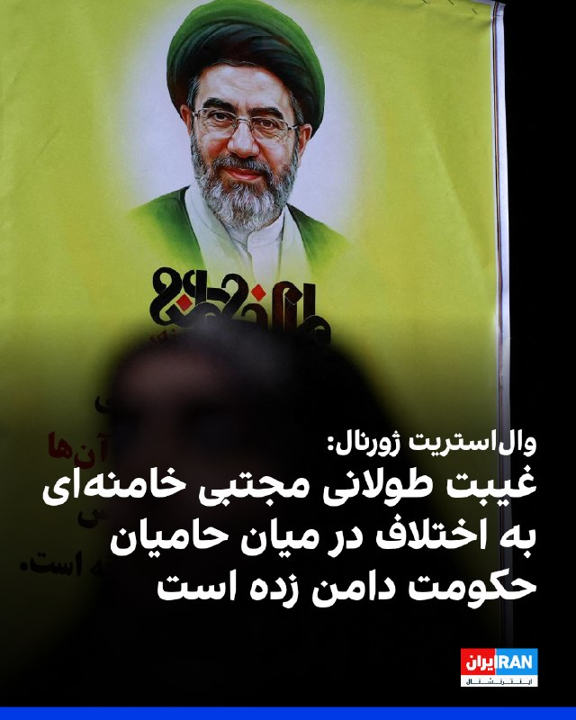

وال‌استریت ژورنال به نقل از مقام‌های آمریکایی و ایرانی گزارش داد مجتبی خامنه‌ای پس از جراحت شدید در حمله‌ای هوایی که به کشته شدن همسرش و علی خامنه‌ای انجامید، بیش از دو ماه است در انظار عمومی ظاهر نشده و غیبت او به اختلاف میان حامیان حکومت بر سر مذاکره با آمریکا دامن زده است.

بر اساس این گزارش مقام‌های جمهوری اسلامی در حالی برای پایان دادن به جنگ به دنبال توافق‌اند که رهبر جدیدشان از انظار عمومی غایب است و درباره مذاکرات سکوت کرده است.

به نوشته این روزنامه، از زمان حمله هوایی ۹ اسفند، تنها پیام‌هایی منتسب به خامنه‌ای و تصاویری از او منتشر شده که به نظر می‌رسد با هوش مصنوعی تولید یا دستکاری شده‌اند؛ از جمله تصویر حساب او در ایکس و بیلبوردهای تبلیغاتی.

مقام‌های جمهوری اسلامی نیز هیچ تصویر تازه یا فایل صوتی از او منتشر نکرده‌اند و همین باعث شده برخی شهروندان درباره زنده بودن او پرسش‌هایی مطرح کنند.

در ادامه این گزارش آمده است غیبت طولانی رهبر جدید جمهوری اسلامی اکنون به مشکلی جدی برای تهران تبدیل شده، زیرا مقام‌های حکومت بر سر میزان امتیازدهی به آمریکا برای رسیدن به توافق دچار اختلاف شده‌اند.
https://iranin
‌🏁 🇬🇧 IranintlTV

🤖 @VahidOOnLine

## VahidOOnLine — post 239227

  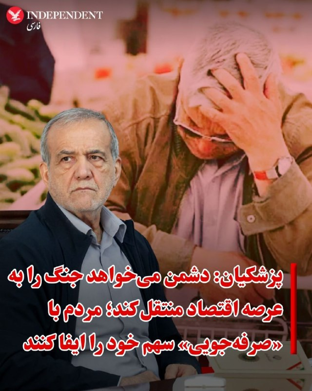

♦️مسعود پزشکیان، رئیس جمهوری اسلامی روز یکشنبه ۱۹ اردیبهشت در نشستی تاکید کرد که مردم باید با «صرفه‌جویی» در مصرف انرژی، سهم خود را در میدان ایفا کنند.
پزشکیان گفت: «دشمن پس از ناکامی در جنگ نظامی، تلاش دارد جنگ را به عرصه اقتصاد منتقل کند و مردم باید با نقش‌آفرینی و همراهی خود، این توطئه را نیز ناکام بگذارند.»
او تاکید کرد که کشور نیازمند یک حرکت فراگیر مردمی در «راستای اصلاح الگوی مصرف» و «تقویت مشارکت اجتماعی» است.
مسعود پزشکیان اضافه کرد: «نیرو‌های مسلح وظایف خود را در مقابله با دشمن به‌خوبی انجام می‌دهند و مردم نیز باید با صرفه‌جویی در مصرف انرژی، سهم خود را در این میدان ایفا کنند.»
پیشتر اسماعیل سقاب اصفهانی، معاون پزشکیان و رییس سازمان بهینه‌سازی انرژی از آسیب‌دیدگی بخشی از شبکه گاز و سوخت کشور خبر داده و گفته بود «حتی اگر همه منابع مالی و دسترسی‌ها فراهم باشد، تابستان امسال دوره‌ای سخت در حوزه انرژی خواهد بود و همراهی مردم در صرفه‌جویی، نقشی تعیین‌کننده دارد.»
‌🇸🇦 Indypersian

🤖 @VahidOOnLine

## VahidOOnLine — post 239226

  <a href="telegram/content/VahidOOnLine_239226_1778398677.mp4" target="_blank">🎬 Download video</a>

ویدیوی ارسال شده به ایران‌اینترنشنال نشان می‌دهد ایرانیان ۱۹ اردیبهشت در سن‌خوزه کالیفرنیا در آمریکا، علیه جمهوری اسلامی در خیابان‌های شهر کاروان خودرویی به راه انداختند و پرچم‌های شیروخورشید به دست گرفتند.
‌🏁 🇬🇧 IranintlTV

🤖 @VahidOOnLine

## VahidOOnLine — post 239225

  

مسعود پزشکیان در جلسه طرح «محله‌محوری و مسجدمحوری» گفت: «مردم باید بدانند خاموش کردن یک چراغ، به‌مثابه شلیک یک تیر به سمت دشمن در جنگ فعلی است و اگر جامعه به این وظیفه عمل کند، بسیاری از مشکلات کشور قابل مدیریت خواهد بود.»

پزشکیان اضافه کرد: «نیرو‌های مسلح وظایف خود را در مقابله با دشمن به‌خوبی انجام می‌دهند و مردم نیز باید با صرفه‌جویی در مصرف انرژی، سهم خود را در این میدان ایفا کنند.»

او افزود: «دشمن پس از ناکامی در جنگ نظامی، تلاش دارد جنگ را به عرصه اقتصاد منتقل کند و مردم باید با نقش‌آفرینی و همراهی خود، این توطئه را نیز ناکام بگذارند.»

او ادامه داد: «اگر هر یک از مردم تنها یک چراغ اضافه را خاموش کنند، قطعا کشور با مشکل برق مواجه نخواهد شد.»
‌🏁 🇬🇧 IranintlTV

🤖 @VahidOOnLine

## VahidOOnLine — post 239224

⭕️ سخنگوی ارتش جمهوری اسلامی:
هیچ‌کدام از اهداف دشمن محقق نشد

♦️سخنگوی ارتش جمهوری اسلامی ایران در گفتگو با ایرنا گفت: «اگر دشمن بار دیگر دچار خطای محاسباتی شود، این‌بار با گزینه‌های غافلگیرکننده‌تری روبه‌رو خواهد شد، از تجهیزات پیشرفته و شیوه‌های نوین جنگ گرفته تا عرصه‌های جدید نبرد.»
محمد اکرمی‌نیا هدف اصلی «دشمن» را نه فقط ضربه نظامی، بلکه ایجاد آشوب داخلی و حتی تجزیه ایران عنوان کرد، هدفی که به گفته او «به‌طور کامل شکست خورد».
او مدعی شد برخلاف تصور آمریکا و اسرائیل، مردم ایران نه‌تنها از نظام فاصله نگرفتند، بلکه با حضور گسترده و حمایت از نیروهای مسلح، بزرگ‌ترین غافلگیری دشمن را رقم زدند. سخنگوی ارتش همچنین از مدیریت «فعال و تهاجمی» نیروهای مسلح در طول ۴۰ روز نبرد سخن گفت و افزود «دشمن» پس از ناتوانی در شکستن مقاومت ایران، ناچار به پذیرش آتش‌بس شد.
اکرمی‌نیا گفت: «دشمن تصور می‌کرد ظرف چند روز می‌تواند ایران را دچار فروپاشی کند، اما امروز نه‌تنها به اهدافش نرسیده بلکه با یک ایران منسجم‌تر و مقتدرتر مواجه شده است.»
‌🇸🇦 Indypersian

🤖 @VahidOOnLine

## VahidOOnLine — post 239223

  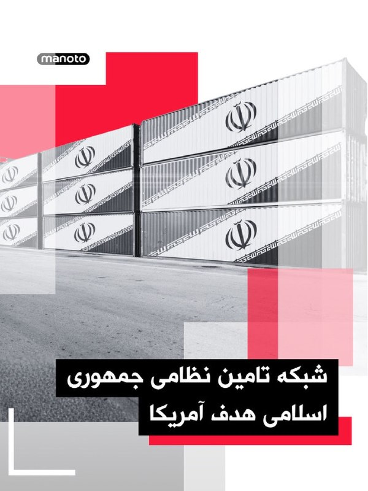

وزارت خارجه آمریکا اعلام کرد در راستای فشار بر جمهوری اسلامی، اقداماتی برای «مختل کردن شبکه‌های تأمین نظامی برون‌مرزی ایران» انجام داده است.

دفتر امور خاور نزدیک وزارت خارجه آمریکا با انتشار بیانیه‌ای اعلام کرد این اقدامات با هدف محدود کردن دسترسی جمهوری اسلامی به تجهیزات، فناوری و شبکه‌های خرید خارجی مرتبط با فعالیت‌های نظامی صورت گرفته است.

در این بیانیه جزئیات بیشتری درباره افراد یا نهادهای هدف قرار گرفته منتشر نشده.
‌🏁 🇬🇧 ManotoTV

🤖 @VahidOOnLine

## VahidOOnLine — post 239222

  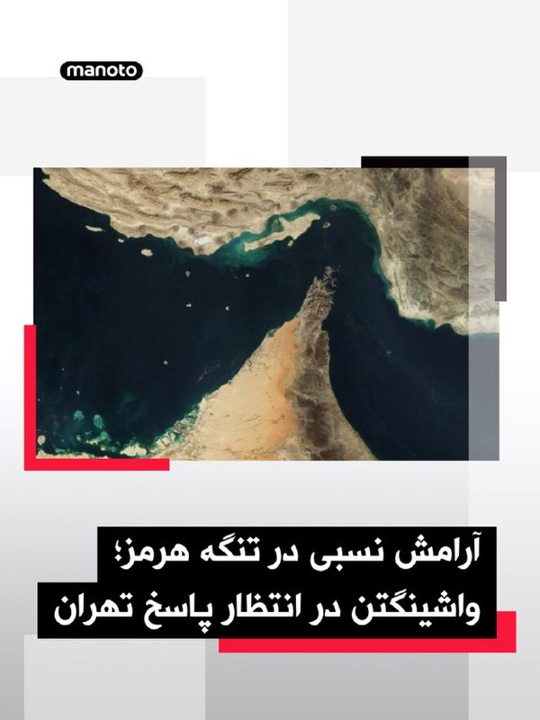

خبرگزاری رویترز گزارش داد روز شنبه ۹ مه، پس از چند روز تنش پراکنده، آرامش نسبی در اطراف تنگه هرمز برقرار بود.

همزمان، آمریکا در انتظار پاسخ جمهوری اسلامی به تازه‌ترین پیشنهاد واشینگتن برای پایان دادن به بیش از دو ماه درگیری و آغاز مذاکرات صلح است.

مارکو روبیو، وزیر خارجه آمریکا، روز جمعه گفته بود واشینگتن انتظار دارد تهران «ظرف چند ساعت» پاسخ دهد؛ اما با گذشت یک روز، هنوز نشانه‌ای از واکنش رسمی جمهوری اسلامی دیده نشده است.
‌🏁 🇬🇧 ManotoTV

🤖 @VahidOOnLine

## VahidOOnLine — post 239221

  <a href="telegram/content/VahidOOnLine_239221_1778398681.mp4" target="_blank">🎬 Download video</a>

گردهمایی ایرانیان نیوزیلند
‌🏁 🇬🇧 ManotoTV

🤖 @VahidOOnLine

## VahidOOnLine — post 239220

  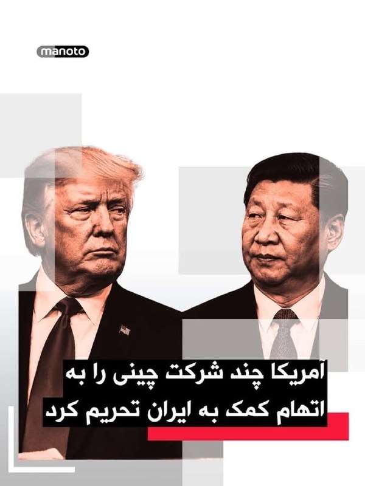

آمریکا سه شرکت ماهواره‌ای چینی و یک نهاد وابسته به وزارت دفاع جمهوری اسلامی را به اتهام کمک اطلاعاتی به تهران تحریم کرد.

وزارت خارجه آمریکا مدعی است این شرکت‌ها با ارائه تصاویر و داده‌های ماهواره‌ای، به جمهوری اسلامی برای حمله به نیروهای آمریکایی در خاورمیانه کمک کرده‌اند.

مارکو روبیو گفته واشینگتن علیه نهادها و افرادی که به برنامه‌های نظامی جمهوری اسلامی کمک کنند، اقدام خواهد کرد. چین نیز این تحریم‌ها را «یک‌جانبه و فاقد مبنای حقوقی» توصیف کرده است.

این اقدام چند روز پیش از سفر دونالد ترامپ به پکن انجام شده است.
‌🏁 🇬🇧 ManotoTV

🤖 @VahidOOnLine

## VahidOOnLine — post 239219

  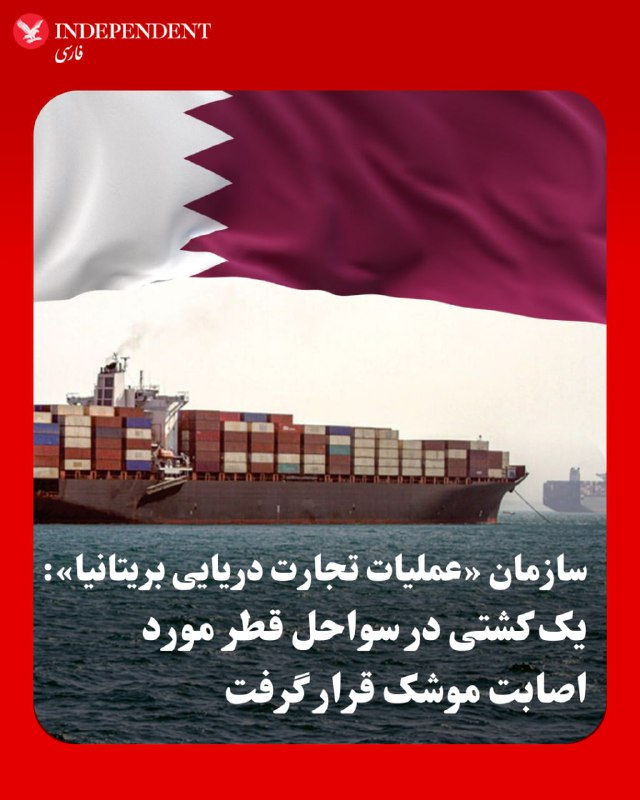

♦️خبرگزاری فرانسه به نقل از سازمان «عملیات تجارت دریایی بریتانیا» (UKMTO) گزارش داد که یک موشک ناشناس صبح یکشنبه ۱۹ اردیبهشت پس از تهدید سپاه پاسداران انقلاب اسلامی ایران به هدف قرار دادن کشتی‌های آمریکایی در منطقه، به یک کشتی در سواحل قطر برخورد کرد.

مرکز عملیات تجارت دریایی بریتانیا اعلام کرد که یک کشتی باری در ۲۳ مایل دریایی (۳۷ کیلومتری) شمال شرقی دوحه مورد اصابت یک «موشک ناشناس» قرار گرفته است.

بنا بر این گزارش یک آتش‌سوزی کوچک در این کشتی رخ داده که خاموش شده است و تلفات جانی نیز نداشته است.

این خبر در حالی اعلام شده است که مارکو روبیو، وزیر امور خارجه آمریکا روز شنبه با محمد بن عبدالرحمن آل ثانی، نخست‌وزیر و وزیر امور خارجه قطر، در میامی دیدار و گفتگو کرد.

روبیو پس از این نشست در اکس نوشت: «برای گفتگو درباره حمایت ایالات متحده از توان دفاعی قطر با نخست‌وزیر و وزیر امور خارجه این کشور دیدار کردم. شراکت ما برای بازدارندگی در برابر تهدیدات و تقویت ثبات در خاورمیانه حائز اهمیت است.»
‌🇸🇦 Indypersian

🤖 @VahidOOnLine

## VahidOOnLine — post 239218

  

ارتش اسرائیل خبر داد که نیروهای تیپ ۹۱، حدود ۴۰ زیرساخت حزب‌الله در جنوب لبنان را هدف قرار داده و بیش از ۱۰ نفر از اعضای این گروه را کشتند.

پیش‌تر کان‌نیوز به نقل از یک مقام ارشد ارتش اسرائیل گزارش داده بود حزب‌الله نگران است پشتیبانی جمهوری اسلامی را از دست بدهد و به همین دلیل از کنار گذاشتن سلاح خودداری می‌کند.
‌🏁 🇬🇧 IranintlTV

🤖 @VahidOOnLine

## VahidOOnLine — post 239217

  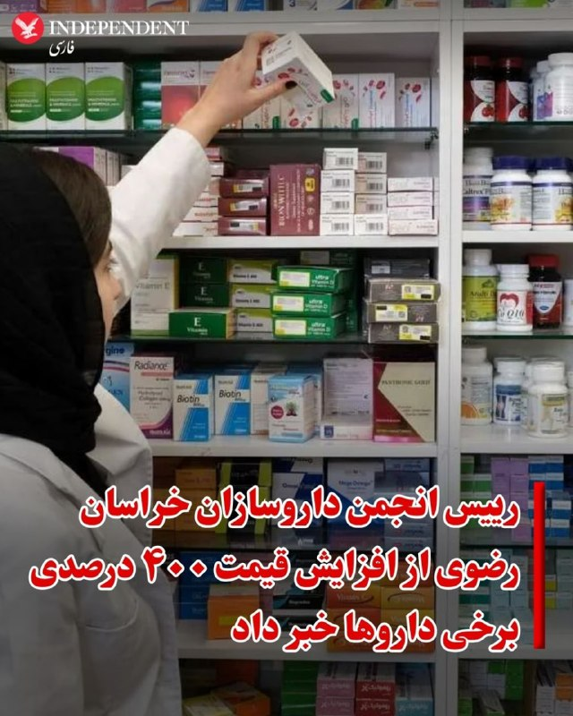

♦️مهدی زحمتکش، رییس انجمن داروسازان خراسان رضوی روز یکشنبه ۱۹ اردیبهشت با اشاره به افزایش قیمت برخی داروها بین ۲۰ تا ۴۰۰ درصد گفت: «با کمبود داروی بیماران خاص و صعب العلاج، اعصاب، قلبی و تنفسی مواجه هستیم.»

زحمتکش به ایرنا گفت‌: «در حال حاضر مشکل عمده ما در کمبود دارو، مربوط به داروخانه‌های خاص است که در کار تامین داروهای حیاتی و خاص بیماران سخت درمان (صعب العلاج) هستند.»

او تاکید کرد که راهکار برون رفت از این چالش عمل کردن بیمه‌ها به تعهداتشان براساس قانون است.
رییس انجمن داروسازان خراسان رضوی افزود: در صورتی که بیمه ها به تعهدات‌شان عمل کنند و مطالبات داروخانه‌ها را تا ۴۵ روز تسویه کنند تا این گردش مالی به داروخانه‌ها برگردد، آنها می‌توانند نقدینگی مورد نیاز برای خرید داروی بیماران را تامین کنند.
‌🇸🇦 Indypersian

🤖 @VahidOOnLine

## VahidOOnLine — post 239216

  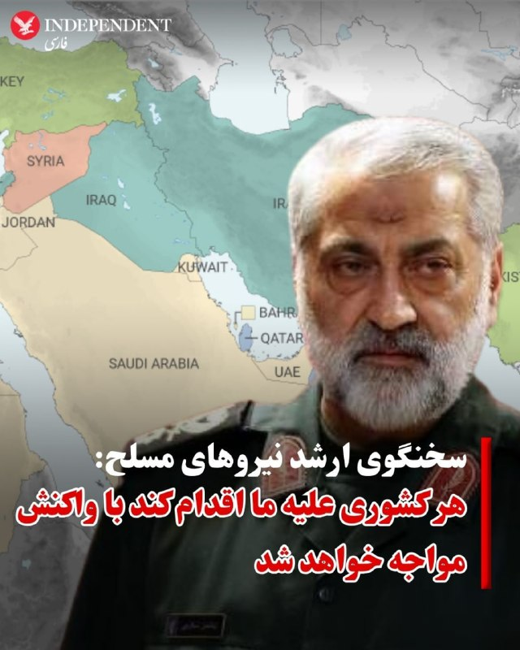

♦️ابوالفضل شکارچی، سخنگوی ارشد نیرو‌های مسلح روز یکشنبه با هشدار به برخی کشور‌های منطقه در خصوص تبعات همراهی با آمریکا گفت: «هر کشوری که علیه ایران اقدام کند با واکنش قاطع نیرو‌های مسلح کشورمان مواجه خواهد شد.»
شکارچی ضمن متهم کردن کشورهای منطقه به همکاری با ایالات متحده در حملات اخیر به برخی بنادر و نفتکش‌های ایرانی بر آمادگی نظامی نیرو‌های مسلح ایران تاکید کرد و افزود: «با وجود شیطنت‌های آمریکا، الحمدلله ابتکار عمل در دست نیرو‌های مسلح ماست و توانمندی رزمندگان در سطح بسیار خوبی قرار دارد.»

این اظهارات در حالی مطرح شده است که دونالد ترامپ، رئیس‌جمهوری ایالات متحده، روز شنبه در گفتگو با خبرنگاران هشدار داد که اگر تمامی مفاد توافق‌نامه صلح با تهران به طور کامل امضا و نهایی نشود، واشنگتن مسیر متفاوتی را در پیش خواهد گرفت. ترامپ با اشاره به احتمال ازسرگیری عملیات‌های نظامی تحت عنوان «پروژه آزادی» تاکید کرد که در صورت شکست مذاکرات، ایالات متحده با رویکردی تهاجمی‌تر به میدان بازمی‌گردد.
‌🇸🇦 Indypersian

🤖 @VahidOOnLine

## VahidOOnLine — post 239215

  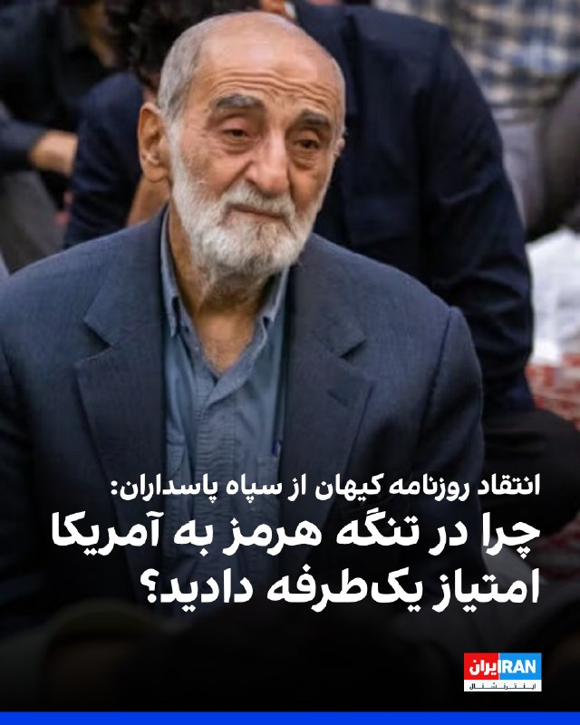

روزنامه کیهان که زیر نظر حسین شریعتمداری، نماینده رهبر کشته شده جمهوری اسلامی منتشر می‌شود، با انتقاد از نیروی دریایی سپاه، اجازه عبور کشتی‌ها از تنگه هرمز، در شرایطی که «هنوز محاصره دریایی جمهوری اسلامی از سوی آمریکا» برقرار است را «امتیاز یک‌طرفه» توصیف کرد.

این روزنامه نوشت: «چرا بعد از شکست اقدامات روز دوشنبه ارتش آمریکا، نیروی دریایی سپاه بیانیه داد که کشتی‌ها می‌توانند بیایند عبور کنند. ما حتی نیازهای آنان به سوخت و... را تامین می‌کنیم.»

کیهان ادامه داد: «چرا وقتی هنوز خط محاصره تجارت دریایی ایران شکسته نشده و ترامپ در روز چهارشنبه بر تداوم جدی آن تاکید هم کرده است ما باید موضعی می‌گرفتیم که از سوی دشمن‌، درست یا غلط نشانه دادن یکطرفه امتیاز تلقی شود؟»
‌🏁 🇬🇧 IranintlTV

🤖 @VahidOOnLine

## VahidOOnLine — post 239214

  <a href="telegram/content/VahidOOnLine_239214_1778398686.mp4" target="_blank">🎬 Download video</a>

⭕️ ۱۵ اردیبهشت روز شیراز است

♦️شیراز شهر همیشه اردیبهشت است. چه آن زمان که از کوچه‌های عفیف آباد می‌گذری و چه وقتی که در باغهای ارم، دلگشا، جهان نما، و باغهای همیشه سبز نارنجش به گشت و گذار می‌پردازی و می‌گذاری که احساست هوایی بخورد. گویی پیشینیان فرزانه ما خوب می‌دانستند که دقیقا درختهای نارنج را باید در شیراز کاشت. درستترین نقطه اقلیمی که طول سال سرسبزی به دنیای اطرافشان هدیه دهند و چشم‌ها را سرشوق بیاورند.

ماه اردیبهشت شیراز که جای خود دارد. ماه‌تر از هر ماهی. آنجا که دیگر شکوفه‌های سفید بهار نارنج باز شده‌اند و جوی‌های آب پر شده‌اند از گلبرگهای سفید ریز و درشت که چشم هر بیننده‌ای را جلا می‌دهد. بماند که دیگر عطر بهار نارنج در کوچه پس کوچه‌هایش چه حس شاعرانگی در وجودت به رقص می‌آورد و آواز پرندگان سرخوش میان درخت‌ها غزل زندگی را در وجود می‌سراید.

📌لینک پخش پادکست
‌🇸🇦 Indypersian

🤖 @VahidOOnLine

## VahidOOnLine — post 239213

  

سازمان دریانوردی تجاری بریتانیا خبر داد که یک پرتابه به سمت یک کشتی باری در ۲۳ مایلی سواحل قطر شلیک شده است.
بر اساس این گزارش، آتش‌سوزی در این کشتی مهار شده و هیچ مصدومی گزارش نشده است.
‌🏁 🇬🇧 IranintlTV

🤖 @VahidOOnLine

## VahidOOnLine — post 239212

  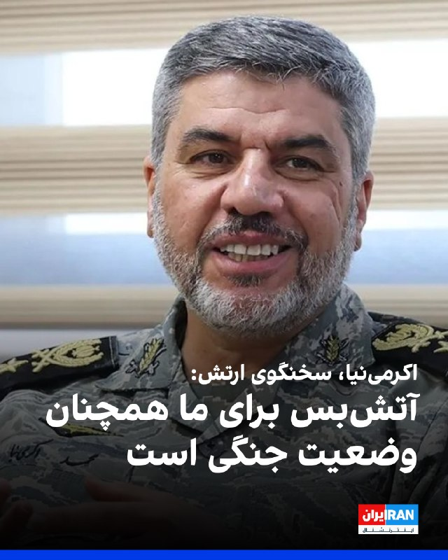

محمد اکرمی‌نیا، سخنگوی ارتش جمهوری اسلامی گفت: «از این پس کشورهایی که از آمریکا در اعمال تحریم علیه جمهوری اسلامی تبعیت کنند، حتما در عبور از تنگه هرمز با مشکل مواجه می‌شوند.»

او افزود: «ما وضعیت آتش‌بس را همچنان وضعیت جنگی تلقی می‌کنیم.»

او ادامه داد: «رصد تحولات نظامی و تغییر و تحولات منطقه نشان می‌دهد که دشمن همچنان در حال جابجایی تجهیزات و امکانات نظامی است. اما اینکه مدعی هستند ما خواهان صلح و مذاکره هستند، این یک بعد اعلامی است؛ در سیاست‌های کلان خود، آنها به تقویت نظامی‌شان در منطقه می‌پردازند.»
‌🏁 🇬🇧 IranintlTV

🤖 @VahidOOnLine

## VahidOOnLine — post 239211

  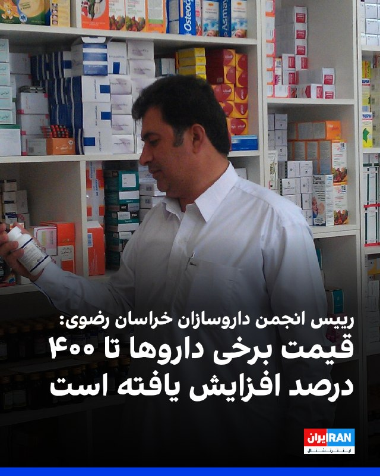

مهدی زحمتکش، رییس انجمن داروسازان خراسان رضوی گفت: «با کمبود داروی بیماران خاص و صعب العلاج، اعصاب، قلبی و تنفسی مواجهیم و قیمت برخی داروها بین ۲۰ تا ۴۰۰ درصد افزایش یافته است.»

او ادامه داد: «در حال حاضر مشکل عمده ما در کمبود دارو، مربوط به داروخانه‌های خاص است که در کار تامین داروهای حیاتی و خاص بیماران سخت درمان (صعب العلاج) هستند.»
‌🏁 🇬🇧 IranintlTV

🤖 @VahidOOnLine

## Configir98 — post 8511

🔐 𝗩𝟮𝗿𝗮𝘆𝗡𝗚 
➕ 𝗣𝘀𝗶𝗽𝗵𝗼𝗻 
📱

vless://a34bbc37-566c-4d31-8401-26fe0f9d6f7d@out2.tehranionliine.ir:80?path=%2F&security=none&encryption=none&type=ws#https://t.me/Configir98

✅ @Configir98

## Configir98 — post 8509

پرنده پر نمیزنه خیلی عجیبه

قهر کردین؟ 
🙂

## Configir98 — post 8508

  <a href="https://t.me/Configir98/8508" target="_blank">📎 Download file</a>

🛜 𝗡𝗽𝘃 𝗧𝘂𝗻𝗻𝗲𝗹 𝗡𝗮𝗽𝘀𝘁𝗲𝗿𝗻𝗲𝘁𝗩

🛡️ Password: @Configir98

✅ @Configir98

## Configir98 — post 8507

🔐 𝗩𝟮𝗿𝗮𝘆𝗡𝗚 
➕ 𝗣𝘀𝗶𝗽𝗵𝗼𝗻 
📱

vless://a34bbc37-566c-4d31-8401-26fe0f9d6f7d@out2.tehranionliine.ir:80?path=%2F&security=none&encryption=none&type=ws#https://t.me/Configir98

✅ @Configir98

## Configir98 — post 8505

⚡️ 𝗣𝗿𝗼𝘅𝘆

https://t.me/proxy?server=178.104.81.34&port=4455&secret=dd104462821249bd7ac519130220c25d09

✅ @Configir98

## Configir98 — post 8503

  <a href="https://t.me/Configir98/8503" target="_blank">📎 Download file</a>

🛜 𝗡𝗽𝘃 𝗧𝘂𝗻𝗻𝗲𝗹 𝗡𝗮𝗽𝘀𝘁𝗲𝗿𝗻𝗲𝘁𝗩

🛡️ Password: @Configir98

✅ @Configir98

## Configir98 — post 8502

🔐 𝗩𝟮𝗿𝗮𝘆𝗡𝗚 
➕ 𝗣𝘀𝗶𝗽𝗵𝗼𝗻 
📱

vless://afa40aec-0c64-43be-9dfb-05efad107874@5.56.132.22:8086?security=none&encryption=none&headerType=none&type=tcp#https://t.me/Configir98

socks://Og@62.220.126.56:30170#https://t.me/Configir98

✅ @Configir98

## Configir98 — post 8501

⚡️ 𝗣𝘀𝗶𝗽𝗵𝗼𝗻 𝗣𝗿𝗼𝘅𝘆

Host: 2.185.144.66
Port: 8080

✅ @Configir98

## Configir98 — post 8500

  <a href="https://t.me/Configir98/8500" target="_blank">📎 Download file</a>

🛜 𝗡𝗽𝘃 𝗧𝘂𝗻𝗻𝗲𝗹 𝗡𝗮𝗽𝘀𝘁𝗲𝗿𝗻𝗲𝘁𝗩

🛡️ Password: @Configir98

✅ @Configir98

## Configir98 — post 8499

⚡️ 𝗣𝘀𝗶𝗽𝗵𝗼𝗻 𝗣𝗿𝗼𝘅𝘆

Host: 194.225.131.88
Port: 9090

✅ @Configir98

## Configir98 — post 8498

🔐 𝗩𝟮𝗿𝗮𝘆𝗡𝗚 
➕ 𝗣𝘀𝗶𝗽𝗵𝗼𝗻 
📱

vmess://eyJhZGQiOiIxODUuMjM2LjM4LjQ0IiwiYWlkIjoiMCIsImFscG4iOiIiLCJmcCI6IiIsImhvc3QiOiIiLCJpZCI6ImM5ZTQyNTM3LTg2NTItNGE0Yy04NWQzLTBkMzZhYmYzOGY4OCIsIm5ldCI6InRjcCIsInBhdGgiOiIiLCJwb3J0IjoiMTk5NDYiLCJwcyI6Imh0dHBzOi8vdC5tZS9Db25maWdpcjk4Iiwic2N5IjoiYXV0byIsInNuaSI6IiIsInRscyI6IiIsInR5cGUiOiJub25lIiwidiI6IjIifQ==

socks://Og@62.220.126.56:30170#https://t.me/Configir98

✅ @Configir98

## Configir98 — post 8497

🔐 𝗩𝟮𝗿𝗮𝘆𝗡𝗚 
➕ 𝗣𝘀𝗶𝗽𝗵𝗼𝗻 
📱

{"remarks":"https://t.me/Configir98","log":{"loglevel":"warning"},"inbounds":[{"tag":"socks","port":10808,"protocol":"socks","settings":{"auth":"noauth","udp":true,"userLevel":8},"sniffing":{"enabled":true,"destOverride":["http","tls"],"routeOnly":false}}],"outbounds":[{"tag":"proxy","protocol":"vless","settings":{"vnext":[{"address":"62.220.126.92","port":31873,"users":[{"id":"b6c22d58-3455-44d7-b1a1-e6b9967f449b","level":8,"encryption":"none"}]}]},"streamSettings":{"network":"tcp","tcpSettings":{"header":{"type":"none"}}},"mux":{"enabled":false,"concurrency":-1,"xudpConcurrency":8,"xudpProxyUDP443":""}},{"tag":"direct","protocol":"freedom","settings":{"domainStrategy":"UseIP"},"mux":{"enabled":false,"concurrency":8,"xudpConcurrency":8,"xudpProxyUDP443":""}},{"tag":"block","protocol":"blackhole","settings":{"response":{"type":"http"}},"mux":{"enabled":false,"concurrency":8,"xudpConcurrency":8,"xudpProxyUDP443":""}}],"dns":{"servers":["1.1.1.1"],"hosts":{"domain:googleapis.cn":"googleapis.com","dns.alidns.com":["223.5.5.5","223.6.6.6","2400:3200::1","2400:3200:baba::1"],"one.one.one.one":["1.1.1.1","1.0.0.1","2606:4700:4700::1111","2606:4700:4700::1001"],"dot.pub":["1.12.12.12","120.53.53.53"],"dns.google":["8.8.8.8","8.8.4.4","2001:4860:4860::8888","2001:4860:4860::8844"],"dns.quad9.net":["9.9.9.9","149.112.112.112","2620:fe::fe","2620:fe::9"],"common.dot.dns.yandex.net":["77.88.8.8","77.88.8.1","2a02:6b8::feed:0ff","2a02:6b8:0:1::feed:0ff"]}},"routing":{"domainStrategy":"IPIfNonMatch","rules":[{"type":"field","ip":["1.1.1.1"],"outboundTag":"proxy","port":"53"},{"type":"field","ip":["223.5.5.5"],"outboundTag":"direct","port":"53"}]}}

✅ @Configir98

## Configir98 — post 8492

چجوری آمار روبیکا 110 میلیون رو رد کرده 
🫤
زاد و ولد زیاد شده ؟؟

## Configir98 — post 8491

⚡️ 𝗣𝗿𝗼𝘅𝘆

https://t.me/proxy?server=46.225.29.180&port=443&secret=ee636c6f7564666c6172652e636f6db6

https://t.me/proxy?server=94.101.191.94&port=4570&secret=6d087d0e01b54d2a50a78047a4a21d80

بدون VPN تست کنید

✅ @Configir98

## Configir98 — post 8490

  <a href="https://t.me/Configir98/8490" target="_blank">📎 Download file</a>

🛜 𝗡𝗽𝘃 𝗧𝘂𝗻𝗻𝗲𝗹 𝗡𝗮𝗽𝘀𝘁𝗲𝗿𝗻𝗲𝘁𝗩

🛡️ Password: @Configir98

✅ @Configir98

## Configir98 — post 8489

  <a href="https://t.me/Configir98/8489" target="_blank">📎 Download file</a>

🛜 𝗡𝗽𝘃 𝗧𝘂𝗻𝗻𝗲𝗹 𝗡𝗮𝗽𝘀𝘁𝗲𝗿𝗻𝗲𝘁𝗩

🛡️ Password: @Configir98

✅ @Configir98

## Configir98 — post 8488

🔐 𝗩𝟮𝗿𝗮𝘆𝗡𝗚 
➕ 𝗣𝘀𝗶𝗽𝗵𝗼𝗻 
📱

socks://Og@62.220.126.92:30376#https://t.me/Configir98

socks://Og@62.220.126.56:30170#https://t.me/Configir98

ss://Y2hhY2hhMjAtaWV0Zi1wb2x5MTMwNTp2eE53NWRpWllOM3NycTh1Q2ZtUVI5OHZZYzM5ZWN0NA%3D%3D@xiaomandapple4certificate.ikco.ir.soserverbot.shop:15152#https://t.me/Configir98

✅ @Configir98

## Configir98 — post 8487

🔐 𝗩𝟮𝗿𝗮𝘆𝗡𝗚 
➕ 𝗣𝘀𝗶𝗽𝗵𝗼𝗻 
📱

vless://ccd55491-6b15-4e13-8a9a-d5e87fd9be36@snapp.ir:80?path=%2F%3Fed%3D2080&security=&encryption=none&host=1.jojo.avenflow.ir&type=ws#https://t.me/Configir98

socks://Og%3D%3D@62.220.126.56:30170#https://t.me/Configir98

socks://Og@130.185.75.82:9595#https://t.me/Configir98

✅ @Configir98

## Configir98 — post 8485

⚡️ 𝗣𝘀𝗶𝗽𝗵𝗼𝗻 𝗣𝗿𝗼𝘅𝘆

Host: 5.10.249.19
Port:  1010

Host: 185.231.181.225
Port: 8585

Host: 62.60.207.133
Port: 2020

✅ @Configir98

## Configir98 — post 8484

ولی نتا از بعد از ظهر خیلی داغون شده
😐

## pm_afshaa — post 90451

🔴گاردین: ترامپ به دنبال بستن پرونده جنگ با ایران قبل از سفر به چین است

💧 Rainbet.com the #1 Non-KYC Crypto Casino & Sportsbook @rainbetcom

😁 @Pm_Afshaa

## pm_afshaa — post 90450

🔴وزیر دفاع لهستان :ما آمادگی داریم سربازای آمریکایی بیشتری رو تو کشورمون مستقر کنیم

💧 Rainbet.com the #1 Non-KYC Crypto Casino & Sportsbook @rainbetcom

😁 @Pm_Afshaa

## pm_afshaa — post 90449

علی صبوری بعد این که ویدیویی داد و فحش خار مادر به نظامو طرفداراش کشید الان این استوری رو گذاشته و گفته بیاید منو بگیرید ببرید 
💧 Rainbet.com the #1 Non-KYC Crypto Casino & Sportsbook @rainbetcom 
😁 @Pm_Afshaa

## pm_afshaa — post 90448

  

علی صبوری بعد این که ویدیویی داد و فحش خار مادر به نظامو طرفداراش کشید

الان این استوری رو گذاشته و گفته بیاید منو بگیرید ببرید

💧 Rainbet.com the #1 Non-KYC Crypto Casino & Sportsbook @rainbetcom

😁 @Pm_Afshaa

## pm_afshaa — post 90447

خامنه ای کشته شد

## pm_afshaa — post 90446

🔴دولت ترامپ مبلغ حمایت نظامی از پیشمرگه‌های اقلیم کردستان عراق در بودجه دفاعی سال آینده آمریکا را به صفر کاهش داد

+اسلحه مردم ایرانو میدزدین حرومزاده ها!؟

💧 Rainbet.com the #1 Non-KYC Crypto Casino & Sportsbook @rainbetcom

😁 @Pm_Afshaa

## pm_afshaa — post 90445

سپاه:از این به بعد اگه به نفتکش‌ها یا کشتی‌های تجاری ایران حمله بشه جوابش رو به پایگاه‌ ها یا نیروهای آمریکا تو منطقه و حتی کشتی‌هاشون می‌دیم

💧 Rainbet.com the #1 Non-KYC Crypto Casino & Sportsbook @rainbetcom

😁 @Pm_Afshaa

## pm_afshaa — post 90444

  

پست جدید ترامپ تو تروث سوشال :

💧 Rainbet.com the #1 Non-KYC Crypto Casino & Sportsbook @rainbetcom

😁 @Pm_Afshaa

## pm_afshaa — post 90443

  <a href="telegram/content/pm_afshaa_90443_1778398690.webm" target="_blank">🎬 Download video</a>

🔴شبکه 15 اسرائیل: تو واشنگتن هنوز منتظر جواب ایران هستن.

💧 Rainbet.com the #1 Non-KYC Crypto Casino & Sportsbook @rainbetcom

😁 @Pm_Afshaa

## pm_afshaa — post 90442

خبری که از قول مارکو روبیو پخش شده که گفته "ایران پیشنهاد رو رد کرد" فیکه و اصلا همچین چیزی نگفته.

## pm_afshaa — post 90441

  <a href="telegram/content/pm_afshaa_90441_1778398691.webm" target="_blank">🎬 Download video</a>

🔴آکسیوس: آمریکا هنوز در انتظار پاسخ ایران تا اوایل بعدازظهر یک‌شنبه است.

💧 Rainbet.com the #1 Non-KYC Crypto Casino & Sportsbook @rainbetcom

😁 @Pm_Afshaa

## pm_afshaa — post 90440

  <a href="telegram/content/pm_afshaa_90440_1778398691.webm" target="_blank">🎬 Download video</a>

🔴باراک راوید خبرنگار ارشد آکسیوس:
مارکو روبیو و استیو ویتکاف امروز در میامی با نخست وزیر قطر دیدار کردن؛ نخست وزیر قطر ممکنه در مذاکرات بین آمریکا و ایران میانجی‌گری کنه

💧 Rainbet.com the #1 Non-KYC Crypto Casino & Sportsbook @rainbetcom

😁 @Pm_Afshaa

## pm_afshaa — post 90437

پست‌های جدید ترامپ و دیس به بایدن و اوباما و جمهوری اسلامی

💧 Rainbet.com the #1 Non-KYC Crypto Casino & Sportsbook @rainbetcom

😁 @Pm_Afshaa

## pm_afshaa — post 90436

  <a href="telegram/content/pm_afshaa_90436_1778398692.webm" target="_blank">🎬 Download video</a>

🔴اسماعیل سقاب اصفهانی، معاون پزشکیان:
بخشی از صنایع آسیب دیده و چاره‌ای جز صرفه‌جویی تا 2 سال آینده نداریم.

💧 Rainbet.com the #1 Non-KYC Crypto Casino & Sportsbook @rainbetcom

😁 @Pm_Afshaa

## pm_afshaa — post 90435

  <a href="telegram/content/pm_afshaa_90435_1778398692.webm" target="_blank">🎬 Download video</a>

🔴وال‌استریت ژورنال به نقل از مقام‌های آمریکایی:

اسرائیل یک پایگاه نظامی مخفی در صحرای عراق ایجاد کرده تا از حملات هوایی به ایران پشتیبانی کنه؛ در اوایل جنگ ایران، نیروهای عراقی نزدیک بود کشفش کنن که اسرائیل حملات هوایی علیه اونا انجام داد.

💧 Rainbet.com the #1 Non-KYC Crypto Casino & Sportsbook @rainbetcom

😁 @Pm_Afshaa

## pm_afshaa — post 90434

  <a href="telegram/content/pm_afshaa_90434_1778398693.webm" target="_blank">🎬 Download video</a>

🔴پوتین: ایران به روسیه در زمینه هسته‌ای اعتماد داره و برای این اعتماد دلایل موجهی داره؛ روسیه همچنان مایل است تا اورانیوم غنی‌شده ایران رو در اختیار بگیره و تهران میتونه به انتقال آن به یک کشور دوست اعتماد کنه.

💧 Rainbet.com the #1 Non-KYC Crypto Casino & Sportsbook @rainbetcom

😁 @Pm_Afshaa

## pm_afshaa — post 90433

  <a href="telegram/content/pm_afshaa_90433_1778398693.webm" target="_blank">🎬 Download video</a>

🔴پوتین: ادامه درگیری بین ایران و آمریکا به نفع کسی نیست و این وضعیت روسیه رو با توجه به روابط خوبش با ایران و کشورهای خلیج فارس در موقعیت دشواری قرار میده.

💧 Rainbet.com the #1 Non-KYC Crypto Casino & Sportsbook @rainbetcom

😁 @Pm_Afshaa

## pm_afshaa — post 90432

  <a href="telegram/content/pm_afshaa_90432_1778398694.webm" target="_blank">🎬 Download video</a>

🔴کانال 13 اسرائیل:
موساد معتقده که برگشتن به جنگ، روند فروپاشی رژیم ایران رو سرعت میبخشه و در نهایت منجر به سقوطش میشه.
ارتش معتقده که وضعیت فعلی قدرت ایران، یه فرصت عملیاتی فراهم کرده؛ پس باید به جنگ برگشت و ماموریت رو تموم کرد.

💧Rainbet.com the #1 Non-KYC Crypto Casino & Sportsbook @rainbetcom

😁 @Pm_Afshaa

## iaghapour — post 2594

  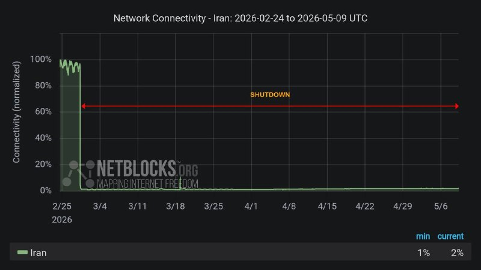

⚠️ ایران 11 هفته در خاموشی دیجیتال!

هیچ‌وقت تو زندگیم فکر نمی‌کردم یه روزی برسه که این‌جوری تلخ، شاهد از بین رفتن زحمت‌ آدما باشم. ۱۱ هفته قطعی اینترنت واسه خیلی‌ها فقط یه اختلال ساده نبود؛ قصه پدر مادرا و جووناییه که با هزار امید یه کسب‌وکار کوچیک راه انداخته بودن تا خرج زندگیشونو دربیارن و الان دستشون به هیچ‌جا بند نیست.

تا همین چند وقت پیش با کلی استرس می‌گفتیم کسب‌وکارهای نوپا و خونگی تو «مرز نابودی» هستن و همه‌مون چشم‌انتظار بودیم زودتر اینترنت وصل بشه؛ ولی الان دیگه حرف از مرز نیست. خیلی‌ها کل سرمایه، جوونی و حاصل سال‌ها تلاششون جلوی چشماشون دود شد و رفت رو هوا. کاش دردی که افتاده رو دوش این مردم، میافتاد رو دوش مسئولین...

🆔 @NetProPlus

## DEJradio — post 4538

  <a href="telegram/content/DEJradio_4538_1778398695.mp4" target="_blank">🎬 Download video</a>

🚨
🔸 حسن حسن‌زاده؛ سرکوبگری با ایده‌‌هایی برای حجاب اجباری

#شناسایی_سرکوبگران #حجاب_اجباری
@DEJradio

## DEJradio — post 4537

  <a href="telegram/content/DEJradio_4537_1778398697.webm" target="_blank">🎬 Download video</a>

🔺🎥 پشتیبانی از شاهزاده رضا پهلوی و اعتراض به قطعی اینترنت در ایران

#قطعی_اینترنت #شاهزاده_رضا_پهلوی
@DEJradio

## DEJradio — post 4536

  <a href="telegram/content/DEJradio_4536_1778398697.mp4" target="_blank">🎬 Download video</a>

🚨🎥 حال‌‌وش گزارش داد شامگاه جمعه ۱۸ اردیبهشت‌ماه ۱۴۰۵، چندین فروند پهپاد در آسمان و خیابان‌های خیام و خرمشهر در نزدیکی مسجد مکی زاهدان مشاهده شده که باعث نگرانی شماری از شهروندان ساکن این مناطق شده است.

بر اساس ویدئوی ارسالی به حال‌‌وش، چراغ و پرواز یکی از این پهپادها در آسمان منطقه به‌وضوح قابل مشاهده بوده و از آن فیلم‌برداری شده است.
به گفته منابع محلی، علاوه بر این پهپاد، چراغ چند پهپاد دیگر نیز در فاصله‌ای دورتر دیده شده و صدای پرواز آن‌ها در آسمان منطقه شنیده می‌شده است.

به گفته منابع حال‌‌وش: «پهپادها برای مدتی بر فراز مناطق مسکونی اطراف مسجد مکی و خیابان‌های مجاور در حال پرواز و گشت‌زنی بودند و صدای ممتد آن‌ها در سطح منطقه شنیده می‌شد.»

#پهباد #زاهدان
@DEJradio

## DEJradio — post 4535

  <a href="telegram/content/DEJradio_4535_1778398699.webm" target="_blank">🎬 Download video</a>

🔺🎤 عذاب وجدان و ترومای اجتماعی پس از دی‌ماه

گفت‌وگو با دکتر مصطفی میررمضانی، روان‌پزشک و روان‌درمانگر

#عذاب_وجدان #تروما
@DEJradio

## DEJradio — post 4534

  <a href="telegram/content/DEJradio_4534_1778398699.mp4" target="_blank">🎬 Download video</a>

🔺🎥 خیابان‌ها شده پادگان؛ انگار حکومت نظامیست...

#حکومت_نظامی
@DEJradio

## DEJradio — post 4533

  <a href="telegram/content/DEJradio_4533_1778398700.webm" target="_blank">🎬 Download video</a>

🚨📢 شناسایی تشکیلات مرتبط با سـپاه پاسداران در بحرین؛ ۴۱ نفر بازداشت شدند

وزارت کشور بحرین اعلام کرد دستگاه‌های امنیتی این کشور یک تشکیلات مرتبط با سپاه پاسداران انقلاب اسلامی و اندیشه «ولایت فقیه» را شناسایی و ۴۱ نفر از اعضای آن را بازداشت کرده‌اند.
بر پایه اعلام وزارت کشور بحرین در روز شنبه ۱۹ اردیبهشت، این اقدام بر اساس نتایج گزارش‌‌های امنیتی در پرونده‌های «جاسوسی برای نهادهای خارجی» و «همدلی با حملات جمهوری اسلامی» انجام شده است.
عملیات جستجو و تحقیق به منظور «شناسایی و برخورد قانونی» با دیگر افراد مرتبط با این تشکیلات ادامه دارد.
پیش از این، دادستانی بحرین نیز اعلام کرده بود در دو پرونده جداگانه مربوط به جاسوسی، برای دو تبعه افغانستانی و سه شهروند بحرینی حکم حبس ابد صادر شده است.

#بحرین #IRGCterrorists
@DEJradio

## DEJradio — post 4532

  <a href="telegram/content/DEJradio_4532_1778398701.mp4" target="_blank">🎬 Download video</a>

🤡
🔺 فقط کشکک مجتبی مجروح شده است!

در حالی که بیش از دو ماه از حذف هدفمند خامنه‌ای و خانواده او می‌گذرد و پسرش، مجتبی خامنه‌ای با وجود منسوب شدن به رهبری، هنوز تصویر یا صدایی از او منتشر نشده، مظاهر حسینی، مسئول دیدارهای دفتر خامنه‌ای، در تجمع شبانه حکومتیريال مدعی شده که مجتبی در جریان بمباران کاخ مرمر، تنها از ناحیه کشکک زانو، کمر و کمی پشت گوش آسیب دیده است.

#موشتبا #حذف_هدفمند
@DEJradio

## DEJradio — post 4531

  <a href="telegram/content/DEJradio_4531_1778398703.webm" target="_blank">🎬 Download video</a>

🚨
🔸 خبر ۲۱
آدینه ۱۸ اردیبهشت ۱۴۰۵

#خبر۲۱
@DEJradio

## DEJradio — post 4530

  <a href="telegram/content/DEJradio_4530_1778398703.webm" target="_blank">🎬 Download video</a>

🚨
⭕️ هشدار ترامپ به جمهوری اسلامی:
اگر توافق نکنید، با پروژه «آزادی پلاس» برمی‌گردیم

دونالد ترامپ رئیس‌جمهوری آمریکا، درباره چشم‌انداز توافق با جمهوری اسلامی به خبرنگاران گفت: «اگر همه چیز امضا و نهایی نشود، مسیر متفاوتی را در پیش خواهیم گرفت. اگر اتفاقی نیافتد، ممکن است به پروژه آزادی تنگه هرمز بازگردیم، اما آن پروژه آزادی پلاس خواهد بود؛ یعنی پروژه آزادی به اضافه موارد دیگر.»

او در پاسخ به پرسش یک خبرنگار مبنی بر اینکه آیا جمهوری اسلامی عمدا روند مذاکرات را به کندی پیش می‌برد نیز گفت: «به‌زودی خواهیم فهمید.»
برخی منابع گزارش دادند مهلت ترامپ برای جمهوری اسلامی تا روز یکشنبه ۲۰ اردیبهشت خواهد بود.
ترامپ پیش‌تر اعلام کرد با توجه به درخواست پاکستان و برخی کشورهای دیگر، و همچنین «پیشرفت بزرگ» در مسیر دستیابی به توافقی کامل و نهایی با نمایندگان تهران، موافقت کرده است «پروژه آزادی» برای مدت کوتاهی متوقف شود.

#ترامپ #مذاکرات
@DEJradio

## DEJradio — post 4529

  <a href="telegram/content/DEJradio_4529_1778398704.mp4" target="_blank">🎬 Download video</a>

🚨
🔸 تحویل اورانیوم؛ آغاز توافق یا بن‌بست مذاکرات؟

*شهرام خلدی، پژوهشگر تاریخ خاورمیانه و روابط بین‌الملل

#توافق #مذاکرات
@DEJradio

## DEJradio — post 4528

  <a href="telegram/content/DEJradio_4528_1778398706.webm" target="_blank">🎬 Download video</a>

🤡
🔺 دوسلدورف؛ توهین‌ یکی از هواداران نظام‌‌ به مردم

#آلمان #مزدوران_حکومتی
@DEJradio

## DEJradio — post 4527

  <a href="telegram/content/DEJradio_4527_1778398706.mp4" target="_blank">🎬 Download video</a>

🛩️🎥 منابع محلی گزارش دادند روز جمعه ۱۸ اردیبهشت‌ماه ۱۴۰۵، حوالی ساعت ۱۲ ظهر، تیپ و اسلحه‌خانه نیروهای دریایی در شهرستان کنارک هدف حمله قرار گرفت.
به گفته منابع حال‌‌وش: «این محل پیش‌تر نیز در جریان تنش‌ها و درگیری‌های میان جمهوری اسلامی ایران و ایالات متحده آمریکا هدف حمله قرار گرفته بود و مجدداً صدای انفجار و برخاستن دود از محدوده این مرکز نظامی مشاهده شده است.»

#کنارک #حملات_هدفمند
@DEJradio

## DEJradio — post 4526

  <a href="telegram/content/DEJradio_4526_1778398707.webm" target="_blank">🎬 Download video</a>

🎥
🔺 در یکی از تجمعات شبانه هواداران حکومت، سرباز ارتش جشن تولد گرفت و با آهنگ "تولد" به پای سردار سـ.ـپاه افتاد مقداری پول هدیه گرفت.

#ارتش #سرباز
@DEJradio

## DEJradio — post 4525

  <a href="telegram/content/DEJradio_4525_1778398708.mp4" target="_blank">🎬 Download video</a>

🎥
🔺 پیرانشهر؛ "فقر و بیکاری روز به روز بیشتر میشه"

براساس گزارش‌های مردمی بعد از جنگ ۴۰ روزه بیکاری و فقر تشدید شده است و بسیاری از مردم مشاغل خود را از دست دادند و درآمد ندارند.

#فقر #بیکاری #پیرانشهر
@DEJradio

## DEJradio — post 4524

  <a href="telegram/content/DEJradio_4524_1778398709.webm" target="_blank">🎬 Download video</a>

🔸
🔺 یک منبع نظامی به خبرگزاری تسنیم وابسته به سـ.ـپاه جمعه شب ۱۸ اردیبهشت گفت: «درگیری‌ها در خلیج فارس فعلاً متوقف شده اما احتمال آغاز مجدد آن وجود دارد.»
او افزود: «پس از مدتی تبادل آتش، هم اینک درگیری‌ها متوقف شده و فضا آرام است.»
این منبع نظامی تهدید کرد: «اگر مجدداً آمریکایی‌ها قصد ورود به خلیج فارس را داشته باشند و یا برای شناورهای ایرانی مزاحمتی ایجاد کنند، مجدداً پاسخ قاطع دریافت خواهند کرد. بنابراین احتمال ورود مجدد به درگیری‌هایی از این قبیل در این منطقه همچنان وجود دارد.»

#جنگ #تنگه_هرمز
@DEJradio

## DEJradio — post 4523

  <a href="telegram/content/DEJradio_4523_1778398710.mp4" target="_blank">🎬 Download video</a>

📢
🔺 شکایت از سفره‌های خالی؛ "بچه‌های ما گرسنه‌اند".

#بحران #اقتصاد #فروپاشی
@DEJradio

## VahidOnline — post 75371

  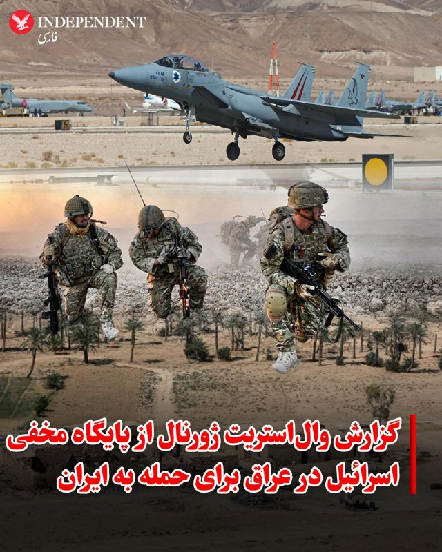

به گزارش «وال‌استریت ژورنال»، اسرائیل در اقدامی بی‌سابقه یک پایگاه نظامی مخفی در بیابان‌های عراق ایجاد کرده است تا از این طریق عملیات هوایی گسترده خود علیه ایران را پشتیبانی کند.

این پایگاه که پیش از آغاز درگیری‌ها و با آگاهی ایالات متحده احداث شده، میزبان نیروهای ویژه اسرائیل و یگان‌های امداد و نجات برای خلبانانی بود که ممکن بود در جریان حملات سرنگون شوند.
طبق گفته مقام‌های آگاه، استقرار این مرکز لجستیک در فاصله ۱۶۰۰ کیلومتری از اسرائیل، نقش کلیدی در مدیریت هزاران حمله هوایی تل‌آویو علیه اهداف نظامی رژیم جمهوری اسلامی در خاک ایران طی هفته‌های اخیر ایفا کرده است.

این گزارش فاش می‌کند که مخفیگاه مذکور در اوایل ماه مارس و پس از گزارش یک چوپان محلی درباره تحرکات مشکوک هلیکوپترها، تا آستانه لو رفتن پیش رفت. در پی این گزارش، ارتش عراق نیروهایی را برای بازرسی به منطقه اعزام کرد، اما نیروهای اسرائیلی با اجرای حملات هوایی سنگین علیه سربازان عراقی، مانع از دسترسی آن‌ها به این سایت سری شدند که در نتیجه آن یک سرباز عراقی کشته و دو نفر مجروح شدند.
@VahidOOnLine

📡 @VahidOnline

## VahidOnline — post 75369

تصاویر ساختگی دیگری که ترامپ در صفحه‌اش منتشر کرده: realDonaldTrump

📡 @VahidOnline

## VahidOnline — post 75368

  

پست ترامپ: realDonaldTrump

📡 @VahidOnline

## VahidOnline — post 75367

  

خبرگزاری تسنیم، وابسته به سپاه پاسداران، با اشاره به کابل‌های فیبر نوری عبوری از تنگه هرمز و تهدید به اختلال در اقتصاد دیجیتال جهان در صورت آسیب به این کابل‌ها، خواهان اخذ هزینه از شرکت‌های خارجی و الزام غول‌های فناوری نظیر متا، آمازون و مایکروسافت به فعالیت تحت قوانین جمهوری اسلامی شد.

تسنیم نوشت: «کابل‌های تار نوری زیردریایی عبوری از تنگه هرمز روزانه حامل بیش از ۱۰ تریلیون دلار آمریکا تراکنش مالی (شامل پیام‌های سوئیفت، معاملات بورس و تبادلات ارزی) هستند.»

رسانه وابسته به سپاه در ادامه خواستار «اخذ هزینه مجوز اولیه و تمدید سالانه از شرکت‌های خارجی، الزام غول‌های فناوری (متا، آمازون، مایکروسافت) به فعالیت تحت قوانین جمهوری اسلامی و انحصار تعمیر و نگهداری کابل‌ها از سوی شرکت‌های ایرانی شد.»

فارس، دیگر وابسته به سپاه، نیز در گزارشی نوشت که ده‌ها کابل فیبر نوری زیردریایی که آسیا، اروپا و خاورمیانه را به هم متصل می‌کنند، از گذرگاه تنگه هرمز عبور می‌کنند و تهدید کرد که «هرگونه آسیب به این کابل‌ها می‌تواند اختلالات گسترده‌ای در اینترنت و اقتصاد دیجیتال کشورهای مختلف ایجاد کند.»
@VahidOOnLine

📡 @VahidOnline

## VahidOnline — post 75366

  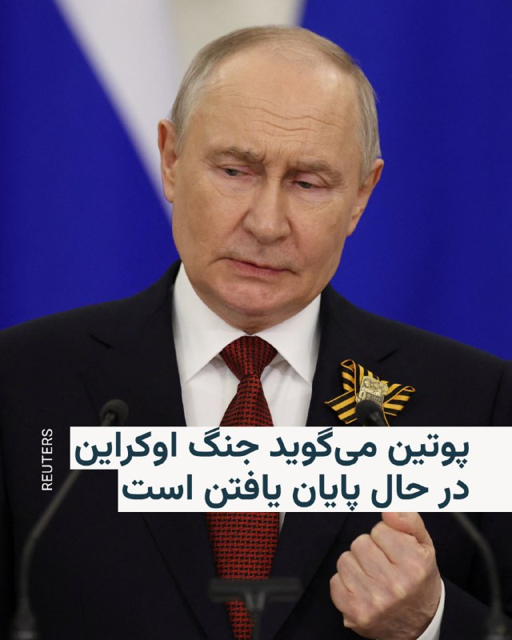

ولادیمیر پوتین، رئیس‌جمهور روسیه، روز شنبه ۱۹ اردیبهشت، ساعتی بعد از برپایی رژهٔ «روز پیروزی» در مسکو، گفت که معتقد است جنگ اوکراین در حال اتمام است.

او بدون اشاره به جزئیات بیشتر دربارهٔ این جنگ به خبرنگاران گفت: «فکر می‌کنم این موضوع در حال پایان یافتن است.»

روزنامه فایننشال تایمز روز پنجشنبه گزارش داده بود که رهبران اتحادیه اروپا در حال آماده‌سازی برای مذاکرات احتمالی هستند. وقتی از پوتین پرسیده شد آیا حاضر است با اروپایی‌ها وارد گفت‌وگو شود، او گفت که گزینه ترجیحی‌اش گرهارد شرودر، صدراعظم پیشین آلمان، است.
@VahidHeadline

📡 @VahidOnline

## VahidOnline — post 75365

  <a href="telegram/content/VahidOnline_75365_1778398713.mp4" target="_blank">🎬 Download video</a>

ویدیویی از تجمعات شبانه طرفداران جمهوری اسلامی منتشر شده که در آن فرد خواننده می‌گوید زنان «کم حجابی» که در تجمع طرفداری از حکومت شرکت می‌کنند «نور چشم» آن‌ها هستند و ظاهر افراد ملاک نیست.
نظام جمهوری اسلامی پیش از این زنان بدون حجاب اجباری را بازداشت کرده و طی لایحه‌ای به نام «حجاب و عفاف» قصد ابلاغ جریمه‌های و محرومیت‌های سنگین علیه آنان را داشت.
با این حال، در هفته‌های گذشته حکومت سعی کرده با انتشار ویدیوها و مصاحبه‌هایی از تعدادی زن بی‌حجاب در تجمعات حکومتی، پایگاه اجتماعی خود را گسترده نشان دهد.
@VahidHeadline

📡 @VahidOnline

## VahidOnline — post 75364

  

مقام‌های لبنانی روز شنبه اعلام کردند که در حملات هوایی اسرائیل به جنوب لبنان، هشت نفر کشته شده‌اند. همچنین بزرگراهی در جنوب بیروت هدف حمله هوایی قرار گرفت.

این حملات تازه با وجود آتش‌بس سه‌هفته‌ای میان اسرائیل و حزب‌الله، گروه مورد حمایت [جمهوری اسلامی در] ایران، انجام شد؛ آتش‌بسی که تأثیر چندانی در توقف تبادل روزانه آتش، عمدتاً در جنوب لبنان، نداشته است.

حزب‌الله روز شنبه اعلام کرد که در واکنش به ادامه حملات، نیروهای اسرائیلی در شمال این کشور را با پهپاد هدف قرار داده است.
@VahidHeadline

📡 @VahidOnline

## VahidOnline — post 75363

  

فرماندهی مرکزی آمریکا، سنتکام، روز ۱۹ اردیبهشت ۱۴۰۵ اعلام کرد محاصره دریایی آمریکا علیه جمهوری اسلامی همچنان به‌طور کامل اجرا می‌شود و نیروهای این فرماندهی تاکنون ۵۸ کشتی تجاری را تغییر مسیر داده و چهار شناور را از کار انداخته‌اند تا از ورود یا خروج آن‌ها به بنادر ایران جلوگیری شود.
@VahidHeadline

📡 @VahidOnline

## VahidOnline — post 75358

گذشت

‌ عبدالله امیدوار، یکی از دو برادر امیدوار که اولین نزدیک به ۷۰ سال پیش با موتورسیکلت دور جهان را گشتند، در سانتياگو، پايتخت شيلی درگذشت.

عبدالله، برادر کوچکتر پس از پایان سفرشان به شيلی رفت و در آنجا ازدواج کرد و شرکت فیلم‌سازی در شيلی تاسيس کرد.

عبدالله۲۱ ساله و عیسی ۲۳ ساله، در سال ۱۹۵۴

## VahidOnline — post 75357

  

وزارت دفاع بریتانیا روز شنبه اعلام کرد که پیش از هرگونه مأموریت بین‌المللی برای کمک به حفاظت از کشتیرانی در تنگه هرمز، یک ناوشکن به خاورمیانه اعزام خواهد کرد.

سخنگوی این وزارتخانه به خبرگزاری فرانسه گفت: «استقرار پیشاپیش ناوشکن «اچ‌ام‌اس دراگون» بخشی از برنامه‌ریزی محتاطانه‌ای است که تضمین می‌کند بریتانیا به‌عنوان بخشی از یک ائتلاف چندملیتی به رهبری مشترک بریتانیا و فرانسه، در زمان مناسب آماده تأمین امنیت تنگه باشد.»
لندن و پاریس چند هفته پیش اعلام کردند که طرح‌های نظامی برای تأمین امنیت تنگه هرمز در حال شکل‌گیری است و در بازگرداندن جریان تجارت از طریق این گذرگاه حیاتی موفق خواهد بود.
@VahidHeadline

📡 @VahidOnline

## VahidOnline — post 75354

وزارت کشور بحرین روز شنبه ۱۹ اردیبهشت اعلام کرد که ۴۱ نفر را که به گفته این وزارتخانه با سپاه پاسداران ایران مرتبط بوده‌اند، دستگیر کرده است.
خبرگزاری دولتی بحرین به نقل از این وزارتخانه گزارش داد که مقامات امنیتی گروهی مرتبط با سپاه پاسداران ایران را شناسایی کرده است و افزود که تحقیقات برای شناسایی و برخورد با هر فردی که در این تشکیلات فعالیت داشته ادامه دارد.
@VahidHeadline
ابراهیم عزیزی، رئیس کمیسیون امنیت ملی مجلس شورای اسلامی، روز شنبه ۱۹ اردیبهشت، با انتشار پیامی در شبکه اجتماعی ایکس کشورهای منطقه از جمله بحرین را تهدید کرد که در صورت همراهی با قطعنامه پیشنهادی آمریکا در شورای امنیت سازمان ملل، با «پیامدهای جدی» مواجه خواهد شد.
عزیزی بحرین را «کشور ذره‌بینی» خواند و نوشت: «به دولت‌هایی همچون کشور ذره‌بینی بحرین که در حال همراهی با قطعنامه آمریکایی هستند، درباره پیامدهای جدی این اقدام هشدار می‌دهیم. درهای تنگه هرمز را برای همیشه به روی خود نبندید!»
قطعنامه مذکور که با حمایت آمریکا و کشورهای حوزه خلیج فارس به شورای امنیت سازمان ملل ارائه شده، از ایران می‌خواهد که ضمن توقف حملات علیه شناورهایی که قصد عبور از تنگه هرمز را دارند، محل دقیق مین‌های کارگذاری شده را اعلام کند و از دریافت هرگونه عوارض عبور از شناورهای عبوری خودداری کند.
@VahidOOnLine
وزارت خارجه عربستان سعودی در بیانیه‌ای حمایت کامل ریاض را از اقداماتی اعلام کرد که پادشاهی بحرین برای مقابله با آنچه «اقدام‌های صادرشده از سوی ایران» خوانده، اتخاذ کرده است.
در این بیانیه آمده است این اقدام‌ها به گفته مقام‌های سعودی، امنیت ملی بحرین را تحت تاثیر قرار می‌دهد و با هدف بی‌ثبات کردن امنیت و ثبات این کشور انجام می‌شود.
@VahidOOnLine

📡 @VahidOnline

## VahidOnline — post 75353

  

همزمان با شرایط پرتنش منطقه، رویداد «در امارات بسازید» در ابوظبی برگزار شد و شرکت‌های تجاری نزدیک به ۴۶ میلیارد دلار در امارات سرمایه‌گذاری کردند.

بر اساس اعلام اوپک، این رقم بیش از مجموع درآمد نفتی جمهوری اسلامی، ۴۵.۳ میلیارد دلار، در سال ۲۰۲۵ میلادی است.

النهار گزارش کرد این سرمایه‌گذاری شامل صنایع دفاعی و تکنولوژیک، دارویی، شیمیایی و انرژی است. این رویداد چهارروزه حتی در شرایط جنگی تعطیل نشد و توانست جایگاه امارات را به عنوان یک قطب صنعتی در منطقه تقویت کند.
@VahidOOnLine

📡 @VahidOnline

## VahidOnline — post 75348

در آغاز یازدهمین هفته از قطعی سراسری اینترنت بین‌المللی در ایران، یک مقام دولتی هشدار داد که این اقدام حکومت در درازمدت خود به «تهدید امنیتی» برای جمهوری اسلامی بدل خواهد شد.
احسان چیت‌ساز، معاون وزیر ارتباطات در دولت مسعود پزشکیان، گفت: «قطع اینترنت فقط در بازه‌های زمانی کوتاه می‌تواند کمک کند و در بلندمدت تهدید امنیتی است.»
قطعی اینترنت در ایران روز شنبه، ۱۹ اردیبهشت، یازدهمین هفته خود را آغاز کرد، در حالی که مردم عادی در کشور تنها با صرف هزینه‌های گزاف می‌توانند به اینترنت بین‌المللی دسترسی داشته باشند و مقام‌های حکومتی و عده‌ای از حامیان جمهوری اسلامی با مانعی در دسترسی مواجه نیستند.
@VahidHeadline
معاون وزیر ارتباطات ایران خسارت‌های ناشی از قطع اینترنت برای اقتصاد دیجیتال ایران، در پلتفرم‌های بزرگ را ۵۵ هزار میلیارد تومان اعلام کرد.
او گفته است: «مجموع عدم‌النفع (کاهش درآمد) این حوزه نزدیک به ۱۶/۳۲ هزار میلیارد تومان برآورد می‌شود.»
معاون وزیر ارتباطات ایران همچنین گفته است قطعی اینترنت در حوزه مخابرات و ارتباطات حدود ۶/۴ هزار میلیارد تومان کاهش درآمد مستقیم کسب‌وکارها را در بر داشته است.
آقای چیت‌ساز گفته است: «قطع اینترنت برای کسب‌وکار اقتصاد دیجیتال ممکن است برای چند ساعت قابل تحمل باشد، اما قطع گسترده و سراسری آن عملا یک شوک اقتصادی ایجاد می‌کند.»
یازده هفته از قطع سراسری اینترنت در ایران می‌گذرد.
افشین کلاهی، ازاعضای اتاق بازرگانی ایران، پیش از این گفته بود که خسارت مستقیم قطع اینترنت در ایران ۳۰ تا ۴۰ میلیون دلار در روز است و خسارت مستقیم و غیرمستقیم این محدودیت تا۸۰ میلیون دلار در روز می‌رسد.
@VahidHeadline
خبرگزاری دولتی ایرنا در گزارشی میدانی از تهران، عملاً تأیید کرده است که قطع اینترنت بخشی از فروشگاه‌های مجازی را از فضای آنلاین بیرون رانده و به خیابان و پیاده‌رو کشانده است.
ایرنا نوشته پررنگ شدن دستفروشی فقط محدود به نقاط مرکزی تهران نیست و از بازار امامزاده حسن در جنوب غرب تهران تا شهرک اندیشه شهریار نیز دیده می‌شود.
به گزارش این خبرگزاری، مدارای شهرداری و «دستور آگاهانه» برای برخورد نکردن با دستفروشان، این روند را آشکارتر کرده و بخش‌هایی از شهر را به ویترین بساط‌گرانی تبدیل کرده است که به‌اجبار از اینستاگرام به خیابان کوچ کرده‌اند.
ایرنا نوشته فروشندگانی که تا چند ماه پیش با صفحه اینستاگرامی، پرداخت آنلاین و ارسال سفارش فعالیت می‌کردند، حالا در نبود اینترنت آزاد و پایدار، ناچار شده‌اند در خیابان بساط کنند.
@VahidHeadline

📡 @VahidOnline

## Shin_Persian — post 5915

  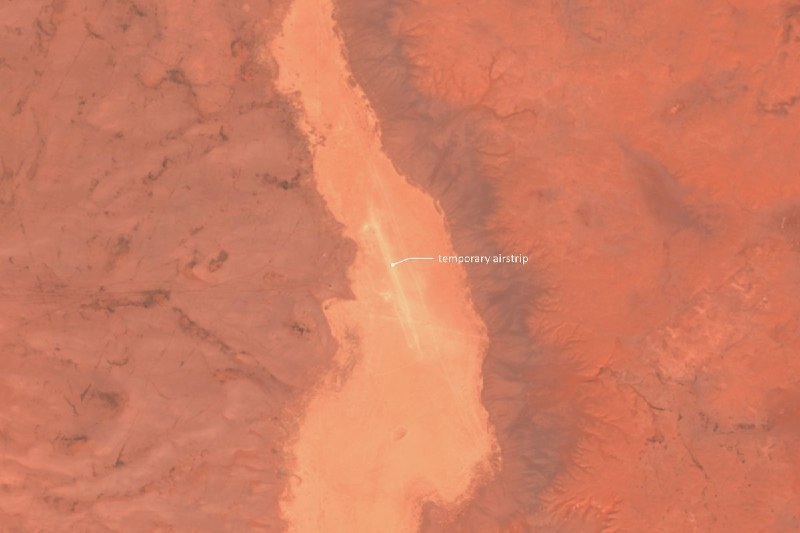

↩️ Quoted tweet: Ali Vaez ✓ @AliVaez Sat, 09 May 2026 18:15:52 UTC Israel Built and Defended a Secret Iran War Base in Iraq https://www.wsj.com/world/middle-east/israel-built-and-defended-a-secret-iran-war-base-in-iraq-3590851a ↩️ توییت نقل‌قول شده — برای…

## Shin_Persian — post 5914

↩️ Quoted tweet:
Ali Vaez ✓ @AliVaez
Sat, 09 May 2026 18:15:52 UTC

Israel Built and Defended a Secret Iran War Base in Iraq https://www.wsj.com/world/middle-east/israel-built-and-defended-a-secret-iran-war-base-in-iraq-3590851a

↩️ توییت نقل‌قول شده — برای پاسخ، پست زیر را ببینید.

فارسی

اسرائیل یک پایگاه جنگی مخفی علیه ایران در عراق ساخته و از آن دفاع کرده است https://www.wsj.com/world/middle-east/israel-built-and-defended-a-secret-iran-war-base-in-iraq-3590851a

𝕏 · @shin_persian

## Shin_Persian — post 5913

Shin ✓ @hey_itsmyturn
Sat, 09 May 2026 21:17:43 UTC

Jet activity over Baghdad
#Iraq 🇮🇶

فارسی

فعالیت جت‌ها بر فراز بغداد
#Iraq 🇮🇶

𝕏 · @shin_persian

## Shin_Persian — post 5909

↩️ Quoted tweet: U.S. Central Command ✓ @CENTCOM Sat, 09 May 2026 00:14:23 UTC A U.S. Air Force F-16 fighter jet flies in airspace over the Middle East. U.S. forces across the region remain mission ready. ↩️ توییت نقل‌قول شده — برای پاسخ، پست زیر را ببینید.…

## Shin_Persian — post 5908

  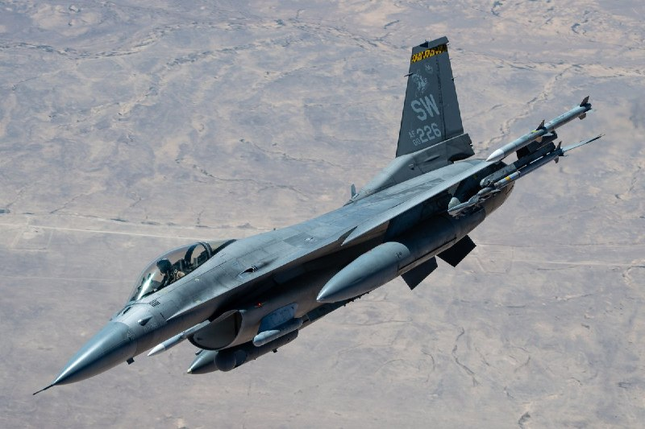

↩️ Quoted tweet:
U.S. Central Command ✓ @CENTCOM
Sat, 09 May 2026 00:14:23 UTC

A U.S. Air Force F-16 fighter jet flies in airspace over the Middle East. U.S. forces across the region remain mission ready.

↩️ توییت نقل‌قول شده — برای پاسخ، پست زیر را ببینید.

فارسی

یک جنگنده اف-۱۶ نیروی هوایی ایالات متحده (USAF) در حریم هوایی خاورمیانه پرواز می‌کند. نیروهای ایالات متحده در سراسر منطقه در حالت آماده‌باش عملیاتی باقی می‌مانند.

𝕏 · @shin_persian

## Shin_Persian — post 5907

  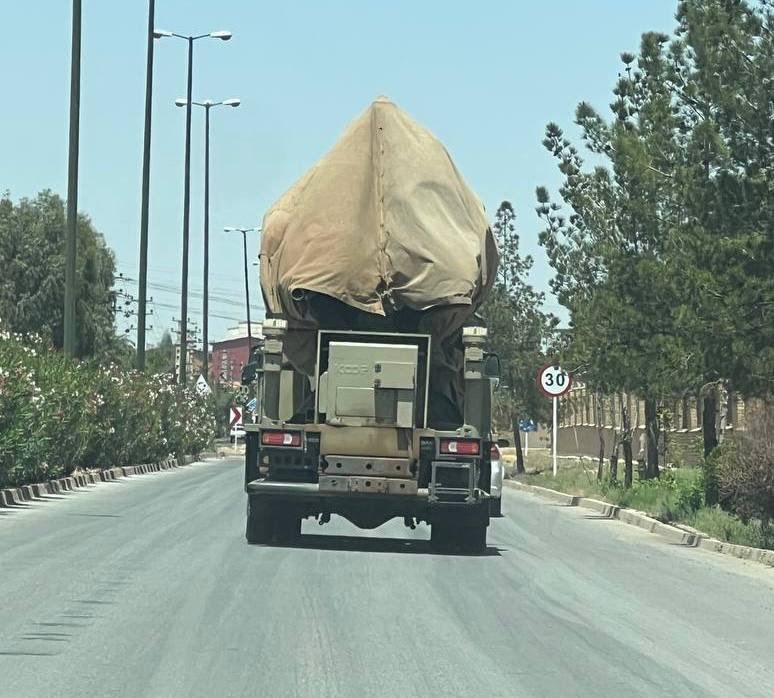

Shin ✓ @hey_itsmyturn
Sat, 09 May 2026 17:14:56 UTC

Today -
TEL movement,
Shokuhiyeh Town,
Qom Province, #Iran .

(Do not watermark)

فارسی

امروز -
تحرک پرتابگرهای موشک (TEL)،
شهرک شکوهیه،
استان قم، #Iran .

(واترنمارک نکنید)

𝕏 · @shin_persian

## Shin_Persian — post 5906

Shin ✓ @hey_itsmyturn
Sat, 09 May 2026 11:42:21 UTC

NOW @ 1142Z -
Jet activity over Baghdad, #Iraq 🇮🇶

فارسی

هم‌اکنون در ۱۱۴۲Z (۱۵:۱۲ به وقت تهران) -
فعالیت جنگنده‌ها برفراز بغداد، #Iraq 🇮🇶

𝕏 · @shin_persian

## Shin_Persian — post 5905

  

OSINTtechnical ✓ @Osinttechnical
Sat, 09 May 2026 04:41:22 UTC

USAF F-16C from the 79th Fighter Squadron “Tigers” over the Middle East, sporting at least one mark for an AGM-88 HARM kill on an Iranian radar system.

فارسی

یک فروند اف-۱۶سی نیروی هوایی ایالات متحده (USAF) متعلق به اسکادران ۷۹ شکاری «ببرها» بر فراز خاورمیانه، که حداقل یک علامت پیروزی برای انهدام یک سامانه راداری ایرانی توسط موشک ای‌جی‌ام-۸۸ هارم (AGM-88 HARM) بر روی بدنه خود دارد.

𝕏 · @shin_persian

## Shin_Persian — post 5904

  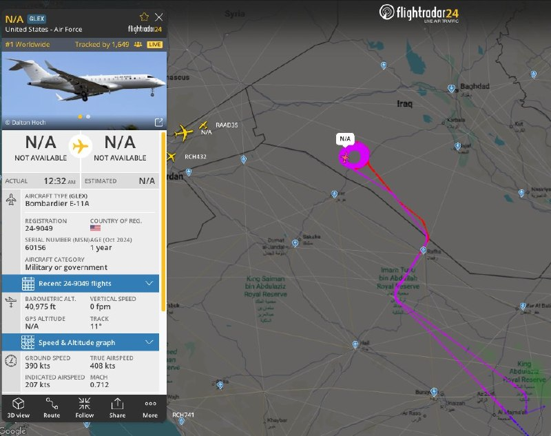

Shin ✓ @hey_itsmyturn
Fri, 08 May 2026 23:37:02 UTC

#USAF 🇺🇸 BACN bird over southwestern #Iraq 🇮🇶
(AF83F0 | 24-9049)

(+ Fighter jet activity over Baghdad)

فارسی

#USAF (نیروی هوایی ایالات متحده) 🇺🇸 پرنده BACN برفراز جنوب غربی #Iraq (عراق) 🇮🇶
(AF83F0 | 24-9049)

(+ فعالیت جنگنده‌ها برفراز بغداد)

𝕏 · @shin_persian

## Shin_Persian — post 5903

  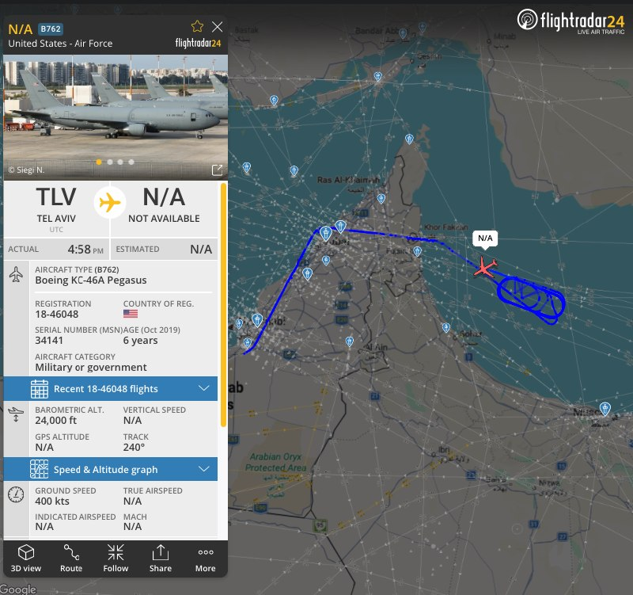

Shin ✓ @hey_itsmyturn
Fri, 08 May 2026 23:32:59 UTC

#USAF 🇺🇸 tanker (AE5F9B | 18-46048) on AAR mission over the Gulf of Oman.

فارسی

#USAF (نیروی هوایی ایالات متحده) 🇺🇸 تانکر (AE5F9B | 18-46048) در مأموریت AAR (سوخت‌گیری هوایی) بر فراز دریای عمان.

𝕏 · @shin_persian

## Shin_Persian — post 5902

  <a href="telegram/content/Shin_Persian_5902_1778398719.mp4" target="_blank">🎬 Download video</a>

Shin ✓ @hey_itsmyturn
Fri, 08 May 2026 23:30:02 UTC

Sums the situation up pretty well

فارسی

وضعیت را به خوبی خلاصه می‌کند

𝕏 · @shin_persian

## Shin_Persian — post 5901

Shin ✓ @hey_itsmyturn
Fri, 08 May 2026 23:11:59 UTC

Continuous Jet activity over Baghdad since 2 hours ago.
#Iraq 🇮🇶

فارسی

فعالیت مداوم جت‌ها بر فراز بغداد از ۲ ساعت پیش تاکنون.
#Iraq 🇮🇶

𝕏 · @shin_persian

## Shin_Persian — post 5900

Shin ✓ @hey_itsmyturn
Fri, 08 May 2026 23:01:17 UTC

NOW @ 2300Z -
Jet activity over Amman, Amman Governorate, #Jordan

فارسی

هم‌اکنون در ساعت ۲۳۰۰ زولو (۰۲:۳۰ بامداد به وقت تهران) -
فعالیت جت‌ها بر فراز امان، استان امان، #اردن

𝕏 · @shin_persian

## Shin_Persian — post 5899

Shin ✓ @hey_itsmyturn
Fri, 08 May 2026 22:58:20 UTC

Economic Fury, #Iran

As part of the Economic Fury campaign, the U.S. Treasury @USTreasury (OFAC) has sanctioned a network of 10 individuals and entities across China, the UAE, Belarus, and Hong Kong for procuring weapons and UAV components for the Iranian regime.
Weapons & MANPADS Procurement
This network facilitated technology and weapons acquisitions (including man-portable air-defense systems) for the Center for Innovation and Technology Cooperation (CITC):
• Yushita Shanghai International Trade Co Ltd (China): Facilitator for CITC.
• AE International Trade Co Limited (Hong Kong): Received millions in funding for procurement efforts.
• Elite Energy FZCO (UAE): Transferred funds to AE International for CITC.
• HK Hesin Industry Co Limited (Hong Kong): Intermediary used to obfuscate the Iranian end-user.
• Armory Alliance LLC (Belarus): Intermediary for Iranian procurement.
• Mohammadmahdi Maleki: Belarus-based Iranian employee of Armory Alliance.
• Mohammed Ali Tolibov: CEO of Armory Alliance and arms facilitator.
IRGC Weapons Procurement
• Mustad Limited (Hong Kong): Facilitated millions of dollars in weapons procurement transactions for the IRGC.
UAV & Missile Components
Targeting the supply of aerospace-grade raw materials (carbon fiber and honeycomb fabric) for the Shahed-series UAVs:
• Hitex Insulation Ningbo Company Limited (China): Supplied materials to Pishgam Electronic Safeh Company (PESC).
• Li Genping (China): Legal representative and manager of Hitex Insulation.
Campaign Context
Secretary Scott Bessent stated the "Economic Fury" campaign remains unrelenting in targeting Iran's defense industrial base. Concurrently, the State Department designated four additional entities for conventional arms activities.

ترجمه فارسی در بخش نظرات

𝕏 · @shin_persian

## FarsiVOA — post 217320

  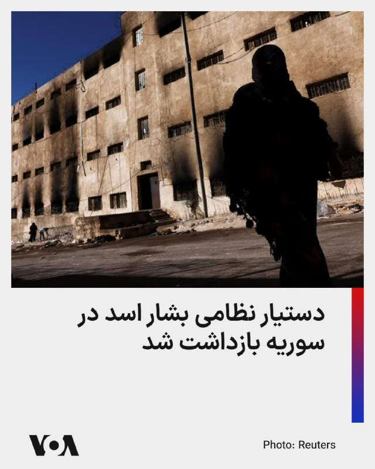

وزارت کشور سوریه می‌گوید طی یک عملیات «امنیتی سریع» با مشارکت اداره مبارزه با تروریسم، وجیه علی عبدالله دستیار نظامی بشار اسد، دیکتاتور سابق سوریه را بازداشت کرده است.

حساب وزارت کشور سوریه در شبکه ایکس با اعلام این خبر گفته است سرلشکر وجیه علی عبدالله به مدت ۱۳ سال سمت مدیر دفتر امور نظامی «بشار اسدِ جنایتکار فراری» را بر عهده داشت.

این دستگیری بخشی از یک کارزار علیه مقامات نظامی و امنیتی سابق سوریه است که متهم به دست داشتن در نقض حقوق بشر، بازداشت‌های غیرقانونی، شکنجه و کشتار شهروندان در دوران بشار اسد هستند.
@FarsiVOA

## FarsiVOA — post 217319

  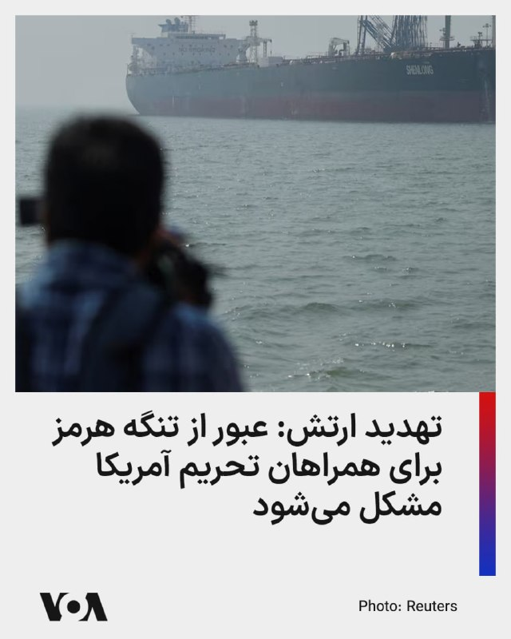

سخنگوی ارتش جمهوری اسلامی، گفت کشورهایی که از آمریکا در اعمال تحریم علیه ایران تبعیت کنند، «حتماً» در عبور از تنگه هرمز با مشکل روبه‌رو خواهند شد.

محمد اکرمی‌نیا همچنین اعلام کرد جمهوری اسلامی «نظام جدید حقوقی و امنیتی» در تنگه هرمز اعمال کرده و از این پس هر شناوری برای عبور از این گذرگاه باید با ایران هماهنگ کند.

این اظهارات در حالی بیان می‌شود که تنگه هرمز از آغاز جنگ آمریکا و اسرائیل با جمهوری اسلامی به یکی از محورهای اصلی بحران تبدیل شده و تردد کشتی‌ها در این مسیر راهبردی به‌شدت کاهش یافته است.

در پیش‌نویس ادعایی توافق میان واشنگتن و تهران نیز که اکسیوس و سپس رویترز گزارش کردند، کاهش تدریجی محدودیت‌ها در تنگه هرمز و کم شدن محاصره دریایی آمریکا طی یک دوره ۳۰ روزه از محورهای اصلی تفاهم احتمالی عنوان شده بود.
@FarsiVOA

## FarsiVOA — post 217318

  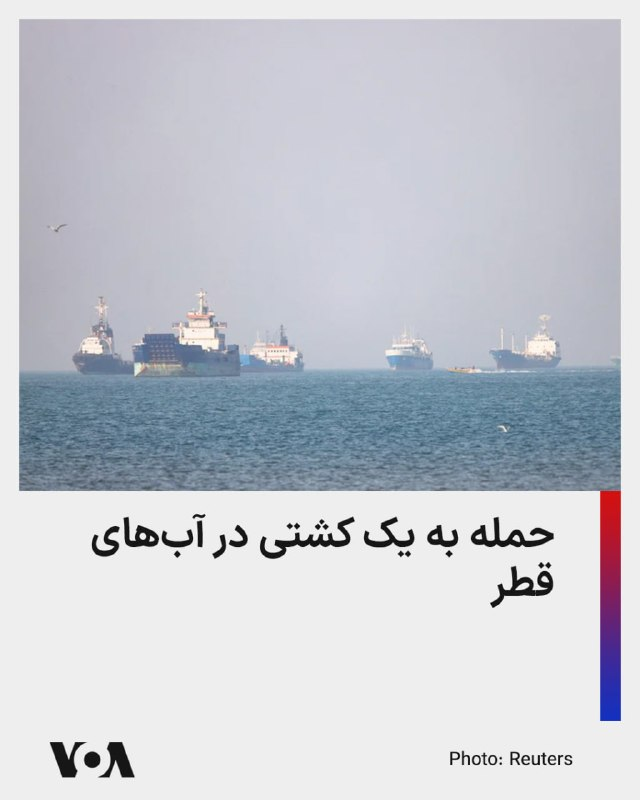

سازمان عملیات تجارت دریایی بریتانیا از هدف قرار گرفتن یک کشتی فله‌بر قطر خبر داد.

این نهاد اطلاعات دریایی می‌گوید حادثه در ۲۳ مایل دریایی شمال‌شرق دوحه، قطر اتفاق افتاده است. ناخدای یک کشتی فله‌بر اعلام کرده که کشتی با یک پرتابه ناشناس هدف قرار گرفته است.

آتش‌سوزی در کشتی مهار شده و هیچ تلفات یا آلودگی زیست‌محیطی گزارش نشده است.

این اولین حادثه برای کشتی‌ها بعد از چهار روز سکوت نسبی در خلیج فارس و دریای عمان است.
@FarsiVOA

## FarsiVOA — post 217317

  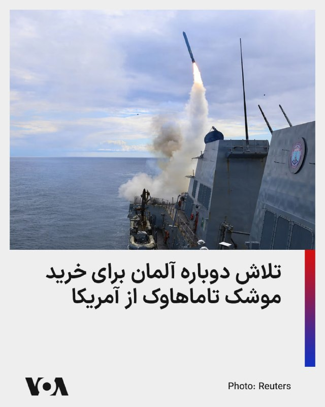

رویترز به نقل از فایننشال‌تایمز گزارش داد آلمان تلاش خود برای خرید موشک‌های کروز تاماهاوک از آمریکا را دوباره فعال کرده است.

بر اساس این گزارش، برلین می‌خواهد دولت دونالد ترامپ را برای موافقت با فروش موشک‌های تاماهاوک و پرتابگرهای زمینی تایفون قانع کند. وزارت دفاع آلمان پیش‌تر در ژوئیه سال گذشته درخواست خرید سامانه‌های دوربرد را به واشنگتن ارائه کرده بود، اما آمریکا هنوز به این درخواست پاسخ نداده است.

فایننشال‌تایمز نوشته بوریس پیستوریوس، وزیر دفاع آلمان، قصد دارد برای احیای این پیشنهاد به واشنگتن سفر کند؛ هرچند انجام این سفر به این بستگی دارد که او بتواند با پیت هگست، همتای آمریکایی خود، دیدار کند.

تاماهاوک یک موشک کروز دوربرد است که معمولاً از دریا برای حمله به اهداف عمقی شلیک می‌شود. پنتاگون در ماه فوریه اعلام کرده بود قراردادی هفت‌ساله با شرکت ریتیان برای افزایش تولید تاماهاوک امضا کرده است؛ زیرا ذخایر آمریکا در جریان جنگ با جمهوری اسلامی کاهش یافته است.
@FarsiVOA

## FarsiVOA — post 217316

  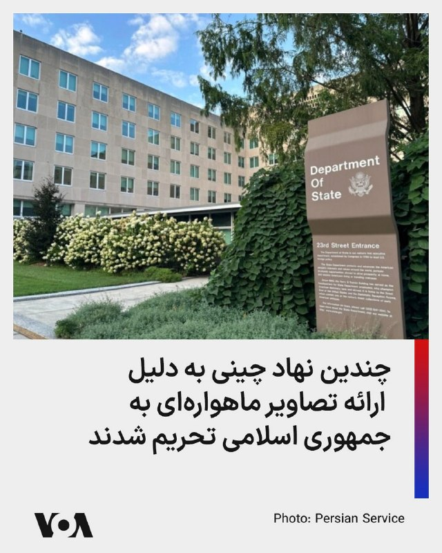

⚡️وزارت خارجه آمریکا گفت چندین نهاد مستقر در چین را به دلیل ارائه تصاویر ماهواره‌ای به جمهوری اسلامی تحریم کرده است. وزارت خارجه آمریکا گفت این تصاویر برای قادر ساختن جمهوری اسلامی در حمله به نیروهای آمریکایی در خاورمیانه بود. وزارت خزانه‌داری آمریکا نیز روز جمعه نهادها و افراد بیشتری را که به برنامه تسلیحاتی جمهوری اسلامی کمک می‌کنند، تحریم کرد.
@FarsiVOA

## FarsiVOA — post 217315

  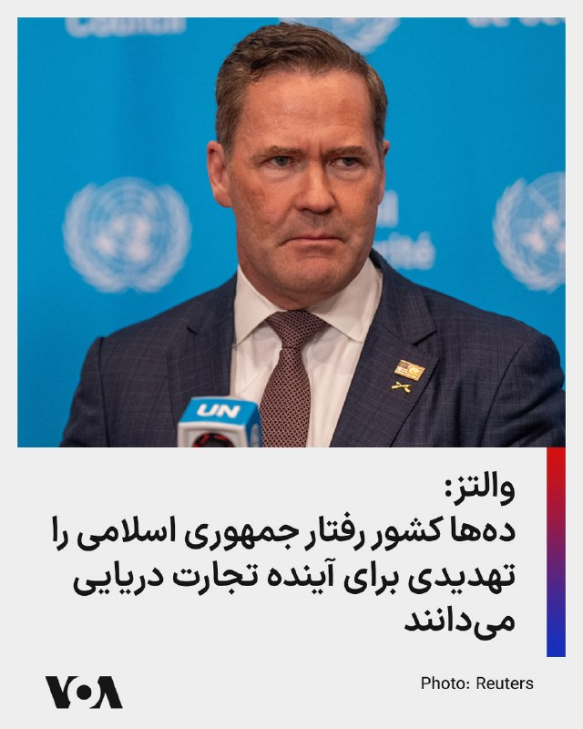

⚡️مایک والتز، سفیر آمریکا در سازمان ملل، با بازنشر پستی در شبکه اجتماعی ایکس درباره اهمیت هشت تنگه اصلی برای تجارت جهانی، گفت: «دقیقاً به همین دلیل» ده‌ها کشور از قطعنامه شورای همکاری خلیج فارس و بحرین در سازمان ملل حمایت کرده‌اند؛ قطعنامه‌ای که جمهوری اسلامی ایران را به خاطر مین‌گذاری در آب‌های بین‌المللی و تلاش برای گرفتن عوارض از کشتی‌های تجاری با تهدید نظامی، محکوم می‌کند. والتز افزود این کشورها معتقدند مسیری که جمهوری اسلامی در پیش گرفته، می‌تواند در آینده پیامدهای خطرناکی داشته باشد.
@FarsiVOA

## FarsiVOA — post 217314

  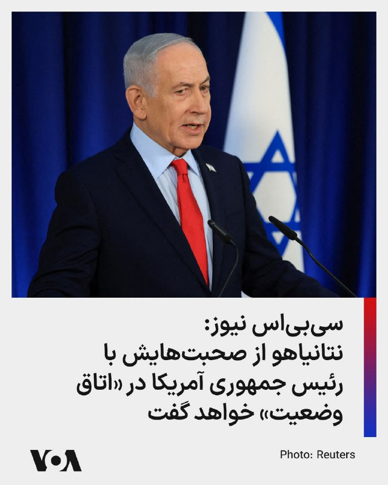

⚡️سی‌بی‌اس نیوز اعلام کرد که روز یکشنبه، در برنامه «۶۰ دقیقه» مصاحبه بنیامین نتانیاهو نخست‌وزیر اسرائیل پخش می‌شود. به گفته این شبکه،‌ او در این گفت‌وگو درباره درگیری‌های جاری در خاورمیانه، چشم‌انداز توافق صلح و همچنین بحث‌هایی که پیش از تصمیم رئیس‌جمهوری آمریکا برای حمله به جمهوری اسلامی در اتاق وضعیت مطرح کرد، صحبت می‌کند.
@FarsiVOA

## FarsiVOA — post 217313

  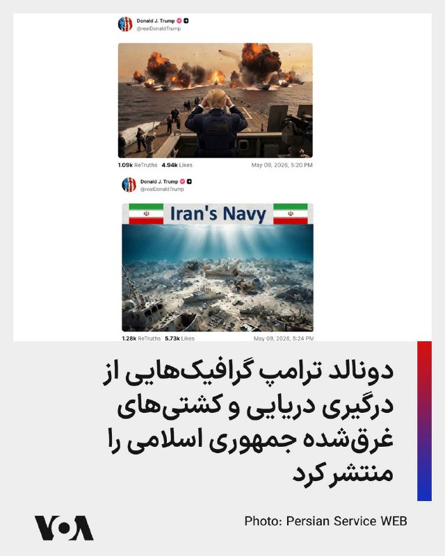

⚡️دونالد ترامپ، رئیس جمهوری آمریکا، عصر شنبه گرافیکی را در تروت‌سوشال منتشر کرد که او را ایستاده روی یک کشتی جنگی نشان می‌دهد و نظاره‌گر قایق‌های تندروی آتش‌گرفته مهاجم است.
او همچنین گرافیک دیگری را از کشتی‌های غرق‌شده با پرچم‌های جمهوری اسلامی منتشر کرد.
@FarsiVOA

## FarsiVOA — post 217312

  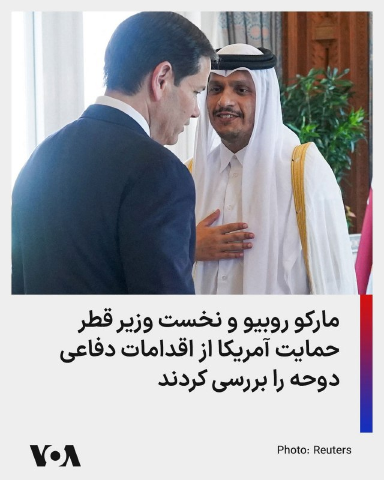

⚡️مارکو روبیو، وزیر امورخارجه آمریکا، دقایقی قبل گفت با نخست‌وزیر و وزیر امور خارجه قطر، محمد بن عبدالرحمن بن جاسم آل ثانی دیدار کرد تا با او درباره حمایت آمریکا از دفاع قطر از خود گفت‌وگو کند. آقای روبیو گفت مشارکت ما در بازدارندگی تهدیدها و تقویت ثبات در خاورمیانه اهمیت دارد.
@FarsiVOA

## FarsiVOA — post 217311

  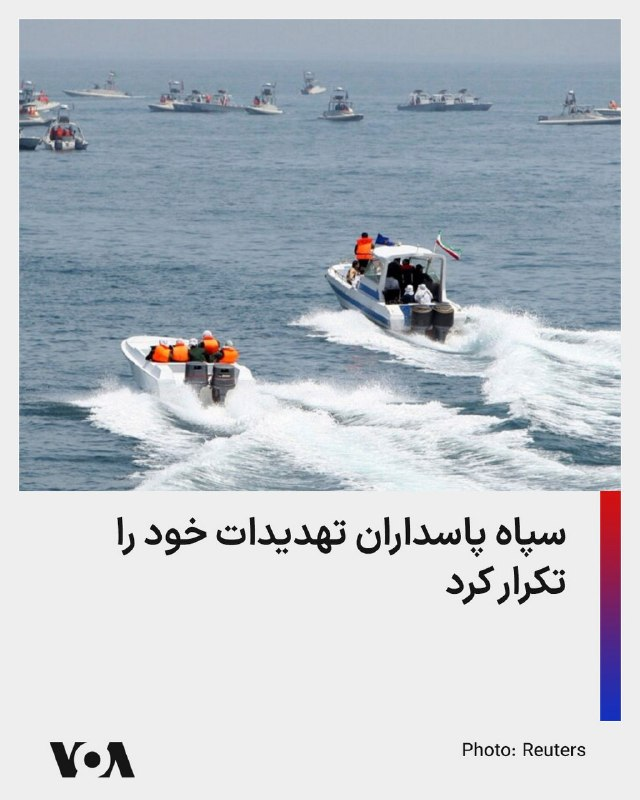

⚡️سپاه پاسداران جمهوری اسلامی تهدید کرد که هر گونه حمله به نفتکش‌ها و کشتی‌های تجاری جمهوری اسلامی را با «تهاجم سنگین» به «یکی» از «مراکز آمریکایی» در منطقه و یا «کشتی‌های دشمن» پاسخ خواهد داد. این تهدیدات در حالی است که آمریکا یک محاصره دریایی را علیه جمهوری اسلامی اجرا می‌کند و این دو همچنان در یک آتش‌بس به‌سر می‌برند. بسیاری از فرماندهان سپاه، از جمله فرمانده نیروی دریایی آن، در جریان عملیات نظامی مشترک آمریکا و اسرائيل کشته شده‌اند. دونالد ترامپ، رئیس جمهوری آمریکا گفته است که اگر جمهوری اسلامی با آمریکا به توافق نرسد، ضربات شدیدتری به نسبت گذشته دریافت خواهد کرد.
@FarsiVOA

## FarsiVOA — post 217310

  <a href="telegram/content/FarsiVOA_217310_1778398723.mp4" target="_blank">🎬 Download video</a>

⚡️شلیک به قصد «نیت خصمانه»؛ دستور جدید آمریکا در خلیج فارس
@FarsiVOA

## FarsiVOA — post 217309

🔺ناوشکن بریتانیایی برای شرکت در ماموریت احتمالی تامین امنیت تنگه هرمز در خاورمیانه مستقر می‌شود

▪️شبکه اسکای نیوز گزارش داد که ناوشکن بریتانیایی اچ‌ام‌اس دراگون از شرق دریای مدیترانه به سمت خاورمیانه اعزام می‌شود.

⬇️ بیشتر بخوانید:
https://ir.voanews.com/a/8148328.html
@FarsiVOA

## FarsiVOA — post 217308

  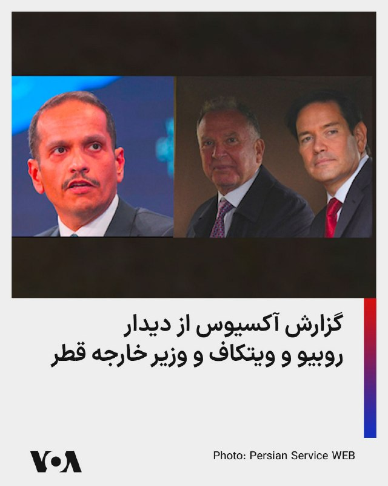

⚡️آکسیوس می‌گوید مارکو روبیو، وزیر امورخارجه آمریکا و استیو ویتکاف روز شنبه با نخست وزیر و وزیر خارجه قطر، محمد بن عبدالرحمن بن جاسم آل ثانی در فلوریدا دیدار و گفت‌وگو کردند. این مقام قطری روز جمعه با جی‌دی ونس، معاون رئیس جمهوری آمریکا درباره ایران دیدار و گفت‌وگو کرده بود.

@FarsiVOA

## FarsiVOA — post 217306

⚡️سنتکام تصاویری از ملوانان آمریکایی مستقر در ناو هواپیمابر آبراهام لینکلن را که منتشر کرد که کار تعمیر و نگهداری هواگردهای مستقر در دریا را «به‌صورت شبانه‌روزی» انجام می‌دهند و آن‌ها را «در آمادگی کامل عملیاتی» نگه می‌دارند. این ناو در خاورمیانه فعالیت می‌کند.
@FarsiVOA

## FarsiVOA — post 217305

  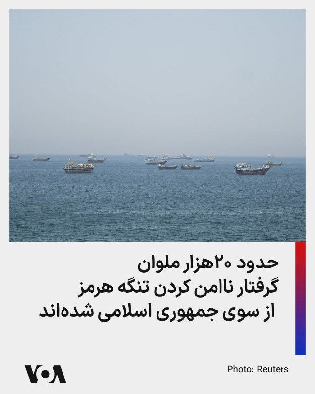

⚡️ناامن کردن تنگه هرمز و حمله به کشتی‌های تجاری از سوی جمهوری اسلامی، هزاران ملوان را هفته‌ها است که در آب‌های اطراف آن سرگردان کرده و مواد خوراکی آن‌ها نیز رو به اتمام است. وال‌استریت ژورنال در گزارشی تعداد ملوانان سرگردان را حدود ۲۰هزار نفر گزارش کرد.
@FarsiVOA

## FarsiVOA — post 217304

🔺جنگ خاورمیانه و محدودیت‌های صادراتی چین باعث نگرانی در مورد کمبود عرضه اسید سولفوریک در جهان شد

▪️به گزارش وال‌استریت ژورنال، جنگ در خلیج فارس و محدودیت‌های جدید صادراتی چین، باعث جهش قیمت اسید سولفوریک شده و نگرانی‌هایی را درباره دسترسی به این ماده شیمیایی ایجاد کرده است.

⬇️ بیشتر بخوانید:
https://ir.voanews.com/a/8148325.html
@FarsiVOA

## FarsiVOA — post 217303

🔺وال‌استریت ژورنال: اسرائیل برای مقابله با جمهوری اسلامی در غرب عراق یک پایگاه نظامی مخفیانه ساخت

▪️روزنامه وال‌استریت ژورنال به نقل از مقامات آمریکایی گزارش داد که اسرائیل برای پشتیبانی از حملات هوایی خود علیه رژیم ایران، یک پایگاه نظامی مخفی در صحرای غربی عراق ایجاد کرد.

⬇️ بیشتر بخوانید:
https://ir.voanews.com/a/8148324.html
@FarsiVOA

## FarsiVOA — post 217302

  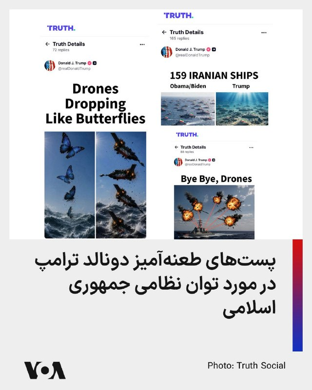

⚡️دونالد ترامپ، رئیس جمهوری آمریکا، عصر شنبه ۱۹ شهریور چندین پست طعنه‌آمیز در مورد جمهوری اسلامی در شبکه تروت‌سوشال منتشر کرد.

یکی از این پست‌ها گرافیکی است با عنوان «خداحافظ پهپادها» که منهدم شدن پهپادها توسط یک کشتی آمریکایی را به تصویر کشیده است.

پست دیگری یکی از جملات آقای ترامپ در توصیف دفع حمله پهپادی جمهوری اسلامی را نشان می‌دهد که گفته بود پهپادها پس از حمله به سه‌کشتی آمریکایی در تنگه هرمز «مثل پروانه» افتادند.

و پست دیگری چندین کشتی با پرچم جمهوری اسلامی را نشان می‌دهد که بالای آن نوشته شده‌است مربوط به دوران «اوباما/بایدن» و در کنار آن همان کشتی‌ها را در کف دریا نشان می‌دهد و بالای آن نوشته شده است که مربوط به دوران ترامپ است. آقای ترامپ گفته است آمریکا ۱۵۹ کشتی جمهوری اسلامی را منهدم کرده است.
@FarsiVOA

## FarsiVOA — post 217301

  <a href="telegram/content/FarsiVOA_217301_1778398724.mp4" target="_blank">🎬 Download video</a>

⚡️مارک لوین، چهره رسانه‌ای نزدیک به پرزیدنت ترامپ، می‌گوید که مردم ایران آماده مبارزه با رژیم جمهوری اسلامی هستند و باید آنها را مسلح کرد.
@FarsiVOA

## DW_Farsi — post 124496

🔸چه کسانی از جنگ در ایران سود می‌برند؟

🔻گزارشی از آتفه چهارمحالیان

با ادامه درگیری‌های نظامی میان ایران، آمریکا و اسرائیل و هم‌زمان با تشدید بحران‌های اقتصادی و سیاسی در ایران پرسش درباره این‌که هزینه‌های جنگ بر دوش چه کسانی قرار می‌گیرد و چه بخش‌هایی از ساختار قدرت از این وضعیت سود می‌برند، به یکی از موضوعات بحث‌برانگیز اقتصاد سیاسی کشور تبدیل شده است.

مهرداد وهابی، پژوهشگر ، نویسنده و استاد اقتصاد دانشگاه سوربن شمالی فرانسه در گفت‌وگو با دویچه وله به تعدادی از پرسش‌های جاری در فضای عمومی درباره پیامدهای اقتصادی جنگ پاسخ داده است. به باور او، اقتصاد ایران پیش از جنگ نیز با تورم مزمن، شوک‌های ارزی، کاهش ارزش ریال و کسری بودجه روبه‌رو بوده، اما شرایط جنگی این بحران‌ها را تشدید کرده است.

از منظر این اقتصاددان، در حالی که بخش بزرگی از جامعه، نیروی کار و دولت رسمی ایران از پیامدهای جنگ آسیب دیده‌اند، نهادهای وابسته به بخش ولایی و سپاه پاسداران انقلاب اسلامی از افزایش قیمت نفت، تجارت موازی و تمرکز بیشتر منابع اقتصادی سود برده‌اند.

@dw_farsi

## DW_Farsi — post 124495

  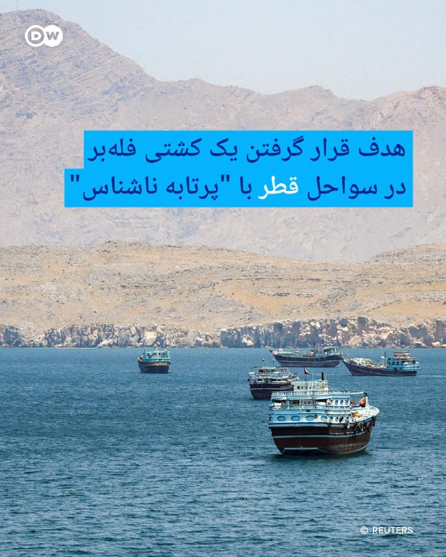

🔸هدف قرار گرفتن یک کشتی فله‌بر در سواحل قطر با "پرتابه ناشناس"

مرکز عملیات تجارت دریایی بریتانیا (UKMTO) روز یکشنبه دهم مه (۲۰ اردیبهشت) اعلام کرد که یک کشتی فله‌بر در حالی که در فاصله ۲۳ مایل دریایی (۴۳ کیلومتری) شمال‌شرقی دوحه، پایتخت قطر، در حال حرکت بود، هدف اصابت یک پرتابه ناشناس قرار گرفت.

طبق این گزارش، این حادثه باعث بروز یک آتش‌سوزی کوچک شد که بعدا مهار و خاموش شد و هیچ تلفات جانی یا خسارت زیست‌محیطی در پی وقوع این حادثه رخ نداده است.

این مرکز اعلام کرده است که مقام‌ها در حال بررسی منشأ این پرتابه هستند و به کشتی‌های حاضر در منطقه توصیه شده است تا با احتیاط تردد کنند.

@dw_farsi

## DW_Farsi — post 124494

  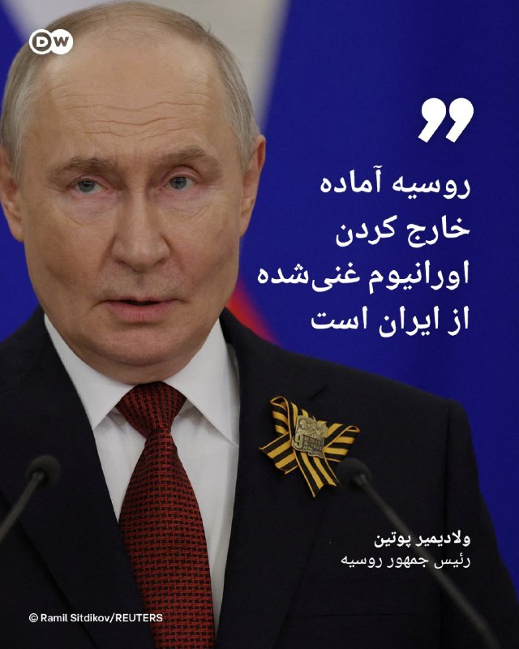

🔸پوتین: روسیه آماده خارج کردن اورانیوم غنی‌شده از ایران است

ولادیمیر پوتین، رئیس جمهور روسیه، اعلام کرد، این کشور آماده است در صورت نیاز به عنوان بخشی از توافق برای پایان دادن به جنگ ایران، اورانیوم غنی‌شده ایران را به روسیه منتقل و از آن نگهداری کند.

پوتین روز شنبه ۱۹ اردیبهشت در یک کنفرانس خبری عنوان کرد روسیه پیش‌تر در سال ۲۰۱۵ نیز اورانیوم غنی‌شده ایران را منتقل کرده بود و مسکو آماده "تکرار این تجربه" است.

به گفته پوتین، ایران، آمریکا و اسرائیل پیش‌تر با انتقال اورانیوم به خارج موافقت کرده بودند اما "سپس ایالات متحده موضع خود را سخت‌تر کرد و خواستار آن شد که اورانیوم فقط به خاک آمریکا منتقل شود و در پی این امر، ایران هم موضع خود را سخت‌تر کرد".

رئیس جمهور روسیه درگیری میان آمریکا و ایران را "بسیار دشوار و پیچیده" توصیف کرد و گفت، مسکو در موقعیت دشواری قرار دارد زیرا هم با ایران و هم با کشورهای عربی حاشیه خلیج فارس روابط دوستانه دارد. او افزود، روسیه همچنان با ایران و آمریکا در تماس خواهد بود و امیدوار است این درگیری "هر چه سریعتر حل و فصل شود".

@dw_farsi

## DW_Farsi — post 124493

  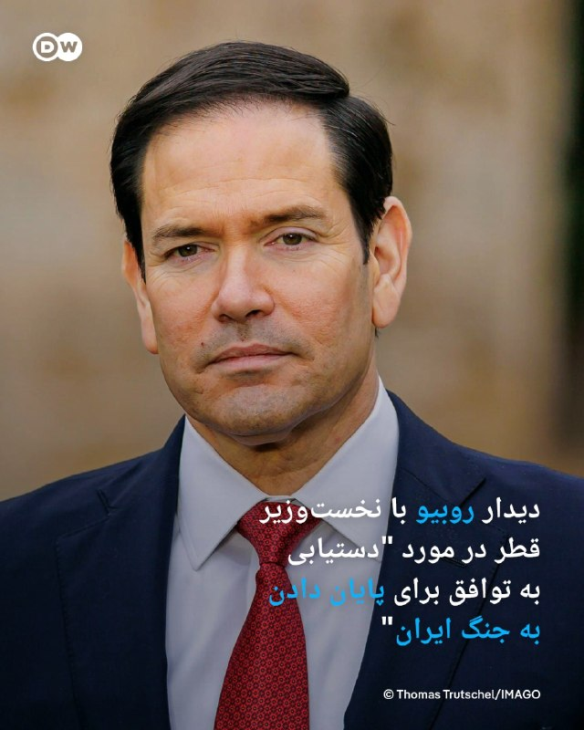

🔸دیدار روبیو با نخست‌وزیر قطر در مورد "دستیابی به توافق برای پایان دادن به جنگ ایران"

مارکو روبیو، وزیر خارجه آمریکا، روز شنبه ۱۹ اردیبهشت با شیخ محمد بن عبدالرحمن بن جاسم آل ثانی، نخست‌وزیر و وزیر خارجه قطر، دیدار کرد.

به گفته وزارت خارجه آمریکا، روبیو در گفت‌وگو با همتای قطری خود بر نقش این کشور به عنوان یک میانجی کلیدی برای واشنگتن تأکید کرده است.

تامی پیگوت، سخنگوی وزارت خارجه آمریکا، در بیانیه‌ای اظهار داشت، وزیر خارجه ایالات متحده "از همکاری و شراکت قطر در طیفی از مسائل قدردانی کرد".

به گفته او، روبیو و آل ثانی همچنین درباره "حمایت آمریکا از توان دفاعی قطر و اهمیت ادامه هماهنگی نزدیک برای بازدارندگی در برابر تهدیدات و تقویت ثبات و امنیت در سراسر خاورمیانه گفت‌وگو کردند".

در همین حال سایت خبری "اکسیوس" در گزارشی به نقل از دو منبع آگاه نوشت، در دیدار روبیو با نخست‌وزیر قطر که در میامی برگزار شد، استیو ویتکاف، فرستاده ویژه دونالد ترامپ، حضور داشت. به نوشته اکسیوس و به نقل از دو منبع مطلع، این دیدار بخشی از تلاش‌ها برای دستیابی به توافقی به منظور پایان دادن به جنگ با ایران بوده.

@dw_farsi

## DW_Farsi — post 124492

  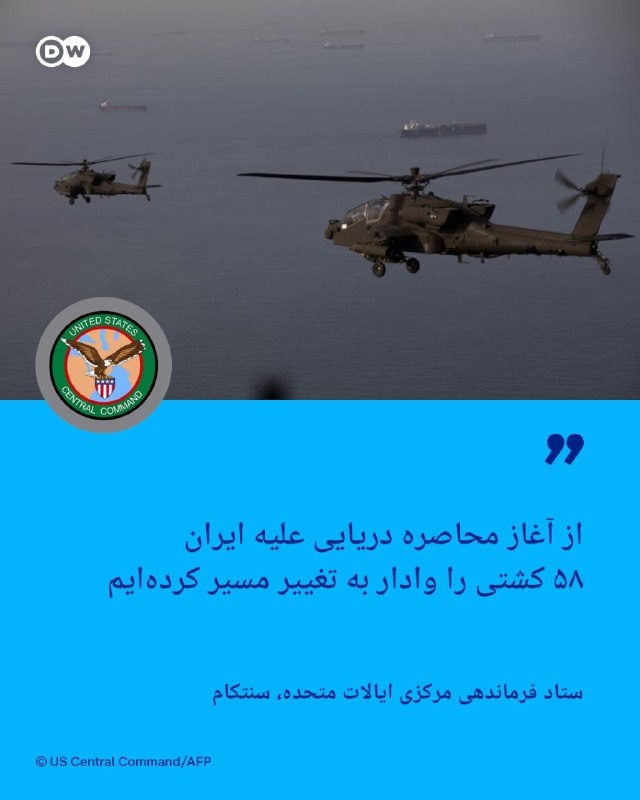

🔸سنتکام: از آغاز محاصره دریایی علیه ایران ۵۸ کشتی را وادار به تغییر مسیر کرده‌ایم

ستاد فرماندهی مرکزی ایالات متحده، سنتکام، با انتشار پیامی در ایکس اعلام کرد که نیروهای دریایی آمریکا از ابتدای محاصره دریایی علیه بنادر ایران، ۵۸ کشتی تجاری را وادار به "تغییر مسیر" کرده‌اند.

در این پیام که روز شنبه نهم مه (۱۹ اردیبهشت) منتشر شد، آمده است که نیروهای سنتکام همچنین "چهار شناور را از کار انداخته‌اند تا از ورود یا خروج کشتی‌ها به بنادر ایران جلوگیری کنند".

سنتکام همچنین در پست دیگری در ایکس با انتشار تصاویری از ملوانان ناو هواپیمابر آبراهام لینکلن نوشت که آنها "شبانه‌روز در حال انجام عملیات تعمیر و نگهداری هستند تا هواپیماهای مستقر در دریا را برای اجرای مأموریت‌ها آماده نگه دارند".

ارتش آمریکا روز جمعه با انتشار بیانیه‌ای اعلام کرده بود که دو کشتی "ام‌ تی سی استار" و "ام تی سودا" را پیش از ورود به یکی از بنادر ایران در خلیج عمان متوقف کرده و از کار انداخته است.

@dw_farsi

## DW_Farsi — post 124491

  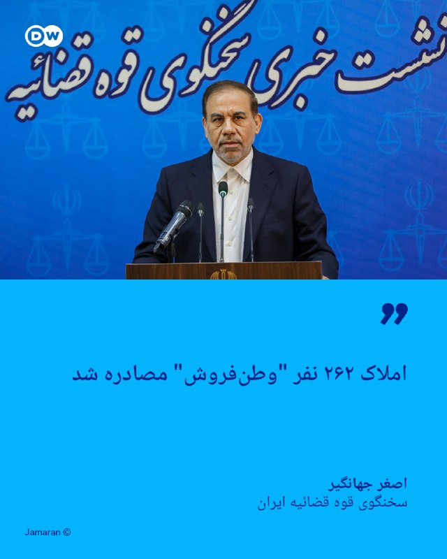

🔶 سخنگوی قوه قضائیه: املاک ۲۶۲ نفر "وطن‌فروش" مصادره شد

بنا بر اعلام سخنگوی قوه قضائیه ایران، املاک ۲۶۲ نفر که "وطن‌فروش" خوانده شده‌اند از سوی دستگاه قضایی جمهوری اسلامی توقیف شده است.

اصغر جهانگیر روز شنبه ۱۹ اردیبهشت در سخنانی درباره "عملکرد دستگاه قضایی در دوران جنگ" گفت: «این املاک علاوه بر حساب‌ها و سایر اموالی است که از مزدوران و متهمان شناسایی و توقیف شده و پس از طی مراحل قانونی در صورت تایید نهایی حکم مصادره در دادگاه، به نفع ملت ایران مصادره خواهد شد.»

جهانگیر با اشاره به اینکه تصویب "قانون تشدید مجازات همکاری با اسرائیل" از سوی مجلس شورای اسلامی در سال گذشته، بسترهای قانونی لازم را برای این اقدام فراهم کرد، افزود: «بر اساس این قانون، امکان پیگیری و مجازات این افراد چه از منظر کیفری و چه از لحاظ مالی در داخل و خارج از مرزها فراهم شده و اقدامات لازم نیز در این زمینه صورت گرفته است.»

سازمان‌های حقوق بشری نسبت به استفاده از مجازات‌هایی چون مصادره اموال به عنوان ابزار سرکوب هشدار داده‌اند.
@dw_farsi

## DW_Farsi — post 124490

  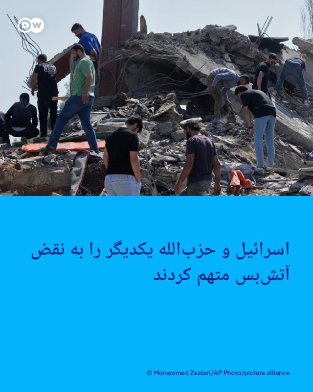

🔶 اسرائیل و حزب‌الله یکدیگر را به نقض آتش‌بس متهم کردند

اسرائیل و حزب‌الله لبنان یکدیگر را به نقض توافقات آتش‌بس متهم کرده‌اند. اسرائیل، شبه‌نظامیان حزب‌الله را به حملات راکتی جدید متهم کرده و در پی آن از حملات گسترده در لبنان خبر داده است.

ارتش اسرائیل اعلام کرد، در ۲۴ ساعت گذشته ۸۵ هدف متعلق به حزب‌الله در لبنان را مورد حمله قرار داده است. این اهداف شامل انبارهای سلاح، سکوهای پرتاب و دیگر زیرساخت‌های نظامی بوده است.

به گزارش وزارت بهداشت لبنان بر اثر حملات ارتش اسرائیل در روز شنبه ۹ مه (۱۹ اردیبهشت) حداقل ۸ نفر کشته و پانزده نفر دیگر نیز زخمی شده‌اند. ارتش اسرائیل نیز از زخمی شدن سه سرباز خبر داده است.

ارتش اسرائیل اعلام کرد، این عملیات به خاطر ضرورت مقابله با تهدیدات علیه غیرنظامیان اسرائیلی و سربازان این کشور در جنوب لبنان صورت گرفته است.

همچنین گفته شده است، یک تاسیسات زیرزمینی در دره بقاع که گفته می‌شود حزب‌الله از آن برای تولید سلاح استفاده می‌کرد، منهدم شده است.

ارتش اسرائیل حزب‌الله را متهم کرد، در روزهای گذشته چندین راکت به سمت سربازان این کشور در جنوب لبنان شلیک کرده است.
@dw_farsi

## DW_Farsi — post 124489

  <a href="telegram/content/DW_Farsi_124489_1778398728.mp4" target="_blank">🎬 Download video</a>

🎥 جنگ در ایران؛ بحران پلاستیک در جنوب شرق آسیا

بحران کمبود پلاستیک در جنوب ‌شرق آسیا، زنجیره تأمین را به‌شدت تحت تأثیر قرار داده است.

افزایش قیمت نفت خام و وابستگی تولید پلی‌اتیلن به آن، بازار را با نوسان جدی روبه‌رو کرده و برخی کارخانه‌ها را مجبور به کاهش تولید یا توقف بخشی از خطوط کرده است.
@dw_farsi

## DW_Farsi — post 124488

  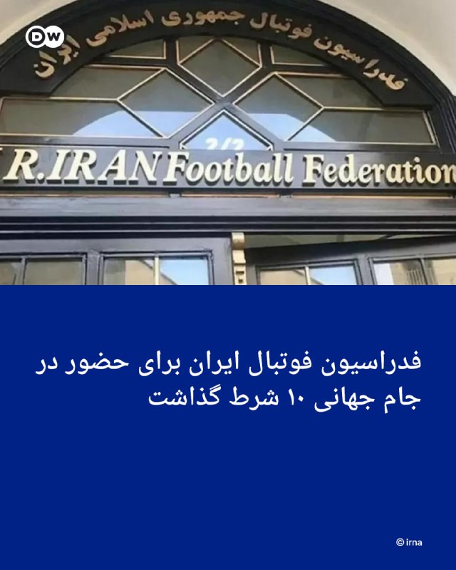

🔶 فدراسیون فوتبال ایران برای حضور در جام جهانی ۱۰ شرط گذاشت

ایران با وجود وضعیت متشنج سیاسی و ادامه جنگ در خاورمیانه در جام جهانی فوتبال ۲۰۲۶ شرکت خواهد کرد.

فدراسیون فوتبال ایران روز شنبه ۱۹ اردیبهشت (۹ مه) در حالی این خبر را به صورت رسمی اعلام کرد که حضور تیم ملی را به شروطی در قبال سه کشور میزبان یعنی آمریکا، مکزیک و کانادا گره زد.

این فدراسیون در وب‌سایت رسمی خود اعلام کرد: «ما قطعا در جام جهانی ۲۰۲۶ شرکت خواهیم کرد اما میزبانان باید نگرانی‌های ما را در نظر بگیرند.»

فدراسیون فوتبال ایران همچنین تاکید کرد: «ما در جام جهانی شرکت خواهیم کرد اما بدون هیچ عقب‌نشینی از باورها، فرهنگ و اصول خود.»

کانادا پیش از برگزاری کنگره فیفا از ورود مهدی تاج، رئیس فدراسیون فوتبال ایران به این کشور جلوگیری کرده بود.

این تصمیم به خاطر ارتباطات مهدی تاج با سپاه پاسداران انقلاب اسلامی بود که کانادا در سال ۲۰۲۴ آن را سازمانی تروریستی اعلام کرد.
@dw_farsi

## DW_Farsi — post 124487

  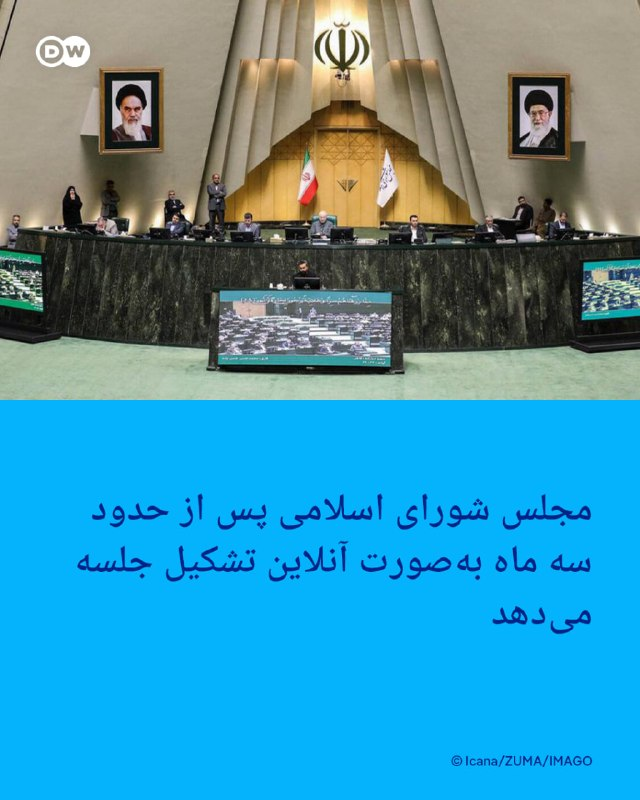

🔶 مجلس شورای اسلامی پس از حدود سه ماه به‌صورت آنلاین تشکیل جلسه می‌دهد

مجلس شورای اسلامی ایران در حالی که نزدیک به سه ماه تعطیلی جلسات را در پیش گرفت، حالا با وجود آتش‌بس قرار است نخستین جلسه علنی خود را به‌صورت آنلاین برگزار کند.

این خبر را سخنگوی هیات رئیسه مجلس شورای اسلامی اعلام کرد و گفت، نخستین جلسه مجلس پس از جنگ ۴۰ روزه برای بررسی گرانی‌ها و به صورت آنلاین برگزار خواهد شد.

عباس گودرزی، سخنگوی هیات رئیسه مجلس به خبرگزاری ایرنا گفت: «جلسه صحن مجلس در روز یکشنبه ۲۰ اردیبهشت به دلیل تدابیر اعلامی و مبتنی بر شرایط موجود به صورت ویدئوکنفرانس برگزار خواهد شد و نمایندگان به بررسی ابعاد مختلف التهابات اخیر بازار، نگرانی‌های معیشتی مردم و گرانی‌های اخیر خواهند پرداخت.»

آخرین جلسه علنی مجلس پیش از آغاز جنگ ۴۰ روزه در ۲۸ بهمن ماه ۱۴۰۴ برگزار شده بود.
@dw_farsi

## DW_Farsi — post 124486

  

🔶 اعزام ناوشکن بریتانیایی به منطقه خلیج فارس

ارتش بریتانیا ناوشکن "اچ‌ام‌اس دراگون" (HMS Dragon) را از دریای مدیترانه به منطقه خلیج فارس اعزام خواهد کرد.
وزارت دفاع بریتانیا روز شنبه ۹ مه (۱۹ اردیبهشت) اعلام کرد، "این ناو می‌تواند در یک ماموریت بین‌المللی احتمالی برای تامین امنیت تردد کشتی‌ها در تنگه هرمز مشارکت کند."

سخنگوی وزارت دفاع بریتانیا به خبرگزاری فرانسه گفت، "استقرار این ناوشکن بخشی از برنامه‌ریزی محتاطانه‌ای است که تضمین می‌کند، این کشور به‌عنوان بخشی از یک ائتلاف چندملیتی تحت رهبری مشترک بریتانیا و فرانسه آماده است، در صورت فراهم بودن شرایط، این تنگه را ایمن‌سازی کند."

به گفته این مقام مسئول، پس از پایان درگیری‌ها در منطقه، این کشتی می‌تواند از جمله در عملیات مین‌روبی نیز کمک کند.

بریتانیا و فرانسه در نشستی در ماه آوریل سال جاری در لندن با تامین امنیت نظامی تردد کشتی‌ها در تنگه هرمز موافقت کرده بودند.

آلمان نیز از دیگر کشورهایی است که از این اقدام حمایت کرده و در حال حاضر نیز یک کشتی مین‌روب نیروی دریایی این کشور به سمت منطقه در حال حرکت است.
@dw_farsi

## DW_Farsi — post 124485

  

🔶 قطع سراسری اینترنت در ایران وارد یازدهمین هفته شد

نت بلاکس، نهاد ناظر بر وضعیت دسترسی به اینترنت در جهان اعلام کرد، قطع سراسری اینترنت در ایران وارد یازدهمین هفته شده است.

این نهاد با اعلام اینکه ۱۶۸۰ ساعت از قطع ارتباط کامل اینترنت ایران با جهان گذشته است، در پیامی در شبکه ایکس نوشت: «این اقدام سدی فوق‌العاده بزرگ در برابر دانش، اطلاعات و ارتباطات برای ایرانیانی است که در تلاش‌اند به امورات زندگی روزمره خود بپردازند.»

این نهاد پیش‌تر اعلام کرده بود، "این شدیدترین و طولانی‌ترین قطع دسترسی کاربران به اینترنت بین‌المللی از سوی یک حکومت محسوب می‌شود که تاکنون صورت گرفته است".

مسدودسازی اینترنت اواخر فوریه و با آغاز جنگ آمریکا و اسرائیل علیه جمهوری اسلامی ایران آغاز شد. پیش‌تر نیز در جریان اعتراضات دی‌ماه ۱۴۰۴ اینترنت برای مدتی قطع شده بود.
@dw_farsi

## DW_Farsi — post 124484

  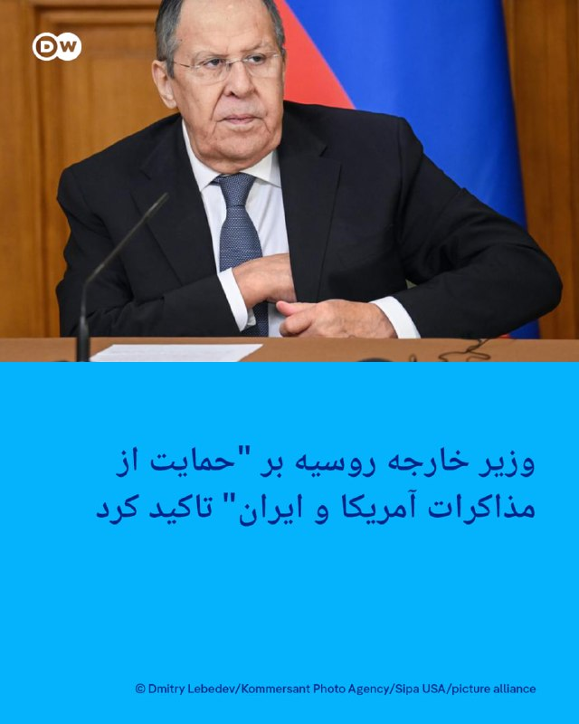

🔶وزیر خارجه روسیه بر "حمایت از مذاکرات آمریکا و ایران" تاکید کرد

سرگئی لاوروف، وزیر امور خارجه روسیه در گفت‌وگوی تلفنی با عبدالله بن زاید آل نهیان، همتای خود در امارات متحده عربی گفت، "گفت‌وگوهای میان ایالات متحده آمریکا و ایران باید مورد حمایت قرار گیرد تا از سرگیری درگیری‌های خصمانه در خاورمیانه جلوگیری شود".

در بیانیه وزارت امور خارجه روسیه درباره این گفت‌و‌گو آمده است: «طرف روسی بر ضرورت تمرکز بر حمایت از مذاکرات جاری میان ایران و ایالات متحده تاکید کرد.»

روسیه همچنین تاکید کرده است، "نمی‌خواهد با از سرگیری درگیری‌ها، چشم‌اندازهای ثبات را به خطر بیندازد".

در هفته های اخیر ولادیمیر پوتین، رئیس‌جمهور روسیه در دیدار با عباس عراقچی، وزیر امور خارجه ایران در سن‌پترزبورگ، جمهوری اسلامی را مطمئن کرد، "حمایت مسکو از ایران ادامه خواهد یافت".

پوتین در این دیدار گفته بود: «ما می‌بینیم که مردم ایران چگونه شجاعانه و قهرمانانه برای استقلال و حاکمیت خود مبارزه می‌کنند. ما هر کاری که در راستای منافع آنها و همه مردم منطقه باشد انجام خواهیم داد تا صلح هرچه سریع‌تر برقرار شود.»
@dw_farsi

## DW_Farsi — post 124483

🔶 جنگ ایران و درس‌های پکن از ضعف آمریکا، به روایت پولیتیکو

در حالی که دونالد ترامپ، رئیس جمهور آمریکا و همتای چینی‌اش، شی جین‌پینگ، خود را برای دیداری حساس در هفته آینده آماده می‌کنند، مجله آمریکایی "پولیتیکو" در گزارشی که روز جمعه ۸ مه (۱۸ اردیبهشت) منتشر کرد، نوشت که جنگ فرسایشی و پیچیده میان آمریکا و ایران، همزمان با آشکار کردن محدودیت‌های قدرت واشنگتن، به منبعی ارزشمند برای دستگاه نظامی و اطلاعاتی چین تبدیل شده است.

به نوشته پولیتیکو، پکن اکنون با دقت می‌بیند که آمریکا نتوانسته محاصره ایران در تنگه هرمز را بشکند، برای مهار حملات تهران مجبور به استفاده گسترده از آتش سنگین شده، و همزمان دولت ترامپ برای خروج از جنگی که در داخل آمریکا محبوبیت اندکی دارد، با دشواری روبه‌روست. افزون بر این، افزایش شدید قیمت جهانی نفت و گاز و تغییر اولویت‌های راهبردی پنتاگون نیز از نگاه چین دور نمانده است.

پولیتیکو می‌نویسد اسناد راهبردی جدید وزارت دفاع آمریکا نشان می‌دهند که مهار چین دیگر اولویت نخست واشنگتن نیست؛ موضوعی که به گفته مقام‌های کنونی و پیشین دفاعی آمریکا، می‌تواند به پکن این تصور را بدهد که آمریکا تمرکز و منابع لازم برای رقابت بلندمدت در منطقه هند-اقیانوس آرام را از دست می‌دهد.

مجله آمریکایی در این گزارش به نقل از یکی از مقام‌های پیشین دفاعی آمریکا می‌نویسد: «چینی‌ها کاملاً حق دارند بپرسند: "دیگر با چه چیزی می‌خواهید بازدارندگی ایجاد کنید؟"» این مقام افزوده است: «برای اینکه یک معامله بزرگ جواب بدهد، باید پشت آن قدرت واقعی وجود داشته باشد. در این مسئله نمی‌شود بلوف زد.»

پولیتیکو یادآوری می‌کند که دیدار پیش روی ترامپ و شی، دو ماه پس از آن برگزار می‌شود که رئیس جمهور آمریکا نشست اولیه در پکن را به دلیل تمرکز بر جنگ ایران به تعویق انداخت. اما به نوشته این رسانه، آنچه قرار بود کارزاری سریع برای نابودی برنامه هسته‌ای ایران باشد، اکنون به جنگی طولانی‌تر و پیچیده‌تر بر سر کنترل تنگه هرمز تبدیل شده است؛ گذرگاهی که حدود ۲۰ درصد نفت جهان از آن عبور می‌کند.

به نوشته پولیتیکو، مقام‌های دفاعی آمریکا معتقدند ارتش چین با دقتی بسیار بالا، جزئیات عملیات نظامی واشنگتن علیه ایران را مطالعه می‌کند. یکی از مقام‌های دفاعی آمریکا به این رسانه گفته است: «ارتش چین بدون تردید عملیات ما علیه ایران را با دقت زیر نظر دارد تا آسیب‌پذیری‌هایی را که در صورت درگیری با آمریکا می‌تواند از آنها بهره ببرد، شناسایی کند.»

او افزوده است که پکن نه فقط نتایج عملیات، بلکه شیوه طراحی و اجرای آنها را نیز، از سرعت حملات موشکی گرفته تا فرآیند جمع‌آوری اطلاعات، بررسی می‌کند. پولیتیکو می‌نویسد سفارت چین، پنتاگون و کاخ سفید به درخواست این رسانه برای اظهار نظر پاسخی نداده‌اند.

به باور نویسندگان گزارش، چین که در سال‌های اخیر سرمایه‌گذاری عظیمی روی موشک‌های دوربرد و پهپادها انجام داده، اکنون می‌بیند که آمریکا برای بازگشایی تنگه هرمز و جلوگیری از حملات ایران به کشتی‌های جنگی و متحدانش در منطقه، با مشکلات جدی روبه‌روست. همچنین انتقال کشتی‌ها، سامانه‌های دفاع هوایی و نیروها از اقیانوس آرام به خاورمیانه، به نوشته پولیتیکو، نشانه‌ای است از اینکه ذخایر تسلیحاتی آمریکا نامحدود نیست.

یکی دیگر از مقام‌های دفاعی آمریکا به پولیتیکو گفته است: «پنتاگون هنوز در سطح تاکتیکی عملکرد قدرتمندی از خود نشان می‌دهد. اما بدون سیاست و استراتژی روشن، ما در سطح عملیاتی جنگ دچار مشکل هستیم.» او افزوده است: «پرسشی که باید پاسخ داده شود این است که آیا این مسئله منحصر به دولت کنونی است، یا مشکلی گسترده‌تر در شیوه جنگ‌آوری آمریکا است.»

در مقابل، مقام‌های رسمی پنتاگون تأکید کرده‌اند که انتقال تجهیزات به خاورمیانه، آمادگی آمریکا در منطقه اقیانوس آرام را تضعیف نکرده است. پولیتیکو به نقل از ساموئل پاپارو، فرمانده نیروهای آمریکایی در منطقه هند-اقیانوس آرام، می‌نویسد او ماه گذشته به قانون‌گذاران آمریکایی گفته بود: «من هیچ هزینه واقعی‌ای برای توانایی ما در بازدارندگی در برابر چین نمی‌بینم.»

آدمیرال پاپارو همچنین استدلال کرده که تجربه عملیاتی به‌دست‌آمده از جنگ ایران، برای نیروهای آمریکایی، به‌ویژه در مقایسه با ارتش چین که تجربه عملیاتی محدودی دارد، از ارزش بالایی برخوردار است.
@dw_farsi

## DW_Farsi — post 124482

🔶 "ویروس هانتا تهدید جدی برای اروپا محسوب نمی‌شود"

روبرت کراوزه (Robert Krause) متخصص برجسته اهل اتریش در زمینه بیماری‌های عفونی به سوالات سرویس خبری آنلاین شبکه دوم تلویزیون آلمان، ZDFheute پاسخ داده و آنچه تاکنون درباره ویروس هانتا باید دانست را شرح داده است.

این متخصص بیماری‌های عفونی با بیان اینکه ویروس هانتای آند (Andes-Hantavirus) یک نوع خاص از ویروس هانتا است که در آمریکای جنوبی، به‌ویژه در آرژانتین و شیلی وجود دارد، تاکید کرد، " این ویروس در اروپا وجود ندارد".

سازمان بهداشت جهانی نیز پیش‌تر اعلام کرد، "منشا اولیه آلودگی احتمالا از سفرهای قبلی مسافران به آرژانتین و شیلی بوده و سپس در داخل کشتی تقریحی گسترش یافته است".

کراوزه می‌گوید: «در اینجا با یک ویروس هانتا از نوع موسوم به "دنیای جدید" سروکار داریم. برای مثال در آمریکای شمالی نیز چنین ویروس‌های هانتای متعلق به دنیای جدید وجود دارند که به آنها ویروس‌های "سین نومبره" (Sin-Nombre) گفته می‌شود.»

ویژگی این ویروس‌های هانتا این است که در مقایسه با ویروس‌های هانتایی که در اروپا وجود دارد، دوره‌های بیماری شدیدتری ایجاد می‌کند و خطرناکتر است.

سازمان جهانی بهداشت از احتمال انتقال انسان به انسان این ویروس خبر داده که نگرانی‌ها درباره شیوع این ویروس در فضاهای بسته را بیشتر کرده است.

روبرت کراوزه در این باره می‌گوید: «در صورت ابتلا به این ویروس‌، بیماری‌ای ایجاد می‌شود که "سندرم قلبی-ریوی ویروس هانتا" نام دارد. این یک اصطلاح پزشکی و توصیف‌گر این است که اختلالی در عملکرد ریه ایجاد می‌شود. این وضعیت منجر به نارسایی ریوی و همچنین نارسایی قلبی می‌شود؛ یعنی از کار افتادن دو ارگان حیاتی بدن.»

به گفته کراوزه "اگر چنین بیماری‌ای رخ دهد، باید نارسایی ریوی به‌صورت مکانیکی درمان یا با دستگاه تنفس مصنوعی پشتیبانی شود تا این مرحله دشوار بیماری عفونی حاد پشت سر گذاشته و امکان زنده ماندن فراهم شود".

به گزارش رویترز، تاکنون در پی شیوع ویروس هانتا در کشتی تقریحی کروز، ابتلای شش نفر به طور قطعی تایید شده و دو مورد مشکوک دیگر نیز تحت نظر هستند؛ این در حالی است که تاکنون سه نفر از مبتلایان جان خود را از دست داده‌اند.

ابتلای این افراد به ویروس هانتا در حالی است که برای این عفونت ویروسی هیچ داروی مستقیمی که علیه خود ویروس‌ها موثر باشد، وجود ندارد.
بنا به گفته روبرت کراوزه، متخصص برجسته اهل اتریش، آزمایش‌هایی تاکنون با چندین دارو انجام شده که می‌توانند بیماری را مهار کنند اما اینها، داروهایی هستند که تنها می‌توانند مانع از خروج مایعات به درون ریه شده یا بر آن تاثیر بگذارند.

کراوزه توضیح می‌دهد: «با این داروها می‌توان روند بیماری را تا حدی تضعیف کرد؛ ما نیز گاهی اوقات در موارد شدید عفونت‌های ویروس هانتا که در اروپا یافت می‌شود و در مقایسه با عفونت‌های ویروس هانتا در آمریکا نادر است، این کار را انجام می‌دهیم اما متاسفانه در حال حاضر هیچ درمانی که مستقیما علیه این ویروس‌ موثر باشد وجود ندارد و تنها تسکین علائم امکان‌پذیر است.»

این متخصص بیماری‌های عفونی همچنین درباره احتمال گسترش این گونه از ویروس هانتا در اروپا گفت: «این ویروس در اروپا اصلا گسترش نخواهد یافت زیرا در مورد افرادی که از قبل مشخص شده به آن مبتلا هستند، می‌توان اقدامات احتیاطی انجام داد. برای این منظور، در بیمارستان‌ها پروتکل‌های مشخصی وجود دارد تا از انتقال چنین عفونت‌هایی به کارکنان یا افرادی که از این بیماران مراقبت می‌کنند، جلوگیری شود.»

با وجود اینکه این ویروس همراه با این کشتی تفریحی به اروپا وارد شده است اما بنا به گفته کراوزه "ناقل این نوع از ویروس‌ هانتا در اروپا وجود ندارد، چرا که این ناقل، گونه خاصی از جوندگان یعنی موش برنج (Reisratte) است که در اروپا یافت نمی‌شود و به همین دلیل، ویروس نمی‌تواند در اروپا بیشتر گسترش یابد".
@dw_farsi

## DW_Farsi — post 124481

🔶 پارادوکس هرمز؛اهرم صعود به قدرت جهانی یا قمار بر کارت سوخته؟

🔻 گزارشی از الینا فرهادی

در فضای غبارآلود پساجنگ ۳۸ روزه ایالات متحده و اسرائیل علیه ایران، تنگه هرمز بار دیگر از یک گذرگاه تجاری صرف به "مرکز ثقل" رقابت‌های ژئوپولیتیک قرن بیست‌ و یکم بدل شده است.

این شریان حیاتی که نبض یک‌پنجم تجارت نفت جهان در آن می‌تپد، اکنون فراتر از یک مسیر ترانزیتی، به مثابه ابزاری برای جراحی موازنه قدرت در خاورمیانه و بازتعریف قواعد بازی در سطحی جهانی نگریسته می‌شود.

علیرغم استقرار یک آتش‌بس لرزان میان تهران و واشنگتن، تداوم فرسایشی درگیری‌های دریایی، حملات جراحی‌شده به زیرساخت‌های کلان انرژی و دیپلماسی سایه، نشان از آن دارد که بحران تنها از فاز "تخریب سخت" به فاز "فشار ساختاری" منتقل شده و جمهوری اسلامی ایران با وقوف بر وزن استراتژیک خود، در پی آن است تا اقتدار بر هرمز را از یک "سپر بازدارنده" به یک "اهرم تثبیت‌کننده" در معماری نظم نوین جهانی ارتقا دهد.

با این حال، یک پرسش بنیادین سایه خود را بر این راهبرد افکنده است: آیا تسلط بر این گلوگاه استراتژیک می‌تواند کاتالیزور تبدیل ایران به یک قدرت بزرگ جهانی باشد، یا این اهرم نیز به سرنوشت "دکترین هسته‌ای" دچار شده و با استفاده نامتقارن، به ابزاری فرسایشی و تهدیدی وجودی علیه منافع ملی ایران بدل خواهد شد؟

دویچه‌ وله فارسی در گفت‌وگو با دو صاحب‌نظر، به کالبدشکافی دو سناریوی متضاد پرداخته است؛ علی واعظ، مدیر پروژه ایران در گروه بین‌المللی بحران، با نگاهی واقع‌گرایانه بر محدودیت‌های ساختاری قدرت ملی و ضرورت گذار به امنیت دسته‌جمعی منطقه‌ای تأکید دارد.

در مقابل، دامون گلریز، تحلیلگر امور بین‌الملل و پژوهشگر انستیتوی ژئوپولیتیک لاهه، بر ظهور پارادایم "قدرت ساختاری دریایی" تمرکز می‌کند؛ پدیده‌ای که به زعم او، قادر است هژمونی سنتی ایالات متحده را در آب‌های آزاد به چالش بکشد.

گزارش تازه شبکه آمریکایی سی‌ان‌ان درباره ایجاد مرجع تنگه خلیج فارس (PGSA) و اعمال مقررات جدید بر کشتی‌های عبوری از هرمز، نشانه‌ای از تلاش ایران برای نهادینه‌سازی اقتدار خود بر این آبراه تلقی می‌شود.

بر اساس سندی که سی‌ان‌ان منتشر کرده، تمام کشتی‌های عبوری از هرمز اکنون موظف شده‌اند فرمی بیش از ۴۰ پرسشی را تکمیل کنند؛ فرمی که جزئیات گسترده‌ای از جمله مالکیت کشتی، ملیت خدمه، مسیر حرکت و سوابق شناور را طلب می‌کند. ریچارد مید، سردبیر "لویدز لیست"، به سی‌ان‌ان گفته است که این اقدام "حرکتی از سوی ایران برای عادی‌سازی اقتدار خود بر رفت‌وآمدهای دریایی" به شمار می‌رود.

این نخستین‌بار است که تهران تلاش می‌کند نوعی چارچوب اداری و شبه‌حقوقی رسمی برای مدیریت تردد در هرمز ایجاد کند؛ اقدامی که پس از دور دوم حملات اسرائیل و آمریکا به ایران و محدود شدن عبور کشتی‌های مرتبط با این دو کشور انجام شده است.
این تحول در حالی رخ می‌دهد که همزمان، آمریکا و متحدان اروپایی‌اش در تلاش‌اند مفهوم "آزادی کشتیرانی" را به محور اصلی راهبرد پساجنگ تبدیل کنند.
مارکو روبیو، وزیر خارجه آمریکا، اخیرا اعلام کرد: «ما نمی‌توانیم در جهانی زندگی کنیم که در آن یک کشور تصمیم بگیرد بگوید اکنون این مسیر بین‌المللی کشتیرانی متعلق به ماست.»

برخلاف موضع تهاجمی واشنگتن، اروپا در قبال گزینه نظامی محتاط‌تر ظاهر شده است. امانوئل مکرون، رئیس‌جمهور فرانسه، بازگشایی اجباری تنگه هرمز را "غیرواقع‌بینانه" خوانده و تاکید کرده که چنین اقدامی "تنها با همکاری ایران" ممکن است.

علی واعظ، مدیر پروژه ایران در گروه بین‌المللی بحران در این زمینه معتقد است: «جنگ باعث شد که ایران توانایی جدیدی به دست بیاورد: ایجاد اخلال در اقتصاد جهانی از طریق اعمال کنترل بر تنگه هرمز. این، به‌عنوان یک ابزار بازدارندگی برای ایران موثر است، اما نه به این معنا که بتواند ایران را به یک قدرت جهانی تبدیل کند؛ زیرا قدرت، مؤلفه‌های مختلفی دارد: قدرت اقتصادی، قدرت نظامی، قدرت نرم و قدرت فرهنگی، و کنترل بر تنگه هرمز هیچ‌یک از این مؤلفه‌ها را برای ایران فراهم نخواهد کرد.»

در مقابل این نگاه، دامون گلریز، تحلیلگر مسائل ژئوپولیتیک، تحولات اخیر را خروج از "لاک دفاعی" و ورود به عصر "قدرت ساختاری" می‌بیند.

او با اشاره به بن‌بست راهبردی واشنگتن معتقد است: «واشنگتن سرانجام بر سر یک راهبرد جنگی در چارچوب محاصره نظامی و محاصره دریایی ایران به جمع‌بندی رسیده است: بازگرداندن آزادی عبور و مرور بین‌المللی از تنگه هرمز و در نتیجه حفظ نظم جهانی پیش از جنگ. تهران نیز، از سوی خود اراده سیاسی لازم را برای پاسخ نظامی به ایالات متحده و متحدان منطقه‌ای آن، به‌ویژه امارات متحده عربی، نشان داده است.»

متن کامل گزارش را در وب سایت دویچه وله فارسی بخوانید.
@dw_farsi

## Persian_Trend_Official — post 13808

این بنده خدا نمیدونست من با ایدیش میتونم کامنتهای قبلیش رو ببینم ! 😄

حداقل برای کسی این کامنت رو بزار که ۵ ماه هرشب اتاق جنگ نداشته باشه 🤦🏻

## Persian_Trend_Official — post 13807

  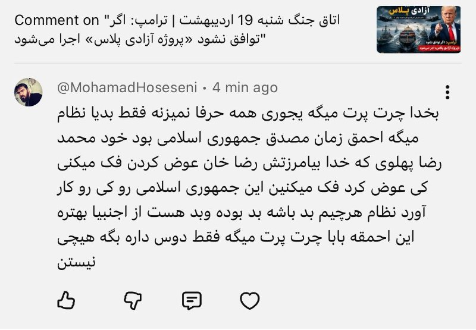

کسی میدونه این زبون بسته چی میخواد بگه ؟ 😄

## Persian_Trend_Official — post 13806

کانال رسمی پرشین ترند pinned «کسایی که متوجه نشدن این یعنی چی این ویدیو رو ببینن https://youtube.com/shorts/3pyfO0CR6W0?si=5WqyK09H2oGXp5Rr»

## Persian_Trend_Official — post 13804

اعزام ناوشکن بریتانیایی به خاورمیانه برای مأموریت احتمالی در تنگه هرمز

بریتانیا اعلام کرد ناوشکن پدافند هوایی «HMS Dragon» را در چارچوب آماده‌سازی برای یک ائتلاف چندملیتی به رهبری مشترک لندن و پاریس به خاورمیانه اعزام کرده است.

این ناوشکن که پیش‌تر برای دفاع از قبرس در شرق مدیترانه مستقر بود، اکنون در صورت فراهم شدن شرایط، می‌تواند در عملیات حفاظت از خطوط کشتیرانی در تنگه هرمز مشارکت کند.

همزمان فرانسه نیز ناوگروه هواپیمابر خود را به جنوب دریای سرخ اعزام کرده و دو کشور در حال تدوین طرحی برای بازگرداندن امنیت و اعتماد به مسیر حیاتی تجارت دریایی منطقه هستند.

طبق گزارش رویترز، حدود ۱۲ کشور آمادگی اولیه خود را برای مشارکت در این ائتلاف اعلام کرده‌اند و اجرای طرح نیازمند هماهنگی با ایران خواهد بود.

☆Phantom☆

📌 @persian_trend_official
پرشین ترند | متفاوت‌ترین کانال نظامی

## Persian_Trend_Official — post 13803

  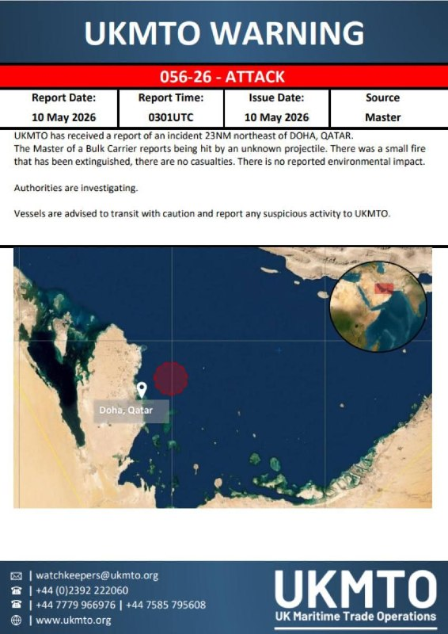

⚡️🇮🇷🇶🇦 UKMTO :
گزارشی از یک حادثه در ۲۳ مایل دریایی شمال‌شرق دوحه، قطر دریافت کرده است.
ناخدای یک کشتی فله‌بر گزارش داده که کشتی با یک پرتابه ناشناس مورد اصابت قرار گرفته است. یک آتش‌سوزی کوچک رخ داده که خاموش شده و هیچ تلفات جانی وجود ندارد. همچنین هیچ‌گونه اثر زیست‌محیطی گزارش نشده است.

☆Phantom☆

📌 @persian_trend_official
پرشین ترند | متفاوت‌ترین کانال نظامی

## Persian_Trend_Official — post 13802

  <a href="telegram/content/Persian_Trend_Official_13802_1778398733.mp4" target="_blank">🎬 Download video</a>

عملیات چک و خنثی موشک های عمل نکرده

📌 @persian_trend_official
پرشین ترند | متفاوت‌ترین کانال نظامی

## Persian_Trend_Official — post 13801

  <a href="telegram/content/Persian_Trend_Official_13801_1778398734.webm" target="_blank">🎬 Download video</a>

⭕️ استوری علی صبوری

📝 Nick

📌 @persian_trend_official
پرشین ترند | متفاوت‌ترین کانال نظامی

## Persian_Trend_Official — post 13800

  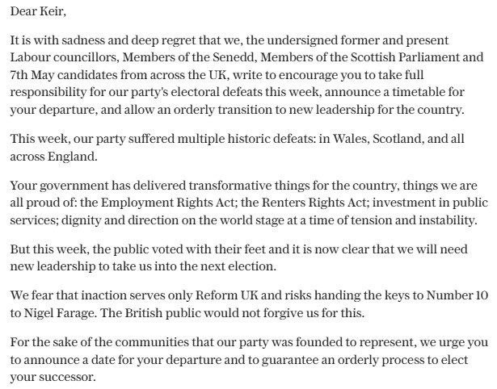

کیر استارمر در آستانه بحران .‼️

⭕️ بیش از ۱۰۰ عضو سابق شورا و کاندیدای حزب کارگر به کیر استارمر (نخست وزیر بریتانیا) نامه نوشته و خواستار استعفای او شده‌اند.

📝 Nick

📌 @persian_trend_official
پرشین ترند | متفاوت‌ترین کانال نظامی

## Persian_Trend_Official — post 13799

✅ تلگرام هم هوش مصنوعی خودشو به اسم «میرا» راه انداخت. امکانات رایگانش شامل چت متنی نامحدود، تبدیل ویس به متن، تبدیل متن به صدا، جستجو داخل اینترنت، تحلیل تصاویر، ساخت ریمایندر، لینک سوال ناشناس و حتی مدیریت والت شبکه TON روی تست‌نته. بخش پولی هم قابلیت‌هایی…

## Persian_Trend_Official — post 13797

  

✅ تلگرام هم هوش مصنوعی خودشو به اسم «میرا» راه انداخت.

امکانات رایگانش شامل چت متنی نامحدود، تبدیل ویس به متن، تبدیل متن به صدا، جستجو داخل اینترنت، تحلیل تصاویر، ساخت ریمایندر، لینک سوال ناشناس و حتی مدیریت والت شبکه TON روی تست‌نته.

بخش پولی هم قابلیت‌هایی مثل ساخت عکس (تا ۳۰ بار)، ادیت تصویر (۳۰ بار)، تولید موزیک (۶۰ بار) و ساخت ویدیو (تا ۱۰۰ بار) داره.

از اون طرف میرا میتونه به ابزارهایی مثل جیمیل، گوگل شیت، گیت‌هاب و اسلک وصل بشه، اسکیل اختصاصی بسازه و حتی داخل گروه‌ها هم اضافه بشه.
آیدی ربات میرا: @Mira

📝 Nick

📌 @persian_trend_official
پرشین ترند | متفاوت‌ترین کانال نظامی

## Persian_Trend_Official — post 13796

https://youtube.com/live/qprUFpWNj80?feature=share

## Persian_Trend_Official — post 13795

  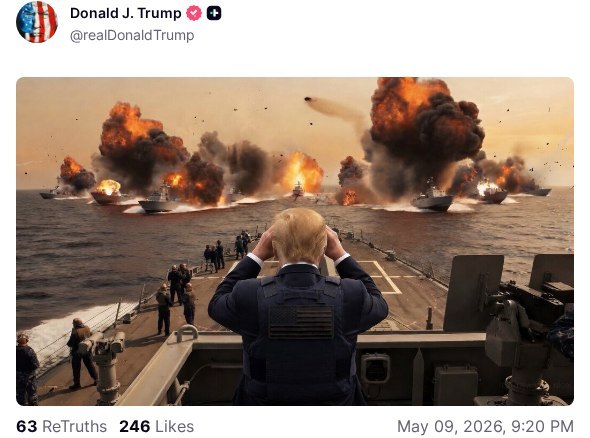

⭕️ یکی هوش مصنوعی رو از ترامپ بگیره 🤦🏻‍♂️

📝 Nick

📌 @persian_trend_official
پرشین ترند | متفاوت‌ترین کانال نظامی

## Persian_Trend_Official — post 13794

  <a href="telegram/content/Persian_Trend_Official_13794_1778398736.webm" target="_blank">🎬 Download video</a>

⭕️ جمهوری اسلامی گفته در صورت اقدام آمریکا برای اذیت یا حمله، کابل‌های اینترنت جهانی در خلیج فارس و تنگه هرمز قطع و اینترنت جهان مختل می‌شود.

پ.ن: خوبه دنیا بفهمه اینا چه حرو***یی هستن.

📝 Nick

📌 @persian_trend_official
پرشین ترند | متفاوت‌ترین کانال نظامی

## Persian_Trend_Official — post 13793

  <a href="telegram/content/Persian_Trend_Official_13793_1778398736.webm" target="_blank">🎬 Download video</a>

فایل صوتی لایو اول
نسخه کم حجم - 8.24 مگابایت

اتاق جنگ شنبه 19 اردیبهشت | ترامپ: اگر توافق نشود پروژه آزادی پلاس اجرا می شود.

📝 Nick

📌 @persian_trend_official
پرشین ترند | متفاوت‌ترین کانال نظامی

## Persian_Trend_Official — post 13792

  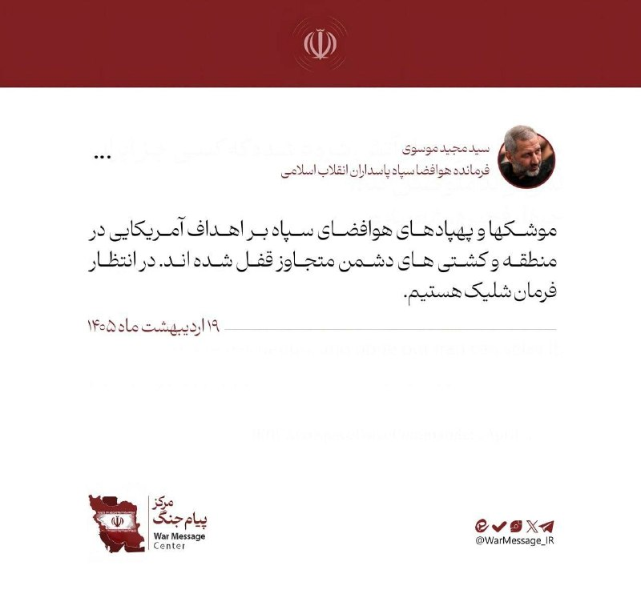

🔴 فرمانده نیروی هوافضای سپاه: اهداف آمریکایی و کشتی‌های دشمن در منطقه هدف‌گیری شده اند

▪️سردار «مجید موسوی»، فرمانده نیروی هوافضای سپاه پاسداران، اعلام کرد موشک‌ها و پهپادهای ایران «اهداف آمریکایی در منطقه و کشتی‌های دشمن» را در وضعیت هدف‌گیری قرار داده‌اند.

▪️او افزود نیروها در حالت آماده‌باش کامل هستند و در انتظار صدور فرمان برای اقدام می‌باشند.

🫆:Tony

📌 @persian_trend_official
پرشین ترند | متفاوت‌ترین کانال نظامی

## Persian_Trend_Official — post 13789

💢تصاویر منتشر شده توسط دونالد ترامپ جهت تمسخر نیروی نظامی جمهوری اسلامی ...

🫆:Tony

📌 @persian_trend_official
پرشین ترند | متفاوت‌ترین کانال نظامی

## IranianMinds — post 19870

  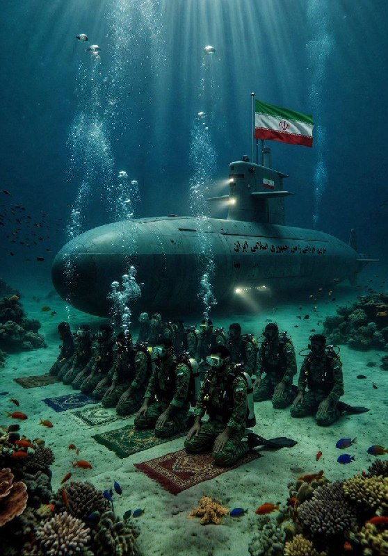

🔴 پست ترامپ: @IranianMinds

## IranianMinds — post 19869

  

🔴 گاردین:

ترامپ برای پایان دادن به جنگ ایران خیلی عجله داره

و اون تصمیم گرفته تا قبل از سفرش به چین به یه نتیجه ای با ایران برسه.

@IranianMinds

## IranianMinds — post 19868

  <a href="https://t.me/IranianMinds/19868" target="_blank">📎 Download file</a>

📲#اپلیکیشن اندروید سایت جهانی دربی بت

👍اسپانسر لیگ انگلیس
👍
🔥امکان شارژ امن از طریق کارت بانکی
➖➖➖➖➖➖➖➖➖

🪙همین حالا عضو شوید 👇
https://t.me/+aCbq7yy8QY80NzQ0

## IranianMinds — post 19867

  

😤دنبال یه سایت شرط بندی بین المللی بودی که به ایرانیا خدمات بده؟!
⛔

👍دربی بت همون انتخاب  100%

💎ویژگی های سایت جهانی Derby Bet:

⬅️امکان شارژ امن با کارت بانکی

⬅️واریز اول دوبل شارژ می شوید(بونوس۱۰۰٪)

⬅️پر اپشن ترین سایت فعال در ایران

⬅️تسویه حساب کمتر از 5 دقیقه

⬅️برگشت بخشی از باخت به صورت هفتگی

🚨کد هدیه ثبت نام:GG007

⚠️برای دانلود اپلکیشن کلیک کنید
👉
re20

🔔کانال دربی بت :

🪙https://t.me/+aCbq7yy8QY80NzQ0

## IranianMinds — post 19866

  <a href="telegram/content/IranianMinds_19866_1778398739.mp4" target="_blank">🎬 Download video</a>

‏🔴 علی مطهری:

علی لاریجانی در یک خانه امن در پردیس کشته شد و هنوز نمی‌دانیم این خانه چه جوری لو رفت.

@IranianMinds

## IranianMinds — post 19865

🔴 فرمانده ارتش پاکستان:

اسلام آباد تمام تلاش خود را برای موفقیت در میانجیگری انجام می دهد و به این کار ادامه می دهد.

@IranianMinds

## IranianMinds — post 19864

  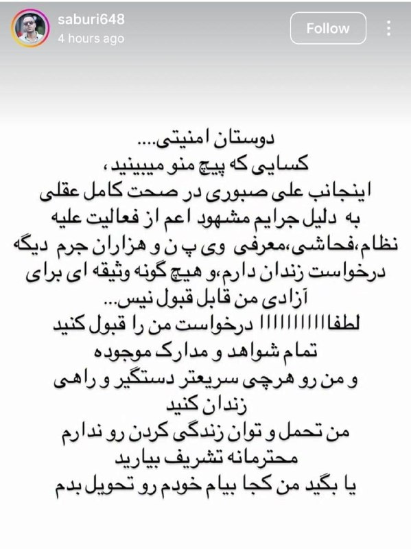

🔴 علی صبوری :

من دیگه تحمل و توان زندگی کردن رو ندارم ، به جرم فعالیت علیه نظام ، فحاشی تبلیغ وی پی ان بیاید منو بگیرید هیچیم ازم قبول نکنید و آزادم نکنید هرچه سریعتر بیاید بگیرید منو

@IranianMinds

## IranianMinds — post 19862

  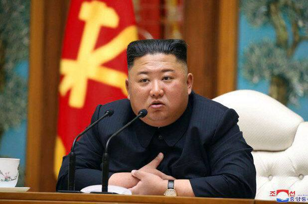

🔴 کیم‌ جونگ اون هم وقتی دید خامنه ای و کشتن و مادورو رو دزدیدن احساس خطر کرد و سیاست های هسته ای خودشو تغییر داد

از این پس اگه رهبر کره شمالی هدف عوامل یکی از کشور های دیگر قرار بگیره و اثبات بشه , کره شمالی استفاده از سلاح هسته ای علیه اون کشور خارجی رو مجاز میکنه.

@IranianMinds

## IranianMinds — post 19861

فقط کافیه مرغ از خیابون رد کنی و‌پولت چند برابر کنی
💵👌

## IranianMinds — post 19860

  <a href="telegram/content/IranianMinds_19860_1778398744.mp4" target="_blank">🎬 Download video</a>

بچه ها اسم این بازی عبور مرغ از خیابون  هست ویدئو نگاه کنید خیلی راحت 8 میلیون ازش سود گرفتیم😍

😤اگ توم دوس داری خیلی راحت از بازی های انلاین پول در بیاری حتما عضو کازینو شبانه شو
✅

توی کازینو شبانه بهت اموزش میدیم از بازی های انلاین پول دربیاری👌

کازینو شبانه راهی برای چند برابر کردن سرمایت 🤷‍♂

کسب درامد انلاین با یه ادم حرفه ای یاد بگیر و‌ پول دربیار 
💵
ae19
🎯همین حالا عضو شو و شروع کن👇
https://t.me/+OS-QBvyDO4M2ZGY0
https://t.me/+OS-QBvyDO4M2ZGY0

## IranianMinds — post 19859

  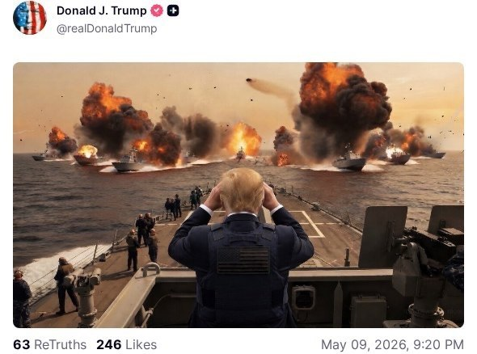

🔴 پست ترامپ:

@IranianMinds

## IranianMinds — post 19858

  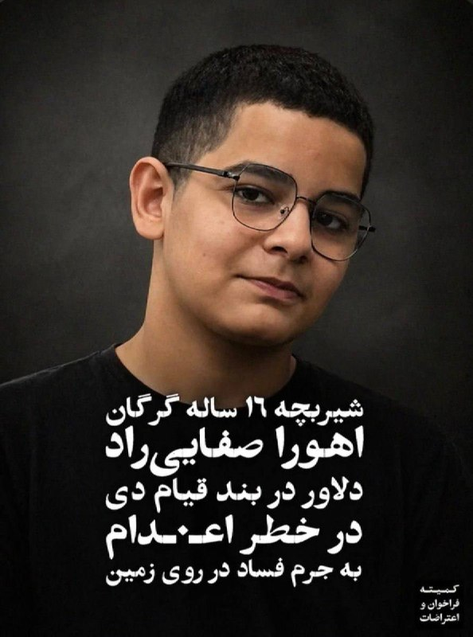

شما فک‌ کنید یه بچه ۱۶ ساله که الان تنها دغدغش باید درس و مشقش باشه، تو‌ این کشور جونش در خطره و ممکنه توسط حکومت اعدام شه :)

@IranianMinds

## IranianMinds — post 19857

🔴شبکه ۱۵ اسرائیل:

تو واشنگتن هنوز منتظر جواب ایران هستن.

@IranianMinds

## IranianMinds — post 19856

🔴 جمهوری اسلامی : آمریکا بخواد بیشتر اذیتمون بکنه یا کاری بکنه میزنیم کل کابل های اینترنت جهانی در خلیح فارس و زیر تنگه هرمز رو قطع میکنیم و اینترنت کل دنیارو مختل میکنیم @IranianMinds

## IranianMinds — post 19854

🔴 فرمانده هوا فضای سپاه :

بمولا موشکا و پهپادامونو قفل کردیم رو مختصات دژمن بخوان دست از پا خطا کنن نابودشون میکنیم

@IranianMinds

## IranianMinds — post 19853

🔴 یک‌‌ ماه پیش در‌ چنین روزی آتش بس دو هفته ای برقرار شد

@IranianMinds

## IranianMinds — post 19850

پست های ترامپ:

@IranianMinds

## IranianMinds — post 19849

  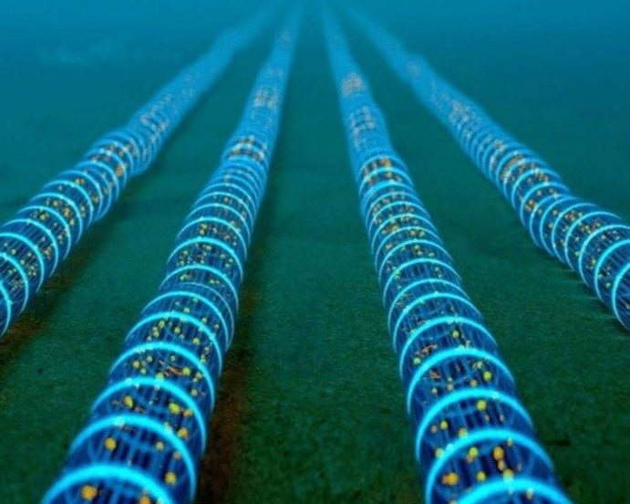

🔴 جمهوری اسلامی :

آمریکا بخواد بیشتر اذیتمون بکنه یا کاری بکنه میزنیم کل کابل های اینترنت جهانی در خلیح فارس و زیر تنگه هرمز رو قطع میکنیم و اینترنت کل دنیارو مختل میکنیم

@IranianMinds

## Dirty_Kids — post 389203

ندیدم حتی یکی از آخوندا بیاد بگه گرفتن پول اضافه برای دسترسی به اینترنت، مصداق حق‌الناسه و پولش حرومه.

همین جاکشا قبل شورش ۵۷ چون پول مفت نمیگیرفتن تا همش رو مود کصونه‌واویلا بودن، رابه‌را فتوا میدادن تحصن میکردن تنباکو و قند و کیرخر حرام اعلام میکردن

@Dirty_Kids 👻

## Dirty_Kids — post 389202

  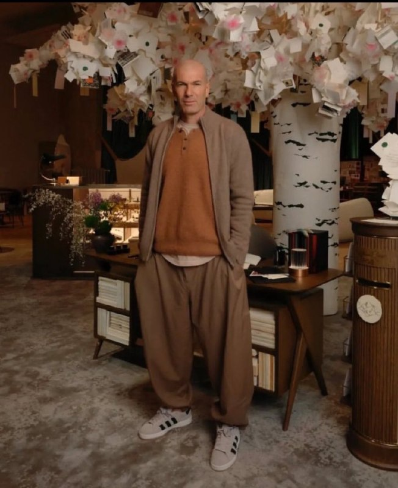

محصول مشترک الجزایر، فرانسه، ادیداس کرج و کردستان:

## Dirty_Kids — post 389195

  <a href="https://t.me/Dirty_Kids/389195" target="_blank">📎 Download file</a>

✅ اپلیکیشن اندروید سایت جهانی دربی بت

💰اولین سایت جهانی با امکان شارژ و برداشت ریالی(کارت به کارت)

🔗 برای ورود فیلترشکن روی کشور مناسب قرار دهید مانند فنلاند و المان و....

😀Telegram Channel
👇
https://t.me/+bcynkEgSW2dlYTc0

## Dirty_Kids — post 389194

  

😤دنبال یه سایت شرط بندی بین المللی بودی که به ایرانیا خدمات بده؟!
⛔

👍دربی بت همون انتخاب  100%

💎ویژگی های سایت جهانی Derby Bet:

⬅️امکان شارژ امن با کارت بانکی

⬅️واریز اول دوبل شارژ می شوید(بونوس۱۰۰٪)

⬅️پر اپشن ترین سایت فعال در ایران

⬅️تسویه حساب کمتر از 5 دقیقه

⬅️برگشت بخشی از باخت به صورت هفتگی

🚨کد هدیه ثبت نام:GG007

⚠️برای دانلود اپلکیشن کلیک کنید
👉

🔔کانال دربی بت :

🪙https://t.me/+bcynkEgSW2dlYTc0

## Dirty_Kids — post 389193

  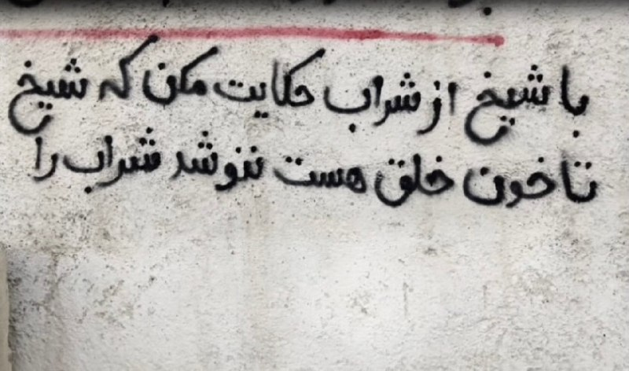

#بخوابیم

@Dirty_Kids 👻

## Dirty_Kids — post 389192

  <a href="telegram/content/Dirty_Kids_389192_1778398749.mp4" target="_blank">🎬 Download video</a>

مردم نگرانن ترکیب زیبایی مُشتبا بهم بخوره ❌
مردم میخوان سر به تن مُشتبا نباشه ✅

عاشقتم عمو ویسی 😂😂

@Dirty_Kids 👻

## Dirty_Kids — post 389190

  <a href="telegram/content/Dirty_Kids_389190_1778398750.mp4" target="_blank">🎬 Download video</a>

آخوند ماندگاری:

هیچ امام و پیغمبری تو تاریخ به اندازه "علی خامنه‌ای" و پسرش "مجتبی خامنه‌ای* لبیک‌گو نداشته.
مجتبی خامنه‌ای نایب‌ امام زمانه.

+ یکم دیگه غیبت کنخ ادای خدایی هم میکنن، موشلندر

@Dirty_Kids 👻

## Dirty_Kids — post 389187

ترامپ شیر خدا بیکار میشه میاد توان پهپادب سپاه مسخره میکنه :)))))

@Dirty_Kids 👻

## Dirty_Kids — post 389186

  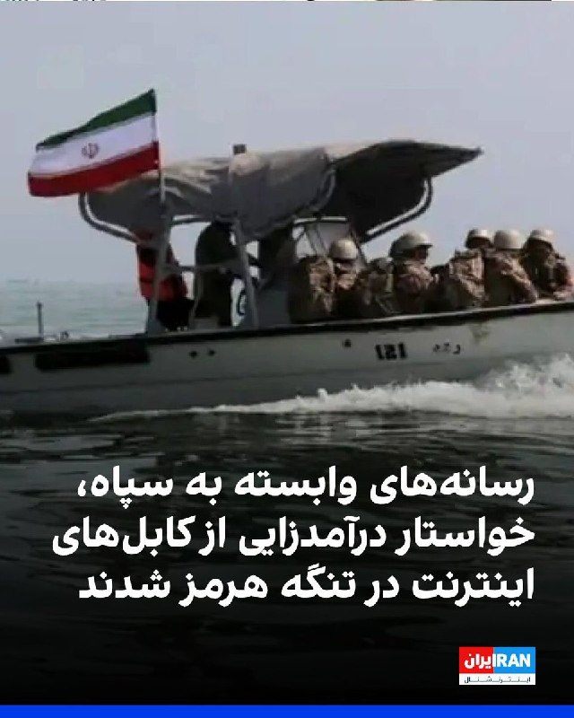

مزد خر چروندن، گوز خره.
اینم تقدیم به دنیا برای مماشات با دیوانگان جمهوری اسلامی.

@Dirty_Kids 👻

## Dirty_Kids — post 389185

آخرین‌بار قبل ج.ا، صدام حسین شیر نفتو تو دریا باز کرد!

@Dirty_Kids 👻

## Dirty_Kids — post 389184

‏عصری رفتم لبنیاتی پرسیدم این ماسته شیرینه؟ گفت نه ترشه تقریبا. همه باورهام فرو ریخت، هرچی از بچگی شنیده بودم دود شد رفت هوا.
اولین ماست‌بند تاریخ بود که گفت ماست من ترشه.

@Dirty_Kids 👻

## Dirty_Kids — post 389183

آقا کسی شماره میرحسین موسوی رو نداره ببینیم از سال ۸۸ تو خونه چیکار میکنه ؟
حوصلمون سر رفت.

@Dirty_Kids 👻

## Dirty_Kids — post 389182

  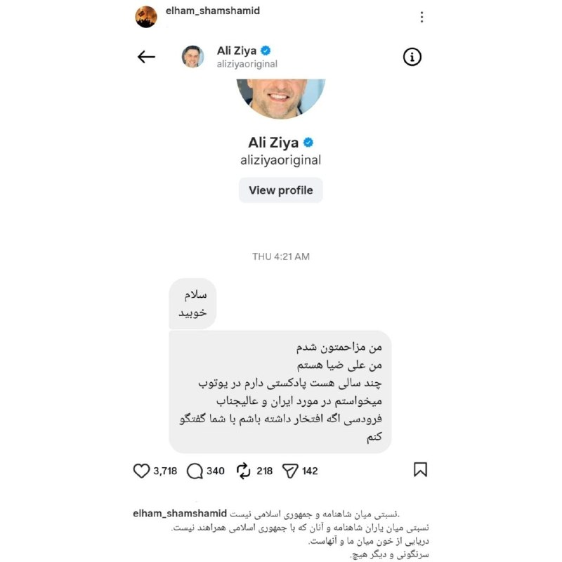

"دکتر الهام شمس" (پژوهشگر شاهنامه و تاریخ هنر) درخواست علی ضیا مجری حکومتی برای شرکت در برنامه‌اش را رد کرده و اسکرین‌شات درخواست را در اینستاگرام خود پخش کرده است

پ‌ن: شرف داشتن رو به موازات میهن پرستی ایشان معنا کرد

@Dirty_Kids 👻

## Dirty_Kids — post 389181

  

گرتا کونگِرد در مورد نفتی که ج.ا میریزه تو دریا نظری نداره؟ محیط زیست در خطر نیست؟

@Dirty_Kids 👻

## Dirty_Kids — post 389180

  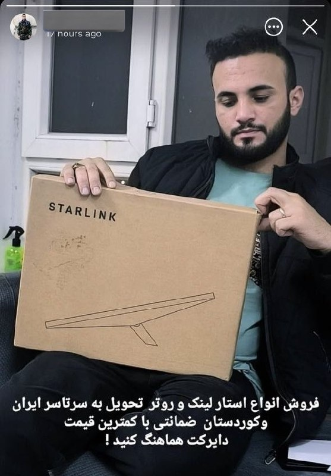

با سرعت 5G تو گونی‌مون میکنی یا 4G ؟

+ ترامپ: استارلینک و اسلحه فرستادم ولی یه گروهی از کردها پیچوندن

@Dirty_Kids 👻

## Dirty_Kids — post 389179

  <a href="telegram/content/Dirty_Kids_389179_1778398753.mp4" target="_blank">🎬 Download video</a>

املاکی شیر بلبل‌زاده‌ی خدا در طبیعت

@Dirty_Kids 👻

## Dirty_Kids — post 389177

گزارشگر صداسیما میپرسه «به نظرت کی از سگ‌های هلال احمر پست‌تره؟». ینی سگی که بدون هیچ منتی داره کمکشون میکنه و زنده یابی میکنه رو هم موجود "پست" میبینن و دنبال پست‌تر از اون میگردن.

@Dirty_Kids 👻

## Dirty_Kids — post 389176

رسما دارن نفتی رو که نمی‌توانند بفروشند با شعار «دیگی که برای من نجوشد» تو خلیج فارس رها میکنند تا منجر به مرگ میلیون‌ها انسان و جاندار دیگه بشود. دیگه الان فقط مردم ایران گروگان این جانی ها نیستند همه جانداران رو گروگان گرفتند.

@Dirty_Kids 👻

## Hranews — post 112854

دادستان تهران علیه عباس عبدی، صادق زیباکلام و دو رسانه اعلام جرم کرد

❗️
❗️
❗️
❗️
❗️ – مرکز رسانه قوه قضاییه از #اعلام_جرم دادستان تهران علیه عباس عبدی و صادق زیباکلام خبر داد. همچنین دو رسانه منتشرکننده اظهارات این افراد نیز با گشایش پرونده قضایی مواجه شده‌اند.

ادامه مطلب

#عباس_عبدی
#صادق_زیباکلام

↘️
@hranews_bot تماس ✉️ -  @Hranews  کانال هرانا 🆑

## Hranews — post 112853

  

💥 دعوت به همکاری با خبرگزاری هرانا

خبرگزاری هرانا، با بیش از دو دهه سابقه در حوزه گزارشگری و مستندسازی حقوق بشر، در راستای توسعه فعالیت‌های خود از علاقه‌مندان واجد شرایط برای همکاری دعوت می‌کند.

هرانا در این مرحله بیش از آن‌که به دنبال افراد با سابقه حرفه‌ای باشد، به دنبال افرادی متعهد، دقیق و آموزش‌پذیر است؛ کسانی که دغدغه واقعی حقوق بشر دارند و مایل‌اند در یک چارچوب حرفه‌ای، مهارت‌های خود را توسعه دهند.

زمینه‌های همکاری شامل:
گزارشگری، ویراستاری، ترجمه، مدیریت شبکه‌های اجتماعی و سایر حوزه‌های مرتبط

ویژگی‌های مورد انتظار:

* تسلط کافی به زبان فارسی (خواندن و نوشتن)
* دقت، مسئولیت‌پذیری و توانایی یادگیری مستمر
* علاقه و حساسیت نسبت به موضوعات حقوق بشر
* آمادگی برای فعالیت در چارچوب‌های سازمان‌یافته و حرفه‌ای

❗️ توجه: درخواست‌ها صرفاً در صورتی بررسی خواهند شد که اطلاعات ثبت‌شده در فرم (از جمله کشور محل سکونت و سایر شرایط اعلام‌شده) با الزامات همکاری همخوانی داشته باشد.

همکاری با هرانا فرصتی است برای کسب تجربه عملی در حوزه مستندسازی و فعالیت‌های حقوق بشری در یک نهاد با سابقه و ساختار حرفه‌ای.

📎 برای ثبت درخواست همکاری، لطفا فرم زیر را تکمیل کنید:
https://hra.news/4cBjHqs

📩 در صورت بروز مشکل در تکمیل فرم، می‌توانید رزومه و اطلاعات تماس خود را به آدرس زیر ارسال نمایید:
info@hra-news.org

↘️
@hranews_bot تماس ✉️ -  @Hranews  کانال هرانا 🆑

## Hranews — post 112852

گزارشی از بیکاری و معوقات مزدی کارگران در شهرهای مختلف کشور

❗️
❗️
❗️
❗️
❗️– نایب رئیس کانون عالی #کارگران بازنشسته و مستمری بگیران تامین اجتماعی کشور از بیکاری حدود ۳۰۰ تن از کارگران شرکت «بشل موتور» سوادکوه پس از پایان قرارداد موقت آنها خبر داد. از سوی دیگر، شماری از کارکنان پتروشیمی چابهار نسبت به معوقات مزدی و تعدیل نیرو در این پتروشیمی گلایه‌مند هستند. همچنین جمعی از صیادان و ملوانان اعلام کردند که در پی شرایط مرتبط به جنگ اخیر، با بیکاری مواجه شده‌اند.

ادامه مطلب

↘️
@hranews_bot تماس ✉️ - @Hranews کانال هرانا 🆑

## Hranews — post 112851

  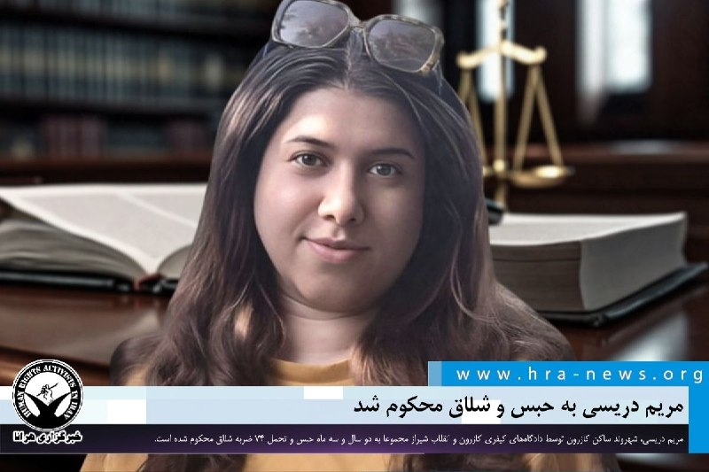

مریم دریسی به حبس و شلاق محکوم شد

❗️
❗️
❗️
❗️
❗️– مریم دریسی، شهروند ساکن کازرون که در اسفند ماه با تودیع وثیقه آزاد شده بود، توسط دادگاه‌های کیفری کازرون و انقلاب شیراز مجموعا به دو سال و سه ماه حبس و تحمل ۷۴ ضربه #شلاق محکوم شد.

به گزارش خبرگزاری هرانا، ارگان خبری مجموعه فعالان حقوق بشر در ایران، مریم دریسی، به حبس و شلاق محکوم شد.

براساس حکم صادره توسط شعبه ۱۰۱ دادگاه کیفری دو کازرون، خانم دریسی از بابت اتهام «اخلال در نظم و آسایش عمومی» (ماده ۶۱۸ قانون مجازات اسلامى) به یک سال حبس و ۷۴ ضربه شلاق محکوم شده است. این حکم در تاریخ ۲۴ فروردین ۱۴۰۵ و به صورت غیابی صادر شده است. همچنین خانم دریسی در بخش دیگری از پرونده خود، توسط شعبه یک دادگاه انقلاب شیراز از بابت اتهام «تبلیغ علیه نظام» به یک سال و سه ماه حبس محکوم شده است. این حکم امروز به وکیل او در حالی ابلاغ شده که حداکثر مجازات قانونی این اتهام یک سال حبس است و دادگاه با استناد به مقررات تکرار جرم، مجازات وی را تشدید کرده است.

#مریم_دریسی

ادامه مطلب

↘️
@hranews_bot تماس ✉️ - @Hranews کانال هرانا 🆑

## Hranews — post 112850

مصدومیت ۴ کارگر از جمله یک آتش‌نشان در سایه فقدان ایمنی کار

❗️
❗️
❗️
❗️
❗️– در سایه فقدان ایمنی محیط و شرایط نامناسب کار، چهار #کارگر از جمله یک آتش‌نشان در شهرهای مشهد، خرم‌آباد، مارگون و پاکدشت، طی حوادثی حین انجام کار مصدوم شدند.

ادامه مطلب

↘️
@hranews_bot تماس ✉️ - @Hranews کانال هرانا 🆑

## Hranews — post 112849

به دلیل فروش فیلترشکن؛ ۲ شهروند در اسلامشهر بازداشت شدند
 

❗️
❗️
❗️
❗️
❗️ – بنا بر اعلام فرمانده انتظامی اسلامشهر، دو شهروند در این شهرستان به دلیل فروش فیلترشکن توسط ماموران پلیس امنیت و فتا #بازداشت شدند.
 
ادامه مطلب

↘️
@hranews_bot تماس ✉️ -  @Hranews  کانال هرانا 🆑

## Hranews — post 112848

  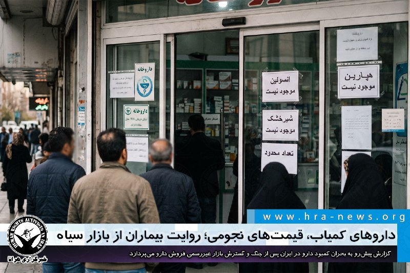

داروهای کمیاب، قیمت‌های نجومی؛ روایت بیماران از بازار غیررسمی دارو پس از جنگ
 

❗️
❗️
❗️
❗️
❗️ – گزارش میدانی پیش‌رو به بحران #کمبود_دارو در ایران پس از جنگ و گسترش بازار غیررسمی فروش دارو می‌پردازد؛ بحرانی که بیماران را از صف داروخانه‌ها به کانال‌ها و گروه‌های تلگرامی کشانده است.
 
گزارش حاضر بر پایه روایت بیماران، خانواده‌ها و کارکنان داروخانه‌ها، تصویری از دشواری روزانه تهیه دارو، افزایش قیمت‌ها، نگرانی درباره اصالت داروهای بازار آزاد و شکل‌گیری شبکه‌های غیررسمی تأمین دارو ارائه می‌کند:
 
بعد از ساعت ۹ شب است اما صف مقابل داروخانه شبانه‌روزی خیابان طالقانی هنوز تمام نشده. بعضی بیماران نسخه‌های کاغذی را در دست دارند و بعضی دیگر عکس جعبه دارو را روی تلفن همراهشان نشان می‌دهند. زن میانسالی هر چند دقیقه یک بار نام داروی همسرش را زیر لب تکرار می‌کند؛ مرد جوانی کنار در ورودی مدام با چند داروخانه دیگر تماس می‌گیرد و پاسخ همه تقریباً یکسان است: «نداریم.»
 
ادامه مطلب

↘️
@hranews_bot تماس ✉️ -  @Hranews  کانال هرانا 🆑

## Hranews — post 112847

  

در یازدهمین هفته از قطع اینترنت در ایران، رئیس دانشگاه صنعتی امیرکبیر از «آغاز دسترسی دانشجویان تحصیلات تکمیلی به اینترنت همراه در ساعات مشخص از روز» خبر داده است. عباس سروش همچنین ادعا کرد که در حال حاضر ۹۵٪ اساتید این دانشگاه به اینترنت دسترسی دارند.

↘️
@hranews_bot تماس ✉️ -  @Hranews  کانال هرانا 🆑

## Hranews — post 112846

  

پس از گذشت ۱۶ سال انتظار؛ کماکان مدفن اعدام شدگان ۱۹ اردیبهشت مشخص نیست
 

❗️
❗️
❗️
❗️
❗️ – در تاریخ نوزدهم اردیبهشت ۱۳۸۹، فرزاد کمانگر، معلم و فعال حقوق بشر به همراه چهار زندانی سیاسی دیگر به نام‌های علی حیدریان، شیرین علم هولی، فرهاد وکیلی و مهدی اسلامیان، اعدام شدند. اعدام این شهروندان پس از طی روند پر نقص قضایی، مخفیانه و بدون اطلاع وکیل و خانواده‌ در محوطه‌ی پارکینگ زندان اوین صورت گرفت. پس از گذشت شانزده سال از #اعدام این زندانیان، همچنان از محل دفن آنان اطلاعی به دست نیامده است.
 
به گزارش خبرگزاری هرانا، ارگان خبری مجموعه فعالان حقوق بشر در ایران، شانزده سال پیش در چنین روزی فرزاد کمانگر، علی حیدریان، شیرین علم هولی، فرهاد وکیلی و مهدی اسلامیان، اعدام شدند.
 
صدور و اجرای حکم اعدام فرزاد کمانگر و چهار زندانی دیگر در میان موج بی سابقه اعتراضات داخلی و بین المللی در حالی صورت گرفت که به گواه اسناد موجود، روند حقوقی آنان مملو از موارد مشخص نقض حقوق بود از جمله بازداشت مغایر قانون، نگهداری بلند مدت در سلولهای انفرادی، عدم اجازه دسترسی به وکیل در ایام بازداشت، اعمال شکنجه های جسمی و روحی بر آنان به خصوص در مورد سه تن از آنها در بازداشتگاه های اطلاعات سنندج و کرمانشاه و همینطور موارد متعدد نقض آیین دادرسی، به طوری که حداقل سه متهم (فرزاد کمانگر، فرهاد وکیلی و علی حیدریان) بدون امکان دفاع در یک دادگاه هفت دقیقه‌ای “محارب” شناخته شدند و حکم مرگ برای آنان صادر شد.
 
ادامه مطلب
 
#فرزاد_کمانگر #علی_حیدریان #شیرین_علم_هویی #فرهاد_وکیلی #مهدی_اسلامیان

↘️
@hranews_bot تماس ✉️ -  @Hranews  کانال هرانا 🆑

## Hranews — post 112845

  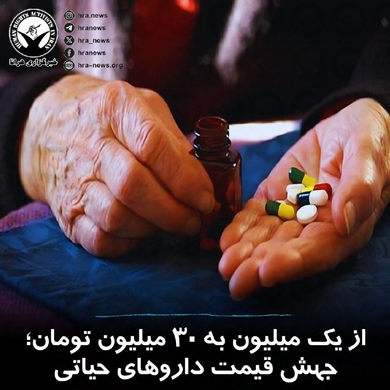

اعتماد آنلاین با انتشار گزارشی اعلام کرد، #بحران_دارو در پی #جنگ و تشدید تحریم‌ها ابعاد گسترده‌تری یافته و بازار دارویی کشور با کمبود و افزایش شدید قیمت‌ها روبه‌رو شده است. گزارش‌ها از رشد ۳۰ تا ۳۰۰ درصدی بهای برخی اقلام حکایت دارد؛ در حالی‌که حداقل دستمزد همچنان کمتر از ۱۰۰ دلار برآورد می‌شود و توان خرید شهروندان به‌شدت کاهش یافته است.

در هفته‌های اخیر، کمبود شیرخشک، به‌ویژه انواع تخصصی برای نوزادان دارای شرایط پزشکی خاص، گزارش شده است. همچنین قیمت برخی داروهای حیاتی جهش کم‌سابقه‌ای داشته؛ از جمله دارویی که پیش‌تر با حمایت بیمه کمتر از یک میلیون تومان عرضه می‌شد و اکنون تا ۳۰ میلیون تومان قیمت‌گذاری شده است. داروهای بیماران مبتلا به سرطان، اختلالات تیروئید، بیماری‌های روانی و روماتیسم نیز با افزایش چندبرابری قیمت یا محدودیت عرضه مواجه‌اند. در چنین شرایطی، بیماران و خانواده‌های آنان با فشار فزاینده اقتصادی و دشواری در تامین نیازهای درمانی خود روبه‌رو هستند.

↘️
@hranews_bot تماس ✉️ -  @Hranews  کانال هرانا 🆑

## Hranews — post 112844

  

معاون وزیر ارتباطات از خسارت گسترده ناشی از قطع #اینترنت بر اقتصاد دیجیتال ایران خبر داد. احسان چیت‌ساز اعلام کرد که تنها در پلتفرم‌های بزرگ، زیان ناشی از اختلال و قطع اینترنت به حدود ۵۵ هزار میلیارد تومان رسیده است. به گفته وی، این محدودیت‌ها علاوه بر کاهش درآمد کسب‌وکارهای آنلاین، موجب ایجاد «شوک اقتصادی» در حوزه اقتصاد دیجیتال شده است.

صبح امروز، نت‌بلاکس که محدودیت دسترسی به اینترنت در جهان را رصد می‌کند، اعلام کرد که قطعی و اختلال گسترده اینترنت در ایران وارد یازدهمین هفته خود شده است.

↘️
@hranews_bot تماس ✉️ -  @Hranews  کانال هرانا 🆑

## Hranews — post 112843

گزارشی از بازداشت ۷ شهروند در ساوه
 

❗️
❗️
❗️
❗️
❗️ – فرمانده انتظامی ساوه از بازداشت هفت شهروند در این شهرستان به دلایل آنچه “ارسال اطلاعات و همکاری با رسانه‌های خارج از کشور” عنوان کرده، خبر داد.
 
ادامه مطلب
 
#حمله_نظامی
 
↘️
@hranews_bot تماس ✉️ -  @Hranews  کانال هرانا 🆑

## Hranews — post 112842

  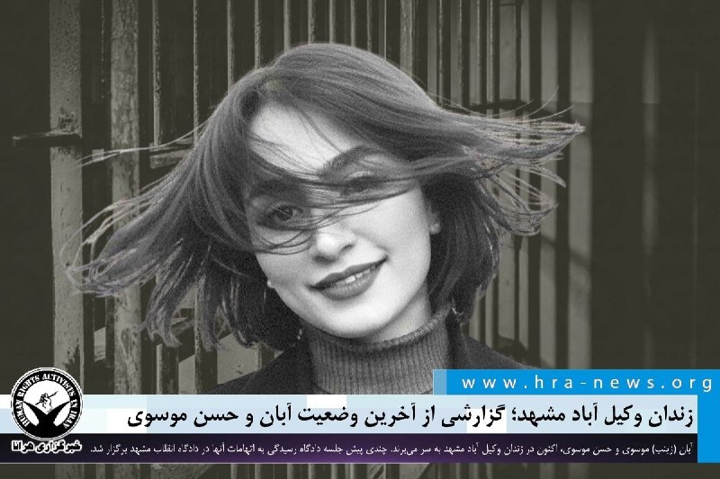

اعتراضات دی‌‌ماه ۱۴۰۴؛ گزارشی از آخرین وضعیت آبان و حسن موسوی در زندان وکیل آباد
 

❗️
❗️
❗️
❗️
❗️ – آبان (زینب) موسوی و حسن موسوی که در اسفند سال گذشته در رابطه با اعتراضات دی‌‌ماه ۱۴۰۴ بازداشت شدند، اکنون در زندان وکیل آباد مشهد به سر می‌برند. چندی پیش جلسه دادگاه رسیدگی به پرونده این خواهر و برادر، از بابت اتهاماتی از جمله “محاربه”، در دادگاه انقلاب مشهد برگزار شده است.
 
به گزارش خبرگزاری هرانا، ارگان خبری مجموعه فعالان حقوق بشر در ایران، سیده زینب موسوی و برادرش سید حسن موسوی در زندان وکیل آباد مشهد هستند.
 
براساس اطلاعات دریافتی هرانا، جلسه دادگاه رسیدگی به پرونده این شهروندان در تاریخ ۶ اردیبهشت‌ماه امسال برگزار شده است. این خواهر و برادر با اتهاماتی از جمله محاربه مواجه هستند؛ موضوعی که نگرانی خانواده و نزدیکان آنها را نسبت به احتمال صدور احکام سنگین افزایش داده است.
 
ادامه مطلب
 
#آبان_موسوی #زینب_موسوی #حسن_موسوی
 
↘️
@hranews_bot تماس ✉️ -  @Hranews  کانال هرانا 🆑

## Hranews — post 112841

قوه قضاییه از توقیف ۲۶۲ ملک در پرونده‌های امنیتی خبر داد
 

❗️
❗️
❗️
❗️
❗️ – سخنگوی قوه قضاییه از توقیف ۲۶۲ ملک در نقاط مختلف ایران خبر داد و اعلام کرد این املاک متعلق به افرادی است که نهادهای قضایی و امنیتی آنها را تحت عنوان «وطن‌فروش» و «همکار دشمن» معرفی کرده‌اند.
 
ادامه مطلب
 
#توقیف_اموال

↘️
@hranews_bot تماس ✉️ -  @Hranews  کانال هرانا 🆑

## Hranews — post 112840

  

شیراز؛ منزل افسانه جذابی، شهروند بهائی تفتیش شد
 

❗️
❗️
❗️
❗️
❗️ – صبح روز سه‌شنبه ۱۵ اردیبهشت‌ماه، منزل افسانه جذابی (راسخی)، شهروند ۶۶ ساله #بهائی ساکن شیراز، توسط نیروهای امنیتی تفتیش شد. در جریان این بازرسی، ماموران شماری از لوازم شخصی و کتب دینی این شهروند را ضبط کردند.
 
به گزارش خبرگزاری هرانا، ارگان خبری مجموعه فعالان حقوق بشر در ایران، منزل افسانه جذابی، شهروند بهائی در شیراز مورد تفتیش قرار گرفت.
 
بر اساس اطلاعات دریافتی هرانا، صبح روز سه‌شنبه ۱۵ اردیبهشت ۱۴۰۵، مأموران امنیتی با ارائه حکم قضایی وارد منزل خانم جذابی شده و اقدام به تفتیش محل سکونت وی کردند. در جریان این بازرسی، وسایل متعددی از جمله کتاب‌ها، قاب‌ها، گوشی موبایل و یک پلاک و زنجیر طلا توسط مأموران ضبط شده است.
 
ادامه مطلب
 
#افسانه_جذابی #افسانه_راسخی #تفتیش_منزل

↘️
@hranews_bot تماس ✉️ -  @Hranews  کانال هرانا 🆑

## Hranews — post 112839

  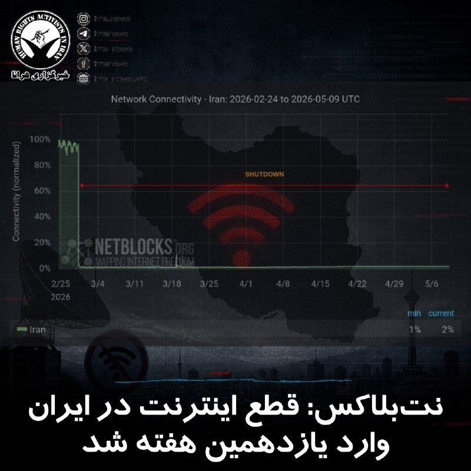

آخرین داده‌های نت‌بلاکس نشان می‌دهد که قطع #اینترنت در ایران پس از ۱۶۸۰ ساعت اختلال و محدودیت گسترده، وارد یازدهمین هفته شده است. این نهاد ناظر بر وضعیت اینترنت در جهان اعلام کرد که ادامه این محدودیت‌ها، دسترسی شهروندان به اطلاعات، ارتباطات و خدمات روزمره را با موانع جدی مواجه کرده است.

↘️
@hranews_bot تماس ✉️ -  @Hranews  کانال هرانا 🆑

## Hranews — post 112838

  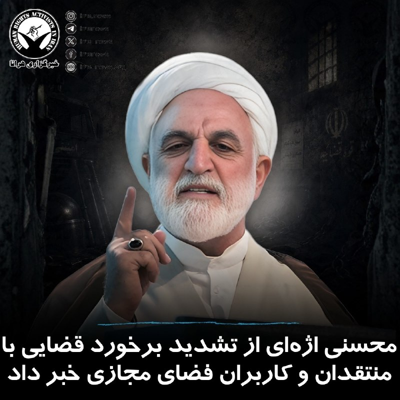

رئیس قوه قضاییه، بار دیگر با تهدید منتقدان و کاربران فضای مجازی، از برخورد قضایی با افرادی خبر داد که به گفته او در راستای اهداف «دشمن» فعالیت یا اقدام به بازنشر مطالب و اخبار می‌کنند.

غلامحسین محسنی اژه‌ای، با اشاره به تنش‌های نظامی اخیر، مدعی شد بازنشر مطالب و اخبار منتسب به «دشمن» اقدامی علیه انسجام عمومی است. وی همچنین افرادی که به گفته او «با دشمن هم‌صدایی می‌کنند» را فراتر از مخالفان سیاسی توصیف کرد و از رسیدگی «فوق‌العاده» به پرونده این افراد خبر داد. رئیس قوه قضاییه همچنین تاکید کرد که فعالیت‌ها و مواضع منتقدان و افرادی که از نگاه نهادهای امنیتی با رسانه‌ها یا دولت‌های متخاصم همکاری دارند، تحت رصد قرار دارد.

↘️
@hranews_bot تماس ✉️ -  @Hranews  کانال هرانا 🆑

## Hranews — post 112837

  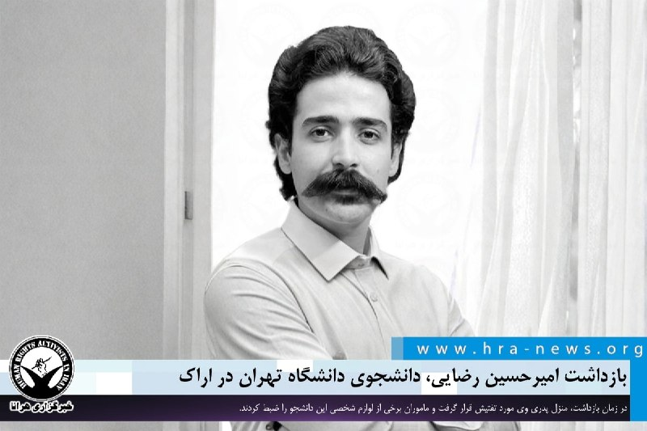

بازداشت امیرحسین رضایی، دانشجوی دانشگاه تهران در اراک
 

❗️
❗️
❗️
❗️
❗️ – امیرحسین رضایی، دانشجوی علوم سیاسی دانشگاه تهران و روزنامه‌نگار، روز چهارشنبه ۱۶ اردیبهشت توسط نیروهای امنیتی در اراک بازداشت و به مکان نامعلومی منتقل شد. در زمان بازداشت، منزل پدری وی مورد تفتیش قرار گرفت و ماموران برخی از لوازم شخصی این دانشجو را ضبط کردند.
 
به گزارش خبرگزاری هرانا، ارگان خبری مجموعه فعالان حقوق بشر در ایران، امیرحسین رضایی، کماکان در بازداشت و بلاتکلیفی به‌سر می‌برد.
 
صبح روز چهارشنبه ۱۶ اردیبهشت‌ماه، ماموران امنیتی با ورود به منزل پدری آقای رضایی در اراک، وی را بازداشت و مبادرت به تفتیش محل سکونت این دانشجو کردند. ماموران شماری از وسایل شخصی از جمله تجهیزات الکترونیکی و کتاب‌های او را نیز ضبط کردند.
 
ادامه مطلب
 
#امیرحسین_رضایی

↘️
@hranews_bot تماس ✉️ -  @Hranews  کانال هرانا 🆑

## Hranews — post 112836

یک زندانی در زندان اردبیل اعدام شد

❗️
❗️
❗️
❗️
❗️ – سحرگاه روز چهارشنبه ۱۶ اردیبهشت ماه، حکم یک زندانی که پیشتر از بابت اتهام قتل به #اعدام محکوم شده بود، در زندان اردبیل اجرا شد.

ادامه مطلب

#شهاب_عظیمی

↘️
@hranews_bot تماس ✉️ -  @Hranews  کانال هرانا 🆑

## configx2ray — post 38708

  <a href="telegram/content/configx2ray_38708_1778398760.webm" target="_blank">🎬 Download video</a>

vless://afa40aec-0c64-43be-9dfb-05efad107874@5.56.132.22:8086?security=none&encryption=none&headerType=none&type=tcp#https://t.me/ConfigX2ray

socks://Og@62.220.126.56:30170#https://t.me/ConfigX2ray

ترکیبی با سایفون وصله 
✅

آموزش استفادع : 
👇
https://t.me/ConfigX2ray0/1665

Channel : https://t.me/ConfigX2ray

## configx2ray — post 38707

🔴طبق گزارشات؛
امروز وضعیت همین اینترنت ضعیف، ضعیف تر شده و خیلی از کاربرها قطع شدن..

## configx2ray — post 38706

  <a href="https://t.me/ConfigX2ray/38706" target="_blank">📎 Download file</a>

کانفیگ برای Npv tunnel ⭕️

به هیچ وج دانلود نزنید باهاش
❤️

رمز فایل : @ConfigX2ray

Channel : https://t.me/ConfigX2ray

## configx2ray — post 38705

  <a href="https://t.me/ConfigX2ray/38705" target="_blank">📎 Download file</a>

کانفیگ برای Npv tunnel ⭕️

به هیچ وج دانلود نزنید باهاش
❤️

رمز فایل : @ConfigX2ray

Channel : https://t.me/ConfigX2ray

## configx2ray — post 38704

  <a href="https://t.me/ConfigX2ray/38704" target="_blank">📎 Download file</a>

کانفیگ برای Npv tunnel ⭕️

به هیچ وج دانلود نزنید باهاش
❤️

رمز فایل : @ConfigX2ray

Channel : https://t.me/ConfigX2ray

## configx2ray — post 38703

  <a href="https://t.me/ConfigX2ray/38703" target="_blank">📎 Download file</a>

کانفیگ برای Npv tunnel ⭕️

به هیچ وج دانلود نزنید باهاش
❤️

رمز فایل : @ConfigX2ray

Channel : https://t.me/ConfigX2ray

## configx2ray — post 38699

⚡️Psiphon proxy

Host : 87.247.171.14
Port : 8080

Channel : https://t.me/ConfigX2ray

## configx2ray — post 38698

  <a href="https://t.me/ConfigX2ray/38698" target="_blank">📎 Download file</a>

کانفیگ برای Npv tunnel ⭕️

به هیچ وج دانلود نزنید باهاش
❤️

رمز فایل : @ConfigX2ray

Channel : https://t.me/ConfigX2ray

## configx2ray — post 38697

  <a href="https://t.me/ConfigX2ray/38697" target="_blank">📎 Download file</a>

کانفیگ برای Npv tunnel ⭕️

به هیچ وج دانلود نزنید باهاش
❤️

رمز فایل : @ConfigX2ray

Channel : https://t.me/ConfigX2ray

## configx2ray — post 38696

  <a href="telegram/content/configx2ray_38696_1778398762.webm" target="_blank">🎬 Download video</a>

socks://Og@130.185.75.82:9595#https://t.me/ConfigX2ray

ترکیبی با سایفون وصله 
✅

آموزش استفادع : 
👇
https://t.me/ConfigX2ray0/1665

Channel : https://t.me/ConfigX2ray

## configx2ray — post 38695

از سین چنل میشه فهمید که خیلیا تو این دو سه روز گذشته افلاین شدن و دیگه نتونستن انلاین بشن 
🐙

## configx2ray — post 38694

  <a href="https://t.me/ConfigX2ray/38694" target="_blank">📎 Download file</a>

کانفیگ برای Npv tunnel ⭕️

به هیچ وج دانلود نزنید باهاش
❤️

رمز فایل : @ConfigX2ray

Channel : https://t.me/ConfigX2ray

## configx2ray — post 38691

  <a href="https://t.me/ConfigX2ray/38691" target="_blank">📎 Download file</a>

کانفیگ برای Npv tunnel ⭕️

به هیچ وج دانلود نزنید باهاش
❤️

رمز فایل : @ConfigX2ray

Channel : https://t.me/ConfigX2ray

## configx2ray — post 38690

VIP @ConfigX2ray 🔥🇩🇪.npvt

## configx2ray — post 38689

  <a href="https://t.me/ConfigX2ray/38689" target="_blank">📎 Download file</a>

کانفیگ برای Npv tunnel ⭕️

به هیچ وج دانلود نزنید باهاش
❤️

رمز فایل : @ConfigX2ray

Channel : https://t.me/ConfigX2ray

## configx2ray — post 38688

  <a href="telegram/content/configx2ray_38688_1778398763.webm" target="_blank">🎬 Download video</a>

socks://Og@62.220.126.56:30170#https://t.me/ConfigX2ray

socks://Og@62.220.126.92:30376#https://t.me/ConfigX2ray

ترکیبی با سایفون وصله 
✅

آموزش استفادع : 
👇
https://t.me/ConfigX2ray0/1665

Channel : https://t.me/ConfigX2ray

## configx2ray — post 38685

  <a href="https://t.me/ConfigX2ray/38685" target="_blank">📎 Download file</a>

کانفیگ برای Npv tunnel ⭕️

به هیچ وج دانلود نزنید باهاش
❤️

رمز فایل : @ConfigX2ray

Channel : https://t.me/ConfigX2ray

## configx2ray — post 38683

  <a href="https://t.me/ConfigX2ray/38683" target="_blank">📎 Download file</a>

کانفیگ برای Npv tunnel ⭕️

به هیچ وج دانلود نزنید باهاش
❤️

رمز فایل : @ConfigX2ray

Channel : https://t.me/ConfigX2ray

## configx2ray — post 38680

  <a href="telegram/content/configx2ray_38680_1778398764.webm" target="_blank">🎬 Download video</a>

vless://afa40aec-0c64-43be-9dfb-05efad107874@5.56.132.22:8086?security=none&encryption=none&headerType=none&type=tcp#https://t.me/ConfigX2ray

ترکیبی با سایفون وصله 
✅

آموزش استفادع : 
👇
https://t.me/ConfigX2ray0/1665

Channel : https://t.me/ConfigX2ray

## configx2ray — post 38679

https://t.me/proxy?server=94.101.191.94&port=4580&secret=6d087d0e01b54d2a50a78047a4a21d80

https://t.me/proxy?server=213.233.184.133&port=6777&secret=dd3b54584a0135f19594825070bb1450d0

https://t.me/proxy?server=213.233.184.133&port=6777&secret=dd3b54584a0135f19594825070bb1450d0

یک دقیقه زمان بدید وصل میشه❤️

بدونه vpn باید وصل بشید 
⚡️
Channel : https://t.me/ConfigX2ray

## alonews — post 118999

  <a href="telegram/content/alonews_118999_1778398765.webm" target="_blank">🎬 Download video</a>

👈احتمال شنیده شدن صدای انفجار کنترل شده از ساعت ۹ تا ۱۵ امروز در شهر اصفهان وجود دارد.

✅ @AloNews خبر جنگ

## alonews — post 118998

  <a href="telegram/content/alonews_118998_1778398765.mp4" target="_blank">🎬 Download video</a>

🎬 Video

## alonews — post 118997

  <a href="telegram/content/alonews_118997_1778398766.webm" target="_blank">🎬 Download video</a>

👈پزشکیان: دشمن پس از ناکامی در جنگ نظامی، تلاش دارد جنگ را به عرصه اقتصاد منتقل کند و مردم باید با نقش‌آفرینی و همراهی خود، این توطئه را نیز ناکام بگذارند

✅ @AloNews خبر جنگ

## alonews — post 118996

  <a href="telegram/content/alonews_118996_1778398766.webm" target="_blank">🎬 Download video</a>

👈جمهوری اسلامی افغانستان(طالبان) اعلام کرد از ۲۰روز دیگر اینترنت نسل پنجم در کابل و هرات راه اندازی خواهد شد

✅ @AloNews خبر جنگ

## alonews — post 118995

👈جهت رزرو تبلیغات برای VPN در کانال #الونیوز به کانال زیر مراجعه کنید👇

📃https://t.me/ads_alonews

📃https://t.me/ads_alonews

## alonews — post 118994

  <a href="telegram/content/alonews_118994_1778398766.webm" target="_blank">🎬 Download video</a>

👈نخست‌وزیر پیشین اسرائیل، ایهود باراک، می‌گوید باقی ماندن حزب‌الله در عملیات پس از دو سال و نیم از آغاز جنگ، نمایانگر یک شکست استراتژیک برای دولت است و اضافه می‌کند که نتانیاهو به ترامپ و اسرائیلی‌ها توهم می‌فروشد — و خودش نیز شروع به باور کردن آن‌ها کرده است، طبق گزارش رسانه‌های اسرائیلی

✅ @AloNews خبر جنگ

## alonews — post 118993

  <a href="telegram/content/alonews_118993_1778398766.webm" target="_blank">🎬 Download video</a>

👈مدیرکل محیط زیست شهرداری تهران:
طی جنگ ۱۲ روزه و جنگ رمضان بیش از ۱۰۰ کیلووات از پنل‌های خورشیدی پایتخت آسیب دید اما در حال اجرای مجدد این‌ پنل‌ها هستیم.

🔴پنل‌های آسیب‌دیده تا پایان سال با پنل‌های نو جایگزین می‌شود.

✅ @AloNews خبر جنگ

## alonews — post 118992

  <a href="telegram/content/alonews_118992_1778398767.webm" target="_blank">🎬 Download video</a>

👈رسایی: الان اینترنت داریم و مردم تو کارای روزمره مشکلی ندارن، پس توجیحی نداره اینترنت بین الملل که کاملا ضرر هست رو وصل کنیم

🔴ما صلاح مردمو میخواهیم

✅ @AloNews خبر جنگ

## alonews — post 118991

  <a href="telegram/content/alonews_118991_1778398767.webm" target="_blank">🎬 Download video</a>

👈خسارت قطع اینترنت تاکنون 511,200,000,000,000تومان 
🔴اما این حجم خسارت برای مسئولان جزو بیت المال نیست ولی شکستن شیشه خودرو بیت المال است 
✅ @AloNews خبر جنگ

## alonews — post 118990

  <a href="telegram/content/alonews_118990_1778398767.webm" target="_blank">🎬 Download video</a>

👈گاردین: ترامپ به دنبال بستن پرونده جنگ با ایران قبل از سفر به چین است

✅ @AloNews خبر جنگ

## alonews — post 118988

  <a href="telegram/content/alonews_118988_1778398767.webm" target="_blank">🎬 Download video</a>

👈علی صبوری بلاگر معروف بعد اینکه فحش به نظام کشید، گفت بیایید منو به جرم فعالیت علیه نظام بگیرید

✅ @AloNews خبر جنگ

## alonews — post 118987

  <a href="telegram/content/alonews_118987_1778398767.webm" target="_blank">🎬 Download video</a>

👈ترامپ در پیشنهاد جدیدش، بودجه حمایت نظامی آمریکا از کردهای پیشمرگه‌ عراق در سال آینده را به صفر دلار کاهش داد

✅ @AloNews خبر جنگ

## alonews — post 118986

  <a href="telegram/content/alonews_118986_1778398767.webm" target="_blank">🎬 Download video</a>

👈شهردار کیریات شمونا می‌گوید در شمال آتش‌بس جعلی وجود دارد و طبق گزارش رادیو ارتش، حفظ زندگی عادی غیرممکن است

✅ @AloNews خبر جنگ

## alonews — post 118985

  <a href="telegram/content/alonews_118985_1778398767.webm" target="_blank">🎬 Download video</a>

👈دادستانی تهران هفتهٔ گذشته علیه عباس عبدی، صادق زیباکلام و دو رسانه‌ای که اظهارات آن‌ها را منتشر کردند، اعلام جرم کرده و در همین رابطه این افراد و رسانه‌ها به دادسرا احضار شده‌اند.

✅ @AloNews خبر جنگ

## alonews — post 118984

  <a href="telegram/content/alonews_118984_1778398768.webm" target="_blank">🎬 Download video</a>

👈نیروی هوایی اسرائیل یک هدف هوایی مشکوک را در منطقه‌ای که سربازان ارتش اسرائیل در جنوب لبنان فعالیت می‌کنند، رهگیری کرد، طبق بیانیه رسمی ارتش اسرائیل

✅ @AloNews خبر جنگ

## alonews — post 118983

  <a href="telegram/content/alonews_118983_1778398768.webm" target="_blank">🎬 Download video</a>

👈فایننشال تایمز: ایران بیش از ۱۰۰۰ قایق بدون سرنشین که قادر به پرتاب موشک یا اژدر هستند و بین ۵۰۰ تا ۱۰۰۰ قایق تهاجمی تندرو در اختیار دارد.

🔴این قایق‌ها وقتی با موشک‌ها و پهپادها ترکیب می‌شوند، خطرناک‌تر می‌شوند، زیرا ایجاد حالت ترس و عدم اطمینان کافی است تا شرکت‌های کشتیرانی از عبور از تنگه هرمز خودداری کنند یا هزینه‌های بیمه را به شدت افزایش دهند

✅ @AloNews خبر جنگ

## alonews — post 118982

  <a href="telegram/content/alonews_118982_1778398768.webm" target="_blank">🎬 Download video</a>

👈تاجگردون، رئیس کمیسیون تلفیق بودجه سال ۱۴۰۵ کل کشور مجلس: بحث اصلاح بودجه ۱۴۰۵ مطرح نیست

🔴قانون کار باید افزایش حقوق کارکنان دستگاه‌های غیردولتی را مشخص کند

✅ @AloNews خبر جنگ

## alonews — post 118981

  <a href="telegram/content/alonews_118981_1778398768.webm" target="_blank">🎬 Download video</a>

👈سخنگوی ارتش: از این پس کشورهایی که از آمریکا در اعمال تحریم علیه جمهوری اسلامی ایران تبعیت کنند، حتماً در عبور از تنگه هرمز با مشکل مواجه می‌شوند

✅ @AloNews خبر جنگ

## alonews — post 118980

  <a href="telegram/content/alonews_118980_1778398768.webm" target="_blank">🎬 Download video</a>

👈مرکز عملیات دریایی انگلیس گزارش کرد که «یک کشتی فله‌بر در نزدیکی قطر مورد اصابت یک پرتابه ناشناس قرار گرفته است»

✅ @AloNews خبر جنگ

## Configir98 — post 8511

🔐 𝗩𝟮𝗿𝗮𝘆𝗡𝗚 
➕ 𝗣𝘀𝗶𝗽𝗵𝗼𝗻 
📱

vless://a34bbc37-566c-4d31-8401-26fe0f9d6f7d@out2.tehranionliine.ir:80?path=%2F&security=none&encryption=none&type=ws#https://t.me/Configir98

✅ @Configir98

## Configir98 — post 8509

پرنده پر نمیزنه خیلی عجیبه

قهر کردین؟ 
🙂

## Configir98 — post 8508

  <a href="https://t.me/Configir98/8508" target="_blank">📎 Download file</a>

🛜 𝗡𝗽𝘃 𝗧𝘂𝗻𝗻𝗲𝗹 𝗡𝗮𝗽𝘀𝘁𝗲𝗿𝗻𝗲𝘁𝗩

🛡️ Password: @Configir98

✅ @Configir98

## Configir98 — post 8507

🔐 𝗩𝟮𝗿𝗮𝘆𝗡𝗚 
➕ 𝗣𝘀𝗶𝗽𝗵𝗼𝗻 
📱

vless://a34bbc37-566c-4d31-8401-26fe0f9d6f7d@out2.tehranionliine.ir:80?path=%2F&security=none&encryption=none&type=ws#https://t.me/Configir98

✅ @Configir98

## Configir98 — post 8505

⚡️ 𝗣𝗿𝗼𝘅𝘆

https://t.me/proxy?server=178.104.81.34&port=4455&secret=dd104462821249bd7ac519130220c25d09

✅ @Configir98

## Configir98 — post 8503

  <a href="https://t.me/Configir98/8503" target="_blank">📎 Download file</a>

🛜 𝗡𝗽𝘃 𝗧𝘂𝗻𝗻𝗲𝗹 𝗡𝗮𝗽𝘀𝘁𝗲𝗿𝗻𝗲𝘁𝗩

🛡️ Password: @Configir98

✅ @Configir98

## Configir98 — post 8502

🔐 𝗩𝟮𝗿𝗮𝘆𝗡𝗚 
➕ 𝗣𝘀𝗶𝗽𝗵𝗼𝗻 
📱

vless://afa40aec-0c64-43be-9dfb-05efad107874@5.56.132.22:8086?security=none&encryption=none&headerType=none&type=tcp#https://t.me/Configir98

socks://Og@62.220.126.56:30170#https://t.me/Configir98

✅ @Configir98

## Configir98 — post 8501

⚡️ 𝗣𝘀𝗶𝗽𝗵𝗼𝗻 𝗣𝗿𝗼𝘅𝘆

Host: 2.185.144.66
Port: 8080

✅ @Configir98

## Configir98 — post 8500

  <a href="https://t.me/Configir98/8500" target="_blank">📎 Download file</a>

🛜 𝗡𝗽𝘃 𝗧𝘂𝗻𝗻𝗲𝗹 𝗡𝗮𝗽𝘀𝘁𝗲𝗿𝗻𝗲𝘁𝗩

🛡️ Password: @Configir98

✅ @Configir98

## Configir98 — post 8499

⚡️ 𝗣𝘀𝗶𝗽𝗵𝗼𝗻 𝗣𝗿𝗼𝘅𝘆

Host: 194.225.131.88
Port: 9090

✅ @Configir98

## Configir98 — post 8498

🔐 𝗩𝟮𝗿𝗮𝘆𝗡𝗚 
➕ 𝗣𝘀𝗶𝗽𝗵𝗼𝗻 
📱

vmess://eyJhZGQiOiIxODUuMjM2LjM4LjQ0IiwiYWlkIjoiMCIsImFscG4iOiIiLCJmcCI6IiIsImhvc3QiOiIiLCJpZCI6ImM5ZTQyNTM3LTg2NTItNGE0Yy04NWQzLTBkMzZhYmYzOGY4OCIsIm5ldCI6InRjcCIsInBhdGgiOiIiLCJwb3J0IjoiMTk5NDYiLCJwcyI6Imh0dHBzOi8vdC5tZS9Db25maWdpcjk4Iiwic2N5IjoiYXV0byIsInNuaSI6IiIsInRscyI6IiIsInR5cGUiOiJub25lIiwidiI6IjIifQ==

socks://Og@62.220.126.56:30170#https://t.me/Configir98

✅ @Configir98

## Configir98 — post 8497

🔐 𝗩𝟮𝗿𝗮𝘆𝗡𝗚 
➕ 𝗣𝘀𝗶𝗽𝗵𝗼𝗻 
📱

{"remarks":"https://t.me/Configir98","log":{"loglevel":"warning"},"inbounds":[{"tag":"socks","port":10808,"protocol":"socks","settings":{"auth":"noauth","udp":true,"userLevel":8},"sniffing":{"enabled":true,"destOverride":["http","tls"],"routeOnly":false}}],"outbounds":[{"tag":"proxy","protocol":"vless","settings":{"vnext":[{"address":"62.220.126.92","port":31873,"users":[{"id":"b6c22d58-3455-44d7-b1a1-e6b9967f449b","level":8,"encryption":"none"}]}]},"streamSettings":{"network":"tcp","tcpSettings":{"header":{"type":"none"}}},"mux":{"enabled":false,"concurrency":-1,"xudpConcurrency":8,"xudpProxyUDP443":""}},{"tag":"direct","protocol":"freedom","settings":{"domainStrategy":"UseIP"},"mux":{"enabled":false,"concurrency":8,"xudpConcurrency":8,"xudpProxyUDP443":""}},{"tag":"block","protocol":"blackhole","settings":{"response":{"type":"http"}},"mux":{"enabled":false,"concurrency":8,"xudpConcurrency":8,"xudpProxyUDP443":""}}],"dns":{"servers":["1.1.1.1"],"hosts":{"domain:googleapis.cn":"googleapis.com","dns.alidns.com":["223.5.5.5","223.6.6.6","2400:3200::1","2400:3200:baba::1"],"one.one.one.one":["1.1.1.1","1.0.0.1","2606:4700:4700::1111","2606:4700:4700::1001"],"dot.pub":["1.12.12.12","120.53.53.53"],"dns.google":["8.8.8.8","8.8.4.4","2001:4860:4860::8888","2001:4860:4860::8844"],"dns.quad9.net":["9.9.9.9","149.112.112.112","2620:fe::fe","2620:fe::9"],"common.dot.dns.yandex.net":["77.88.8.8","77.88.8.1","2a02:6b8::feed:0ff","2a02:6b8:0:1::feed:0ff"]}},"routing":{"domainStrategy":"IPIfNonMatch","rules":[{"type":"field","ip":["1.1.1.1"],"outboundTag":"proxy","port":"53"},{"type":"field","ip":["223.5.5.5"],"outboundTag":"direct","port":"53"}]}}

✅ @Configir98

## Configir98 — post 8492

چجوری آمار روبیکا 110 میلیون رو رد کرده 
🫤
زاد و ولد زیاد شده ؟؟

## Configir98 — post 8491

⚡️ 𝗣𝗿𝗼𝘅𝘆

https://t.me/proxy?server=46.225.29.180&port=443&secret=ee636c6f7564666c6172652e636f6db6

https://t.me/proxy?server=94.101.191.94&port=4570&secret=6d087d0e01b54d2a50a78047a4a21d80

بدون VPN تست کنید

✅ @Configir98

## Configir98 — post 8490

  <a href="https://t.me/Configir98/8490" target="_blank">📎 Download file</a>

🛜 𝗡𝗽𝘃 𝗧𝘂𝗻𝗻𝗲𝗹 𝗡𝗮𝗽𝘀𝘁𝗲𝗿𝗻𝗲𝘁𝗩

🛡️ Password: @Configir98

✅ @Configir98

## Configir98 — post 8489

  <a href="https://t.me/Configir98/8489" target="_blank">📎 Download file</a>

🛜 𝗡𝗽𝘃 𝗧𝘂𝗻𝗻𝗲𝗹 𝗡𝗮𝗽𝘀𝘁𝗲𝗿𝗻𝗲𝘁𝗩

🛡️ Password: @Configir98

✅ @Configir98

## Configir98 — post 8488

🔐 𝗩𝟮𝗿𝗮𝘆𝗡𝗚 
➕ 𝗣𝘀𝗶𝗽𝗵𝗼𝗻 
📱

socks://Og@62.220.126.92:30376#https://t.me/Configir98

socks://Og@62.220.126.56:30170#https://t.me/Configir98

ss://Y2hhY2hhMjAtaWV0Zi1wb2x5MTMwNTp2eE53NWRpWllOM3NycTh1Q2ZtUVI5OHZZYzM5ZWN0NA%3D%3D@xiaomandapple4certificate.ikco.ir.soserverbot.shop:15152#https://t.me/Configir98

✅ @Configir98

## Configir98 — post 8487

🔐 𝗩𝟮𝗿𝗮𝘆𝗡𝗚 
➕ 𝗣𝘀𝗶𝗽𝗵𝗼𝗻 
📱

vless://ccd55491-6b15-4e13-8a9a-d5e87fd9be36@snapp.ir:80?path=%2F%3Fed%3D2080&security=&encryption=none&host=1.jojo.avenflow.ir&type=ws#https://t.me/Configir98

socks://Og%3D%3D@62.220.126.56:30170#https://t.me/Configir98

socks://Og@130.185.75.82:9595#https://t.me/Configir98

✅ @Configir98

## Configir98 — post 8485

⚡️ 𝗣𝘀𝗶𝗽𝗵𝗼𝗻 𝗣𝗿𝗼𝘅𝘆

Host: 5.10.249.19
Port:  1010

Host: 185.231.181.225
Port: 8585

Host: 62.60.207.133
Port: 2020

✅ @Configir98

## Configir98 — post 8484

ولی نتا از بعد از ظهر خیلی داغون شده
😐

---
📅 بروزرسانی: 1405/02/20 10:57
---

## iranintltv — post 336413

  

حمیدرضا حاجی‌بابایی، نایب‌رییس مجلس گفت: «پس از ناامیدی از اغتشاشات داخلی، آمریکا با همراهی ۵۴ کشور یک جنگ تمام‌عیار نظامی علیه ما آغاز کرد اما سیاست ما نه سازش و نه تسلیم؛ نبرد با آمریکاست.»

او ادامه داد: «آمریکا قصد داشت با جلوگیری از جابه‌جایی نفت، ما را تحت فشار قرار دهد، اما ما با باز کردن مرز‌های ۱۶ استان کشور این توطئه را خنثی کردیم.»

او افزود: «دنیا می‌داند اگر تنگه هرمز بسته بماند، در کمتر از یک ماه بحران عظیم نفتی و افزایش شدید قیمت‌ها گریبان اروپا و آمریکا را خواهد گرفت.»
https://iranintl.com/202605100111

## iranintltv — post 336412

  <a href="telegram/content/iranintltv_336412_1778398025.mp4" target="_blank">🎬 Download video</a>

ویدیوهای ارسال‌شده به ایران‌اینترنشنال نشان می‌دهند ایرانیان مقیم نیوزیلند یکشنبه ۲۰ اردیبهشت در پاسخ به فراخوان شاهزاده رضا پهلوی و علیه اعدام‌های جمهوری اسلامی، در شهر اوکلند تجمع کردند.

## iranintltv — post 336411

  

وال‌استریت ژورنال به نقل از مقام‌های آمریکایی و ایرانی گزارش داد مجتبی خامنه‌ای پس از جراحت شدید در حمله‌ای هوایی که به کشته شدن همسرش و علی خامنه‌ای انجامید، بیش از دو ماه است در انظار عمومی ظاهر نشده و غیبت او به اختلاف میان حامیان حکومت بر سر مذاکره با آمریکا دامن زده است.

بر اساس این گزارش مقام‌های جمهوری اسلامی در حالی برای پایان دادن به جنگ به دنبال توافق‌اند که رهبر جدیدشان از انظار عمومی غایب است و درباره مذاکرات سکوت کرده است.

به نوشته این روزنامه، از زمان حمله هوایی ۹ اسفند، تنها پیام‌هایی منتسب به خامنه‌ای و تصاویری از او منتشر شده که به نظر می‌رسد با هوش مصنوعی تولید یا دستکاری شده‌اند؛ از جمله تصویر حساب او در ایکس و بیلبوردهای تبلیغاتی.

مقام‌های جمهوری اسلامی نیز هیچ تصویر تازه یا فایل صوتی از او منتشر نکرده‌اند و همین باعث شده برخی شهروندان درباره زنده بودن او پرسش‌هایی مطرح کنند.

در ادامه این گزارش آمده است غیبت طولانی رهبر جدید جمهوری اسلامی اکنون به مشکلی جدی برای تهران تبدیل شده، زیرا مقام‌های حکومت بر سر میزان امتیازدهی به آمریکا برای رسیدن به توافق دچار اختلاف شده‌اند.

## iranintltv — post 336410

  <a href="telegram/content/iranintltv_336410_1778398029.mp4" target="_blank">🎬 Download video</a>

ویدیوی ارسال شده به ایران‌اینترنشنال نشان می‌دهد ایرانیان ۱۹ اردیبهشت در سن‌خوزه کالیفرنیا در آمریکا، علیه جمهوری اسلامی در خیابان‌های شهر کاروان خودرویی به راه انداختند و پرچم‌های شیروخورشید به دست گرفتند.

## iranintltv — post 336409

  <a href="telegram/content/iranintltv_336409_1778398032.mp4" target="_blank">🎬 Download video</a>

نیروی دریایی سپاه پاسداران آمریکا را به اقدام نظامی تهدید کرد. سپاه اعلام کرد در صورت «تعرض» به شناورهای جمهوری اسلامی، مراکز آمریکا در منطقه و کشتی‌ها را هدف قرار خواهد داد.
گفت‌وگو با حسین علیزاده، تحلیل‌گر مسایل بین‌الملل
@iranintltv

## iranintltv — post 336408

  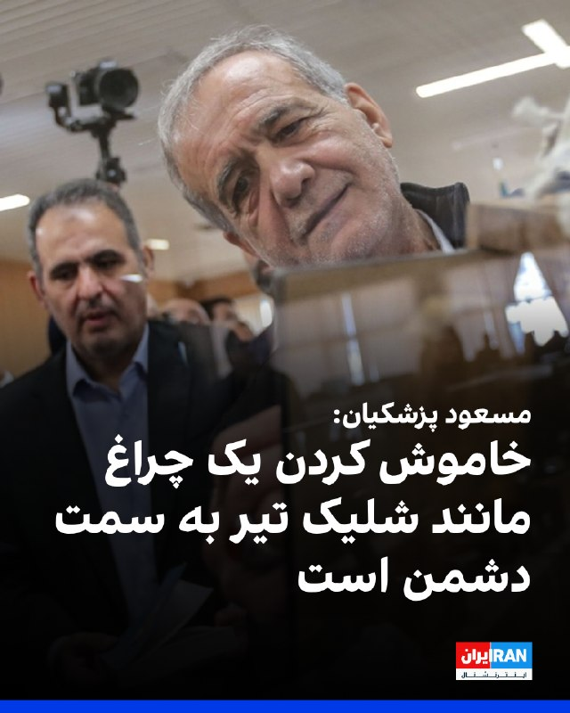

مسعود پزشکیان در جلسه طرح «محله‌محوری و مسجدمحوری» گفت: «مردم باید بدانند خاموش کردن یک چراغ، به‌مثابه شلیک یک تیر به سمت دشمن در جنگ فعلی است و اگر جامعه به این وظیفه عمل کند، بسیاری از مشکلات کشور قابل مدیریت خواهد بود.»

پزشکیان اضافه کرد: «نیرو‌های مسلح وظایف خود را در مقابله با دشمن به‌خوبی انجام می‌دهند و مردم نیز باید با صرفه‌جویی در مصرف انرژی، سهم خود را در این میدان ایفا کنند.»

او افزود: «دشمن پس از ناکامی در جنگ نظامی، تلاش دارد جنگ را به عرصه اقتصاد منتقل کند و مردم باید با نقش‌آفرینی و همراهی خود، این توطئه را نیز ناکام بگذارند.»

او ادامه داد: «اگر هر یک از مردم تنها یک چراغ اضافه را خاموش کنند، قطعا کشور با مشکل برق مواجه نخواهد شد.»
https://iranintl.com/202605107443

## iranintltv — post 336407

  <a href="telegram/content/iranintltv_336407_1778398035.mp4" target="_blank">🎬 Download video</a>

نیروی دریایی سپاه پاسداران آمریکا را به اقدام نظامی تهدید کرد. سپاه اعلام کرد در صورت «تعرض» به شناورهای جمهوری اسلامی، مراکز آمریکا در منطقه و کشتی‌ها را هدف قرار خواهد داد.
گفت‌وگو با حسین علیزاده، تحلیل‌گر مسایل بین‌الملل
@iranintltv

---
📅 بروزرسانی: 1405/02/20 10:16
---

## iranintltv — post 336406

  <a href="telegram/content/iranintltv_336406_1778395579.mp4" target="_blank">🎬 Download video</a>

یکی از اعضای خانواده جاویدنام مسعود دشت‌بزرگی در تجمع ایرانیان مقیم سیدنی به علیرضا محبی، خبرنگار ایران‌اینترنشنال، گفت: «عزیزان ما جان خود را فدا کردند، ما نیز عمر خود را می‌گذاریم تا ایران آزاد شود.»
@iranintltv

## iranintltv — post 336405

یکی از برگزارکنندگان تجمع سیدنی به علیرضا محبی، خبرنگار ایران‌اینترنشنال، گفت هدف از برگزاری این تجمعات رساندن صدای مردم داخل ایران به گوش جهانیان است. او با اشاره به رفتار حاکمیت ایران در قبال شهروندان، گفت کدام کشور در دنیا ۷۲ روز اینترنت را بر روی مردم خود قطع می‌کند؟
@iranintltv

## iranintltv — post 336404

🔻اسرائیل در صحرای عراق پایگاه مخفی برای جنگ با جمهوری اسلامی ایجاد کرده بود

روزنامه وال‌استریت ژورنال به نقل از منابع آگاه، از جمله مقام‌های آمریکایی، گزارش داد اسرائیل پیش از آغاز جنگ با حکومت ایران یک پایگاه نظامی مخفی در صحرای عراق ایجاد کرده بود.

پایگاهی که به گفته این منابع برای پشتیبانی از عملیات هوایی علیه جمهوری اسلامی ایران، استقرار نیروهای ویژه و تیم‌های جست‌وجو و نجات مورد استفاده قرار می‌گرفت.

بر اساس این گزارش، این پایگاه با اطلاع آمریکا و اندکی پیش از آغاز جنگ ساخته شد و به‌عنوان مرکز لجستیکی نیروی هوایی اسرائیل عمل می‌کرد.

وال‌استریت ژورنال نوشت تیم‌های جست‌وجو و نجات اسرائیلی در این پایگاه مستقر بودند تا در صورت سقوط خلبانان اسرائیلی در خاک ایران وارد عمل شوند، هرچند به گفته منابع، تاکنون هیچ خلبان اسرائیلی سرنگون نشده است.

این گزارش همچنین می‌گوید زمانی که یک جنگنده اف-۱۵ آمریکایی در نزدیکی اصفهان سقوط کرد، اسرائیل پیشنهاد کمک در عملیات نجات را مطرح کرد، اما نیروهای آمریکایی خود دو خلبان را نجات دادند. با این حال، اسرائیل برای حفاظت از عملیات، حملات هوایی انجام داد.

به نوشته وال‌استریت ژورنال، این پایگاه مخفی در اوایل ماه مارس نزدیک بود فاش شود. رسانه‌های دولتی عراق گزارش داده بودند یک چوپان محلی فعالیت‌های مشکوک نظامی، از جمله پرواز بالگردها، را مشاهده و گزارش کرده و نیروهای عراقی برای بررسی به منطقه اعزام شده بودند.

منابع آگاه به این روزنامه گفتند اسرائیل برای جلوگیری از نزدیک شدن نیروهای عراقی، حملات هوایی انجام داد. در نتیجه این درگیری، یک سرباز عراقی کشته و دو نفر دیگر زخمی شدند.

قیس المحمداوی، معاون فرمانده ستاد عملیات مشترک عراق، در آن زمان گفته بود: «این عملیات بی‌پروا بدون هماهنگی یا مجوز انجام شد.»

عراق بعدتر در شکایتی به سازمان ملل، آمریکا را مسئول حمله معرفی کرد، اما یکی از منابع آگاه به وال‌استریت ژورنال گفت واشینگتن در این حمله دخالتی نداشته است.

این روزنامه نوشت جزئیات این پایگاه نشان می‌دهد اسرائیل برای اجرای عملیات هوایی علیه اهدافی در فاصله حدود هزار مایلی [حدود هزار و ۶۰۰ کیلومتر]، تا چه اندازه ریسک و برنامه‌ریزی عملیاتی انجام داده است.
بر اساس این گزارش، حضور این پایگاه در عراق به اسرائیل اجازه می‌داد به میدان نبرد نزدیک‌تر شود و در صورت نیاز، عملیات نجات اضطراری را سریع‌تر اجرا کند. همچنین نیروهای ویژه نیروی هوایی اسرائیل که برای عملیات کماندویی در خاک دشمن آموزش دیده‌اند، در این پایگاه حضور داشتند.

وال‌استریت ژورنال یادآوری کرد نیروی هوایی اسرائیل در طول کارزار پنج‌هفته‌ای خود هزاران حمله علیه اهدافی در ایران انجام داده است.

این گزارش همچنین به سابقه استفاده نیروهای آمریکایی از صحرای غرب عراق برای عملیات نظامی اشاره می‌کند. به گفته مایکل نایتس، کارشناس امنیتی و رییس بخش تحقیقات شرکت «هورایزن اینگیج»، این منطقه به دلیل وسعت زیاد و جمعیت اندک، محل مناسبی برای ایجاد پایگاه‌های موقت و مخفی است.

او گفت ساکنان محلی طی سال‌ها به مشاهده فعالیت‌های غیرعادی، از گروه‌های مسلح تا نیروهای ویژه، عادت کرده‌اند و در جریان جنگ اخیر نیز برخی از آن‌ها از فعالیت غیرمعمول بالگردها در منطقه خبر داده بودند.

وال‌استریت ژورنال در پایان نوشت مقام‌های اسرائیلی طی جنگ بارها به عملیات‌های مخفی اشاره کرده‌اند. از جمله «بار تومر»، فرمانده وقت نیروی هوایی اسرائیل، اوایل مارس در پیامی به نیروهایش گفته بود: «نیروهای واحدهای ویژه نیروی هوایی در حال انجام ماموریت‌هایی هستند که می‌تواند تخیل را شعله‌ور کند.»

🔗وب‌سایت ایران‌اینترنشنال
@iranintltv

## iranintltv — post 336403

  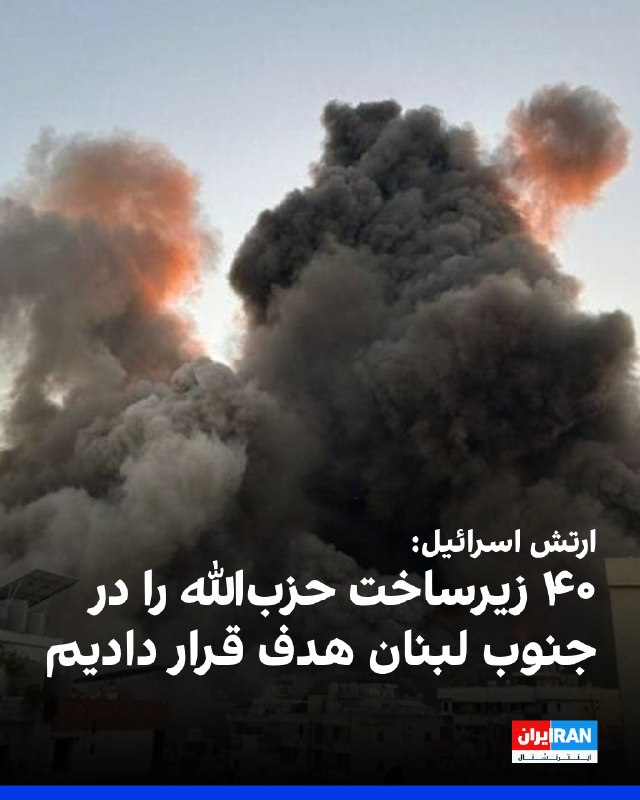

ارتش اسرائیل خبر داد که نیروهای تیپ ۹۱، حدود ۴۰ زیرساخت حزب‌الله در جنوب لبنان را هدف قرار داده و بیش از ۱۰ نفر از اعضای این گروه را کشتند.

پیش‌تر کان‌نیوز به نقل از یک مقام ارشد ارتش اسرائیل گزارش داده بود حزب‌الله نگران است پشتیبانی جمهوری اسلامی را از دست بدهد و به همین دلیل از کنار گذاشتن سلاح خودداری می‌کند.
https://iranintl.com/202605108598

## iranintltv — post 336402

  <a href="telegram/content/iranintltv_336402_1778395581.mp4" target="_blank">🎬 Download video</a>

ایرانیان مقیم سیدنی استرالیا همزمان با معترضان در ده‌ها شهر جهان، در حمایت از انقلاب ملی ایرانیان تجمع کردند. این تجمع که در پی فراخوان شاهزاده رضا پهلوی برگزار شد، سه خواسته اصلی داشت: «توقف فوری اعدام‌ها، آزادی زندانیان سیاسی و اتصال دوباره اینترنت جهانی در ایران.»
علیرضا محبی، خبرنگار ایران‌اینترنشنال، گزارش می‌دهد
@iranintltv

## iranintltv — post 336401

  

روزنامه کیهان که زیر نظر حسین شریعتمداری، نماینده رهبر کشته شده جمهوری اسلامی منتشر می‌شود، با انتقاد از نیروی دریایی سپاه، اجازه عبور کشتی‌ها از تنگه هرمز، در شرایطی که «هنوز محاصره دریایی جمهوری اسلامی از سوی آمریکا» برقرار است را «امتیاز یک‌طرفه» توصیف کرد.

این روزنامه نوشت: «چرا بعد از شکست اقدامات روز دوشنبه ارتش آمریکا، نیروی دریایی سپاه بیانیه داد که کشتی‌ها می‌توانند بیایند عبور کنند. ما حتی نیازهای آنان به سوخت و... را تامین می‌کنیم.»

کیهان ادامه داد: «چرا وقتی هنوز خط محاصره تجارت دریایی ایران شکسته نشده و ترامپ در روز چهارشنبه بر تداوم جدی آن تاکید هم کرده است ما باید موضعی می‌گرفتیم که از سوی دشمن‌، درست یا غلط نشانه دادن یکطرفه امتیاز تلقی شود؟»
https://iranintl.com/202605105957

## iranintltv — post 336400

  <a href="telegram/content/iranintltv_336400_1778395583.mp4" target="_blank">🎬 Download video</a>

سرخط خبرهای یکشنبه ۲۰ اردیبهشت
@iranintltv

## iranintltv — post 336399

  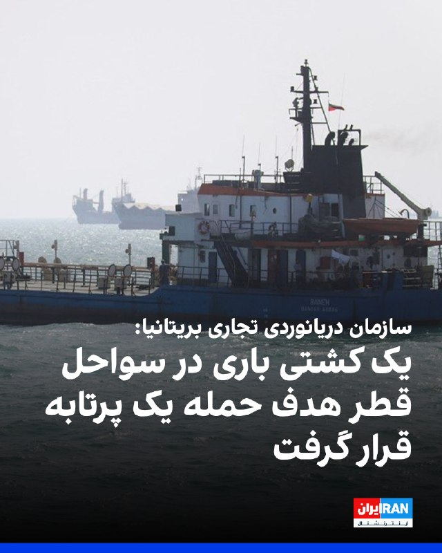

سازمان دریانوردی تجاری بریتانیا خبر داد که یک پرتابه به سمت یک کشتی باری در ۲۳ مایلی سواحل قطر شلیک شده است.
بر اساس این گزارش، آتش‌سوزی در این کشتی مهار شده و هیچ مصدومی گزارش نشده است.
https://iranintl.com/202605106386

## iranintltv — post 336398

  

محمد اکرمی‌نیا، سخنگوی ارتش جمهوری اسلامی گفت: «از این پس کشورهایی که از آمریکا در اعمال تحریم علیه جمهوری اسلامی تبعیت کنند، حتما در عبور از تنگه هرمز با مشکل مواجه می‌شوند.»

او افزود: «ما وضعیت آتش‌بس را همچنان وضعیت جنگی تلقی می‌کنیم.»

او ادامه داد: «رصد تحولات نظامی و تغییر و تحولات منطقه نشان می‌دهد که دشمن همچنان در حال جابجایی تجهیزات و امکانات نظامی است. اما اینکه مدعی هستند ما خواهان صلح و مذاکره هستند، این یک بعد اعلامی است؛ در سیاست‌های کلان خود، آنها به تقویت نظامی‌شان در منطقه می‌پردازند.»
https://iranintl.com/202605101463

## iranintltv — post 336397

  <a href="telegram/content/iranintltv_336397_1778395585.mp4" target="_blank">🎬 Download video</a>

همزمان با موج گسترده اخراج و تعدیل نیرو در ایران، احمد میدری، وزیر تعاون، کار و رفاه اجتماعی، از پیام اخیر منسوب به مجتبی خامنه‌ای قدردانی کرد و آن را «مرهمی» بر دغدغه‌ها و چالش‌های جامعه کارگری دانست. در این پیام بر اولویت مصرف کالاهای ساخت داخل و پرهیز صاحبان کسب‌وکار از تعدیل و جداسازی نیروی کار تا حد امکان تاکید شده است.
جزییات بیشتر با روزبه بوالهری، خبرنگار ایران‌اینترنشنال
@iranintltv

## iranintltv — post 336396

  <a href="telegram/content/iranintltv_336396_1778395587.mp4" target="_blank">🎬 Download video</a>

روزنامه اعتماد گزارش داد قیمت برخی اقلام دارویی در ایران طی هفته‌های اخیر بین ۳۰ تا ۳۰۰ درصد افزایش یافته و بیماران، به‌ویژه مبتلایان به سرطان و بیماری‌های خاص، با بحران تامین دارو روبه‌رو هستند.
گفت‌وگو با کیارش آرامش، پزشک و متخصص پزشکی اجتماعی و اخلاق زیستی
@iranintltv

## iranintltv — post 336395

  <a href="telegram/content/iranintltv_336395_1778395588.mp4" target="_blank">🎬 Download video</a>

فیلم «سرحد» ساخته پرویز صیاد، سینماگر و هنرمند پیشکسوت ایرانی، همزمان با تاسیس بنیاد میراث هنری پرویز صیاد در لس‌آنجلس به نمایش درآمده است. این فیلم که سال ۱۳۶۶ ساخته شد، امروز با نگاهی پیش‌گویانه، روایت‌هایی آشنا از زندگی و دغدغه‌های جامعه مهاجران ایرانی را بازتاب می‌دهد.
نیلوفر منصوری، خبرنگار ایران‌اینترنشنال، گزارش می‌دهد
@iranintltv

## iranintltv — post 336394

  <a href="telegram/content/iranintltv_336394_1778395590.mp4" target="_blank">🎬 Download video</a>

ایرانیان با برگزاری تجمعی مقابل ساختمان شهرداری کلگری کانادا، به قطع اینترنت و تشدید روند اعدام‌ها در ایران اعتراض کردند. حمایت از شاهزاده رضا پهلوی و شعار «یک ملت در گروگان» از محورهای اصلی این تجمع اعتراضی بود.
سپیدار ولیان، خبرنگار ایران‌اینترنشنال، گزارش می‌دهد
@iranintltv

## iranintltv — post 336393

  

مهدی زحمتکش، رییس انجمن داروسازان خراسان رضوی گفت: «با کمبود داروی بیماران خاص و صعب العلاج، اعصاب، قلبی و تنفسی مواجهیم و قیمت برخی داروها بین ۲۰ تا ۴۰۰ درصد افزایش یافته است.»

او ادامه داد: «در حال حاضر مشکل عمده ما در کمبود دارو، مربوط به داروخانه‌های خاص است که در کار تامین داروهای حیاتی و خاص بیماران سخت درمان (صعب العلاج) هستند.»
https://iranintl.com/202605100169

## iranintltv — post 336390

  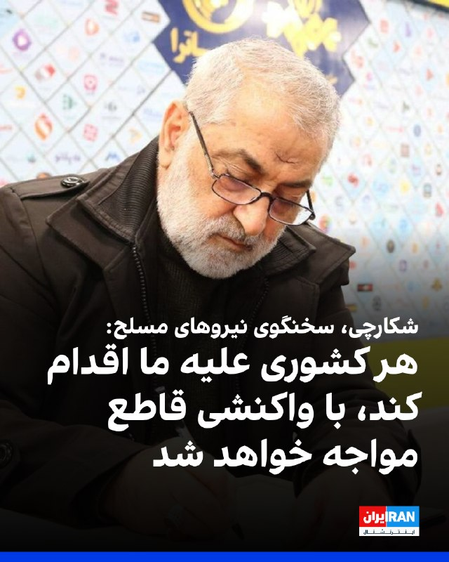

ابوالفضل شکارچی، سخنگوی ارشد نیرو‌های مسلح جمهوری اسلامی گفت: «هر کشوری که علیه ما اقدام کند با واکنش قاطع نیروهای مسلح مواجه خواهد شد.»

او افزود: «با وجود شیطنت‌های آمریکا، الحمدلله ابتکار عمل در دست نیرو‌های مسلح ماست و توانمندی رزمندگان در سطح بسیار خوبی قرار دارد.»
https://iranintl.com/202605102953

## iranintltv — post 336389

  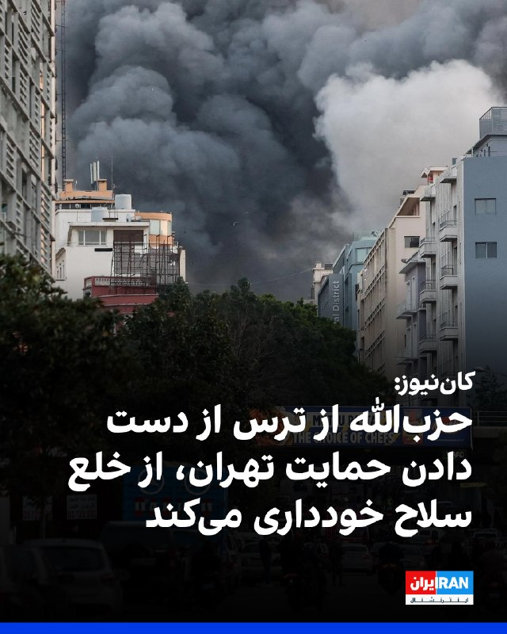

کان‌نیوز به نقل از یک مقام ارشد ارتش اسرائیل گزارش داد در پی تحولات منطقه‌ای و ادامه تماس‌ها میان اسرائیل و لبنان، حزب‌الله تحت فشار فزاینده‌ای قرار دارد، اما این گروه نگران است پشتیبانی جمهوری اسلامی را از دست بدهد و به همین دلیل از کنار گذاشتن سلاح خودداری می‌کند.
طبق این گزارش، برآورد نهادهای امنیتی اسرائیل این است که حزب‌الله با نگرانی تحولات سیاسی و فشارهای بین‌المللی را دنبال می‌کند و بیم دارد توافق احتمالی آینده میان اسرائیل و لبنان به اقدام دولت لبنان علیه این گروه و تلاش برای کاهش قدرت و نفوذ آن در کشور منجر شود.

https://iranintl.com/202605101546

## iranintltv — post 336388

  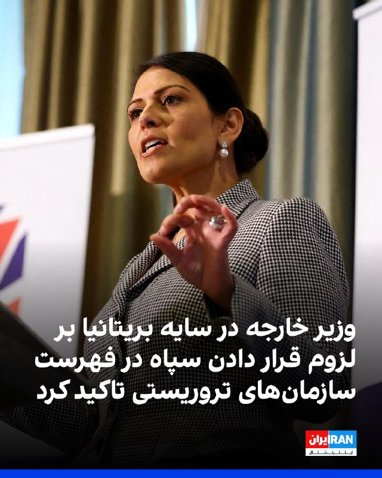

پریتی پتل، نماینده پارلمان بریتانیا و وزیر خارجه در سایه، با انتقاد شدید از «سکوت شرم‌آور» دولت این کشور در برابر «جنایات» جمهوری اسلامی،‌ گفت لندن باید سپاه پاسداران را به دلیل «جنایاتش و تهدید تروریستی دولتی علیه بریتانیا» در فهرست سازمان‌های تروریستی قرار می‌داد.
پتل افزود با اشاره به ادامه «جنایات وحشیانه رژیم جمهوری اسلامی»، تاکید کرد که نباید کسانی را که در برابر سرکوب، شکنجه، خشونت و قتل برای آزادی‌های خود مبارزه می‌کنند، فراموش کرد و خواستار موضع‌گیری قاطع‌تر دولت بریتانیا شد.

https://iranintl.com/202605106342

---
📅 بروزرسانی: 1405/02/20 07:44
---

## iranintltv — post 336386

  <a href="telegram/content/iranintltv_336386_1778386479.mp4" target="_blank">🎬 Download video</a>

ویدیوهای دریافتی نشان می‌دهد جمعی از ایرانیان آلمان در حمایت از مردم ایران و در اعتراض به قطعی اینترنت در ایران، روز شنبه ۱۹ اردیبهشت تجمعی در هامبورگ برگزار کردند. آن‌ها با سر دادن شعار «این همه سال جنایت، مرگ بر این ولایت» علیه اقدامات سرکوبگرانه جمهوری اسلامی واکنش نشان دادند.
@iranintltv

## iranintltv — post 336385

  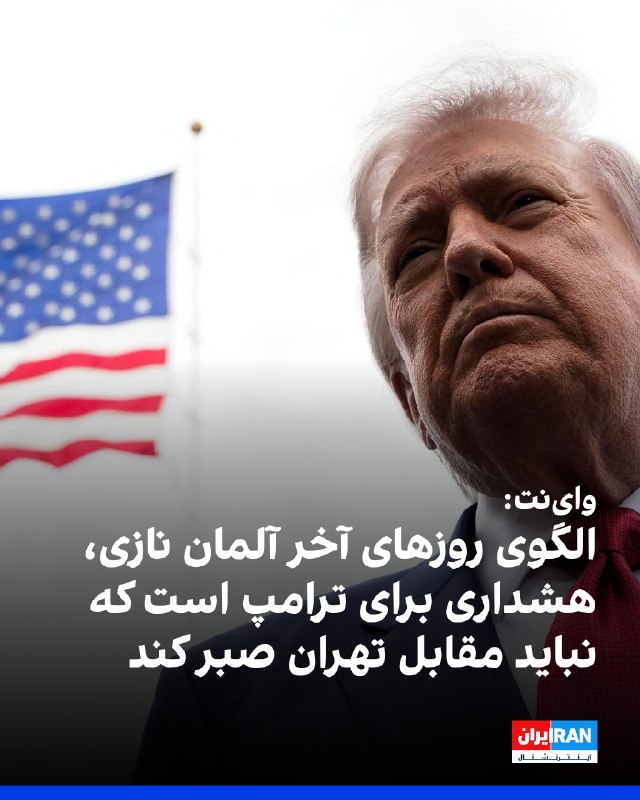

وای نت در تحلیلی به نوشته سور پلاکر، سردبیر ارشد اقتصادی این روزنامه، با مقایسه وضعیت کنونی جمهوری اسلامی با روزهای آخر آلمان نازی، هشدار داد ترامپ برای رفع تهدید جمهوری اسلامی نباید منتظر تغییر منطقی رویکرد تهران و یا خیزش مردم علیه حکومت بماند.
این مطلب نوشت: «در هفته‌های اخیر، ترامپ توافق‌هایی معقول به حکومت ایران پیشنهاد کرده است تا به جنگ پایان دهد. تندروها در میان رهبران حکومت، با وجود ضربه‌هایی که ایرانیان متحمل شده‌اند و در جنگ با ایالات متحده و اسرائیل همچنان متحمل خواهند شد، این پیشنهادها را با تمسخر رد کرده‌اند.»
وای‌نت هشدار داد: «اگر ترامپ تصمیم بگیرد با شکیبایی منتظر بماند تا آنان از تعصب و افراط‌گرایی خود دست بکشند، ممکن است دریابد که صبرش بی‌نتیجه بوده است. این همان درس سختی است که تاریخ اروپا ۸۱ سال پیش لازم داشت.»
این تحلیل با اشاره به اینکه آلمانی‌ها با وجودی که ایمانشان را به هیتلر و حکومت نازی‌ها از دست داده بودند، شورش نکردند و خودشان نازیسم را سرنگون نکردند، گفت حکومت نازی تا زمانی که سربازان متفقین با زور بر درهای مقرهایشان کوبیدند، به سیاست‌های تهدیدآمیز و سرکوب‌گرانه خود ادامه داد.

## iranintltv — post 336384

  <a href="telegram/content/iranintltv_336384_1778386481.mp4" target="_blank">🎬 Download video</a>

مصطفی پوردهقان، نماینده مجلس، در گفت‌وگویی با «اقتصاد۱۲۰» درباره وضعیت اقتصادی ایران، ضمن اشاره به مشاهده آثار رهاسازی نرخ ارز از سال گذشته در فروردین و اردیبهشت ۱۴۰۵، افزود: «اگر کسی امروز بگوید شرایط معیشتی، شرایط نرخ تورم و شرایط ارز به‌خاطر جنگ است، یک دروغگوی محض است.»

## iranintltv — post 336383

  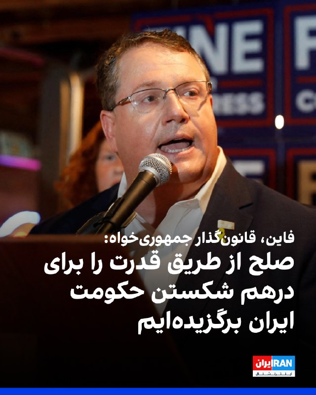

رندی فاین، عضو جمهوری‌خواه مجلس نمایندگان آمریکا، در پستی در ایکس با تاکید بر حمایت خود از سیاست‌های ترامپ علیه جمهوری اسلامی، گفت: «ما راهبرد صلح از طریق قدرت را برای درهم شکستن حکومت ایران انتخاب کرده‌ایم.»
او گفت: «۴۷ سال تلاش کردیم از راه به اصطلاح مودبانه، یعنی دیپلماسی بی‌پایان، پیش برویم؛ در حالی که ایران شعار مرگ بر آمریکا سر می‌داد و جان شمار زیادی از آمریکایی‌ها را گرفت. همکاران دموکرات من از تک‌تک لحظات آن لذت برده‌اند. دیگر بس است.»

https://iranintl.com/202605101678

## iranintltv — post 336382

  <a href="telegram/content/iranintltv_336382_1778386485.mp4" target="_blank">🎬 Download video</a>

ویدیوهای دریافت‌شده نشان می‌دهد ایرانیان مقیم آلمان، روز شنبه ۱۹ اردیبهشت، در حمایت از انقلاب ملی و در اعتراض به اجرای احکام اعدام، سرکوب و قطع اینترنت از سوی جمهوری اسلامی، در اشتوتگارت علیه حکومت تجمع کردند و حمایت خود را از مردم ایران اعلام کردند.

## iranintltv — post 336381

  <a href="telegram/content/iranintltv_336381_1778386487.mp4" target="_blank">🎬 Download video</a>

ویدیوی دریافت‌شده، پرفورمنس اعتراضی جمعی از ایرانیان را در روز شنبه ۱۹ اردیبهشت در بوردوی فرانسه نشان می‌دهد که در آن تلاش شده است سرکوب و کشتار معترضان از سوی جمهوری اسلامی در ۱۸ و ۱۹ دی‌ماه ۱۴۰۴، به تصویر کشیده شود.

## iranintltv — post 336380

  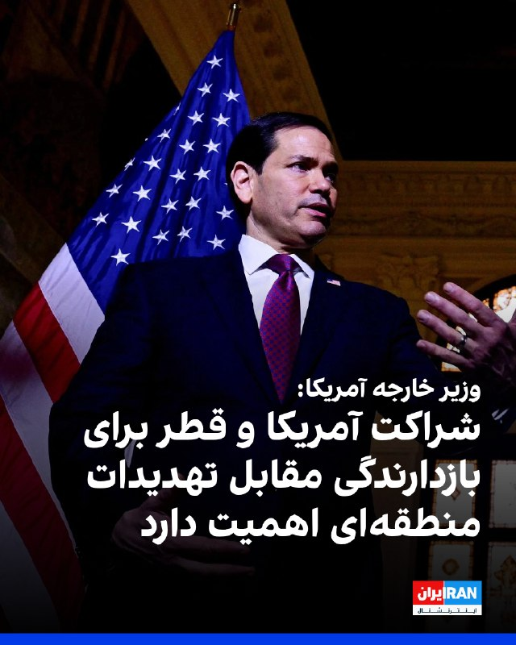

مارکو روبیو، وزیر خارجه آمریکا، در پستی در ایکس با اشاره به دیدارش با نخست‌وزیر و وزیر خارجه قطر گفت در این دیدار درباره حمایت آمریکا از توان دفاعی قطر گفت‌وگو کرده است. او افزود: «شراکت ما برای بازدارندگی در برابر تهدیدها و تقویت ثبات در خاورمیانه اهمیت دارد.»
https://iranintl.com/202605108121

## iranintltv — post 336379

  <a href="telegram/content/iranintltv_336379_1778386491.mp4" target="_blank">🎬 Download video</a>

در پی شیوع هانتاویروس در یک کشتی تفریحی، تاکنون سه نفر جان باخته‌اند. سازمان بهداشت جهانی اعلام کرد تا ۱۸ اردیبهشت، شش مورد قطعی و دو مورد محتمل ابتلا شناسایی شده و کشورهای مختلف در حال ردیابی مسافران و تماس‌های نزدیک آن‌ها هستند.
تدروس ادهانوم، دبیرکل سازمان بهداشت جهانی، در این‌باره گفت: «این ویروس، ویروس کووید نیست.»

---
📅 بروزرسانی: 1405/02/20 03:33
---

## iranintltv — post 336370

در میان هزاران نام، هر کدامشان یک زندگی کامل بودند؛ نه تیتر، نه عدد، نه آمار.
یکی سوت مسابقه در دست داشت،
یکی دانشجوی مکانیک بود،
یکی خرج خانه را می‌داد،
یکی از شیفت پتروشیمی آمده بود،
و یکی هنوز سربازی‌اش تمام نشده بود.

صهبا رشتیان، عرفان عبدی‌پور، مهدی دلخوش، میکائیل دادرس صابری، مجتبی گرمابی، آرمین جشنی‌نژاد، رضا رحمتی و یاسین ضربی‌پور گلستانی

جاویدنامان انقلاب ملی ایرانیان؛
نسلی که حتی با گلوله هم متوقف نشد و از حافظه این سرزمین پاک نمی‌شود.
#جاویدنامان_انقلاب_ملی_ایرانیان

## iranintltv — post 336369

  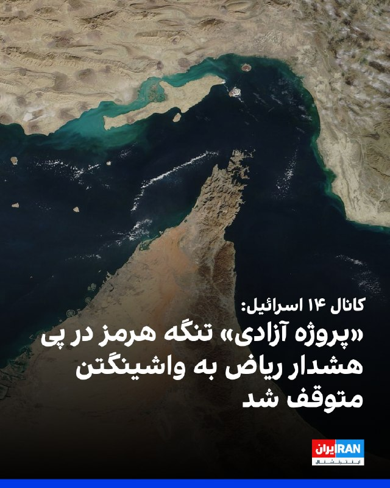

کانال ۱۴ اسرائیل گزارش داد عربستان سعودی هشدار داده بود در صورت ادامه «پروژه آزادی» تنگه هرمز از سوی ترامپ، ریاض اجازه استفاده از حریم هوایی و پایگاه‌های خود را به آمریکا نخواهد داد، زیرا نگران تشدید تنش‌های منطقه‌ای بود. ترامپ، ۳۶ ساعت پس از آغاز این ماموریت، آن را متوقف کرد.
https://iranintl.com/202605096407

## iranintltv — post 336368

  <a href="telegram/content/iranintltv_336368_1778371408.mp4" target="_blank">🎬 Download video</a>

مراد ویسی، تحلیل‌گر ارشد ایران‌اینترنشنال، گفت: «نیویورک‌پست درباره حمله احتمالی هسته‌های خفته جمهوری اسلامی به جام جهانی فوتبال هشدار داد. جام جهانی قرار است به طور مشترک در امریکا ؛ مکزیک و کانادا برگزار شود.»
@iranintltv

## iranintltv — post 336367

  <a href="telegram/content/iranintltv_336367_1778371411.mp4" target="_blank">🎬 Download video</a>

مراد ویسی، تحلیل‌گر ارشد ایران‌اینترنشنال، گفت: «با فراخوان شاهزاده رضا پهلوی، قرار است روز یکشنبه تجمع «یک ملت در گروگان» در شهرهای مختلف جهان برگزار شود. تجمعی در اعتراض به قطع ۱۱ هفته ای اینترنت در ایران، ادامه بازداشت‌های گسترده و افزاش اعدام ها در ایران.»
@iranintltv

---
📅 بروزرسانی: 1405/02/20 02:34
---

## iranintltv — post 336366

  <a href="telegram/content/iranintltv_336366_1778367876.mp4" target="_blank">🎬 Download video</a>

نیویورک تایمز گزارش داد روسیه برای تقویت توان جمهوری اسلامی در برابر حملات آمریکا، کالاهای نظامی و تجاری از طریق دریای خزر به ایران ارسال می‌کند.

بر اساس این گزارش، محصور بودن دریای خزر رصد تبادلات دریایی میان دو کشور را دشوار کرده است.

گفت‌وگو با عطا حسینیان، روزنامه‌نگار
@iranintltv

## iranintltv — post 336365

  <a href="telegram/content/iranintltv_336365_1778367877.mp4" target="_blank">🎬 Download video</a>

با گذشت بیش از دو ماه از قطع اینترنت، جمهوری اسلامی از تاریکی دیجیتال برای کاهش هزینه سرکوب و افزایش میزان خشونت استفاده می‌کند.

همزمان در دانشگاه‌ها نیز معترضان علاوه بر بازداشت، با محرومیت از تحصیل، اخراج و امنیتی شدن فضا روبه‌رو هستند.

گفت‌وگو با رقیه رضایی، روزنامه‌نگار
@iranintltv

## iranintltv — post 336364

  <a href="telegram/content/iranintltv_336364_1778367879.mp4" target="_blank">🎬 Download video</a>

این روزها یک سوال مهم در میان ایرانیان مطرح است: اگر دوباره قیام کردیم و جمهوری اسلامی بار دیگر به کشتار دست زد، چه باید کرد؟ این سوال بسیار تکان‌دهنده است، اما در عین حال دغدغه‌ی بسیاری از ایرانی‌هاست. به نظر می‌رسد با توجه به نشانه‌های کنونی انباشت خشم در جامعه و حرکت به سوی شرایط پیش از قیام، پیدا کردن پاسخ درست برای این سوال یکی از مهم‌ترین دغدغه‌های امروز مردم ایران است.
@iranintltv

## iranintltv — post 336363

  <a href="https://t.me/IranintlTV/336363" target="_blank">📎 Download file</a>

🎧نسخه صوتی سیاست با مراد ویسی: سوال مهم درباره سرنگونی
@iranintlTV

## iranintltv — post 336362

  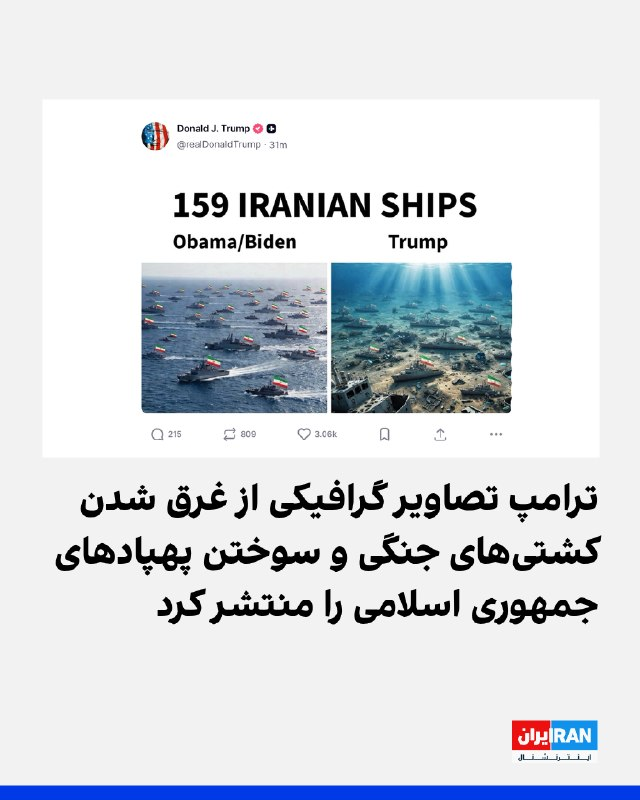

دونالد ترامپ، رییس جمهوری ایالات متحده دو طرح گرافیکی را در تروث سوشال منتشر کرد که در آن ۱۵۹ کشتی جنگی جمهوری اسلامی در زمان بایدن و اوباما بر روی آب و در دوره او غرق شده و در زیر آب به تصویر کشیده شده‌اند.

او در پست دیگری پهپادهای جمهوری اسلامی را در حال سوختن نشان داده است.
https://iranintl.com/202605096279

---
📅 بروزرسانی: 1405/02/20 01:30
---

## iranintltv — post 336361

هم‌زمان با فراخوان شاهزاده رضا پهلوی برای حمایت از مردم ایران در پی خاموشی سراسری اینترنت، بازداشت‌های گسترده و اعدام‌های مداوم، گروهی از ایرانیان روز شنبه مقابل کاخ سفید، دفتر اتحادیه اروپا و دفتر حافظ منافع جمهوری اسلامی تجمع اعتراضی برگزار کردند.

در این تجمع با برزو ارجمند، هنرمند ایرانی، گفت‌وگو شد؛ او از جمله افرادی است که پیش‌تر دستور توقیف اموالش در ایران صادر شده بود.
@iranintltv

## iranintltv — post 336360

  <a href="https://t.me/IranintlTV/336360" target="_blank">📎 Download file</a>

🎧نسخه صوتی چشم‌انداز: ترس مجتبی خامنه‌ای از شناسایی توسط اجنه موساد!
@iranintlTV

## iranintltv — post 336359

  <a href="telegram/content/iranintltv_336359_1778364056.mp4" target="_blank">🎬 Download video</a>

وزارت تجارت ترکیه اعلام کرد صادرات این کشور در ماه گذشته میلادی با بیش از ۲۲ درصد رشد به ۲۵ میلیارد و ۵۰۰ میلیون دلار رسیده است.

بریتانیا بزرگ‌ترین مقصد صادرات ترکیه اعلام شده و پس از آن آمریکا، اسلواکی، چین و آلمان قرار دارند.

گزارش نرگس هورخش، خبرنگار ایران‌اینترنشنال
@iranintltv

---
📅 بروزرسانی: 1405/02/20 00:39
---

## iranintltv — post 336358

  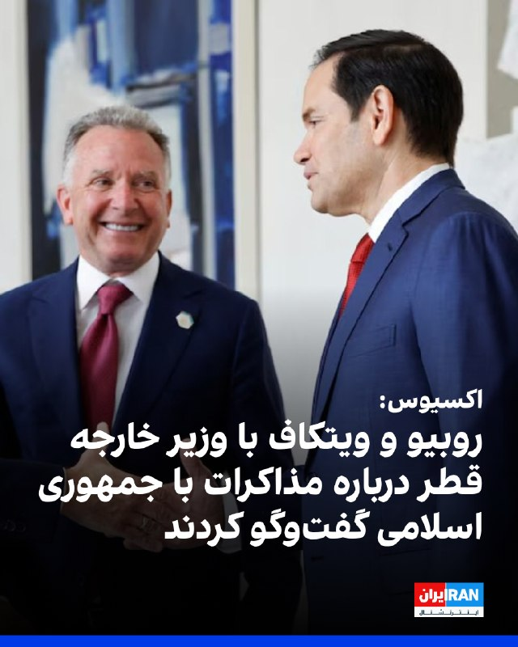

اکسیوس خبر داد که مارکو روبیو، وزیر خارجه آمریکا و استیو ویتکوف، فرستاده ویژه ترامپ، شنبه در میامی با محمد بن عبدالرحمن آل ثانی، نخست‌وزیر و وزیر خارجه قطر درباره مذاکرات با جمهوری اسلامی گفت‌وگو کردند.

پیش‌تر اکسیوس گزارش داده بود که قطر در هفته‌های اخیر تلاش‌های میانجی‌گری پشت‌پرده میان آمریکا و جمهوری اسلامی را از سر گرفته و به یکی از دست‌کم سه کانال غیررسمی ارتباطی میان دو کشور تبدیل شده است.
https://iranintl.com/202605099539

## iranintltv — post 336357

  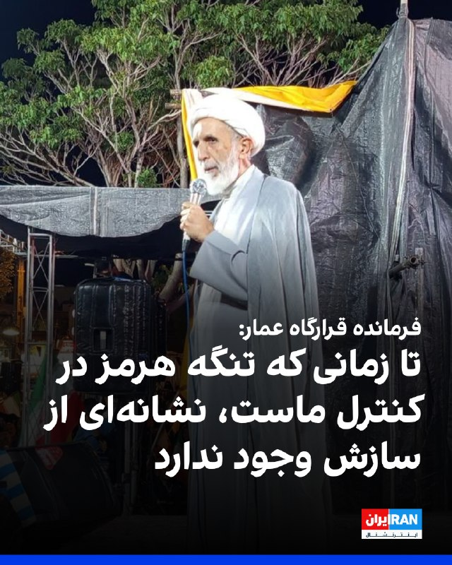

مهدی طائب، فرمانده قرارگاه عمار گفت: «من دیپلمات نیستم و وارد مباحث دیپلماتیک هم نمی‌شوم، اما یک معیار روشن برای تشخیص وجود دارد و تا زمانی که تنگه هرمز در کنترل ما باشد و اجازه عبور آزادانه به دشمن داده نشود، نشانه‌ای از سازش وجود ندارد.»

او ادامه داد: «در گذشته برخی تصور می‌کردند اگر دشمن حمله‌ای انجام دهد همه چیز از بین خواهد رفت، اما امروز نگاه جامعه تغییر کرده و مردم با اعتماد به نفس بیشتری در برابر تهدیدها ایستاده‌اند.»

او افزود: «دشمنان به این نتیجه رسیدند که برای مقابله با این جریان باید مرکز اسلام انقلابی را از بین ببرند و به همین دلیل در دوره‌های مختلف روسای جمهور آمریکا هر کدام بخشی از این برنامه را پیش بردند.»
https://iranintl.com/202605093915

## iranintltv — post 336356

  <a href="https://t.me/IranintlTV/336356" target="_blank">📎 Download file</a>

🎧نسخه صوتی تیتراول با نیوشا صارمی: هشدار نتانیاهو به ترامپ درباره طولانی شدن مذاکرات با تهران
@iranintlTV

## iranintltv — post 336353

دونالد ترامپ، رییس جمهوری ایالات متحده دو طرح گرافیکی را در تروث سوشال منتشر کرد که در آن ۱۵۹ کشتی جنگی جمهوری اسلامی در زمان بایدن و اوباما بر روی آب و در دوره او غرق شده و در زیر آب به تصویر کشیده شده‌اند.

او در پست دیگری پهپادهای جمهوری اسلامی را در حال سوختن نشان داده است.

---
📅 بروزرسانی: 1405/02/19 23:56
---

## iranintltv — post 336352

  <a href="telegram/content/iranintltv_336352_1778358379.mp4" target="_blank">🎬 Download video</a>

ایرانیان ساکن واشینگتن در حمایت از مردم ایران و در اعتراض به موج اعدام‌ها، سرکوب و قطع اینترنت، مقابل کاخ سفید تجمع اعتراضی برگزار کردند و سپس به سمت ساختمان نمایندگی اتحادیه اروپا و دفتر حافظ منافع جمهوری اسلامی در پایتخت ایالات متحده راهپیمایی کردند.

گزارش اردوان روزبه، خبرنگار ایران‌اینترنشنال و گفت‌وگو با برزو ارجمند، بازیگر و احمد باطبی، فعال سیاسی
@iranintltv

## iranintltv — post 336351

  <a href="telegram/content/iranintltv_336351_1778358380.mp4" target="_blank">🎬 Download video</a>

پنج ماه پس از کشتار دی‌ماه، همچنان اطلاعات دقیقی از وضعیت بازداشت‌شدگان انقلاب ملی ایرانیان در دست نیست.
نهادهای حقوق بشری گزارش‌های متعددی درباره صدور احکام ناعادلانه، بازداشت‌های خودسرانه و بی‌خبری از وضعیت بازداشت‌شدگان منتشر کرده‌اند.

گفت‌وگو با پگاه بنی‌هاشمی، پژوهشگر حقوق
@iranintltv

---
📅 بروزرسانی: 1405/02/19 23:42
---

## iranintltv — post 336350

  

خبرگزاری تسنیم، وابسته به سپاه پاسداران، با اشاره به کابل‌های فیبر نوری عبوری از تنگه هرمز و تهدید به اختلال در اقتصاد دیجیتال جهان در صورت آسیب به این کابل‌ها، خواهان اخذ هزینه از شرکت‌های خارجی و الزام غول‌های فناوری نظیر متا، آمازون و مایکروسافت به فعالیت تحت قوانین جمهوری اسلامی شد.

تسنیم نوشت: «کابل‌های تار نوری زیردریایی عبوری از تنگه هرمز روزانه حامل بیش از ۱۰ تریلیون دلار آمریکا تراکنش مالی (شامل پیام‌های سوئیفت، معاملات بورس و تبادلات ارزی) هستند.»

رسانه وابسته به سپاه در ادامه خواستار «اخذ هزینه مجوز اولیه و تمدید سالانه از شرکت‌های خارجی، الزام غول‌های فناوری (متا، آمازون، مایکروسافت) به فعالیت تحت قوانین جمهوری اسلامی و انحصار تعمیر و نگهداری کابل‌ها از سوی شرکت‌های ایرانی شد.»

فارس، دیگر وابسته به سپاه، نیز در گزارشی نوشت که ده‌ها کابل فیبر نوری زیردریایی که آسیا، اروپا و خاورمیانه را به هم متصل می‌کنند، از گذرگاه تنگه هرمز عبور می‌کنند و تهدید کرد که «هرگونه آسیب به این کابل‌ها می‌تواند اختلالات گسترده‌ای در اینترنت و اقتصاد دیجیتال کشورهای مختلف ایجاد کند.»
https://iranintl.com/202605096177

## iranintltv — post 336349

  <a href="telegram/content/iranintltv_336349_1778357551.mp4" target="_blank">🎬 Download video</a>

سیامک آرام، برگزارکننده تجمع اعتراضی واشینگتن، در حاشیه این مراسم به اردوان روزبه، خبرنگار ایران‌اینترنشنال، گفت: «این یک تلاش کوتاه‌مدت نیست؛ یک ماراتن و مبارزه مستمر است و ما باید در شرایط خاموشی داخل ایران، صدای مردم را بازتاب دهیم.»

او افزود: «چهارمین هفته‌ای است که بر آزادی زندانیان سیاسی، قطع اینترنت و استفاده از اعدام به‌عنوان ابزار سرکوب و قتل حکومتی تمرکز کرده‌ایم.»
@iranintltv

## iranintltv — post 336348

  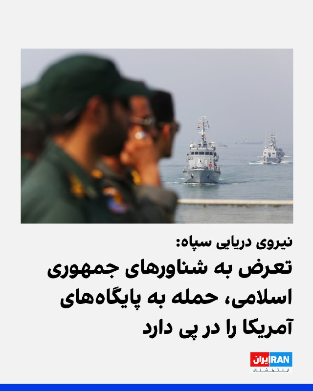

حساب فرماندهی نیروی دریایی سپاه پاسداران در شبکه ایکس نوشت: «هرگونه تعرض به شناورهای نفتکش و تجاری جمهوری اسلامی، تهاجم سنگین علیه یکی از مراکز آمریکایی در منطقه و کشتی‌های دشمن را در پی خواهد داشت.»

سنتکام، فرماندهی مرکزی ایالات متحده، روز شنبه اعلام کرد که از زمان آغاز محاصره بنادر ایران تاکنون، ۵۸ کشتی تجاری تغییر مسیر داده‌اند و نیروهای آمریکایی چهار کشتی را از کار انداخته‌اند تا از ورود یا خروج آنها از این بنادر جلوگیری کنند.
https://iranintl.com/202605097644

## iranintltv — post 336347

  <a href="telegram/content/iranintltv_336347_1778357555.mp4" target="_blank">🎬 Download video</a>

دونالد ترامپ گفت امیدوار است جمهوری اسلامی پاسخ خود به پیشنهاد آمریکا را تا پایان روز شنبه ارائه دهد.

او همچنین هشدار داد در صورت نهایی نشدن توافق، ممکن است ایالات متحده رویکرد متفاوتی در پیش بگیرد.

گفت‌وگو با میثم مهرانی، تحلیل‌گر سیاسی
@iranintltv

## iranintltv — post 336346

  <a href="telegram/content/iranintltv_336346_1778357557.mp4" target="_blank">🎬 Download video</a>

ایرانیان ساکن واشینگتن در حمایت از مردم ایران و در اعتراض به موج اعدام‌ها، سرکوب و قطع اینترنت تجمع اعتراضی برگزار کردند.

گزارش اردوان روزبه، خبرنگار ایران‌اینترنشنال و گفت‌وگو با سیامک آرام، برگزارکننده
@iranintltv

## iranintltv — post 336345

  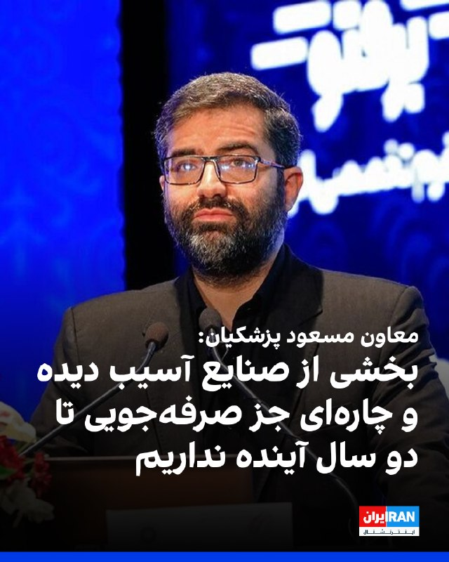

اسماعیل سقاب اصفهانی، معاون مسعود پزشکیان و رییس سازمان بهینه‌سازی انرژی گفت: «واقع‌بینانه که نگاه کنیم آسیب‌هایی به زیرساخت‌های کشور و شبکه گاز و سوخت ما وارد شده و در کنار تلاش مسئولان چاره‌ای جز صرفه‌جویی در یک‌ونیم تا دو سال آینده نداریم.»

او افزود: «قسمتی از ظرفیت تولید بنزین ما با مشکل مواجه شده و صنایع فولادی و پتروشیمی دچار خسارت شدند.»
https://iranintl.com/202605096101

---
📅 بروزرسانی: 1405/02/19 23:02
---

## iranintltv — post 336344

  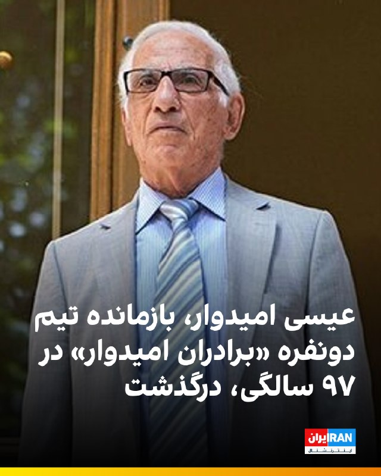

🔻رسانه‌های ایران خبر داده‌اند که عیسی امیدوار، بازمانده تیم دونفره «برادران امیدوار» که ۷۲ سال پیش با موتور به سفر دور دنیا رفتند، در سن ۹۷ سالگی درگذشت.

🔹پیش از این خبر رسیده بود که او به علت بیماری و کهولت سن در بیمارستان بستری شده است. عیسی امیدوار متولد ۱۳۰۸ در شهر طالقان بود.

🔹عبدالله امیدوار، برادر او، در تیر ۱۴۰۱ در شیلی درگذشت. نخستین جهانگردان معاصر ایرانی در دهه ۳۰ خورشیدی به این سفر رفتند.

🔹برادران امیدوار در سال ۱۳۳۳ سفر دور دنیای خود را آغاز کردند. آنها در این سفر ۱۰ ساله که ابتدا با موتور شروع شد، از بکرترین مناطق جهان آن سال‌ها عبور کردند.

@iranintltvsport

---
📅 بروزرسانی: 1405/02/19 22:26
---

هیچ پیام جدیدی در این بروزرسانی ارسال نشد.

---
📅 بروزرسانی: 1405/02/19 22:21
---

## iranintltv — post 336343

  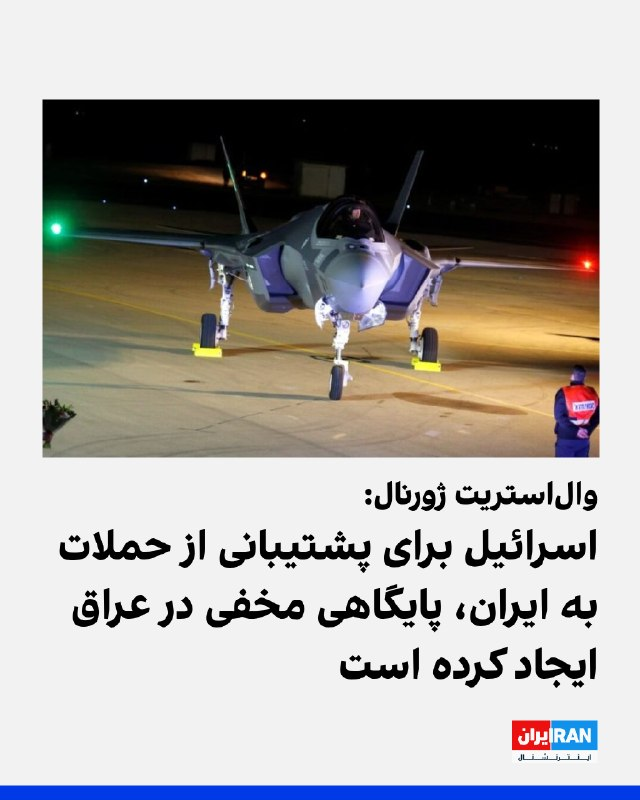

وال‌استریت ژورنال به نقل از مقام‌های آمریکایی نوشت که اسرائیل یک پایگاه نظامی مخفی در صحرای عراق ایجاد کرده تا از حملات هوایی به ایران پشتیبانی کند.

بر اساس این گزارش، در اوایل جنگ ایران، نیروهای عراقی نزدیک بود آن را کشف کنند که اسرائیل حملات هوایی علیه آنان انجام داد.
https://iranintl.com/202605091678

## iranintltv — post 336342

  <a href="telegram/content/iranintltv_336342_1778352717.mp4" target="_blank">🎬 Download video</a>

مهدی مهدوی‌آزاد، در برنامه «چشم‌انداز» گفت اظهارات سالار ولایتمدار، عضو کمیسیون امنیت ملی مجلس، درباره مخفی نگه داشتن تصاویر مجتبی خامنه‌ای برای جلوگیری از آسیب «اجنه و علوم غریبه» نشان می‌دهد بخشی از ساختار حکمرانی جمهوری اسلامی همچنان بر پایه خرافه، دعا، طلسم و رمل عمل می‌کند.
@iranintltv

## iranintltv — post 336341

  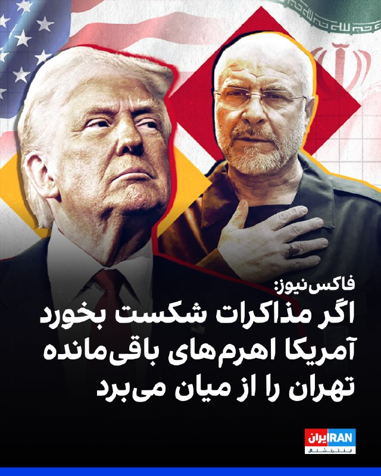

فاکس‌نیوز گزارش داد اگر مذاکرات واشینگتن با جمهوری اسلامی شکست بخورد، احتمالا ایالات متحده به‌سرعت برای تضعیف توانایی‌های نظامی تهران اقدام خواهد کرد.

این رسانه آمریکایی به نقل از سپهبد بازنشسته نیروی هوایی آمریکا، دیوید دپتولا، نوشت که اگر مذاکرات فروبپاشد، آمریکا تلاش می‌کند اهرم‌های باقی‌مانده تهران را از میان ببرد.

او گفت: «توانایی‌هایی که در مرکز توجه قرار خواهند گرفت، همان‌هایی هستند که ایران برای ایجاد اهرم فشار و اجبار از آن‌ها استفاده می‌کند: موشک‌های بالستیک، موشک‌های کروز، سامانه‌های پدافند هوایی، تجهیزات حمله دریایی، شبکه‌های فرماندهی و کنترل، زیرساخت‌های سپاه پاسداران، کانال‌های پشتیبانی نیروهای نیابتی، و تاسیسات مرتبط با هسته‌ای.»

اولیویا ولز، سخنگوی کاخ سفید، به فاکس‌نیوز دیجیتال گفت: «رئیس‌جمهور ترامپ همه کارت‌ها را در اختیار دارد و عاقلانه همه گزینه‌ها را روی میز نگه می‌دارد تا اطمینان حاصل شود ایران هرگز نتواند به سلاح هسته‌ای دست پیدا کند.»
https://iranintl.com/202605096614

---
📅 بروزرسانی: 1405/02/19 21:25
---

## iranintltv — post 336340

  <a href="telegram/content/iranintltv_336340_1778349323.mp4" target="_blank">🎬 Download video</a>

سی‌ان‌ان با اشاره به رقابت جناح‌های سیاسی در ایران گزارش داد سپاه پاسداران نفوذ بیشتری در ساختار قدرت به دست آورده و جریان‌های تندرو کارزار علیه توافق با آمریکا را تشدید کرده‌اند.
گفت‌وگو با جمشید برزگر، روزنامه‌نگار و تحلیل‌گر سیاسی
@iranintltv

## iranintltv — post 336339

  <a href="telegram/content/iranintltv_336339_1778349325.mp4" target="_blank">🎬 Download video</a>

تصاویر ماهواره‌ای از شکل‌گیری یک لکه نفتی حدود ۷۰ کیلومتر مربعی در نزدیکی جزیره خارک خبر می‌دهند. آسوشیتدپرس گزارش داده این آلودگی از بخش غربی جزیره در حال گسترش است و نگرانی‌ها درباره آسیب‌های زیست‌محیطی و امنیت انرژی در شرایط جنگی را افزایش داده است.
گفت‌وگو با احسان دانشور، کارشناس ارشد انرژی و محیط زیست
@iranintltv

## iranintltv — post 336338

  <a href="telegram/content/iranintltv_336338_1778349326.mp4" target="_blank">🎬 Download video</a>

تنش‌ها در خلیج فارس بالا گرفته و محاصره بنادر ایران از سوی آمریکا ادامه دارد. اقدامی که در پاسخ به مسدودسازی تنگه هرمز توسط سپاه پاسداران انجام شده است. سی‌ان‌ان این وضعیت را نمونه‌ای از جنگ چریکی دریایی بر پایه استراتژی جنگ نامتقارن توصیف کرد.
گفت‌وگو با فرزین ندیمی، پژوهشگر ارشد امور دفاعی و امنیتی در موسسه واشینگتن
@iranintltv

## iranintltv — post 336337

  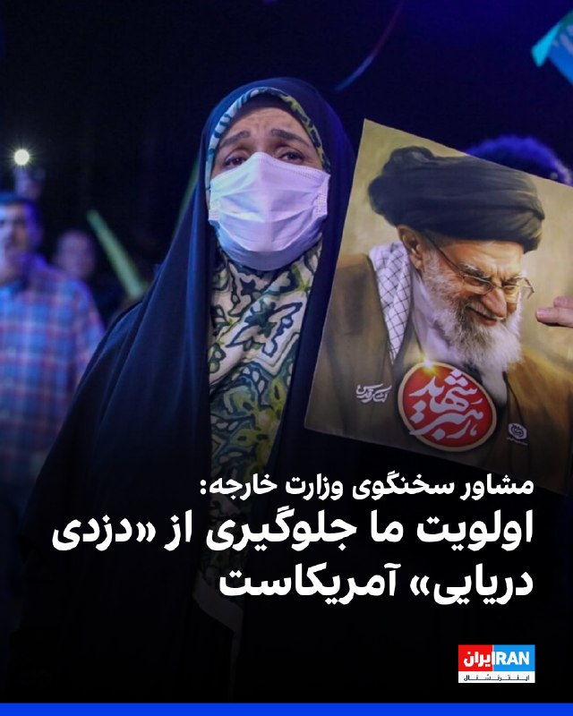

علی صفری، مشاور سخنگوی وزارت خارجه جمهوری اسلامی گفت که اولویت ما توقف جنگ، باز کردن تنگه هرمز و جلوگیری از «دزدی دریایی» آمریکا است.

او افزود: «به همه اقدامات تحریک‌آمیز آمریکا در تنگه هرمز پاسخ داده است.»

صفری همچنین گفت که پاسخ آمریکا به پیشنهاد جمهوری اسلامی دریافت شده و در حال بررسی است، اما نسبت به اقدامات «تحریک‌آمیز» واشینگتن در تنگه هرمز بدبینی وجود دارد.
https://iranintl.com/202605097479

## iranintltv — post 336336

  

دونالد ترامپ در مصاحبه تلفنی با شبکه ال‌سی‌آی گفت که مقام‌های ایرانی همچنان به‌شدت خواهان دستیابی به توافق هستند و او انتظار دارد خیلی زود از جمهوری اسلامی پاسخ دریافت کند.

پیش‌تر اعلام شده بود واشینگتن همچنان در انتظار پاسخ تهران به پیشنهاد آمریکا برای پایان رسمی جنگ است.
https://iranintl.com/202605090761

## iranintltv — post 336335

  

عبدالرضا محمدی طامه، رییس اتحادیه دارندگان اتوسرویس، تعمیرگاه، پارکینگ و کارواش خودرو به سایت دیده‌بان ایران گفت: «با توجه به شرایط اقتصادی و تورم، نرخ خدمات کارواش نسبت به سال گذشته حدود ۶۰ درصد افزایش داشته است.»

او از کاهش چشمگیر مشتریان خبر داد و افزود: «با این وجود مراجعه به کارواش همچنان انجام می‌شود چرا که تعداد کارواش در سطح تهران آنچنان بالا نیست.»
https://iranintl.com/202605098991

## iranintltv — post 336334

  <a href="https://t.me/IranintlTV/336334" target="_blank">📎 Download file</a>

🎧نسخه صوتی اخبار شبانگاهی | شنبه ۱۹ اردیبهشت
@iranintlTV

## iranintltv — post 336333

  <a href="telegram/content/iranintltv_336333_1778349330.mp4" target="_blank">🎬 Download video</a>

تیتر اول با نیوشا صارمی، شنبه ۱۹ اردیبهشت
@iranintltv

## iranintltv — post 336332

  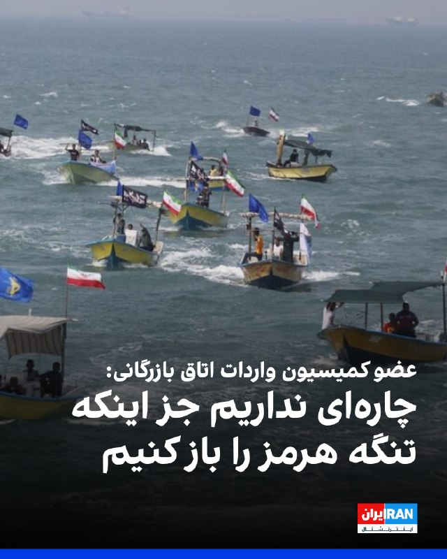

داود رنگی، نایب‌رییس کمیسیون مدیریت واردات اتاق بازرگانی گفت که ما چاره‌ای نداریم جز اینکه تنگه هرمز را به نحوی باز کرده و تجارت را روان کنیم.

او افزود: «اگر ارزش این تنگه برای ما اکنون ۱۰۰ باشد، تا دو ماه دیگر به ۸۰ و تا یک سال دیگر به ۲۰ یا ۳۰ می‌رسد.»

او ادامه داد: «کشورهای حاشیه برای تجارت و صادرات نفت خود مسیرهای دیگری را انتخاب می‌کنند.»

نایب‌رییس کمیسیون مدیریت واردات اتاق بازرگانی گفت: «تنگه هرمز فقط برای ما می‌تواند ارزش داشته باشد و بستن آن به این معنی است که با دست خودمان تجارت خود را در آن منطقه می‌بندیم و خسارت بزرگی به کشور وارد می‌کنیم.»
https://iranintl.com/202605091986

## iranintltv — post 336330

  

بر اساس داده‌های کشتیرانی LSEG، یک نفتکش گاز طبیعی مایع قطر شنبه پس از ترک راس لفانبه‌سوی تنگه هرمز در حال حرکت است و قرار است به بندر قاسم پاکستان برسد.

عبور احتمالی این کشتی از تنگه هرمز، نخستین عبور یک نفتکش گاز طبیعی مایع قطر از این تنگه از زمان آغاز جنگ علیه جمهوری اسلامی خواهد بود.

هنوز شرکت قطرانرژی اظهارنظری در این زمینه نکرده است.
https://iranintl.com/202605093990

## iranintltv — post 336329

  <a href="telegram/content/iranintltv_336329_1778349332.mp4" target="_blank">🎬 Download video</a>

العربیه گزارش داد اسرائیل به آمریکا هشدار داده زمان به نفع جمهوری اسلامی در جریان است و هرگونه وقت‌کشی در مذاکرات و طولانی شدن آن، امنیت کل منطقه را به خطر می‌اندازد.

گزارش اشکان صفایی، خبرنگار ایران‌اینترنشنال
@iranintltv

## iranintltv — post 336328

  

مسعود پزشکیان، رییس دولت جمهوری اسلامی گفت که هدف اصلی دولت اصلاح «فرهنگ عمومی» در حوزه صرفه‌جویی و مدیریت مصرف است تا این رویکرد به‌تدریج از طریق مساجد، مدارس، مراکز بهداشت، اصناف و مجموعه‌های محلی نهادینه شود و افزود نیروهای داوطلب طرح «جان‌فدا» می‌توانند در بهینه‌سازی مصرف انرژی مشارکت کنند.

او ادامه داد: «در شرایط فعلی باید با مشارکت عمومی و مدیریت مصرف، از فشار بر شبکه انرژی کشور جلوگیری شود.»
https://iranintl.com/202605092419

## iranintltv — post 336327

  <a href="telegram/content/iranintltv_336327_1778349334.mp4" target="_blank">🎬 Download video</a>

بلومبرگ گزارش داد جمهوری اسلامی هنوز به طرح پیشنهادی دونالد ترامپ برای بازگشایی تنگه هرمز و پایان محاصره بنادر ایران پاسخ نداده است.
اردوان روزبه، خبرنگار ایران‌اینترنشنال، گزارش می‌دهد
@iranintltv

## iranintltv — post 336326

  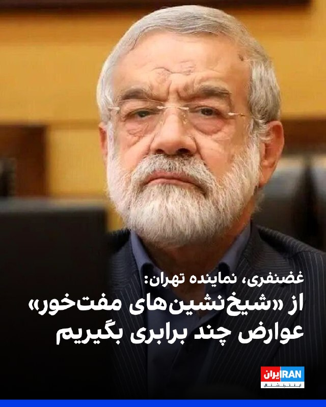

کامران غضنفری، نماینده تهران در مجلس، در شبکه ایکس نوشت: «باید کشورهایی که در شورای امنیت به قطعنامه آمریکا و شیخ‌نشین‌های مفت‌خور خلیج‌فارس درباره تنگه هرمز رای موافق می‌دهند را به‌خاطر داشته باشیم و برای کشتی‌های متعلق به آنها، ممنوعیت تردد یا اخذ عوارض چندبرابری اعمال کنیم.»
https://iranintl.com/202605091369

## iranintltv — post 336325

  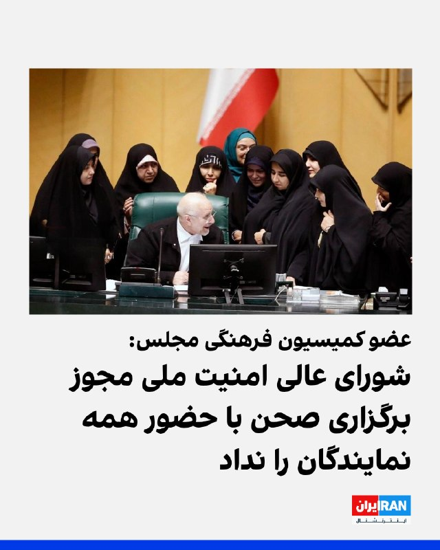

حسنعلی اخلاقی امیری، عضو کمیسیون فرهنگی مجلس، درباره تعطیلی صحن علنی با وجود اعلام آتش‌بس، گفت: «وضعیت امنیتی کشور را شورای عالی امنیت ملی تعیین می‌کند که چه اتفاقی بیفتد یا نیفتد و تاکنون این شورا مجوزی برای برگزاری صحن مجلس با حضور همه نمایندگان صادر نکرده است.»

او ادامه داد: «شورای عالی امنیت ملی مواردی را به‌عنوان مصوبه گذرانده و یکی از این موارد نیز همین عدم برگزاری صحن علنی است.»

این نماینده مجلس ادامه داد: «طبق نظر شورای عالی امنیت ملی تهران در وضعیت قرمز قرار داشته و صلاح نبوده که جلسات مجلس برگزار شود.»
https://iranintl.com/202605094877

## iranintltv — post 336324

  <a href="telegram/content/iranintltv_336324_1778349337.mp4" target="_blank">🎬 Download video</a>

ساعاتی مانده به پایان ضرب‌الاجل ترامپ برای پاسخ جمهوری اسلامی به پیشنهاد توافق، سخنگوی وزارت خارجه گفت تهران عجله‌ای ندارد. همزمان العربیه خبر داد نتانیاهو به دولت آمریکا اعلام کرده توافقی که منجر به برچیدن کامل برنامه هسته‌ای ایران نشود قابل قبول نیست.

گزارشی از مجتبا پورمحسن
@iranintltv

## iranintltv — post 336323

  <a href="telegram/content/iranintltv_336323_1778349339.mp4" target="_blank">🎬 Download video</a>

مهدی تاج، رییس فدراسیون فوتبال ایران، اعلام کرد برای حضور در جام جهانی آمریکا ۱۰ شرط به فیفا ارائه شده است و صدور ویزا برای تمامی بازیکنان و اعضای تیم فوتبال که سابقه خدمت در سپاه پاسداران دارند، از جمله این شروط است.
گفت‌وگو با مزدک میرزایی، عضو تحریریه ایران‌اینترنشنال
@iranintltv

## iranintltv — post 336322

  <a href="telegram/content/iranintltv_336322_1778349340.mp4" target="_blank">🎬 Download video</a>

وزارت دفاع آمریکا ده‌ها تصویر، ویدیو و فایل صوتی مربوط به مشاهده اشیای ناشناس پرنده و پدیده‌های غیرعادی را از حالت محرمانه خارج کرده است. این اسناد شامل گزارش‌های عملیاتی ارتش، داده‌های راداری و پرونده‌های اف‌بی‌آی و ناساست و نشان می‌دهد ارتش آمریکا سال‌ها با پدیده‌هایی مواجه بوده که توضیح روشنی برای آن‌ها ارائه نشده است.
فرشاد متقی، عضو تحریریه ایران‌اینترنشنال، در «پیوست» به این موضوع می‌پردازد
@iranintltv

## iranintltv — post 336321

  

لیندسی گراهام، سناتور جمهوری‌خواه، در حساب ایکس خود نوشت که هرگونه توافق با جمهوری اسلامی باید پایان حمایت از تروریسم و ​​حزب‌الله را تضمین کند.

او اضافه کرد که توافق باید به‌روشنی تصریح کند که ادامه حمایت جمهوری اسلامی از نیروهای نیابتی خود با شدیدترین پیامدها روبه‌رو خواهد شد.
https://iranintl.com/202605097885

## iranintltv — post 336320

  

حساب سنتکام در ایکس اعلام کرد که از زمان آغاز محاصره بنادر ایران تاکنون، ۵۸ کشتی تجاری تغییر مسیر داده‌اند و نیروهای آمریکایی چهار کشتی را از کار انداخته‌اند تا از ورود یا خروج آنها از این بنادر جلوگیری کنند.

با وجود تعلیق موقت «پروژه آزادی» از سوی ترامپ، محاصره دریایی بنادر جنوب ایران از سوی ارتش ایالات متحده همچنان ادامه دارد.
https://iranintl.com/202605096339

---
📅 بروزرسانی: 1405/02/19 20:59
---

## Configir98 — post 8458

⭕️ مجدد
🤩

0️⃣
0️⃣
6️⃣ تا کانفیگ اختصاصی 
🎁داخل ربات شارج شده

همین الان
با دعوت دوستاتون یک سرور اختصاصی به حجم 
🚀 
0️⃣
0️⃣
8️⃣ مگابایت
🚀 دریافت کنین 
💎

😀 @ConfigFreeiR_Bot

## Configir98 — post 8457

  <a href="https://t.me/Configir98/8457" target="_blank">📎 Download file</a>

🛜 𝗡𝗽𝘃 𝗧𝘂𝗻𝗻𝗲𝗹 𝗡𝗮𝗽𝘀𝘁𝗲𝗿𝗻𝗲𝘁𝗩

🛡️ Password: @Configir98

✅ @Configir98

---
📅 بروزرسانی: 1405/02/19 20:42
---

## Configir98 — post 8456

🔐 𝗩𝟮𝗿𝗮𝘆𝗡𝗚 
➕ 𝗣𝘀𝗶𝗽𝗵𝗼𝗻 
📱

socks://Og@130.185.75.82:9595#https://t.me/Configir98

✅ @Configir98

## Configir98 — post 8455

🔐 𝗩𝟮𝗿𝗮𝘆𝗡𝗚 
➕ 𝗣𝘀𝗶𝗽𝗵𝗼𝗻 
📱

vless://4d8b0067-1d60-43de-9538-722d7476921c@snapp.ir:80?path=%2F&security=none&encryption=none&host=mypassvps-b1eed1fa2e-xprojer.apps.ir-central1.arvancaas.ir&type=ws#https://t.me/Configir98

✅ @Configir98

## Configir98 — post 8454

🖤 فروش کانفینگ مخصوص شرایط 
🇮🇷

1 GB  درصد تخفیف ۱۰
➡️toman  300

⚡️قیمت همکاری برای همکاران محترم داخل ربات شارژ شد 

⚡️تست بخاطر شرایط موجود نمی‌باشد درخواست نکنین 
🙏

خرید فقط از طریق محصولات دیگر داخل بات
❤️

➡️ https://t.me/Admin starling

## VIPV2rayNGNP — post 17249

⭕️
0️⃣
0️⃣
9️⃣ تا کانفیگ اختصاصی 
🎁داخل ربات شارج شده

همین الان
میتونین با دعوت دوستاتون یک سرور اختصاصی به حجم 
🚀 
0️⃣
0️⃣
8️⃣ مگابایت
🚀 دریافت کنین 
💎

😀 @ConfigFreeiR_Bot

## VIPV2rayNGNP — post 17248

🏳 V2rayng + Psiphon 
📱

ترکیبی متصل:

socks://Og@130.185.75.82:9595#vipV2rayNGnp

لینک آموزش کلیک کن

🦋 Channel : @vipV2rayNGnp

## VIPV2rayNGNP — post 17247

🏳 V2rayng + Psiphon 
📱

ترکیبی متصل:

socks://Og@62.220.126.92:30871#vipV2rayNGnp

لینک آموزش کلیک کن

🦋 Channel : @vipV2rayNGnp

## VIPV2rayNGNP — post 17246

🏳 V2rayng + Psiphon 
📱

vless://4d8b0067-1d60-43de-9538-722d7476921c@snapp.ir:80?path=%2F&security=none&encryption=none&host=mypassvps-b1eed1fa2e-xprojer.apps.ir-central1.arvancaas.ir&type=ws#vipV2rayNGnp

لینک آموزش کلیک کن

🦋 Channel : @vipV2rayNGnp

## VIPV2rayNGNP — post 17245

🚀
🚀فروش کانفینگ مخصوص شرایط

⚡️هر گیگ 300 ت
❤️

⚡️قیمت همکاری داخل ربات شارژ شد

⚡️تست نداریم بخاطر شرایط کانفینگ(افراد سود جو)

🔥خرید فقط از طریق محصولات دیگر داخل بات

🛫https://t.me/ Admi

## VIPV2rayNGNP — post 17244

🔐 𝗩𝟮𝗿𝗮𝘆𝗡𝗚 
➕ 𝗣𝘀𝗶𝗽𝗵𝗼𝗻 
📱

vless://4d8b0067-1d60-43de-9538-722d7476921c@snapp.ir:80?path=%2F&security=none&encryption=none&host=mypassvps-b1eed1fa2e-xprojer.apps.ir-central1.arvancaas.ir&type=ws#vipV2rayNGnp

👻@VIPV2rayNGNP

## VIPV2rayNGNP — post 17243

𝗣𝘀𝗶𝗽𝗵𝗼𝗻 𝗣𝗿𝗼𝘅𝘆

Host:  93.126.6.70
Port:  3128

⏫ @VIPV2rayNGNP

---
📅 بروزرسانی: 1405/02/19 19:39
---

## Configir98 — post 8453

⚡️ 𝗣𝘀𝗶𝗽𝗵𝗼𝗻 𝗣𝗿𝗼𝘅𝘆

Host: 93.126.6.70
Port: 3128

✅ @Configir98

## Configir98 — post 8452

🔐 𝗩𝟮𝗿𝗮𝘆𝗡𝗚 
➕ 𝗣𝘀𝗶𝗽𝗵𝗼𝗻 
📱

vless://4d8b0067-1d60-43de-9538-722d7476921c@snapp.ir:80?path=%2F&security=none&encryption=none&host=mypassvps-b1eed1fa2e-xprojer.apps.ir-central1.arvancaas.ir&type=ws#https://t.me/Configir98

✅ @Configir98

## Configir98 — post 8451

  <a href="https://t.me/Configir98/8451" target="_blank">📎 Download file</a>

🛜 𝗡𝗽𝘃 𝗧𝘂𝗻𝗻𝗲𝗹 𝗡𝗮𝗽𝘀𝘁𝗲𝗿𝗻𝗲𝘁𝗩

🛡️ Password: @Configir98

✅ @Configir98

## VIPV2rayNGNP — post 17242

  <a href="https://t.me/VIPV2rayNGNP/17242" target="_blank">📎 Download file</a>

⚡️ NapsternetV Config

🔒 Password : @VIPV2rayNGNP

👑 @VIPV2rayNGNP

---
📅 بروزرسانی: 1405/02/19 18:43
---

## VIPV2rayNGNP — post 17240

🏳 V2rayng + Psiphon 
📱

vless://4d8b0067-1d60-43de-9538-722d7476921c@snapp.ir:80?path=%2F&security=none&encryption=none&host=mypassvps-b1eed1fa2e-xprojer.apps.ir-central1.arvancaas.ir&type=ws#vipV2rayNGnp

لینک آموزش کلیک کن

🦋 Channel : @vipV2rayNGnp

## VIPV2rayNGNP — post 17239

  <a href="https://t.me/VIPV2rayNGNP/17239" target="_blank">📎 Download file</a>

⚡️ NapsternetV Config

🔒 Password : @VIPV2rayNGNP

👑 @VIPV2rayNGNP

---
📅 بروزرسانی: 1405/02/19 18:13
---

## VIPV2rayNGNP — post 17238

@VIPV2rayNGNP ⚡️.npvt

---
📅 بروزرسانی: 1405/02/19 17:36
---

## mitivpn — post 16823

  <a href="https://t.me/mitivpn/16823" target="_blank">📎 Download file</a>

📎 Document

## Configir98 — post 8450

  <a href="https://t.me/Configir98/8450" target="_blank">📎 Download file</a>

🛜 𝗡𝗽𝘃 𝗧𝘂𝗻𝗻𝗲𝗹 𝗡𝗮𝗽𝘀𝘁𝗲𝗿𝗻𝗲𝘁𝗩

🛡️ Password: @Configir98

✅ @Configir98

## Configir98 — post 8449

  <a href="https://t.me/Configir98/8449" target="_blank">📎 Download file</a>

🛜 𝗡𝗽𝘃 𝗧𝘂𝗻𝗻𝗲𝗹 𝗡𝗮𝗽𝘀𝘁𝗲𝗿𝗻𝗲𝘁𝗩

🛡️ Password: @Configir98

✅ @Configir98

## Configir98 — post 8448

  <a href="https://t.me/Configir98/8448" target="_blank">📎 Download file</a>

🛜 𝗡𝗽𝘃 𝗧𝘂𝗻𝗻𝗲𝗹 𝗡𝗮𝗽𝘀𝘁𝗲𝗿𝗻𝗲𝘁𝗩

🛡️ Password: @Configir98

✅ @Configir98

## Configir98 — post 8447

  <a href="https://t.me/Configir98/8447" target="_blank">📎 Download file</a>

🛜 𝗡𝗽𝘃 𝗧𝘂𝗻𝗻𝗲𝗹 𝗡𝗮𝗽𝘀𝘁𝗲𝗿𝗻𝗲𝘁𝗩

🛡️ Password: @Configir98

✅ @Configir98

## VIPV2rayNGNP — post 17237

  <a href="https://t.me/VIPV2rayNGNP/17237" target="_blank">📎 Download file</a>

⚡️ NapsternetV Config

🔒 Password : @VIPV2rayNGNP

👑 @VIPV2rayNGNP

## VIPV2rayNGNP — post 17236

  <a href="https://t.me/VIPV2rayNGNP/17236" target="_blank">📎 Download file</a>

⚡️ NapsternetV Config

🔒 Password : @VIPV2rayNGNP

👑 @VIPV2rayNGNP

## VIPV2rayNGNP — post 17235

  <a href="https://t.me/VIPV2rayNGNP/17235" target="_blank">📎 Download file</a>

⚡️ NapsternetV Config

🔒 Password : @VIPV2rayNGNP

👑 @VIPV2rayNGNP

## VIPV2rayNGNP — post 17234

ویتوری متصل تستی

socks://Og@62.220.126.56:30170#vipV2rayNGnp

socks://Og@62.220.126.92:30376#vipV2rayNGnp

@VIPV2rayNGNP

## VIPV2rayNGNP — post 17233

ویتوری متصل تستی vless://44e68526-3852-4495-bc4f-80e80260ed3b@snapp.ir:2086?path=%2F&security=&encryption=none&host=beraghsaontop.dracodcodya.ir&type=ws#vipV2rayNGnp @VIPV2rayNGNP

## VIPV2rayNGNP — post 17232

ویتوری متصل تستی

vless://44e68526-3852-4495-bc4f-80e80260ed3b@snapp.ir:2086?path=%2F&security=&encryption=none&host=beraghsaontop.dracodcodya.ir&type=ws#vipV2rayNGnp

@VIPV2rayNGNP

## VIPV2rayNGNP — post 17231

  <a href="https://t.me/VIPV2rayNGNP/17231" target="_blank">📎 Download file</a>

𝗣𝘀𝗶𝗽𝗵𝗼𝗻 𝗣𝗿𝗼𝘅𝘆

Host : 81.12.107.242
Port : 3030

Host :  93.118.142.196
Port : 8085

Host :  37.32.20.64
Port : 2080

Host : 93.126.6.70
Port : 31

⚡️@VIPV2rayNGNP

## VIPV2rayNGNP — post 17230

𝗣𝘀𝗶𝗽𝗵𝗼𝗻 𝗣𝗿𝗼𝘅𝘆

Host : 81.12.107.242
Port : 3030

Host :  93.118.142.196
Port : 8085

Host :  37.32.20.64
Port : 2080

Host : 93.126.6.70
Port : 31

⚡️@VIPV2rayNGNP

---
📅 بروزرسانی: 1405/02/19 16:12
---

## Configir98 — post 8446

⚡️ 𝗣𝘀𝗶𝗽𝗵𝗼𝗻 𝗣𝗿𝗼𝘅𝘆

Host : 81.12.107.242
Port : 3030

Host :  93.118.142.196
Port : 8085

Host :  37.32.20.64
Port : 2080

Host : 93.126.6.70
Port : 3128

✅ @Configir98

## Configir98 — post 8445

🔐 𝗩𝟮𝗿𝗮𝘆𝗡𝗚 
➕ 𝗣𝘀𝗶𝗽𝗵𝗼𝗻 
📱

vless://799f939b-964b-4416-84ac-18a6ace7fe70@camp.nahidapp.com:443?encryption=none&host=camp.nahidapp.com&path=%2FIF_VPN_Bot&security=tls&type=ws#https://t.me/Configir98

vless://363a6072-05d7-48d5-8f19-312b05fdd9cd@104.18.13.229:2052?security=none&encryption=none&host=chosenflyesqt-q3y28ipf-v3.chosen-fly-esqt.workers.dev&type=ws#https://t.me/Configir98

vless://0146ee19-29eb-400b-b50b-b032bddafd65@camp.nahidapp.com:443?path=%2FIF_VPN_Bot&security=tls&encryption=none&host=camp.nahidapp.com&type=ws#https://t.me/Configir98

✅ @Configir98

## Configir98 — post 8444

🔐 𝗩𝟮𝗿𝗮𝘆𝗡𝗚 
➕ 𝗣𝘀𝗶𝗽𝗵𝗼𝗻 
📱

vless://363a6072-05d7-48d5-8f19-312b05fdd9cd@104.18.13.229:2052?security=none&encryption=none&host=chosenflyesqt-q3y28ipf-v3.chosen-fly-esqt.workers.dev&type=ws#https://t.me/Configir98

✅ @Configir98

## VIPV2rayNGNP — post 17229

🏳 V2rayng + Psiphon 
📱

vless://799f939b-964b-4416-84ac-18a6ace7fe70@camp.nahidapp.com:443?encryption=none&host=camp.nahidapp.com&path=%2FIF_VPN_Bot&security=tls&type=ws#@vipV2rayNGnp

vless://363a6072-05d7-48d5-8f19-312b05fdd9cd@104.18.13.229:2052?security=none&encryption=none&host=chosenflyesqt-q3y28ipf-v3.chosen-fly-esqt.workers.dev&type=ws#@vipV2rayNGnp

vless://0146ee19-29eb-400b-b50b-b032bddafd65@camp.nahidapp.com:443?path=%2FIF_VPN_Bot&security=tls&encryption=none&host=camp.nahidapp.com&type=ws#@vipV2rayNGnp

لینک آموزش کلیک کن

🦋 Channel : @vipV2rayNGnp

## VIPV2rayNGNP — post 17228

🏳 V2rayng + Psiphon 
📱

vless://363a6072-05d7-48d5-8f19-312b05fdd9cd@104.18.13.229:2052?security=none&encryption=none&host=chosenflyesqt-q3y28ipf-v3.chosen-fly-esqt.workers.dev&type=ws#@vipV2rayNGnp

لینک آموزش کلیک کن

🦋 Channel : @vipV2rayNGnp

---
📅 بروزرسانی: 1405/02/19 15:03
---

## Configir98 — post 8443

🔐 𝗩𝟮𝗿𝗮𝘆𝗡𝗚 
➕ 𝗣𝘀𝗶𝗽𝗵𝗼𝗻 
📱

vless://0146ee19-29eb-400b-b50b-b032bddafd65@camp.nahidapp.com:443?path=%2FIF_VPN_Bot&security=tls&encryption=none&host=camp.nahidapp.com&type=ws#https://t.me/Configir98

✅ @Configir98

---
📅 بروزرسانی: 1405/02/19 14:37
---

## Configir98 — post 8442

  <a href="https://t.me/Configir98/8442" target="_blank">📎 Download file</a>

🛜 𝗡𝗽𝘃 𝗧𝘂𝗻𝗻𝗲𝗹 𝗡𝗮𝗽𝘀𝘁𝗲𝗿𝗻𝗲𝘁𝗩

🛡️ Password: @Configir98

✅ @Configir98

## Configir98 — post 8441

اینترنت نسل 5 داره توی کابل و برخی شهر های مهم افغانستان تست و راه اندازی میشه.

👳‍♂️

## VIPV2rayNGNP — post 17227

  <a href="https://t.me/VIPV2rayNGNP/17227" target="_blank">📎 Download file</a>

نسخه جدید فیلترشکن OpenVpn
(آخرین نسخه بدون محدودیت)
@VIPV2rayNGNP

## VIPV2rayNGNP — post 17226

  <a href="https://t.me/VIPV2rayNGNP/17226" target="_blank">📎 Download file</a>

نسخه جدید فیلترشکن V2rayNG
(آخرین نسخه بدون محدودیت)
دانلود با نت ملی
@VIPV2rayNGNP

---
📅 بروزرسانی: 1405/02/19 14:18
---

## VIPV2rayNGNP — post 17225

  <a href="https://t.me/VIPV2rayNGNP/17225" target="_blank">📎 Download file</a>

نسخه جدید فیلترشکن NPV Tuunel
(آخرین نسخه بدون محدودیت)
دانلود با نت ملی
@VIPV2rayNGNP

## VIPV2rayNGNP — post 17224

  <a href="https://t.me/VIPV2rayNGNP/17224" target="_blank">📎 Download file</a>

⚡️ NapsternetV Config

🔒 Password : @VIPV2rayNGNP

👑 @VIPV2rayNGNP

## VIPV2rayNGNP — post 17223

  <a href="https://t.me/VIPV2rayNGNP/17223" target="_blank">📎 Download file</a>

⚡️ NapsternetV Config

🔒 Password : @VIPV2rayNGNP

👑 @VIPV2rayNGNP

## VIPV2rayNGNP — post 17222

🏳 V2rayng + Psiphon 
📱

vless://dfdd43f0-4bcd-49ee-dbb2-99e0a9973679@185.143.235.200:80?path=%2F&security=none&encryption=none&host=auio-b1eed1fa2e-xprojer.apps.ir-central1.arvancaas.ir&type=ws#vipV2rayNGnp

لینک آموزش کلیک کن

🦋 Channel : @vipV2rayNGnp

## VIPV2rayNGNP — post 17220

🚀
🚀فروش کانفینگ مخصوص شرایط

⚡️هر گیگ 300 ت
❤️

⚡️قیمت همکاری داخل ربات شارژ شد

⚡️تست نداریم بخاطر شرایط کانفینگ(افراد سود جو)

🔥خرید فقط از طریق محصولات دیگر داخل بات

🛫https://t.me/ Admin

## VIPV2rayNGNP — post 17219

🏳 V2rayng + Psiphon 
📱

vless://799f939b-964b-4416-84ac-18a6ace7fe70@camp.nahidapp.com:443?encryption=none&host=camp.nahidapp.com&path=%2FIF_VPN_Bot&security=tls&type=ws#@vipV2rayNGnp

لینک آموزش کلیک کن

🦋 Channel : @vipV2rayNGnp

## VIPV2rayNGNP — post 17218

🏳 V2rayng + Psiphon 
📱

socks://Og@62.220.126.56:30170#vipV2rayNGnp

لینک آموزش کلیک کن

🦋 Channel : @vipV2rayNGnp

## VIPV2rayNGNP — post 17217

  <a href="https://t.me/VIPV2rayNGNP/17217" target="_blank">📎 Download file</a>

⚡️ NapsternetV Config

🔒 Password : @VIPV2rayNGNP

👑 @VIPV2rayNGNP

## VIPV2rayNGNP — post 17215

  <a href="https://t.me/VIPV2rayNGNP/17215" target="_blank">📎 Download file</a>

⚡️ NapsternetV Config

🔒 Password : @VIPV2rayNGNP

👑 @VIPV2rayNGNP

## VIPV2rayNGNP — post 17214

مجدد
0️⃣
0️⃣
9️⃣ تا کانفیگ اختصاصی 
🎁داخل ربات شارج شده

همین الان
میتونین با دعوت دوستاتون یک سرور اختصاصی به حجم 
🚀 
0️⃣
0️⃣
8️⃣ مگابایت
🚀 دریافت کنین 
💎

😀 @ConfigFreeiR_Bot

## VIPV2rayNGNP — post 17213

  <a href="https://t.me/VIPV2rayNGNP/17213" target="_blank">📎 Download file</a>

⚡️ NapsternetV Config

🔒 Password : @VIPV2rayNGNP

👑 @VIPV2rayNGNP

## VIPV2rayNGNP — post 17212

صبحتون بخیر رفقا
❤️

## VIPV2rayNGNP — post 17211

  <a href="https://t.me/VIPV2rayNGNP/17211" target="_blank">📎 Download file</a>

⚡️ NapsternetV Config

🔒 Password : @VIPV2rayNGNP

👑 @VIPV2rayNGNP

## VIPV2rayNGNP — post 17209

🏳 V2rayng + Psiphon 
📱

socks://Og@130.185.75.82:9595#@vipV2rayNGnp

socks://Og%3D%3D@130.185.75.82:9595#@vipV2rayNGnp

socks://Og%3D%3D@62.220.126.92:25874#@vipV2rayNGnp

لینک آموزش کلیک کن

🦋 Channel : @vipV2rayNGnp

## VIPV2rayNGNP — post 17208

🏳 V2rayng + Psiphon 
📱

socks://Og@130.185.75.82:9595#@vipV2rayNGnp

socks://Og@130.185.75.82:9595#@vipV2rayNGnp

socks://Og@62.220.126.56:30170#@vipV2rayNGnp

لینک آموزش کلیک کن

🦋 Channel : @vipV2rayNGnp

## VIPV2rayNGNP — post 17207

  <a href="https://t.me/VIPV2rayNGNP/17207" target="_blank">📎 Download file</a>

⚡️ NapsternetV Config

🔒 Password : @VIPV2rayNGNP

👑 @VIPV2rayNGNP

## VIPV2rayNGNP — post 17206

  <a href="https://t.me/VIPV2rayNGNP/17206" target="_blank">📎 Download file</a>

⚡️ NapsternetV Config

🔒 Password : @VIPV2rayNGNP

👑 @VIPV2rayNGNP

## VIPV2rayNGNP — post 17205

دوستاتو آنلاین کن
😍

## VIPV2rayNGNP — post 17204

tg://socks?server=STARLINK8.vayzro.ir&port=42528&user=%40Porteqal3&pass=Portiqal https://t.me/proxy?server=QHMEI.MTP.IPSENTER.NET&port=443&secret=eee28b56c84fb54c3b826db2fab1c96711676f6f676c652e636f6d https://t.me/proxy?server=QHMEI.MTP.IPSENTER.NET&por…

## VIPV2rayNGNP — post 17203

tg://socks?server=STARLINK8.vayzro.ir&port=42528&user=%40Porteqal3&pass=Portiqal

https://t.me/proxy?server=QHMEI.MTP.IPSENTER.NET&port=443&secret=eee28b56c84fb54c3b826db2fab1c96711676f6f676c652e636f6d

https://t.me/proxy?server=QHMEI.MTP.IPSENTER.NET&port=443&secret=eee28b56c84fb54c3b826db2fab1c96711676f6f676c652e636f6d

یک دقیقه زمان بدید وصل میشه❤️

⭐️ @VIPV2rayNGNP

---
📅 بروزرسانی: 1405/02/19 14:11
---

هیچ پیام جدیدی در این بروزرسانی ارسال نشد.

---
📅 بروزرسانی: 1405/02/19 14:09
---

هیچ پیام جدیدی در این بروزرسانی ارسال نشد.

---
📅 بروزرسانی: 1405/02/19 14:06
---

هیچ پیام جدیدی در این بروزرسانی ارسال نشد.

---
📅 بروزرسانی: 1405/02/19 14:03
---

## Configir98 — post 8440

🔐 𝗩𝟮𝗿𝗮𝘆𝗡𝗚 
➕ 𝗣𝘀𝗶𝗽𝗵𝗼𝗻 
📱

vless://799f939b-964b-4416-84ac-18a6ace7fe70@camp.nahidapp.com:443?encryption=none&host=camp.nahidapp.com&path=%2FIF_VPN_Bot&security=tls&type=ws#https://t.me/Configir98

✅ @Configir98

## Configir98 — post 8439

🖤 فروش کانفینگ مخصوص شرایط 
🇮🇷

1 GB  درصد تخفیف ۱۰
➡️toman  300

⚡️قیمت همکاری برای همکاران محترم داخل ربات شارژ شد 

⚡️تست بخاطر شرایط موجود نمی‌باشد درخواست نکنین 
🙏

خرید فقط از طریق محصولات دیگر داخل بات
❤️

➡️ https://t.me/Admin starling

## Configir98 — post 8438

🔐 𝗩𝟮𝗿𝗮𝘆𝗡𝗚 
➕ 𝗣𝘀𝗶𝗽𝗵𝗼𝗻 
📱

vless://799f939b-964b-4416-84ac-18a6ace7fe70@camp.nahidapp.com:443?encryption=none&host=camp.nahidapp.com&path=%2FIF_VPN_Bot&security=tls&type=ws#https://t.me/Configir98

✅ @Configir98

<!-- MSG END -->

<!-- NAV START -->

<!-- NAV END -->
